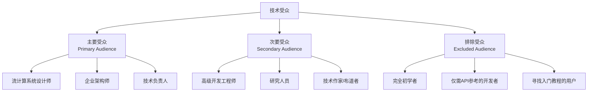

> **状态**: 🔮 前瞻内容 | **风险等级**: 高 | **最后更新**: 2026-04
> 
> 此文档描述的内容处于早期规划阶段，可能与最终实现不符。请以 Apache Flink 官方发布为准。
# AnalysisDataFlow 差异化定位声明

> **版本**: v1.0 | **生效日期**: 2026-04-05 | **状态**: 正式发布
>
> 本文档明确 AnalysisDataFlow 与 Apache Flink 官方文档的差异化价值定位，确立项目作为**流计算深度知识库**的核心身份。

---

## 1. 核心价值主张 (Core Value Proposition)

### 1.1 三维价值模型

```
                    ┌─────────────────────────────────────┐
                    │     AnalysisDataFlow 价值定位        │
                    └──────────────────┬──────────────────┘
                                       │
           ┌───────────────────────────┼───────────────────────────┐
           │                           │                           │
           ▼                           ▼                           ▼
   ┌───────────────┐          ┌───────────────┐          ┌───────────────┐
   │形式化理论深度  │          │  工程模式图谱   │          │  前沿技术探索   │
   │   (Struct/)   │          │ (Knowledge/)  │          │  (Frontier)   │
   └───────────────┘          └───────────────┘          └───────────────┘
           │                           │                           │
           ▼                           ▼                           ▼
   • 进程演算基础               • 设计模式目录          • AI Agent集成
   • 表达能力层次               • 反模式识别            • 流数据库对比
   • 形式化正确性证明           • 技术选型决策树        • Serverless演进
   • 语义等价性论证             • 业务场景映射          • 多模态流处理
```

### 1.2 与官方文档的差异化矩阵

| 维度 | Apache Flink 官方文档 | AnalysisDataFlow |
|------|----------------------|------------------|
| **定位** | 操作手册与API参考 | 理论-工程桥梁与深度分析 |
| **受众** | 全体开发者（含初学者） | 架构师、研究员、高级工程师 |
| **深度** | 功能使用层面 | 设计原理与形式化论证 |
| **广度** | 覆盖全部特性 | 聚焦核心机制与前沿方向 |
| **理论** | 实践导向 | 形式化定义+定理证明 |
| **更新** | 跟随版本发布 | 跟踪前沿研究+工业实践 |
| **结构** | 功能分类组织 | 六段式知识图谱 |

### 1.3 三大核心价值详解

#### 价值一: 形式化理论深度 (Struct/)

**官方文档缺失的内容**:

- 进程演算（CSP, π-calculus, Actor）与 Flink 的语义映射
- Checkpoint 正确性的严格数学证明
- 表达能力层次（L1-L6）的严格划分
- 类型安全的形式化推导

**我们提供的独特价值**:

```
形式化定义 (Definitions) ──→ 定理证明 (Proofs) ──→ 工程映射 (Mappings)
        │                           │                       │
        ▼                           ▼                       ▼
  6,263+ 形式化元素          1,198 个定理          理论到代码的桥梁
```

#### 价值二: 工程模式图谱 (Knowledge/)

**官方文档缺失的内容**:

- 设计模式的系统化分类与对比
- 反模式的识别与规避策略
- 真实业务场景的端到端建模
- 技术选型的决策框架

**我们提供的独特价值**:

- **45个设计模式**: 从理论到代码的完整映射
- **30个业务场景**: 金融、IoT、电商、游戏等垂直领域
- **10个反模式**: 生产事故的根因分析与规避
- **决策树网络**: 可视化技术选型路径

#### 价值三: 前沿技术探索

**官方文档未覆盖的方向**:

| 领域 | 具体内容 |
|------|----------|
| AI 集成 | FLIP-531 AI Agents、LLM 流式集成、RAG 架构 |
| 流数据库 | RisingWave、Materialize、Timeplus 深度对比 |
| Serverless | 无服务器 Flink 架构与成本优化 |
| 多模态流 | 文本/图像/视频统一流处理架构 |
| Agent 协议 | A2A、MCP、ACP 协议对比与集成 |
| 图流处理 | 时序图神经网络 (TGN) 集成 |

---

## 2. 目标受众重新定义

### 2.1 受众分层模型



### 2.2 主要受众: 流计算系统设计师与架构师

**画像特征**:

- 负责设计或评估流处理架构
- 需要理解底层机制以做出技术决策
- 关注可靠性、性能、成本的权衡
- 需要向团队解释技术选型的依据

**核心需求**:

| 需求 | 对应内容 |
|------|----------|
| 理解 Flink 设计原理 | Struct/04-proofs/ 形式化证明 |
| 技术选型决策支持 | Knowledge/04-technology-selection/ |
| 生产环境检查清单 | Knowledge/07-best-practices/ |
| 前沿技术趋势洞察 | Knowledge/06-frontier/ |

### 2.3 次要受众

**高级开发工程师**:

- 需要深度调优 Flink 作业性能
- 解决复杂的生产问题
- 理解内部机制以优化代码

**研究人员**:

- 流计算理论研究者
- 分布式系统博士生
- 寻找形式化验证案例

**技术布道者**:

- 需要在团队内部分享流计算知识
- 寻找系统化的培训材料

### 2.4 排除受众与引流策略

**完全初学者**:

- **原因**: 本知识库假设读者具备分布式系统和流计算基础
- **引流策略**: 引导至官方 Quick Start 和 tutorials/ 目录

**仅需API参考的开发者**:

- **原因**: 官方文档提供更完整的API参考
- **引流策略**: 在相关章节提供官方文档链接

---

## 3. 与官方文档的关系定位

### 3.1 互补而非替代

```
┌─────────────────────────────────────────────────────────────────┐
│                      流计算知识生态                              │
├─────────────────────────────────────────────────────────────────┤
│                                                                  │
│   Apache Flink 官方文档              AnalysisDataFlow            │
│   ━━━━━━━━━━━━━━━━━━━━━━━━           ━━━━━━━━━━━━━━━━           │
│                                                                  │
│   📖 "How to use"                    🔬 "Why it works"          │
│   📖 "API Reference"                 🔬 "Formal Proof"          │
│   📖 "Quick Start"                   🔬 "Design Patterns"       │
│   📖 "Configuration"                 🔬 "Frontier Research"     │
│                                                                  │
│   → 入门首选                          → 深度进阶                 │
│   → 日常参考                          → 架构决策                 │
│   → 功能学习                          → 原理理解                 │
│                                                                  │
└─────────────────────────────────────────────────────────────────┘
```

### 3.2 深度而非广度

**官方文档的广度优势**:

- 覆盖全部 API 和配置选项
- 包含所有 Connector 的使用说明
- 详尽的部署指南

**我们的深度优势**:

| 主题 | 官方文档 | AnalysisDataFlow |
|------|----------|------------------|
| Checkpoint | 配置说明 | 正确性证明 + 性能权衡分析 |
| Watermark | 生成策略 | 单调性定理 + 乱序边界分析 |
| State Backend | 类型说明 | 深度对比 + 选型决策树 |
| 时间语义 | 概念介绍 | 形式化定义 + 一致性层级 |

### 3.3 理论而非操作手册

**官方文档**: "如何配置 Checkpoint 间隔"

```java

import org.apache.flink.streaming.api.CheckpointingMode;

// 官方文档示例
env.enableCheckpointing(60000);
env.getCheckpointConfig().setCheckpointingMode(CheckpointingMode.EXACTLY_ONCE);
```

**AnalysisDataFlow**: "为什么这种配置能保证 Exactly-Once"

```markdown
## Thm-F-02-01 (Checkpoint 恢复后系统状态等价性)

对于任意 Flink 作业 $J$，若在时刻 $t$ 成功完成 Checkpoint $CP_t$，
则在从 $CP_t$ 恢复后的执行 $J'$ 与原执行 $J$ 满足状态等价：

$$\forall s \in \text{State}(J, t). \; \text{restore}(CP_t, s) = s$$

**证明**:
1. 由 Def-S-17-02 (一致全局状态)，CP 捕获一致割集...
2. 由 Lemma-S-17-04 (无孤儿消息保证)，无消息丢失...
3. 因此恢复后的状态与原始状态等价...
```

### 3.4 协作而非竞争

**官方文档无法满足的需求**:

1. 为什么 Flink 选择 Chandy-Lamport 算法？
2. Checkpoint 对齐与 Exactly-Once 的数学关系？
3. 在 RisingWave vs Flink vs Spark Streaming 中如何选择？
4. AI Agent 如何与流处理集成？

**我们的角色**: 填补官方文档与前沿研究之间的空白地带

---

## 4. 差异化价值声明 (Differentiation Statement)

### 4.1 一句话定位

> **AnalysisDataFlow 是面向流计算架构师和研究人员的深度知识库，通过形式化理论、工程模式图谱和前沿技术探索，填补 Apache Flink 官方文档与学术前沿之间的空白。**

### 4.2 核心价值主张陈述

```markdown
对于需要深入理解流计算原理的架构师和研究员，
AnalysisDataFlow 提供了官方文档之外的形式化理论和工程模式，
与官方文档的 "How" 不同，我们专注于 "Why" 和 "What if"。
不同于散博客文章和论文，我们提供系统化的知识图谱和严格的论证。
```

### 4.3 品牌调性

| 维度 | 官方文档 | AnalysisDataFlow |
|------|----------|------------------|
| 语气 | 指导式 | 分析式 |
| 风格 | 简洁实用 | 深度严谨 |
| 视角 | 功能导向 | 原理导向 |
| 信任基础 | 官方权威 | 形式化证明 |

---

## 5. 质量承诺与差异化标准

### 5.1 旗舰文档质量标杆

选定的旗舰文档代表本知识库的最高质量标准：

- **形式化密度**: 每篇包含 50+ 形式化定义/定理
- **引用严谨性**: 所有技术论断均有权威来源
- **可视化丰富**: 至少 3 个 Mermaid 图表
- **交叉引用**: 与 10+ 相关文档建立链接

### 5.2 持续差异化策略

| 时间维度 | 策略 |
|----------|------|
| **短期** | 深化形式化证明内容，增加定理数量 |
| **中期** | 扩展前沿技术覆盖（AI、流数据库、边缘计算） |
| **长期** | 建立流计算领域权威知识图谱 |

---

## 6. 总结

### 6.1 核心定位回顾

```
┌────────────────────────────────────────────────────────────────┐
│                                                                │
│   AnalysisDataFlow ≠ Flink 官方文档的替代                      │
│                                                                │
│   AnalysisDataFlow = 官方文档的深度补充 + 理论桥梁 + 前沿探索   │
│                                                                │
│   ━━━━━━━━━━━━━━━━━━━━━━━━━━━━━━━━━━━━━━━━━━━━━━━━━━━━━━━━━━━  │
│                                                                │
│   目标受众: 架构师、研究员、高级工程师                           │
│   核心价值: 形式化理论 + 工程模式 + 前沿技术                    │
│   差异化:   深度 > 广度, 理论 > 操作, 分析 > 指导               │
│                                                                │
└────────────────────────────────────────────────────────────────┘
```

### 6.2 下一步行动

1. **查看旗舰文档清单**: [FLAGSHIP-DOCS.md](./FLAGSHIP-DOCS.md)
2. **选择用户旅程**: [USER-JOURNEY.md](./USER-JOURNEY.md)
3. **了解首页重构**: [HOMEPAGE-REDESIGN.md](./HOMEPAGE-REDESIGN.md)

---

## 引用参考
