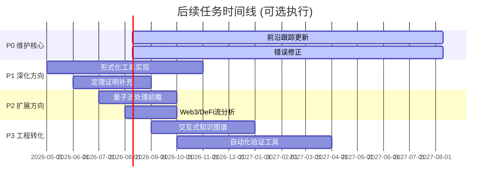

# 100%完成后续路线图 v4.0

> **项目状态**: ✅ 100%完成 (v3.0 FINAL)
> **路线图日期**: 2026-04-13
> **性质**: 可选深化与维护规划

---

## 📋 后续任务总览



---

## 🎯 P0 - 维护核心 (必须持续)

### 任务 P0.1: 学术前沿持续跟踪

| 活动 | 频率 | 工作量 | 说明 |
|------|------|--------|------|
| 顶会论文扫描 | 季度 | 4h/季度 | VLDB/SIGMOD/SOSP/POPL/PLDI等 |
| Flink版本更新跟踪 | 月度 | 2h/月 | 2.1/2.2/3.0新特性分析 |
| 新形式化方法跟踪 | 半年 | 8h/半年 | Coq/Lean/Iris新进展 |
| 定理注册表更新 | 按需 | 1h/次 | 新增定理编号注册 |

**预期产出**:

- 年度前沿综述报告
- 版本更新补丁文档

---

### 任务 P0.2: 错误修正与完善

| 类型 | 检测方式 | 修正优先级 |
|------|---------|-----------|
| 形式化证明错误 | 专家评审/读者反馈 | P0 - 立即 |
| 引用链接失效 | 自动化检查 | P1 - 1周内 |
| 交叉引用不一致 | 自动化检查 | P1 - 1周内 |
| 代码示例错误 | 读者反馈 | P2 - 1月内 |
| 表述改进 | 读者反馈 | P3 - 排期 |

---

### 任务 P0.3: 形式化元素一致性审计

**目标**: 确保所有定理/定义/引理编号全局唯一且可追踪

**检查清单**:

- [ ] 编号唯一性验证
- [ ] 跨文档引用完整性
- [ ] 定理依赖图更新
- [ ] 证明链完整性验证

---

## 🔬 P1 - 理论深化 (可选)

### 任务 P1.1: 关键定理完整证明补充

**当前状态**: 部分定理仅有证明大纲

| 定理 | 当前状态 | 建议深化 | 工作量 |
|------|---------|---------|--------|
| Thm-S-01-01 (USTM组合性) | 大纲 | Coq机械化证明 | 2-3周 |
| Thm-S-04-01 (Checkpoint正确性) | 半形式化 | TLA+完整规格 | 1-2周 |
| Thm-S-07-FV-01 (FoVer Soundness) | 论文级 | Lean形式化 | 3-4周 |

**预期产出**:

- 可编译的Coq/Lean证明脚本
- 证明助手文档

---

### 任务 P1.2: 形式化验证工具原型

**目标**: 将理论转化为可用工具

**子任务**:

1. **USTM模型检查器** (Python/OCaml)
   - 输入: 流处理拓扑描述
   - 输出: 正确性验证报告
   - 工作量: 4-6周

2. **Flink配置验证器**
   - 基于TLA+规格验证配置
   - 工作量: 2-3周

3. **Network Calculus延迟分析器**
   - 自动计算延迟边界
   - 工作量: 2-3周

---

### 任务 P1.3: 理论体系扩展

| 方向 | 说明 | 工作量 | 优先级 |
|------|------|--------|--------|
| **时序逻辑扩展** | 将LTL/CTL应用于流处理规范 | 2周 | P2 |
| **博弈论语义** | 多Agent流处理的博弈模型 | 3周 | P3 |
| **范畴论语义** | 流处理的范畴论重构 | 4周 | P3 |

---

## 🚀 P2 - 前沿扩展 (可选)

### 任务 P2.1: 量子流处理前瞻研究

**背景**: 量子计算对流处理的潜在影响

**研究内容**:

- 量子叠加态的数据流语义
- 量子纠缠在分布式流处理中的对应
- 量子优势场景识别

**工作量**: 2-3周研究 + 1篇前瞻文档
**预期产出**: `Struct/06-frontier/quantum-streaming-formal-theory.md`

---

### 任务 P2.2: Web3/DeFi流分析深化

**当前状态**: 已有基础架构文档

**深化方向**:

1. **智能合约事件流形式化**
   - Solidity事件到流处理的映射
   - 工作量: 1周

2. **DeFi实时风控模型**
   - 闪电贷攻击检测的形式化
   - 工作量: 2周

3. **链上链下数据流一致性**
   - Oracle数据流的可信性保证
   - 工作量: 2周

---

### 任务 P2.3: 神经符号流处理

**方向**: 结合神经网络与符号推理的流处理

**研究问题**:

- 神经规则引擎的流处理语义
- 可微分流处理的理论基础
- LLM作为流处理算子的形式化

---

## 🛠️ P3 - 工程转化 (可选)

### 任务 P3.1: 交互式知识图谱Web应用

**目标**: 将静态知识转化为交互式探索工具

**功能规划**:

```
交互式知识图谱 v2.0
├── 定理依赖可视化 (可点击导航)
├── 证明链交互展示
├── 概念关系动态图谱
├── 学习路径推荐引擎
├── 全文搜索与语义检索
└── 多维度过滤与筛选
```

**技术栈**: D3.js/Three.js + Elasticsearch + React
**工作量**: 3-4个月
**预期产出**: 可部署的Web应用

---

### 任务 P3.2: 自动化形式验证工具链

**目标**: 自动化验证Flink作业正确性

**架构**:

```
Flink作业 → 提取拓扑 → USTM转换 → 模型检查 → 报告
                ↓
           TLA+规格生成 → TLC验证
                ↓
           反例可视化/修复建议
```

**子任务**:

1. Flink拓扑解析器 (2周)
2. USTM转换器 (3周)
3. TLA+代码生成器 (2周)
4. 结果可视化 (2周)

---

### 任务 P3.3: 结构化课程与认证体系

**目标**: 基于知识库构建学习体系

**课程设计**:

```
流计算形式化方法课程
├── Level 1: 基础概念 (20h)
│   ├── 进程演算入门
│   ├── Dataflow模型
│   └── Flink基础
├── Level 2: 形式化方法 (40h)
│   ├── 类型系统
│   ├── 时序逻辑
│   └── 模型检查
├── Level 3: 高级主题 (40h)
│   ├── 一致性协议
│   ├── 形式验证实践
│   └── 前沿研究
└── Level 4: 专家认证 (项目实战)
```

---

## 🌍 P4 - 国际化与标准化 (可选)

### 任务 P4.1: 英文核心文档完善

**当前状态**: 已有README-EN/QUICK-START-EN/ARCHITECTURE-EN/GLOSSARY-EN

**深化计划**:

- [ ] 核心定理英文版 (Struct关键文档)
- [ ] 案例研究英文版
- [ ] 设计模式英文版

**工作量**: 每篇文档翻译+校对约1-2周

---

### 任务 P4.2: 学术标准化整理

**目标**: 符合学术出版物标准

**任务**:

1. 统一引用格式 (BibTeX完整条目)
2. 定理编号与证明格式标准化
3. LaTeX源文件生成 (可选)
4. 学术论文提炼 (可选)

---

## 📊 资源需求估算

### 人力投入 (按方向)

| 方向 | 专家类型 | 时间投入 | 优先级建议 |
|------|---------|---------|-----------|
| P0 维护 | 维护者 | 2-4h/周 | 必须 |
| P1 理论深化 | 形式化方法专家 | 2-3个月 | 高 |
| P2 前沿扩展 | 研究人员 | 1-2个月 | 中 |
| P3 工程转化 | 全栈工程师 | 4-6个月 | 中 |
| P4 国际化 | 技术写作者 | 2-3个月 | 低 |

### 计算资源

| 任务 | 资源需求 | 成本估算 |
|------|---------|---------|
| 交互式知识图谱 | 云服务器 (4C8G) | $200/月 |
| 形式验证工具 | GPU实例 (可选) | $500/月 |
| 自动化检查 | CI/CD minutes | $50/月 |

---

## 🎲 决策矩阵 (供选择)

请确认您希望推进的方向：

```
┌─────────────────────────────────────────────────────────────┐
│                      请选择后续方向                          │
├─────────────────────────────────────────────────────────────┤
│                                                             │
│  [必须] P0 维护核心                                          │
│      ├── □ 学术前沿跟踪 (季度更新)                          │
│      ├── □ 错误修正响应                                     │
│      └── □ 一致性审计 (年度)                                │
│                                                             │
│  [可选] P1 理论深化                                          │
│      ├── □ 定理完整证明补充 (Coq/Lean)                      │
│      ├── □ 形式化验证工具原型                               │
│      └── □ 理论体系扩展                                     │
│                                                             │
│  [可选] P2 前沿扩展                                          │
│      ├── □ 量子流处理前瞻                                   │
│      ├── □ Web3/DeFi深化                                    │
│      └── □ 神经符号流处理                                   │
│                                                             │
│  [可选] P3 工程转化                                          │
│      ├── □ 交互式知识图谱Web应用                            │
│      ├── □ 自动化验证工具链                                 │
│      └── □ 课程体系设计                                     │
│                                                             │
│  [可选] P4 国际化                                            │
│      ├── □ 英文文档完善                                     │
│      └── □ 学术标准化                                       │
│                                                             │
└─────────────────────────────────────────────────────────────┘
```

---

## ✅ 确认清单

**请您确认以下选项：**

1. **维护模式** (必选其一)
   - [ ] 仅被动维护 (收到反馈后修正)
   - [ ] 主动维护 (季度更新)
   - [ ] 深度维护 (月度更新+自动化检查)

2. **深化方向** (可多选)
   - [ ] 定理机械化证明
   - [ ] 形式化工具实现
   - [ ] 前沿研究扩展

3. **工程转化** (可多选)
   - [ ] 交互式知识图谱
   - [ ] 自动化验证工具
   - [ ] 课程体系

4. **国际化** (可选)
   - [ ] 英文文档完善
   - [ ] 学术标准化

5. **特殊需求**
   - [ ] 其他: _______________

---

**下一步行动**: 根据您的确认，我将制定详细的执行计划并开始实施。
