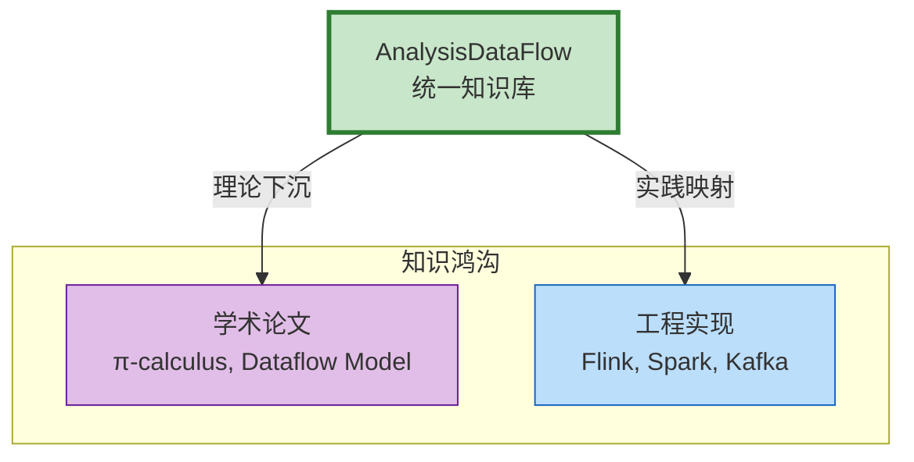
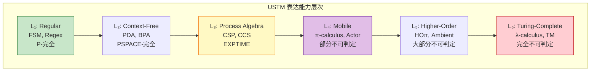
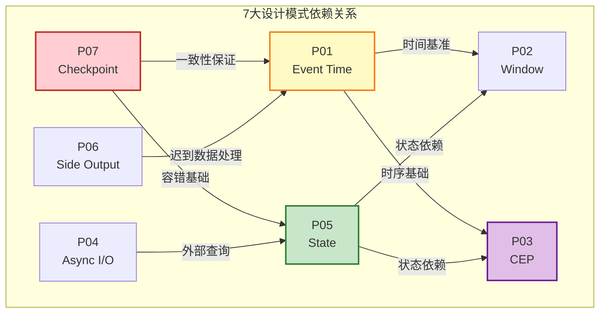
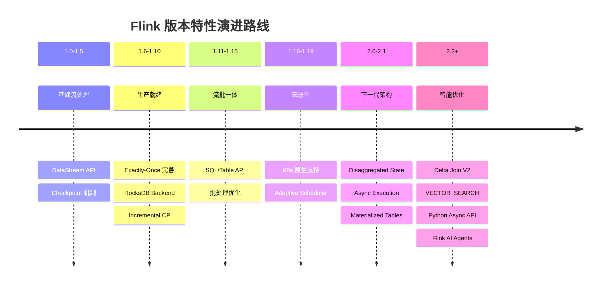
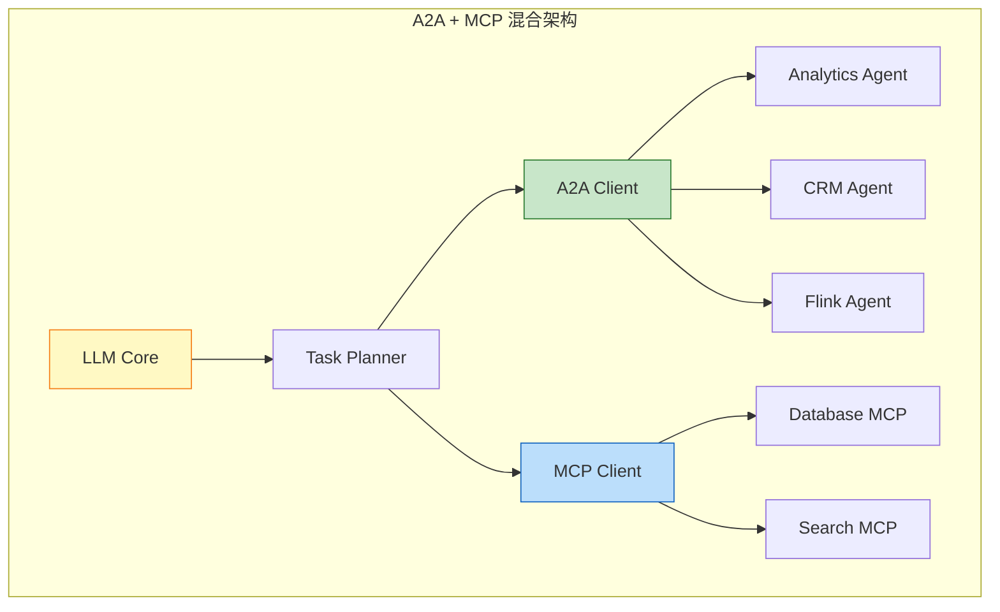
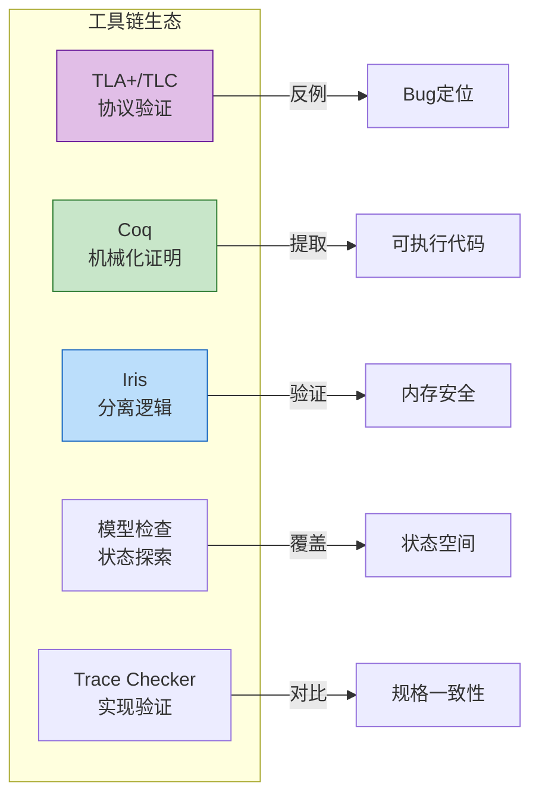
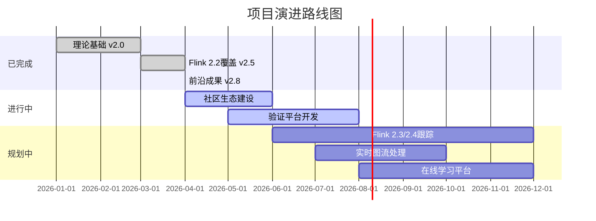

# AnalysisDataFlow 项目演示文稿大纲

> **演讲时长**: 33分钟 | **目标受众**: 技术管理者、架构师、流计算工程师 | **版本**: v2.8 (2026-04)

---

## 📋 演讲概览

| 部分 | 主题 | 时长 | 关键信息 |
|------|------|------|----------|
| 1 | 开场 | 2分钟 | 项目定位、核心价值、受众画像 |
| 2 | 项目概览 | 5分钟 | 三大目录、254文档、870形式化元素 |
| 3 | 理论层亮点 | 5分钟 | USTM、形式化证明、Choreographic/AI Agent |
| 4 | 实践层亮点 | 5分钟 | 7大设计模式、11业务场景、选型指南 |
| 5 | Flink专项 | 5分钟 | Flink 2.2全覆盖、AI/ML集成、Lakehouse生态 |
| 6 | 最新成果 | 5分钟 | A2A协议、Smart Casual、Temporal+Flink、反模式 |
| 7 | 工具与自动化 | 3分钟 | 验证脚本、快速参考、维护工具 |
| 8 | 总结与展望 | 3分钟 | 核心成果、使用建议、未来方向 |

---

## 第一部分：开场 (2分钟)

### 🎯 演讲要点

1. **项目一句话介绍**
   > AnalysisDataFlow 是面向流计算领域的**统一理论模型与工程实践知识库**，覆盖从形式化理论到生产代码的完整技术栈。

2. **为什么需要这个项目**
   - **理论-实践鸿沟**: 学术论文与工程实现之间缺乏桥梁
   - **碎片化知识**: Flink、Spark、Kafka Streams 等系统各自为战
   - **验证缺失**: 生产系统缺乏严格正确性保证
   - **选型困难**: 技术选型缺乏系统性决策框架

3. **目标受众**

   | 角色 | 需求 | 推荐入口 |
   |------|------|----------|
   | 研究员 | 形式化理论、证明技术 | Struct/00-INDEX.md |
   | 架构师 | 技术选型、设计模式 | Knowledge/00-INDEX.md |
   | 工程师 | Flink工程实践 | Flink/00-INDEX.md |
   | 技术负责人 | 团队培训、规范制定 | PROJECT-TRACKING.md |

### 📊 建议Mermaid图表



### 🔑 关键数据/引用

> "本项目是对**流计算的理论模型、层次结构、工程实践、业务建模**的全面梳理与体系构建，目标是为学术研究、工业工程和技术选型提供**严格、完整、可导航**的知识库。"
> — AGENTS.md

### 🎬 转场提示
>
> "接下来，让我们看看这个项目的整体规模和组织架构。"

---

## 第二部分：项目概览 (5分钟)

### 🎯 演讲要点

1. **三大核心目录**

   | 目录 | 定位 | 内容特征 | 数量 |
   |------|------|----------|------|
   | **Struct/** | 形式理论基础 | 数学定义、定理证明、严格论证 | 43文档, 92定理, 192定义 |
   | **Knowledge/** | 工程实践知识 | 设计模式、业务场景、技术选型 | 107文档, 62定理, 131定义 |
   | **Flink/** | Flink专项技术 | 架构机制、SQL/API、工程实践 | 130文档, 107定理, 222定义 |

2. **内容规模与统计**

   ```
   📊 总体统计 (v2.8)
   ├── 总文档数: 254 篇
   ├── 总大小: ~6.55 MB
   ├── 形式化元素: 870+
   │   ├── 定理 (Thm): 188
   │   ├── 定义 (Def): 399
   │   ├── 引理 (Lemma): 158
   │   ├── 命题 (Prop): 121
   │   └── 推论 (Cor): 6
   ├── Mermaid图表: 580+
   └── 代码示例: 1850+
   ```

3. **核心特色一：六段式文档结构**

   每篇核心文档遵循统一模板：
   1. **概念定义** (Definitions) - 严格形式化定义
   2. **属性推导** (Properties) - 从定义推导的引理与性质
   3. **关系建立** (Relations) - 与其他概念/模型的关联
   4. **论证过程** (Argumentation) - 辅助定理、反例分析
   5. **形式证明/工程论证** (Proof) - 完整证明或严谨论证
   6. **实例验证** (Examples) - 简化实例、代码片段
   7. **可视化** (Visualizations) - Mermaid图表
   8. **引用参考** (References) - 权威来源引用

4. **核心特色二：定理/定义编号体系**

   全局统一编号：`{类型}-{阶段}-{文档序号}-{顺序号}`

   | 示例 | 含义 |
   |------|------|
   | Thm-S-17-01 | Struct阶段, 17文档, 第1个定理 (Checkpoint一致性) |
   | Def-F-02-23 | Flink阶段, 02文档, 第23个定义 |
   | Prop-K-06-12 | Knowledge阶段, 06文档, 第12个命题 |

### 📊 建议Mermaid图表

```mermaid
graph TB
    subgraph "AnalysisDataFlow 三层架构"
        S[Struct/<br/>形式理论层<br/>43文档 | L1-L6]
        K[Knowledge/<br/>知识转化层<br/>107文档 | L3-L5]
        F[Flink/<br/>工程实现层<br/>130文档 | L3-L5]
    end

    S -->|理论下沉<br/>Def-S-* → Pattern| K
    K -->|实践映射<br/>Pattern → Flink API| F
    F -.->|反馈验证<br/>生产案例 → 理论修正| S

    style S fill:#e1bee7,stroke:#6a1b9a,stroke-width:2px
    style K fill:#c8e6c9,stroke:#2e7d32,stroke-width:2px
    style F fill:#bbdefb,stroke:#1565c0,stroke-width:2px
```

### 🔑 关键数据/引用

| 版本 | 发布日期 | 新增内容 |
|------|----------|----------|
| v2.0 | 2026-03-15 | 基础理论体系完成 |
| v2.5 | 2026-03-28 | Flink 2.2特性全覆盖 |
| **v2.8** | **2026-04-03** | **A2A协议、Smart Casual、反模式专题** |

### 🎬 转场提示
>
> "了解了项目架构后，让我们深入理论层，看看我们为流计算建立的数学基础。"

---

## 第三部分：理论层亮点 (5分钟)

### 🎯 演讲要点

1. **USTM统一流计算理论**

   **核心贡献**: 建立流计算元模型，统一五大计算模型

   ```
   USTM = ⟨P, C, S, T, Σ, M⟩

   P: 处理单元集合 (Actor/算子/进程)
   C: 通信通道集合
   S: 状态空间
   T: 时间域 (事件时间/处理时间)
   Σ: 数据类型签名
   M: 一致性模型
   ```

   **六层表达能力层次 (L1-L6)**:

   | 层次 | 名称 | 代表模型 | 可判定性 |
   |------|------|----------|----------|
   | L₁ | Regular | FSM, 正则表达式 | P-完全 |
   | L₂ | Context-Free | PDA, BPA | PSPACE-完全 |
   | L₃ | Process Algebra | CSP, CCS | EXPTIME |
   | L₄ | Mobile | π-演算, Actor | 部分不可判定 |
   | L₅ | Higher-Order | HOπ, Ambient | 大部分不可判定 |
   | L₆ | Turing-Complete | λ-演算, TM | 完全不可判定 |

2. **形式化证明：Checkpoint与Exactly-Once**

   **Thm-S-17-01: Flink Checkpoint一致性定理**
   > Barrier对齐保证产生一致割集，故障恢复后系统状态等价于某个历史一致全局状态。

   **Thm-S-18-01: Exactly-Once正确性定理**
   > 端到端Exactly-Once语义 = 可重放Source ∧ Checkpoint机制 ∧ 事务Sink

   **证明技术栈**:
   - TLA+规格与模型检验 (TLC)
   - Coq机械化证明
   - Iris分离逻辑

3. **前沿探索：Choreographic编程与AI Agent**

   **Choreographic流编程** (PLDI 2025最新):
   - 全局类型推断完备性
   - 死锁自由保证
   - 1CP (First-Person Choreographic Programming) 正交性

   **AI Agent与会话类型**:
   - Multi-Agent会话类型 (MAST) 框架
   - 认知会话类型：K_p φ 认知模态
   - Thm-S-29-01: AI Agent系统死锁自由定理

### 📊 建议Mermaid图表



### 🔑 关键数据/引用

| 定理编号 | 名称 | 位置 | 形式化等级 |
|----------|------|------|------------|
| Thm-S-01-01 | USTM组合性定理 | 01-foundation | L4 |
| Thm-S-17-01 | Checkpoint一致性定理 | 04-proofs | L5 |
| Thm-S-18-01 | Exactly-Once正确性定理 | 04-proofs | L5 |
| Thm-S-20-01 | Choreographic流程序正确性 | 06-frontier | L5 |
| Thm-S-29-01 | AI Agent系统死锁自由定理 | 06-frontier | L5 |

### 🎬 转场提示
>
> "理论指导实践，接下来让我们看看这些形式化成果如何转化为可落地的设计模式。"

---

## 第四部分：实践层亮点 (5分钟)

### 🎯 演讲要点

1. **7大核心设计模式**

   | 编号 | 模式名称 | 核心问题 | 形式化基础 |
   |------|----------|----------|------------|
   | P01 | Event Time Processing | 乱序数据、迟到数据 | Def-S-04-04 Watermark语义 |
   | P02 | Windowed Aggregation | 无界流的有界计算单元 | Def-S-04-05 窗口算子 |
   | P03 | Complex Event Processing | 时序模式匹配 | Thm-S-07-01 确定性定理 |
   | P04 | Async I/O Enrichment | 外部数据查询不阻塞 | Lemma-S-04-02 单调性 |
   | P05 | State Management | 分布式有状态计算 | Thm-S-17-01 Checkpoint一致性 |
   | P06 | Side Output Pattern | 多路输出、异常数据分离 | Def-S-08-01 AM语义 |
   | P07 | Checkpoint & Recovery | 故障恢复与一致性 | Thm-S-18-01 Exactly-Once |

2. **11个真实业务场景**

   **分类覆盖**:
   - **IoT**: 物联网数据处理、智能制造
   - **金融**: 实时风控、支付处理 (Stripe)
   - **电商**: 实时推荐、阿里巴巴双11
   - **娱乐**: 游戏分析、Spotify音乐推荐
   - **平台**: Uber实时平台、Netflix流水线、Airbnb市场动态

   **阿里巴巴双11案例**:
   - 每秒40亿+ TPS处理
   - 全球数据中心协同
   - 五层实时计算架构

3. **技术选型决策树**

   **引擎选型**:

   ```
   延迟要求 < 100ms → Flink低延迟模式
   延迟要求 100ms-1s → Flink SQL/DataStream
   延迟要求 > 1s → Spark Structured Streaming
   ```

   **并发范式选型**:

   ```
   分布式水平扩展 + 时间语义重要 → Dataflow (Flink/Beam)
   分布式水平扩展 + 容错要求高 → Actor (Akka/Erlang)
   单节点高并发 → CSP (Go Channels)
   ```

### 📊 建议Mermaid图表



### 🔑 关键数据/引用

| 场景 | 核心模式组合 | 技术栈 | 一致性要求 |
|------|-------------|--------|------------|
| 金融风控 | P01 + P03 + P07 | Flink CEP + Kafka | Exactly-Once |
| IoT处理 | P01 + P05 + P07 | Flink + Kafka | At-Least-Once |
| 实时推荐 | P02 + P04 + P05 | Flink + Redis | At-Least-Once |
| 日志监控 | P02 + P06 + P07 | Flink + ES | At-Most-Once |

### 🎬 转场提示
>
> "设计模式需要技术底座支撑，让我们转向Flink专项——目前业界最成熟的流处理引擎。"

---

## 第五部分：Flink专项 (5分钟)

### 🎯 演讲要点

1. **Flink 2.2全覆盖**

   **版本演进里程碑**:

   | 版本 | 关键特性 | 工程影响 |
   |------|----------|----------|
   | 1.16-1.19 | 自适应调度器、云原生检查点 | 生产就绪 |
   | 2.0 | 分离状态存储、异步执行 | 恢复时间：分钟→秒 |
   | 2.1 | Delta Join、ML_PREDICT | 实时AI推理 |
   | **2.2** | **VECTOR_SEARCH、Python Async API** | **向量检索、异步函数** |

   **核心机制文档**:
   - Checkpoint机制深度剖析
   - Exactly-Once端到端实现
   - Watermark与时间语义
   - Backpressure与流控
   - Delta Join (大状态流Join优化)

2. **AI/ML集成**

   **技术栈覆盖**:
   - **Flink ML**: 在线学习算法、模型服务
   - **向量数据库集成**: Milvus、PgVector、Pinecone
   - **实时RAG架构**: 流式检索增强生成
   - **Model DDL**: ML_PREDICT SQL扩展
   - **Flink AI Agents**: FLIP-531原生Agent支持

   **实时特征工程**:

   ```
   点击流 → Flink窗口聚合 → 特征计算 → Redis/HBase特征服务 → 模型推理
   ```

3. **Lakehouse生态**

   **存储格式集成**:

   | 格式 | 集成状态 | 特性 |
   |------|----------|------|
   | Apache Paimon | ✅ 完整支持 | 流批统一存储 |
   | Apache Iceberg | ✅ 完整支持 | 开放表格式 |
   | Delta Lake | ✅ 完整支持 | ACID事务 |

   **物化表v2**: FRESHNESS自动推断、查询优化

### 📊 建议Mermaid图表



### 🔑 关键数据/引用

| Flink组件 | 对应Struct定理 | 形式化等级 |
|-----------|----------------|------------|
| Checkpoint | Thm-S-17-01 | L5 |
| Exactly-Once | Thm-S-18-01 | L5 |
| Watermark | Thm-S-09-01 | L4 |
| Delta Join | Thm-F-02-05 | L4 |
| Model Serving | Thm-F-12-01 | L4 |

### 🎬 转场提示
>
> "Flink专项展现了我们的工程深度，接下来展示项目最前沿的研究成果。"

---

## 第六部分：最新成果 (5分钟)

### 🎯 演讲要点

1. **A2A协议深度分析** (Google Agent-to-Agent)

   **核心贡献**: 首个系统化A2A协议技术解析，建立与MCP协议的互补关系模型

   **关键定义**:
   - Def-K-06-230: A2A协议五元组 ⟨𝒜, 𝒯, ℳ, 𝒞, 𝒮⟩
   - Def-K-06-231: Agent Card能力声明
   - Def-K-06-232: Task生命周期状态机

   **A2A vs MCP对比**:

   | 维度 | MCP | A2A |
   |------|-----|-----|
   | 通信层级 | Agent ↔ Tool/Context | Agent ↔ Agent |
   | 核心抽象 | Resources, Tools, Prompts | Tasks, Messages, Artifacts |
   | 关系模式 | 客户端-服务器 | 对等协作 |
   | 状态管理 | 无状态（通常） | 有状态Task生命周期 |

   **Thm-K-06-151: A2A-MCP正交性定理**:
   > A2A与MCP是正交的协议层，可同时使用而不冲突。

2. **Smart Casual Verification**

   **方法论定义**:
   $$
   \text{SCV} = \underbrace{\text{Formal Specification (TLA+)}}_{系统化建模} + \underbrace{\text{Model Checking (TLC)}}_{状态空间探索} + \underbrace{\text{Trace Validation}}_{绑定实现与规格}
   $$

   **Microsoft CCF项目验证结果**:
   - 发现6个关键bug（4个通过TLC，2个通过Trace验证）
   - ROI约317%（240人时投入 vs 1000+人时修复成本）
   - 规格验证探索状态空间比实现测试多5个数量级

   **Flink应用前景**: Checkpoint协议、Watermark传播、Exactly-Once语义验证

3. **Temporal+Flink分层架构**

   **判定性梯度架构**:

   | 层级 | 技术 | 判定性 | 适用场景 |
   |------|------|--------|----------|
   | L4 (业务编排) | Temporal | 准可判定 | Saga补偿、人工审批 |
   | L3 (流处理) | Flink | 半可判定 | 实时聚合、CEP检测 |
   | L2 (消息队列) | Kafka | - | 事件存储、顺序保证 |

   **OpenAI集成**: 2026年2月Temporal官方集成进OpenAI Agents SDK，解决"复杂性悬崖"问题

4. **流处理反模式专题**

   **10大反模式清单**:

   | 编号 | 名称 | 严重程度 | 检测难度 |
   |------|------|----------|----------|
   | AP-01 | 全局状态滥用 | P2 | 易 |
   | AP-02 | Watermark设置不当 | P1 | 极难 |
   | AP-03 | Checkpoint间隔不合理 | P1 | 中 |
   | AP-04 | 热点Key未处理 | P1 | 难 |
   | AP-05 | ProcessFunction阻塞I/O | P1 | 易 |
   | AP-06 | 序列化开销忽视 | P2 | 中 |
   | AP-07 | 窗口函数状态爆炸 | P1 | 难 |
   | AP-08 | 忽略背压信号 | P0 | 极难 |
   | AP-09 | 多流Join时间未对齐 | P1 | 难 |
   | AP-10 | 资源估算不足导致OOM | P0 | 难 |

### 📊 建议Mermaid图表



### 🔑 关键数据/引用

| 成果 | 位置 | 状态 | 关键定理/定义 |
|------|------|------|---------------|
| A2A协议分析 | Knowledge/06-frontier/a2a-protocol*.md | ✅ 完成 | Def-K-06-230~235, Thm-K-06-151 |
| Smart Casual | Struct/07-tools/smart-casual-verification.md | ✅ 完成 | Def-S-07-13~16, Thm-S-07-07~09 |
| Temporal+Flink | Knowledge/06-frontier/temporal-flink*.md | ✅ 完成 | Def-K-06-05~08 |
| 反模式专题 | Knowledge/09-anti-patterns/ | ✅ 完成 | Def-K-09-01, AP-01~10 |

### 🎬 转场提示
>
> "前沿成果需要工具支撑，让我们看看项目提供的自动化工具链。"

---

## 第七部分：工具与自动化 (3分钟)

### 🎯 演讲要点

1. **验证脚本与工具链**

   **形式化验证工具**:

   | 工具 | 用途 | 适用场景 |
   |------|------|----------|
   | TLA+ / TLC | 分布式协议验证 | Checkpoint、Exactly-Once |
   | Coq | 机械化证明 | Watermark单调性 |
   | Iris | 分离逻辑验证 | Actor状态安全 |
   | Model Checker | 状态空间探索 | 死锁检测 |

   **自动化检查**:
   - Mermaid图语法校验
   - 定理编号唯一性检查
   - 交叉引用完整性验证

2. **快速参考卡片**

   **文档类型**:
   - 并发范式选型决策树
   - Flink vs RisingWave对比速查
   - 流处理反模式检测清单
   - A2A协议快速参考
   - Temporal+Flink集成指南
   - 安全合规矩阵 (GDPR/SOC2/PCI-DSS)

   **位置**: `Knowledge/98-exercises/quick-ref-*.md`

3. **维护工具**

   **PROJECT-TRACKING.md**: 唯一进度看板
   - 实时进度百分比
   - 形式化元素统计
   - 版本更新日志

   **THEOREM-REGISTRY.md**: 定理注册表v2.8
   - 870+形式化元素索引
   - 跨文档引用追踪

### 📊 建议Mermaid图表



### 🔑 关键数据/引用

| 工具 | 文档位置 | 关键成果 |
|------|----------|----------|
| TLA+ | Struct/07-tools/tla-for-flink.md | Checkpoint协议规格 |
| Coq | Struct/07-tools/coq-mechanization.md | Watermark单调性证明 |
| Iris | Struct/07-tools/iris-separation-logic.md | Actor模型嵌入 |
| Smart Casual | Struct/07-tools/smart-casual-verification.md | CCF 6个bug发现 |

### 🎬 转场提示
>
> "工具链保障质量，现在让我们总结项目的核心价值并展望未来。"

---

## 第八部分：总结与展望 (3分钟)

### 🎯 演讲要点

1. **核心成果总结**

   **理论成果**:
   - ✅ USTM统一流计算理论框架
   - ✅ 六层表达能力层次 (L1-L6)
   - ✅ Checkpoint/Exactly-Once形式化证明
   - ✅ Choreographic编程前沿探索
   - ✅ AI Agent会话类型框架

   **工程成果**:
   - ✅ 7大设计模式 + 10大反模式
   - ✅ 11个真实业务场景分析
   - ✅ Flink 2.2全覆盖 (130+文档)
   - ✅ AI/ML集成技术栈
   - ✅ Lakehouse生态完整支持

   **前沿成果**:
   - ✅ A2A协议系统化分析
   - ✅ Smart Casual验证方法论
   - ✅ Temporal+Flink分层架构
   - ✅ 流处理反模式专题

2. **使用建议**

   **不同角色入门路径**:

   ```
   初学者 (2-3周):
   Flink/05-vs-competitors/flink-vs-spark-streaming.md
   → Flink/02-core-mechanisms/time-semantics-and-watermark.md
   → Knowledge/02-design-patterns/pattern-event-time-processing.md

   进阶工程师 (4-6周):
   Flink/02-core-mechanisms/checkpoint-mechanism-deep-dive.md
   → Struct/04-proofs/04.01-flink-checkpoint-correctness.md
   → Knowledge/02-design-patterns/ (全模式深入)

   架构师 (持续):
   Struct/01-foundation/ (理论基础)
   → Knowledge/04-technology-selection/ (选型决策)
   → Flink/01-architecture/ (架构实现)
   ```

3. **未来方向**

   **技术演进**:
   - Flink 2.3/2.4路线图跟踪
   - 实时图流处理 (TGN) 深度集成
   - 多模态流处理架构
   - Web3/DeFi流分析场景

   **理论扩展**:
   - 流计算类型系统完备性
   - 动态拓扑验证复杂度边界
   - AI Agent形式化语义

   **生态建设**:
   - 社区贡献指南
   - 在线验证平台
   - 交互式学习课程

### 📊 建议Mermaid图表



### 🔑 关键数据/引用 (最终统计)

```
📊 AnalysisDataFlow v2.8 最终统计

内容规模:
├── 总文档: 254 篇
├── 总大小: ~6.55 MB
├── 形式化元素: 870+
│   ├── 定理: 188
│   ├── 定义: 399
│   ├── 引理: 158
│   ├── 命题: 121
│   └── 推论: 6
├── Mermaid图表: 580+
└── 代码示例: 1850+

三大目录:
├── Struct/:   43文档, 92定理, 192定义  [100%]
├── Knowledge/: 107文档, 62定理, 131定义 [100%]
└── Flink/:    130文档, 107定理, 222定义 [100%]

最新亮点:
✅ Flink AI Agents (FLIP-531)
✅ 实时图流处理TGN
✅ 多模态流处理
✅ Google A2A协议分析
✅ Smart Casual Verification
✅ Temporal+Flink分层架构
✅ 流处理反模式专题 (10个)

状态: 生产就绪 ✅ v2.8
```

### 🎬 结束语

> "AnalysisDataFlow 不仅仅是一个文档集合，它是连接流计算理论与实践的桥梁。我们相信，通过系统化的知识整理和严格的形式化方法，可以为流计算领域的工程师和研究者提供真正有价值的指导。
>
> 感谢各位的聆听，欢迎访问我们的知识库，共同推动流计算技术的发展！"

---

## 附录：演讲者备忘

### ⏱️ 时间控制检查点

| 时间点 | 应完成部分 | 累计时间 |
|--------|-----------|----------|
| 0:02 | 开场结束 | 2分钟 |
| 0:07 | 项目概览结束 | 5分钟 |
| 0:12 | 理论层亮点结束 | 5分钟 |
| 0:17 | 实践层亮点结束 | 5分钟 |
| 0:22 | Flink专项结束 | 5分钟 |
| 0:27 | 最新成果结束 | 5分钟 |
| 0:30 | 工具与自动化结束 | 3分钟 |
| 0:33 | 总结与展望结束 | 3分钟 |

### 📋 关键术语发音

| 术语 | 发音 | 含义 |
|------|------|------|
| Choreographic | /ˌkɔːriəˈɡræfɪk/ | 编排式编程 |
| Watermark | /ˈwɔːtərmɑːrk/ | 水印（时间进度标记） |
| Checkpoint | /ˈtʃekpɔɪnt/ | 检查点 |
| Exactly-Once | /ɪɡˈzæktli wʌns/ | 恰好一次语义 |

### 📚 备用引用


---

*演示文稿大纲版本: v1.0*
*创建日期: 2026-04-03*
*适用项目: AnalysisDataFlow v2.8*
