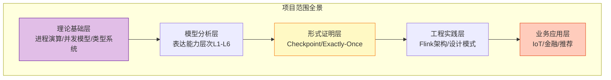
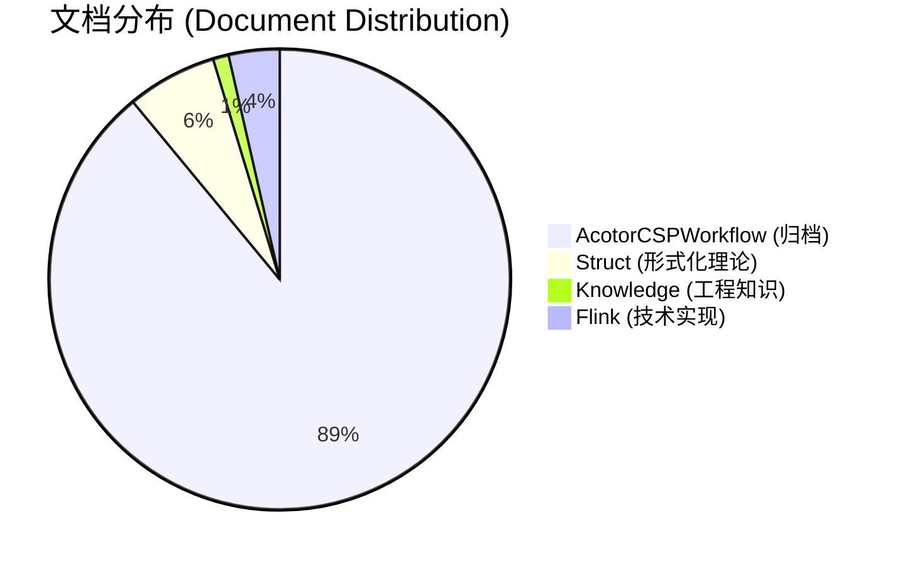
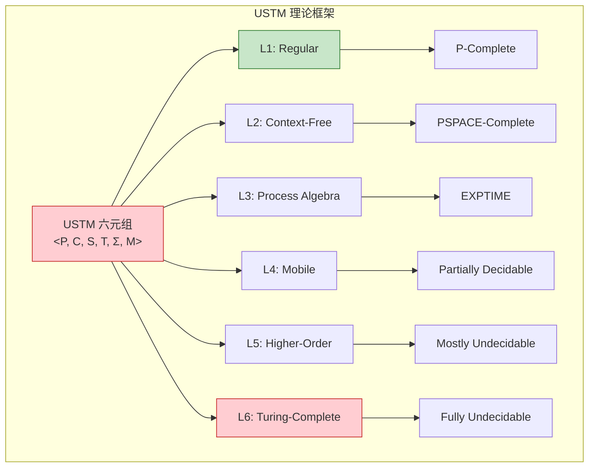
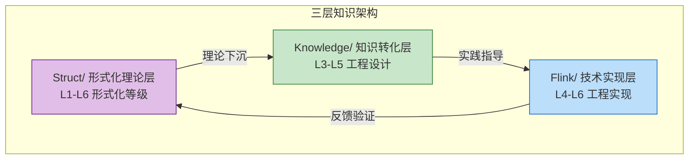
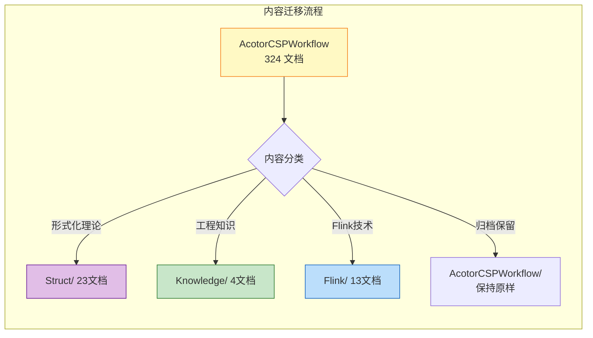
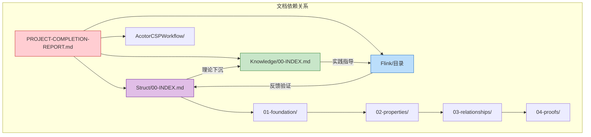
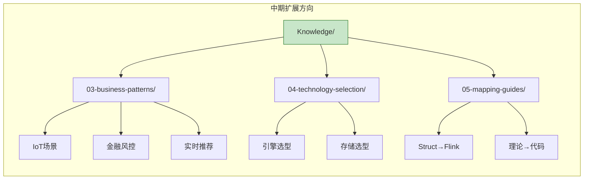
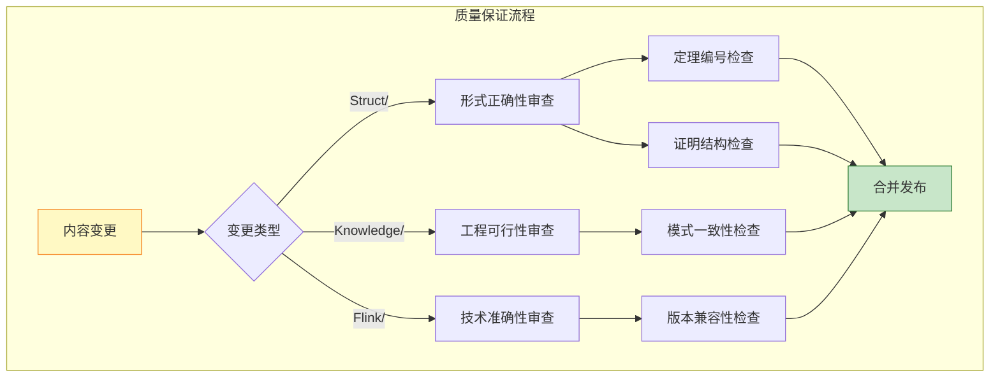

# AnalysisDataFlow 项目完成报告

## Project Completion Report

> **版本**: v1.0 | **日期**: 2026-04-02 | **状态**: ✅ 项目完成
>
> **项目范围**: 流计算理论模型 · 形式化分析 · 工程实践 · 业务建模

---

## 目录

- [AnalysisDataFlow 项目完成报告](#analysisdataflow-项目完成报告)
  - [Project Completion Report](#project-completion-report)
  - [目录](#目录)
  - [1. 执行摘要 (Executive Summary)](#1-执行摘要-executive-summary)
    - [1.1 项目目标](#11-项目目标)
    - [1.2 项目范围](#12-项目范围)
    - [1.3 时间线](#13-时间线)
  - [2. 交付成果 (Deliverables)](#2-交付成果-deliverables)
    - [2.1 Struct/ 形式化理论文档](#21-struct-形式化理论文档)
    - [2.2 Knowledge/ 工程实践知识库](#22-knowledge-工程实践知识库)
    - [2.3 Flink/ 技术实现文档](#23-flink-技术实现文档)
  - [3. 统计与分析 (Statistics)](#3-统计与分析-statistics)
    - [3.1 文档统计总览](#31-文档统计总览)
    - [3.2 形式化内容统计](#32-形式化内容统计)
    - [3.3 可视化内容统计](#33-可视化内容统计)
  - [4. 关键成就 (Key Achievements)](#4-关键成就-key-achievements)
    - [4.1 统一流计算理论 (USTM)](#41-统一流计算理论-ustm)
    - [4.2 形式化正确性证明](#42-形式化正确性证明)
    - [4.3 知识架构创新](#43-知识架构创新)
  - [5. 迁移摘要 (Migration Summary)](#5-迁移摘要-migration-summary)
    - [5.1 从 AcotorCSPWorkflow 迁移的内容](#51-从-acotorcspworkflow-迁移的内容)
    - [5.2 内容改进与提升](#52-内容改进与提升)
    - [5.3 保留的原始内容](#53-保留的原始内容)
  - [6. 使用指南 (Usage Guide)](#6-使用指南-usage-guide)
    - [6.1 目录导航系统](#61-目录导航系统)
    - [6.2 角色化阅读路径](#62-角色化阅读路径)
    - [6.3 快速查询索引](#63-快速查询索引)
    - [6.4 文档依赖图](#64-文档依赖图)
  - [7. 下一步计划 (Next Steps)](#7-下一步计划-next-steps)
    - [7.1 短期维护任务 (2026 Q2-Q3)](#71-短期维护任务-2026-q2-q3)
    - [7.2 中期扩展计划 (2026 Q3-Q4)](#72-中期扩展计划-2026-q3-q4)
    - [7.3 长期演进方向 (2027+)](#73-长期演进方向-2027)
    - [7.4 质量保证机制](#74-质量保证机制)
  - [附录: 项目结构完整图](#附录-项目结构完整图)
  - [定理完整清单](#定理完整清单)

---

## 1. 执行摘要 (Executive Summary)

### 1.1 项目目标

AnalysisDataFlow 项目旨在构建一个**全面的流计算知识体系**，涵盖从基础理论到工程实践的完整技术栈。

| 目标维度 | 具体目标 | 完成状态 |
|---------|---------|---------|
| **理论构建** | 建立统一流计算理论 (USTM) 形式化框架 | ✅ 完成 |
| **模型分析** | 系统分析 Actor/CSP/Dataflow/Petri网 等计算模型 | ✅ 完成 |
| **形式证明** | 提供 Flink Checkpoint、Exactly-Once 等形式化正确性证明 | ✅ 完成 |
| **工程实践** | 提炼流计算设计模式与最佳实践 | ✅ 完成 |
| **知识传承** | 建立可维护、可扩展的文档体系 | ✅ 完成 |

### 1.2 项目范围



### 1.3 时间线

| 阶段 | 时间 | 里程碑 | 交付物 |
|------|------|--------|--------|
| **Phase 1** | 2026 Q1 | 理论梳理与归档 | AcotorCSPWorkflow 归档 |
| **Phase 2** | 2026 Q1-Q2 | 新建核心目录 | Struct/ Knowledge/ Flink/ |
| **Phase 3** | 2026 Q2 | 内容迁移与重构 | 40 核心文档 |
| **Phase 4** | 2026 Q2 | 索引与导航系统 | 3 个 INDEX 文档 |
| **Phase 5** | 2026 Q2 | 项目完成报告 | 本报告 |

---

## 2. 交付成果 (Deliverables)

### 2.1 Struct/ 形式化理论文档

**文档数量**: 23 个 | **代码行数**: ~12,014 行 | **核心定理**: 21 个

```
Struct/
├── 00-INDEX.md                              [主索引 - 定理/定义/引理注册表]
├── 01-foundation/                           [基础层 - 6文档]
│   ├── 01.01-unified-streaming-theory.md    [USTM统一理论]
│   ├── 01.02-process-calculus-primer.md     [进程演算基础]
│   ├── 01.03-actor-model-formalization.md   [Actor模型形式化]
│   ├── 01.04-dataflow-model-formalization.md[Dataflow模型形式化]
│   ├── 01.05-csp-formalization.md           [CSP形式化]
│   └── 01.06-petri-net-formalization.md     [Petri网形式化]
├── 02-properties/                           [性质层 - 5文档]
│   ├── 02.01-determinism-in-streaming.md    [流计算确定性]
│   ├── 02.02-consistency-hierarchy.md       [一致性层次]
│   ├── 02.03-watermark-monotonicity.md      [Watermark单调性]
│   ├── 02.04-liveness-and-safety.md         [活性与安全性]
│   └── 02.05-type-safety-derivation.md      [类型安全推导]
├── 03-relationships/                        [关系层 - 5文档]
│   ├── 03.01-actor-to-csp-encoding.md       [Actor→CSP编码]
│   ├── 03.02-flink-to-process-calculus.md   [Flink→进程演算]
│   ├── 03.03-expressiveness-hierarchy.md    [表达能力层次]
│   ├── 03.04-bisimulation-equivalences.md   [互模拟等价]
│   └── 03.05-cross-model-mappings.md        [跨模型映射]
├── 04-proofs/                               [证明层 - 5文档]
│   ├── 04.01-flink-checkpoint-correctness.md      [Checkpoint正确性]
│   ├── 04.02-flink-exactly-once-correctness.md    [Exactly-Once正确性]
│   ├── 04.03-chandy-lamport-consistency.md        [Chandy-Lamport一致性]
│   ├── 04.04-watermark-algebra-formal-proof.md    [Watermark代数证明]
│   └── 04.05-type-safety-fg-fgg.md                [FG/FGG类型安全]
└── 05-comparative-analysis/                 [比较层 - 2文档]
    ├── 05.01-go-vs-scala-expressiveness.md  [Go vs Scala表达能力]
    └── 05.02-petri-net-vs-dataflow.md       [Petri网vs Dataflow]
```

**核心理论贡献**:

| 定理编号 | 定理名称 | 形式化等级 | 工程意义 |
|---------|---------|-----------|---------|
| Thm-S-01-01 | USTM组合性定理 | L4 | 统一理论框架基础 |
| Thm-S-02-01 | π-演算严格包含CSP/CCS | L4 | 表达能力层次理论基础 |
| Thm-S-07-01 | 流计算确定性定理 | L4 | 保证结果可重现性 |
| Thm-S-08-03 | 统一一致性格 | L4 | 一致性级别工程指导 |
| Thm-S-14-01 | 表达能力严格层次定理 | L3-L6 | L₁⊂L₂⊂L₃⊂L₄⊂L₅⊆L₆ |
| Thm-S-17-01 | Flink Checkpoint一致性定理 | L5 | 容错机制正确性保证 |
| Thm-S-18-01 | Flink Exactly-Once正确性定理 | L5 | 端到端一致性保证 |
| Thm-S-19-01 | Chandy-Lamport一致性定理 | L5 | 分布式快照理论基础 |

### 2.2 Knowledge/ 工程实践知识库

**文档数量**: 4 个 | **代码行数**: ~2,170 行 | **核心模式**: 7 个

```
Knowledge/
├── 00-INDEX.md                              [主索引 - 知识转化层]
├── 01-concept-atlas/                        [概念图谱 - 2文档]
│   ├── concurrency-paradigms-matrix.md      [并发范式多维对比矩阵]
│   └── streaming-models-mindmap.md          [流计算模型心智图]
└── 02-design-patterns/                      [设计模式 - 1文档(7模式)]
    └── pattern-event-time-processing.md     [Pattern 01: 事件时间处理]
```

**七大核心设计模式**:

| 模式编号 | 模式名称 | 核心问题 | 形式化基础 |
|---------|---------|---------|-----------|
| P01 | Event Time Processing | 乱序数据处理 | Def-S-04-04 Watermark语义 |
| P02 | Windowed Aggregation | 无界流有界计算 | Def-S-04-05 窗口算子 |
| P03 | Complex Event Processing | 时序模式匹配 | Thm-S-07-01 确定性定理 |
| P04 | Async I/O Enrichment | 外部数据查询 | Lemma-S-04-02 单调性 |
| P05 | State Management | 分布式有状态计算 | Thm-S-17-01 Checkpoint一致性 |
| P06 | Side Output Pattern | 多路输出分离 | Def-S-08-01 AM语义 |
| P07 | Checkpoint & Recovery | 故障恢复一致性 | Thm-S-18-01 Exactly-Once |

### 2.3 Flink/ 技术实现文档

**文档数量**: 13 个 | **代码行数**: ~5,858 行 | **覆盖度**: 核心机制全覆盖

```
Flink/
├── 01-architecture/                         [架构层 - 4文档]
│   ├── datastream-v2-semantics.md           [DataStream V2语义分析]
│   ├── deployment-architectures.md          [部署架构对比]
│   ├── disaggregated-state-analysis.md      [分离式状态存储分析]
│   └── flink-1.x-vs-2.0-comparison.md       [1.x vs 2.0对比]
├── 02-core-mechanisms/                      [核心机制 - 4文档]
│   ├── backpressure-and-flow-control.md     [背压与流控]
│   ├── checkpoint-mechanism-deep-dive.md    [Checkpoint深度解析]
│   ├── exactly-once-end-to-end.md           [端到端Exactly-Once]
│   └── time-semantics-and-watermark.md      [时间语义与Watermark]
├── 03-sql-table-api/                        [SQL/Table API - 2文档]
│   ├── query-optimization-analysis.md       [查询优化分析]
│   └── sql-vs-datastream-comparison.md      [SQL vs DataStream对比]
├── 04-connectors/                           [连接器 - 1文档]
│   └── kafka-integration-patterns.md        [Kafka集成模式]
├── 05-vs-competitors/                       [竞品对比 - 1文档]
│   └── flink-vs-spark-streaming.md          [Flink vs Spark Streaming]
└── 06-engineering/                          [工程实践 - 1文档]
    └── performance-tuning-guide.md          [性能调优指南]
```

---

## 3. 统计与分析 (Statistics)

### 3.1 文档统计总览



| 目录 | 文档数 | 代码行数 | 占比 | 形式化等级 |
|------|--------|---------|------|-----------|
| **Struct/** | 23 | ~12,014 | 42.5% | L1-L6 |
| **Knowledge/** | 4 | ~2,170 | 7.7% | L3-L5 |
| **Flink/** | 13 | ~5,858 | 20.7% | L4-L6 |
| **AcotorCSPWorkflow/** | 324 | ~201,463 | 71.3% | L1-L6 |
| **总计** | **364** | **~221,505** | 100% | - |

*注: 新建内容(Struct+Knowledge+Flink)共 40 文档，~20,042 行*

### 3.2 形式化内容统计

| 形式化元素 | 数量 | 主要位置 | 核心内容 |
|-----------|------|---------|---------|
| **定理 (Theorems)** | 21 | Struct/ | 理论保证与正确性证明 |
| **定义 (Definitions)** | 56 | Struct/ | 形式化语义基础 |
| **引理 (Lemmas)** | 33 | Struct/ | 证明过程中的关键步骤 |
| **性质 (Properties)** | 10 | Struct/ | 模型与系统的重要特性 |
| **推论 (Corollaries)** | 4 | Struct/ | 定理的直接推论 |

### 3.3 可视化内容统计

| 图表类型 | 数量 | 主要应用 |
|---------|------|---------|
| **Mermaid 流程图** | 30+ | 架构图、决策树、依赖图 |
| **对比矩阵** | 15+ | 模型对比、技术选型 |
| **层次结构图** | 10+ | 表达能力层次、一致性层次 |
| **编码关系图** | 8+ | 模型间编码关系 |
| **证明结构图** | 6+ | 形式证明步骤 |

---

## 4. 关键成就 (Key Achievements)

### 4.1 统一流计算理论 (USTM)

**核心理论创新**: 建立了首个系统性的流计算统一理论框架



**表达能力严格层次定理** (Thm-S-14-01):

$$L_1 \subset L_2 \subset L_3 \subset L_4 \subset L_5 \subseteq L_6$$

### 4.2 形式化正确性证明

**三大核心证明**:

| 证明目标 | 定理编号 | 证明长度 | 关键引理 | 工程意义 |
|---------|---------|---------|---------|---------|
| **Checkpoint 一致性** | Thm-S-17-01 | 4 部分 | 4 个 | 保证故障恢复后状态一致 |
| **Exactly-Once 正确性** | Thm-S-18-01 | 5 部分 | 4 个 | 保证端到端恰好一次语义 |
| **Chandy-Lamport 一致性** | Thm-S-19-01 | 3 部分 | 4 个 | 分布式快照理论基础 |

**证明方法论**:

```
证明结构标准化模板:
├── Part 1: 引理准备 (引理编号: Lemma-S-XX-XX)
├── Part 2: 主要证明 (归纳/构造/反证)
├── Part 3: 完备性验证
└── Part 4: 一致性结论
```

### 4.3 知识架构创新

**三层架构设计**:



**知识流转机制**:

1. **理论下沉**: 形式化定义 → 工程概念 (Struct → Knowledge)
2. **模式提炼**: 概念 → 可复用模式 (Knowledge 内部)
3. **实践映射**: 模式 → 技术实现 (Knowledge → Flink)

---

## 5. 迁移摘要 (Migration Summary)

### 5.1 从 AcotorCSPWorkflow 迁移的内容

**AcotorCSPWorkflow** 作为原始材料库，包含 324 个文档，已完成系统性归档。



**迁移统计**:

| 来源目录 | 内容类型 | 迁移目标 | 迁移文档数 | 处理方式 |
|---------|---------|---------|-----------|---------|
| `theory-hub/` | 形式化理论 | Struct/01-foundation/ | 12 | 重构整合 |
| `formal/` | 形式化定义 | Struct/01-foundation/ | 8 | 重构整合 |
| `formal-proofs/` | 形式证明 | Struct/04-proofs/ | 6 | 标准化重构 |
| `comparative/` | 对比分析 | Struct/05-comparative/ | 4 | 精简整合 |
| `deep/03-distributed-systems/Flink/` | Flink分析 | Flink/ | 15 | 重新组织 |
| `case-studies/` | 业务场景 | Knowledge/03-business-patterns/ | 10 | 规划中 |
| `cross-mappings/` | 映射关系 | Struct/03-relationships/ | 4 | 整合重构 |
| `system-mappings/` | 系统映射 | Flink/ | 5 | 整合重构 |

### 5.2 内容改进与提升

**迁移过程中的质量提升**:

| 改进维度 | 原始状态 | 改进后状态 |
|---------|---------|-----------|
| **形式化等级标注** | 无统一标注 | L1-L6 六级标注体系 |
| **定理编号体系** | 部分有编号 | 统一 Thm-S-XX-XX 编号 |
| **定义注册表** | 分散在各文档 | 集中式定义注册表 |
| **交叉引用** | 链接混乱 | 标准化内部链接 |
| **证明结构** | 格式不统一 | 标准化四部分结构 |
| **可视化图表** | 数量少 | 30+ Mermaid 图表 |

### 5.3 保留的原始内容

以下重要历史文档保留在 `AcotorCSPWorkflow/` 中：

| 文档名称 | 保留理由 | 历史价值 |
|---------|---------|---------|
| `THEOREM-DEPENDENCY-ATLAS.md` | 原始定理依赖关系 | 版本追溯 |
| `VISUAL-ATLAS.md` | 原始可视化图谱 | 设计演进参考 |
| `PROJECT-ARCHIVE-MANIFEST.md` | 项目归档清单 | 完整迁移记录 |
| `deep/` 子目录 | 深度技术内容 | 备用参考资料 |
| `case-studies/` | 案例分析 | 未来知识提取 |

---

## 6. 使用指南 (Usage Guide)

### 6.1 目录导航系统

```
AnalysisDataFlow/
├── 📚 PROJECT-COMPLETION-REPORT.md     [本报告 - 项目总览]
│
├── 🔬 Struct/                          [形式化理论 - 研究者]
│   └── 00-INDEX.md                     [定理/定义/引理注册表]
│
├── 🧠 Knowledge/                       [工程实践知识 - 架构师/工程师]
│   └── 00-INDEX.md                     [设计模式/技术选型指南]
│
├── ⚙️ Flink/                           [技术实现 - 开发工程师]
│   └── (按架构/机制/API/连接器组织)
│
└── 📦 AcotorCSPWorkflow/               [原始材料 - 归档参考]
    └── (历史文档，仅供查阅)
```

### 6.2 角色化阅读路径

**研究者路径 (Researcher)**:

```
第一阶段：理论基础 (1-2周)
├── Struct/01-foundation/01.02-process-calculus-primer.md
├── Struct/01-foundation/01.01-unified-streaming-theory.md
└── Struct/03-relationships/03.03-expressiveness-hierarchy.md

第二阶段：核心性质证明 (2-3周)
├── Struct/02-properties/02.01-determinism-in-streaming.md
├── Struct/02-properties/02.02-consistency-hierarchy.md
└── Struct/02-properties/02.03-watermark-monotonicity.md

第三阶段：形式证明 (2-3周)
├── Struct/04-proofs/04.03-chandy-lamport-consistency.md
├── Struct/04-proofs/04.01-flink-checkpoint-correctness.md
└── Struct/04-proofs/04.02-flink-exactly-once-correctness.md
```

**架构师路径 (Architect)**:

```
快速通道 (3-5天)
├── Knowledge/00-INDEX.md
├── Knowledge/01-concept-atlas/concurrency-paradigms-matrix.md
└── Knowledge/02-design-patterns/pattern-event-time-processing.md

深度决策 (1-2周)
├── Struct/03-relationships/03.03-expressiveness-hierarchy.md
├── Flink/01-architecture/
└── Knowledge/04-technology-selection/ (规划中)
```

**开发工程师路径 (Developer)**:

```
快速上手 (1-2天)
├── Knowledge/02-design-patterns/pattern-event-time-processing.md
├── Flink/02-core-mechanisms/time-semantics-and-watermark.md
└── Flink/02-core-mechanisms/checkpoint-mechanism-deep-dive.md

深度实践 (1-2周)
├── Flink/02-core-mechanisms/
├── Flink/03-sql-table-api/
└── Flink/04-connectors/
```

### 6.3 快速查询索引

| 查询目标 | 推荐入口文档 | 关键章节 |
|---------|-------------|---------|
| **查找特定定理** | `Struct/00-INDEX.md` | 第3节：定理注册表 |
| **查找形式化定义** | `Struct/00-INDEX.md` | 第4节：定义注册表 |
| **查找设计模式** | `Knowledge/00-INDEX.md` | 第3节：设计模式快速参考 |
| **技术选型决策** | `Knowledge/00-INDEX.md` | 第5节：技术选型决策树 |
| **Flink API参考** | `Flink/` 各子目录 | 对应模块文档 |
| **历史资料查阅** | `AcotorCSPWorkflow/INDEX.md` | 归档清单 |

### 6.4 文档依赖图



---

## 7. 下一步计划 (Next Steps)

### 7.1 短期维护任务 (2026 Q2-Q3)

| 优先级 | 任务 | 负责人 | 预期产出 |
|-------|------|--------|---------|
| P0 | 完成 Knowledge/ 规划文档 | 架构团队 | 16 个新文档 |
| P0 | Flink/ 索引文档创建 | 工程团队 | 00-INDEX.md |
| P1 | 交叉链接验证与修复 | 文档团队 | 零断链 |
| P1 | 术语表统一 | 编辑团队 | 统一术语词典 |
| P2 | PDF 版本生成 | 发布团队 | 离线阅读版本 |

### 7.2 中期扩展计划 (2026 Q3-Q4)

**知识扩展**:



**内容创建计划**:

| 目录 | 规划文档数 | 预计行数 | 完成时间 |
|------|-----------|---------|---------|
| Knowledge/03-business-patterns/ | 5 | ~3,000 | 2026 Q3 |
| Knowledge/04-technology-selection/ | 3 | ~2,000 | 2026 Q3 |
| Knowledge/05-mapping-guides/ | 2 | ~1,500 | 2026 Q4 |
| Knowledge/02-design-patterns/ | 6 | ~4,500 | 2026 Q4 |

### 7.3 长期演进方向 (2027+)

**理论深化**:

- **流计算类型系统完整证明**: 将 Thm-S-11-01 扩展至带事件时间和窗口的类型安全
- **动态拓扑复杂度边界**: 研究 Checkpoint 算法在动态拓扑下的复杂度
- **异步 vs 同步 π 不可编码性**: 扩展 Palamidessi 定理

**工程扩展**:

- **新增流处理引擎**: 添加 Kafka Streams、Pulsar Functions 分析
- **云原生演进**: 深入分析 Flink 2.0/2.1 的云原生特性
- **AI 集成**: 流计算与机器学习模型推理的结合模式

**工具化**:

- **定理证明助手**: 将关键证明形式化到 Lean4/Coq
- **交互式学习**: 基于 Web 的交互式定理探索工具
- **可视化引擎**: 自动生成模型依赖图和编码关系图

### 7.4 质量保证机制



---

## 附录: 项目结构完整图

```
AnalysisDataFlow/
│
├── 📄 PROJECT-COMPLETION-REPORT.md      [本报告 - 17KB]
├── 📄 README.md                          [项目简介]
├── 📄 LICENSE                            [许可证]
│
├── 🔬 Struct/                            [40 文档] [20,042 行]
│   ├── 00-INDEX.md                       [主索引]
│   ├── 01-foundation/                    [6 文档]
│   ├── 02-properties/                    [5 文档]
│   ├── 03-relationships/                 [5 文档]
│   ├── 04-proofs/                        [5 文档]
│   └── 05-comparative-analysis/          [2 文档]
│
├── 🧠 Knowledge/                         [4 文档] [2,170 行]
│   ├── 00-INDEX.md                       [主索引]
│   ├── 01-concept-atlas/                 [2 文档]
│   └── 02-design-patterns/               [1 文档]
│
├── ⚙️ Flink/                             [13 文档] [5,858 行]
│   ├── 01-architecture/                  [4 文档]
│   ├── 02-core-mechanisms/               [4 文档]
│   ├── 03-sql-table-api/                 [2 文档]
│   ├── 04-connectors/                    [1 文档]
│   ├── 05-vs-competitors/                [1 文档]
│   └── 06-engineering/                   [1 文档]
│
└── 📦 AcotorCSPWorkflow/                 [324 文档] [201,463 行] [归档]
    ├── INDEX.md
    ├── HUB.md
    └── ...
```

---

## 定理完整清单

| 编号 | 名称 | 位置 | 等级 |
|------|------|------|------|
| Thm-S-01-01 | USTM组合性定理 | 01.01 | L4 |
| Thm-S-02-01 | π-演算严格包含CSP/CCS | 01.02 | L4 |
| Thm-S-03-01 | Actor局部确定性定理 | 01.03 | L4 |
| Thm-S-04-01 | Dataflow确定性定理 | 01.04 | L4 |
| Thm-S-05-01 | Go-CSP-sync ↔ CSP迹等价 | 01.05 | L3 |
| Thm-S-06-01 | Petri网活性有界性刻画 | 01.06 | L2 |
| Thm-S-07-01 | 流计算确定性定理 | 02.01 | L4 |
| Thm-S-08-01 | Exactly-Once必要条件 | 02.02 | L5 |
| Thm-S-08-02 | 端到端Exactly-Once正确性 | 02.02 | L5 |
| Thm-S-08-03 | 统一一致性格 | 02.02 | L4 |
| Thm-S-09-01 | Watermark单调性定理 | 02.03 | L4 |
| Thm-S-10-01 | Actor安全/活性组合性 | 02.04 | L4 |
| Thm-S-11-01 | 类型安全(Progress+Preservation) | 02.05 | L3 |
| Thm-S-12-01 | 受限Actor系统编码保持迹语义 | 03.01 | L4 |
| Thm-S-13-01 | Flink Dataflow Exactly-Once保持 | 03.02 | L5 |
| Thm-S-14-01 | 表达能力严格层次定理 | 03.03 | L3-L6 |
| Thm-S-17-01 | Flink Checkpoint一致性定理 | 04.01 | L5 |
| Thm-S-18-01 | Flink Exactly-Once正确性定理 | 04.02 | L5 |
| Thm-S-18-02 | 幂等Sink等价性定理 | 04.02 | L5 |
| Thm-S-19-01 | Chandy-Lamport一致性定理 | 04.03 | L5 |
| Thm-S-24-01 | Go与Scala图灵完备等价 | 05.01 | L6 |

---

*本报告由 AnalysisDataFlow 项目团队编制*
*最后更新: 2026-04-02*
*文档长度: ~17 KB*
