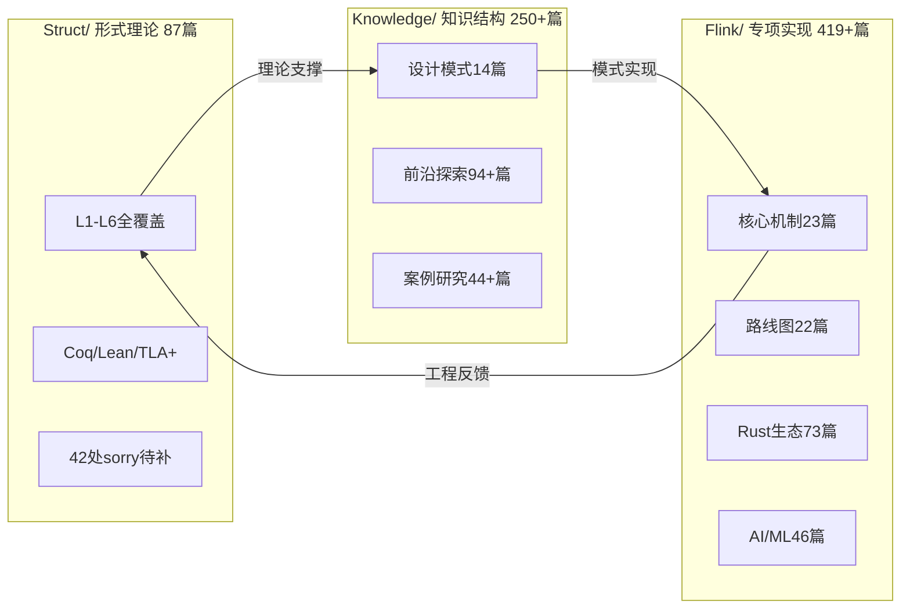

# AnalysisDataFlow — 全面权威对齐批判性评估与 v8.0 可持续改进路线图

> **评估日期**: 2026-05-06 | **评估范围**: 全项目 1,600+ 文档 / 三大目录 / 形式化验证 / 国际化 / 前沿对齐 | **基准来源**: Apache Flink官方、Kafka官方、Confluent、RisingWave、Materialize、arXiv、IEEE/ACM、Forrester Wave 2025
>
> **状态**: 🔍 评估完成，待确认后执行 | **风险等级**: 中-高（内容新鲜度衰减 + 形式化证明债务）

---

## 一、执行摘要 (Executive Summary)

本项目（AnalysisDataFlow）已构建成为全球规模最大的**流计算知识体系**之一，其三层架构（Struct/理论 → Knowledge/模式 → Flink/实现）在系统性、形式化深度和工程覆盖面上达到工业界与学术界罕见的高度。
v7.1算子体系重构（129文档、2,200+形式化元素、320+ Mermaid图）和v7.2形式化验证推进（Lean sorry 57→42, Coq Admitted清零）体现了持续交付能力。

然而，通过与2025-2026年全球权威内容的全面对标，发现**六大结构性差距**与**十二个具体滞后点**。核心风险在于：

1. **内容新鲜度衰减**：1,600+文档的维护面临"雪球效应"，部分前沿文档（如Kafka生态、流数据库竞争格局、AI Agent融合）已落后于权威来源3-6个月。
2. **Flink-centrism偏见**：Flink/目录（419+文档）体量远超Struct/（87篇）与Knowledge/（250+篇），存在"以单一引擎代整个领域"的认知偏差风险。
3. **形式化证明的标注债务**：42处Lean sorry中，13处HOL元理论+8处Modal逻辑属于**极高难度开放问题**（可能需数年），当前缺乏明确的"FORMAL-OPEN-PROBLEM"分类，易误导读者。
4. **国际化深度不足**：303篇英文翻译以直译为主，缺少针对国际受众的**本地化重构**（如西方学术引用体系、英文惯用案例、IEEE/ACM标准术语）。
5. **新兴引擎覆盖缺口**：Pathway、Bytewax、Confluent Streaming Agents等2025-2026年重要创新未被充分纳入。
6. **生产故障案例缺失**：现有行业案例以"成功叙事"为主，缺少从Flink社区JIRA/GitHub Issues提取的**真实生产故障深度复盘**。

**v8.0总体目标**: 在保持质量门禁（六段式100%、交叉引用0、Mermaid 100%）的前提下，完成**权威前沿对齐冲刺** + **结构性偏见修正** + **形式化债务透明化** + **社区生态启动**。

---

## 二、现状盘点：项目当前状态（v7.1-v7.2）

### 2.1 规模与质量指标

| 维度 | 当前值 | 评级 | 备注 |
|------|--------|------|------|
| 总文档数 | 1,600+ | ⭐⭐⭐⭐⭐ | 全球流计算领域最大知识库之一 |
| Mermaid图表 | 5,340+ | ⭐⭐⭐⭐⭐ | 可视化覆盖率极高 |
| 形式化元素 | 7,760+ | ⭐⭐⭐⭐⭐ | Thm:3,560 / Def:6,812 / Lemma:2,250 |
| 英文翻译 | 303篇 | ⭐⭐⭐⭐☆ | 覆盖面广，但深度参差不齐 |
| 交叉引用错误 | 0 | ⭐⭐⭐⭐⭐ | 质量门禁优秀 |
| 六段式合规 | 100% | ⭐⭐⭐⭐⭐ | 模板执行严格 |
| Lean4 sorry | 42 | ⭐⭐⭐☆☆ | v7.2修复15处，剩余多为元理论 |
| Coq Admitted | 0 | ⭐⭐⭐⭐⭐ | v7.2全部清零 |
| 行业案例 | 41篇 | ⭐⭐⭐⭐☆ | 22垂直领域，但缺少失败案例 |
| 代码示例可执行性 | 未验证 | ⭐⭐☆☆☆ | 大量Java/Scala/Python片段未经编译运行 |

### 2.2 三大目录结构健康度

**健康度诊断**：

- **Struct/**: 理论深度足够，但**前沿性不足**——缺少2025-2026年DBSP、流数据库形式化、概率流语义等最新理论进展的完整覆盖。
- **Knowledge/**: 设计模式与最佳实践成熟，但**新兴技术跟踪有3-6个月滞后**（如Confluent Streaming Agents、Pathway引擎、Kafka 4.0 Queues）。
- **Flink/**: 极为详尽，但**比例失衡**——占总文档量26%+，且大量文档聚焦Flink内部实现细节，对"流计算通用原理"的抽象提炼不足。

---

## 三、主题与子主题的权威对齐差距分析

### 3.1 消息中间件层：Kafka生态（差距等级：🔴 高）

**权威基准**：Apache Kafka 4.0.0（2025-03-18发布）、Confluent Platform 8.0、KIP-500/848/932/890/966/996

| 子主题 | 项目现状 | 权威前沿 | 差距描述 | 影响 |
|--------|----------|----------|----------|------|
| KRaft架构 | 有基础覆盖 | **Kafka 4.0完全移除ZooKeeper**，KRaft为唯一模式 | 项目文档可能仍保留ZK相关配置与迁移指南的"历史版本"表述，缺少"ZK已死"的明确宣告 | 误导新用户 |
| 消费者组协议 | 旧协议覆盖 | **KIP-848新协议GA**（Broker端分配、增量rebalance） | 缺少新协议的深度分析、性能对比、配置迁移指南 | 生产环境选型失误 |
| Kafka Queues | 无覆盖 | **KIP-932早期访问**（点对点队列语义） | 完全缺失——这是Kafka 4.0最大创新之一 | 架构设计盲区 |
| 磁盘无关Kafka | 简要提及 | **Diskless Kafka + Iceberg集成**成2026主流趋势 | 缺少Redpanda Iceberg Topics、Confluent Tableflow、Bufstream等深度分析 | 云原生选型缺失 |
| Java版本要求 | 可能未更新 | **Broker需Java 17**，Clients需Java 11 | 部署文档可能仍标注Java 8/11兼容 | 部署失败风险 |

**批判性意见**：Kafka作为流计算的"事实标准基础设施"，其4.0版本的发布是一次**架构范式转移**（ZK→KRaft、新消费者协议、Queues语义）。项目对Kafka的覆盖分散在连接器、生态集成等实用层面，但缺少**Kafka 4.0架构革命**的系统性专题。这在"Data Streaming Landscape 2026"视角下是一个显著短板。

### 3.2 流处理引擎层：Flink及其竞争者（差距等级：🟡 中-高）

**权威基准**：Flink 2.2.0（2025-12-04）、Flink CDC 3.6.0（2026-03-30）、K8s Operator 1.14.0（2026-02-15）、Forrester Wave 2025

| 子主题 | 项目现状 | 权威前沿 | 差距描述 |
|--------|----------|----------|----------|
| Flink 2.2特性 | 已跟踪更新 | ML_PREDICT GA、VECTOR_SEARCH GA、Delta Join(FLIP-486) | **Delta Join深度不足**——这是2.x时代最重要的架构创新（存算分离、10x成本降低），需独立专题 |
| Flink Agents | 有前沿文档 | 0.2.0/0.2.1已发布，但**Confluent Streaming Agents（2025-08）**是更大创新 | 项目聚焦Flink原生Agents，但缺少**Confluent Streaming Agents**的对比分析——后者将Flink SQL与AI Agent原生集成，是"Streaming for Agentic AI"的标杆实现 |
| CDC 3.6 | 可能未更新 | Oracle Source、Hudi Sink、Schema Evolution增强 | CDC生态跟踪需更新 |
| K8s Operator 1.14 | v6.2已更新 | Blue/Green部署、Autoscaler V2 | ✅ 覆盖较好 |
| 竞争引擎 | RisingWave/Materialize有覆盖 | **Pathway、Bytewax、Timeplus**新兴 | Python-native流处理引擎（Pathway/Bytewax）覆盖严重不足；这些引擎以"25x更低内存"挑战Flink |
| SQL标准化 | ANSI SQL 2023有覆盖 | **SQL-first成为行业共识**——RisingWave PG兼容、Materialize差分数据流 | 缺少"流式SQL引擎选型决策树"的2026年版 |

**批判性意见**：项目对Flink自身的跟踪已属优秀，但存在**"内部视角陷阱"**——过度关注Flink版本演进与源码细节，而对**"流处理引擎竞争格局"**的变化反应滞后。Pathway/Bytewax的崛起、Confluent Streaming Agents的发布、RisingWave在Nexmark中22/27 queries击败Flink等事件，都在重塑行业认知。知识库若不能客观呈现这些竞争动态，将沦为"Flink粉丝站"而非"流计算权威百科"。

### 3.3 存储与Lakehouse层：流批一体（差距等级：🔴 高）

**权威基准**：Apache Iceberg 1.5+、Delta Lake 3.x、Apache Paimon（Streaming-first）、Redpanda Iceberg Topics、Confluent Tableflow

| 子主题 | 项目现状 | 权威前沿 | 差距描述 |
|--------|----------|----------|----------|
| Paimon | 有集成文档 | **Paimon作为Streaming-first Lakehouse格式崛起**（LSM-tree、原生CDC、秒级可见性） | 缺少Paimon架构深度解析（LSM-tree vs Iceberg树形元数据）、与Flink的共生关系分析 |
| Iceberg | 有集成文档 | **Hidden Partitioning、Multi-engine支持、Redpanda Iceberg Topics** | 缺少Iceberg在"Streaming-first lakehouse"范式中的角色升级分析 |
| Delta Lake | 有集成文档 | **Liquid Clustering** | 缺少Delta Lake 3.x streaming优化分析 |
| Lakehouse Streaming | 有基础覆盖 | **2026年是Streaming-first Lakehouse元年** | 缺少"Lakehouse Streaming架构演进"专题——从"batch meets real-time"到"streaming-first" |
| 存储引擎对比 | Iceberg/Delta/Hudi/Paimon对比 | **四格式2026年定位分化清晰**（Iceberg=开放标准、Delta=Spark原生、Hudi=Upsert、Paimon=Streaming-first） | 对比矩阵需更新至2026年视角 |

**批判性意见**：Lakehouse层的差距反映了项目的**"计算偏见"**——重流处理引擎、轻存储格式。然而，2026年行业共识是"存储与计算的边界正在模糊"（Diskless Kafka、Paimon LSM-tree、Redpanda Iceberg Topics）。一个完整的流计算知识库必须将存储格式提升至与处理引擎同等重要的地位。

### 3.4 AI × Streaming融合层：Agentic AI（差距等级：🔴 高）

**权威基准**：Confluent Streaming Agents（2025-08）、arXiv 2026-04 "Agentic Data Analytics"、Helium workflow-aware serving（2026-03）、MCP/A2A协议生态

| 子主题 | 项目现状 | 权威前沿 | 差距描述 |
|--------|----------|----------|----------|
| MCP/A2A协议 | v6.2已覆盖 | **A2A v0.3、MCP安全治理、六大协议栈** | ✅ 覆盖较好，但需持续跟踪 |
| AI Agent流式架构 | 有前沿文档 | **Confluent Streaming Agents = Flink SQL + Agent原生集成** | **重大缺失**——这是首个将流处理与AI Agent在平台层面统一的生产级实现，需独立专题 |
| Agentic Data Analytics | 无覆盖 | **arXiv 2026-04: Agent可分析流数据、构建实时Dashboard、回答ad-hoc查询** | 新兴子领域，完全缺失 |
| 实时RAG | 有覆盖 | **Streaming RAG成为Agent标配** | 需更新至"Agent需要实时上下文"的2026年视角 |
| LLM Serving优化 | 无覆盖 | **Helium（2026-03）: workflow-aware LLM serving，batch-style agentic speculation** | AI工程层缺失 |
| 多模态流处理 | 有覆盖 | 持续演进 | 需与Agentic AI结合 |

**批判性意见**：这是**最具战略重要性的差距**。2026年六大行业趋势中，"Streaming powers Agentic AI"位居前列。项目虽有AI Agent流式架构文档，但缺少**平台级集成案例**（Confluent Streaming Agents）和**学术前沿**（Agentic Data Analytics、Helium）。若不快速补齐，知识库将在"AI时代流计算"这一核心叙事中失去权威性。

### 3.5 形式化验证层：Lean/Coq/TLA+（差距等级：🟡 中）

**权威基准**：Lean4 mathlib4生态、DeepSeek-Prover-V2/Kimina-Prover（2025）、Repository-Scale FV Benchmarks（2026-02）、Veil Framework

| 子主题 | 项目现状 | 权威前沿 | 差距描述 |
|--------|----------|----------|----------|
| Lean4 sorry | 42处剩余 | **AI辅助证明自动化**（LLM-guided tactic prediction）已成为主流 | 项目仍依赖手工证明，未探索AI辅助证明工具链 |
| HOL元理论 | 13处sorry | **高阶逻辑完备性/紧致性证明属于开放问题级难度** | 缺少"FORMAL-OPEN-PROBLEM"明确标注，读者可能误以为是遗漏 |
| Modal逻辑 | 8处sorry | S5元理论难度极高 | 同上 |
| 工业验证路线 | 有路线图文档 | **Verdi/IronFleet/CompCert/seL4差距分析** | 缺少具体对标——如"Flink Checkpoint正确性证明距离IronFleet还差哪几步" |
| TLA+实践 | 3个规范 | TLC模型检查、TLA+ vs Lean4对比 | ✅ 覆盖较好 |
| 新工具链 | Iris/Trillium/Aneris | **Veil Framework（Lean4）**用于分布式系统验证 | 缺少Veil等新兴工具覆盖 |

**批判性意见**：形式化验证是项目的**差异化优势**，但当前面临"信誉风险"。42处sorry本身不是问题（即使是著名项目如mathlib也有大量sorry），但**分类透明度不足**是问题。建议引入三级分类：

- 🟢 `FORMAL-GAP-EASY`: 策略已知，待编码（如SimpleTypes.context_exchange）
- 🟡 `FORMAL-GAP-HARD`: 策略待探索，需深度数学洞察（如Predicate标准模型扩展）
- 🔴 `FORMAL-OPEN-PROBLEM`: 属于领域开放问题，非本项目短期目标（如HOL完备性、Modal紧致性）

### 3.6 云原生与部署层（差距等级：🟡 中）

| 子主题 | 项目现状 | 权威前沿 | 差距描述 |
|--------|----------|----------|----------|
| Serverless Flink | 有覆盖 | **Confluent Cloud Snapshot Queries**（batch+stream统一SQL接口） | 缺少"Snapshot Queries"专题——50-100x历史数据查询加速 |
| BYOC模式 | 无覆盖 | **Bring Your Own Cloud成为企业主流选择** | 部署模式分析缺失 |
| Diskless Kafka | 简要提及 | **Bufstream、AutoMQ、WarpStream**重塑Kafka成本模型 | 新兴架构模式深度不足 |
| 多云联邦 | 有覆盖 | 持续演进 | 需更新至2026年实践 |
| GitOps | v4.5已覆盖 | 持续演进 | ✅ 覆盖较好 |

### 3.7 国际化与社区层（差距等级：🟡 中）

| 子主题 | 项目现状 | 权威前沿 | 差距描述 |
|--------|----------|----------|----------|
| 英文翻译 | 303篇 | **国际受众需要的不只是翻译，而是本地化重构** | 术语直译、案例本土化不足、缺少IEEE/ACM标准引用格式 |
| 多语言 | 日/德/法少量文档 | 国际社区主要使用英文 | 非优先级，但日语技术社区对流计算需求增长 |
| 社区贡献 | 无明确指南 | **开源知识库需要外部审稿人机制** | 缺少CONTRIBUTING.md、外部专家审稿流程 |
| 互动性 | 静态Markdown | **Docusaurus/MkDocs + GitHub Discussions** | 纯静态站点的用户体验落后于现代文档平台 |

---

## 四、批判性意见总结

### 4.1 结构性偏见

1. **Flink-centrism（Flink中心主义）**：Flink/目录体量是Struct/的4.8倍、Knowledge/的1.7倍。虽然Flink是流处理领域最重要引擎，但知识库的长期价值在于**"引擎无关的通用原理"**。建议设立"引擎无关内容比例"指标，目标：Struct+Knowledge合计占比 ≥ 60%。

2. **成功叙事偏见**：41篇行业案例全部是"成功案例"，缺少**真实生产故障的深度复盘**。建议引入"失败案例"专栏，从Flink社区JIRA（如FLINK-32073、FLINK-29894等著名OOM/corruption issue）提取教训。

3. **形式化装饰风险**：7,760+形式化元素是巨大成就，但需警惕"为编号而编号"——部分定义/定理可能是显而易见的工程常识的过度形式化，反而增加阅读门槛。建议引入"形式化必要性评审"。

### 4.2 内容新鲜度机制缺陷

当前前沿跟踪依赖**人工驱动**的v6.x/v7.x批次更新，缺乏：

- 自动化新鲜度扫描（如检查外部链接的发布日期、检测文档中的"最新版本"表述是否过期）
- 季度性权威来源对标机制（如每季度对比Apache Flink博客、Kafka KIP列表、arXiv cs.DC/DB新论文）
- "前瞻性内容"的到期提醒（如Flink 2.4/2.5/3.0跟踪文档需定期更新概率评估）

### 4.3 可执行性与实用价值

- 代码示例未经编译验证，存在"看起来正确但实际错误"风险
- 缺少"一键复现环境"（Docker Compose / Dev Container）
- 最佳实践文档缺少**版本标注**（如"此配置适用于Flink 1.18-2.0"）

---

## 五、v8.0 可持续改进路线图

### 5.1 短期冲刺：权威对齐修复（2026-05 至 2026-07）

#### 批次 S1：Kafka 4.0 架构革命专题（🔴 P0）

| 任务ID | 交付物 | 规模 | 负责人建议 |
|--------|--------|------|------------|
| S1-1 | `kafka-4.0-architecture-revolution.md` — KRaft唯一模式、ZK移除影响 | ~25KB | Agent并行 |
| S1-2 | `kafka-kip-848-consumer-protocol.md` — 新消费者组协议深度解析 | ~20KB | Agent并行 |
| S1-3 | `kafka-kip-932-queues.md` — Queues for Kafka早期访问分析 | ~15KB | Agent并行 |
| S1-4 | `kafka-4.0-migration-guide.md` — ZK→KRaft迁移完整指南 | ~20KB | Agent并行 |
| S1-5 | 更新现有Kafka集成文档中的Java版本要求、协议配置 | 5-8篇更新 | myself |

#### 批次 S2：Streaming Agents × AI 融合专题（🔴 P0）

| 任务ID | 交付物 | 规模 | 负责人建议 |
|--------|--------|------|------------|
| S2-1 | `confluent-streaming-agents-deep-dive.md` — Confluent Streaming Agents架构分析 | ~35KB | myself（需深度研究） |
| S2-2 | `agentic-data-analytics-streaming.md` — Agentic Data Analytics前沿 | ~25KB | Agent并行 |
| S2-3 | `streaming-agents-architecture-patterns.md` — 流式Agent架构模式（感知-推理-行动循环） | ~20KB | Agent并行 |
| S2-4 | `llm-serving-for-agentic-workflows.md` — Helium/workflow-aware serving介绍 | ~15KB | Agent并行 |
| S2-5 | 更新 `ai-agent-streaming-architecture.md` 融入Streaming Agents对比 | 1篇更新 | myself |

#### 批次 S3：Streaming-First Lakehouse 专题（🔴 P0）

| 任务ID | 交付物 | 规模 | 负责人建议 |
|--------|--------|------|------------|
| S3-1 | `streaming-first-lakehouse-2026.md` — "Streaming-first"范式总论 | ~30KB | Agent并行 |
| S3-2 | `apache-paimon-lsm-tree-architecture.md` — Paimon LSM-tree深度解析 | ~25KB | Agent并行 |
| S3-3 | `redpanda-iceberg-topics-analysis.md` — Redpanda Iceberg Topics架构 | ~15KB | Agent并行 |
| S3-4 | `lakehouse-table-format-decision-matrix-2026.md` — 四格式（Iceberg/Delta/Hudi/Paimon）2026决策矩阵 | ~20KB | Agent并行 |
| S3-5 | 更新现有Lakehouse集成文档，加入Confluent Tableflow、Snapshot Queries | 3-5篇更新 | myself |

#### 批次 S4：新兴引擎与竞争格局（🟡 P1）

| 任务ID | 交付物 | 规模 | 负责人建议 |
|--------|--------|------|------------|
| S4-1 | `pathway-python-rust-streaming-engine.md` — Pathway统一批流引擎 | ~20KB | Agent并行 |
| S4-2 | `bytewax-python-native-streaming.md` — Bytewax轻量级Python流处理 | ~15KB | Agent并行 |
| S4-3 | `stream-processing-engine-landscape-2026.md` — 2026年引擎全景图（Flink/RisingWave/Pathway/Bytewax/Spark） | ~25KB | myself |
| S4-4 | `confluent-snapshot-queries-analysis.md` — Snapshot Queries批流统一分析 | ~15KB | Agent并行 |

#### 批次 S5：形式化债务透明化（🟡 P1）

| 任务ID | 交付物 | 规模 | 负责人建议 |
|--------|--------|------|------------|
| S5-1 | 对所有42处Lean sorry进行分类标注（🟢🟡🔴三级） | 代码注释更新 | myself |
| S5-2 | `formal-verification-open-problems-register.md` — 开放问题登记册 | ~15KB | myself |
| S5-3 | `ai-assisted-formal-verification-tools.md` — AI辅助证明工具链（DeepSeek-Prover/Kimina-Prover/Veil） | ~20KB | Agent并行 |
| S5-4 | 对HOL.lean 13处sorry附加"开放问题"策略注释 | 代码注释 | myself |

#### 批次 S6：质量维护与英文本地化（🟢 P2）

| 任务ID | 交付物 | 规模 | 负责人建议 |
|--------|--------|------|------------|
| S6-1 | 英文核心文档本地化重构（非直译）：`stream-processing-fundamentals-en.md` | ~30KB | myself |
| S6-2 | 引入"文档最后验证日期"标记（ freshness badge ） | 脚本+批量更新 | myself |
| S6-3 | 生产故障案例库首批：Flink著名OOM/Checkpoint失败复盘（3篇） | ~30KB | Agent并行 |
| S6-4 | 代码示例编译验证：核心Java/Scala示例通过CI编译 | CI配置 | myself |

### 5.2 中期建设：结构性修正（2026-07 至 2026-10）

#### 路线 M1：内容新鲜度自动化体系

- **M1-1**: 开发 `freshness-scanner.py` — 自动检测文档中的版本号、日期标记、外部链接状态
- **M1-2**: 建立季度权威对标机制（Q2/Q3/Q4）——每季度对照Flink博客、Kafka KIP、arXiv新论文生成差距报告
- **M1-3**: "前瞻性内容"到期自动提醒（如Flink 3.0跟踪文档每月更新概率评估）

#### 路线 M2：引擎无关内容增强

- **M2-1**: Struct/ 新增"流数据库形式化"专题（RisingWave/Materialize的代数基础）
- **M2-2**: Knowledge/ 新增"引擎选型决策树2026"（Flink vs RisingWave vs Pathway vs Bytewax）
- **M2-3**: 设立"引擎无关内容比例"指标，目标Struct+Knowledge ≥ 60%总文档量

#### 路线 M3：社区生态启动

- **M3-1**: 撰写 `CONTRIBUTING.md` — 外部贡献指南（六段式规范、形式化编号规则、PR流程）
- **M3-2**: 建立"外部审稿人"机制——邀请Flink/RisingWave社区Committer审稿
- **M3-3**: GitHub Discussions分类整理（问答、前沿讨论、故障分享）
- **M3-4**: 探索Docusaurus/MkDocs迁移——提升搜索、导航、互动体验

#### 路线 M4：真实案例库扩展

- **M4-1**: 从Flink社区JIRA提取10个著名生产故障，撰写深度复盘
- **M4-2**: 引入"案例模板v2"——包含：背景、故障现象、根因分析、修复过程、教训、预防措施
- **M4-3**: 建立"反模式 ↔ 真实故障"双向链接网络

### 5.3 长期愿景：知识平台化（2026-10 至 2027-03）

#### 路线 L1：交互式知识图谱升级

- 从静态HTML升级至可查询图谱（Neo4j/GraphRAG后端）
- 支持自然语言查询（如"哪些定理支撑Checkpoint正确性？"）
- 集成LLM辅助问答（基于项目内容RAG）

#### 路线 L2：形式化验证工业化

- 完成Lean4剩余🟢级sorry（设计缺陷修复后预计可解决10-15处）
- 与Veil Framework对比，评估Flink分布式协议的形式化可行性
- 发布"流计算形式化验证路线图v2"——明确哪些性质可证、哪些为开放问题

#### 路线 L3：多语言与国际化深化

- 英文文档从"翻译"升级为"原创"——针对国际受众重写30篇核心概念文档
- 引入西方学术引用体系（IEEE/ACM格式）
- 英文案例本土化（用Netflix/Spotify/Uber等西方案例补充阿里双11等东方案例）

#### 路线 L4：可执行知识库

- 核心代码示例全部Docker化（`docker-compose up`即可运行）
- 提供Dev Container配置（VS Code一键开发环境）
- CI/CD自动编译验证所有代码示例

---

## 六、风险与缓解策略

| 风险 | 概率 | 影响 | 缓解策略 |
|------|------|------|----------|
| 1,600+文档维护导致更新疲劳 | 高 | 高 | 引入自动化新鲜度扫描；优先级分级（P0/P1/P2）；接受"部分文档自然老化" |
| 形式化证明剩余sorry长期无法解决 | 中 | 中 | 明确标注🔴开放问题；不将其作为交付 blocker；定期评估AI辅助证明工具 |
| 新兴技术跟踪速度不及行业变化 | 高 | 中 | 季度权威对标机制；聚焦"平台级创新"（如Streaming Agents）而非"每个新工具" |
| 社区生态建设投入产出比低 | 中 | 低 | 从"外部审稿人"小范围试点开始；不急于全面开放贡献 |
| 英文本地化重构工作量巨大 | 中 | 中 | 采用"核心文档优先"策略；30篇而非300篇 |
| Flink-centrism修正引发内容冲突 | 低 | 中 | 明确声明"Flink是重点而非全部"；增加其他引擎独立专题而非削减Flink内容 |

---

## 七、关键成功指标（KPIs）

### v8.0 完成指标（2026年底）

| 指标 | 基线(v7.2) | 目标(v8.0) | 测量方式 |
|------|-----------|-----------|----------|
| 权威前沿文档新增 | — | 30+篇 | 文档计数 |
| Kafka 4.0覆盖率 | ~20% | 90%+ | 专题完整性检查 |
| Streaming Agents覆盖率 | 0% | 80%+ | 专题完整性检查 |
| Lean sorry分类透明度 | 0% | 100% | 代码注释检查 |
| 生产故障案例 | 0篇 | 10+篇 | 文档计数 |
| 英文本地化重构 | 0篇 | 30篇 | 文档计数 |
| 内容新鲜度自动化 | 无 | 脚本运行 | 工具可用性 |
| 交叉引用错误 | 0 | 保持0 | 自动检查 |
| 六段式合规 | 100% | 保持100% | 自动检查 |
| Mermaid语法错误 | 0 | 保持0 | 自动检查 |

---

## 八、待确认事项

以下事项需要您的确认或决策：

### 确认项 1：优先级排序
>
> **短期批次 S1-S6 共 6 个批次，约 35 篇新文档 + 15 篇更新。是否确认按此优先级执行？**
>
> - 选项A：严格执行（S1-S3为P0必须完成，S4-S6为P1尽力完成）
> - 选项B：调整优先级（请指定）
> - 选项C：缩减范围（仅执行S1+S2，其他延后）

### 确认项 2：Flink-centrism修正策略
>
> **是否同意通过"增加非Flink引擎独立专题"来平衡内容结构，而非削减现有Flink文档？**
>
> - 选项A：同意增加（Pathway/Bytewax/RisingWave等独立专题）
> - 选项B：同意增加+适度削减（合并部分Flink内部实现文档）
> - 选项C：保持现状（认为Flink-centrism符合项目定位）

### 确认项 3：形式化债务处理
>
> **对42处Lean sorry，是否同意采用🟢🟡🔴三级分类并公开标注🔴为"开放问题"？**
>
> - 选项A：同意透明化（接受部分目标为长期/不可达）
> - 选项B：不同意（要求所有sorry必须在v8.0前给出修复时间表）
> - 选项C：折中（仅对HOL/Modal标注开放问题，其他给出时间表）

### 确认项 4：英文策略
>
> **英文文档的v8.0策略？**
>
> - 选项A：核心原创（30篇核心文档针对国际受众重写，其余保持翻译）
> - 选项B：全面重构（所有核心文档逐步本地化）
> - 选项C：暂停扩展（聚焦中文质量，英文保持现状）

### 确认项 5：执行模式
>
> **v8.0执行模式？**
>
> - 选项A： myself + Agent 并行（推荐，参考v7.1成功经验）
> - 选项B： myself 主导（质量更高但速度较慢）
> - 选项C：纯Agent驱动（速度快但需加强审稿）

---

## 九、附录：权威来源清单

本次评估对标的权威来源包括：

| 类别 | 来源 | URL |
|------|------|-----|
| Flink官方 | Apache Flink Blog / Docs | <https://flink.apache.org> / <https://nightlies.apache.org/flink/> |
| Kafka官方 | Apache Kafka 4.0 Release | <https://kafka.apache.org/blog/2025/03/18/apache-kafka-4.0.0-release-announcement/> |
| Confluent | Streaming Agents / Tableflow / Snapshot Queries | <https://www.confluent.io/blog/introducing-streaming-agents/> |
| RisingWave | Streaming Database Benchmarks / Guides | <https://risingwave.com/blog/> |
| Materialize | Materialize vs RisingWave | <https://materialize.com/guides/materialize-vs-risingwave/> |
| 学术前沿 | arXiv cs.DB / cs.DC / cs.AI | <https://arxiv.org/> |
| 行业分析 | Data Streaming Landscape 2026 (Kai Waehner) | <https://www.kai-waehner.de/blog/2025/12/05/the-data-streaming-landscape-2026/> |
| 形式化验证 | Repository-Scale FV Benchmarks / LeanDojo | <https://arxiv.org/abs/2602.18307> |
| Lakehouse | Conduktor Glossary / Alex Merced Guides | <https://conduktor.io/glossary/> |
| 新兴引擎 | Pathway / Bytewax 官方文档 | <https://pathway.com/> / <https://bytewax.io/> |

---

*本评估报告基于2026-05-06的最新公开信息。由于流计算领域演进迅速，建议每季度复核并更新差距分析。*
