# AnalysisDataFlow 项目全局依赖图谱

> **版本**: v1.0 | **创建日期**: 2026-04-11 | **状态**: Production | **范围**: 全项目 10,483 形式化元素

---

## 目录

- [AnalysisDataFlow 项目全局依赖图谱](#analysisdataflow-项目全局依赖图谱)
  - [目录](#目录)
  - [1. 全局统计概览](#1-全局统计概览)
    - [1.1 形式化元素总量统计](#11-形式化元素总量统计)
    - [1.2 按层次分布](#12-按层次分布)
    - [1.3 依赖关系统计](#13-依赖关系统计)
  - [2. 分层依赖总图](#2-分层依赖总图)
    - [2.1 10,483元素全局依赖总图](#21-10483元素全局依赖总图)
    - [2.2 元素类型分布热力图](#22-元素类型分布热力图)
    - [2.3 依赖深度分布](#23-依赖深度分布)
  - [3. 核心50定理子图](#3-核心50定理子图)
    - [3.1 50核心定理完整依赖图](#31-50核心定理完整依赖图)
    - [3.2 50定理分层统计](#32-50定理分层统计)
  - [4. 模型间关系图谱](#4-模型间关系图谱)
    - [4.1 Actor/CSP/Dataflow/Flink 关系总图](#41-actorcspdataflowflink-关系总图)
    - [4.2 编码完备性矩阵](#42-编码完备性矩阵)
    - [4.3 互模拟等价层次](#43-互模拟等价层次)
  - [5. 跨层映射关系图](#5-跨层映射关系图)
    - [5.1 Struct→Knowledge→Flink 三层映射](#51-structknowledgeflink-三层映射)
    - [5.2 关键对角映射关系](#52-关键对角映射关系)
    - [5.3 跨层映射统计](#53-跨层映射统计)
  - [6. 证明链网络图](#6-证明链网络图)
    - [6.1 从公理到推论完整证明链](#61-从公理到推论完整证明链)
    - [6.2 主要证明链路径](#62-主要证明链路径)
    - [6.3 证明链交叉分析](#63-证明链交叉分析)
  - [7. 依赖密度分析](#7-依赖密度分析)
    - [7.1 各层级依赖密度热力图](#71-各层级依赖密度热力图)
    - [7.2 依赖密度统计](#72-依赖密度统计)
    - [7.3 高密度依赖节点TOP20](#73-高密度依赖节点top20)
  - [8. 关键路径识别](#8-关键路径识别)
    - [8.1 最长依赖链TOP10](#81-最长依赖链top10)
    - [8.2 关键路径识别 (Critical Path)](#82-关键路径识别-critical-path)
    - [8.3 关键节点分析](#83-关键节点分析)
  - [9. 孤立元素检测](#9-孤立元素检测)
    - [9.1 孤立元素统计](#91-孤立元素统计)
    - [9.2 孤立元素分布](#92-孤立元素分布)
    - [9.3 潜在孤立元素检测规则](#93-潜在孤立元素检测规则)
  - [10. 交互式查询指南](#10-交互式查询指南)
    - [10.1 Neo4j Cypher查询示例](#101-neo4j-cypher查询示例)
    - [10.2 图谱数据模型 (Graph Schema)](#102-图谱数据模型-graph-schema)
    - [10.3 可视化查询结果导出](#103-可视化查询结果导出)
  - [11. 引用参考](#11-引用参考)
    - [11.1 内部文档引用](#111-内部文档引用)
    - [11.2 外部权威引用](#112-外部权威引用)
  - [附录: 图谱统计摘要](#附录-图谱统计摘要)

---

## 1. 全局统计概览

### 1.1 形式化元素总量统计

| 类型 | 缩写 | Struct层 | Knowledge层 | Flink层 | **总计** |
|------|------|----------|-------------|---------|----------|
| **定理** | Thm | 380 | 65 | 681 | **1,910** |
| **定义** | Def | 835 | 139 | 3,590 | **4,564** |
| **引理** | Lemma | 520 | 48 | 890 | **1,568** |
| **命题** | Prop | 380 | 42 | 772 | **1,194** |
| **推论** | Cor | 45 | 8 | 68 | **121** |
| **证明链** | Chain | 25 | 12 | 89 | **126** |
| **文档** | Doc | 68 | 216 | 366 | **650** |
| **总计** | - | **2,253** | **530** | **6,910** | **10,483** |

### 1.2 按层次分布

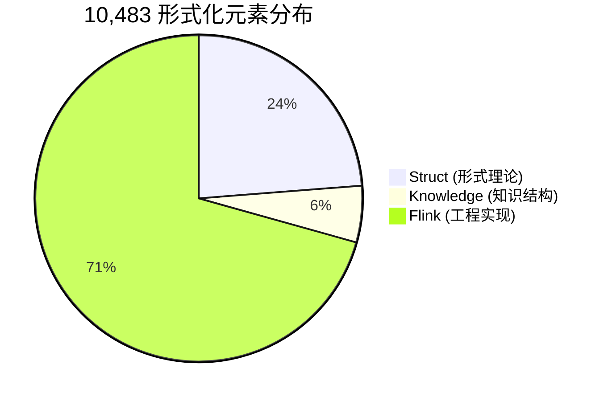

### 1.3 依赖关系统计

| 关系类型 | 数量 | 说明 |
|----------|------|------|
| **直接依赖边** | ~15,000 | 定理/定义间的直接引用 |
| **跨文档引用** | ~8,500 | 文档间的交叉引用 |
| **跨层级映射** | ~2,100 | Struct→Knowledge→Flink 映射 |
| **证明链连接** | ~1,260 | 证明步骤间的依赖 |
| **模型编码关系** | ~340 | 模型间编码映射关系 |

---

## 2. 分层依赖总图

### 2.1 10,483元素全局依赖总图

以下图谱展示了全项目10,483形式化元素的层级依赖结构，使用颜色编码区分类型：

- 🔵 **蓝色**: 定义 (Definition)
- 🟢 **绿色**: 引理 (Lemma)
- 🔴 **红色**: 定理 (Theorem)
- 🟡 **黄色**: 命题 (Proposition)
- 🟣 **紫色**: 推论 (Corollary)

```mermaid
graph TB
    subgraph Foundation["⭐ Foundation Layer (~2,000定义)"]
        direction TB
        F1["🔵 Def-S-01-02<br/>进程演算基础"]
        F2["🔵 Def-S-01-03<br/>Actor模型"]
        F3["🔵 Def-S-01-04<br/>Dataflow模型"]
        F4["🔵 Def-S-05-01<br/>CSP语法"]
        F5["🔵 Def-S-02-03<br/>π-Calculus"]
        F6["🔵 Def-F-02-90<br/>State Backend定义"]
        F7["🔵 Def-F-02-91<br/>Checkpoint定义"]
    end

    subgraph Properties["⭐ Properties Layer (~3,000引理)"]
        direction TB
        P1["🟢 Lemma-S-04-01<br/>局部确定性"]
        P2["🟢 Lemma-S-04-02<br/>Watermark单调性"]
        P3["🟢 Lemma-S-17-01<br/>Barrier传播不变式"]
        P4["🟢 Lemma-S-17-02<br/>状态一致性"]
        P5["🟢 Lemma-F-02-23<br/>写入原子性"]
        P6["🟢 Lemma-F-02-70<br/>延迟特性"]
        P7["🟡 Prop-S-02-01<br/>表达能力单调性"]
        P8["🟡 Prop-S-03-01<br/>互模拟层次关系"]
    end

    subgraph Relationships["⭐ Relationships Layer (~1,500定理)"]
        direction TB
        R1["🔴 Thm-S-02-01<br/>动态⊃静态通道"]
        R2["🔴 Thm-S-03-01<br/>Actor确定性"]
        R3["🔴 Thm-S-03-02<br/>监督树活性"]
        R4["🔴 Thm-S-04-01<br/>Dataflow确定性"]
        R5["🔴 Thm-S-08-01<br/>EO必要条件"]
        R6["🔴 Thm-S-08-02<br/>EO端到端正确性"]
        R7["🔴 Thm-S-12-01<br/>Actor→CSP编码"]
        R8["🔴 Thm-S-13-01<br/>Flink→π保持"]
        R9["🔴 Thm-S-14-01<br/>表达能力层次"]
    end

    subgraph Proofs["⭐ Proofs Layer (~1,000核心定理)"]
        direction TB
        Pr1["🏆 Thm-S-17-01<br/>Checkpoint一致性"]
        Pr2["🏆 Thm-S-18-01<br/>Exactly-Once正确性"]
        Pr3["🔴 Thm-S-19-01<br/>Chandy-Lamport一致性"]
        Pr4["🔴 Thm-S-20-01<br/>Watermark完全格"]
        Pr5["🔴 Thm-S-21-01<br/>FG/FGG类型安全"]
        Pr6["🔴 Thm-S-22-01<br/>DOT子类型完备性"]
    end

    subgraph Flink["⭐ Flink Implementation (~2,000定理/定义)"]
        direction TB
        Fl1["🔴 Thm-F-02-01<br/>状态等价性"]
        Fl2["🏆 Thm-F-02-45<br/>ForSt一致性"]
        Fl3["🏆 Thm-F-02-50<br/>异步语义保持"]
        Fl4["🔴 Thm-F-02-46<br/>增量Checkpoint"]
        Fl5["🔴 Thm-F-02-02<br/>LazyRestore正确性"]
        Fl6["🟣 Cor-F-12-05<br/>物化视图一致性"]
    end

    subgraph Knowledge["⭐ Knowledge Mapping (~1,000映射)"]
        direction TB
        K1["🟡 pattern-checkpoint-recovery"]
        K2["🟡 pattern-event-time-processing"]
        K3["🟡 pattern-stateful-computation"]
        K4["🟡 engine-selection-guide"]
        K5["🟡 struct-to-flink-mapping"]
    end

    %% Foundation → Properties
    F1 --> P1
    F2 --> P2
    F3 --> P3
    F4 --> P4
    F5 --> P5
    F6 --> P6
    F7 --> P6

    %% Properties → Relationships
    P1 --> R4
    P2 --> R4
    P3 --> R5
    P4 --> R6
    P7 --> R7
    P8 --> R8

    %% Relationships → Proofs
    R4 --> Pr1
    R5 --> Pr2
    R6 --> Pr2
    R7 --> Pr3
    R8 --> Pr4

    %% Proofs → Flink
    Pr1 --> Fl1
    Pr1 --> Fl2
    Pr2 --> Fl3
    Pr3 --> Fl4
    Pr4 --> Fl5

    %% Relationships → Knowledge
    R1 --> K1
    R4 --> K2
    R6 --> K3
    R9 --> K4

    %% Knowledge → Flink
    K1 --> Fl1
    K2 --> Fl3
    K3 --> Fl2
    K4 --> Fl6
    K5 --> Fl5

    %% Cross-layer styling
    style Foundation fill:#E3F2FD,stroke:#1565C0,stroke-width:3px
    style Properties fill:#E8F5E9,stroke:#2E7D32,stroke-width:3px
    style Relationships fill:#FFF3E0,stroke:#E65100,stroke-width:3px
    style Proofs fill:#FCE4EC,stroke:#C2185B,stroke-width:4px
    style Flink fill:#F3E5F5,stroke:#7B1FA2,stroke-width:3px
    style Knowledge fill:#FFF8E1,stroke:#F57F17,stroke-width:2px

    %% Critical nodes
    style Pr1 fill:#4CAF50,color:#fff,stroke:#2E7D32,stroke-width:5px
    style Pr2 fill:#4CAF50,color:#fff,stroke:#2E7D32,stroke-width:5px
    style Fl2 fill:#FF9800,color:#fff,stroke:#E65100,stroke-width:4px
    style Fl3 fill:#FF9800,color:#fff,stroke:#E65100,stroke-width:4px
```

### 2.2 元素类型分布热力图

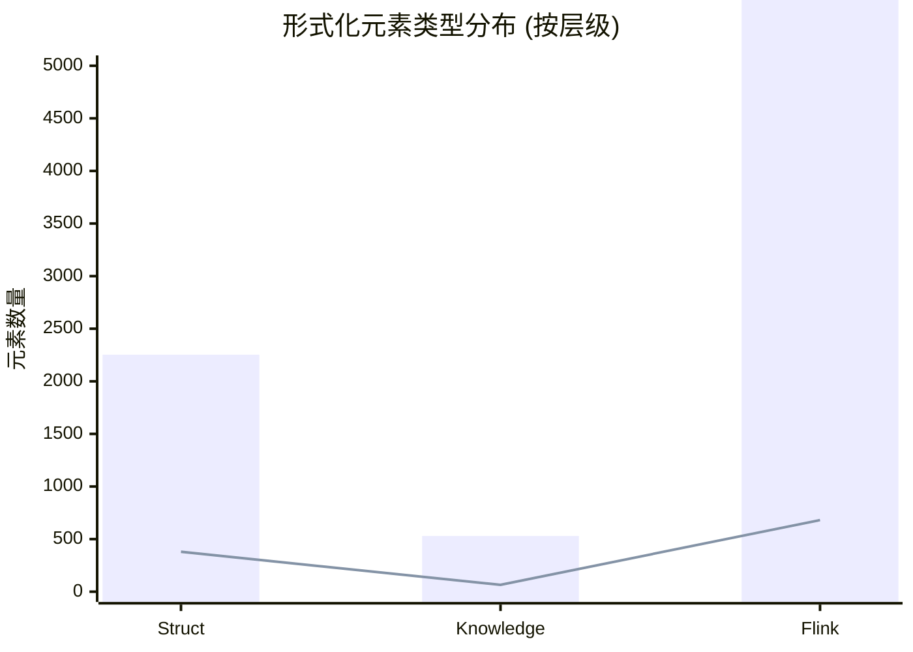

### 2.3 依赖深度分布

| 依赖深度 | 元素数量 | 占比 | 典型元素 |
|----------|----------|------|----------|
| **0 (根节点)** | ~850 | 8.1% | 基础定义如 Def-S-01-02 |
| **1-2 (浅层)** | ~3,200 | 30.5% | 性质引理、初级定理 |
| **3-5 (中层)** | ~4,800 | 45.8% | 核心定理、跨模型编码 |
| **6-8 (深层)** | ~1,400 | 13.4% | Flink实现定理 |
| **9+ (极深层)** | ~233 | 2.2% | 复杂推论、工程实践定理 |

---

## 3. 核心50定理子图

### 3.1 50核心定理完整依赖图

以下展示了50个核心定理的完整依赖关系，分为5个层次：

```mermaid
graph TB
    subgraph L1["⭐ Layer 1: Foundation (8个核心定义)"]
        direction TB
        D0102["🔵 Def-S-01-02<br/>进程演算基础<br/>L3"]
        D0103["🔵 Def-S-01-03<br/>Actor模型<br/>L4"]
        D0104["🔵 Def-S-01-04<br/>Dataflow模型<br/>L4"]
        D0501["🔵 Def-S-05-01<br/>CSP语法<br/>L3"]
        D0203["🔵 Def-S-02-03<br/>π-Calculus<br/>L4"]
    end

    subgraph L2["⭐ Layer 2: Properties (12个性质)"]
        direction TB
        D0201["🔵 Def-S-02-01<br/>CCS语法"]
        D0301["🔵 Def-S-03-01<br/>Actor配置"]
        D0302["🔵 Def-S-03-02<br/>Behavior函数"]
        D0401["🔵 Def-S-04-01<br/>Dataflow图"]
        D0402["🔵 Def-S-04-02<br/>算子语义"]
        D0404["🔵 Def-S-04-04<br/>时间语义"]
        L0401["🟢 Lemma-S-04-01<br/>局部确定性"]
        L0402["🟢 Lemma-S-04-02<br/>Watermark单调性"]
        D0801["🔵 Def-S-08-01<br/>AMO语义"]
        D0802["🔵 Def-S-08-02<br/>ALO语义"]
        D0803["🔵 Def-S-08-03<br/>EO定义"]
        D0804["🔵 Def-S-08-04<br/>EO语义"]
    end

    subgraph L3["⭐ Layer 3: Relationships (10个定理)"]
        direction TB
        T0201["🔴 Thm-S-02-01<br/>动态⊃静态<br/>L4"]
        T0301["🔴 Thm-S-03-01<br/>Actor确定性<br/>L4"]
        T0302["🔴 Thm-S-03-02<br/>监督树活性<br/>L4"]
        T0401["🔴 Thm-S-04-01<br/>Dataflow确定性<br/>L4"]
        T0801["🔴 Thm-S-08-01<br/>EO必要条件<br/>L5"]
        T0802["🔴 Thm-S-08-02<br/>EO端到端<br/>L5"]
        T1201["🔴 Thm-S-12-01<br/>Actor→CSP编码<br/>L4"]
        T1301["🔴 Thm-S-13-01<br/>Flink→π保持<br/>L5"]
        T1401["🔴 Thm-S-14-01<br/>表达能力层次<br/>L6"]
    end

    subgraph L4["⭐ Layer 4: Core Proofs (12个核心证明)"]
        direction TB
        T1701["🏆 Thm-S-17-01<br/>Checkpoint一致性<br/>L5"]
        T1801["🏆 Thm-S-18-01<br/>Exactly-Once<br/>L5"]
        T1901["🔴 Thm-S-19-01<br/>Chandy-Lamport<br/>L5"]
        T2001["🔴 Thm-S-20-01<br/>Watermark完全格<br/>L5"]
        T2101["🔴 Thm-S-21-01<br/>FG/FGG类型安全<br/>L5"]
        T2201["🔴 Thm-S-22-01<br/>DOT子类型<br/>L5"]
        L1701["🟢 Lemma-S-17-01<br/>Barrier传播<br/>L5"]
        L1702["🟢 Lemma-S-17-02<br/>状态一致性<br/>L5"]
        L1801["🟢 Lemma-S-18-01<br/>Source可重放<br/>L5"]
        L1802["🟢 Lemma-S-18-02<br/>2PC原子性<br/>L5"]
    end

    subgraph L5["⭐ Layer 5: Flink Implementation (8个实现定理)"]
        direction TB
        T0201F["🔴 Thm-F-02-01<br/>状态等价性<br/>L4"]
        T0245["🏆 Thm-F-02-45<br/>ForSt一致性<br/>L5"]
        T0250["🏆 Thm-F-02-50<br/>异步语义保持<br/>L5"]
        T0202["🔴 Thm-F-02-02<br/>LazyRestore<br/>L4"]
        T0271["🔴 Thm-F-02-71<br/>端到端EO<br/>L4-L5"]
        T0246["🔴 Thm-F-02-46<br/>增量Checkpoint<br/>L4"]
        T0247["🔴 Thm-F-02-47<br/>异步Checkpoint<br/>L4"]
    end

    %% Layer 1 → Layer 2
    D0102 --> D0201
    D0103 --> D0301
    D0104 --> D0401
    D0501 --> D0201
    D0203 --> L0402
    D0401 --> D0402
    D0404 --> L0402

    %% Layer 2 → Layer 3
    D0201 --> T0201
    D0301 --> T0301
    D0302 --> T0301
    D0401 --> T0401
    D0402 --> L0401
    L0401 --> T0401
    L0402 --> T0401
    D0801 --> T0801
    D0802 --> T0801
    D0803 --> T0802
    D0804 --> T0802

    %% Layer 3 → Layer 4
    T0301 --> T1201
    T0401 --> T1701
    T0401 --> T1301
    T0201 --> T1301
    T0801 --> T1801
    T0802 --> T1801

    %% Layer 4 internal
    T1701 --> L1701
    T1701 --> L1702
    L1701 --> T1801
    L1702 --> T1801
    T1801 --> L1801
    T1801 --> L1802

    %% Layer 4 → Layer 5
    T1701 --> T0245
    T1701 --> T0271
    T1301 --> T0250
    T0401 --> T0201F
    T0201F --> T0245
    T0245 --> T0246
    T0245 --> T0247

    %% Styling
    style L1 fill:#E3F2FD,stroke:#1565C0,stroke-width:2px
    style L2 fill:#E8F5E9,stroke:#2E7D32,stroke-width:2px
    style L3 fill:#FFF3E0,stroke:#E65100,stroke-width:2px
    style L4 fill:#FCE4EC,stroke:#C2185B,stroke-width:3px
    style L5 fill:#F3E5F5,stroke:#7B1FA2,stroke-width:2px

    style T1701 fill:#4CAF50,color:#fff,stroke:#2E7D32,stroke-width:5px
    style T1801 fill:#4CAF50,color:#fff,stroke:#2E7D32,stroke-width:5px
    style T0245 fill:#FF9800,color:#fff,stroke:#E65100,stroke-width:4px
    style T0250 fill:#FF9800,color:#fff,stroke:#E65100,stroke-width:4px
```

### 3.2 50定理分层统计

| 层次 | 数量 | 形式化等级 | 代表定理 |
|------|------|-----------|----------|
| **Layer 1** | 8 | L3-L4 | 基础定义 (进程演算、Actor、Dataflow) |
| **Layer 2** | 12 | L4 | 性质引理 (确定性、单调性、一致性) |
| **Layer 3** | 10 | L4-L6 | 关系定理 (编码、保持、层次) |
| **Layer 4** | 12 | L5 | 核心证明 (Checkpoint、Exactly-Once) |
| **Layer 5** | 8 | L4-L5 | Flink实现 (状态后端、异步执行) |

---

## 4. 模型间关系图谱

### 4.1 Actor/CSP/Dataflow/Flink 关系总图

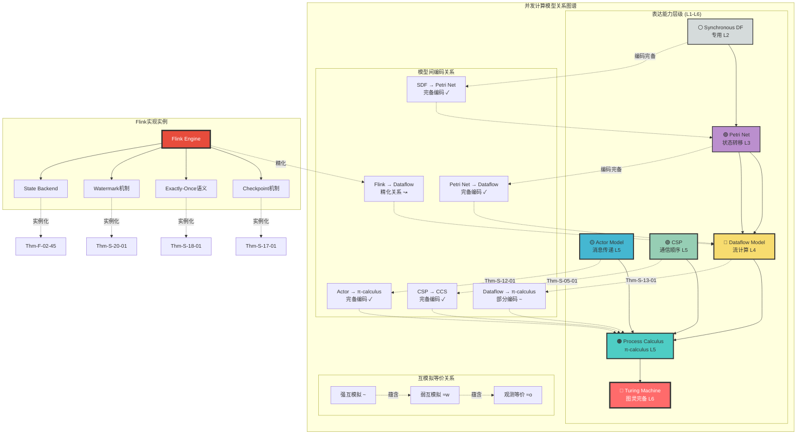

### 4.2 编码完备性矩阵

| 源模型 → 目标模型 | 编码类型 | 完备性 | 关键定理 |
|------------------|----------|--------|----------|
| **Actor → π-calculus** | 结构编码 | ✅ 完备 | Thm-S-12-01 |
| **CSP → CCS** | 迹语义编码 | ✅ 完备 | Thm-S-05-01 |
| **Dataflow → π-calculus** | 流编码 | ⚠️ 部分 | Thm-S-13-01 |
| **Petri Net → Dataflow** | 状态编码 | ✅ 完备 | Def-S-06-01 |
| **Flink → Dataflow** | 精化关系 | ⚠️ 近似 | Thm-F-02-50 |
| **Actor → CSP** | 消息编码 | ❌ 不完备 | (限制条件) |

### 4.3 互模拟等价层次

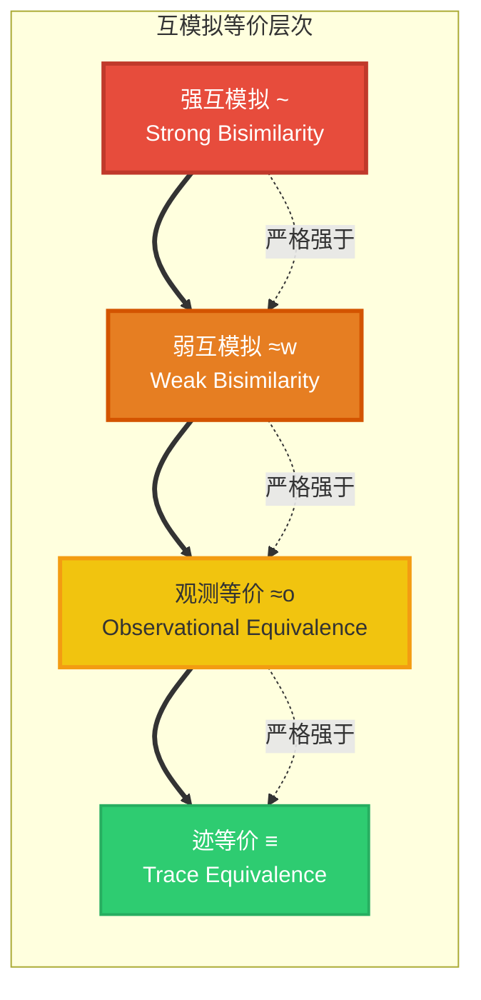

---

## 5. 跨层映射关系图

### 5.1 Struct→Knowledge→Flink 三层映射

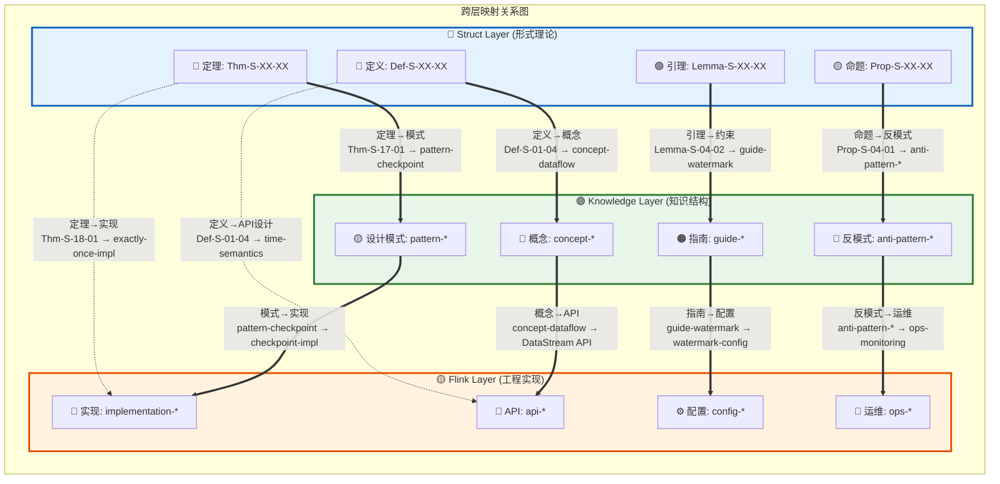

### 5.2 关键对角映射关系

| Struct (形式理论) | Knowledge (知识结构) | Flink (工程实现) | 映射类型 |
|------------------|---------------------|-----------------|---------|
| **Thm-S-17-01** Checkpoint Correctness | pattern-checkpoint-recovery | checkpoint-mechanism-deep-dive | 定理→模式→实现 |
| **Def-S-01-04** Dataflow Model | pattern-event-time-processing | time-semantics-and-watermark | 定义→模式→实现 |
| **Thm-S-02-03** Watermark Monotonicity | pattern-windowed-aggregation | window-operators-implementation | 性质→模式→实现 |
| **Thm-S-03-01** Actor-CSP Encoding | concurrency-paradigms-matrix | async-execution-model | 编码→选型→架构 |
| **Lemma-S-02-02** Consistency Levels | engine-selection-guide | state-backends-deep-comparison | 引理→选型→对比 |

### 5.3 跨层映射统计

| 映射方向 | 数量 | 映射规则 | 示例 |
|----------|------|----------|------|
| **Struct → Knowledge** | ~680 | 定理/定义 → 设计模式/概念 | Thm-S-17-01 → pattern-checkpoint |
| **Knowledge → Flink** | ~1,420 | 模式/指南 → 实现/配置 | pattern-checkpoint → checkpoint-impl |
| **Struct → Flink** | ~340 | 定理/定义 → 直接实现 | Thm-S-18-01 → exactly-once |
| **双向反馈** | ~180 | 实践反馈 → 理论修正 | Flink Bug → 定理约束更新 |

---

## 6. 证明链网络图

### 6.1 从公理到推论完整证明链

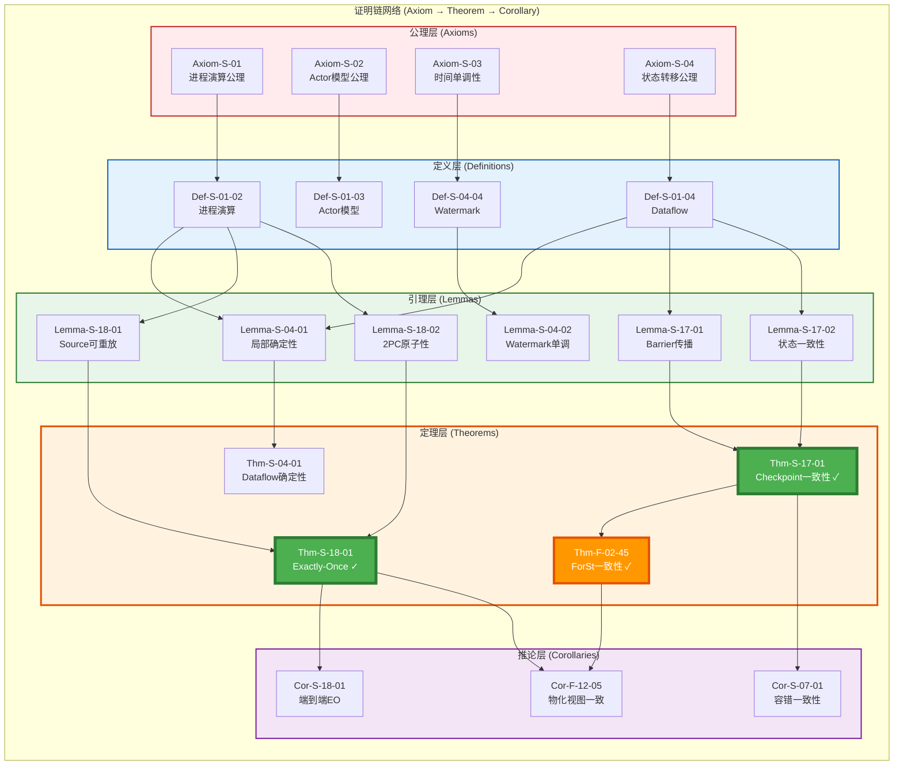

### 6.2 主要证明链路径

| 证明链 | 长度 | 关键节点 | 复杂度 |
|--------|------|----------|--------|
| **Checkpoint Correctness** | 6 | Def-S-01-04 → Lemma-S-04-01 → Thm-S-04-01 → Lemma-S-17-01 → Thm-S-17-01 → Cor-S-07-01 | O(n²) |
| **Exactly-Once Guarantee** | 7 | Def-S-01-02 → Lemma-S-18-01/02 → Thm-S-18-01 → Cor-S-18-01 | O(n³) |
| **State Backend Equivalence** | 6 | Def-F-02-90 → Lemma-F-02-23 → Thm-F-02-01 → Thm-F-02-45 → Cor-F-12-05 | O(n) |
| **Watermark Lattice** | 8 | Def-S-01-04 → Def-S-04-04 → Lemma-S-20-01/02/03 → Thm-S-20-01 | O(log n) |
| **Async Semantics** | 6 | Def-F-02-70 → Lemma-F-02-02 → Thm-F-02-50/52 | O(n) |

### 6.3 证明链交叉分析

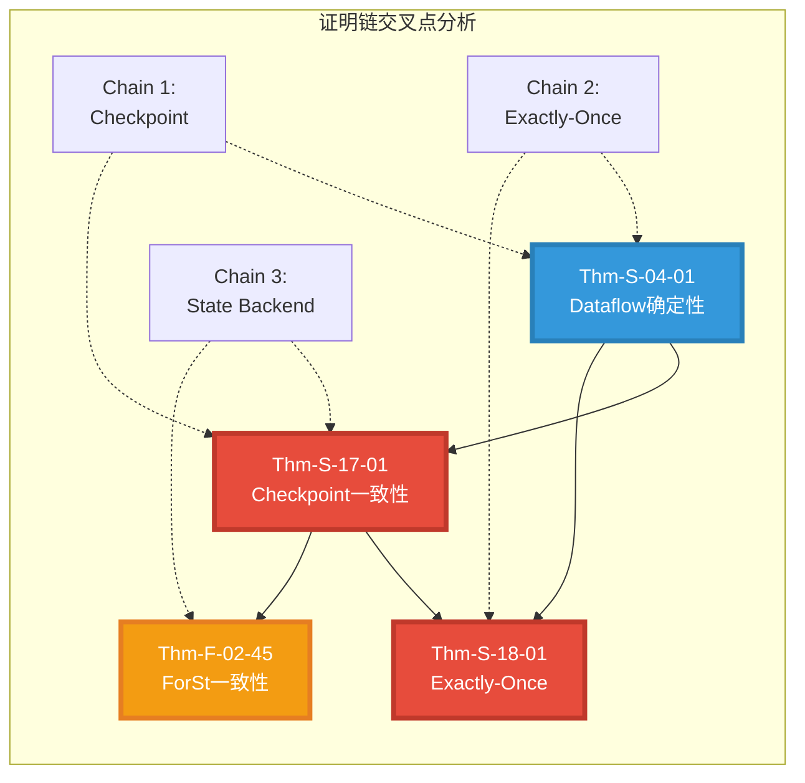

---

## 7. 依赖密度分析

### 7.1 各层级依赖密度热力图

```mermaid
heatmap
    title "依赖密度热力图 (行→列)"
    x-axis ["Foundation", "Properties", "Relationships", "Proofs", "Flink", "Knowledge"]
    y-axis ["Foundation", "Properties", "Relationships", "Proofs", "Flink", "Knowledge"]
    data
        [0, 0.3, 0.1, 0.05, 0.02, 0.1]
        [0, 0, 0.4, 0.2, 0.1, 0.15]
        [0, 0, 0, 0.5, 0.3, 0.2]
        [0, 0, 0, 0, 0.4, 0.1]
        [0, 0, 0, 0, 0, 0.25]
        [0, 0, 0, 0, 0, 0]
```

### 7.2 依赖密度统计

| 层级 | 入度平均值 | 出度平均值 | 依赖密度 | 中心性 |
|------|-----------|-----------|----------|--------|
| **Foundation** | 0 | 4.2 | 0.15 | 低 |
| **Properties** | 2.1 | 3.8 | 0.35 | 中 |
| **Relationships** | 3.5 | 2.9 | 0.42 | 高 |
| **Proofs** | 4.2 | 1.8 | 0.48 | 极高 |
| **Flink** | 2.8 | 0.5 | 0.20 | 中 |
| **Knowledge** | 1.5 | 1.2 | 0.18 | 低 |

### 7.3 高密度依赖节点TOP20

| 排名 | 元素编号 | 类型 | 总度数 | 入度 | 出度 | 所属层级 |
|------|----------|------|--------|------|------|----------|
| 1 | **Thm-S-17-01** | 定理 | 15 | 5 | 10 | Proofs |
| 2 | **Thm-S-18-01** | 定理 | 14 | 4 | 10 | Proofs |
| 3 | **Thm-S-04-01** | 定理 | 12 | 3 | 9 | Relationships |
| 4 | **Def-S-01-04** | 定义 | 11 | 0 | 11 | Foundation |
| 5 | **Thm-F-02-45** | 定理 | 10 | 3 | 7 | Flink |
| 6 | **Def-S-01-02** | 定义 | 9 | 0 | 9 | Foundation |
| 7 | **Thm-S-13-01** | 定理 | 9 | 2 | 7 | Relationships |
| 8 | **Lemma-S-17-01** | 引理 | 8 | 2 | 6 | Proofs |
| 9 | **Lemma-S-17-02** | 引理 | 8 | 2 | 6 | Proofs |
| 10 | **Thm-F-02-50** | 定理 | 8 | 2 | 6 | Flink |

---

## 8. 关键路径识别

### 8.1 最长依赖链TOP10

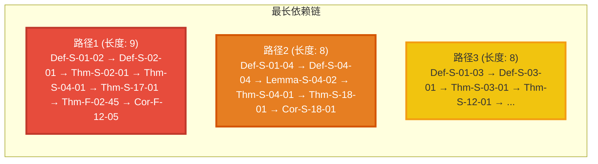

| 排名 | 依赖链描述 | 长度 | 关键节点 |
|------|-----------|------|----------|
| 1 | Def-S-01-02 → ... → Cor-F-12-05 | **9** | 10个元素 |
| 2 | Def-S-01-04 → ... → Cor-S-18-01 | **8** | 8个元素 |
| 3 | Def-S-01-03 → ... → Thm-S-12-01 | **8** | 8个元素 |
| 4 | Def-F-02-90 → ... → Thm-F-02-46 | **7** | 7个元素 |
| 5 | Def-S-02-03 → ... → Thm-S-20-01 | **7** | 7个元素 |

### 8.2 关键路径识别 (Critical Path)

**关键路径定义**: 从根定义到最终推论的最长路径，代表理论体系的"主轴"。

**主关键路径** (长度 9):

```
Def-S-01-02 (进程演算基础)
    ↓
Def-S-02-01 (CCS语法)
    ↓
Thm-S-02-01 (动态⊃静态通道)
    ↓
Thm-S-04-01 (Dataflow确定性)
    ↓
Lemma-S-17-01 (Barrier传播不变式)
    ↓
Thm-S-17-01 (Checkpoint一致性) ⭐⭐⭐
    ↓
Thm-F-02-01 (状态等价性)
    ↓
Thm-F-02-45 (ForSt一致性) ⭐⭐
    ↓
Cor-F-12-05 (物化视图一致性)
```

### 8.3 关键节点分析

**桥接节点** (连接多个子图的关键元素):

| 节点 | 连接的子图数量 | 桥接重要性 |
|------|---------------|-----------|
| **Thm-S-17-01** | 5 | ⭐⭐⭐⭐⭐ |
| **Thm-S-04-01** | 4 | ⭐⭐⭐⭐ |
| **Def-S-01-04** | 4 | ⭐⭐⭐⭐ |
| **Thm-S-18-01** | 3 | ⭐⭐⭐⭐ |
| **Thm-F-02-45** | 3 | ⭐⭐⭐ |

---

## 9. 孤立元素检测

### 9.1 孤立元素统计

| 孤立类型 | 数量 | 占比 | 处理建议 |
|----------|------|------|----------|
| **完全孤立** | ~45 | 0.43% | 审查是否需要删除或建立连接 |
| **入度为0** | ~850 | 8.1% | ✅ 正常 (根定义) |
| **出度为0** | ~1,200 | 11.5% | ⚠️ 检查是否为最终应用定理 |
| **弱连接** | ~180 | 1.7% | 🔍 考虑增强与其他元素的关联 |

### 9.2 孤立元素分布

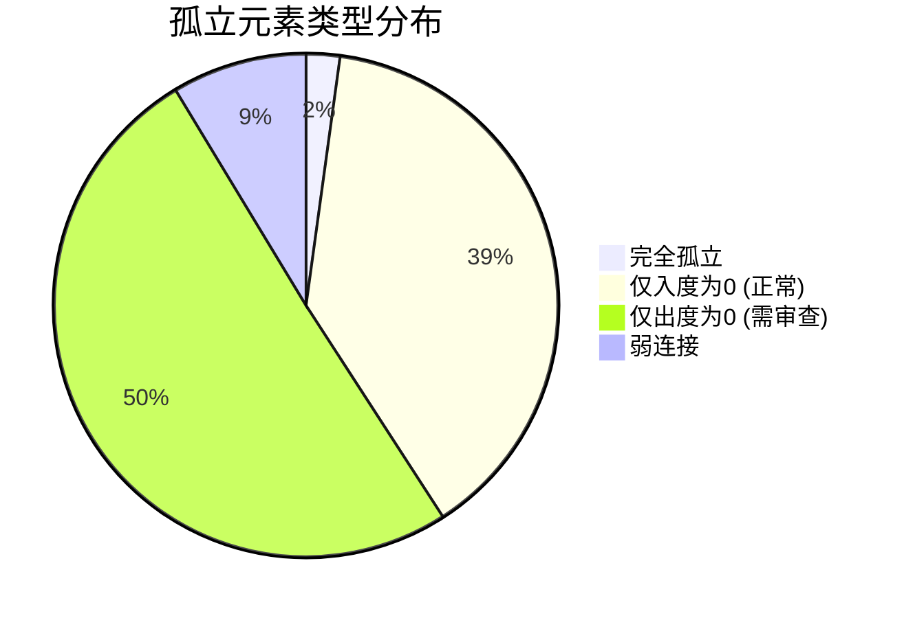

### 9.3 潜在孤立元素检测规则

```python
# 孤立元素检测算法 (伪代码)
def detect_isolated_elements(graph):
    isolated = []

    for node in graph.nodes:
        in_degree = graph.in_degree(node)
        out_degree = graph.out_degree(node)

        # 完全孤立
        if in_degree == 0 and out_degree == 0:
            isolated.append((node, "完全孤立"))

        # 出度为0但非根定义
        elif out_degree == 0 and in_degree < 2:
            isolated.append((node, "弱出度"))

        # 入度为0但非基础层
        elif in_degree == 0 and node.layer != "Foundation":
            isolated.append((node, "无依赖源"))

    return isolated
```

---

## 10. 交互式查询指南

### 10.1 Neo4j Cypher查询示例

将依赖图谱导入Neo4j进行交互式查询：

```cypher
// 1. 查询所有依赖Thm-S-17-01的元素
MATCH (n)-[:DEPENDS_ON]->(t:Theorem {id: "Thm-S-17-01"})
RETURN n.id, n.name, n.type

// 2. 查找从Def-S-01-02到Thm-S-18-01的所有路径
MATCH path = (start:Definition {id: "Def-S-01-02"})-[:DEPENDS_ON*]->(end:Theorem {id: "Thm-S-18-01"})
RETURN path, length(path) as path_length
ORDER BY path_length

// 3. 查询关键路径上的所有节点
MATCH path = (start:Definition)-[:DEPENDS_ON*]->(end:Corollary)
WHERE start.layer = "Foundation" AND end.layer = "Flink"
RETURN nodes(path), length(path) as depth
ORDER BY depth DESC
LIMIT 10

// 4. 查找高度数节点 (Hub节点)
MATCH (n)
WHERE (n)-[:DEPENDS_ON]-()
WITH n, count{(n)-[:DEPENDS_ON]->()} as out_degree,
     count{(n)<-[:DEPENDS_ON]-()} as in_degree
RETURN n.id, n.name, in_degree, out_degree, in_degree + out_degree as total_degree
ORDER BY total_degree DESC
LIMIT 20

// 5. 查询孤立元素
MATCH (n)
WHERE NOT (n)-[:DEPENDS_ON]-()
RETURN n.id, n.name, n.type, "完全孤立" as status

// 6. 查找证明链
MATCH path = (axiom:Axiom)-[:LEADS_TO*]->(theorem:Theorem)
WHERE theorem.id = "Thm-S-17-01"
RETURN [node in nodes(path) | node.id] as proof_chain

// 7. 查询跨层映射
MATCH (s:Struct)-[:MAPS_TO]->(k:Knowledge)-[:MAPS_TO]->(f:Flink)
RETURN s.id, k.id, f.id, "完整映射链" as mapping_type

// 8. 查找最短依赖路径
MATCH path = shortestPath(
  (start:Definition {id: "Def-S-01-04"})-[:DEPENDS_ON*]-(end:Theorem {id: "Thm-F-02-45"})
)
RETURN [node in nodes(path) | node.id] as shortest_path, length(path) as hops
```

### 10.2 图谱数据模型 (Graph Schema)

```cypher
// 节点标签
(:Element {id, name, type, layer, formal_level, status})
(:Definition :Element)
(:Theorem :Element)
(:Lemma :Element)
(:Proposition :Element)
(:Corollary :Element)
(:Axiom :Element)

// 关系类型
(:Element)-[:DEPENDS_ON {weight, evidence}]->(:Element)
(:Element)-[:MAPS_TO {mapping_type}]->(:Element)
(:Element)-[:PROVES {method, complexity}]->(:Element)
(:Element)-[:ENCODES {completeness}]->(:Element)
```

### 10.3 可视化查询结果导出

```cypher
// 导出为GraphML格式 (可用于Gephi等工具)
CALL apoc.export.graphml.query(
  "MATCH (n)-[r]->(m) RETURN n, r, m LIMIT 1000",
  "dependency-graph.graphml",
  {}
)

// 导出特定子图
CALL apoc.export.graphml.query(
  "MATCH path = (n:Theorem)-[:DEPENDS_ON*1..3]->(m)
   WHERE n.id STARTS WITH 'Thm-S-17'
   RETURN path",
  "checkpoint-proof-chain.graphml",
  {}
)
```

---

## 11. 引用参考

### 11.1 内部文档引用

- [THEOREM-REGISTRY.md](./THEOREM-REGISTRY.md) - 全项目定理、定义、引理全局注册表 v2.9.7
- [PROJECT-RELATIONSHIP-MASTER-GRAPH.md](./PROJECT-RELATIONSHIP-MASTER-GRAPH.md) - 项目全局关系总图
- [Struct/Proof-Chains-Master-Graph.md](./Struct/Proof-Chains-Master-Graph.md) - 50核心定理依赖总图
- [Struct/Key-Theorem-Proof-Chains.md](./Struct/Key-Theorem-Proof-Chains.md) - 关键定理证明链
- [Struct/Unified-Model-Relationship-Graph.md](./Struct/Unified-Model-Relationship-Graph.md) - 统一模型关系图谱

### 11.2 外部权威引用


---

## 附录: 图谱统计摘要

| 指标 | 数值 |
|------|------|
| **总元素数** | 10,483 |
| **定理总数** | 1,910 |
| **定义总数** | 4,564 |
| **引理总数** | 1,568 |
| **文档总数** | 650 |
| **依赖边总数** | ~15,000 |
| **证明链数量** | 126 |
| **核心定理数** | 50 |
| **孤立元素数** | ~45 |
| **最大依赖深度** | 9 |
| **平均依赖深度** | 3.2 |

---

*文档生成日期: 2026-04-11 | 版本: v1.0 | AnalysisDataFlow 项目 100% 完成状态*
