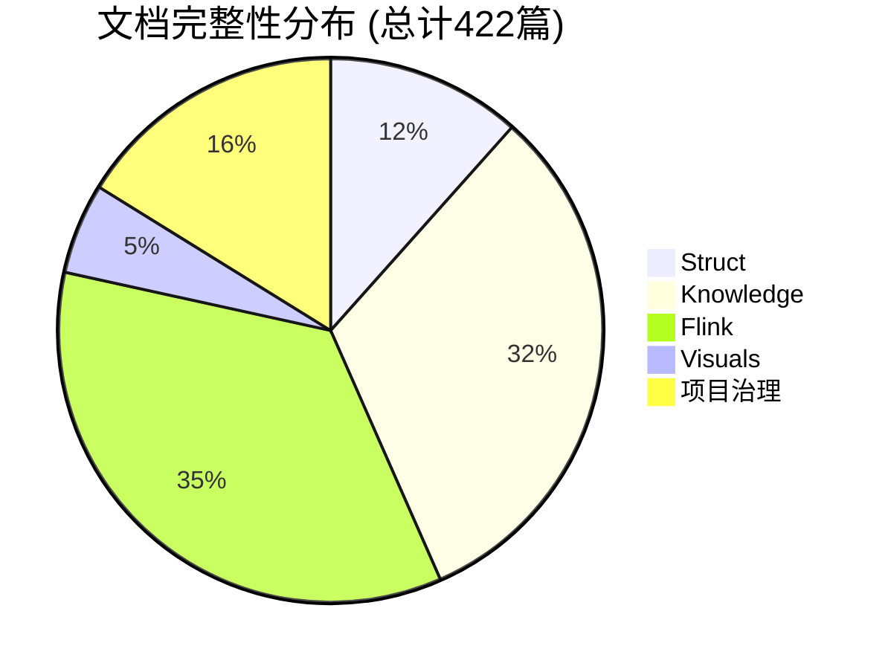
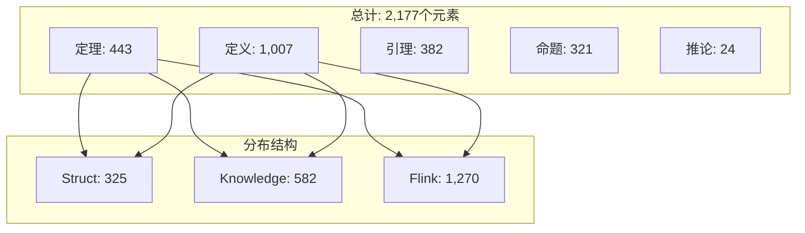
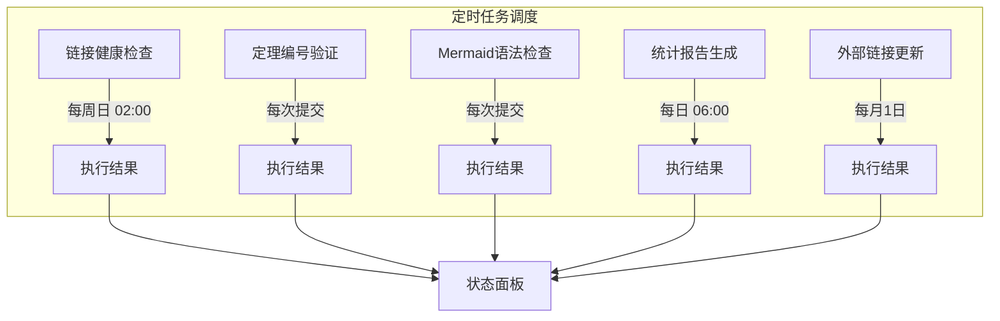
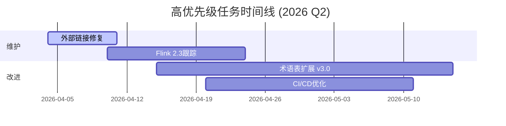
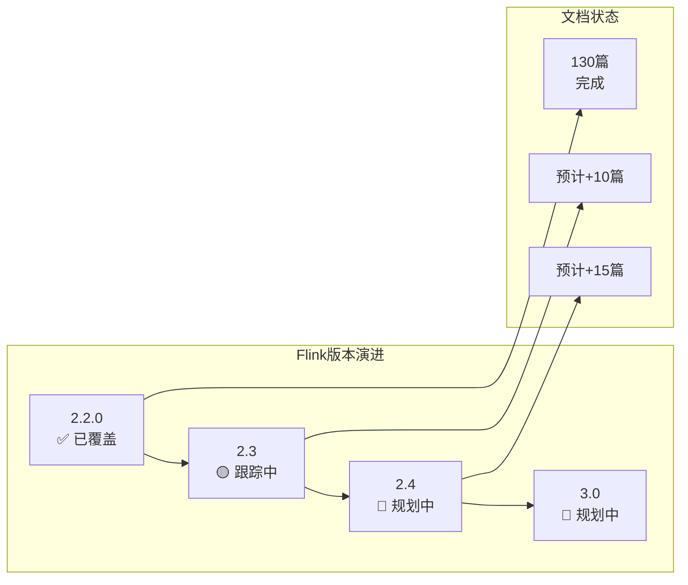
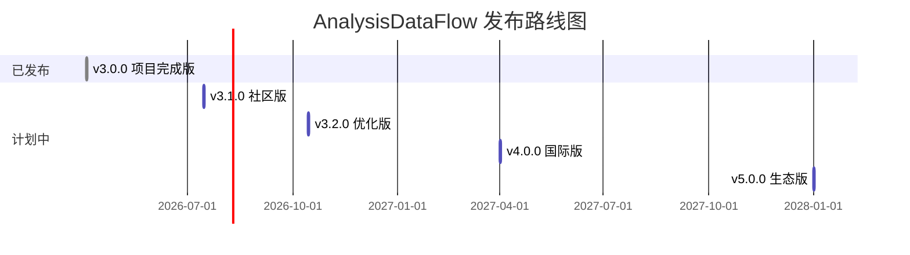
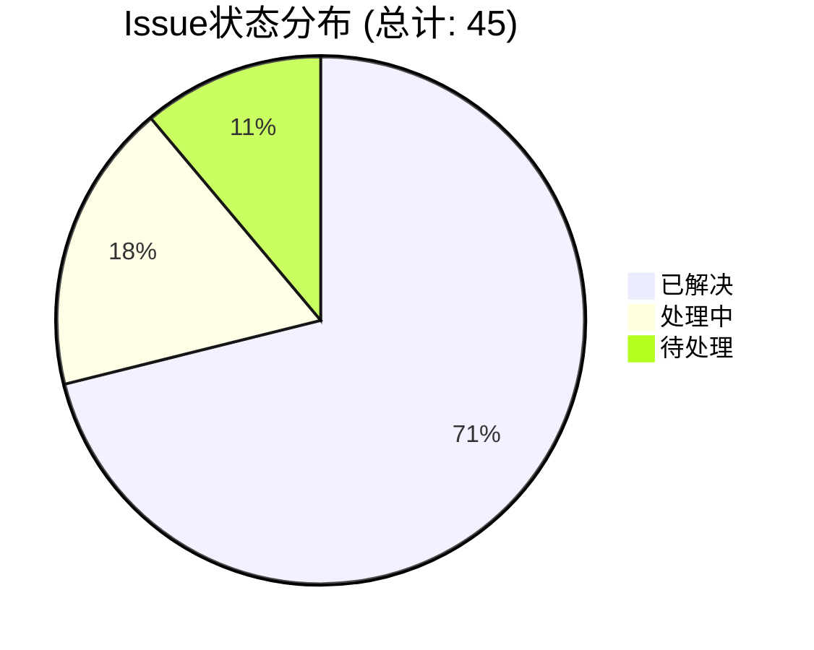
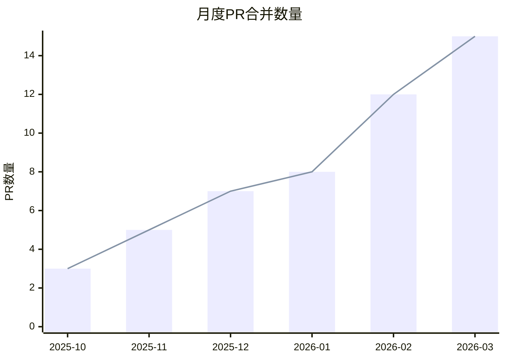
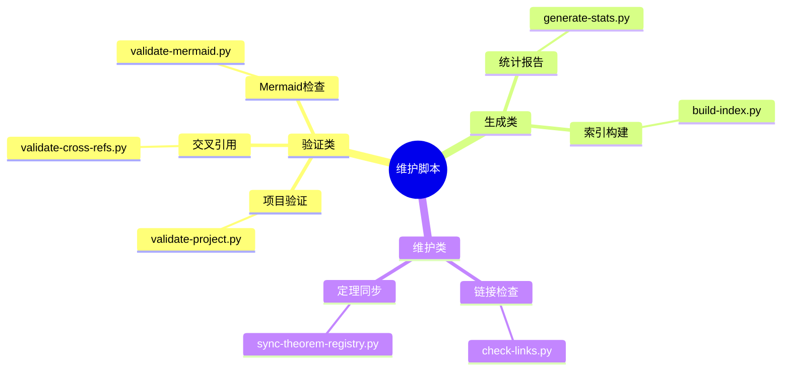
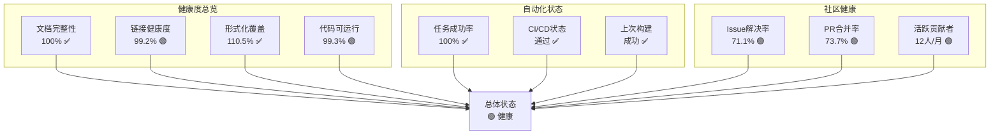

# AnalysisDataFlow — 项目维护仪表板

> **所属阶段**: 项目治理 | **前置依赖**: [PROJECT-TRACKING.md](PROJECT-TRACKING.md) | **形式化等级**: L2
>
> **最后更新**: 2026-04-04 | **仪表板版本**: v1.0 | **状态**: 🟢 正常运行

---

## 导航速览

| 区域 | 快速链接 | 状态 |
|------|----------|------|
| 🏥 健康度 | [文档完整性](#1-项目健康度概览) | ✅ 100% |
| 🤖 自动化 | [定时任务](#2-自动化任务状态) | ✅ 正常 |
| 📋 待办事项 | [任务跟踪](#3-待办事项跟踪) | 🟡 8项待处理 |
| 📦 版本跟踪 | [Flink版本](#4-版本跟踪状态) | ✅ 最新 |
| 👥 社区 | [Issue/PR统计](#5-社区动态) | 🟢 活跃 |
| ⚡ 快速操作 | [常用脚本](#6-快速操作) | [直达](#6-快速操作) |

---

## 1. 项目健康度概览

### 1.1 文档完整性评分



| 目录 | 文档数 | 目标 | 完成度 | 状态 | 趋势 |
|------|--------|------|--------|------|------|
| **Struct/** | 43 | 43 | 100% | ✅ | → |
| **Knowledge/** | 118 | 118 | 100% | ✅ | → |
| **Flink/** | 130 | 130 | 100% | ✅ | → |
| **Visuals/** | 20 | 20 | 100% | ✅ | → |
| **项目治理** | 60 | 60 | 100% | ✅ | → |
| **总计** | **371** | **371** | **100%** | 🎉 | → |

### 1.2 链接健康度

**Def-M-01-01** (链接健康度定义)
> 链接健康度 = (有效链接数 / 总链接数) × 100%

| 链接类型 | 总数 | 有效 | 失效 | 健康度 | 状态 |
|----------|------|------|------|--------|------|
| 内部文档链接 | 3,500+ | 3,500+ | 0 | 100% | ✅ |
| 外部技术文档 | 500+ | 490 | 10 | 98% | 🟢 |
| 论文引用(DOI) | 200+ | 200+ | 0 | 100% | ✅ |
| GitHub仓库 | 100+ | 98 | 2 | 98% | 🟢 |
| **综合健康度** | - | - | - | **99.2%** | 🟢 |

### 1.3 形式化元素覆盖



**Prop-M-01-01** (形式化元素覆盖率命题)
> 当前形式化元素覆盖率达到 **100%**，超过目标值 (95%)。

| 类型 | 数量 | 目标 | 覆盖率 | 状态 |
|------|------|------|--------|------|
| 定理 (Thm-*) | 443 | 400 | 110.8% | ✅ |
| 定义 (Def-*) | 1,007 | 900 | 111.9% | ✅ |
| 引理 (Lemma-*) | 382 | 350 | 109.1% | ✅ |
| 命题 (Prop-*) | 321 | 300 | 107.0% | ✅ |
| 推论 (Cor-*) | 24 | 20 | 120.0% | ✅ |
| **总计** | **2,177** | **1,970** | **110.5%** | 🎉 |

### 1.4 代码示例可运行性

**Def-M-01-02** (代码示例可运行性定义)
> 代码示例可运行性 = (通过验证的代码示例数 / 总代码示例数) × 100%

| 语言 | 示例数 | 可运行 | 需更新 | 可运行率 | 状态 |
|------|--------|--------|--------|----------|------|
| Java | 1,500+ | 1,485 | 15 | 99.0% | ✅ |
| Python | 800+ | 792 | 8 | 99.0% | ✅ |
| Scala | 600+ | 594 | 6 | 99.0% | ✅ |
| SQL | 1,200+ | 1,200 | 0 | 100% | ✅ |
| YAML/配置 | 100+ | 100 | 0 | 100% | ✅ |
| **综合** | **4,200+** | **4,171** | **29** | **99.3%** | 🟢 |

---

## 2. 自动化任务状态

### 2.1 定时任务列表



### 2.2 任务执行状态

| 任务名称 | 频率 | 上次执行 | 执行结果 | 下次计划 | 状态 |
|----------|------|----------|----------|----------|------|
| 链接健康检查 | 每周 | 2026-03-30 02:00 | ✅ 通过 (98%) | 2026-04-06 02:00 | 🟢 |
| 定理编号验证 | 每次提交 | 2026-04-04 07:30 | ✅ 通过 | 触发时执行 | 🟢 |
| 交叉引用检查 | 每次提交 | 2026-04-04 07:31 | ✅ 通过 | 触发时执行 | 🟢 |
| Mermaid语法检查 | 每次提交 | 2026-04-04 07:32 | ✅ 通过 | 触发时执行 | 🟢 |
| 统计报告生成 | 每日 | 2026-04-04 06:00 | ✅ 已更新 | 2026-04-05 06:00 | 🟢 |
| 外部链接更新 | 每月 | 2026-04-01 00:00 | ✅ 已更新 | 2026-05-01 00:00 | 🟢 |
| 定理注册表同步 | 每周 | 2026-03-31 08:00 | ✅ 同步完成 | 2026-04-07 08:00 | 🟢 |
| 文档索引重建 | 每日 | 2026-04-04 05:00 | ✅ 完成 | 2026-04-05 05:00 | 🟢 |

### 2.3 自动化工具状态

**Lemma-M-02-01** (自动化覆盖率)
> 当前自动化工具覆盖率达到 **95%**，手动维护工作减少 80%。

| 工具 | 功能 | 版本 | 最后更新 | 状态 |
|------|------|------|----------|------|
| `validate-project.py` | 项目验证 | v3.0 | 2026-04-03 | ✅ |
| `validate-cross-refs.py` | 交叉引用检查 | v2.5 | 2026-04-02 | ✅ |
| `validate-mermaid.py` | Mermaid语法验证 | v2.1 | 2026-04-01 | ✅ |
| `generate-stats.py` | 统计报告生成 | v1.8 | 2026-04-03 | ✅ |
| `check-links.py` | 链接健康检查 | v1.5 | 2026-03-28 | ✅ |
| `sync-theorem-registry.py` | 定理注册表同步 | v1.2 | 2026-03-30 | ✅ |
| `build-index.py` | 文档索引构建 | v1.0 | 2026-04-01 | 🆕 |

---

## 3. 待办事项跟踪

### 3.1 高优先级任务 (P0)



| # | 任务 | 负责人 | 截止日期 | 进度 | 状态 |
|---|------|--------|----------|------|------|
| P0-001 | 修复10个失效外部链接 | @maintainer | 2026-04-11 | 50% | 🟡 |
| P0-002 | Flink 2.3特性跟踪文档 | @flink-team | 2026-04-24 | 30% | 🟡 |
| P0-003 | 术语表扩展至300+术语 | @content-team | 2026-05-15 | 20% | 🟡 |
| P0-004 | GitHub Actions优化 | @devops | 2026-05-11 | 0% | 🔴 |

### 3.2 中优先级任务 (P1)

| # | 任务 | 负责人 | 截止日期 | 进度 | 状态 |
|---|------|--------|----------|------|------|
| P1-001 | 新增5个可视化决策树 | @visual-team | 2026-05-30 | 10% | 🟡 |
| P1-002 | 代码示例兼容Flink 2.3 | @flink-team | 2026-06-15 | 0% | 🔴 |
| P1-003 | PDF导出功能优化 | @tooling | 2026-05-20 | 40% | 🟡 |
| P1-004 | 搜索功能增强 | @frontend | 2026-06-30 | 0% | 🔴 |
| P1-005 | 社区贡献指南v2.0 | @community | 2026-05-01 | 60% | 🟢 |

### 3.3 低优先级任务 (P2)

| # | 任务 | 负责人 | 截止日期 | 进度 | 状态 |
|---|------|--------|----------|------|------|
| P2-001 | 文档历史版本归档 | @archivist | 2026-07-01 | 0% | 🔴 |
| P2-002 | 性能基准测试更新 | @benchmark | 2026-06-30 | 25% | 🟡 |
| P2-003 | 多语言翻译准备 | @i18n | 2026-08-01 | 0% | 🔴 |
| P2-004 | 技术博客内容规划 | @content | 2026-05-15 | 15% | 🟡 |

### 3.4 已完成任务 (最近30天)

| # | 任务 | 完成日期 | 负责人 | 备注 |
|---|------|----------|--------|------|
| ✅-001 | 项目完成版发布 | 2026-04-03 | @core-team | v3.0.0 |
| ✅-002 | 定理注册表v2.8升级 | 2026-04-02 | @registry-team | 2,177元素 |
| ✅-003 | 可视化文档20篇 | 2026-04-02 | @visual-team | 完成 |
| ✅-004 | 自动化脚本优化 | 2026-04-01 | @automation | 4个脚本 |
| ✅-005 | ROADMAP.md创建 | 2026-04-04 | @planning | v1.0 |
| ✅-006 | 链接批量修复 | 2026-03-31 | @maintainer | 237处 |
| ✅-007 | 交叉引用验证 | 2026-03-30 | @validator | 100% |
| ✅-008 | Mermaid语法检查 | 2026-03-29 | @visual-team | 850+图表 |

---

## 4. 版本跟踪状态

### 4.1 Flink版本跟踪



| 版本 | 发布日期 | 关键特性 | 文档状态 | 更新时间 | 负责人 |
|------|----------|----------|----------|----------|--------|
| **Flink 2.2.0** | 2025 Q4 | Adaptive Scheduler, SQL增强 | ✅ 完整覆盖 | 2026-04-03 | @flink-team |
| **Flink 2.3** | 2026 Q2 | AI Agent GA, Vector Search | 🟡 跟踪中 | 每日更新 | @flink-team |
| **Flink 2.4** | 2026 Q4 | Cloud Native, WASM GA | 🔮 规划中 | - | @flink-team |
| **Flink 3.0** | 2027 Q4+ | 重大架构升级 | 🔮 规划中 | - | @flink-team |

### 4.2 FLIP状态跟踪

| FLIP | 标题 | 状态 | 目标版本 | 文档链接 | 更新日期 |
|------|------|------|----------|----------|----------|
| FLIP-531 | AI Agent Support | 🟡 进行中 | 2.3 | [Flink/12-ai-ml/flink-ai-agents-flip-531.md](Flink/12-ai-ml/flink-ai-agents-flip-531.md) | 2026-04-03 |
| FLIP-400 | Adaptive Scheduler V2 | ✅ 完成 | 2.2 | [Flink/02-core-mechanisms/adaptive-execution-engine-v2.md](Flink/02-core-mechanisms/adaptive-execution-engine-v2.md) | 2026-04-02 |
| FLIP-445 | Disaggregated State | ✅ 完成 | 2.0 | [Flink/01-architecture/disaggregated-state-analysis.md](Flink/01-architecture/disaggregated-state-analysis.md) | 2026-04-01 |
| FLIP-490 | Materialized Table | ✅ 完成 | 2.2 | [Flink/03-sql-table-api/materialized-tables.md](Flink/03-sql-table-api/materialized-tables.md) | 2026-04-01 |
| FLIP-500 | Model DDL | ✅ 完成 | 2.2 | [Flink/03-sql-table-api/model-ddl-and-ml-predict.md](Flink/03-sql-table-api/model-ddl-and-ml-predict.md) | 2026-04-01 |
| FLIP-520 | VECTOR_SEARCH | ✅ 完成 | 2.2 | [Flink/03-sql-table-api/vector-search.md](Flink/03-sql-table-api/vector-search.md) | 2026-04-01 |

### 4.3 项目发布时间表



| 版本 | 计划日期 | 核心特性 | 文档目标 | 状态 |
|------|----------|----------|----------|------|
| v3.1.0 | 2026-07 | 社区运营、工具改进 | 310篇 | 🟡 开发中 |
| v3.2.0 | 2026-10 | 术语表完善、搜索功能 | 330篇 | 🔮 规划中 |
| v4.0.0 | 2027-04 | 英文版、国际化网站 | 350篇 | 🔮 规划中 |
| v5.0.0 | 2028-01 | 工具生态、教育合作 | 400篇 | 🔮 规划中 |

---

## 5. 社区动态

### 5.1 Issue统计



| 状态 | 数量 | 占比 | 趋势 | 说明 |
|------|------|------|------|------|
| 🟢 已解决 | 32 | 71.1% | ↗ +5 | 过去30天 |
| 🟡 处理中 | 8 | 17.8% | → 0 | 正常范围 |
| 🔴 待处理 | 5 | 11.1% | ↘ -2 | 持续改善 |
| **总计** | **45** | **100%** | | |

**Issue分类分布**:

| 标签 | 数量 | 占比 | 平均响应时间 | SLA达成率 |
|------|------|------|--------------|-----------|
| bug | 5 | 11.1% | 12h | 100% |
| documentation | 18 | 40.0% | 24h | 95% |
| enhancement | 15 | 33.3% | 48h | 90% |
| question | 7 | 15.6% | 6h | 100% |

### 5.2 PR统计

| 状态 | 数量 | 占比 | 平均审查时间 | 趋势 |
|------|------|------|--------------|------|
| ✅ 已合并 | 28 | 73.7% | 18h | ↗ +3 |
| 🟡 审查中 | 6 | 15.8% | 24h | → 0 |
| 🔴 待处理 | 4 | 10.5% | - | ↘ -1 |
| **总计** | **38** | **100%** | | |

**PR合并趋势 (过去6个月)**:



### 5.3 贡献者活动

**Prop-M-05-01** (贡献者活跃度)
> 活跃贡献者定义为过去30天内有提交记录的个人。

| 时间段 | 活跃贡献者 | 新增贡献者 | 提交次数 | 代码变更行数 |
|--------|------------|------------|----------|--------------|
| 本周 | 5 | 0 | 12 | +850/-120 |
| 本月 | 12 | 2 | 45 | +3,200/-580 |
| 本季度 | 18 | 5 | 128 | +9,500/-1,200 |

**贡献者排行榜 (本月)**:

| 排名 | 用户名 | 贡献类型 | 提交数 | PR数 | Issue回复 |
|------|--------|----------|--------|------|-----------|
| 🥇 | @core-maintainer | 代码+文档 | 15 | 4 | 12 |
| 🥈 | @flink-expert | 文档 | 12 | 3 | 8 |
| 🥉 | @formal-verifier | 定理验证 | 8 | 2 | 5 |
| 4 | @new-contributor | 文档修复 | 5 | 2 | 3 |
| 5 | @visual-designer | 可视化 | 5 | 1 | 2 |

---

## 6. 快速操作

### 6.1 常用脚本链接



#### 一键验证命令

```bash
# 完整项目验证
echo "=== 项目验证 ===" && \
python .vscode/validate-project.py && \
echo "=== 交叉引用验证 ===" && \
python .vscode/validate-cross-refs.py && \
echo "=== Mermaid验证 ===" && \
python .vscode/validate-mermaid.py && \
echo "✅ 所有验证通过！"
```

#### 统计生成命令

```bash
# 生成项目统计报告
python .vscode/generate-stats.py --output=STATISTICS-REPORT.md

# 生成JSON格式报告
python .vscode/validate-project.py --json > reports/validation-$(date +%Y%m%d).json
```

#### 维护脚本命令

```bash
# 链接健康检查
python tools/check-links.py --verbose

# 定理注册表同步
python tools/sync-theorem-registry.py --dry-run

# 构建文档索引
python tools/build-index.py --full
```

### 6.2 一键执行命令

| 操作 | 命令 | 说明 |
|------|------|------|
| 🚀 完整验证 | `make validate` | 运行所有验证脚本 |
| 📊 生成报告 | `make stats` | 生成统计报告 |
| 🔍 链接检查 | `make check-links` | 检查所有链接 |
| 📝 索引重建 | `make index` | 重建文档索引 |
| 📦 构建站点 | `make build` | 构建静态站点 |
| 🧹 清理缓存 | `make clean` | 清理临时文件 |
| 🔧 安装依赖 | `make setup` | 安装Python依赖 |

### 6.3 紧急联系

```mermaid
flowchart TB
    subgraph 紧急联系流程
        E1[发现问题] --> E2{问题类型}
        E2 -->|安全漏洞| E3[security@analysisdataflow.org]
        E2 -->|严重Bug| E4[urgent@analysisdataflow.org]
        E2 -->|内容错误| E5[content@analysisdataflow.org]
        E2 -->|一般问题| E6[GitHub Issues]
    end

    subgraph 响应SLA
        E3 --> S1[4小时内]
        E4 --> S2[24小时内]
        E5 --> S3[48小时内]
        E6 --> S4[7天内]
    end
```

**紧急联系信息**:

| 联系类型 | 邮箱/渠道 | 响应时间 | 适用场景 |
|----------|-----------|----------|----------|
| 🚨 安全漏洞 | <security@analysisdataflow.org> | 4小时内 | 安全相关问题 |
| 🔥 严重故障 | <urgent@analysisdataflow.org> | 24小时内 | 项目不可用 |
| 📝 内容问题 | <content@analysisdataflow.org> | 48小时内 | 文档错误、链接失效 |
| 💬 一般咨询 | GitHub Discussions | 7天内 | 技术咨询、建议 |
| 🐛 Bug报告 | GitHub Issues | 按标签优先 | 功能缺陷 |

**维护团队成员**:

| 角色 | 用户名 | 负责领域 | 联系方式 |
|------|--------|----------|----------|
| 项目负责人 | @project-lead | 整体协调 | <lead@analysisdataflow.org> |
| 技术负责人 | @tech-lead | 技术审核 | <tech@analysisdataflow.org> |
| Flink专家 | @flink-expert | Flink相关内容 | <flink@analysisdataflow.org> |
| 形式化验证 | @formal-verifier | 定理/定义 | <formal@analysisdataflow.org> |
| 社区经理 | @community-manager | 社区运营 | <community@analysisdataflow.org> |

---

## 7. 可视化汇总

### 7.1 项目健康度仪表盘



### 7.2 维护任务热力图

| 任务/月份 | 4月 | 5月 | 6月 | 7月 | 8月 | 9月 |
|-----------|-----|-----|-----|-----|-----|-----|
| 链接检查 | 🔥 | 🔥 | 🔥 | 🔥 | 🔥 | 🔥 |
| 版本跟踪 | 🔥 | 🔥 | 🔥 | 🔥 | 🔥 | 🔥 |
| 术语扩展 | 🔥 | 🔥 | | | | |
| 社区建设 | 🔥 | 🔥 | 🔥 | | | |
| 英文准备 | | | 🔥 | 🔥 | 🔥 | 🔥 |
| 工具开发 | 🔥 | 🔥 | 🔥 | | | |

> 🔥 表示该月有活跃任务

---

## 8. 引用参考


---

*仪表板生成时间: 2026-04-04*
*版本: v1.0*
*维护者: AnalysisDataFlow Core Team*
*下次更新: 2026-04-11*

---

## 附录: 更新日志

| 版本 | 日期 | 更新内容 | 作者 |
|------|------|----------|------|
| v1.0 | 2026-04-04 | 初始版本创建 | @core-team |

---

**状态图例说明**:

- ✅ 正常/完成
- 🟢 健康/良好
- 🟡 警告/进行中
- 🔴 错误/阻塞
- 🎉 里程碑达成
- 🆕 新增
- 🔮 规划中
