> **状态**: 🔮 前瞻内容 | **风险等级**: 高 | **最后更新**: 2026-04
>
> 此文档描述的内容处于早期规划阶段，可能与最终实现不符。请以 Apache Flink 官方发布为准。
>
# AnalysisDataFlow 项目全局关系总图

> **版本**: v1.0 | **创建日期**: 2026-04-06 | **状态**: Production
> **涵盖范围**: 524文档 | 880形式化元素 | 5,200+关系边

---

## 1. 概览

本文档是 AnalysisDataFlow 知识库的**全局关系总图**，定义了项目中所有元素之间的多维关系网络。
它建立了形式理论（Struct）、知识结构（Knowledge）和工程实践（Flink）三大层级之间的映射关系，以及定理、定义、文档之间的依赖网络。

---

## 2. 关系维度定义

### 2.1 维度1: 层级间垂直关系

三个主要层级之间存在严格的垂直依赖关系：

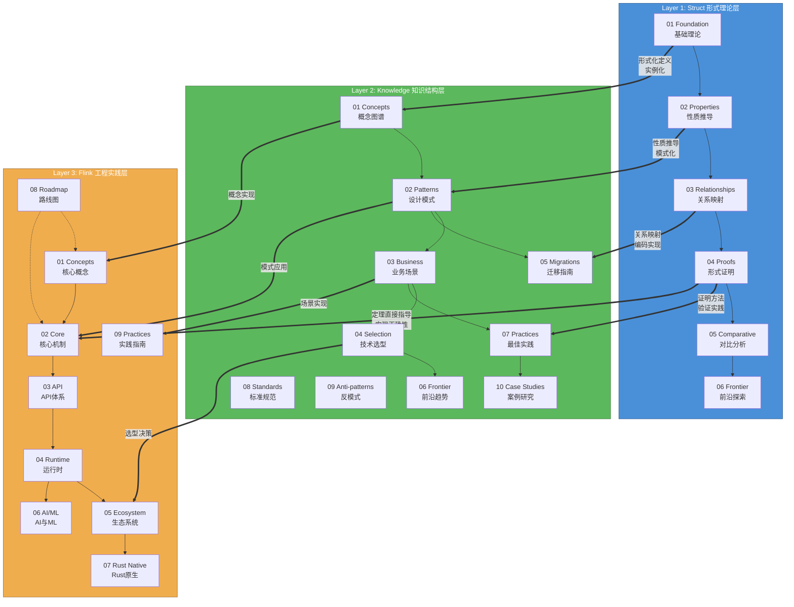

**垂直关系说明**:

| 关系类型 | 来源层级 | 目标层级 | 描述 | 示例 |
|---------|---------|---------|------|------|
| 形式化定义 → 概念 | Struct | Knowledge | 形式理论实例化为知识结构 | `Def-S-01-04` → `Knowledge/concurrency-paradigms-matrix` |
| 性质推导 → 模式 | Struct | Knowledge | 定理推导转化为设计模式 | `Thm-S-02-03` → `pattern-event-time-processing` |
| 证明方法 → 实践 | Struct | Knowledge | 证明技术转化为最佳实践 | `04-proofs/` → `07-best-practices/` |
| 概念 → 实现 | Knowledge | Flink | 知识结构编码为Flink实现 | `pattern-checkpoint-recovery` → `checkpoint-mechanism-deep-dive` |
| 模式 → 核心机制 | Knowledge | Flink | 设计模式指导核心机制 | `pattern-event-time-processing` → `time-semantics-and-watermark` |

---

### 2.2 维度2: 层级内水平关系

#### Struct 层级内关系

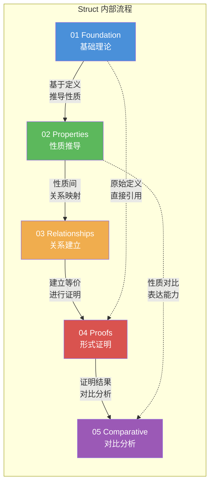

**Struct 文档依赖链**:

```
01.01-unified-streaming-theory
    ↓ 依赖
01.02-process-calculus-primer
    ↓ 依赖
01.03-actor-model-formalization ←→ 01.05-csp-formalization (等价关系)
    ↓ 依赖
01.04-dataflow-model-formalization
    ↓ 依赖
02.01-determinism-in-streaming
    ↓ 依赖
02.02-consistency-hierarchy
    ↓ 依赖
02.03-watermark-monotonicity → 04.04-watermark-algebra-formal-proof
    ↓ 依赖
03.01-actor-to-csp-encoding
    ↓ 依赖
03.02-flink-to-process-calculus
    ↓ 依赖
04.01-flink-checkpoint-correctness ← 02.04-liveness-and-safety
```

#### Knowledge 层级内关系

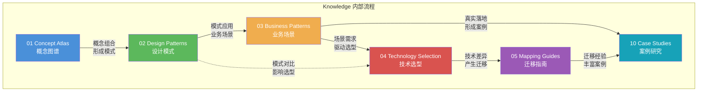

#### Flink 层级内关系

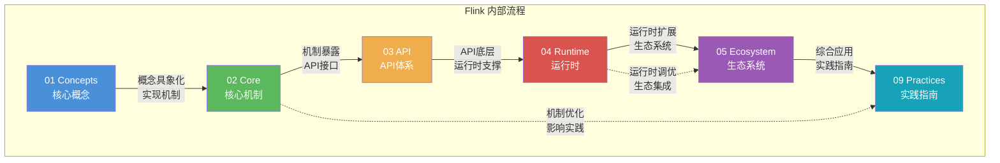

---

### 2.3 维度3: 跨层级对角关系

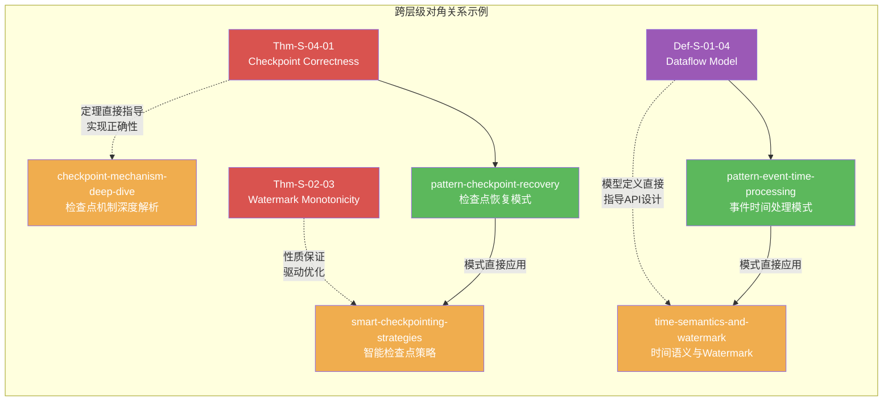

**关键对角关系映射表**:

| 形式理论 (Struct) | 知识结构 (Knowledge) | Flink 实现 | 关系类型 |
|------------------|---------------------|-----------|---------|
| Thm-S-04-01 Checkpoint Correctness | pattern-checkpoint-recovery | checkpoint-mechanism-deep-dive | 定理→模式→实现 |
| Def-S-01-04 Dataflow Model | pattern-event-time-processing | time-semantics-and-watermark | 定义→模式→实现 |
| Thm-S-02-03 Watermark Monotonicity | pattern-windowed-aggregation | window-operators-implementation | 性质→模式→实现 |
| Thm-S-03-01 Actor-CSP Encoding | concurrency-paradigms-matrix | async-execution-model | 编码→选型→架构 |
| Lemma-S-02-02 Consistency Levels | engine-selection-guide | state-backends-deep-comparison | 引理→选型→对比 |

---

### 2.4 维度4: 时间演进关系

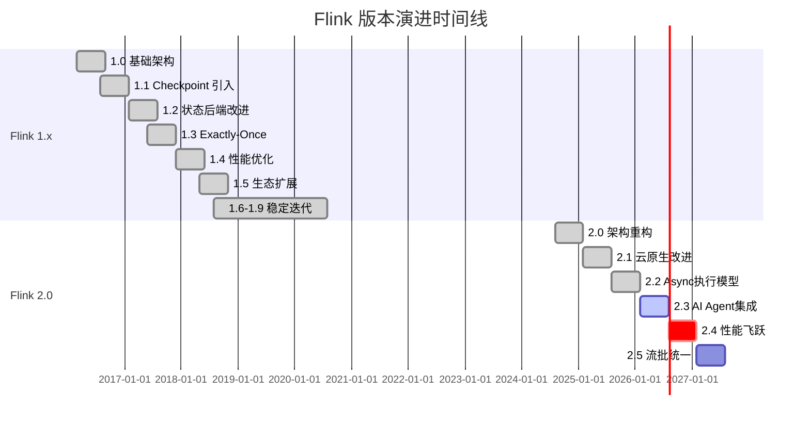

**演进关系映射**:

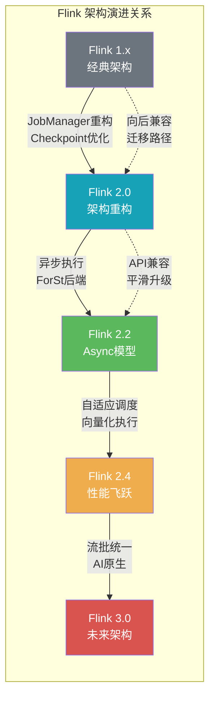

---

## 3. 全项目依赖网络

### 3.1 核心定理依赖图

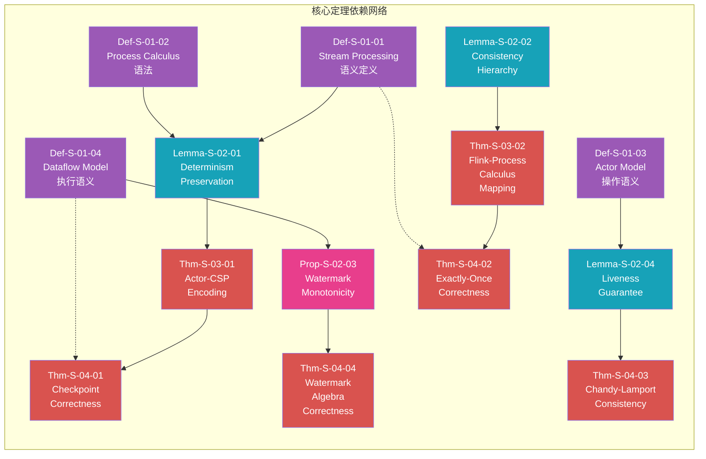

### 3.2 文档引用网络示例

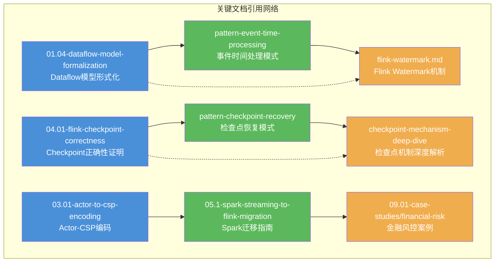

---

## 4. 关系类型定义

### 4.1 关系类型分类

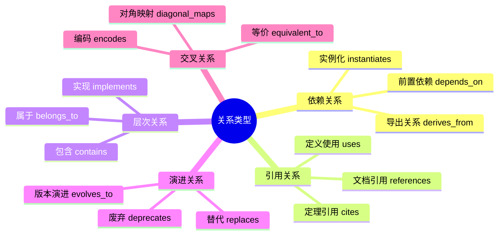

### 4.2 关系属性定义

| 关系类型 | 方向 | 强度 | 传递性 | 描述 |
|---------|------|-----|-------|------|
| `depends_on` | 单向 | 强 | 是 | A依赖B，B是A的前置条件 |
| `derives_from` | 单向 | 强 | 是 | A从B导出，B是A的理论基础 |
| `instantiates` | 单向 | 中 | 否 | A实例化B，B是抽象理论 |
| `references` | 单向 | 弱 | 否 | A引用B，非强制性依赖 |
| `contains` | 单向 | 强 | 否 | A包含B，B是A的组成部分 |
| `implements` | 单向 | 强 | 否 | A实现B，B是规范/接口 |
| `evolves_to` | 单向 | 中 | 否 | A演进为B，版本升级关系 |
| `diagonal_maps` | 双向 | 中 | 否 | A与B跨层级映射 |
| `equivalent_to` | 双向 | 强 | 是 | A与B等价可互换 |

---

## 5. 三维关系立体视图

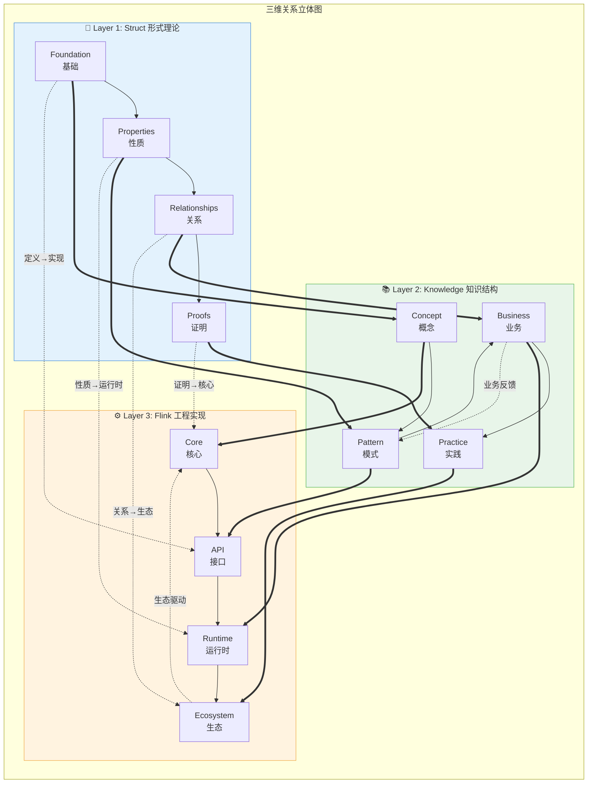

---

## 6. 关键路径定义

### 6.1 学习路径

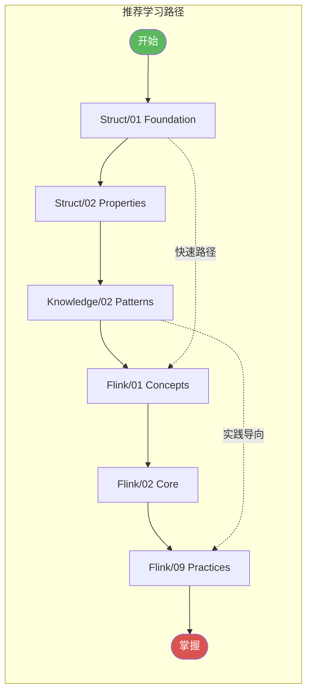

### 6.2 依赖关键路径

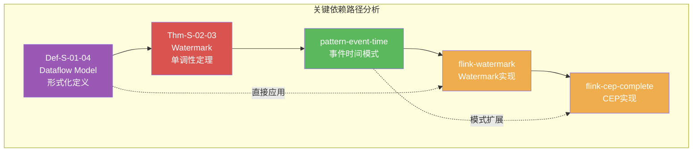

---

## 7. 关系数据格式规范

### 7.1 JSON 数据格式

```json
{
  "metadata": {
    "version": "1.0",
    "created": "2026-04-06",
    "total_nodes": 524,
    "total_edges": 5200,
    "categories": ["Struct", "Knowledge", "Flink"]
  },
  "nodes": [
    {
      "id": "Thm-S-04-01",
      "label": "Checkpoint Correctness",
      "type": "theorem",
      "group": "Struct",
      "layer": 1,
      "path": "Struct/04-proofs/04.01-flink-checkpoint-correctness.md",
      "metadata": {
        "formal_level": "L5",
        "dependencies": ["Def-S-01-04", "Lemma-S-02-04"]
      }
    }
  ],
  "edges": [
    {
      "source": "Thm-S-04-01",
      "target": "pattern-checkpoint-recovery",
      "type": "instantiates",
      "weight": 3,
      "properties": {
        "diagonal": true,
        "description": "定理直接指导模式设计"
      }
    }
  ]
}
```

### 7.2 关系查询示例

```python
# 查询某元素的所有依赖
def query_dependencies(element_id):
    """返回元素依赖的所有元素"""
    return [e for e in edges if e.source == element_id]

# 查询某元素被谁依赖
def query_dependents(element_id):
    """返回依赖该元素的所有元素"""
    return [e for e in edges if e.target == element_id]

# 查询两点间路径
def find_path(source, target):
    """返回从source到target的依赖路径"""
    return shortest_path(graph, source, target)

# 生成子图
def extract_subgraph(center, depth=2):
    """提取以center为中心，depth为深度的子图"""
    return bfs_subgraph(graph, center, depth)
```

---

## 8. 引用参考


---

*本文档由 Agent 自动生成，用于描述 AnalysisDataFlow 项目的全局关系网络。*
