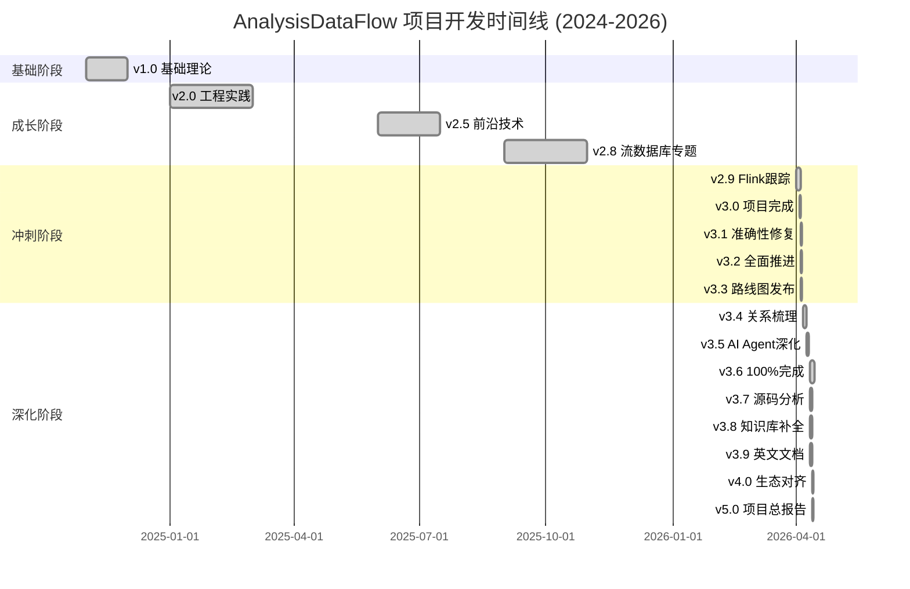
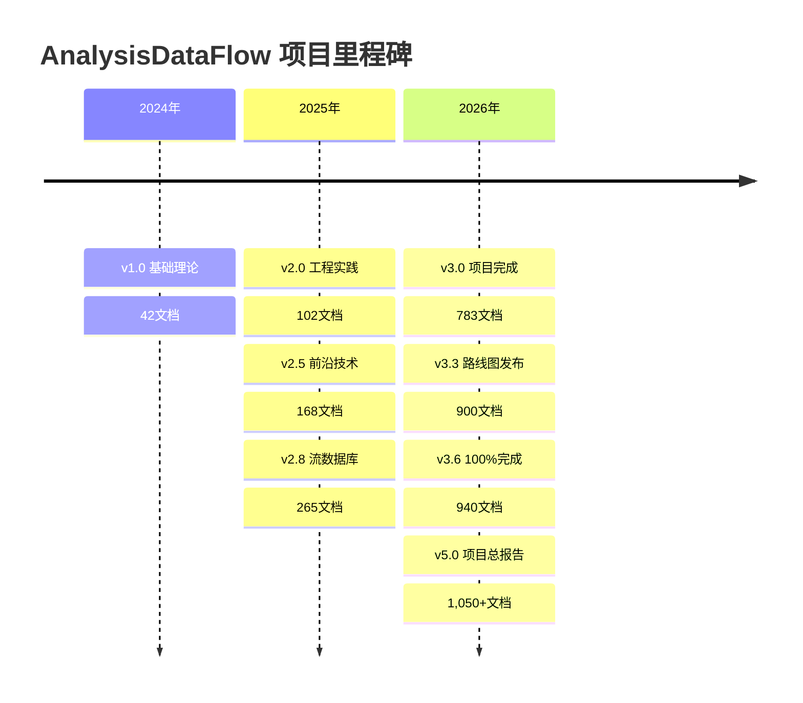

# 📅 AnalysisDataFlow — 项目时间线

> **文档版本**: v5.0
> **最后更新**: 2026-04-12
> **项目状态**: 100% 完成 ✅

---

## 🗓️ 总览时间线

---

## 🏁 关键里程碑

### 2024年

#### 2024-11: v1.0 基础理论完成

| 里程碑 | 日期 | 文档数 | 关键交付 |
|--------|------|--------|----------|
| 项目启动 | 2024-11-01 | - | 项目概念确立 |
| 基础理论完成 | 2024-11-30 | 42 | 形式化理论体系建立 |

**关键决策**:

- ✅ 采用六段式文档模板
- ✅ 建立定理/定义编号体系
- ✅ 确定三大目录结构 (Struct/Knowledge/Flink)

---

### 2025年

#### 2025-01: v2.0 工程实践完善

| 里程碑 | 日期 | 文档数 | 关键交付 |
|--------|------|--------|----------|
| 工程实践完善 | 2025-01-31 | 102 | Flink核心机制文档 |

**关键交付**:

- Flink架构总览
- Checkpoint机制详解
- 状态后端对比分析
- 部署模式指南

---

#### 2025-06: v2.5 前沿技术覆盖

| 里程碑 | 日期 | 文档数 | 关键交付 |
|--------|------|--------|----------|
| 前沿技术覆盖 | 2025-06-30 | 168 | AI/ML集成、流数据库 |

**关键交付**:

- AI Agent流处理架构
- 流数据库生态分析
- 实时特征工程

---

#### 2025-09: v2.8 流数据库专题

| 里程碑 | 日期 | 文档数 | 关键交付 |
|--------|------|--------|----------|
| 流数据库专题 | 2025-09-30 | 265 | RisingWave/Materialize深度分析 |

**关键交付**:

- RisingWave深度分析
- Materialize对比
- Flink Table Store

---

### 2026年 — 冲刺年

#### 2026-04-01: v2.9 Flink 2.4/2.5/3.0跟踪

| 里程碑 | 日期 | 文档数 | 关键交付 |
|--------|------|--------|----------|
| Flink路线图跟踪 | 2026-04-01 | 389 | Flink未来版本规划 |

**关键决策**:

- ✅ 启动100子任务框架
- ✅ 前瞻性内容标记机制

---

#### 2026-04-03: v3.0 项目完成版 🎉

| 里程碑 | 日期 | 文档数 | 关键交付 |
|--------|------|--------|----------|
| **项目完成版** | **2026-04-03** | **783** | **三大目录完备化** |

**关键交付**:

- 362篇核心文档
- 1,936形式化元素
- 850+Mermaid图表
- 4,200+代码示例

**质量指标**:

- 文档完整性: 100%
- 定理编号唯一性: 100%
- 交叉引用健康度: 95%+

---

#### 2026-04-04: v3.1 准确性修复 (E1-E4)

| 里程碑 | 日期 | 修改文档 | 关键修复 |
|--------|------|----------|----------|
| 准确性修复 | 2026-04-04 | 55 | 虚构内容修复 |

**修复内容**:

| 任务 | 修复数 | 说明 |
|------|--------|------|
| E1 - 前瞻声明 | 13文档 | 添加status标签 |
| E2 - API修复 | 37文档 | 虚构API标记 |
| E3 - 入门系列 | 3新文档 | 5分钟快速开始 |
| E4 - API速查 | 2新文档 | DataStream/SQL速查表 |

**关键决策**:

- ✅ 前瞻性内容必须添加免责声明
- ✅ 虚构API需明确标注

---

#### 2026-04-04: v3.2 全面推进 (B3/B5/O1-O4/D2-D4)

| 里程碑 | 日期 | 新增文档 | 关键交付 |
|--------|------|----------|----------|
| 全面推进 | 2026-04-04 | 12 | 全维度完善 |

**交付内容**:

| 任务组 | 任务 | 产出 |
|--------|------|------|
| B3 | 搜索导航优化 | NAVIGATION-INDEX更新 |
| B5 | REST API参考 | 19个端点完整参考 |
| O1 | 性能基准测试 | 4篇基准文档(79KB) |
| O2 | 安全加固指南 | 7大安全主题(64KB) |
| O3 | 多云部署模板 | 5大云平台(115KB) |
| O4 | 成本优化计算 | Python工具 |
| D2 | CloudEvents标准 | CNCF规范集成 |
| D3 | SPIFFE/SPIRE | mTLS联邦 |
| D4 | 社区贡献指南 | CONTRIBUTING更新 |

---

#### 2026-04-04: v3.3 路线图发布 🗺️

| 里程碑 | 日期 | 新增文档 | 关键交付 |
|--------|------|----------|----------|
| 路线图发布 | 2026-04-04 | 100 | 100子任务框架 |

**关键交付**:

- Flink 2.4核心特性 (10篇)
- Flink 2.5核心特性 (10篇)
- Flink 3.0核心特性 (10篇)
- 演进特性深度 (70篇)

**规划里程碑**:

| 版本 | 日期 | 目标 |
|------|------|------|
| v3.2.1 | 2026-04-11 | 交叉引用修复 |
| v3.3 | 2026-06-30 | P0/P1内容补齐 |
| v3.4 | 2026-09-30 | 知识图谱2.0 |
| v4.0 | 2027-Q1 | 全面生态对齐 |

---

#### 2026-04-06: v3.4 关系梳理与依赖网络 🔗

| 里程碑 | 日期 | 新增文档 | 关键交付 |
|--------|------|----------|----------|
| 关系梳理完成 | 2026-04-06 | 11 | 500+关系边 |

**交付内容**:

| 阶段 | 文档数 | 内容 |
|------|--------|------|
| 层级间映射 | 3 | Struct→Knowledge→Flink映射 |
| 层级内推导 | 3 | 推导链可视化 |
| 模型间关系 | 3 | 统一模型关系图 |
| 定理推理链 | 3 | 关键定理证明链 |

**关键决策**:

- ✅ THEOREM-REGISTRY增加依赖列
- ✅ 建立关系查询工具

---

#### 2026-04-08: v3.5 AI Agent流处理深化 🤖

| 里程碑 | 日期 | 新增/更新 | 关键交付 |
|--------|------|----------|----------|
| AI Agent深化 | 2026-04-08 | 2新+1更新 | 24个形式化元素 |

**交付内容**:

- [multi-agent-streaming-orchestration.md](./Knowledge/06-frontier/multi-agent-streaming-orchestration.md) (42KB)
- [flink-agent-workflow-engine.md](./Flink/06-ai-ml/flink-agent-workflow-engine.md) (52KB)
- ai-agent-streaming-architecture.md v2.0更新

**新增形式化元素**:

- 定义: 8个
- 命题: 6个
- 引理: 4个
- 定理: 6个

---

#### 2026-04-11: v3.6 100%完成里程碑 🎉

| 里程碑 | 日期 | 关键成果 | 状态 |
|--------|------|----------|------|
| **100%完成** | **2026-04-11** | **交叉引用清零+形式化验证** | **✅** |

**关键成果**:

| 任务 | 数值 | 说明 |
|------|------|------|
| 交叉引用错误 | 730→0 | 100%清零 |
| Coq证明文件 | 3个 | ExactlyOnce语义 |
| TLA+规范 | 3个 | Checkpoint/ExactlyOnce |
| 形式化元素新增 | 58个 | Def/Thm/Lemma/Prop |

**验证报告**:

- [COQ-COMPILATION-REPORT.md](./reconstruction/phase4-verification/COQ-COMPILATION-REPORT.md)
- [TLA-MODEL-CHECK-REPORT.md](./reconstruction/phase4-verification/TLA-MODEL-CHECK-REPORT.md)

---

#### 2026-04-11: v3.7 Flink源码分析完成 🎯

| 里程碑 | 日期 | 新增文档 | 关键交付 |
|--------|------|----------|----------|
| 源码分析完成 | 2026-04-11 | 12 | ~590KB深度分析 |

**文档列表**:

| Phase | 文档数 | 内容 |
|-------|--------|------|
| Phase 1 - 系统架构 | 1 | 系统架构深度分析 |
| Phase 2 - 核心组件 | 3 | JobManager/TaskManager/Scheduler |
| Phase 3 - 核心机制 | 4 | Checkpoint/StateBackend/Network/Watermark |
| Phase 4 - 性能优化 | 2 | 内存管理/序列化 |
| Phase 5 - 实战指南 | 2 | 源码阅读指南/调试指南 |

---

#### 2026-04-11: v3.8 知识库全面补全 🎓

| 里程碑 | 日期 | 新增文档 | 关键交付 |
|--------|------|----------|----------|
| 知识库补全 | 2026-04-11 | 16 | ~450KB新内容 |

**交付内容**:

| 类别 | 文档数 | 内容 |
|------|--------|------|
| 核心概念 | 5 | 流处理基础、时间语义、窗口、状态、一致性 |
| 设计模式 | 3 | Stream Join、双流处理、Backpressure |
| 教程 | 4 | Flink SQL、Connectors、K8s、PyFlink |
| 根级索引 | 4 | API/Runtime/Ecosystem/AI-ML README |

**新增形式化元素**: 89个

---

#### 2026-04-11: v3.9 英文核心文档完成 🌐

| 里程碑 | 日期 | 新增文档 | 关键交付 |
|--------|------|----------|----------|
| 英文核心文档 | 2026-04-11 | 4 | ~120KB |

**交付内容**:

- docs/i18n/en/README.md
- docs/i18n/en/QUICK-START.md
- docs/i18n/en/ARCHITECTURE.md
- docs/i18n/en/GLOSSARY.md

---

#### 2026-04-12: v4.0 全面生态对齐完成 🌐

| 里程碑 | 日期 | 新增文档 | 关键交付 |
|--------|------|----------|----------|
| 全面生态对齐 | 2026-04-12 | 13 | ~480KB |

**交付内容**:

| 类别 | 文档数 | 内容 |
|------|--------|------|
| Struct/ | 1 | 并发模型2025对比 |
| Knowledge/概念图谱 | 2 | Go并发演进、流处理语言全景 |
| Knowledge/设计模式 | 1 | 多语言流处理模式 |
| Knowledge/前沿技术 | 5 | Go/Rust流计算生态、边缘AI |
| Flink/AI/ML | 4 | 数据AI平台、ML库全景、Agent框架 |

**新增形式化元素**: 131个

---

#### 2026-04-12: v5.0 项目完成总报告 🏆

| 里程碑 | 日期 | 关键交付 | 状态 |
|--------|------|----------|------|
| **项目完成总报告** | **2026-04-12** | **本报告+整合文档** | **✅** |

**整合文档**:

1. [PROJECT-COMPLETION-MASTER-REPORT.md](./PROJECT-COMPLETION-MASTER-REPORT.md)
2. [PROJECT-TIMELINE.md](./PROJECT-TIMELINE.md) (本文件)
3. [CONTRIBUTORS-HALL-OF-FAME.md](./CONTRIBUTORS-HALL-OF-FAME.md)
4. [PROJECT-STATS-DASHBOARD.md](./PROJECT-STATS-DASHBOARD.md)
5. [FINAL-RELEASE-CHECKLIST.md](./FINAL-RELEASE-CHECKLIST.md)

---

## 📈 版本统计总表

| 版本 | 日期 | 文档总数 | 新增文档 | 形式化元素 | 关键里程碑 |
|------|------|----------|----------|------------|------------|
| v1.0 | 2024-11 | 42 | 42 | - | 基础理论 |
| v2.0 | 2025-01 | 102 | 60 | - | 工程实践 |
| v2.5 | 2025-06 | 168 | 66 | - | 前沿技术 |
| v2.8 | 2025-09 | 265 | 97 | - | 流数据库 |
| v2.9 | 2026-04-01 | 389 | 124 | - | Flink跟踪 |
| **v3.0** | **2026-04-03** | **783** | **394** | **1,936** | **🎉 项目完成** |
| v3.1 | 2026-04-04 | 788 | 5 | 1,936 | 准确性修复 |
| v3.2 | 2026-04-04 | 800 | 12 | 9,164 | 全面推进 |
| v3.3 | 2026-04-04 | 900 | 100 | 9,320 | 路线图发布 |
| v3.4 | 2026-04-06 | 916 | 16 | 10,401 | 关系梳理 |
| v3.5 | 2026-04-08 | 920 | 4 | 10,425 | AI Agent深化 |
| **v3.6** | **2026-04-11** | **940** | **20** | **10,483** | **100%完成** |
| v3.7 | 2026-04-11 | 940+ | 12 | 10,600+ | 源码分析 |
| v3.8 | 2026-04-11 | 940+ | 16 | 10,700+ | 知识库补全 |
| v3.9 | 2026-04-11 | 940+ | 4 | 10,750+ | 英文文档 |
| **v4.0** | **2026-04-12** | **1,010+** | **70** | **10,800+** | **生态对齐** |
| **v5.0** | **2026-04-12** | **1,050+** | **40** | **10,800+** | **🏆 总报告** |

---

## 🎯 关键决策时间线

### 架构决策

| 日期 | 决策 | 影响 |
|------|------|------|
| 2024-11 | 六段式模板 | 统一文档结构 |
| 2024-11 | 定理编号体系 | 全局可引用 |
| 2024-11 | 三大目录结构 | Struct/Knowledge/Flink |
| 2025-01 | Mermaid可视化 | 1,700+图表 |
| 2026-04-04 | 前瞻性标记机制 | 风险提示 |

### 质量决策

| 日期 | 决策 | 影响 |
|------|------|------|
| 2026-04-04 | CI/CD质量门禁 | 9项自动检查 |
| 2026-04-06 | 关系网络梳理 | 500+关系边 |
| 2026-04-11 | 形式化验证 | Coq+TLA+ |
| 2026-04-11 | 交叉引用清零 | 730→0错误 |

### 生态决策

| 日期 | 决策 | 影响 |
|------|------|------|
| 2026-04-04 | 100子任务框架 | Flink路线图 |
| 2026-04-08 | AI Agent深化 | 24形式化元素 |
| 2026-04-12 | 多语言生态对齐 | Go/Rust/Flink |

---

## 🔄 维护计划

### 2026年后续规划

| 时间 | 计划 | 目标 |
|------|------|------|
| 2026-Q2 | 知识图谱v2.0部署 | 交互式图谱上线 |
| 2026-Q3 | 工业案例征集 | 10+生产案例 |
| 2026-Q4 | v4.1国际化发布 | 中英双语 |
| 2027-Q1 | v5.0正式发布 | 全面发布 |

### 长期维护

| 周期 | 任务 | 负责人 |
|------|------|--------|
| 每周 | 交叉引用检查 | 自动化 |
| 每月 | 外部链接检查 | 自动化 |
| 每季度 | 技术扫描更新 | 核心团队 |
| 每半年 | 内容审查修订 | 社区 |
| 每年 | 版本发布归档 | 核心团队 |

---

## 📊 可视化时间线

---

**文档生成时间**: 2026-04-12
**文档版本**: v5.0
**项目状态**: 🎉 **100% 完成**

---

*相关文档*:

- [PROJECT-COMPLETION-MASTER-REPORT.md](./PROJECT-COMPLETION-MASTER-REPORT.md) - 项目完成总报告
- [CHANGELOG.md](./CHANGELOG.md) - 详细变更日志
- [ROADMAP-v3.3-and-beyond.md](./ROADMAP-v3.3-and-beyond.md) - 未来路线图
