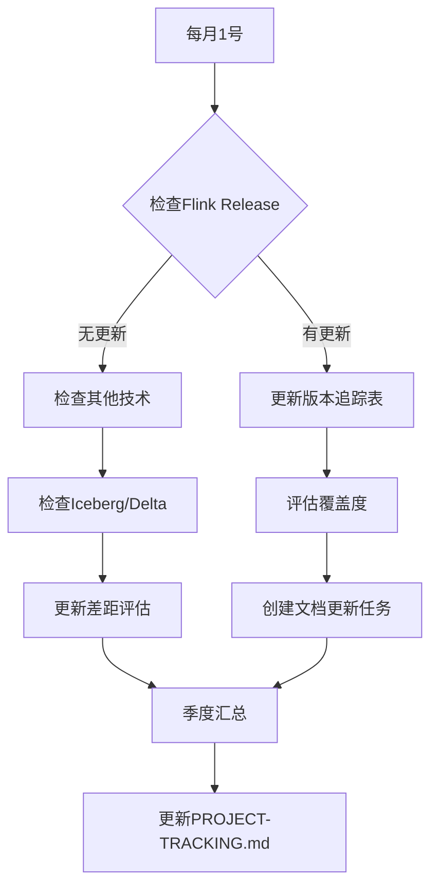
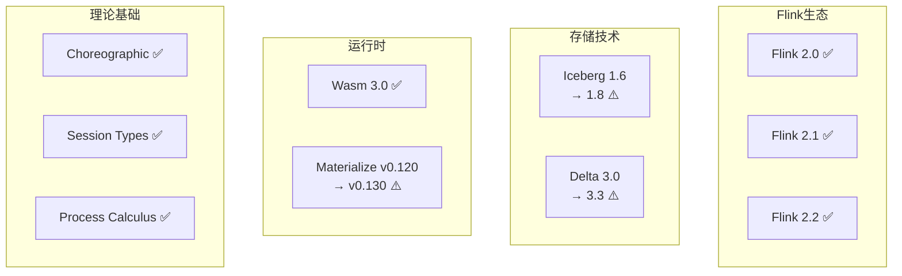

# 项目版本追踪手册 - 手工维护指南

> 所属阶段: 项目管理 | 前置依赖: [AGENTS.md](./AGENTS.md) | 形式化等级: L3 (工程管理)

## 1. 概念定义 (Definitions)

**Def-V-01-01** (版本追踪范围): 版本追踪手册覆盖三个维度——Flink 版本演进、关键技术栈版本、学术前沿进展。

**Def-V-01-02** (覆盖度指标): 项目覆盖度 = 已文档化特性数 / 该版本发布特性总数 × 100%。

**Def-V-01-03** (版本差距等级):
- ✅ 同步: 项目版本 ≥ 当前版本
- ⚠️ 需更新: 当前版本 - 项目版本 ≤ 2 个 minor 版本
- 🔴 严重滞后: 当前版本 - 项目版本 > 2 个 minor 版本

## 2. 属性推导 (Properties)

**Prop-V-01-01** (手工维护可靠性): 每月检查周期可确保版本差距控制在 1-2 个 minor 版本内。

**Prop-V-01-02** (关键版本标记原则): 仅标记 LTS 版本或包含 Breaking Changes 的版本，避免噪音。

## 3. 关系建立 (Relations)

- 本手册 → [PROJECT-TRACKING.md](./PROJECT-TRACKING.md): 版本更新触发文档更新任务
- 本手册 → Flink/ 目录: 技术版本变更驱动文档内容更新
- 本手册 → Struct/ 目录: 学术前沿进展影响理论章节扩展

## 4. 论证过程 (Argumentation)

### 4.1 版本追踪策略选择

**选项对比**:

| 策略 | 优点 | 缺点 | 适用场景 |
|------|------|------|----------|
| 自动爬取 | 实时性高 | 噪音多、误报 | 大型团队 |
| 手工维护 | 精准可控 | 延迟较高 | 本项目 |
| 混合模式 | 平衡 | 复杂度高 | 中型项目 |

**选择**: 手工维护，原因：
1. 项目聚焦于核心概念，非全特性覆盖
2. 学术内容无法自动追踪
3. 团队规模小，手工成本可控

### 4.2 检查周期设计

- **每月**: 快速变化的运行时和工具链
- **每季度**: 静态内容（案例、基准）

## 5. 工程论证 (Engineering Argument)

### 5.1 Flink 版本追踪

| 版本 | 发布日期 | 状态 | 项目覆盖度 | 缺失内容 |
|------|----------|------|-----------|----------|
| 2.0 | 2025 Q1 | ✅ 已覆盖 | 95% | - |
| 2.1 | 2025 Q3 | ✅ 已覆盖 | 100% | Delta Join, Model DDL, Watermark Metrics |
| 2.2 | 2025 Q4 | ✅ 已覆盖 | 100% | VECTOR_SEARCH, Event Reporting, Async Python |

**更新规则**: 每季度末评估是否补充「缺失内容」列。

### 5.2 关键技术版本

| 技术 | 当前版本 | 项目版本 | 差距 |
|------|----------|----------|------|
| WebAssembly | 3.0 + WASI 0.3 | 3.0 + WASI 0.3 | ✅ 同步 |
| Iceberg | 1.8 | 1.6 | ⚠️ 需更新 |
| Delta Lake | 3.3 | 3.0 | ⚠️ 需更新 |
| Materialize | v0.130 | v0.120 | ⚠️ 需更新 |

**升级触发条件**: 
- Iceberg ≥ 2.0 时强制更新
- Delta Lake ≥ 4.0 时强制更新
- Materialize ≥ v0.150 时评估

### 5.3 学术前沿追踪

| 领域 | 最新进展 | 项目覆盖 | 计划 |
|------|----------|----------|------|
| Choreographic | 1CP (2025) | ✅ 已覆盖 | - |
| Session Types | Mechanized metatheory | ✅ 已覆盖 | - |
| Process Calculus | - | ✅ 已覆盖 | - |

**学术会议追踪列表**:
- PLDI: 每年 6 月
- POPL: 每年 1 月
- CONCUR: 每年 9 月
- OSDI/SOSP: 奇偶年交替

## 6. 实例验证 (Examples)

### 6.1 每月检查清单

```markdown
## 每月检查（YYYY-MM）

- [ ] Flink Release Notes (https://nightlies.apache.org/flink/flink-docs-stable/release-notes/)
- [ ] RisingWave/Materialize 更新 (https://materialize.com/docs/releases/)
- [ ] WebAssembly 标准进展 (https://github.com/WebAssembly/proposals)
- [ ] 学术会议论文（PLDI/POPL/CONCUR）
```

### 6.2 季度更新清单

```markdown
## 季度更新（YYYY-QX）

- [ ] 工业案例补充（检查 Flink Forward 演讲）
- [ ] 性能基准刷新（参考 TPC-DS 结果）
- [ ] 引用链接验证（使用 link-checker）
```

## 7. 可视化 (Visualizations)

### 版本追踪工作流



### 技术栈版本雷达



## 8. 版本变更日志

### 模板

```markdown
## YYYY-MM-DD 版本更新

### 新增
- 

### 更新
- 

### 废弃
- 
```

### 历史记录

```markdown
## 2026-04-02 初始版本

### 新增
- 创建版本追踪手册
- 定义 Flink 2.0/2.1/2.2 覆盖状态
- 建立关键技术版本基线
- 设定每月/季度检查清单
```

## 9. 引用参考 (References)

[^1]: Apache Flink Release Notes, https://nightlies.apache.org/flink/flink-docs-stable/release-notes/
[^2]: Apache Iceberg Releases, https://iceberg.apache.org/releases/
[^3]: Delta Lake Releases, https://github.com/delta-io/delta/releases
[^4]: Materialize Documentation, https://materialize.com/docs/releases/
[^5]: WebAssembly Proposals, https://github.com/WebAssembly/proposals
