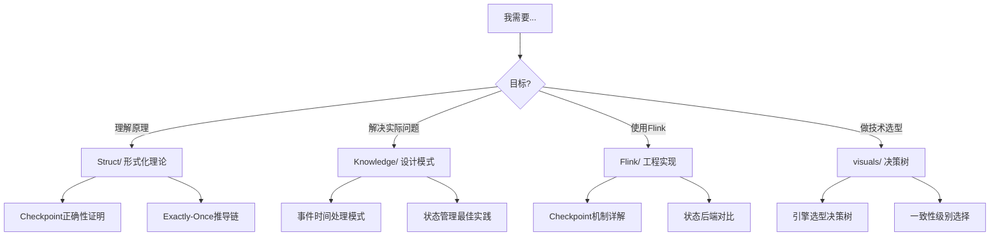
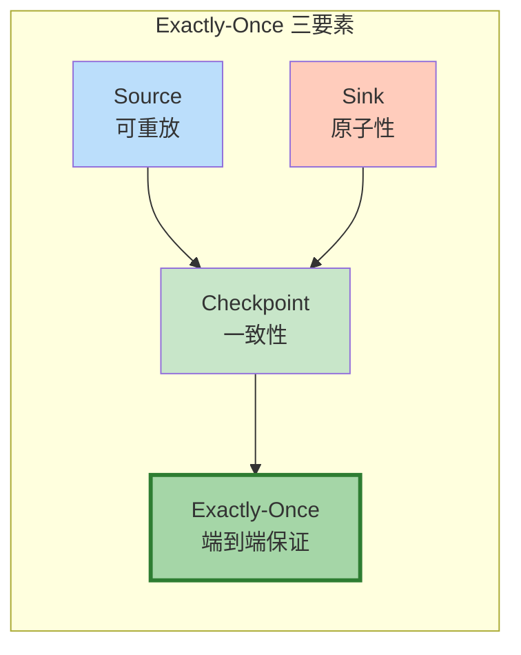
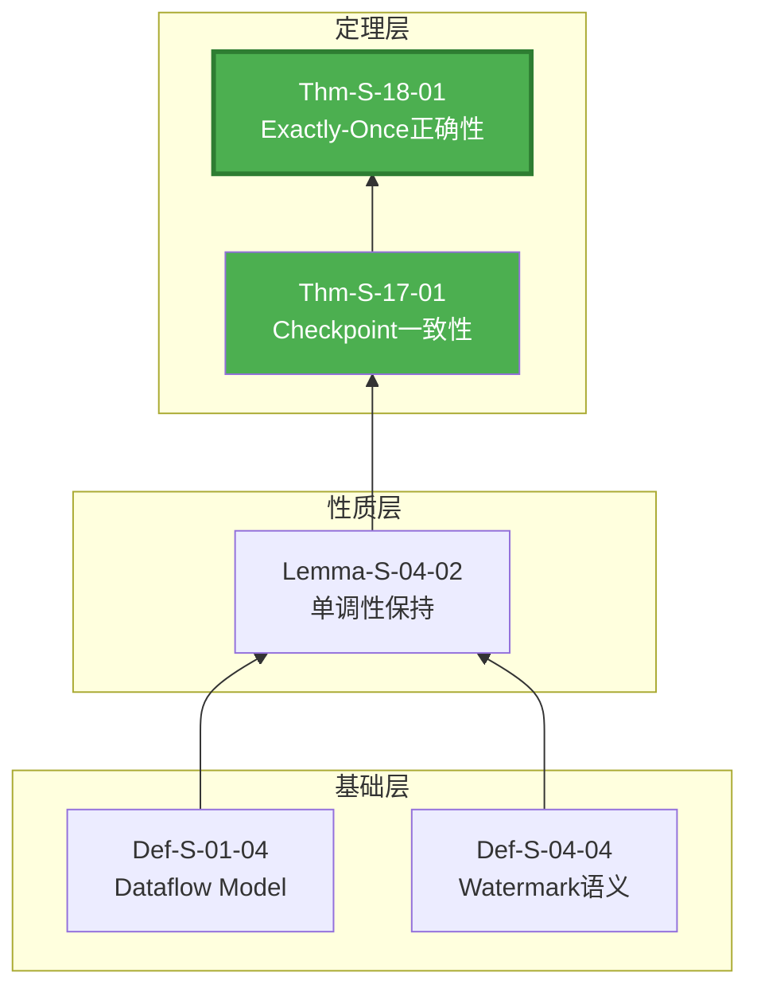
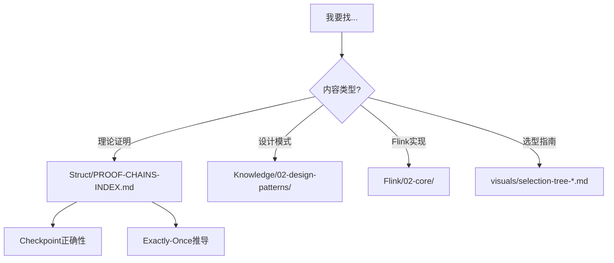
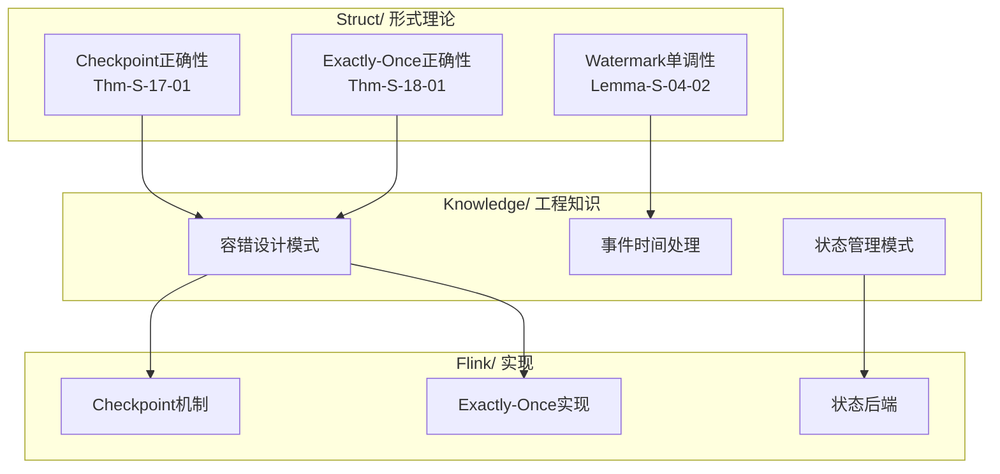

# AnalysisDataFlow 快速开始指南

> **5分钟入门 | 15分钟核心推导 | 30分钟完整路径**
>
> 📊 **403+ 文档 | 10,483+ 形式化元素 | 100% 完成度**

---

## 1. 5分钟快速概览 ⏱️

### 1.1 这是什么项目？

**一句话**: 流计算领域的「形式化理论 + 工程实践」全栈知识库

```
┌─────────────────────────────────────────────────────────────┐
│                    知识层次金字塔                             │
├─────────────────────────────────────────────────────────────┤
│  L6 生产实现  │  Flink/ 代码、配置、案例 (178篇)              │
├───────────────┼─────────────────────────────────────────────┤
│  L4-L5 模式   │  Knowledge/ 设计模式、选型指南 (134篇)        │
├───────────────┼─────────────────────────────────────────────┤
│  L1-L3 理论   │  Struct/ 定理、证明、形式化定义 (43篇)         │
└───────────────┴─────────────────────────────────────────────┘
```

**三大核心价值**:

| 价值 | 说明 | 典型用户 |
|------|------|----------|
| 🔬 **理论支撑** | 形式化定理保证工程决策正确性 | 架构师、研究员 |
| 🛠️ **实践指导** | 从定理到代码的完整映射路径 | 开发工程师 |
| 🔍 **问题诊断** | 按症状快速定位解决方案 | 运维工程师 |

---

### 1.2 快速定位你的需求



---

### 1.3 定理编号速查

**格式**: `{类型}-{阶段}-{文档号}-{序号}`

| 编号示例 | 含义 | 位置 |
|----------|------|------|
| `Thm-S-17-01` | **定理**-Struct阶段-17号文档-第1个 | Checkpoint一致性 |
| `Def-K-02-01` | **定义**-Knowledge阶段-02号文档-第1个 | Event Time处理 |
| `Lemma-S-04-02` | **引理**-Struct阶段-04号文档-第2个 | Watermark单调性 |

**快速记忆**:

- **Thm** = Theorem | **Def** = Definition | **Lemma** = 引理 | **Prop** = 命题
- **S** = Struct(理论) | **K** = Knowledge(知识) | **F** = Flink(实现)

---

## 2. 15分钟核心推导链 ⏱️⏱️

### 2.1 Checkpoint 正确性推导链 (8分钟)

**核心定理**: `Thm-S-17-01` - Flink Checkpoint一致性定理

**推导路径**:

| 步骤 | 内容 | 时间 | 关键元素 |
|------|------|------|----------|
| **L1 基础定义** | Dataflow Model → DAG → 算子语义 | 2min | Def-S-01-04, Def-S-04-01 |
| **L2 性质推导** | 局部确定性 + Watermark单调性 | 2min | Lemma-S-04-01, Lemma-S-04-02 |
| **L3 关系建立** | Flink→π-Calculus编码 | 2min | Thm-S-03-02, Def-S-13-03 |
| **L4 形式证明** | Barrier传播 → Checkpoint一致性 ✅ | 2min | Thm-S-17-01 |

**核心洞察**:

```
DAG结构 + Watermark单调性 + Barrier同步 ⟹ Checkpoint一致性
```

**完整文档**: [Struct/Proof-Chains-Checkpoint-Correctness.md](./Struct/Proof-Chains-Checkpoint-Correctness.md)

---

### 2.2 Exactly-Once 端到端推导链 (7分钟)

**核心定理**: `Thm-S-18-01` - Flink Exactly-Once正确性定理

**三要素模型**:



**依赖关系**:

| 要素 | 依赖定理 | 工程实现 |
|------|----------|----------|
| Source可重放 | Def-S-18-02 | Kafka consumer group |
| Checkpoint一致性 | **Thm-S-17-01** | Checkpoint barrier |
| Sink原子性 | Def-S-18-03 | 两阶段提交 / 幂等写入 |

**形式化表达**:

```
Replayable(source) ∧ ConsistentCheckpoint(G) ∧ AtomicSink(sink)
    ⟹ ExactlyOnce(G, source, sink)
```

**完整文档**: [Struct/Proof-Chains-Exactly-Once-Correctness.md](./Struct/Proof-Chains-Exactly-Once-Correctness.md)

---

### 2.3 关键定理关系图



---

## 3. 30分钟完整学习路径 ⏱️⏱️⏱️

### 3.1 按角色推荐路径

#### 👨‍💻 开发工程师 (30分钟)

| 阶段 | 时长 | 内容 | 文档链接 |
|------|------|------|----------|
| **第1周** | 10min | Flink vs Spark对比 | [Flink/05-vs-competitors/flink-vs-spark-streaming.md] |
| **第2周** | 10min | 事件时间与Watermark | [Flink/02-core/time-semantics-and-watermark.md](./Flink/02-core/time-semantics-and-watermark.md) |
| **第3周** | 10min | Checkpoint机制 | [Flink/02-core/checkpoint-mechanism-deep-dive.md](./Flink/02-core/checkpoint-mechanism-deep-dive.md) |

**进阶路径**: [LEARNING-PATHS/intermediate-datastream-expert.md](./LEARNING-PATHS/intermediate-datastream-expert.md)

---

#### 🏗️ 架构师 (30分钟)

| 阶段 | 时长 | 内容 | 文档链接 |
|------|------|------|----------|
| **Day 1-2** | 10min | 统一流计算理论 | [Struct/01-foundation/01.01-unified-streaming-theory.md](./Struct/01-foundation/01.01-unified-streaming-theory.md) |
| **Day 3-4** | 10min | 引擎选型决策树 | [visuals/selection-tree-streaming.md](./visuals/selection-tree-streaming.md) |
| **Day 5** | 10min | 技术选型指南 | [Knowledge/04-technology-selection/engine-selection-guide.md](./Knowledge/04-technology-selection/engine-selection-guide.md) |

**完整路径**: [LEARNING-PATHS/expert-architect-path.md](./LEARNING-PATHS/expert-architect-path.md)

---

#### 🔬 研究员 (30分钟)

| 阶段 | 时长 | 内容 | 文档链接 |
|------|------|------|----------|
| **Week 1** | 10min | 进程演算基础 | [Struct/Proof-Chains-Process-Calculus-Foundation.md](./Struct/Proof-Chains-Process-Calculus-Foundation.md) |
| **Week 2** | 10min | 跨模型编码 | [Struct/Proof-Chains-Cross-Model-Encoding.md](./Struct/Proof-Chains-Cross-Model-Encoding.md) |
| **Week 3** | 10min | 一致性层级 | [Struct/Proof-Chains-Consistency-Hierarchy.md](./Struct/Proof-Chains-Consistency-Hierarchy.md) |

---

### 3.2 核心文档速查表

| 主题 | 理论文档 (Struct/) | 工程文档 (Flink/) | 模式文档 (Knowledge/) |
|------|-------------------|-------------------|----------------------|
| **Checkpoint** | Proof-Chains-Checkpoint-Correctness.md | 02-core/checkpoint-mechanism-deep-dive.md | 02-design-patterns/pattern-state-management.md |
| **Exactly-Once** | Proof-Chains-Exactly-Once-Correctness.md | 02-core/exactly-once-end-to-end.md | 02-design-patterns/pattern-exactly-once.md |
| **Watermark** | 02-properties/02.03-watermark-monotonicity.md | 02-core/time-semantics-and-watermark.md | 02-design-patterns/pattern-event-time-processing.md |
| **状态管理** | 04-proofs/04.02-state-consistency.md | 02-core/flink-state-management-complete-guide.md | 02-design-patterns/pattern-state-management.md |

---

## 4. 常见问题 FAQ ❓

### Q1: 如何快速找到我需要的内容？

**A**: 使用以下决策树:



---

### Q2: 定理编号看不懂怎么办？

**A**:

- **Thm** = 定理 (需要证明的重要结论)
- **Def** = 定义 (概念的形式化描述)
- **Lemma** = 引理 (证明定理的辅助结论)
- **S** = Struct目录 (理论) | **K** = Knowledge目录 (知识) | **F** = Flink目录 (实现)

**示例**: `Thm-S-17-01` = Struct目录17号文档的第1个定理

---

### Q3: 我是初学者，应该从哪里开始？

**A**: 推荐三步走:

| 阶段 | 时间 | 行动 |
|------|------|------|
| 1 | 5min | 阅读本指南的5分钟概览 |
| 2 | 15min | 理解Checkpoint + Exactly-Once推导链 |
| 3 | 按需 | 根据目标导航选择具体路径 |

**入门路径**: [LEARNING-PATHS/beginner-quick-start.md](./LEARNING-PATHS/beginner-quick-start.md)

---

### Q4: 形式化内容太难，有没有更易懂的版本？

**A**:

- **Struct/** 文档每章包含「直观解释」部分
- **Knowledge/** 文档提供工程视角的理解
- **visuals/** 包含大量图表辅助理解
- 先看工程文档，再回读理论文档

---

### Q5: 如何验证我的理解是否正确？

**A**:

1. 完成文档中的「检查点」问题
2. 尝试向他人解释核心概念 (费曼技巧)
3. 参考 [LEARNING-PATHS/certifications/custom-assessment.md](./LEARNING-PATHS/certifications/custom-assessment.md) 自测

---

## 5. 可视化图表速览 📊

### 5.1 核心决策树

| 图表 | 用途 | 路径 |
|------|------|------|
| **引擎选型决策树** | 选择合适的流处理引擎 | [visuals/selection-tree-streaming.md](./visuals/selection-tree-streaming.md) |
| **一致性级别选择** | 选择正确的一致性保证 | [visuals/selection-tree-consistency.md](./visuals/selection-tree-consistency.md) |
| **范式选择决策树** | Actor vs CSP vs Dataflow | [visuals/selection-tree-paradigm.md](./visuals/selection-tree-paradigm.md) |

---

### 5.2 核心对比矩阵

| 矩阵 | 内容 | 路径 |
|------|------|------|
| **引擎对比矩阵** | Flink vs Spark vs Kafka Streams... | [visuals/matrix-engines.md](./visuals/matrix-engines.md) |
| **模型对比矩阵** | Dataflow vs Actor vs CSP... | [visuals/matrix-models.md](./visuals/matrix-models.md) |
| **设计模式矩阵** | 7大核心模式关系 | [visuals/matrix-patterns.md](./visuals/matrix-patterns.md) |

---

### 5.3 知识关系图谱



---

## 6. 按目标快速导航 🎯

### 6.1 "我想理解 Checkpoint 机制"

| 深度 | 文档 | 时间 |
|------|------|------|
| 快速理解 | [Flink/02-core/checkpoint-mechanism-deep-dive.md](./Flink/02-core/checkpoint-mechanism-deep-dive.md) | 20min |
| 深入原理 | [Struct/Proof-Chains-Checkpoint-Correctness.md](./Struct/Proof-Chains-Checkpoint-Correctness.md) | 40min |
| 完整证明 | [Struct/04-proofs/04.01-flink-checkpoint-correctness.md](./Struct/04-proofs/04.01-flink-checkpoint-correctness.md) | 2h |

**核心概念**: Barrier传播 → 异步快照 → 状态一致性

---

### 6.2 "我想了解 Exactly-Once 保证"

| 深度 | 文档 | 时间 |
|------|------|------|
| 快速理解 | [Flink/02-core/exactly-once-end-to-end.md](./Flink/02-core/exactly-once-end-to-end.md) | 20min |
| 深入原理 | [Struct/Proof-Chains-Exactly-Once-Correctness.md](./Struct/Proof-Chains-Exactly-Once-Correctness.md) | 40min |
| 完整证明 | [Struct/04-proofs/04.03-exactly-once-correctness.md] | 2h |

**核心概念**: Source可重放 + Checkpoint一致性 + Sink原子性

---

### 6.3 "我想学习模型编码"

| 主题 | 文档 | 时间 |
|------|------|------|
| Actor→CSP编码 | [Struct/Proof-Chains-Cross-Model-Encoding.md](./Struct/Proof-Chains-Cross-Model-Encoding.md) | 1h |
| Flink→π-Calculus | [Struct/03-relationships/03.01-flink-to-pi-calculus-encoding.md] | 1.5h |
| 进程演算基础 | [Struct/Proof-Chains-Process-Calculus-Foundation.md](./Struct/Proof-Chains-Process-Calculus-Foundation.md) | 2h |

**核心概念**: 语义保持编码 → 双模拟关系 → 表达能力等价

---

### 6.4 "我需要技术选型指导"

| 场景 | 文档 | 时间 |
|------|------|------|
| 引擎选型 | [visuals/selection-tree-streaming.md](./visuals/selection-tree-streaming.md) | 10min |
| 一致性选择 | [visuals/selection-tree-consistency.md](./visuals/selection-tree-consistency.md) | 10min |
| 详细对比 | [Knowledge/04-technology-selection/engine-selection-guide.md](./Knowledge/04-technology-selection/engine-selection-guide.md) | 30min |

**核心概念**: 延迟要求 → 一致性需求 → 吞吐量 → 选择决策

---

## 7. 下一步行动 📋

### 立即开始 (选择一项)

- [ ] **理解 Checkpoint**: 阅读 [Struct/Proof-Chains-Checkpoint-Correctness.md](./Struct/Proof-Chains-Checkpoint-Correctness.md) 第1-4节
- [ ] **理解 Exactly-Once**: 阅读 [Struct/Proof-Chains-Exactly-Once-Correctness.md](./Struct/Proof-Chains-Exactly-Once-Correctness.md) 第1-3节
- [ ] **技术选型**: 使用 [visuals/selection-tree-streaming.md](./visuals/selection-tree-streaming.md) 决策树
- [ ] **完整学习**: 开始 [LEARNING-PATHS/beginner-quick-start.md](./LEARNING-PATHS/beginner-quick-start.md)

### 深入学习

| 资源 | 链接 |
|------|------|
| **完整学习路径索引** | [LEARNING-PATHS/00-INDEX.md](./LEARNING-PATHS/00-INDEX.md) |
| **定理推导链总索引** | [Struct/PROOF-CHAINS-INDEX.md](./Struct/PROOF-CHAINS-INDEX.md) |
| **FAQ 完整版** | [FAQ.md](./FAQ.md) |
| **项目完成报告** | [100-PERCENT-COMPLETION-FINAL-REPORT.md](./100-PERCENT-COMPLETION-FINAL-REPORT.md) |

---

## 8. 引用参考


---

> 🎉 **项目状态**: 100% 完成 | **版本**: v3.6 | **最后更新**: 2026-04-11
>
> 如需帮助，请参考 [FAQ.md](./FAQ.md) 或查阅完整文档索引。
