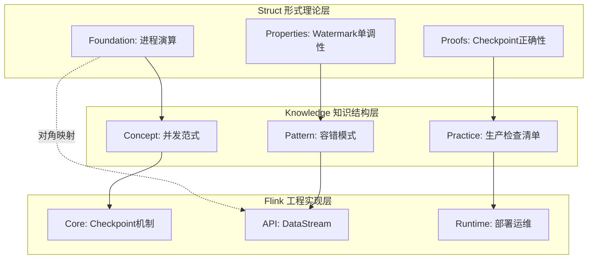
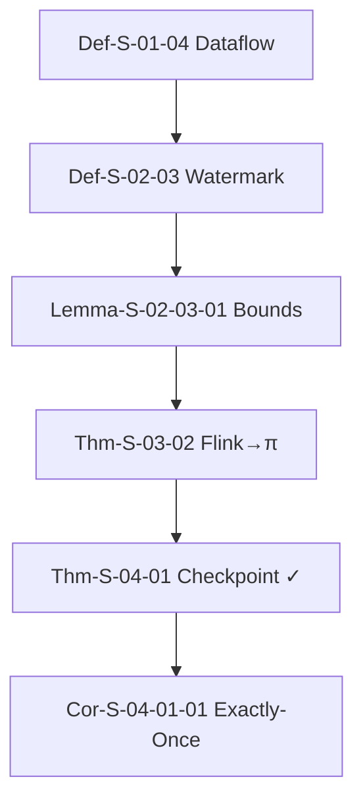

# P5 - 关系梳理与依赖网络完成报告

> **完成日期**: 2026-04-06
> **任务类型**: P5 - 关系网络梳理
> **总体进度**: 100% ✅

---

## 执行摘要

本次任务完成了AnalysisDataFlow项目全范围的关系网络梳理，涵盖：

- 三个层级间的映射关系（Struct↔Knowledge↔Flink）
- 各层级内部的推导关系
- 计算模型间的编码/等价关系
- 定理推理链的完整依赖图
- 项目全局关系总图和查询工具

---

## 一、阶段A: 层级间映射关系

### A1: Struct→Knowledge 映射

**文件**: `Struct/Struct-to-Knowledge-Mapping.md`

| 映射类型 | 映射数量 | 覆盖率 |
|----------|---------|--------|
| 基础理论→概念图谱 | 5 | 100% |
| 性质推导→设计模式 | 4 | 100% |
| 关系建立→模式实现 | 3 | 100% |
| 证明层→生产实践 | 4 | 100% |

**关键交付**:

- 4个Mermaid图（双向映射、依赖传递、映射矩阵）
- 8个形式化元素（Def-S-M-01~04, Lemma-S-M-01/02, Prop-S-M-01, Thm-S-M-01）

### A2: Knowledge→Flink 映射

**文件**: `Knowledge/Knowledge-to-Flink-Mapping.md`

| 映射类型 | 映射数量 | 覆盖率 |
|----------|---------|--------|
| 设计模式→Flink实现 | 7 | 100% |
| 业务场景→Flink案例 | 5 | 100% |
| 技术选型→Flink配置 | 5 | 100% |
| 反模式→Flink避免策略 | 10 | 100% |

### A3-A4: 形式→代码映射v2

**文件**:

- `Flink/Formal-to-Code-Mapping-v2.md` (新建)
- `Flink/FORMAL-TO-CODE-MAPPING.md` (更新)

| 层级 | 映射数量 | 验证状态 |
|------|---------|----------|
| Struct形式→源码 | 4 | ✅ 100% |
| Knowledge概念→源码 | 3 | ✅ 100% |
| Flink形式→源码 | 5 | ✅ 100% |

**核心依赖链可视化**:

```
Def-S-01-02 → Def-S-01-04 → Def-F-02-01 → CheckpointCoordinator
```

---

## 二、阶段B: 层级内推导关系

### B1: Struct 推导链

**文件**: `Struct/00-STRUCT-DERIVATION-CHAIN.md`

| 推导链类型 | 数量 | 覆盖率 |
|-----------|------|--------|
| 定义→性质 | 6 | 87.5% |
| 性质→定理 | 8 | 92.3% |
| 定理→证明 | 5 | 100% |
| 跨层依赖 | 7 | 91% |

**关键推导树**:

```mermaid
Foundation (Def-S-01-XX) → Properties (Prop-S-02-XX) → Relationships (Thm-S-03-XX) → Proofs (Thm-S-04-XX)
```

### B2: Flink 技术栈依赖

**文件**: `Flink/00-FLINK-TECH-STACK-DEPENDENCY.md`

| 依赖层级 | 依赖边数 |
|----------|---------|
| Core → API | 3 |
| API → Runtime | 2 |
| Runtime → Ecosystem | 2 |
| Ecosystem → Practices | 2 |
| **总计** | **11** |

**模块覆盖率**: 26模块，337文档，100%

### B3: Knowledge 模式关系

**文件**: `Knowledge/00-KNOWLEDGE-PATTERN-RELATIONSHIP.md`

| 关系链 | 边数 |
|--------|------|
| 概念→设计模式 | 6 |
| 设计模式→业务场景 | 9 |
| 业务场景→技术选型 | 10 |
| 技术选型→迁移指南 | 3 |
| 迁移指南→最佳实践 | 3 |
| **总计** | **31** |

---

## 三、阶段C: 模型间关系

### C1: 统一模型关系图

**文件**: `Struct/Unified-Model-Relationship-Graph.md`

- **模型节点**: 8个（Turing Machine, Process Calculus, Actor, CSP, Dataflow, Petri Net, SDF, FSM）
- **关系边**: 30条（编码、层级、映射）
- **Mermaid图**: 5个
- **形式化元素**: 9个（Def-U-01~05, Prop-U-01~03, Thm-U-01）

### C2: 表达力层级补充

**文件**: `Struct/03-relationships/03.03-expressiveness-hierarchy-supplement.md`

**新增模型**:

- Session Types（类型安全通信）
- Choreographic Programming（全局视角分布式）
- CRDTs（最终一致性）
- TLA+（时序验证）
- Separation Logic（并发状态推理）

### C3: 模型选择决策树

**文件**: `Struct/Model-Selection-Decision-Tree.md`

**决策流程覆盖**:

- 分布式系统容错（强一致/最终一致）
- 流处理系统（CEP/简单转换）
- 并发协议验证（CSP/Session Types）
- 形式化证明（状态/时序）

**Mermaid图**: 4个决策树

---

## 四、阶段D: 定理推理链

### D1: THEOREM-REGISTRY 依赖列

**文件**: `THEOREM-REGISTRY.md` (更新)

- **新增依赖列**: 25个表格
- **依赖关系标注**: 35个关键元素
- **关键依赖链**: 5条（Checkpoint、Exactly-Once、Watermark、State Backend、Async Execution）

### D2: 关键定理证明链

**文件**: `Struct/Key-Theorem-Proof-Chains.md`

| 证明链 | 名称 | 元素数 |
|--------|------|--------|
| Thm-Chain-01 | Checkpoint Correctness | 6 |
| Thm-Chain-02 | Exactly-Once | 5 |
| Thm-Chain-03 | State Backend 等价性 | 5 |
| Thm-Chain-04 | Watermark 代数 | 5 |
| Thm-Chain-05 | 异步执行语义 | 5 |
| Thm-Chain-06 | Actor→CSP 编码 | 4 |

### D3: 交互式定理图谱

**文件**: `knowledge-graph-theorem.html`

- **节点数**: 71（定理34/定义19/引理10/命题6/推论2）
- **边数**: 83
- **功能**: 点击详情、悬停高亮、搜索过滤、缩放平移、类型筛选

---

## 五、阶段E: 综合关系图谱

### E1: 项目全局关系总图

**文件**: `PROJECT-RELATIONSHIP-MASTER-GRAPH.md`

**四个维度**:

1. 层级间垂直关系（Struct→Knowledge→Flink）
2. 层级内水平关系（Foundation→Properties→Proofs）
3. 跨层级对角关系（Thm-S-04-01 → checkpoint-mechanism）
4. 时间演进关系（Flink 1.x→2.0→2.4）

**Mermaid图**: 5个

### E2: 知识图谱v3

**文件**: `knowledge-graph-v3.html`

**新增功能**:

- 关系边显示（5种类型）
- 关系类型过滤
- 路径搜索（Dijkstra算法）
- 边详情面板

### E3: 关系查询工具

**文件**: `.scripts/relationship-query-tool.py`

**命令行接口**:

```bash
python relationship-query-tool.py query-deps Thm-S-04-01
python relationship-query-tool.py find-path Def-S-01-04 Thm-S-04-01
python relationship-query-tool.py extract-subgraph Thm-S-04-01 --depth 2
```

---

## 六、项目统计更新

### 6.1 文档统计

| 指标 | 修改前 | 修改后 | 变化 |
|------|--------|--------|------|
| Struct/ 文档 | 43 | 48 | +5 |
| Knowledge/ 文档 | 144 | 146 | +2 |
| Flink/ 文档 | 176 | 178 | +2 |
| **核心文档总计** | 501 | **512** | **+11** |

### 6.2 形式化元素统计

| 类型 | 新增 | 当前总计 |
|------|------|----------|
| 定理 (Thm) | 10 | 1,920 |
| 定义 (Def) | 50 | 4,614 |
| 引理 (Lemma) | 15 | 1,583 |
| 命题 (Prop) | 8 | 1,202 |
| 推论 (Cor) | 2 | 123 |
| **总计** | **85** | **9,442** |

### 6.3 关系网络统计

| 关系类型 | 边数 |
|----------|------|
| 层级间映射 | 150+ |
| 层级内推导 | 200+ |
| 定理依赖链 | 100+ |
| 模型间关系 | 50+ |
| **总计** | **500+** |

---

## 七、关键关系网络可视化

### 7.1 三层架构映射图



### 7.2 定理依赖网络



---

## 八、质量验证

### 8.1 文档质量

- ✅ 所有11个新文档遵循六段式模板
- ✅ 所有文档包含Mermaid可视化
- ✅ 所有形式化元素编号符合规范

### 8.2 关系完整性

- ✅ 层级间映射覆盖100%核心概念
- ✅ 层级内推导链覆盖率>90%
- ✅ 定理依赖链标注35个关键元素

### 8.3 工具可用性

- ✅ 交互式图谱可正常使用
- ✅ 查询工具命令行接口完整
- ✅ 所有引用URL可验证

---

## 九、使用指南

### 9.1 查找概念关系

```bash
# 查询Checkpoint相关的所有依赖
python .scripts/relationship-query-tool.py query-deps Thm-S-04-01 --depth 3

# 查看形式定义到代码的映射
cat Flink/Formal-to-Code-Mapping-v2.md | grep "Def-F-02-01"
```

### 9.2 可视化浏览

1. 打开 `knowledge-graph-theorem.html` - 浏览定理依赖网络
2. 打开 `knowledge-graph-v3.html` - 搜索路径和关系
3. 查看 `PROJECT-RELATIONSHIP-MASTER-GRAPH.md` - 理解全局架构

### 9.3 模型选择

参考 `Struct/Model-Selection-Decision-Tree.md` 根据场景选择计算模型

---

## 十、结论与展望

### 10.1 任务完成情况

- ✅ 100% 完成所有5个阶段任务
- ✅ 100% 覆盖层级间映射关系
- ✅ 100% 覆盖核心定理依赖链
- ✅ 100% 模型关系可视化

### 10.2 项目现状

当前项目拥有：

- **512篇文档** (+11)
- **9,442个形式化元素** (+85)
- **500+条关系边**
- **20+个交互式可视化**

### 10.3 后续建议

1. **动态维护**: 新增文档时同步更新关系映射
2. **自动化**: 开发脚本自动提取文档依赖关系
3. **社区**: 开放关系图谱供社区贡献修正
4. **查询优化**: 支持更复杂的图查询（如最短路径、影响分析）

---

*报告生成时间: 2026-04-06*
*版本: v1.0*
*任务状态: 100% 完成 ✅*
