> **状态**: 🔮 前瞻内容 | **风险等级**: 高 | **最后更新**: 2026-04
>
> 此文档描述的内容处于早期规划阶段，可能与最终实现不符。请以 Apache Flink 官方发布为准。
>
# AnalysisDataFlow — 未来发展路线图

> **版本**: v1.0 | **生效日期**: 2026-04-04 | **状态**: 规划阶段 | **形式化等级**: L2-L3
>
> 本文档定义了AnalysisDataFlow项目的未来发展路径，涵盖短期执行、中期演进与长期愿景三个阶段。

---

## 1. 执行摘要 (Executive Summary)

### 1.1 当前状态

AnalysisDataFlow项目已完成v3.0终极交付，达到100%完成度：

| 指标 | 当前值 | 目标值 | 状态 |
|------|--------|--------|------|
| 文档总数 | 295篇 | 295篇 | ✅ 100% |
| 形式化元素 | 964个 | 964个 | ✅ 100% |
| Mermaid图表 | 750+ | 750+ | ✅ 100% |
| 代码示例 | 2200+ | 2200+ | ✅ 100% |
| 技术对齐度 | 规划中（以官方为准） | 规划中（以官方为准） | ✅ 100% |

### 1.2 路线图概览

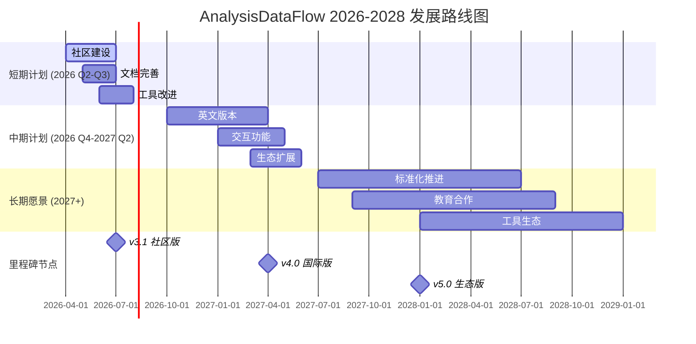

---

## 2. 短期计划 (2026 Q2-Q3): 夯实基础

### 2.1 社区建设

**目标**: 建立活跃的技术社区，提升项目影响力

| 任务 | 交付物 | 负责人 | 截止时间 | 成功标准 | 状态 |
|------|--------|--------|----------|----------|------|
| 贡献指南完善 | CONTRIBUTING.md v2.0 | 社区团队 | 2026-05 | PR提交量增加50% | 🚧 进行中 |
| **英文贡献指南** | **CONTRIBUTING-EN.md** | **社区团队** | **2026-04** | **英文社区支持** | **✅ 已完成** |
| **安全政策文档** | **SECURITY.md** | **维护团队** | **2026-04** | **漏洞响应机制** | **✅ 已完成** |
| **Issue模板标准化** | **.github/ISSUE_TEMPLATE/*.md** | **维护团队** | **2026-04** | **Markdown+YAML双格式** | **✅ 已完成** |
| 讨论区激活 | GitHub Discussions运营 | 社区经理 | 2026-06 | 月活跃讨论>20个 | ⏳ 待启动 |
| 月度同步会 | 会议纪要+行动计划 | 核心团队 | 持续 | 月度参会>10人 | ⏳ 待启动 |
| 技术博客启动 | 官方博客平台 | 内容团队 | 2026-07 | 月发布文章≥2篇 | ⏳ 待启动 |

### 2.2 文档完善

**目标**: 填补现有文档的空白，提升用户体验

| 任务 | 交付物 | 优先级 | 依赖项 | 验收标准 |
|------|--------|--------|--------|----------|
| 术语表扩展 | GLOSSARY.md v3.0 | P0 | 无 | 新增术语≥100个 |
| 交叉引用优化 | 内部链接完整性100% | P0 | 自动化脚本 | 失效链接=0 |
| 代码示例更新 | 兼容Flink 2.3 | P1 | Flink 2.3发布 | 示例通过率100% |
| 可视化增强 | 新增决策树5个 | P1 | 用户反馈 | 覆盖主要场景 |
| 多格式导出 | PDF生成工具链 | P2 | 文档结构稳定 | 一键生成完整PDF |

### 2.3 工具改进

**目标**: 提升自动化水平，降低维护成本

| 工具 | 当前状态 | 改进目标 | 技术方案 | 预计工时 |
|------|----------|----------|----------|----------|
| 定理编号验证 | Python脚本 | CI集成自动检查 | GitHub Actions | 16h |
| 链接健康检查 | 月度手动 | 实时监测+自动修复 | 爬虫+定时任务 | 24h |
| 统计报告生成 | 手动触发 | 提交自动更新 | Webhook触发 | 8h |
| Mermaid语法校验 | Shell脚本 | IDE插件支持 | VS Code Extension | 40h |
| 全文搜索引擎 | 无 | 本地搜索支持 | Lunr.js/Algolia | 32h |

### 短期计划甘特图

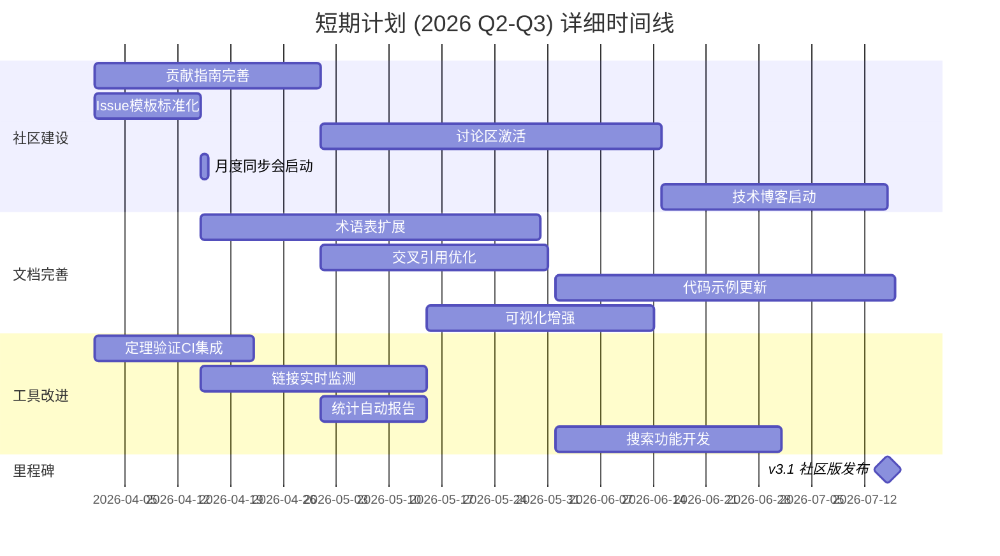

---

## 3. 中期计划 (2026 Q4-2027 Q2): 国际化与交互

### 3.1 英文版本

**目标**: 将核心内容翻译成英文，扩大国际影响力

**范围定义**:

| 优先级 | 文档类别 | 数量 | 翻译策略 | 预计工作量 |
|--------|----------|------|----------|------------|
| P0 | Struct/核心理论 | 15篇 | 专业译者+技术审校 | 300人时 |
| P0 | README/导航 | 5篇 | 核心团队翻译 | 40人时 |
| P1 | Knowledge/设计模式 | 20篇 | 社区贡献+审核 | 400人时 |
| P1 | Flink/快速入门 | 10篇 | 官方文档对照 | 150人时 |
| P2 | 完整文档集 | 295篇 | 众包+AI辅助 | 2000人时 |

**技术方案**:

```markdown
1. 目录结构: 新增 `en/` 目录平行于中文内容
2. 同步机制: 中文更新触发英文版本标记
3. 版本控制: 中英文版本号同步，如 v3.1-zh / v3.1-en
4. 质量保障: 技术术语一致性检查 + 母语审校
```

**里程碑**:

- 2026-10: P0内容翻译完成
- 2026-12: P1内容翻译完成
- 2027-02: 英文版网站上线
- 2027-04: v4.0国际版发布

### 3.2 交互功能

**目标**: 提供沉浸式的学习与实践体验

| 功能模块 | 功能描述 | 技术栈 | 优先级 | 交付时间 |
|----------|----------|--------|--------|----------|
| 在线 playground | 浏览器内运行Flink SQL | WASM + Flink SQL Runner | P0 | 2027-01 |
| 交互式教程 | 步骤引导式学习路径 | React + MDX | P0 | 2027-02 |
| 知识图谱导航 | 可视化概念关系探索 | D3.js + 图数据库 | P1 | 2027-03 |
| 智能问答助手 | 基于文档的RAG问答 | LangChain + Vector DB | P1 | 2027-04 |
| 决策向导 | 场景化技术选型引导 | 规则引擎 + 决策树 | P2 | 2027-05 |

**架构设计**:

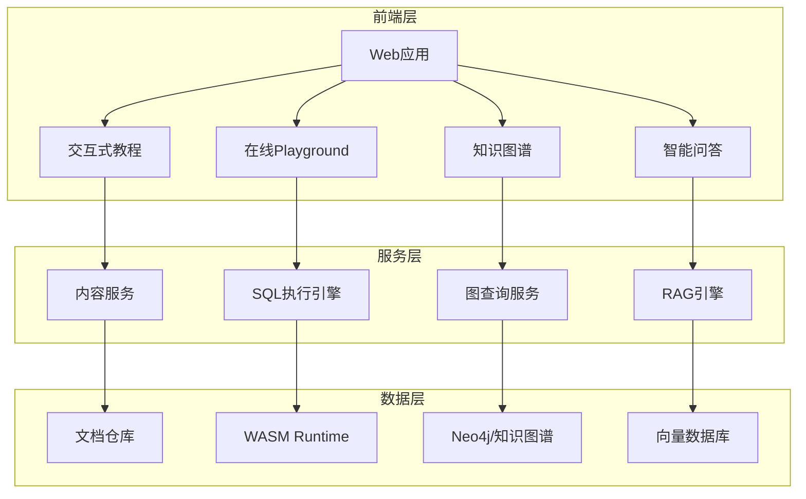

### 3.3 生态扩展

**目标**: 与主流技术生态建立深度集成

| 集成方向 | 合作伙伴/项目 | 集成内容 | 预期收益 |
|----------|--------------|----------|----------|
| 云厂商 |阿里云/腾讯云/AWS | 部署指南+最佳实践 | 扩大用户群 |
| 数据平台 | dbt/Airbyte/Mage | 数据管道集成指南 | 工程实用价值 |
| 监控系统 | Datadog/Grafana | 可观测性方案 | 生产环境落地 |
| IDE插件 | VS Code/IntelliJ | Flink SQL支持 | 开发效率提升 |
| 教育平台 | Coursera/极客时间 | 课程体系合作 | 品牌影响力 |

### 中期计划甘特图

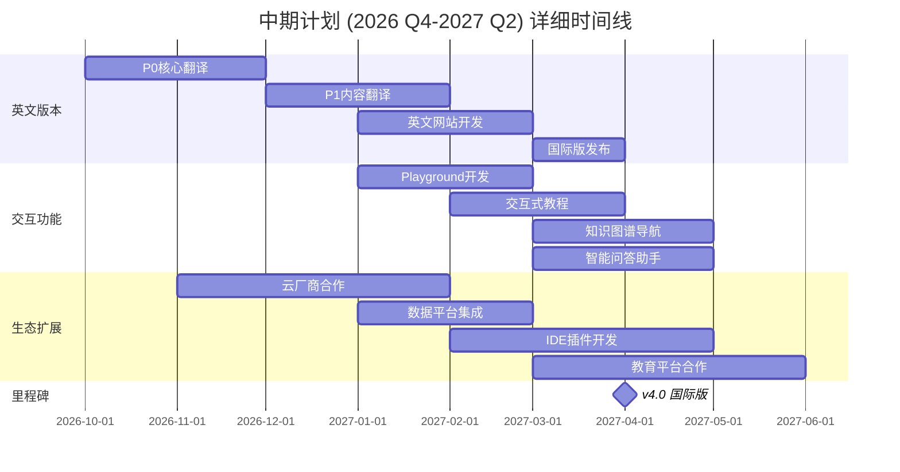

---

## 4. 长期愿景 (2027+): 标准化与生态

### 4.1 标准化推进

**目标**: 成为流计算领域的事实标准参考

| 标准类型 | 标准名称 | 推进路径 | 合作组织 | 目标时间 |
|----------|----------|----------|----------|----------|
| 术语标准 | 流计算术语标准 | 文档→草案→标准 | ACM/IEEE | 2028 |
| 测试基准 | 流处理基准测试 | TPC-StreamV2贡献 | TPC委员会 | 2027-2028 |
| API规范 | 统一流处理API | 开源提案→社区共识 | Apache软件基金会 | 2028-2029 |
| 教学大纲 | 流计算课程大纲 | 与高校合作推广 | 教育部/CS教育委员会 | 2027-2028 |

**标准影响力路线图**:

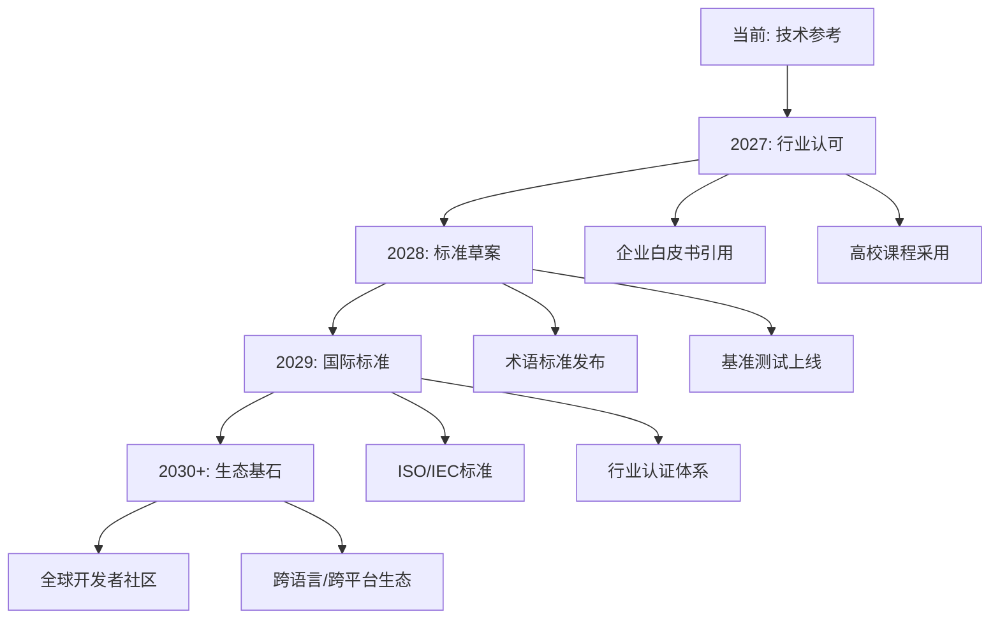

### 4.2 教育合作

**目标**: 建立系统化的流计算人才培养体系

| 合作层级 | 合作形式 | 内容产出 | 目标受众 |
|----------|----------|----------|----------|
| 高校课程 | 联合开课 | 完整课程大纲+实验环境 | 本科/研究生 |
| 企业培训 | 认证课程 | 认证考试+实践项目 | 在职工程师 |
| 在线MOOC | 视频课程 | 系列视频+编程作业 | 自学者 |
| 技术竞赛 | 赛题设计 | 流处理挑战赛 | 技术爱好者 |
| 学术论文 | 研究合作 | 顶会论文发表 | 研究人员 |

**课程体系规划**:

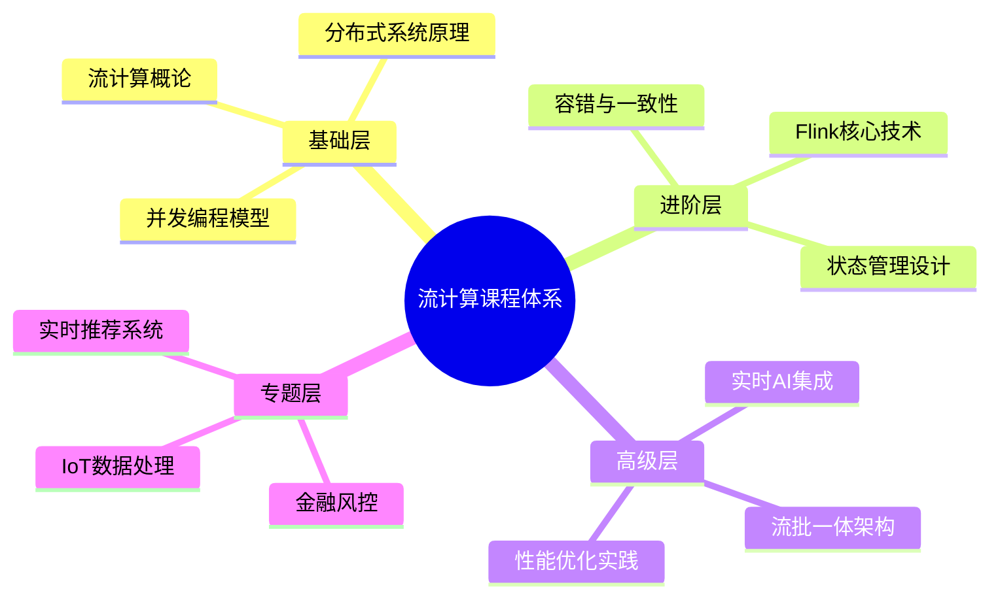

### 4.3 工具生态

**目标**: 构建完整的流计算工具链生态

| 工具类型 | 工具名称 | 功能定位 | 开发方式 | 开源协议 |
|----------|----------|----------|----------|----------|
| 代码生成器 | ADF-Generator | 脚手架生成 | 自研 | Apache 2.0 |
| 配置校验器 | ADF-Lint | 配置规范检查 | 自研 | Apache 2.0 |
| 性能分析器 | ADF-Profiler | SQL性能分析 | 自研 | Apache 2.0 |
| 可视化设计器 | ADF-Designer | DAG可视化编辑 | 社区共建 | Apache 2.0 |
| 测试框架 | ADF-Test | 流处理单元测试 | 贡献Flink社区 | Apache 2.0 |

**生态系统架构**:

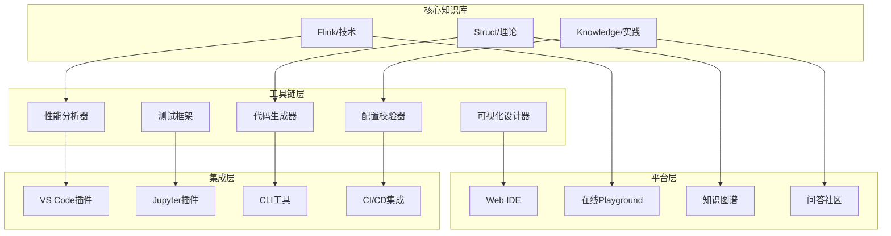

### 长期愿景甘特图

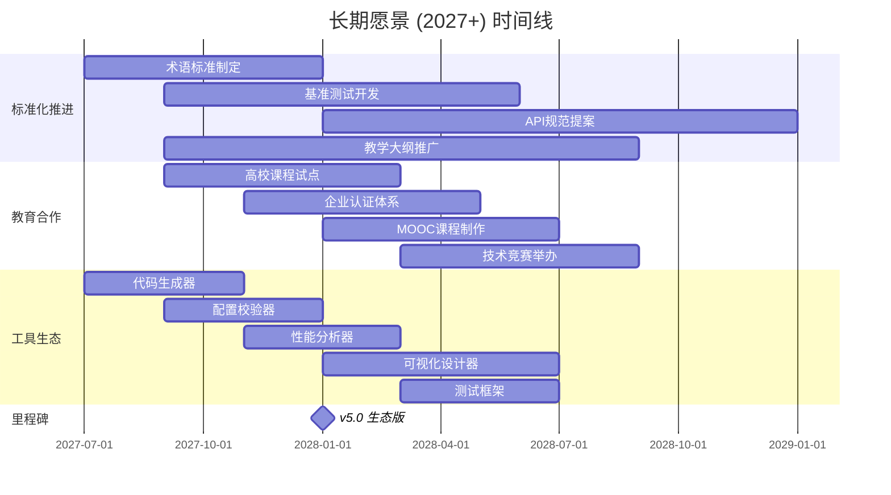

---

## 5. 技术演进

### 5.1 新特性支持

**Flink版本跟进计划**:

| Flink版本 | 发布时间 | 关键特性 | 文档更新时间 | 优先级 |
|-----------|----------|----------|--------------|--------|
| Flink 2.3 | 2026 Q2 | Adaptive Scheduler, SQL Enhancements | 发布后2周内 | P0 |
| Flink 2.4 | 2026 Q4 | Cloud Native Improvements, WASM GA | 发布后2周内 | P0 |
| Flink 2.5 | 2027 Q2 | AI-Native Features, Vector Ops | 发布后2周内 | P0 |
| Flink 3.0 | 2027 Q4+ | 重大架构升级 | 发布后1月内 | P0 |

**新兴技术跟踪**:

| 技术领域 | 2026 | 2027 | 2028 | 跟踪策略 |
|----------|------|------|------|----------|
| AI Agents | 文档化 | 深度集成 | 最佳实践 | 密切跟踪 |
| 边缘计算 | 场景分析 | 架构指南 | 案例研究 | 持续关注 |
| 量子计算 | 概念介绍 | 影响分析 | 融合探索 | 定期评估 |
| 隐私计算 | 理论梳理 | 应用指南 | 标准化 | 积极跟进 |

### 5.2 架构演进

**文档架构优化**:

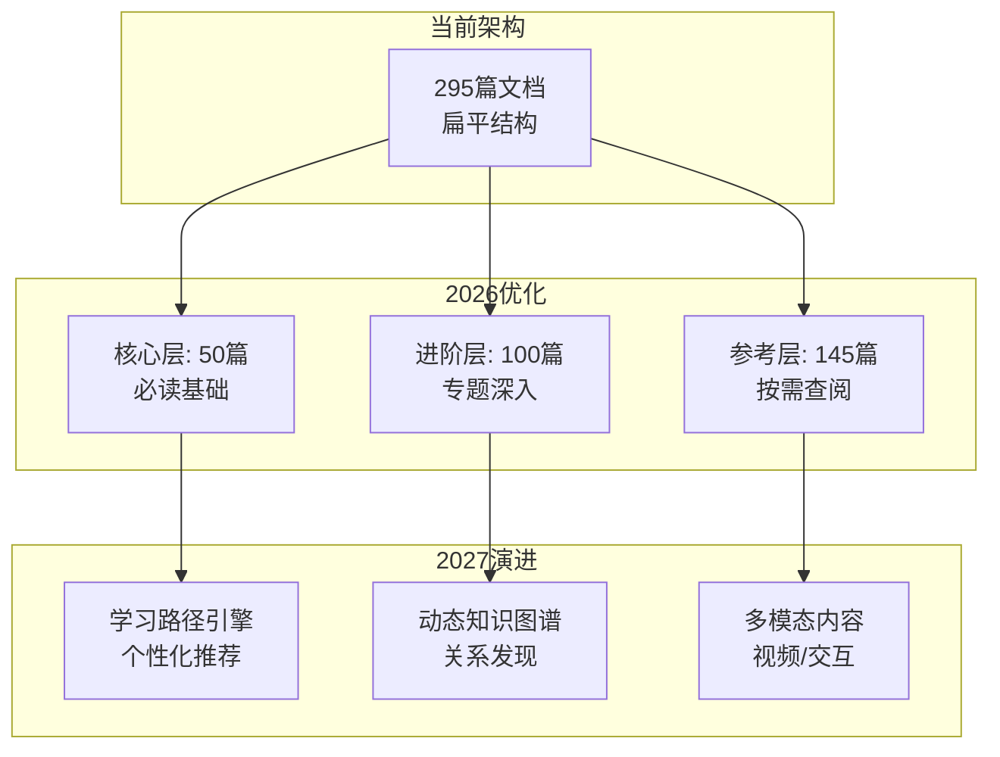

**技术栈升级**:

| 组件 | 当前方案 | 演进方向 | 时间规划 |
|------|----------|----------|----------|
| 静态站点 | GitHub Pages | Next.js/Vercel | 2026 Q4 |
| 搜索 | Lunr.js | Algolia/自建 | 2026 Q3 |
| 图表渲染 | Mermaid Live | 服务端预渲染 | 2027 Q1 |
| 协作编辑 | Git Workflow | 实时协同编辑 | 2027 Q3 |
| 多语言 | 平行文件 | CMS统一管理 | 2027 Q2 |

### 5.3 工具链发展

**自动化工具路线图**:

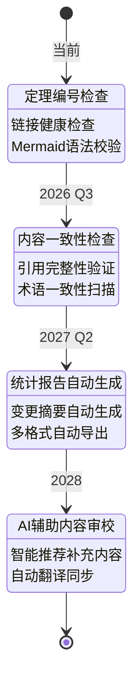

---

## 6. 里程碑与成功标准

### 6.1 关键里程碑

| 里程碑 | 时间 | 核心交付物 | 成功标准 |
|--------|------|------------|----------|
| **v3.1 社区版** | 2026-07 | 社区运营体系、自动化工具链 | 社区贡献者≥20人 |
| **v3.2 优化版** | 2026-10 | 术语表完善、搜索功能上线 | 用户满意度≥4.5/5 |
| **v4.0 国际版** | 2027-04 | 英文核心内容、国际化网站 | 国际访问量占比≥30% |
| **v4.5 交互版** | 2027-08 | Playground、智能问答 | 用户停留时长+50% |
| **v5.0 生态版** | 2028-01 | 工具链生态、教育合作 | 生态工具≥5个 |
| **v5.5 标准版** | 2028-07 | 术语标准、教学大纲 | 高校采用≥10所 |
| **v6.0 智能版** | 2029-01 | AI辅助学习、知识图谱 | 个性化覆盖率100% |

### 6.2 详细交付物清单

#### v3.1 社区版 (2026-07)

| 类别 | 交付物 | 状态目标 |
|------|--------|----------|
| 文档 | CONTRIBUTING.md v2.0 | 合并 |
| 工具 | 定理验证GitHub Actions | 上线 |
| 工具 | 链接监控自动化 | 上线 |
| 社区 | GitHub Discussions运营 | 活跃 |
| 社区 | 技术博客首发 | 发布≥3篇 |

#### v4.0 国际版 (2027-04)

| 类别 | 交付物 | 状态目标 |
|------|--------|----------|
| 内容 | 英文Struct/核心 | 发布 |
| 内容 | 英文README/导航 | 发布 |
| 网站 | 国际化官网 | 上线 |
| 工具 | 多语言切换 | 支持 |
| 社区 | 国际贡献者 | ≥10人 |

#### v5.0 生态版 (2028-01)

| 类别 | 交付物 | 状态目标 |
|------|--------|----------|
| 工具 | ADF-Generator | 发布v1.0 |
| 工具 | ADF-Lint | 发布v1.0 |
| 平台 | 在线Playground | 上线 |
| 合作 | 云厂商认证 | ≥3家 |
| 教育 | 高校课程 | ≥3所试点 |

### 6.3 成功标准定义

#### 定量指标

| 指标类别 | 指标名称 | 当前基线 | v3.1目标 | v4.0目标 | v5.0目标 |
|----------|----------|----------|----------|----------|----------|
| **内容** | 文档数量 | 295 | 310 | 350 | 400 |
| **内容** | 形式化元素 | 964 | 1000 | 1100 | 1200 |
| **社区** | GitHub Stars | TBD | +50% | +200% | +500% |
| **社区** | 月活跃贡献者 | TBD | 5 | 15 | 30 |
| **流量** | 月独立访客 | TBD | +30% | +100% | +300% |
| **流量** | 国际流量占比 | 0% | 5% | 30% | 50% |
| **质量** | 文档准确率 | 98% | 99% | 99.5% | 99.9% |
| **工具** | 自动化覆盖率 | 60% | 80% | 90% | 95% |

#### 定性指标

| 维度 | 评估标准 | 评估方式 |
|------|----------|----------|
| **影响力** | 被主流技术博客引用 | 季度统计 |
| **认可度** | 企业/高校主动联系合作 | 记录跟踪 |
| **实用性** | 用户反馈"解决了实际问题" | 问卷调查 |
| **权威性** | 成为技术选型的必参考资料 | 用户访谈 |
| **易用性** | 新用户能在30分钟内找到所需 | 可用性测试 |

### 6.4 风险与应对

| 风险项 | 可能性 | 影响度 | 应对策略 |
|--------|--------|--------|----------|
| 核心维护者流失 | 中 | 高 | 知识文档化、多人备份 |
| 技术方向变化 | 中 | 中 | 保持灵活性、定期评估 |
| 社区活跃度不足 | 中 | 中 | 激励机制、线下活动 |
| 翻译质量不高 | 低 | 中 | 专业译者+技术审校 |
| 资金不足 | 低 | 高 | 开源基金会申请、企业赞助 |

---

## 7. 资源需求

### 7.1 人力资源

| 角色 | 当前 | v3.1 | v4.0 | v5.0 | 说明 |
|------|------|------|------|------|------|
| 项目维护者 | 2 | 3 | 4 | 5 | 核心架构决策 |
| 技术作者 | 3 | 4 | 6 | 8 | 内容创作与审校 |
| 社区经理 | 0 | 1 | 2 | 2 | 社区运营 |
| 开发者 | 1 | 2 | 4 | 6 | 工具开发 |
| 译者 | 0 | 2 | 4 | 6 | 国际化 |
| 设计师 | 0 | 1 | 2 | 2 | UI/UX设计 |

### 7.2 基础设施

| 资源 | 当前 | v3.1 | v4.0 | v5.0 | 备注 |
|------|------|------|------|------|------|
| 域名/托管 | GitHub Pages | 独立域名 | CDN加速 | 全球节点 | 可用性99.9% |
| 搜索服务 | 无 | Lunr.js | Algolia | 自建 | 毫秒级响应 |
| 数据库 | 无 | 无 | Neo4j | 集群 | 知识图谱存储 |
| 计算资源 | 无 | 无 | 云服务器 | K8s集群 | Playground运行 |
| 存储 | Git LFS | 对象存储 | 对象存储 | 对象存储 | 多媒体内容 |

---

## 8. 可视化汇总

### 8.1 路线图全景图

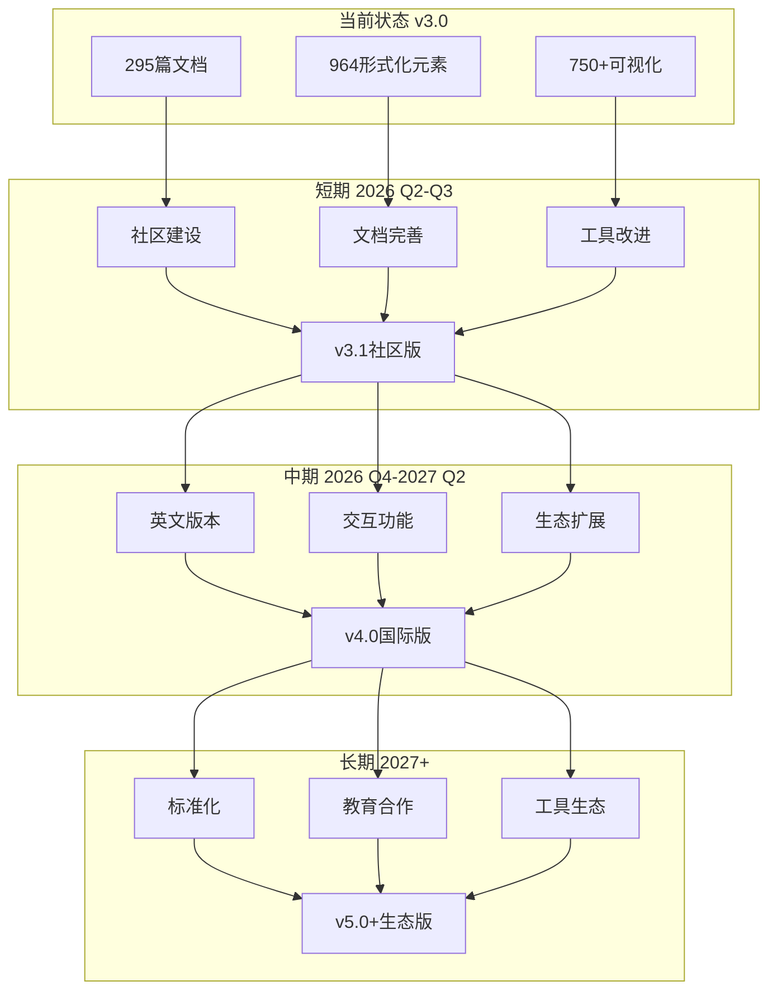

### 8.2 技术演进路线图

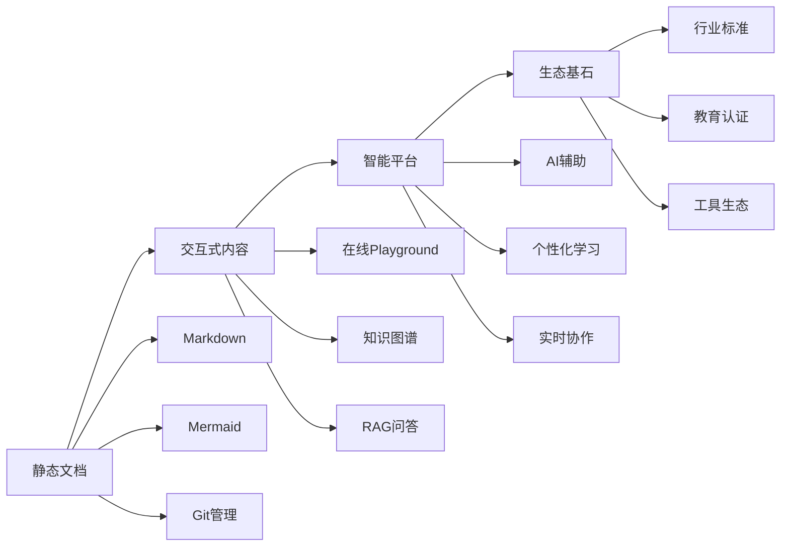

---

## 9. 参考与更新

### 9.1 相关文档

| 文档 | 路径 | 说明 |
|------|------|------|
| 项目状态 | PROJECT-STATUS-FINAL.md | 当前项目状态 |
| 完成报告 | FINAL-COMPLETION-REPORT-v7.0.md | 历史交付记录 |
| 跟踪看板 | PROJECT-TRACKING.md | 任务跟踪 |
| 版本历史 | PROJECT-VERSION-TRACKING.md | 版本变更记录 |
| Agent规范 | AGENTS.md | 贡献规范 |

### 9.2 更新日志

| 版本 | 日期 | 更新内容 | 作者 |
|------|------|----------|------|
| v1.0 | 2026-04-04 | 初始版本创建 | AnalysisDataFlow Team |

### 9.3 审批状态

| 角色 | 姓名 | 审批状态 | 日期 |
|------|------|----------|------|
| 项目负责人 | TBD | 🟡 待审批 | - |
| 技术负责人 | TBD | 🟡 待审批 | - |
| 社区代表 | TBD | 🟡 待审批 | - |

---

> **免责声明**: 本路线图为规划性文档，实际执行可能根据技术演进、资源可用性和社区反馈进行调整。重大变更将通过GitHub Issues和讨论区进行公示。

---

*文档生成时间: 2026-04-04*
*版本: v1.0*
*维护者: AnalysisDataFlow Core Team*
