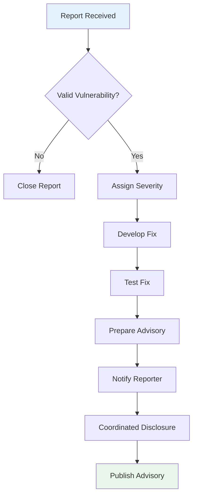

# Security Policy

> **Version**: v1.0 | **Effective Date**: 2026-04-10 | **Status**: Active

---

## Table of Contents

- [Security Policy](#security-policy)
  - [Table of Contents](#table-of-contents)
  - [1. Security Policy Overview](#1-security-policy-overview)
  - [2. Supported Versions](#2-supported-versions)
  - [3. Reporting a Vulnerability](#3-reporting-a-vulnerability)
    - [3.1 Reporting Process](#31-reporting-process)
    - [3.2 What to Include](#32-what-to-include)
    - [3.3 Response Timeline](#33-response-timeline)
  - [4. Security Best Practices](#4-security-best-practices)
    - [4.1 For Contributors](#41-for-contributors)
      - [Code Examples](#code-examples)
      - [Documentation Links](#documentation-links)
      - [Build Scripts and CI/CD](#build-scripts-and-cicd)
    - [4.2 For Users](#42-for-users)
      - [Example Code](#example-code)
      - [Configuration Files](#configuration-files)
  - [5. Vulnerability Disclosure Policy](#5-vulnerability-disclosure-policy)
    - [5.1 Disclosure Principles](#51-disclosure-principles)
    - [5.2 Disclosure Process](#52-disclosure-process)
    - [5.3 Security Advisories](#53-security-advisories)
  - [6. Security-Related Configuration](#6-security-related-configuration)
    - [6.1 Repository Security Settings](#61-repository-security-settings)
    - [6.2 Security-Related Workflows](#62-security-related-workflows)
    - [6.3 Trusted Tools and Dependencies](#63-trusted-tools-and-dependencies)
  - [7. Acknowledgments](#7-acknowledgments)
  - [Contact](#contact)
  - [Policy Updates](#policy-updates)

---

## 1. Security Policy Overview

AnalysisDataFlow is a documentation knowledge base project focused on stream computing theory and practice. While the project primarily consists of documentation (Markdown files), diagrams, and example code, we take security seriously to ensure:

- The integrity and authenticity of our documentation
- The safety of example code provided to users
- The protection of our infrastructure and build systems
- The privacy of our contributors and users

This document outlines our security policies, vulnerability reporting procedures, and best practices for contributing and using the project.

---

## 2. Supported Versions

Since AnalysisDataFlow is a documentation project rather than software with traditional version releases, our security policy applies to:

| Component | Security Support Status | Notes |
|-----------|------------------------|-------|
| **Main Documentation** | ✅ Supported | All content in `main` branch |
| **Example Code** | ✅ Supported | All code examples in `examples/` |
| **Build Scripts** | ✅ Supported | Scripts in `.scripts/` and `.github/workflows/` |
| **Archived Content** | ⚠️ Limited | Content in `archive/` directory |
| **External Dependencies** | ⚠️ Reviewed | Third-party GitHub Actions and tools |

**Note**: We regularly review and update dependencies used in our CI/CD pipelines and build scripts to address known security vulnerabilities.

---

## 3. Reporting a Vulnerability

We appreciate the efforts of security researchers and community members who help us maintain the security of our project.

### 3.1 Reporting Process

If you discover a security vulnerability, please report it to us privately rather than opening a public issue.

**Reporting Channels** (in order of preference):

| Method | Contact | Response Time |
|--------|---------|---------------|
| **Primary** | 📧 <security@analysisdataflow.org> | Within 48 hours |
| **Secondary** | 🔒 GitHub Security Advisory | Within 72 hours |
| **Alternative** | 🐛 Private GitHub Issue (mark as sensitive) | Within 72 hours |

**GitHub Security Advisory Process**:

1. Go to the repository's Security tab
2. Click "Advisories" → "New draft security advisory"
3. Fill in the vulnerability details
4. Submit for maintainer review

### 3.2 What to Include

A good vulnerability report should include:

```markdown
## Summary
Brief description of the vulnerability

## Affected Component
- File path or system component
- Version/branch (if applicable)

## Severity Assessment
- Critical / High / Medium / Low
- Justification for rating

## Steps to Reproduce
1. Step one
2. Step two
3. ...

## Impact
Description of potential security impact

## Suggested Fix (Optional)
Your recommendations for addressing the issue

## Additional Context
Any other relevant information
```

### 3.3 Response Timeline

Our commitment to security researchers:

| Phase | Timeframe | Action |
|-------|-----------|--------|
| **Acknowledgment** | Within 48 hours | Confirm receipt of report |
| **Initial Assessment** | Within 7 days | Triage and assign severity |
| **Fix Development** | Depends on severity | Develop and test fix |
| **Disclosure** | Coordinated with reporter | Public disclosure with credit |

**Severity-Based Timelines**:

| Severity | Fix Target | Disclosure |
|----------|------------|------------|
| Critical | 7 days | After fix deployment |
| High | 14 days | After fix deployment |
| Medium | 30 days | After fix deployment |
| Low | 90 days | Coordinated with reporter |

---

## 4. Security Best Practices

### 4.1 For Contributors

When contributing to the project, please follow these security guidelines:

#### Code Examples

- **Never include secrets**: No API keys, passwords, tokens, or private credentials
- **Sanitize data**: Use dummy/fake data in examples
- **Safe defaults**: Configuration examples should use secure default settings
- **Version pinning**: Specify specific versions for dependencies

**Example - Safe Configuration**:

```yaml
# ✅ GOOD - No secrets, safe defaults
kafka:
  bootstrap.servers: "localhost:9092"
  security.protocol: "SASL_SSL"
  sasl.mechanism: "PLAIN"
  # Credentials should be provided via environment variables
  sasl.jaas.config: ${KAFKA_JAAS_CONFIG}
```

```yaml
# ❌ BAD - Hardcoded credentials
kafka:
  bootstrap.servers: "localhost:9092"
  sasl.jaas.config: "org.apache.kafka.common.security.plain.PlainLoginModule required username='admin' password='secret123';"
```

#### Documentation Links

- Verify all external links are to legitimate sources
- Prefer HTTPS over HTTP
- Use official documentation domains
- Check for potential typosquatting in URLs

#### Build Scripts and CI/CD

- Pin GitHub Actions to specific commit SHAs or versions
- Use least-privilege permissions for workflows
- Validate inputs in scripts
- Avoid executing untrusted code

**Example - Secure Workflow**:

```yaml
# ✅ GOOD - Pinned versions, minimal permissions
name: Secure CI

permissions:
  contents: read

jobs:
  build:
    runs-on: ubuntu-latest
    steps:
      - uses: actions/checkout@11bd71901bbe5b1630ceea73d27597364c9af683  # v4.2.2
      - uses: actions/setup-node@39370e3970a6d050c480ffad4ff0ed4d3fdee5af  # v4.1.0
        with:
          node-version: '20'
```

### 4.2 For Users

When using materials from this project:

#### Example Code

- **Review before running**: Always review code before execution
- **Use test environments**: Test in isolated environments first
- **Check dependencies**: Verify the sources of any dependencies
- **Update regularly**: Keep dependencies up to date

#### Configuration Files

- **Replace placeholders**: Ensure all placeholder values are replaced
- **Use secrets management**: Store credentials in proper secrets management systems
- **Enable security features**: Use encryption, authentication, and authorization where available

---

## 5. Vulnerability Disclosure Policy

We follow a coordinated disclosure policy:

### 5.1 Disclosure Principles

1. **Private Disclosure**: Vulnerabilities are initially handled privately
2. **Fix First**: Public disclosure after a fix is available
3. **Researcher Credit**: Acknowledge the reporter (with permission)
4. **Transparency**: Publish security advisories for significant issues

### 5.2 Disclosure Process



### 5.3 Security Advisories

Security advisories will be published in:

- GitHub Security Advisories (official)
- CHANGELOG.md (notable security updates)
- Project mailing list (if applicable)

---

## 6. Security-Related Configuration

### 6.1 Repository Security Settings

Our repository has the following security features enabled:

| Feature | Status | Description |
|---------|--------|-------------|
| **Branch Protection** | ✅ Enabled | Requires PR reviews, status checks |
| **Dependency Scanning** | ✅ Enabled | Automated vulnerability scanning |
| **Secret Scanning** | ✅ Enabled | Detects accidentally committed secrets |
| **CodeQL Analysis** | ✅ Enabled | Static security analysis |

### 6.2 Security-Related Workflows

| Workflow | Purpose | Location |
|----------|---------|----------|
| **pr-quality-gate.yml** | Validates PR content and structure | `.github/workflows/` |
| **scheduled-maintenance.yml** | Regular security audits | `.github/workflows/` |
| **link-checker.yml** | Validates external links | `.github/workflows/` |

### 6.3 Trusted Tools and Dependencies

We use the following tools for security:

| Tool | Purpose | Source |
|------|---------|--------|
| **markdownlint** | Markdown linting | npm |
| **markdown-link-check** | Link validation | npm |
| **GitHub Advanced Security** | Vulnerability scanning | GitHub |

---

## 7. Acknowledgments

We thank the following security researchers and contributors who have helped improve the security of our project:

| Date | Researcher | Contribution |
|------|------------|--------------|
| - | - | No reported vulnerabilities to date |

**Hall of Fame**: Security researchers who have responsibly disclosed vulnerabilities will be listed here with their permission.

---

## Contact

For security-related inquiries:

- 📧 **Email**: <security@analysisdataflow.org>
- 🔒 **GitHub**: Use the Security tab to report advisories
- 🐛 **Issues**: For non-sensitive issues, use regular GitHub Issues

---

## Policy Updates

This security policy may be updated from time to time. Changes will be announced through:

- Updates to this document (with revision date)
- GitHub Discussions announcements (for significant changes)
- CHANGELOG.md entries (for security-related updates)

---

*Last Updated: 2026-04-10 | Version: v1.0*
