# Struct/ 形式理论文档索引

> **文档定位**: Struct 目录导航索引 | **形式化等级**: L1-L6 全覆盖 | **版本**: 2026.04

---

## 目录

- [Struct/ 形式理论文档索引](#struct-形式理论文档索引)
  - [目录](#目录)
  - [简介](#简介)
  - [形式化等级说明](#形式化等级说明)
  - [01-foundation/ 基础理论 (8篇)](#01-foundation-基础理论-8篇)
  - [02-properties/ 属性推导 (8篇)](#02-properties-属性推导-8篇)
  - [03-relationships/ 关系建立 (5篇)](#03-relationships-关系建立-5篇)
  - [04-proofs/ 形式证明 (7篇)](#04-proofs-形式证明-7篇)
  - [05-comparative-analysis/ 对比分析 (3篇)](#05-comparative-analysis-对比分析-3篇)
  - [06-frontier/ 前沿研究 (5篇)](#06-frontier-前沿研究-5篇)
  - [07-tools/ 工具实践 (5篇)](#07-tools-工具实践-5篇)
  - [08-standards/ 标准规范 (1篇)](#08-standards-标准规范-1篇)
  - [跨目录依赖图](#跨目录依赖图)
  - [导航链接](#导航链接)

---

## 简介

**Struct/** 目录包含流计算领域最严格的形式化理论文档，遵循六段式模板规范（概念定义→属性推导→关系建立→论证过程→形式证明→实例验证→可视化→引用参考）。本文档索引为整个形式理论体系提供结构化导航。

**统计概览**:

- 总计: 43 篇形式化文档
- 定理: 24 个 | 定义: 60 个 | 引理/命题: 80+
- 覆盖: 进程演算、Actor模型、Dataflow、类型理论、验证方法

---

## 形式化等级说明

| 等级 | 名称 | 描述 | 复杂度 |
|------|------|------|--------|
| L1 | 概念描述 | 非形式化/半形式化描述 | 低 |
| L2 | 结构化定义 | 明确的数学定义与符号 | 低-中 |
| L3 | 操作语义 | 结构化操作语义(SOS) | 中 |
| L4 | 指称语义 | 域论/代数语义 | 中-高 |
| L5 | 形式证明 | 定理-证明结构 | 高 |
| L6 | 机械化验证 | Coq/TLA+/Iris验证 | 极高 |

---

## 01-foundation/ 基础理论 (8篇)

奠定流计算形式理论的元模型与核心概念基础。

| 文档 | 描述 | 等级 |
|------|------|------|
| [01.01-unified-streaming-theory.md](./01-foundation/01.01-unified-streaming-theory.md) | **统一流计算元模型(USTM)** — 整合Actor、CSP、Dataflow、Petri网四大范式的形式化元理论，建立六层表达能力层次结构 | L6 |
| [01.02-process-calculus-primer.md](./01-foundation/01.02-process-calculus-primer.md) | **进程演算基础** — CCS、CSP、π-演算、会话类型的语法与操作语义，建立动态/静态通道模型的表达能力差异 | L3-L4 |
| [01.03-actor-model-formalization.md](./01-foundation/01.03-actor-model-formalization.md) | **Actor模型形式化** — Actor、Behavior、Mailbox、ActorRef、监督树的核心定义与串行处理引理 | L4-L5 |
| [01.04-dataflow-model-formalization.md](./01-foundation/01.04-dataflow-model-formalization.md) | **Dataflow模型形式化** — Dataflow图、算子语义、流作为偏序多重集、事件时间/处理时间/Watermark、窗口形式化 | L5 |
| [01.05-csp-formalization.md](./01-foundation/01.05-csp-formalization.md) | **CSP形式化** — CSP核心语法、结构化操作语义、迹/失败/发散语义、通道与同步原语 | L3 |
| [01.06-petri-net-formalization.md](./01-foundation/01.06-petri-net-formalization.md) | **Petri网形式化** — P/T网、变迁触发规则、可达性分析、着色Petri网(CPN)、时间Petri网(TPN)层次结构 | L2-L4 |
| [01.07-session-types.md](./01-foundation/01.07-session-types.md) | **会话类型** — 二元/多参会话类型语法、双寡规则、会话与进程的编码关系 | L4-L5 |
| [stream-processing-semantics-formalization.md](./01-foundation/stream-processing-semantics-formalization.md) | **流处理语义学形式化** — 流作为无限序列的形式化定义、时间模型、语义映射 | L5-L6 |

---

## 02-properties/ 属性推导 (8篇)

从基础定义推导出的系统性质、不变式与定理。

| 文档 | 描述 | 等级 |
|------|------|------|
| [02.01-determinism-in-streaming.md](./02-properties/02.01-determinism-in-streaming.md) | **流计算确定性定理** — 确定性流处理系统定义、汇合归约、可观测确定性、纯函数算子局部确定性引理 | L5 |
| [02.02-consistency-hierarchy.md](./02-properties/02.02-consistency-hierarchy.md) | **一致性层级** — At-Most-Once/At-Least-Once/Exactly-Once语义、端到端/内部一致性、强/因果/最终一致性层次 | L5 |
| [02.03-watermark-monotonicity.md](./02-properties/02.03-watermark-monotonicity.md) | **Watermark单调性定理** — 事件时间定义、Watermark格结构、最小值保持单调性引理、迟到数据处理 | L5 |
| [02.04-liveness-and-safety.md](./02-properties/02.04-liveness-and-safety.md) | **活性与安全性形式化** — 迹与性质的数学基础、Alpern-Schneider分解定理、公平性假设层次、LTL/CTL复杂度(PSPACE-完全) | L4-L5 |
| [02.05-type-safety-derivation.md](./02-properties/02.05-type-safety-derivation.md) | **类型安全性推导** — Featherweight Go(FG)、Featherweight Generic Go(FGG)、DOT演算的类型系统与安全性条件 | L5 |
| [02.06-calm-theorem.md](./02-properties/02.06-calm-theorem.md) | **CALM定理** — 一致性即逻辑单调性(Consistency As Logical Monotonicity)、分布式问题的单调性判定 | L5 |
| [02.07-encrypted-stream-processing.md](./02-properties/02.07-encrypted-stream-processing.md) | **加密流处理** — 同态加密(HE)形式化定义、部分/全同态加密分类、安全计算在流处理中的应用 | L5 |
| [02.08-differential-privacy-streaming.md](./02-properties/02.08-differential-privacy-streaming.md) | **差分隐私流处理** — (ε,δ)-差分隐私定义、隐私预算管理、流式噪声注入机制 | L5 |

---

## 03-relationships/ 关系建立 (5篇)

不同模型、系统、语言之间的形式化关系与编码理论。

| 文档 | 描述 | 等级 |
|------|------|------|
| [03.01-actor-to-csp-encoding.md](./03-relationships/03.01-actor-to-csp-encoding.md) | **Actor到CSP编码** — Actor→CSP编码函数`[[·]]_A→C`、Mailbox的Buffer进程编码、动态地址传递的不可编码性证明 | L4-L5 |
| [03.02-flink-to-process-calculus.md](./03-relationships/03.02-flink-to-process-calculus.md) | **Flink到进程演算编码** — Flink算子到π-演算进程、数据流边到通道、Checkpoint到屏障同步协议的编码 | L5 |
| [03.03-expressiveness-hierarchy.md](./03-relationships/03.03-expressiveness-hierarchy.md) | **表达能力层次定理** — 表达能力预序、六层层次(L1-L6)严格性证明、可判定性单调递减律 | L3-L6 |
| [03.04-bisimulation-equivalences.md](./03-relationships/03.04-bisimulation-equivalences.md) | **互模拟等价关系** — 强/弱/分支互模拟、互模拟游戏、同余关系、互模拟与迹等价的关系 | L3-L4 |
| [03.05-cross-model-mappings.md](./03-relationships/03.05-cross-model-mappings.md) | **跨模型统一映射框架** — 四层统一映射框架、层间Galois连接、跨层组合映射、语义保持性与精化关系 | L5-L6 |

---

## 04-proofs/ 形式证明 (7篇)

核心定理的完整形式化证明，包含严格的数学推导。

| 文档 | 描述 | 等级 |
|------|------|------|
| [04.01-flink-checkpoint-correctness.md](./04-proofs/04.01-flink-checkpoint-correctness.md) | **Flink Checkpoint正确性证明** — Barrier传播不变式、状态一致性引理、对齐点唯一性、无孤儿消息保证 | L5 |
| [04.02-flink-exactly-once-correctness.md](./04-proofs/04.02-flink-exactly-once-correctness.md) | **Flink Exactly-Once正确性证明** — 端到端一致性定义、2PC协议形式化、可重放Source与幂等性条件 | L5 |
| [04.03-chandy-lamport-consistency.md](./04-proofs/04.03-chandy-lamport-consistency.md) | **Chandy-Lamport快照一致性证明** — 全局状态定义、一致割集(Consistent Cut)引理、Marker传播不变式 | L5 |
| [04.04-watermark-algebra-formal-proof.md](./04-proofs/04.04-watermark-algebra-formal-proof.md) | **Watermark代数形式证明** — Watermark格元素、合并算子⊔的结合/交换/幂等律证明、完全格结构 | L5 |
| [04.05-type-safety-fg-fgg.md](./04-proofs/04.05-type-safety-fg-fgg.md) | **FG/FGG类型安全证明** — Featherweight Go与Generic Go的抽象语法、类型替换、方法解析、进展与保持定理 | L5-L6 |
| [04.06-dot-subtyping-completeness.md](./04-proofs/04.06-dot-subtyping-completeness.md) | **DOT子类型完备性证明** — 路径与路径类型、名义/结构类型、递归类型展开、子类型判定算法完备性 | L5-L6 |
| [04.07-deadlock-freedom-choreographic.md](./04-proofs/04.07-deadlock-freedom-choreographic.md) | **Choreographic死锁自由证明** — Choreographic Programming核心概念、全局类型、端点投影(EPP)、死锁自由保证 | L5 |

---

## 05-comparative-analysis/ 对比分析 (3篇)

不同语言、模型、方法之间的系统性对比研究。

| 文档 | 描述 | 等级 |
|------|------|------|
| [05.01-go-vs-scala-expressiveness.md](./05-comparative-analysis/05.01-go-vs-scala-expressiveness.md) | **Go vs Scala表达能力对比** — 类型系统层次、并发原语抽象层次、元编程能力差异、图灵完备性等价证明 | L4-L5 |
| [05.02-expressiveness-vs-decidability.md](./05-comparative-analysis/05.02-expressiveness-vs-decidability.md) | **表达能力与可判定性权衡** — 可判定性集合、Rice定理框架、停机问题归约、六层模型的权衡分析 | L5 |
| [05.03-encoding-completeness-analysis.md](./05-comparative-analysis/05.03-encoding-completeness-analysis.md) | **编码完备性分析** — 编码判据体系、满抽象(Full Abstraction)、完备性度量、忠实编码(Faithful Encoding) | L4-L5 |

---

## 06-frontier/ 前沿研究 (5篇)

流计算形式理论的最新研究方向与开放问题。

| 文档 | 描述 | 等级 |
|------|------|------|
| [06.01-open-problems-streaming-verification.md](./06-frontier/06.01-open-problems-streaming-verification.md) | **流计算验证开放问题** — 验证问题谱系、可判定性边界、实用验证挑战、开放问题分类(L4-L6) | L4-L6 |
| [06.02-choreographic-streaming-programming.md](./06-frontier/06.02-choreographic-streaming-programming.md) | **Choreographic流编程前沿** — Choreographic Programming核心概念、多参与方会话类型(MPST)、全局类型投影、Choreographic Dataflow图 | L5 |
| [06.03-ai-agent-session-types.md](./06-frontier/06.03-ai-agent-session-types.md) | **AI Agent与会话类型** — AI Agent形式化模型、Multi-Agent会话类型(MAST)、LLM-Agent交互协议、认知会话类型 | L5 |
| [06.04-pdot-path-dependent-types.md](./06-frontier/06.04-pdot-path-dependent-types.md) | **pDOT完全路径依赖类型** — DOT演算扩展、任意长度路径依赖类型、Singleton类型、精确对象类型 | L5-L6 |
| [first-person-choreographies.md](./06-frontier/first-person-choreographies.md) | **First-Person Choreographic Programming(1CP)** — 第一人称Choreographic语言、动态进程创建、会话上下文管理 | L5 |

---

## 07-tools/ 工具实践 (5篇)

形式化验证工具与机械化证明实践。

| 文档 | 描述 | 等级 |
|------|------|------|
| [coq-mechanization.md](./07-tools/coq-mechanization.md) | **Coq机械化证明** — 归纳类型定义、流计算性质的Coq形式化、证明自动化策略 | L5-L6 |
| [iris-separation-logic.md](./07-tools/iris-separation-logic.md) | **Iris高阶并发分离逻辑** — 分离逻辑基础、高阶幽灵状态、原子性抬升、Flink并发性质的Iris证明 | L6 |
| [model-checking-practice.md](./07-tools/model-checking-practice.md) | **模型检查实践** — LTL/CTL时序逻辑、SPIN/NuSMV应用、流计算系统的模型检查方法 | L4 |
| [smart-casual-verification.md](./07-tools/smart-casual-verification.md) | **Smart Casual Verification** — 系统化形式化规范(TLA+)+自动化测试的混合验证方法、Microsoft CCF实践案例 | L4-L5 |
| [tla-for-flink.md](./07-tools/tla-for-flink.md) | **TLA+形式化验证Flink** — TLA+规格语言、PlusCal算法、Flink Checkpoint/Exactly-Once的TLA+规格与验证 | L5 |

---

## 08-standards/ 标准规范 (1篇)

流计算相关工业标准的形式化描述。

| 文档 | 描述 | 等级 |
|------|------|------|
| [streaming-sql-standard.md](./08-standards/streaming-sql-standard.md) | **流式SQL标准** — SQL:2011/2023流扩展、窗口函数形式化、时间周期支持、连续查询语义 | L4 |

---

## 09-unified/ 统一图谱 (1篇)

全项目统一关系图谱与跨模型整合。

| 文档 | 描述 | 等级 |
|------|------|------|
| [Unified-Model-Relationship-Graph.md](./Unified-Model-Relationship-Graph.md) | **统一模型关系图谱** — 全项目计算模型的统一关系图谱，包括表达力层级、编码关系、等价关系、决策矩阵 | L4-L5 |

---

## 跨目录依赖图

```mermaid
graph TB
    subgraph Foundation["01-foundation 基础理论"]
        UST[01.01 统一流理论]
        PC[01.02 进程演算]
        ACT[01.03 Actor模型]
        DF[01.04 Dataflow模型]
        CSP[01.05 CSP形式化]
        PETRI[01.06 Petri网]
        ST[01.07 会话类型]
    end

    subgraph Properties["02-properties 属性推导"]
        DET[02.01 确定性]
        CONS[02.02 一致性层级]
        WM[02.03 Watermark单调性]
        LS[02.04 活性与安全性]
        TS[02.05 类型安全]
        CALM[02.06 CALM定理]
        ENC[02.07 加密流处理]
        DP[02.08 差分隐私]
    end

    subgraph Relations["03-relationships 关系建立"]
        A2C[03.01 Actor→CSP]
        F2P[03.02 Flink→进程演算]
        EH[03.03 表达能力层次]
        BIS[03.04 互模拟]
        CMM[03.05 跨模型映射]
    end

    subgraph Proofs["04-proofs 形式证明"]
        FCP[04.01 Flink Checkpoint]
        FEO[04.02 Flink Exactly-Once]
        CL[04.03 Chandy-Lamport]
        WA[04.04 Watermark代数]
        FG[04.05 FG/FGG类型安全]
        DOT[04.06 DOT子类型]
        DLF[04.07 死锁自由]
    end

    UST --> EH
    PC --> A2C
    PC --> F2P
    PC --> BIS
    ACT --> A2C
    DF --> F2P
    DF --> DET
    DF --> CONS
    DF --> WM
    CSP --> A2C
    ST --> DLF

    DET --> FCP
    CONS --> FEO
    CONS --> CL
    WM --> WA
    TS --> FG
    TS --> DOT

    EH --> CMM
    BIS --> DLF
    F2P --> FCP
```

---

## 导航链接

**根目录索引**:

- [📁 项目根目录](../README.md) — 项目总览与快速开始
- [📋 AGENTS.md](../AGENTS.md) — Agent工作上下文规范
- [🗺️ NAVIGATION-INDEX.md](../NAVIGATION-INDEX.md) — 全局导航索引

**其他核心索引**:

- [📚 Knowledge/索引](../Knowledge/00-INDEX.md) — 知识结构文档导航
- [⚡ Flink/索引](Struct/00-INDEX.md) — Flink专项文档导航
- [📖 THEOREM-REGISTRY.md](../THEOREM-REGISTRY.md) — 全库定理注册表

**学习路径**:

- [🎓 LEARNING-PATH-GUIDE.md](../LEARNING-PATH-GUIDE.md) — 学习路径指南
- [🧮 GLOSSARY.md](../GLOSSARY.md) — 术语表

---

> **文档规范**: 本文档遵循 [AGENTS.md](../AGENTS.md) 中的六段式模板规范
> **定理编号**: 采用 `{类型}-{阶段}-{文档序号}-{顺序号}` 格式 (如 `Thm-S-01-01`)
> **更新日期**: 2026-04-05
