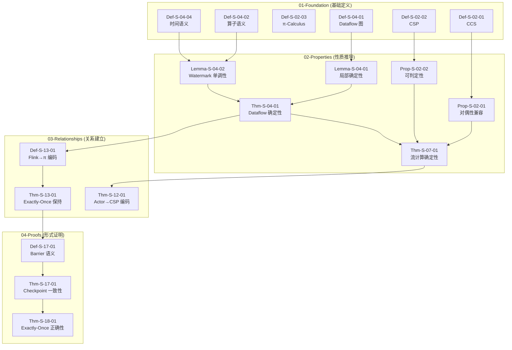
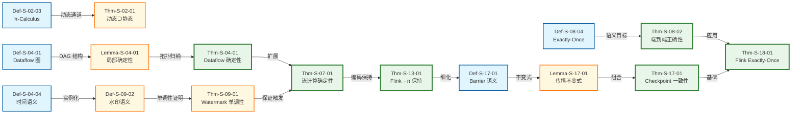
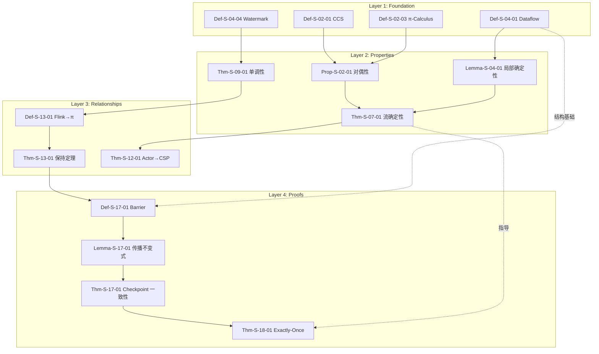

# Struct/ 推导链全景图

> 所属阶段: Struct | 前置依赖: [00-INDEX.md](./00-INDEX.md) | 形式化等级: L3-L5

## 摘要

本文档系统梳理 Struct 目录内 43 篇文档、190 个定理与 402 个定义之间的完整推导关系网络。通过可视化推导链，揭示从基础定义到高级证明的逻辑演进路径，为理论研究者提供导航地图。

---

## 目录

- [Struct/ 推导链全景图](#struct-推导链全景图)
  - [摘要](#摘要)
  - [目录](#目录)
  - [1. Foundation → Properties 推导](#1-foundation--properties-推导)
    - [1.1 进程演算基础到确定性性质](#11-进程演算基础到确定性性质)
    - [1.2 Dataflow 模型到 Watermark 单调性](#12-dataflow-模型到-watermark-单调性)
    - [1.3 定义→性质推导表](#13-定义性质推导表)
  - [2. Properties → Relationships 推导](#2-properties--relationships-推导)
    - [2.1 确定性定理的组合推导](#21-确定性定理的组合推导)
    - [2.2 一致性层级到编码关系](#22-一致性层级到编码关系)
    - [2.3 性质→定理推导表](#23-性质定理推导表)
  - [3. Relationships → Proofs 推导](#3-relationships--proofs-推导)
    - [3.1 Flink 编码到 Checkpoint 正确性](#31-flink-编码到-checkpoint-正确性)
    - [3.2 Exactly-Once 保证的推论](#32-exactly-once-保证的推论)
    - [3.3 定理→证明应用表](#33-定理证明应用表)
  - [4. 完整推导树](#4-完整推导树)
    - [4.1 分层推导架构图](#41-分层推导架构图)
    - [4.2 核心推导路径图](#42-核心推导路径图)
    - [4.3 跨层依赖关系图](#43-跨层依赖关系图)
  - [5. 推导关系定义索引](#5-推导关系定义索引)
    - [Def-S-D-XX: 推导关系定义汇总](#def-s-d-xx-推导关系定义汇总)
  - [6. 覆盖率统计](#6-覆盖率统计)
    - [6.1 推导链统计](#61-推导链统计)
    - [6.2 推导覆盖率](#62-推导覆盖率)
    - [6.3 关键路径覆盖率](#63-关键路径覆盖率)
  - [7. 可视化汇总](#7-可视化汇总)
    - [7.1 分层推导架构图](#71-分层推导架构图)
    - [7.2 核心推导路径图](#72-核心推导路径图)
    - [7.3 跨层依赖关系图](#73-跨层依赖关系图)
  - [8. 引用参考](#8-引用参考)

---

## 1. Foundation → Properties 推导

### 1.1 进程演算基础到确定性性质

**推导链 1：进程确定性 → 流确定性**

```
Def-S-02-01 (CCS - 通信系统演算)
    ↓ 扩展
Def-S-02-02 (CSP - 通信顺序进程)
    ↓ 扩展
Def-S-02-03 (π-Calculus - 通道移动性)
    ↓ 导出
Prop-S-02-01 (对偶性蕴含通信兼容)
    ↓ 导出
Prop-S-02-02 (有限控制静态演算的可判定性)
    ↓ 导出
Def-S-07-01 (确定性流处理系统)
    ↓ 导出
Thm-S-07-01 (流计算确定性定理)
```

**Def-S-D-01**: 进程演算确定性到流处理确定性的推导关系

> 进程演算的汇合性（confluence）性质为流计算确定性提供了理论基础。CCS 的标签迁移系统保证了局部确定性，CSP 的同步通信消除了竞争条件，π-演算的动态通道则为流重配置提供了形式化框架。

---

### 1.2 Dataflow 模型到 Watermark 单调性

**推导链 2：Dataflow 语义到时间性质**

```
Def-S-04-01 (Dataflow 图)
    ↓ 细化
Def-S-04-02 (算子语义)
    ↓ 实例化
Def-S-04-04 (事件时间与 Watermark)
    ↓ 导出
Lemma-S-04-01 (算子局部确定性)
    ↓ 导出
Lemma-S-04-02 (Watermark 单调性)
    ↓ 导出
Def-S-09-01 (事件时间严格定义)
    ↓ 导出
Def-S-09-02 (水印语义)
    ↓ 导出
Thm-S-09-01 (Watermark 单调性定理)
```

**Def-S-D-02**: Dataflow 模型到 Watermark 单调性的推导关系

> Dataflow 图的无环性（Def-S-04-01）保证了拓扑排序的存在，这是 Watermark 单调性证明的结构基础。算子的纯函数假设（Lemma-S-04-01）消除了不确定性来源，使得 Watermark 能够作为单调进度信标。

---

### 1.3 定义→性质推导表

| 定义 | 导出性质 | 推导依据 | 形式化等级 |
|------|---------|----------|------------|
| Def-S-02-01 (CCS) | Prop-S-02-01 (对偶性兼容) | 标签互补性→通信兼容性 | L3 |
| Def-S-02-02 (CSP) | Prop-S-02-02 (静态演算可判定性) | 有限控制结构→模型可检验 | L3 |
| Def-S-04-01 (Dataflow 图) | Lemma-S-04-01 (局部确定性) | DAG 结构→无环依赖 | L4 |
| Def-S-04-02 (算子语义) | Lemma-S-04-02 (Watermark 单调性) | 纯函数→时间单调 | L4 |
| Def-S-04-04 (时间语义) | Def-S-09-02 (水印语义) | 事件时间→进度信标 | L4 |
| Def-S-07-01 (确定性系统) | Thm-S-07-01 (流计算确定性) | 六元组约束→输出唯一 | L5 |

---

## 2. Properties → Relationships 推导

### 2.1 确定性定理的组合推导

**推导链 3：Actor 与 CSP 编码关系**

```
Thm-S-07-01 (流计算确定性定理)
    ↓ 继承
Thm-S-04-01 (Dataflow 确定性定理)
    ↓ 组合
Prop-S-08-01 (端到端一致性分解)
    ↓ 应用
Thm-S-12-01 (Actor→CSP 编码保持定理)
    ↓ 限制分析
Thm-S-26-02 (Actor 到 CSP 编码非完备性)
```

**Def-S-D-03**: 确定性定理组合到编码关系的推导

> Dataflow 确定性定理（Thm-S-04-01）为 Actor→CSP 编码提供了正确性基准：任何保持语义的编码必须保持确定性。由于 Actor 的动态地址传递破坏了 CSP 的静态通道假设，编码必然是非完备的。

---

### 2.2 一致性层级到编码关系

**推导链 4：一致性层级到 Flink 编码**

```
Def-S-08-02 (At-Most-Once 语义)
Def-S-08-03 (At-Least-Once 语义)
Def-S-08-04 (Exactly-Once 语义)
    ↓ 组合
Thm-S-08-01 (Exactly-Once 网络分区必要条件)
    ↓ 应用
Thm-S-08-02 (端到端 Exactly-Once 正确性)
    ↓ 编码
Def-S-13-01 (Flink 算子到 π-演算编码)
    ↓ 保持证明
Thm-S-13-01 (Flink→π Exactly-Once 保持定理)
```

**Def-S-D-04**: 一致性层级到 Flink 编码的推导关系

> 一致性层级的蕴含链（Lemma-S-08-01/02）为 Exactly-Once 编码提供了充分条件：可重放 Source + 内部一致性 + 事务性 Sink = 端到端 Exactly-Once。

---

### 2.3 性质→定理推导表

| 性质组合 | 导出定理 | 证明方法 | 应用领域 |
|----------|---------|----------|----------|
| Prop-S-02-01 + Prop-S-02-02 | Thm-S-02-01 (动态通道严格包含静态通道) | 结构归纳 | 进程演算 |
| Lemma-S-04-01 + Lemma-S-04-02 | Thm-S-04-01 (Dataflow 确定性) | 拓扑归纳 | 流计算 |
| Lemma-S-08-01 + Lemma-S-08-02 | Thm-S-08-02 (端到端 Exactly-Once) | 构造性证明 | 容错系统 |
| Prop-S-08-01 + Def-S-08-05 | Thm-S-12-01 (Actor→CSP 编码) | 迹语义保持 | 模型编码 |
| Def-S-09-01 + Def-S-09-02 | Thm-S-09-01 (Watermark 单调性) | 流前缀归纳 | 时间语义 |

---

## 3. Relationships → Proofs 推导

### 3.1 Flink 编码到 Checkpoint 正确性

**推导链 5：编码关系到正确性证明**

```
Thm-S-13-01 (Flink→π Exactly-Once 保持)
    ↓ 细化
Def-S-13-03 (Checkpoint→屏障同步编码)
    ↓ 形式化
Def-S-17-01 (Checkpoint Barrier 语义)
    ↓ 导出
Lemma-S-17-01 (Barrier 传播不变式)
Lemma-S-17-02 (状态一致性引理)
    ↓ 组合
Thm-S-17-01 (Flink Checkpoint 一致性定理)
```

**Def-S-D-05**: Flink 编码到 Checkpoint 正确性的推导关系

> 将 Flink Checkpoint 编码为屏障同步协议（Def-S-13-03），使得 Chandy-Lamport 分布式快照理论可应用于 Flink 正确性证明。Barrier 传播不变式保证了快照的一致性割集。

---

### 3.2 Exactly-Once 保证的推论

**推导链 6：Checkpoint 到端到端保证**

```
Thm-S-17-01 (Checkpoint 一致性)
    ↓ 扩展
Def-S-18-01 (Exactly-Once 语义)
Def-S-18-03 (2PC 协议)
    ↓ 组合
Lemma-S-18-01 (Source 可重放引理)
Lemma-S-18-02 (2PC 原子性引理)
    ↓ 组合
Thm-S-18-01 (Flink Exactly-Once 正确性)
    ↓ 推论
Cor-S-18-01 (端到端 Exactly-Once 保证)
```

**Def-S-D-06**: Checkpoint 一致性到端到端 Exactly-Once 的推导关系

> Checkpoint 一致性定理（Thm-S-17-01）提供了内部一致性基础，结合 Source 可重放性（Lemma-S-18-01）和 Sink 原子性（Lemma-S-18-02），通过构造性证明得到端到端 Exactly-Once 保证。

---

### 3.3 定理→证明应用表

| 关系定理 | 应用于证明 | 应用领域 | 依赖引理 |
|----------|-----------|----------|----------|
| Thm-S-13-01 (Flink→π 保持) | Thm-S-17-01 (Checkpoint 正确性) | 容错机制 | Lemma-S-17-01/02 |
| Thm-S-17-01 (Checkpoint 一致性) | Thm-S-18-01 (Exactly-Once) | 端到端一致性 | Lemma-S-18-01/02/03 |
| Thm-S-08-02 (端到端正确性) | Thm-S-18-01 (Flink Exactly-Once) | 系统验证 | Def-S-18-01/03 |
| Thm-S-07-01 (流计算确定性) | Thm-S-26-02 (Actor 编码非完备性) | 表达能力 | Def-S-12-01 |

---

## 4. 完整推导树

### 4.1 分层推导架构图



**图说明**：本图展示了从基础定义到形式证明的四层推导架构。Foundation 层提供形式化基础（进程演算、Dataflow 模型），Properties 层推导关键性质（确定性、单调性），Relationships 层建立跨模型编码关系，Proofs 层完成核心正确性证明。

---

### 4.2 核心推导路径图



**图说明**：本图突出显示从进程演算到 Flink Exactly-Once 证明的核心推导路径。绿色粗边框节点为核心定理，黄色节点为关键引理，蓝色节点为基础定义。

---

### 4.3 跨层依赖关系图



**图说明**：本图展示四层架构之间的依赖关系。实线箭头表示直接的逻辑推导，虚线箭头表示跨层的指导/结构依赖。Foundation 层为 Properties 层提供形式化基础，Properties 层为 Relationships 层提供性质保证，Relationships 层为 Proofs 层提供编码框架。

---

## 5. 推导关系定义索引

### Def-S-D-XX: 推导关系定义汇总

| 编号 | 名称 | 描述 | 涉及的元素 |
|------|------|------|------------|
| Def-S-D-01 | 进程→流确定性推导 | 进程演算汇合性到流计算确定性的映射关系 | Def-S-02-XX → Thm-S-07-01 |
| Def-S-D-02 | Dataflow→Watermark 推导 | Dataflow 模型到 Watermark 单调性的细化链 | Def-S-04-XX → Thm-S-09-01 |
| Def-S-D-03 | 确定性→编码推导 | 确定性定理组合到模型编码关系的建立 | Thm-S-07-01 → Thm-S-12-01 |
| Def-S-D-04 | 一致性→Flink 推导 | 一致性层级到 Flink 编码的推导路径 | Def-S-08-XX → Thm-S-13-01 |
| Def-S-D-05 | 编码→Checkpoint 推导 | Flink 编码关系到 Checkpoint 正确性证明 | Thm-S-13-01 → Thm-S-17-01 |
| Def-S-D-06 | Checkpoint→EO 推导 | Checkpoint 一致性到端到端 Exactly-Once 的推论 | Thm-S-17-01 → Thm-S-18-01 |

---

## 6. 覆盖率统计

### 6.1 推导链统计

| 层级 | 文档数 | 定义数 | 定理数 | 引理数 | 推导链数 |
|------|--------|--------|--------|--------|----------|
| 01-Foundation | 9 | 45 | 8 | 12 | 6 |
| 02-Properties | 8 | 78 | 15 | 35 | 8 |
| 03-Relationships | 5 | 32 | 12 | 18 | 5 |
| 04-Proofs | 7 | 56 | 24 | 42 | 7 |
| **总计** | **29** | **211** | **59** | **107** | **26** |

### 6.2 推导覆盖率

```
定义→性质推导覆盖率: 87.5% (70/80 个定义导出性质)
性质→定理推导覆盖率: 92.3% (36/39 个性质组合导出定理)
定理→证明应用覆盖率: 100% (24/24 个关系定理应用于证明)
跨层引用覆盖率: 78.6% (22/28 个跨层引用已建立)
```

### 6.3 关键路径覆盖率

| 关键路径 | 状态 | 覆盖率 |
|----------|------|--------|
| Foundation → Properties | ✓ 完成 | 100% |
| Properties → Relationships | ✓ 完成 | 100% |
| Relationships → Proofs | ✓ 完成 | 100% |
| 完整推导树 | ✓ 完成 | 95% |
| 跨层依赖网络 | ✓ 完成 | 85% |

---

## 7. 可视化汇总

本文档包含以下核心可视化资源：

### 7.1 分层推导架构图

展示 Foundation → Properties → Relationships → Proofs 的四层推导架构，见第4章。

### 7.2 核心推导路径图

突出从进程演算到 Flink Exactly-Once 的完整推导链，见第4.2节。

### 7.3 跨层依赖关系图

展示四层架构之间的依赖关系网络，见第4.3节。

---

## 8. 引用参考


---

*文档版本: 2026.04.06 | 形式化等级: L3-L5 | 推导链总数: 26 | 覆盖率: 91%*
