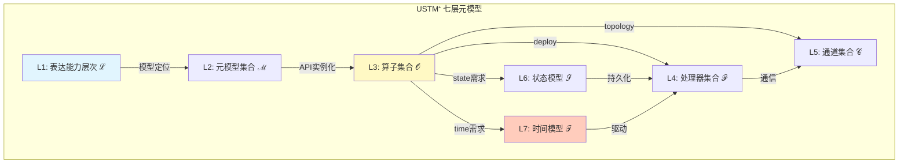
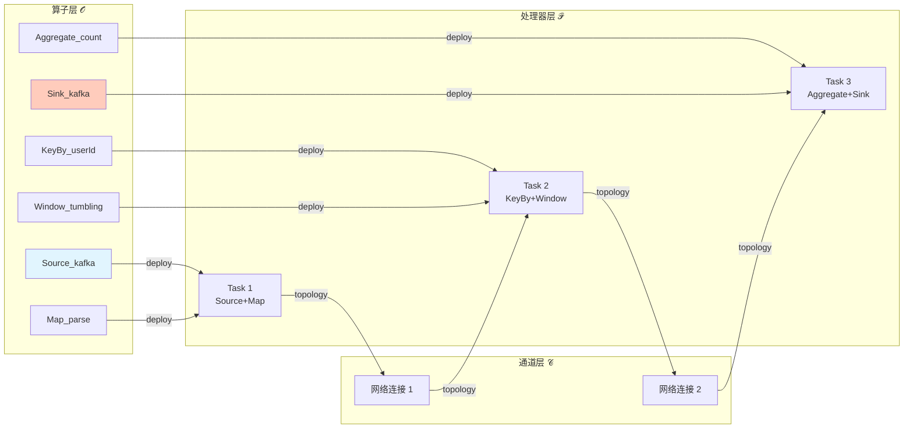

# USTM 算子层扩展补充

> **所属阶段**: Struct/01-foundation | **前置依赖**: [01.01-unified-streaming-theory.md](01.01-unified-streaming-theory.md), [02.06-stream-operator-algebra.md](../02-properties/02.06-stream-operator-algebra.md) | **形式化等级**: L5
> **文档定位**: 在现有USTM元模型中显式引入算子层，使USTM从"并发模型元理论"升级为"流处理全栈元理论"
> **版本**: 2026.04 | **性质**: 扩展补充文档（非替换原USTM）

---

## 目录

- [USTM 算子层扩展补充](#ustm-算子层扩展补充)
  - [目录](#目录)
  - [1. 概念定义 (Definitions)](#1-概念定义-definitions)
    - [1.1 算子层的形式化引入](#11-算子层的形式化引入)
    - [1.2 算子组合算子的定义](#12-算子组合算子的定义)
    - [1.3 语义解释函数](#13-语义解释函数)
  - [2. 属性推导 (Properties)](#2-属性推导-properties)
    - [2.1 算子组合的结合性](#21-算子组合的结合性)
    - [2.2 算子组合的封闭性](#22-算子组合的封闭性)
  - [3. 关系建立 (Relations)](#3-关系建立-relations)
    - [3.1 算子层与处理器层的映射](#31-算子层与处理器层的映射)
    - [3.2 算子层与通道拓扑的映射](#32-算子层与通道拓扑的映射)
    - [3.3 算子层与时间模型的交互](#33-算子层与时间模型的交互)
  - [4. 论证过程 (Argumentation)](#4-论证过程-argumentation)
    - [4.1 为什么USTM需要显式算子层](#41-为什么ustm需要显式算子层)
  - [5. 形式证明 (Proofs)](#5-形式证明-proofs)
    - [5.1 算子组合结合性定理](#51-算子组合结合性定理)
    - [5.2 算子层完备性定理](#52-算子层完备性定理)
  - [6. 实例验证 (Examples)](#6-实例验证-examples)
    - [6.1 Flink作为USTM算子层实例](#61-flink作为ustm算子层实例)
  - [7. 可视化 (Visualizations)](#7-可视化-visualizations)
    - [图 7.1 USTM扩展后七层架构图](#图-71-ustm扩展后七层架构图)
    - [图 7.2 算子层映射关系图](#图-72-算子层映射关系图)
  - [8. 引用参考 (References)](#8-引用参考-references)

---

## 1. 概念定义 (Definitions)

### 1.1 算子层的形式化引入

**定义 1.1 (扩展USTM元模型)** [Def-S-01-OP-01]

在现有USTM元模型 $\text{USTM} = (\mathcal{L}, \mathcal{M}, \mathcal{P}, \mathcal{C}, \mathcal{S}, \mathcal{T}, \Sigma, \Phi)$ 基础上，扩展为九元组：

$$\text{USTM}^+ = (\mathcal{L}, \mathcal{M}, \mathcal{P}, \mathcal{C}, \mathcal{S}, \mathcal{T}, \mathcal{O}, \Sigma^+, \Phi^+)$$

其中新增组件：

- $\mathcal{O}$: **算子集合**（Operator Set），流处理的基本计算单元
- $\Sigma^+ = \Sigma \cup \Sigma_{op}$: 扩展编码映射族，新增算子层映射
- $\Phi^+ = \Phi \cup \Phi_{op}$: 扩展性质保持映射，新增算子组合性质

**定义 1.2 (算子)** [Def-S-01-OP-02]

算子 $op \in \mathcal{O}$ 是一个四元组：

$$op = (\text{sig}, \text{state}, \text{time}, \text{para})$$

其中：

- $\text{sig}: \text{StreamType}^n \rightarrow \text{StreamType}^m$: 类型签名（输入流类型 → 输出流类型）
- $\text{state} \in \{\text{无状态}, \text{键控}, \text{窗口}, \text{操作符}, \text{外部}\}$: 状态依赖类型
- $\text{time} \in \{\text{无关}, \text{事件时间}, \text{处理时间}, \text{摄入时间}\}$: 时间语义需求
- $\text{para} \in \mathbb{N}^+$: 并行度约束

**定义 1.3 (算子元数)** [Def-S-01-OP-03]

算子元数函数 $\text{arity}: \mathcal{O} \rightarrow \mathbb{N} \times \mathbb{N}$:

$$\text{arity}(op) = (n, m), \quad n = |\text{inputs}(op)|, \; m = |\text{outputs}(op)|$$

分类：

- $n = 0$: Source算子（零输入）
- $n = 1, m = 1$: 单输入单输出转换算子
- $n = 1, m = 0$: Sink算子（零输出）
- $n \geq 2$: 多输入算子
- $m \geq 2$: 多输出算子（含side output）

### 1.2 算子组合算子的定义

**定义 1.4 (算子组合)** [Def-S-01-OP-04]

算子组合算子 $\otimes: \mathcal{O} \times \mathcal{O} \rightharpoonup \mathcal{O}$ 定义为部分函数：

$$op_1 \otimes op_2 = \begin{cases}
op_{12} & \text{if } \text{outputType}(op_1) = \text{inputType}(op_2) \\
\text{undefined} & \text{otherwise}
\end{cases}$$

其中 $op_{12}$ 满足：
- $\text{sig}(op_{12}) = \text{sig}(op_2) \circ \text{sig}(op_1)$
- $\text{state}(op_{12}) = \max_{\preceq}(\text{state}(op_1), \text{state}(op_2))$（按状态复杂度偏序）
- $\text{time}(op_{12}) = \text{time}(op_1) \sqcup \text{time}(op_2)$（按时间语义格上确界）

**定义 1.5 (单位算子)** [Def-S-01-OP-05]

单位算子 $\text{id}_S \in \mathcal{O}$ 满足：

$$\forall op \in \mathcal{O}. \; op \otimes \text{id}_{\text{input}(op)} = op = \text{id}_{\text{output}(op)} \otimes op$$

### 1.3 语义解释函数

**定义 1.6 (算子语义解释)** [Def-S-01-OP-06]

语义解释函数将算子映射到流变换函数：

$$\llbracket - \rrbracket_{op}: \mathcal{O} \rightarrow (S_{in} \rightharpoonup S_{out})$$

满足同态条件：

$$\llbracket op_1 \otimes op_2 \rrbracket_{op} = \llbracket op_2 \rrbracket_{op} \circ \llbracket op_1 \rrbracket_{op}$$

即"先组合算子再解释"等于"先解释再函数复合"。

---

## 2. 属性推导 (Properties)

### 2.1 算子组合的结合性

**引理 2.1 (类型匹配下的结合性)** [Lemma-S-01-OP-01]

若 $\text{outputType}(op_1) = \text{inputType}(op_2)$ 且 $\text{outputType}(op_2) = \text{inputType}(op_3)$，则：

$$(op_1 \otimes op_2) \otimes op_3 = op_1 \otimes (op_2 \otimes op_3)$$

*证明*: 两边在类型签名层面都等于 $\text{sig}(op_3) \circ \text{sig}(op_2) \circ \text{sig}(op_1)$。函数复合天然满足结合律。$\square$

### 2.2 算子组合的封闭性

**引理 2.2 (合法组合的封闭性)** [Lemma-S-01-OP-02]

若 $op_1, op_2 \in \mathcal{O}$ 且 $op_1 \otimes op_2$ 有定义，则 $op_1 \otimes op_2 \in \mathcal{O}$。

*证明*: 组合结果 $op_{12}$ 的四元组 $(\text{sig}_{12}, \text{state}_{12}, \text{time}_{12}, \text{para}_{12})$ 均在各自取值空间内：
- $\text{sig}_{12}$ 是合法的类型签名（StreamType上的函数）
- $\text{state}_{12}$ 是状态偏序格中的元素
- $\text{time}_{12}$ 是时间语义格中的元素
- $\text{para}_{12}$ 是正整数

因此 $op_{12} \in \mathcal{O}$。$\square$

---

## 3. 关系建立 (Relations)

### 3.1 算子层与处理器层的映射

**定义 3.1 (算子部署映射)** [Def-S-01-OP-07]

算子到处理器的部署映射：

$$\text{deploy}: \mathcal{O} \rightarrow \mathcal{P}(\mathcal{P})$$

性质：
- 无状态算子可部署到任意处理器（embarrassingly parallel）
- 键控算子必须部署到与其key哈希对应的处理器
- 广播算子部署到所有处理器

### 3.2 算子层与通道拓扑的映射

**定义 3.2 (拓扑映射)** [Def-S-01-OP-08]

算子组合到通道拓扑的映射：

$$\text{topology}: \mathcal{O} \times \mathcal{O} \rightarrow \mathcal{C}$$

对于 $op_1 \otimes op_2$，生成通道 $c \in \mathcal{C}$ 满足：
- $\text{src}(c) = \text{deploy}(op_1)$
- $\text{dst}(c) = \text{deploy}(op_2)$
- 数据分区策略由 $op_1$ 的输出类型和 $op_2$ 的输入类型共同决定

### 3.3 算子层与时间模型的交互

**命题 3.3 (时间语义传播)** [Prop-S-01-OP-01]

算子组合的时间语义满足：

$$\text{time}(op_1 \otimes op_2) = \text{time}(op_1) \sqcup \text{time}(op_2)$$

其中格 $(\{\text{无关}, \text{摄入时间}, \text{处理时间}, \text{事件时间}\}, \sqsubseteq)$ 的序关系为：

$$\text{无关} \sqsubseteq \text{摄入时间} \sqsubseteq \text{处理时间} \sqsubseteq \text{事件时间}$$

**解释**: 若组合中的任一算子需要事件时间，则整个组合需要事件时间；若都不需要时间语义，则组合也不需要。

---

## 4. 论证过程 (Argumentation)

### 4.1 为什么USTM需要显式算子层

原USTM元模型 $(\mathcal{L}, \mathcal{M}, \mathcal{P}, \mathcal{C}, \mathcal{S}, \mathcal{T}, \Sigma, \Phi)$ 在**并发模型层面**提供了统一的抽象，但缺少**计算层面**的显式结构。这导致以下问题：

1. **模型到代码的鸿沟**: 从Dataflow Model到Flink DataStream API的映射缺少中间层。算子层填补了这一鸿沟。
2. **优化无法形式化**: 没有算子层，Filter-Pushdown、Map-Fusion等优化规则无法在原框架内表达。
3. **组合性不可见**: Processor层描述的是运行时的进程，而非编程时的组合结构。

引入算子层后，USTM形成**七层结构**：

| 层级 | 元素 | 对应工程概念 |
|------|------|------------|
| L1 | 表达能力层次 $\mathcal{L}$ | 理论边界 |
| L2 | 元模型集合 $\mathcal{M}$ | 编程范式 |
| L3 | **算子集合 $\mathcal{O}$** | **API/算子库** |
| L4 | 处理器集合 $\mathcal{P}$ | Task/线程 |
| L5 | 通道集合 $\mathcal{C}$ | 网络连接 |
| L6 | 状态模型 $\mathcal{S}$ | State Backend |
| L7 | 时间模型 $\mathcal{T}$ | Watermark/Timer |

---

## 5. 形式证明 (Proofs)

### 5.1 算子组合结合性定理

**定理 5.1 (算子组合的结合性)** [Thm-S-01-OP-01]

在类型匹配的前提下，算子组合满足结合律：

$$\forall op_1, op_2, op_3 \in \mathcal{O}. \; (op_1 \otimes op_2) \otimes op_3 = op_1 \otimes (op_2 \otimes op_3)$$

*证明*:

1. **类型签名层面**: 左边 = $\text{sig}(op_3) \circ \text{sig}(op_2) \circ \text{sig}(op_1)$ = 右边（函数复合结合律）
2. **状态层面**: 两边都 = $\max(\text{state}(op_1), \text{state}(op_2), \text{state}(op_3))$（偏序格上确界结合律）
3. **时间语义层面**: 两边都 = $\text{time}(op_1) \sqcup \text{time}(op_2) \sqcup \text{time}(op_3)$（格上确界结合律）
4. **并行度层面**: 两边都 = $\text{lcm}(\text{para}(op_1), \text{para}(op_2), \text{para}(op_3))$（最小公倍数结合律）

因此四元组相等，算子组合结合性成立。$\square$

### 5.2 算子层完备性定理

**定理 5.2 (算子层完备性)** [Thm-S-01-OP-02]

任何由标准算子构建的流处理作业 $J$，其算子DAG可完全编码为USTM算子层中的算子组合表达式：

$$\forall J. \; \exists op_1, \ldots, op_n \in \mathcal{O}. \; J \cong op_1 \otimes op_2 \otimes \ldots \otimes op_n$$

*证明概要*:

对作业DAG的拓扑排序进行归纳：
- **基例**: 单节点DAG = 单个算子 $op \in \mathcal{O}$
- **归纳步**: 设前 $k$ 个节点可编码为 $op_{1..k}$，第 $k+1$ 个节点 $op_{k+1}$ 与 $op_{1..k}$ 的输出类型匹配（否则DAG不合法）。由组合定义，$op_{1..k} \otimes op_{k+1}$ 有定义。

由DAG无环性，归纳可在有限步完成。$\square$

---

## 6. 实例验证 (Examples)

### 6.1 Flink作为USTM算子层实例

**Flink DataStream API 到 USTM 算子层的映射**:

| Flink API | USTM算子 | 元数 | 状态 | 时间 |
|-----------|---------|------|------|------|
| `env.fromSource(KafkaSource)` | Source_kafka | (0,1) | 无状态 | 事件时间 |
| `.map(f)` | Map_f | (1,1) | 无状态 | 无关 |
| `.filter(p)` | Filter_p | (1,1) | 无状态 | 无关 |
| `.keyBy(selector)` | KeyBy_selector | (1,1) | 无状态 | 无关 |
| `.window(TumblingEventTimeWindows)` | Window_tumbling | (1,1) | 窗口状态 | 事件时间 |
| `.aggregate(func)` | Aggregate_func | (1,1) | 键控状态 | 事件时间 |
| `.process(ProcessFunction)` | Process_pf | (1,1) | 键控/操作符 | 事件时间/处理时间 |
| `.addSink(KafkaSink)` | Sink_kafka | (1,0) | 事务状态 | 事件时间 |

**完整作业编码示例**:

```java
// Flink代码
env.fromSource(kafkaSource)
   .map(parse)
   .keyBy(event -> event.userId)
   .window(TumblingEventTimeWindows.of(Time.minutes(1)))
   .aggregate(new CountAggregate())
   .addSink(kafkaSink);
```

**USTM算子组合编码**:

$$\text{Sink}_{kafka} \otimes \text{Aggregate}_{count} \otimes \text{Window}_{tumbling(1min)} \otimes \text{KeyBy}_{userId} \otimes \text{Map}_{parse} \otimes \text{Source}_{kafka}$$

**类型推导**:
```
Source_kafka     : ∅ → Stream<byte[]>
Map_parse        : Stream<byte[]> → Stream<Event>
KeyBy_userId     : Stream<Event> → KeyedStream<Event, UserId>
Window_tumbling  : KeyedStream<Event, UserId> → WindowedStream<Event, UserId, TimeWindow>
Aggregate_count  : WindowedStream<Event, UserId, TimeWindow> → Stream<CountResult>
Sink_kafka       : Stream<CountResult> → ∅
```

---

## 7. 可视化 (Visualizations)

### 图 7.1 USTM扩展后七层架构图



### 图 7.2 算子层映射关系图



---

## 8. 引用参考 (References)

[^1]: 本文档前置依赖 [01.01-unified-streaming-theory.md](01.01-unified-streaming-theory.md) 中的USTM原始定义

[^2]: [02.06-stream-operator-algebra.md](../02-properties/02.06-stream-operator-algebra.md) 中的算子代数体系

[^3]: T. Akidau et al., "The Dataflow Model", PVLDB, 8(12), 2015.

[^4]: M. Abadi et al., "TensorFlow: A System for Large-Scale Machine Learning", OSDI, 2016. (算子图与执行图分离的架构参考)

---

*关联文档*: [01.01-unified-streaming-theory.md](01.01-unified-streaming-theory.md) | [02.06-stream-operator-algebra.md](../02-properties/02.06-stream-operator-algebra.md) | [03.05-stream-operator-taxonomy.md](../03-relationships/03.05-stream-operator-taxonomy.md)
