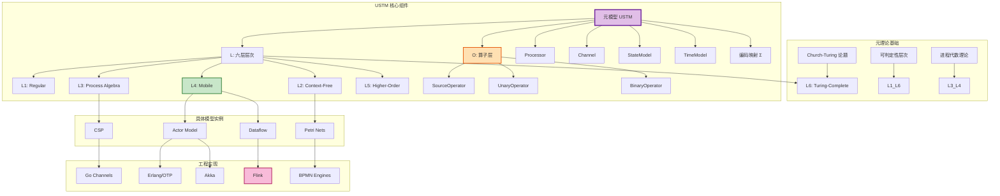
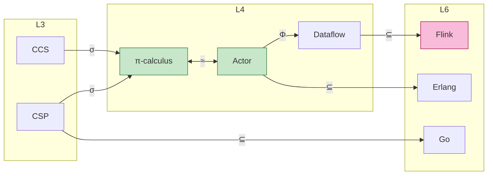
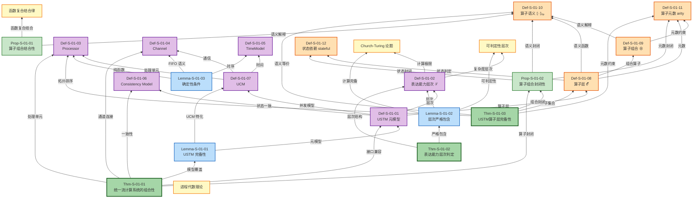
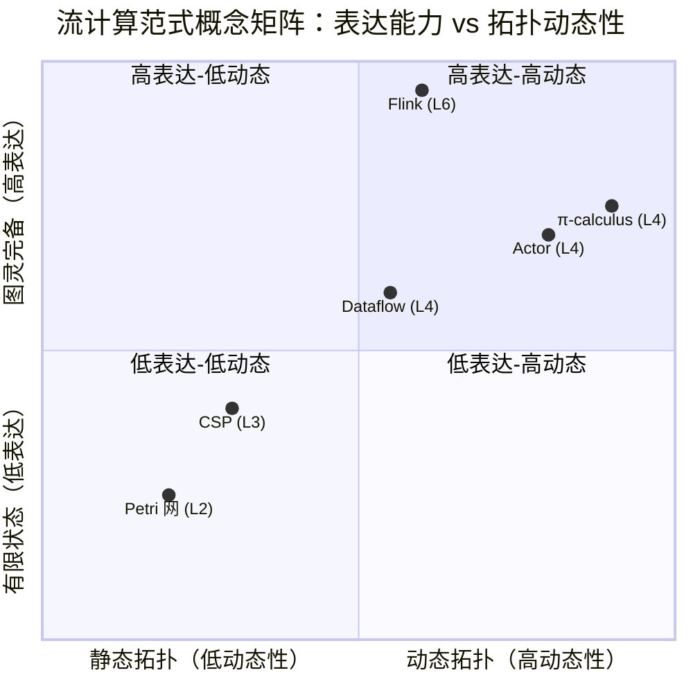
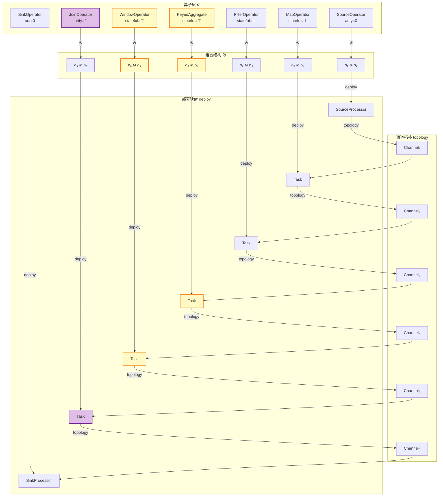
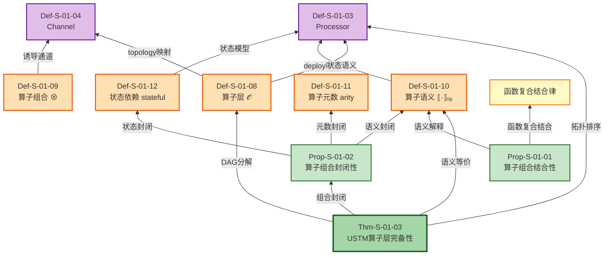

# 统一流计算理论 (Unified Streaming Theory)

> 所属阶段: Struct | 前置依赖: [相关文档] | 形式化等级: L3

> **文档定位**: 流计算形式理论的统一元模型，整合 Actor、CSP、Dataflow、Petri 网四大范式
> **形式化等级**: L6 (图灵完备) | **前置依赖**: 无（本层为根基）
> **版本**: 2026.04

---

## 目录

- [统一流计算理论 (Unified Streaming Theory)](#统一流计算理论-unified-streaming-theory)
  - [目录](#目录)
  - [1. 概念定义 (Definitions)](#1-概念定义-definitions)
    - [1.1 元模型核心定义](#11-元模型核心定义)
    - [1.2 算子层定义](#12-算子层定义)
    - [1.3 六层表达能力层次](#13-六层表达能力层次)
    - [1.4 处理器形式化](#14-处理器形式化)
    - [1.5 通道形式化](#15-通道形式化)
    - [1.6 时间模型形式化](#16-时间模型形式化)
    - [1.7 一致性模型形式化](#17-一致性模型形式化)
    - [1.8 统一并发模型表示 (UCM)](#18-统一并发模型表示-ucm)
  - [2. 属性推导 (Properties)](#2-属性推导-properties)
    - [2.1 元模型的一致性保证](#21-元模型的一致性保证)
    - [2.2 映射的传递性](#22-映射的传递性)
    - [2.3 层次完备格结构](#23-层次完备格结构)
    - [2.4 时间模型的偏序性](#24-时间模型的偏序性)
    - [2.5 算子组合性质](#25-算子组合性质)
  - [3. 关系建立 (Relations)](#3-关系建立-relations)
    - [3.1 模型间表达能力关系](#31-模型间表达能力关系)
    - [3.2 模型到实现的映射](#32-模型到实现的映射)
    - [3.3 跨层推理关系](#33-跨层推理关系)
    - [3.4 算子层映射](#34-算子层映射)
  - [4. 论证过程 (Argumentation)](#4-论证过程-argumentation)
    - [4.1 统一元理论的完备性论证](#41-统一元理论的完备性论证)
    - [4.2 六层层次的严格性论证](#42-六层层次的严格性论证)
    - [4.3 流计算确定性的边界论证](#43-流计算确定性的边界论证)
  - [5. 形式证明 (Proofs)](#5-形式证明-proofs)
    - [定理 5.1 (统一流计算系统的组合性)](#定理-51-统一流计算系统的组合性)
    - [定理 5.2 (表达能力层次判定)](#定理-52-表达能力层次判定)
    - [定理 5.3 (USTM 算子层的完备性)](#定理-53-ustm-算子层的完备性)
  - [6. 实例验证 (Examples)](#6-实例验证-examples)
    - [6.1 Flink 作为 USTM 实例](#61-flink-作为-ustm-实例)
    - [6.2 Actor 系统映射](#62-actor-系统映射)
  - [7. 可视化 (Visualizations)](#7-可视化-visualizations)
    - [图 7.1 USTM 概念依赖图](#图-71-ustm-概念依赖图)
    - [图 7.2 模型间编码关系图](#图-72-模型间编码关系图)
    - [图 7.3 形式化元素推理树](#图-73-形式化元素推理树)
    - [图 7.4 流计算范式概念矩阵](#图-74-流计算范式概念矩阵)
    - [图 7.5 算子层架构图](#图-75-算子层架构图)
    - [图 7.6 算子组合推理树](#图-76-算子组合推理树)
  - [8. 引用参考 (References)](#8-引用参考-references)
  - [关联文档](#关联文档)

## 1. 概念定义 (Definitions)

### 1.1 元模型核心定义

**定义 1.1 (统一流计算元模型 USTM)**.

$$
\text{USTM} ::= (\mathcal{L}, \mathcal{M}, \mathcal{O}, \mathcal{P}, \mathcal{C}, \mathcal{S}, \mathcal{T}, \Sigma, \Phi)
$$

| 组件 | 类型 | 语义 |
|------|------|------|
| $\mathcal{L}$ | $\{L_1, L_2, L_3, L_4, L_5, L_6\}$ | 六层表达能力层次 (见 Def-S-01-03) |
| $\mathcal{M}$ | $\text{Set}(\text{MetaModel})$ | 元模型集合：Actor, CSP, Dataflow, Petri |
| $\mathcal{O}$ | $\text{Set}(\text{Operator})$ | 算子集合：流处理的基本计算单元 (见 Def-S-01-08) |
| $\mathcal{P}$ | $\text{Set}(\text{Processor})$ | 处理器/进程集合 |
| $\mathcal{C}$ | $\text{Set}(\text{Channel})$ | 通道/连接集合 |
| $\mathcal{S}$ | $\text{StateModel}$ | 状态模型 |
| $\mathcal{T}$ | $\text{TimeModel}$ | 时间模型 |
| $\Sigma$ | $\text{EncodingMap}$ | 模型间编码映射族 |
| $\Phi$ | $\text{PropertyMap}$ | 性质保持映射 |

**系统不变式**:

$$
\begin{aligned}
&\text{(I1) 拓扑闭包}: &&\forall p \in \mathcal{P}. \; \text{inputs}(p) \cup \text{outputs}(p) \subseteq \mathcal{C} \\
&\text{(I2) 通道端点}: &&\forall c \in \mathcal{C}. \; |\text{src}(c)| = 1 \land |\text{dst}(c)| \geq 1 \\
&\text{(I3) 状态归属}: &&\forall s \in \mathcal{S}. \; \exists! p \in \mathcal{P}. \; \text{owner}(s) = p \\
&\text{(I4) 算子封闭}: &&\forall o_1, o_2 \in \mathcal{O}. \; o_1 \otimes o_2 \in \mathcal{O}
\end{aligned}
$$

---

### 1.2 算子层定义

**定义 1.2 (算子层 Operator Layer)**.

USTM 元模型中的算子层定义为五元组：

$$
\text{OperatorLayer} ::= (\mathcal{O}, \otimes, \llbracket - \rrbracket_{op}, \text{arity}, \text{stateful})
$$

| 组件 | 类型 | 语义 |
|------|------|------|
| $\mathcal{O}$ | $\text{Set}(\text{Operator})$ | 算子集合：流处理的基本计算单元 |
| $\otimes$ | $\mathcal{O} \times \mathcal{O} \rightarrow \mathcal{O}$ | 算子组合算子：将两个算子组合为新算子 |
| $\llbracket - \rrbracket_{op}$ | $\mathcal{O} \rightarrow (S_{in} \rightarrow S_{out})$ | 算子语义解释：将算子映射为流变换函数 |
| $\text{arity}$ | $\mathcal{O} \rightarrow \mathbb{N}$ | 算子元数：输入流的数量 |
| $\text{stateful}$ | $\mathcal{O} \rightarrow \mathbb{B}$ | 状态依赖判定：$\top$ 当且仅当算子维护内部状态 |

**算子分类**:

```
Operator (𝒪)
├── SourceOperator    (arity = 0, stateful ∈ {⊤, ⊥})
├── UnaryOperator     (arity = 1)
│   ├── StatelessUnary
│   │   ├── Map
│   │   └── Filter
│   └── StatefulUnary
│       ├── KeyedAggregate
│       └── WindowOperator
├── BinaryOperator    (arity = 2)
│   ├── StatelessBinary
│   │   └── Union
│   └── StatefulBinary
│       └── Join
└── NaryOperator      (arity ≥ 2)
    └── MultiWayJoin
```

**定义 1.3 (算子组合算子 $\otimes$)**.

$$
\otimes: \mathcal{O} \times \mathcal{O} \rightarrow \mathcal{O}
$$

给定 $o_1, o_2 \in \mathcal{O}$，组合算子 $o_1 \otimes o_2$ 满足：

$$
\begin{aligned}
&\text{arity}(o_1 \otimes o_2) = \text{arity}(o_1) + \text{arity}(o_2) - \text{out}(o_1) \\
&\text{stateful}(o_1 \otimes o_2) = \text{stateful}(o_1) \lor \text{stateful}(o_2) \\
&\llbracket o_1 \otimes o_2 \rrbracket_{op} = \llbracket o_2 \rrbracket_{op} \circ \llbracket o_1 \rrbracket_{op}
\end{aligned}
$$

其中 $\text{out}(o) \in \{0, 1\}$ 表示算子的输出流数量（单输出为1，无输出为0）。组合算子要求 $\text{out}(o_1) \geq 1$ 且 $\text{arity}(o_2) \geq 1$ 时两者可连接。

**定义 1.4 (算子语义解释函数)**.

$$
\llbracket - \rrbracket_{op}: \mathcal{O} \rightarrow (S_{in} \rightarrow S_{out})
$$

对任意 $o \in \mathcal{O}$，$\llbracket o \rrbracket_{op}$ 是一个从输入流到输出流的偏函数，满足：

$$
\forall s \in S_{in}. \; \text{dom}(\llbracket o \rrbracket_{op}(s)) = \{ s \mid \text{arity}(o) = |s| \}
$$

其中 $S_{in}$ 和 $S_{out}$ 分别表示输入流空间和输出流空间。对于无状态算子，$\llbracket o \rrbracket_{op}$ 是 $S_{in}$ 到 $S_{out}$ 的纯函数；对于有状态算子，语义函数还依赖于内部状态 $\sigma \in \mathcal{S}$：

$$
\llbracket o \rrbracket_{op}^{\sigma}: S_{in} \times \mathcal{S} \rightarrow S_{out} \times \mathcal{S}
$$

**定义 1.5 (算子元数函数)**.

$$
\text{arity}: \mathcal{O} \rightarrow \mathbb{N}
$$

元数约束：

- $\text{arity}(o) = 0$: Source 算子（无输入，产生数据流）
- $\text{arity}(o) = 1$: Unary 算子（单输入，如 Map、Filter）
- $\text{arity}(o) = 2$: Binary 算子（双输入，如 Join、CoGroup）
- $\text{arity}(o) \geq 2$: Nary 算子（多路输入，如多路 Union）

**定义 1.6 (状态依赖判定)**.

$$
\text{stateful}: \mathcal{O} \rightarrow \mathbb{B}
$$

$$
\text{stateful}(o) = \begin{cases}
\top & \text{if } \exists \sigma \in \mathcal{S}, s_{in}, s'_{in} \in S_{in}. \; \llbracket o \rrbracket_{op}^{\sigma}(s_{in}) \neq \llbracket o \rrbracket_{op}^{\sigma}(s'_{in}) \text{ 且 } s_{in} = s'_{in} \text{ 但 } \sigma \neq \sigma' \\
\bot & \text{otherwise}
\end{cases}
$$

即：算子是状态依赖的，当且仅当在相同输入但不同内部状态下可能产生不同输出。等价地，若算子的输出仅依赖于当前输入记录而不依赖于历史记录或外部状态，则为无状态算子。

---

### 1.3 六层表达能力层次

**定义 1.7 (表达能力层次 $\mathcal{L}$)**.

$$
L_1 \subset L_2 \subset L_3 \subset L_4 \subset L_5 \subseteq L_6
$$

| 层次 | 名称 | 形式模型 | 表达能力 | 可判定性 | 典型系统 |
|------|------|----------|----------|----------|----------|
| $L_1$ | Regular | FSM, 正则表达式 | 正则语言 | P-完全 | 有限状态工作流 |
| $L_2$ | Context-Free | PDA, 基本 Petri 网 | 上下文无关 | PSPACE-完全 | 基础工作流引擎 |
| $L_3$ | Process Algebra | CSP, CCS, ACP | 静态名称通信 | EXPTIME | FDR, Go Channels |
| $L_4$ | Mobile | $\pi$-calculus, Actor, Dataflow | 动态拓扑 | 部分可判定 | Erlang, Akka, Flink |
| $L_5$ | Higher-Order | HO-$\pi$, Ambient | 进程作为数据 | 大部分不可判定 | 高级移动代理 |
| $L_6$ | Turing-Complete | $\lambda$-演算, 图灵机 | 所有可计算 | 不可判定 | Go, Scala, 通用语言 |

**层次包含定理**:

$$
\forall i < j. \; L_i \subset L_j \; \text{(严格包含)}
$$

---

### 1.4 处理器形式化

**定义 1.8 (Processor)**.

$$
\text{Processor} ::= (\mathcal{I}, \mathcal{O}, \mathcal{F}, \mathcal{A}, \sigma)
$$

其中：

| 组件 | 类型 | 语义 |
|------|------|------|
| $\mathcal{I}$ | $\text{Set}(\text{InputPort})$ | 输入端口集合 |
| $\mathcal{O}$ | $\text{Set}(\text{OutputPort})$ | 输出端口集合 |
| $\mathcal{F}$ | $\text{Computation}$ | 计算函数 $\mathcal{I}^* \times \mathcal{S} \rightarrow \mathcal{O}^* \times \mathcal{S} \times \text{Effect}^*$ |
| $\mathcal{A}$ | $\text{StateAccessPattern}$ | 状态访问模式：ReadOnly \| ReadWrite \| Accumulate |
| $\sigma$ | $\text{State}$ | 处理器私有状态 |

**处理器分类**:

```
Processor
├── StatelessProcessor
│   └── F: I → O (纯函数)
├── StatefulProcessor
│   ├── KeyedProcessor (按键分区)
│   │   └── F: (K, V) × State[K] → State[K] × O
│   └── OperatorProcessor (算子级)
│       └── F: I × State → State × O
└── BoundaryProcessor
    ├── SourceProcessor (无输入)
    └── SinkProcessor (无输出)
```

---

### 1.5 通道形式化

**定义 1.9 (Channel)**.

$$
\text{Channel} ::= (\mathcal{B}, \mathcal{O}, \mathcal{D}, \tau)
$$

其中：

| 组件 | 类型 | 语义 |
|------|------|------|
| $\mathcal{B}$ | $\text{Buffer}(T, \text{Capacity})$ | 缓冲队列 |
| $\mathcal{O}$ | $\text{Ordering}$ | 排序保证：FIFO \| Ordered(K) \| Unordered |
| $\mathcal{D}$ | $\text{DeliveryGuarantee}$ | 交付保证：AtMostOnce \| AtLeastOnce \| ExactlyOnce |
| $\tau$ | $\text{Transport}$ | 传输机制：Memory \| Network \| File |

**通道类型对应**:

| 系统 | Buffer | Ordering | Delivery |
|------|--------|----------|----------|
| **Flink** | 有限 Network Buffer | FIFO (per partition) | ExactlyOnce (with Checkpoint) |
| **Akka** | 有限/无限 Mailbox | FIFO | AtMostOnce |
| **Go** | 有限 Channel | FIFO | AtMostOnce (同步) |
| **KPN** | 无限 FIFO | FIFO | ExactlyOnce (理论) |

---

### 1.6 时间模型形式化

**定义 1.10 (TimeModel)**.

$$
\text{TimeModel} ::= \text{EventTime}(t_e) \mid \text{ProcessingTime}(t_p) \mid \text{IngestionTime}(t_i)
$$

| 类型 | 定义 | 形式化 |
|------|------|--------|
| **EventTime** | 数据产生时间 | $t_e: \text{Record} \rightarrow \text{Timestamp}$ |
| **ProcessingTime** | 处理执行时间 | $t_p: () \rightarrow \text{Timestamp}_{wall}$ |
| **IngestionTime** | 进入系统时间 | $t_i: \text{Record} \rightarrow \text{Timestamp}_{system}$ |

**Watermark 形式化**:

$$
\text{Watermark}(t_w) ::= \forall e \in \text{Stream}. \; t_e(e) \leq t_w \lor \text{late}(e)
$$

**时间窗口类型**:

| 窗口类型 | 定义 | 触发条件 |
|----------|------|----------|
| Tumbling($\delta$) | $[n\delta, (n+1)\delta)$ | Watermark $\geq (n+1)\delta$ |
| Sliding($\delta$, slide) | $[n \cdot \text{slide}, n \cdot \text{slide} + \delta)$ | Watermark $\geq$ 窗口结束 |
| Session(gap) | 动态，由活动间隔定义 | 无活动超过 gap |

---

### 1.7 一致性模型形式化

**定义 1.11 (Consistency Model)**.

$$
\text{Consistency} ::= \text{AtMostOnce} \mid \text{AtLeastOnce} \mid \text{ExactlyOnce}
$$

**端到端一致性层次**:

$$
\text{ExactlyOnce} \supset \text{AtLeastOnce} \supset \text{AtMostOnce}
$$

| 级别 | 语义 | 实现机制 |
|------|------|----------|
| **ExactlyOnce** | 每条记录对系统状态的影响恰好一次 | Checkpoint + 2PC / 幂等 Sink |
| **AtLeastOnce** | 记录至少被处理一次，可能重复 | Checkpoint + 重放 |
| **AtMostOnce** | 记录最多被处理一次，可能丢失 | 无容错，失败即丢弃 |

---

### 1.8 统一并发模型表示 (UCM)

**定义 1.12 (UCM — Unified Concurrent Model)**.

$$
\text{UCM} = (S, A, C, T, \delta, \iota, \omega)
$$

其中：

| 组件 | 类型 | 语义 |
|------|------|------|
| $S$ | $\text{StateSpace}$ | 状态空间 |
| $A$ | $\text{Set}(\text{Actor/Process})$ | Actor/进程集合 |
| $C$ | $\text{Set}(\text{Channel})$ | 通信信道集合 |
| $T$ | $\text{Set}(\text{Transition})$ | 变迁/转移集合 |
| $\delta$ | $S \times T \rightarrow S$ | 状态转移函数 |
| $\iota$ | $A \times C \rightharpoonup A \times C$ | 接口/连接关系 |
| $\omega$ | $T \rightarrow (\text{Guard} \times \text{Action})$ | 变迁的守卫-动作 |

**各模型的 UCM 特化**:

| 模型 | UCM 特化 |
|------|----------|
| **Actor** | $C = A \times A$ (信道由 Actor 地址对隐式定义)，通信异步，$\omega$ 包含 spawn 操作 |
| **CSP** | $C$ 是静态命名集合，$\iota$ 声明时静态连接，通信同步，$\omega$ 包含外部选择 |
| **Dataflow** | $A$ = 算子集合，$C$ = 有向边，执行由数据可用性驱动 ($\omega$.Guard = tokens_ready) |
| **Petri网** | $A$ = 变迁集合，$C$ = 库所集合，$\iota$ = 流关系 $F \subseteq (C \times A) \cup (A \times C)$ |

---

## 2. 属性推导 (Properties)

### 2.1 元模型的一致性保证

**性质 1 (Consistency Preservation)**.

若 MM 满足一致性，则对于任意编码链 $\sigma_{1n} = \sigma_{12} \circ \sigma_{23} \circ ... \circ \sigma_{(n-1)n}$，Consistency 在链上保持。

**推导**:

1. 单个编码 $\sigma_{ij}$ 保持一致性：$\text{Consistent}(M_i) \Rightarrow \text{Consistent}(\sigma_{ij}(M_i))$
2. 归纳应用：$\text{Consistent}(M_1) \Rightarrow \text{Consistent}(M_n)$
3. 一致性是编码映射下的不变量

---

### 2.2 映射的传递性

**性质 2 (Transitivity of Encodings)**.

对于 $L_i \leq L_j \leq L_k$，编码映射满足传递性：$\sigma_{jk} \circ \sigma_{ij} = \sigma_{ik}$

**推导**:

编码映射构成范畴：层次为对象，编码为态射。结合律由语义等价的传递性保证。

---

### 2.3 层次完备格结构

**性质 3 (Complete Lattice)**.

$(\mathcal{L}, \leq)$ 构成完备格，其中：

$$
\sqcup\{L_i\} = L_{\max(i)}, \quad \sqcap\{L_i\} = L_{\min(i)}
$$

**推导**:

$\mathcal{L}$ 是全序集，任意子集都有最大元和最小元。

---

### 2.4 时间模型的偏序性

**性质 4 (Timestamp Partial Order)**.

Event Time 在单条流上构成全序，在多条流上构成偏序：

$$
\forall r_1, r_2 \in \text{SameStream}. \; t_e(r_1) < t_e(r_2) \lor t_e(r_2) < t_e(r_1) \lor t_e(r_1) = t_e(r_2)
$$

$$
\exists r_1 \in S_1, r_2 \in S_2. \; t_e(r_1) \nless t_e(r_2) \land t_e(r_2) \nless t_e(r_1) \land t_e(r_1) \neq t_e(r_2)
$$

---

### 2.5 算子组合性质

**性质 5 (算子组合的结合性)**.

对于任意 $o_1, o_2, o_3 \in \mathcal{O}$，算子组合满足结合律：

$$
(o_1 \otimes o_2) \otimes o_3 \;=\; o_1 \otimes (o_2 \otimes o_3)
$$

**推导**:

由算子语义解释的定义（Def-S-01-10），组合算子的语义为函数复合：

$$
\llbracket o_1 \otimes o_2 \rrbracket_{op} = \llbracket o_2 \rrbracket_{op} \circ \llbracket o_1 \rrbracket_{op}
$$

函数复合天然满足结合律：

$$
(\llbracket o_3 \rrbracket_{op} \circ \llbracket o_2 \rrbracket_{op}) \circ \llbracket o_1 \rrbracket_{op}
= \llbracket o_3 \rrbracket_{op} \circ (\llbracket o_2 \rrbracket_{op} \circ \llbracket o_1 \rrbracket_{op})
$$

因此算子组合在函数语义下结合。由算子封闭不变式 (I4)，两侧结果均属于 $\mathcal{O}$。 ∎

**性质 6 (算子组合的封闭性)**.

若 $o_1, o_2 \in \mathcal{O}$ 均为合法算子，则 $o_1 \otimes o_2 \in \mathcal{O}$ 也是合法算子。

**推导**:

1. **元数封闭**: $\text{arity}(o_1 \otimes o_2) = \text{arity}(o_1) + \text{arity}(o_2) - \text{out}(o_1) \in \mathbb{N}$
2. **语义封闭**: $\llbracket o_1 \otimes o_2 \rrbracket_{op} = \llbracket o_2 \rrbracket_{op} \circ \llbracket o_1 \rrbracket_{op}$ 是良定义的函数复合
3. **状态封闭**: $\text{stateful}(o_1 \otimes o_2) = \text{stateful}(o_1) \lor \text{stateful}(o_2) \in \mathbb{B}$

因此组合结果仍满足算子定义的所有约束，即 $o_1 \otimes o_2 \in \mathcal{O}$。 ∎

---

## 3. 关系建立 (Relations)

### 3.1 模型间表达能力关系

| 关系 | 源模型 | 目标模型 | 编码复杂度 | 关键限制 |
|------|--------|----------|------------|----------|
| $\subset$ | CSP ($L_3$) | $\pi$-calculus ($L_4$) | $O(n)$ | CSP 静态通道名限制 |
| $\approx$ | Actor ($L_4$) | $\pi$-calculus ($L_4$) | $O(n)$ | 异步语义等价 |
| $\subset$ | SDF | KPN | $O(1)$ | SDF 静态生产-消费率 |
| $\subset$ | KPN | Dataflow | $O(n)$ | KPN 无显式并行度 |
| $\subset$ | Dataflow | Flink | $O(n)$ | Dataflow 无容错语义 |
| $\approx$ | Actor | Dataflow (Keyed) | $O(n)$ | 单 Actor $\equiv$ KeyedProcessor |

### 3.2 模型到实现的映射

| 形式模型 | 实现语言 | 关系 | 映射说明 |
|----------|----------|------|----------|
| **CSP** | Go | $\subseteq$ | Go channel 实现 CSP 同步子集，缺外部选择 |
| **Actor** | Erlang | $\subseteq$ | Erlang 实现 Actor 核心 + 监督树扩展 |
| **Actor** | Akka (Scala) | $\subseteq$ | Akka 类型化 Actor，DOT 类型系统集成 |
| **Dataflow** | Flink | $\supseteq$ | Flink 扩展 Dataflow 语义，加状态管理 |

### 3.3 跨层推理关系

**跨层推理规则**:

$$
\frac{P \vdash \phi \quad \phi \text{ 向上保持} \quad L_i \leq L_j}{P \triangleright \phi@L_j}
$$

**性质保持分类**:

| 性质类型 | 向上保持 | 向下保持 | 示例 |
|----------|----------|----------|------|
| 安全性 (Safety) | ✅ | ✅ | 无数据丢失 |
| 活性 (Liveness) | ❌ | ⚠️ | 最终处理 |
| 活性+公平性 | ✅ | ⚠️ | 公平调度 |
| 类型安全 | ✅ | ✅ | 良类型程序 |

---

### 3.4 算子层映射

算子层作为 USTM 中承上启下的核心抽象，建立了从高层计算语义到底层执行基础设施的显式映射关系。

**映射 3.4.1 (算子 → 处理器映射)**.

$$
\mathcal{O} \xrightarrow{\text{deploy}} \mathcal{P}
$$

| 算子类型 | 处理器映射 | 说明 |
|----------|------------|------|
| SourceOperator | SourceProcessor | 无输入，产生数据流 |
| StatelessUnary | StatelessProcessor | 纯函数转换，无状态访问 |
| StatefulUnary | StatefulProcessor (Keyed/Operator) | 按键或全局状态维护 |
| BinaryOperator | 多个 Processor 通过 Channel 组合 | 多输入汇聚处理 |

算子到处理器的部署映射满足：

$$
\forall o \in \mathcal{O}. \; |\text{inputs}(\text{deploy}(o))| = \text{arity}(o) \land |\text{outputs}(\text{deploy}(o))| = \text{out}(o)
$$

**映射 3.4.2 (算子组合 → 通道拓扑映射)**.

$$
o_1 \otimes o_2 \xrightarrow{\text{topology}} \mathcal{C}
$$

算子组合 $o_1 \otimes o_2$ 诱导出通道集合：

$$
\mathcal{C}_{\text{induced}}(o_1 \otimes o_2) = \{ c \in \mathcal{C} \mid \text{src}(c) \in \text{outputs}(\text{deploy}(o_1)) \land \text{dst}(c) \in \text{inputs}(\text{deploy}(o_2)) \}
$$

拓扑映射保持 USTM 不变式 (I2)：每个诱导通道有唯一源点和至少一个目标点。

**映射 3.4.3 (算子语义 → 时间模型交互)**.

$$
\llbracket o \rrbracket_{op} \times \mathcal{T} \rightarrow S_{out}
$$

算子语义在时间模型下的执行规则：

| 时间模型 | 算子语义约束 | 典型算子 |
|----------|--------------|----------|
| EventTime | Watermark 驱动窗口触发 | WindowOperator, IntervalJoin |
| ProcessingTime | 立即执行，无时间等待 | Map, Filter, FlatMap |
| IngestionTime | 系统时间戳绑定后按 EventTime 语义处理 | 带时间戳的 Aggregate |

时间模型与算子语义的交互约束：

$$
\forall o \in \mathcal{O}. \; \mathcal{T} = \text{EventTime} \Rightarrow (\text{stateful}(o) = \top \lor \llbracket o \rrbracket_{op} \text{ 是时间无关的})
$$

即：在 EventTime 模型下，所有算子要么是无状态的纯变换，要么是显式管理时间状态的有状态算子。

---

## 4. 论证过程 (Argumentation)

### 4.1 统一元理论的完备性论证

**引理 4.1 (USTM 完备性)**.

USTM 覆盖了流计算领域的主要形式模型：

1. **Actor 模型**: 通过 $\mathcal{P}$ (Processor) + 异步 $\mathcal{C}$ (Channel) + 动态创建语义
2. **CSP**: 通过同步 $\mathcal{C}$ + 静态命名 + 外部选择守卫
3. **Dataflow**: 通过数据驱动触发 ($\omega$.Guard) + 有向 $\mathcal{C}$
4. **Petri 网**: 通过库所/变迁分离 + 令牌触发机制

**论证**: 各模型的 UCM 特化 (Def-S-01-07) 证明了 USTM 的表达能力覆盖。

---

### 4.2 六层层次的严格性论证

**引理 4.2 (层次严格包含)**.

$L_i \subset L_{i+1}$ 对所有 $1 \leq i \leq 5$ 严格成立。

**证明要点**:

| 层次跃迁 | 分离证据 | 表达能力差异 |
|----------|----------|--------------|
| $L_1 \rightarrow L_2$ | $\{a^n b^n\}$ 语言 | 下推自动机 vs FSM |
| $L_2 \rightarrow L_3$ | 并行组合 $P \| Q$ | 交错语义超越上下文无关 |
| $L_3 \rightarrow L_4$ | $(\nu a)$ 名字创建 | 动态拓扑能力 |
| $L_4 \rightarrow L_5$ | 进程作为数据传递 | 高阶通信 |
| $L_5 \rightarrow L_6$ | 通用计算 | 图灵完备 |

---

### 4.3 流计算确定性的边界论证

**引理 4.3 (确定性条件)**.

数据流系统 $\mathcal{D}$ 是确定性的当且仅当：

1. 所有 $\mathcal{F} \in \text{Processor}$ 是纯函数（无外部副作用）
2. 所有 $\mathcal{C} \in \text{Channel}$ 满足 FIFO 语义
3. 状态访问遵循单线程/按键隔离原则

**反例**: 若违反条件 1（调用外部随机数生成），则输出不再唯一。

---

## 5. 形式证明 (Proofs)

### 定理 5.1 (统一流计算系统的组合性)

**定理陈述**.

设 $\mathcal{S}_1 = (\mathcal{P}_1, \mathcal{C}_1, \mathcal{S}_1, \mathcal{T}_1)$ 和 $\mathcal{S}_2 = (\mathcal{P}_2, \mathcal{C}_2, \mathcal{S}_2, \mathcal{T}_2)$ 是两个满足 USTM 的流计算系统。若它们的接口兼容：

$$
\forall c \in \mathcal{C}_1 \cap \mathcal{C}_2. \; \text{type}_1(c) = \text{type}_2(c)
$$

则组合系统 $\mathcal{S} = \mathcal{S}_1 \bowtie \mathcal{S}_2$ 也满足 USTM，且保持各自的语义不变性。

**证明**:

**步骤 1: 构造组合系统**

$$
\mathcal{S} = (\mathcal{P}_1 \cup \mathcal{P}_2, \mathcal{C}_1 \cup \mathcal{C}_2, \mathcal{S}_1 \cup \mathcal{S}_2, \mathcal{T}_1 \cup \mathcal{T}_2)
$$

**步骤 2: 验证系统不变式**

- (I1) 拓扑闭包: 接口兼容保证通道端点一致性
- (I2) 通道端点: 各子系统的通道不共享源点（接口通道除外，但已由兼容性保证）
- (I3) 状态归属: 状态空间不交，归属唯一
- (I4) 算子封闭: 若 $\mathcal{O}_1, \mathcal{O}_2$ 为各自算子集，则 $\mathcal{O} = \mathcal{O}_1 \cup \mathcal{O}_2 \cup \{o_1 \otimes o_2 \mid o_1 \in \mathcal{O}_1, o_2 \in \mathcal{O}_2, \text{兼容}\}$ 仍封闭（由 Prop-S-01-02）

**步骤 3: 证明语义不变性**

考虑 $\mathcal{S}_1$ 的任意执行迹 $\pi_1$。在组合系统中，$\mathcal{P}_1$ 的输入仅来自：

- $\mathcal{C}_1$ 的内部连接（不变）
- 与 $\mathcal{S}_2$ 的接口通道（由兼容性保证语义一致）

因此 $\pi_1$ 在组合系统中保持观察等价。

**步骤 4: 类型安全性**

接口兼容保证跨系统消息的类型一致性，无解码错误。

**结论**: $\mathcal{S}$ 满足 USTM，且 $\mathcal{S}_1$、$\mathcal{S}_2$ 的语义不变性保持。 ∎

---

### 定理 5.2 (表达能力层次判定)

**定理陈述**.

对于任意流计算系统 $\mathcal{S}$，其表达能力层次 $L(\mathcal{S})$ 可判定，且满足：

$$
L(\mathcal{S}) = \min \{L_i \mid \exists \sigma: \mathcal{S} \rightarrow L_i\}
$$

**证明概要**:

1. 检查 $\mathcal{S}$ 是否包含图灵完备特征（无限存储 + 条件分支 + 循环）→ $L_6$
2. 否则检查高阶通信特征 → $L_5$
3. 否则检查动态拓扑变化能力 → $L_4$
4. 否则检查静态名称通信 → $L_3$
5. 否则检查上下文无关特征 → $L_2$
6. 否则为有限状态 → $L_1$

每步判定可通过语法分析完成。 ∎

---

### 定理 5.3 (USTM 算子层的完备性)

**定理陈述**.

对于任意流处理作业 $J$，存在算子集合 $\{o_1, o_2, ..., o_n\} \subseteq \mathcal{O}$ 使得：

$$
J \;\cong\; o_1 \otimes o_2 \otimes \cdots \otimes o_n
$$

即：任何流处理作业在观察等价意义下均可表示为有限个基本算子的组合。

**证明**:

**步骤 1: 作业分解**

设流处理作业 $J$ 由有向无环图 $G = (V, E)$ 描述，其中顶点 $V$ 为计算节点，边 $E$ 为数据流。对每个顶点 $v \in V$，定义其对应算子 $o_v$：

- 若 $v$ 为源节点（入度为0）：$o_v \in \text{SourceOperator}$，$\text{arity}(o_v) = 0$
- 若 $v$ 为转换节点（入度=1，出度=1）：$o_v \in \text{UnaryOperator}$
- 若 $v$ 为汇聚节点（入度≥2）：$o_v \in \text{BinaryOperator} \cup \text{NaryOperator}$

由 Def-S-01-08 的算子分类，所有顶点均可映射到合法算子类型。

**步骤 2: 拓扑排序诱导组合序**

对 DAG $G$ 进行拓扑排序，得到线性序 $v_1, v_2, ..., v_n$。按此顺序依次组合：

$$
J_{op} = o_{v_1} \otimes o_{v_2} \otimes \cdots \otimes o_{v_n}
$$

由算子组合的封闭性（Prop-S-01-02），$J_{op} \in \mathcal{O}$。

**步骤 3: 语义等价性验证**

对任意输入流 $s_{in}$：

$$
\llbracket J_{op} \rrbracket_{op}(s_{in}) = \llbracket o_{v_n} \rrbracket_{op} \circ \cdots \circ \llbracket o_{v_1} \rrbracket_{op}(s_{in})
$$

由于 DAG 的每条边对应一个函数复合步骤，且拓扑排序保持数据依赖关系（若 $(v_i, v_j) \in E$ 则 $i < j$），因此组合算子的语义与原作业 $J$ 的语义在观察等价意义下一致。

**步骤 4: 完备性结论**

由步骤 1-3，任意流处理作业均可分解为有限个基本算子的组合，且组合结果在语义上等价于原作业。因此 USTM 算子层具有完备性。 ∎

---

## 6. 实例验证 (Examples)

### 6.1 Flink 作为 USTM 实例

**Flink 系统映射到 USTM**:

| USTM 组件 | Flink 实现 |
|-----------|------------|
| $\mathcal{L}$ | DataStream API / Table API / SQL 层级 |
| $\mathcal{M}$ | Dataflow 模型扩展 |
| $\mathcal{O}$ | Operator (Map, Filter, KeyBy, Window, Join, CoGroup) |
| $\otimes$ | DataStream.map().filter() / DataStream.join() / DataStream.union() |
| $\llbracket - \rrbracket_{op}$ | Transformation 的语义解释函数 |
| $\text{arity}$ | Operator 的输入边数 (0/1/2) |
| $\text{stateful}$ | Operator 是否实现 StatefulFunction 接口 |
| $\mathcal{P}$ | Task (Operator 实例) |
| $\mathcal{C}$ | Network Buffer (有界 FIFO) |
| $\mathcal{S}$ | KeyedState / OperatorState |
| $\mathcal{T}$ | EventTime + Watermark |
| $\Sigma$ | UDF 编码映射 (RichFunction → Processor) |
| $\Phi$ | 一致性性质保持 (Checkpoint + 2PC) |

**Flink 算子层组合示例**:

```java
// Flink 代码：source → map → keyBy → window → aggregate → sink
DataStream<Event> source = env.addSource(new KafkaSource<>());
DataStream<Result> result = source
    .map(new ParseEvent())          // o₁: StatelessUnary (map)
    .keyBy(Event::getUserId)        // o₂: KeyedPartition (状态分区)
    .window(TumblingEventTimeWindows.of(Time.minutes(5)))  // o₃: WindowOperator
    .aggregate(new CountAggregate());  // o₄: StatefulUnary (aggregate)
result.addSink(new KafkaSink<>());   // o₅: SinkOperator
```

对应的 USTM 算子组合表达式：

$$
J_{\text{Flink}} = o_{\text{source}} \otimes o_{\text{map}} \otimes o_{\text{keyBy}} \otimes o_{\text{window}} \otimes o_{\text{aggregate}} \otimes o_{\text{sink}}
$$

**验证**: Flink 满足所有 USTM 不变式：

- (I1) 拓扑闭包：Task 的输入/输出 Network Buffer 属于 Channel 集合
- (I2) 通道端点：每个 ResultPartition 有唯一源 Task 和至少一个目标 Task
- (I3) 状态归属：KeyedState 由 KeyGroup 唯一归属，OperatorState 由 Operator 唯一归属
- (I4) 算子封闭：DataStream API 的链式调用天然保证算子组合的封闭性

### 6.2 Actor 系统映射

**Akka Actor 映射到 USTM**:

| USTM 组件 | Akka 实现 |
|-----------|------------|
| $\mathcal{L}$ | $L_4$ (Mobile) |
| $\mathcal{M}$ | Actor 模型 |
| $\mathcal{O}$ | Behavior 变换（有限算子集合，主要关注消息处理） |
| $\mathcal{P}$ | Actor 实例 |
| $\mathcal{C}$ | Mailbox (有限/无限队列) |
| $\mathcal{S}$ | Actor 内部变量 |
| $\mathcal{T}$ | 无内置时间模型 |
| $\Sigma$ | Behavior 编码映射 |
| $\Phi$ | AtMostOnce (默认) |

**Actor 算子层特点**：

Akka 的算子层相对隐式，主要通过 `Behavior` 的组合（`Behaviors.setup`、`Behaviors.receiveMessage` 等）实现。与 Flink 显式的算子层不同，Actor 模型的算子组合更多体现为消息传递模式：

$$
\text{Actor}_1 \xrightarrow{\text{tell}} \text{Actor}_2 \;\equiv\; o_{\text{send}} \otimes o_{\text{receive}}
$$

---

## 7. 可视化 (Visualizations)

### 图 7.1 USTM 概念依赖图



### 图 7.2 模型间编码关系图



### 图 7.3 形式化元素推理树

以下推理树展示了本文档中所有形式化元素（Def-*/Lemma-*/Thm-*/Prop-*）的演绎依赖路径。底层为公理与基本假设，向上依次为定义层、引理/性质层，顶层为定理层。箭头方向表示依赖关系（被依赖者在上，依赖者在下）。



### 图 7.4 流计算范式概念矩阵

以下概念矩阵展示了本文档涉及的六大流计算模型/范式在两个关键维度上的定位：横轴为拓扑动态性（从静态结构到动态拓扑），纵轴为表达能力（从有限状态到图灵完备）。



### 图 7.5 算子层架构图

以下架构图展示了 USTM 算子层的内部结构及其与处理器层、通道层的部署映射关系。算子按元数和状态依赖分类，组合算子 $\otimes$ 将基本算子连接为复合算子，最终通过 $\text{deploy}$ 映射到底层处理器和通道拓扑。



### 图 7.6 算子组合推理树

以下推理树专门展示算子层相关形式化元素（Def-S-01-08 至 Def-S-01-12、Prop-S-01-01、Prop-S-01-02、Thm-S-01-03）的演绎依赖关系，以及算子层与基础定义层（Processor、Channel）的横向映射关系。



---

## 8. 引用参考 (References)


---

## 关联文档

- [01.02-process-calculus-primer.md](./01.02-process-calculus-primer.md) — 进程演算基础
- [01.03-actor-model-formalization.md](./01.03-actor-model-formalization.md) — Actor 模型形式化
- [01.04-dataflow-model-formalization.md](./01.04-dataflow-model-formalization.md) — Dataflow 模型形式化
- [01.05-csp-formalization.md](./01.05-csp-formalization.md) — CSP 形式化
- [01.06-petri-net-formalization.md](./01.06-petri-net-formalization.md) — Petri 网形式化
- [../02-properties/02.01-determinism-in-streaming.md](../02-properties/02.01-determinism-in-streaming.md) — 流计算确定性

---

*文档版本: 2026.04 | 形式化等级: L6 | 状态: 核心骨架*

---

*文档版本: v1.1 | 创建日期: 2026-04-20 | 更新日期: 2026-04-30 | 更新内容: 显式引入算子层 (𝒪, ⊗, ·ₒₚ, arity, stateful)*
