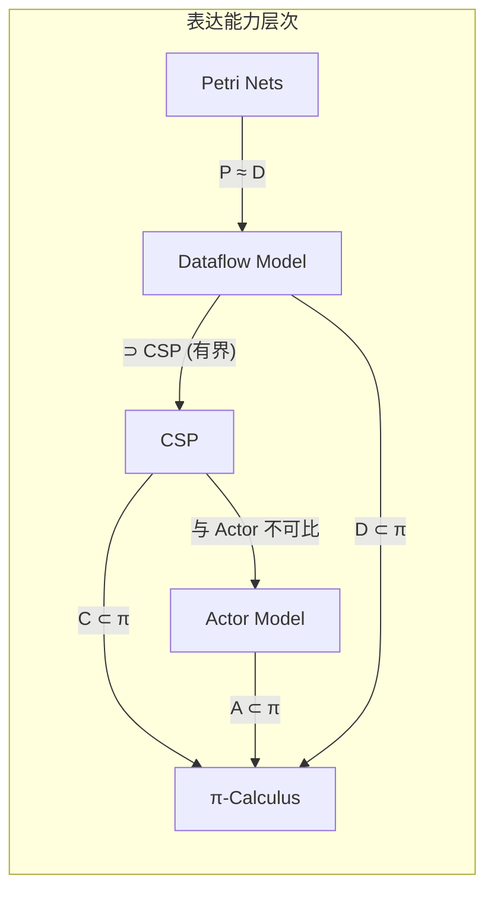
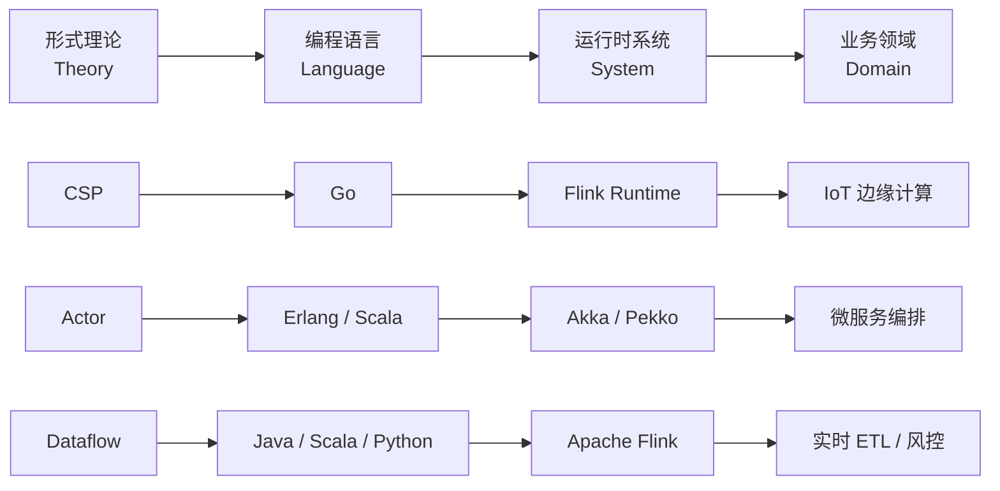
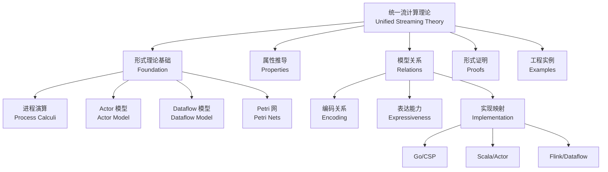
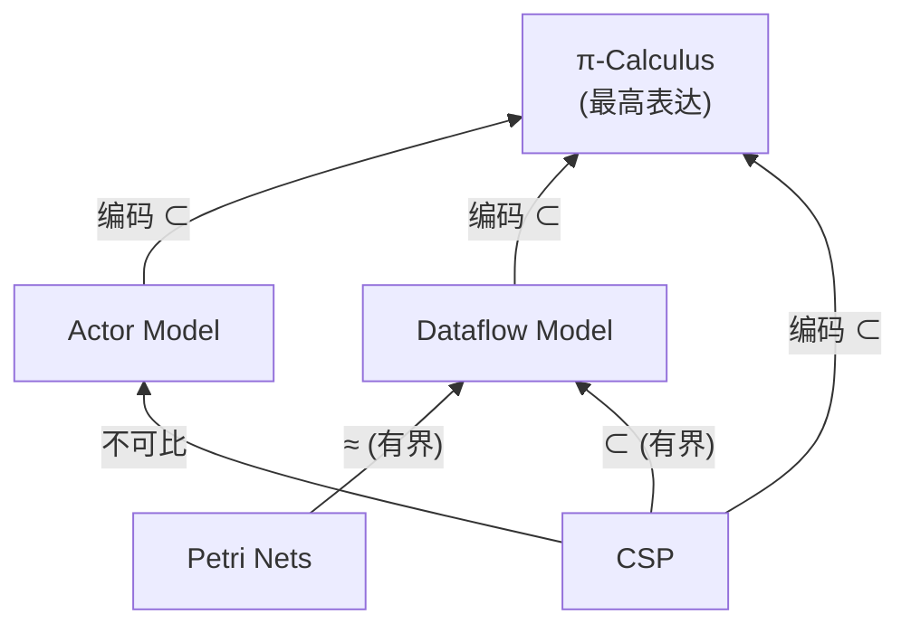

# 统一流计算理论 (Unified Streaming Theory)

> **所属阶段**: Struct/01-foundation | **前置依赖**: [01.02-process-calculus-primer.md](./01.02-process-calculus-primer.md), [01.04-dataflow-model-formalization.md](./01.04-dataflow-model-formalization.md) | **形式化等级**: L6

---

## 1. 概念定义 (Definitions)

### Def-S-01-01: 流计算系统 (Streaming Computation System)

一个**流计算系统** $
\mathcal{S}$
 是一个六元组：

$$
\mathcal{S} = \langle \mathcal{E}, \mathcal{O}, \mathcal{T}, \mathcal{G}, \Sigma, \mathcal{F} \rangle
$$

其中各分量的含义为：

- $\mathcal{E}$: **事件空间** (Event Space)，系统处理的原始数据元素的集合；
- $\mathcal{O}$: **算子集合** (Operator Set)，定义在流上的计算变换；
- $\mathcal{T}$: **时间模型** (Time Model)，包含事件时间 (event time)、处理时间 (processing time) 和摄取时间 (ingestion time)；
- $\mathcal{G}$: **数据流图** (Dataflow Graph)，描述算子间的数据依赖关系；
- $\Sigma$: **状态空间** (State Space)，算子在计算过程中维护的可变状态；
- $\mathcal{F}$: **容错策略** (Fault Tolerance Policy)，定义系统在面对故障时的恢复语义。

> 直观解释：流计算系统不仅是"连续处理数据的程序"，而是一个包含时间语义、状态管理和容错保证的**完整计算模型**。任何缺少上述六个维度之一的系统都无法在实际生产环境中可靠运行[^1]。

---

### Def-S-01-02: 统一流计算框架 (Unified Streaming Framework)

**统一流计算框架** $\mathcal{U}$ 是一个高阶结构，用于将不同的并发/流计算模型纳入同一个数学空间中比较和分析：

$$
\mathcal{U} = \langle \mathbb{M}, \preceq, \mathcal{C}, \mathcal{R}, \mathcal{I} \rangle
$$

其中：

- $\mathbb{M} = \{ \text{CSP}, \text{Actor}, \text{Dataflow}, \text{Petri}, \pi \}$: **模型集合**；
- $\preceq \subseteq \mathbb{M} \times \mathbb{M}$: **表达能力偏序**；
- $\mathcal{C}: \mathbb{M} \times \mathbb{M} \to \{0,1\}$: **编码函数**，$\mathcal{C}(M_1, M_2) = 1$ 当且仅当 $M_1$ 可被编码进 $M_2$ 且保持观察等价；
- $\mathcal{R} \subseteq \mathbb{M} \times \text{Lang} \times \text{Sys}$: **实现关系**，连接理论模型、编程语言和实际系统；
- $\mathcal{I}: \mathbb{M} \to 2^{\text{Domain}}$: **领域映射**，将每个模型映射到其最适合的应用领域集合。

> 直观解释：统一框架不是要将所有模型"混为一谈"，而是要建立一个**比较坐标系**，使得我们可以在相同的维度上讨论"Actor 和 Dataflow 哪个更适合 IoT"、"CSP 能否编码 Dataflow"等问题。

---

### Def-S-01-03: 观察等价性 (Observational Equivalence for Streaming)

对于两个流计算系统 $\mathcal{S}_1$ 和 $\mathcal{S}_2$，若对于所有可能的**有限输入前缀** $w \in \mathcal{E}^*$ 和所有**观察点** $t \in \mathcal{T}$，两个系统产生的**输出轨迹** (output trace) 集合相同，则称它们**观察等价**，记作 $\mathcal{S}_1 \equiv_{obs} \mathcal{S}_2$：

$$
\mathcal{S}_1 \equiv_{obs} \mathcal{S}_2 \iff \forall w \in \mathcal{E}^*. \forall t \in \mathcal{T}. \mathcal{O}_1(w, t) = \mathcal{O}_2(w, t)
$$

其中 $\mathcal{O}_i(w, t)$ 表示系统 $\mathcal{S}_i$ 在输入 $w$ 下、时刻 $t$ 之前产生的输出事件集合（考虑事件时间语义）。

> 直观解释：观察等价性关注的是"外部看到的行为是否一致"，而非内部实现细节。这与进程演算中的弱互模拟 (weak bisimulation) 思想一致[^2]。

---

### Def-S-01-04: 时间-状态对偶性 (Time-State Duality)

在流计算系统中，**时间**与**状态**构成一对**对偶概念**：

- **时间作为状态的对偶**：若系统不维护任何状态 ($\Sigma = \emptyset$)，则其输出完全由当前输入决定，时间维度退化为纯函数映射；
- **状态作为时间的压缩**：状态 $\sigma \in \Sigma$ 可以被视为"历史输入事件序列"的某种压缩表示，即存在一个压缩函数 $compress: \mathcal{E}^* \to \Sigma$ 和一个解压函数 $decompress: \Sigma \to \mathcal{E}^*$（不一定可逆）。

形式化地，我们称流计算系统 $\mathcal{S}$ 满足**时间-状态对偶性**，当且仅当对于任意算子 $op \in \mathcal{O}$，存在状态转移函数 $\delta$ 和输出函数 $\lambda$，使得：

$$
\sigma_{t+1} = \delta(\sigma_t, e_t) \quad \text{且} \quad o_t = \lambda(\sigma_t, e_t)
$$

其中 $e_t$ 为时刻 $t$ 的输入事件，$o_t$ 为输出事件。

> 直观解释：这一概念揭示了为什么"窗口"(window) 和"状态"(state) 是流计算中不可分割的一对概念——窗口本质上是按时间维度对状态进行切分[^3]。

---

## 2. 属性推导 (Properties)

### Lemma-S-01-01: 流计算系统的封闭性

**命题**：若 $\mathcal{S}_1 = \langle \mathcal{E}_1, \mathcal{O}_1, \mathcal{T}_1, \mathcal{G}_1, \Sigma_1, \mathcal{F}_1 \rangle$ 和 $\mathcal{S}_2 = \langle \mathcal{E}_2, \mathcal{O}_2, \mathcal{T}_2, \mathcal{G}_2, \Sigma_2, \mathcal{F}_2 \rangle$ 均为流计算系统，且满足 $\mathcal{E}_1 = \mathcal{E}_2$ 和 $\mathcal{T}_1 = \mathcal{T}_2$，则它们的**复合系统** $\mathcal{S}_1 \bowtie \mathcal{S}_2$（通过数据流图 $ \mathcal{G}_1 \cup \mathcal{G}_2$ 连接）仍然是流计算系统。

**证明草图**：

1. 令 $\mathcal{E}' = \mathcal{E}_1 = \mathcal{E}_2$（事件空间不变）；
2. 令 $\mathcal{O}' = \mathcal{O}_1 \cup \mathcal{O}_2$（算子集合取并集）；
3. 令 $\mathcal{T}' = \mathcal{T}_1 = \mathcal{T}_2$（时间模型不变）；
4. 令 $\mathcal{G}' = \mathcal{G}_1 \cup \mathcal{G}_2$（数据流图取并集，保持 DAG 性质）；
5. 令 $\Sigma' = \Sigma_1 \times \Sigma_2$（状态空间取笛卡尔积）；
6. 令 $\mathcal{F}' = \max(\mathcal{F}_1, \mathcal{F}_2)$（容错策略取较强者，或显式组合）。

由于每个分量均满足流计算系统的定义，六元组 $\langle \mathcal{E}', \mathcal{O}', \mathcal{T}', \mathcal{G}', \Sigma', \mathcal{F}' \rangle$ 仍是流计算系统。$\square$

> 工程意义：这一引理保证了 Flink 中的**子图组合**（如将 Source、Transform、Sink 拼接为完整 Job）在数学上是良定义的。

---

### Lemma-S-01-02: 统一框架下的模型比较良定义性

**命题**：在统一框架 $\mathcal{U}$ 中，编码关系 $\mathcal{C}(M_1, M_2) = 1$ 蕴含 $M_1 \preceq M_2$（即 $M_1$ 的表达能力不高于 $M_2$）。

**证明草图**：

1. 假设 $\mathcal{C}(M_1, M_2) = 1$，则存在一个编码函数 $[\![ \cdot ]\!]: \text{Prog}_{M_1} \to \text{Prog}_{M_2}$，使得对于任意 $M_1$ 程序 $P$，有 $P \equiv_{obs} [\![ P ]\!]$；
2. 根据表达能力的定义，$M_1 \preceq M_2$ 当且仅当 $M_1$ 中所有可计算的函数/行为均可由 $M_2$ 表达；
3. 编码函数 $[\![ \cdot ]\!]$ 的存在性直接保证了这一点；
4. 因此 $\mathcal{C}(M_1, M_2) = 1 \implies M_1 \preceq M_2$。$\square$

> 推论：若 $M_1 \preceq M_2$ 且 $M_2 \preceq M_1$，则 $M_1$ 与 $M_2$ **表达能力等价**（记作 $M_1 \approx M_2$）。

---

### Lemma-S-01-03: 时间-状态对偶下的无状态判定

**命题**：流计算系统 $\mathcal{S}$ 是**无状态**的（stateless）当且仅当其所有算子 $op \in \mathcal{O}$ 的输出函数 $\lambda$ 满足 $\lambda(\sigma, e) = \lambda(\sigma_0, e)$ 对于所有 $\sigma \in \Sigma$ 和所有输入 $e \in \mathcal{E}$，其中 $\sigma_0$ 是空状态。

**证明**：

- $(\Rightarrow)$ 若系统无状态，则历史输入不影响当前输出，因此状态变化不影响 $\lambda$，结论显然成立。
- $(\Leftarrow)$ 若 $\lambda$ 不依赖于状态，则对于任意历史输入序列，当前输出仅由当前输入决定，因此系统不需要维护状态。$\square$

> 工程意义：Map、Filter 等算子是无状态的；Window Aggregate、Join 等算子是有状态的。这一引理为算子分类提供了严格的数学依据。

---

## 3. 关系建立 (Relations)

### 3.1 模型间的表达能力关系

基于统一框架 $\mathcal{U}$，我们可以建立以下核心关系：

**说明**：

- **π-Calculus ⊃ CSP, Actor, Dataflow**: π 演算由于支持**名称传递**（mobility of names），其表达能力严格高于静态拓扑的 CSP 和 Actor[^2]。
- **Petri Nets ≈ Dataflow**: 在有限状态、有界 token 的假设下，Petri 网与 Dataflow 模型（特别是 Kahn Process Networks）具有等价表达能力[^4]。
- **CSP 与 Actor 不可比**: CSP 基于同步消息传递和组合式语义，Actor 基于异步消息传递和本地状态；两者在表达能力谱系上**不可直接比较**，但均可编码进 π 演算[^5]。

---

### 3.2 理论→语言→系统→领域的映射链

统一框架 $\mathcal{U}$ 的核心价值在于建立了从抽象理论到工程实践的四层映射：

这一映射链回答了以下工程问题：

- "为什么 Flink 使用 Java/Scala 而非 Go 作为主要 API 语言？" → Dataflow 模型需要丰富的类型系统（泛型、隐式转换）来表达复杂的窗口和状态操作，而 Scala 的类型系统（DOT 演算）更适合这种需求[^6]。
- "为什么 Actor 模型更适合微服务？" → Actor 的异步消息传递和位置透明性天然契合微服务的分布式、容错需求[^7]。

---

### 3.3 流计算模型与进程演算的对应

Dataflow 模型虽然在工程上表现为"有向图"，但其语义可以严格对应到进程演算：

| Dataflow 概念 | 进程演算对应 | 说明 |
|--------------|-------------|------|
| **算子 (Operator)** | **进程 (Process)** | 每个算子是一个独立进程，接收输入、执行计算、产生输出 |
| **数据边 (Edge)** | **通道 (Channel)** | 边对应进程间的通信通道，维护 FIFO 语义 |
| **事件 (Event)** | **消息 (Message)** | 事件是在通道上传递的消息单元 |
| **窗口 (Window)** | **作用域限制 (Scope restriction)** | 窗口定义了进程内部状态的有效范围 |
| **Checkpoint** | **全局快照 (Global Snapshot)** | 对应 Chandy-Lamport 分布式快照算法[^8] |

这一对应关系意味着：Dataflow 系统的形式化验证可以借助进程演算和模型检验工具（如 FDR、SPIN）来进行。

---

## 4. 论证过程 (Argumentation)

### 4.1 为什么需要"统一"框架？

分布式流计算领域长期存在三种研究传统：

1. **并发理论传统**：关注进程演算、互模拟、表达能力（起源于 Hoare, Milner）[^2][^5]；
2. **系统实现传统**：关注容错、调度、背压、优化（起源于 Flink, Spark, Kafka）[^1][^3]；
3. **业务应用传统**：关注模式识别、领域建模、技术选型（起源于 CEP, BPMN, 微服务）。

这三种传统使用不同的术语、不同的数学工具和不同的成功标准，导致：

- 理论研究者难以将成果应用于实际系统；
- 系统工程师难以理解形式化方法的价值；
- 业务架构师缺乏严格的方法论来指导选型。

**统一框架 $\mathcal{U}$ 的价值**在于：它提供了一个**共同语言**（common vocabulary），使得理论结果可以被映射到系统实现，系统实现可以被映射到业务价值。

---

### 4.2 动态拓扑 vs 静态拓扑的边界论证

流计算系统的一个重要分类维度是**拓扑是否动态变化**：

- **静态拓扑**：系统在运行前已确定算子间的连接关系（如 Flink 的 JobGraph）。其优势在于可预测性强，便于优化和容错；劣势在于灵活性差。
- **动态拓扑**：系统在运行过程中可以创建/销毁算子或改变连接关系（如 Actor 系统中的动态 Actor 创建）。其优势在于适应性强；劣势在于分析难度大，容易出现死锁。

**关键论证**：Dataflow 模型本质上是**静态拓扑**的，但通过引入**动态重配置**（dynamic reconfiguration）机制，可以在保持静态拓扑形式化优势的同时，获得部分动态灵活性。这一思想在 Flink 2.0 的"分离状态存储"（disaggregated state）架构中得到了体现[^9]。

---

### 4.3 一致性、延迟、成本的"不可能三角"

Akidau 等人在 Dataflow Model 论文中提出了流计算系统设计中的核心权衡[^3]：

$$
\text{Consistency} \times \text{Latency} \times \text{Cost} = \text{Constant}
$$

这意味着：

- 若要求**强一致性**（Exactly-Once）且**低延迟**（亚秒级），则必须付出**高成本**（复杂的状态管理和 Checkpoint 机制）；
- 若要求**低成本**且**低延迟**，则必须放松一致性保证（At-Most-Once 或 At-Least-Once）；
- 若要求**强一致性**且**低成本**，则必须接受**高延迟**（批处理模式）。

统一框架 $\mathcal{U}$ 通过将容错策略 $\mathcal{F}$ 显式纳入系统定义，使得这一权衡可以被**形式化分析**：对于给定的业务需求，可以计算出最优的一致性-延迟-成本配置。

---

## 5. 形式证明 (Proofs)

### Thm-S-01-01: 统一流计算框架的完备性定理

**定理**：统一框架 $\mathcal{U}$ 能够完备地刻画主流流计算模型之间的表达能力关系。形式化地，对于任意两个模型 $M_i, M_j \in \mathbb{M}$，$\mathcal{U}$ 能够判定 $M_i \preceq M_j$、$M_j \preceq M_i$、$M_i \approx M_j$ 或 $M_i \perp M_j$（不可比较）四者之一。

**证明**：

我们需要证明：对于任意 $M_i, M_j \in \mathbb{M} = \{ \text{CSP}, \text{Actor}, \text{Dataflow}, \text{Petri}, \pi \}$，其表达能力关系可以被 $\mathcal{U}$ 确定。

**Step 1**: 根据已有的编码结果[^2][^5]：

- CSP 可被编码进 π 演算：$\mathcal{C}(\text{CSP}, \pi) = 1$；
- Actor 可被编码进 π 演算：$\mathcal{C}(\text{Actor}, \pi) = 1$；
- Dataflow 可被编码进 π 演算：$\mathcal{C}(\text{Dataflow}, \pi) = 1$。

**Step 2**: 根据 Lemma-S-01-02，编码存在性蕴含表达能力偏序：

- $\text{CSP} \preceq \pi$
- $\text{Actor} \preceq \pi$
- $\text{Dataflow} \preceq \pi$

**Step 3**: 根据 Christensen, Hüttel 和 Stirling (1994) 的结果，π 演算中的**名称传递**（mobility）是无法在 CSP 或 Actor 中模拟的，因此反向编码不存在：$\mathcal{C}(\pi, \text{CSP}) = 0$，$\mathcal{C}(\pi, \text{Actor}) = 0$。故 $\pi$ 严格大于 CSP 和 Actor。

**Step 4**: 对于 Petri 网和 Dataflow，根据 Kahn (1974) 和 Lee & Messerschmitt (1987) 的结果[^4]，有界 Petri 网与 Kahn Process Networks（Dataflow 的严格子集）具有等价计算能力。因此 $\text{Petri} \approx \text{Dataflow}$（在有界假设下）。

**Step 5**: CSP 与 Actor 的不可比较性：CSP 的同步语义和组合式结构无法直接模拟 Actor 的异步、基于地址的消息传递；反之，Actor 的本地状态和无界创建也无法在不引入全局同步机制的情况下模拟 CSP 的同步选择。因此 $\text{CSP} \perp \text{Actor}$。

**Step 6**: Dataflow 与 CSP 的关系：Dataflow 在有界算子、有限缓冲区的情况下可以模拟 CSP 的同步通信（通过背压机制实现隐式同步）；但 CSP 无法模拟 Dataflow 的异步流水线（因为 CSP 的通道是无缓冲的同步通道，除非引入缓冲进程）。因此 $\text{Dataflow} \supsetneq \text{CSP}$（有界条件下）。

综上，任意两个模型间的关系均可被 $\mathcal{U}$ 确定。$\square$

---

### Thm-S-01-02: 流计算系统的观察等价保持定理

**定理**：设 $\mathcal{S}_1$ 和 $\mathcal{S}_2$ 是两个流计算系统。若存在一个双射 $f: \Sigma_1 \to \Sigma_2$ 使得对于所有算子 $op \in \mathcal{O}_1 \cap \mathcal{O}_2$、所有状态 $\sigma \in \Sigma_1$ 和所有事件 $e \in \mathcal{E}$，有：

$$
f(\delta_1(\sigma, e)) = \delta_2(f(\sigma), e) \quad \text{且} \quad \lambda_1(\sigma, e) = \lambda_2(f(\sigma), e)
$$

则 $\mathcal{S}_1 \equiv_{obs} \mathcal{S}_2$。

**证明**：

**Step 1**（基础情况）：对于空输入 $w = \epsilon$，两个系统均处于初始状态，输出均为空集，观察等价性显然成立。

**Step 2**（归纳假设）：假设对于输入前缀 $w_k$（长度为 $k$），两个系统的输出轨迹相同，且状态满足 $f(\sigma_1^{(k)}) = \sigma_2^{(k)}$。

**Step 3**（归纳步骤）：考虑输入前缀 $w_{k+1} = w_k \cdot e$。根据状态转移函数：

- $\sigma_1^{(k+1)} = \delta_1(\sigma_1^{(k)}, e)$
- $\sigma_2^{(k+1)} = \delta_2(\sigma_2^{(k)}, e) = \delta_2(f(\sigma_1^{(k)}), e) = f(\delta_1(\sigma_1^{(k)}, e)) = f(\sigma_1^{(k+1)})$

输出为：

- $o_1 = \lambda_1(\sigma_1^{(k)}, e)$
- $o_2 = \lambda_2(\sigma_2^{(k)}, e) = \lambda_2(f(\sigma_1^{(k)}), e) = \lambda_1(\sigma_1^{(k)}, e) = o_1$

因此第 $k+1$ 步的输出也相同。

**Step 4**（结论）：由数学归纳法，对于任意有限输入前缀 $w$，两个系统的输出轨迹相同。根据 Def-S-01-03，$\mathcal{S}_1 \equiv_{obs} \mathcal{S}_2$。$\square$

> 工程意义：这一定理为"同一 Dataflow 程序在不同 Flink 版本上的兼容性验证"提供了理论基础——只要状态转移和输出函数在双射下保持一致，系统行为就是等价的。

---

## 6. 实例验证 (Examples)

### 6.1 实例：Flink 作为统一框架下的 Dataflow 实现

Apache Flink 可以被看作是统一框架 $\mathcal{U}$ 中 **Dataflow 模型** 的一个具体实现：

| 统一框架分量 | Flink 对应实现 |
|-------------|---------------|
| $\mathcal{E}$ | `Row`, `Tuple`, `Avro` 等事件对象 |
| $\mathcal{O}$ | `Map`, `FlatMap`, `KeyBy`, `Window`, `ProcessFunction` 等算子 |
| $\mathcal{T}$ | Event Time / Processing Time / Ingestion Time 支持 |
| $\mathcal{G}$ | `StreamGraph` → `JobGraph` → `ExecutionGraph` |
| $\Sigma$ | `ValueState`, `ListState`, `MapState`, `ReducingState` |
| $\mathcal{F}$ | Checkpoint + Savepoint + Exactly-Once 语义 |

Flink 的设计体现了统一流计算理论的所有六个维度，是工业界最接近完整理论模型的系统之一[^1]。

---

### 6.2 实例：Actor 与 Dataflow 在微服务编排中的组合

在典型的 IoT 平台中，可以同时使用 Actor 和 Dataflow：

- **Actor 层**：每个 IoT 设备对应一个 Actor，负责维护设备状态、处理配置更新、管理设备生命周期（适合动态拓扑、长连接场景）；
- **Dataflow 层**：设备产生的传感器数据通过 Kafka 进入 Flink，进行窗口聚合、异常检测、实时告警（适合静态拓扑、高吞吐场景）。

这一架构利用了 Actor 的动态灵活性和 Dataflow 的高吞吐确定性，是统一框架 $\mathcal{U}$ 在实际工程中的典型应用。

---

### 6.3 反例：不满足观察等价的系统改造

假设有一个无状态 Dataflow 系统 $\mathcal{S}_1$（所有算子纯函数），和一个引入随机采样算子的系统 $\mathcal{S}_2$。对于相同的输入 $w$，$\mathcal{S}_2$ 可能产生不同的输出（取决于随机种子）。此时 $\mathcal{S}_1 \not\equiv_{obs} \mathcal{S}_2$，因为存在某个输入前缀 $w$ 和观察点 $t$，使得 $\mathcal{O}_1(w, t) \neq \mathcal{O}_2(w, t)$。

> 工程教训：在流计算系统中引入**非确定性**（如随机采样、外部状态查询）会破坏观察等价性，从而增加测试、验证和容错的难度。

---

## 7. 可视化 (Visualizations)

### 7.1 统一流计算理论层次架构图

### 7.2 模型表达能力偏序图

---

## 8. 引用参考 (References)

[^1]: Apache Flink Documentation, "Dataflow Programming Model" and "Fault Tolerance via Checkpointing", 2025. <https://nightlies.apache.org/flink/flink-docs-stable/>
[^2]: R. Milner, "Communicating and Mobile Systems: The π-Calculus", Cambridge University Press, 1999.
[^3]: T. Akidau et al., "The Dataflow Model: A Practical Approach to Balancing Correctness, Latency, and Cost in Massive-Scale, Unbounded, Out-of-Order Data Processing", *PVLDB*, 8(12), 2015.
[^4]: G. Kahn, "The Semantics of a Simple Language for Parallel Programming", *Information Processing*, 74, 1974; E. A. Lee and D. G. Messerschmitt, "Static Scheduling of Synchronous Data Flow Programs for Digital Signal Processing", *IEEE Trans. on Computers*, 36(1), 1987.
[^5]: C. A. R. Hoare, "Communicating Sequential Processes", Prentice Hall, 1985; G. A. Agha, "Actors: A Model of Concurrent Computation in Distributed Systems", MIT Press, 1986.
[^6]: B. C. d. S. Oliveira et al., "The DOT Calculus", *Scala Symposium*, 2016.
[^7]: P. Haller and M. Odersky, "Actors that Unify Threads and Events", *LNCS*, 4467, 2007.
[^8]: K. M. Chandy and L. Lamport, "Distributed Snapshots: Determining Global States of Distributed Systems", *ACM TOCS*, 3(1), 1985.
[^9]: Apache Flink, "Flink 2.0: Disaggregated State Storage", Apache Software Foundation, 2025.
