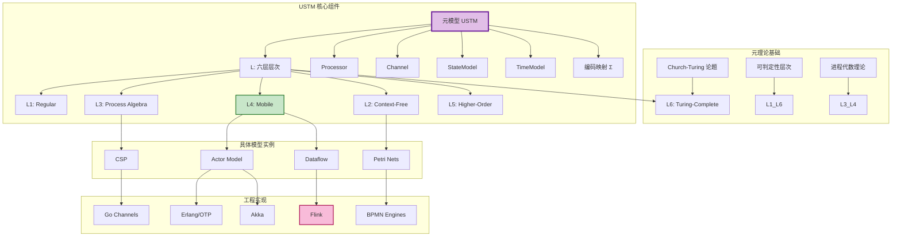
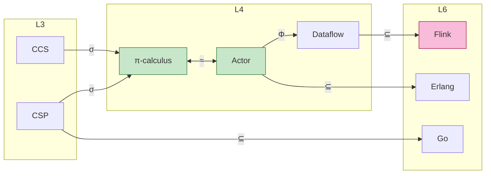

# 统一流计算理论 (Unified Streaming Theory)

> 所属阶段: Struct | 前置依赖: [相关文档] | 形式化等级: L3

> **文档定位**: 流计算形式理论的统一元模型，整合 Actor、CSP、Dataflow、Petri 网四大范式
> **形式化等级**: L6 (图灵完备) | **前置依赖**: 无（本层为根基）
> **版本**: 2026.04

---

## 目录

- [统一流计算理论 (Unified Streaming Theory)](#统一流计算理论-unified-streaming-theory)
  - [目录](#目录)
  - [1. 概念定义 (Definitions)](#1-概念定义-definitions)
    - [1.1 元模型核心定义](#11-元模型核心定义)
    - [1.2 六层表达能力层次](#12-六层表达能力层次)
    - [1.3 处理器形式化](#13-处理器形式化)
    - [1.4 通道形式化](#14-通道形式化)
    - [1.5 时间模型形式化](#15-时间模型形式化)
    - [1.6 一致性模型形式化](#16-一致性模型形式化)
    - [1.7 统一并发模型表示 (UCM)](#17-统一并发模型表示-ucm)
  - [2. 属性推导 (Properties)](#2-属性推导-properties)
    - [2.1 元模型的一致性保证](#21-元模型的一致性保证)
    - [2.2 映射的传递性](#22-映射的传递性)
    - [2.3 层次完备格结构](#23-层次完备格结构)
    - [2.4 时间模型的偏序性](#24-时间模型的偏序性)
  - [3. 关系建立 (Relations)](#3-关系建立-relations)
    - [3.1 模型间表达能力关系](#31-模型间表达能力关系)
    - [3.2 模型到实现的映射](#32-模型到实现的映射)
    - [3.3 跨层推理关系](#33-跨层推理关系)
  - [4. 论证过程 (Argumentation)](#4-论证过程-argumentation)
    - [4.1 统一元理论的完备性论证](#41-统一元理论的完备性论证)
    - [4.2 六层层次的严格性论证](#42-六层层次的严格性论证)
    - [4.3 流计算确定性的边界论证](#43-流计算确定性的边界论证)
  - [5. 形式证明 (Proofs)](#5-形式证明-proofs)
    - [定理 5.1 (统一流计算系统的组合性)](#定理-51-统一流计算系统的组合性)
    - [定理 5.2 (表达能力层次判定)](#定理-52-表达能力层次判定)
  - [6. 实例验证 (Examples)](#6-实例验证-examples)
    - [6.1 Flink 作为 USTM 实例](#61-flink-作为-ustm-实例)
    - [6.2 Actor 系统映射](#62-actor-系统映射)
  - [7. 可视化 (Visualizations)](#7-可视化-visualizations)
    - [图 7.1 USTM 概念依赖图](#图-71-ustm-概念依赖图)
    - [图 7.2 模型间编码关系图](#图-72-模型间编码关系图)
  - [8. 引用参考 (References)](#8-引用参考-references)
  - [关联文档](#关联文档)

## 1. 概念定义 (Definitions)

### 1.1 元模型核心定义

**定义 1.1 (统一流计算元模型 USTM)**.

$$
\text{USTM} ::= (\mathcal{L}, \mathcal{M}, \mathcal{P}, \mathcal{C}, \mathcal{S}, \mathcal{T}, \Sigma, \Phi)
$$

| 组件 | 类型 | 语义 |
|------|------|------|
| $\mathcal{L}$ | $\{L_1, L_2, L_3, L_4, L_5, L_6\}$ | 六层表达能力层次 (见 Def-S-01-02) |
| $\mathcal{M}$ | $\text{Set}(\text{MetaModel})$ | 元模型集合：Actor, CSP, Dataflow, Petri |
| $\mathcal{P}$ | $\text{Set}(\text{Processor})$ | 处理器/进程集合 |
| $\mathcal{C}$ | $\text{Set}(\text{Channel})$ | 通道/连接集合 |
| $\mathcal{S}$ | $\text{StateModel}$ | 状态模型 |
| $\mathcal{T}$ | $\text{TimeModel}$ | 时间模型 |
| $\Sigma$ | $\text{EncodingMap}$ | 模型间编码映射族 |
| $\Phi$ | $\text{PropertyMap}$ | 性质保持映射 |

**系统不变式**:

$$
\begin{aligned}
&\text{(I1) 拓扑闭包}: &&\forall p \in \mathcal{P}. \; \text{inputs}(p) \cup \text{outputs}(p) \subseteq \mathcal{C} \\
&\text{(I2) 通道端点}: &&\forall c \in \mathcal{C}. \; |\text{src}(c)| = 1 \land |\text{dst}(c)| \geq 1 \\
&\text{(I3) 状态归属}: &&\forall s \in \mathcal{S}. \; \exists! p \in \mathcal{P}. \; \text{owner}(s) = p
\end{aligned}
$$

---

### 1.2 六层表达能力层次

**定义 1.2 (表达能力层次 $\mathcal{L}$)**.

$$
L_1 \subset L_2 \subset L_3 \subset L_4 \subset L_5 \subseteq L_6
$$

| 层次 | 名称 | 形式模型 | 表达能力 | 可判定性 | 典型系统 |
|------|------|----------|----------|----------|----------|
| $L_1$ | Regular | FSM, 正则表达式 | 正则语言 | P-完全 | 有限状态工作流 |
| $L_2$ | Context-Free | PDA, 基本 Petri 网 | 上下文无关 | PSPACE-完全 | 基础工作流引擎 |
| $L_3$ | Process Algebra | CSP, CCS, ACP | 静态名称通信 | EXPTIME | FDR, Go Channels |
| $L_4$ | Mobile | $\pi$-calculus, Actor, Dataflow | 动态拓扑 | 部分可判定 | Erlang, Akka, Flink |
| $L_5$ | Higher-Order | HO-$\pi$, Ambient | 进程作为数据 | 大部分不可判定 | 高级移动代理 |
| $L_6$ | Turing-Complete | $\lambda$-演算, 图灵机 | 所有可计算 | 不可判定 | Go, Scala, 通用语言 |

**层次包含定理**:

$$
\forall i < j. \; L_i \subset L_j \; \text{(严格包含)}
$$

---

### 1.3 处理器形式化

**定义 1.3 (Processor)**.

$$
\text{Processor} ::= (\mathcal{I}, \mathcal{O}, \mathcal{F}, \mathcal{A}, \sigma)
$$

其中：

| 组件 | 类型 | 语义 |
|------|------|------|
| $\mathcal{I}$ | $\text{Set}(\text{InputPort})$ | 输入端口集合 |
| $\mathcal{O}$ | $\text{Set}(\text{OutputPort})$ | 输出端口集合 |
| $\mathcal{F}$ | $\text{Computation}$ | 计算函数 $\mathcal{I}^* \times \mathcal{S} \rightarrow \mathcal{O}^* \times \mathcal{S} \times \text{Effect}^*$ |
| $\mathcal{A}$ | $\text{StateAccessPattern}$ | 状态访问模式：ReadOnly \| ReadWrite \| Accumulate |
| $\sigma$ | $\text{State}$ | 处理器私有状态 |

**处理器分类**:

```
Processor
├── StatelessProcessor
│   └── F: I → O (纯函数)
├── StatefulProcessor
│   ├── KeyedProcessor (按键分区)
│   │   └── F: (K, V) × State[K] → State[K] × O
│   └── OperatorProcessor (算子级)
│       └── F: I × State → State × O
└── BoundaryProcessor
    ├── SourceProcessor (无输入)
    └── SinkProcessor (无输出)
```

---

### 1.4 通道形式化

**定义 1.4 (Channel)**.

$$
\text{Channel} ::= (\mathcal{B}, \mathcal{O}, \mathcal{D}, \tau)
$$

其中：

| 组件 | 类型 | 语义 |
|------|------|------|
| $\mathcal{B}$ | $\text{Buffer}(T, \text{Capacity})$ | 缓冲队列 |
| $\mathcal{O}$ | $\text{Ordering}$ | 排序保证：FIFO \| Ordered(K) \| Unordered |
| $\mathcal{D}$ | $\text{DeliveryGuarantee}$ | 交付保证：AtMostOnce \| AtLeastOnce \| ExactlyOnce |
| $\tau$ | $\text{Transport}$ | 传输机制：Memory \| Network \| File |

**通道类型对应**:

| 系统 | Buffer | Ordering | Delivery |
|------|--------|----------|----------|
| **Flink** | 有限 Network Buffer | FIFO (per partition) | ExactlyOnce (with Checkpoint) |
| **Akka** | 有限/无限 Mailbox | FIFO | AtMostOnce |
| **Go** | 有限 Channel | FIFO | AtMostOnce (同步) |
| **KPN** | 无限 FIFO | FIFO | ExactlyOnce (理论) |

---

### 1.5 时间模型形式化

**定义 1.5 (TimeModel)**.

$$
\text{TimeModel} ::= \text{EventTime}(t_e) \mid \text{ProcessingTime}(t_p) \mid \text{IngestionTime}(t_i)
$$

| 类型 | 定义 | 形式化 |
|------|------|--------|
| **EventTime** | 数据产生时间 | $t_e: \text{Record} \rightarrow \text{Timestamp}$ |
| **ProcessingTime** | 处理执行时间 | $t_p: () \rightarrow \text{Timestamp}_{wall}$ |
| **IngestionTime** | 进入系统时间 | $t_i: \text{Record} \rightarrow \text{Timestamp}_{system}$ |

**Watermark 形式化**:

$$
\text{Watermark}(t_w) ::= \forall e \in \text{Stream}. \; t_e(e) \leq t_w \lor \text{late}(e)
$$

**时间窗口类型**:

| 窗口类型 | 定义 | 触发条件 |
|----------|------|----------|
| Tumbling($\delta$) | $[n\delta, (n+1)\delta)$ | Watermark $\geq (n+1)\delta$ |
| Sliding($\delta$, slide) | $[n \cdot \text{slide}, n \cdot \text{slide} + \delta)$ | Watermark $\geq$ 窗口结束 |
| Session(gap) | 动态，由活动间隔定义 | 无活动超过 gap |

---

### 1.6 一致性模型形式化

**定义 1.6 (Consistency Model)**.

$$
\text{Consistency} ::= \text{AtMostOnce} \mid \text{AtLeastOnce} \mid \text{ExactlyOnce}
$$

**端到端一致性层次**:

$$
\text{ExactlyOnce} \supset \text{AtLeastOnce} \supset \text{AtMostOnce}
$$

| 级别 | 语义 | 实现机制 |
|------|------|----------|
| **ExactlyOnce** | 每条记录对系统状态的影响恰好一次 | Checkpoint + 2PC / 幂等 Sink |
| **AtLeastOnce** | 记录至少被处理一次，可能重复 | Checkpoint + 重放 |
| **AtMostOnce** | 记录最多被处理一次，可能丢失 | 无容错，失败即丢弃 |

---

### 1.7 统一并发模型表示 (UCM)

**定义 1.7 (UCM — Unified Concurrent Model)**.

$$
\text{UCM} = (S, A, C, T, \delta, \iota, \omega)
$$

其中：

| 组件 | 类型 | 语义 |
|------|------|------|
| $S$ | $\text{StateSpace}$ | 状态空间 |
| $A$ | $\text{Set}(\text{Actor/Process})$ | Actor/进程集合 |
| $C$ | $\text{Set}(\text{Channel})$ | 通信信道集合 |
| $T$ | $\text{Set}(\text{Transition})$ | 变迁/转移集合 |
| $\delta$ | $S \times T \rightarrow S$ | 状态转移函数 |
| $\iota$ | $A \times C \rightharpoonup A \times C$ | 接口/连接关系 |
| $\omega$ | $T \rightarrow (\text{Guard} \times \text{Action})$ | 变迁的守卫-动作 |

**各模型的 UCM 特化**:

| 模型 | UCM 特化 |
|------|----------|
| **Actor** | $C = A \times A$ (信道由 Actor 地址对隐式定义)，通信异步，$\omega$ 包含 spawn 操作 |
| **CSP** | $C$ 是静态命名集合，$\iota$ 声明时静态连接，通信同步，$\omega$ 包含外部选择 |
| **Dataflow** | $A$ = 算子集合，$C$ = 有向边，执行由数据可用性驱动 ($\omega$.Guard = tokens_ready) |
| **Petri网** | $A$ = 变迁集合，$C$ = 库所集合，$\iota$ = 流关系 $F \subseteq (C \times A) \cup (A \times C)$ |

---

## 2. 属性推导 (Properties)

### 2.1 元模型的一致性保证

**性质 1 (Consistency Preservation)**.

若 MM 满足一致性，则对于任意编码链 $\sigma_{1n} = \sigma_{12} \circ \sigma_{23} \circ ... \circ \sigma_{(n-1)n}$，Consistency 在链上保持。

**推导**:

1. 单个编码 $\sigma_{ij}$ 保持一致性：$\text{Consistent}(M_i) \Rightarrow \text{Consistent}(\sigma_{ij}(M_i))$
2. 归纳应用：$\text{Consistent}(M_1) \Rightarrow \text{Consistent}(M_n)$
3. 一致性是编码映射下的不变量

---

### 2.2 映射的传递性

**性质 2 (Transitivity of Encodings)**.

对于 $L_i \leq L_j \leq L_k$，编码映射满足传递性：$\sigma_{jk} \circ \sigma_{ij} = \sigma_{ik}$

**推导**:

编码映射构成范畴：层次为对象，编码为态射。结合律由语义等价的传递性保证。

---

### 2.3 层次完备格结构

**性质 3 (Complete Lattice)**.

$(\mathcal{L}, \leq)$ 构成完备格，其中：

$$
\sqcup\{L_i\} = L_{\max(i)}, \quad \sqcap\{L_i\} = L_{\min(i)}
$$

**推导**:

$\mathcal{L}$ 是全序集，任意子集都有最大元和最小元。

---

### 2.4 时间模型的偏序性

**性质 4 (Timestamp Partial Order)**.

Event Time 在单条流上构成全序，在多条流上构成偏序：

$$
\forall r_1, r_2 \in \text{SameStream}. \; t_e(r_1) < t_e(r_2) \lor t_e(r_2) < t_e(r_1) \lor t_e(r_1) = t_e(r_2)
$$

$$
\exists r_1 \in S_1, r_2 \in S_2. \; t_e(r_1) \nless t_e(r_2) \land t_e(r_2) \nless t_e(r_1) \land t_e(r_1) \neq t_e(r_2)
$$

---

## 3. 关系建立 (Relations)

### 3.1 模型间表达能力关系

| 关系 | 源模型 | 目标模型 | 编码复杂度 | 关键限制 |
|------|--------|----------|------------|----------|
| $\subset$ | CSP ($L_3$) | $\pi$-calculus ($L_4$) | $O(n)$ | CSP 静态通道名限制 |
| $\approx$ | Actor ($L_4$) | $\pi$-calculus ($L_4$) | $O(n)$ | 异步语义等价 |
| $\subset$ | SDF | KPN | $O(1)$ | SDF 静态生产-消费率 |
| $\subset$ | KPN | Dataflow | $O(n)$ | KPN 无显式并行度 |
| $\subset$ | Dataflow | Flink | $O(n)$ | Dataflow 无容错语义 |
| $\approx$ | Actor | Dataflow (Keyed) | $O(n)$ | 单 Actor $\equiv$ KeyedProcessor |

### 3.2 模型到实现的映射

| 形式模型 | 实现语言 | 关系 | 映射说明 |
|----------|----------|------|----------|
| **CSP** | Go | $\subseteq$ | Go channel 实现 CSP 同步子集，缺外部选择 |
| **Actor** | Erlang | $\subseteq$ | Erlang 实现 Actor 核心 + 监督树扩展 |
| **Actor** | Akka (Scala) | $\subseteq$ | Akka 类型化 Actor，DOT 类型系统集成 |
| **Dataflow** | Flink | $\supseteq$ | Flink 扩展 Dataflow 语义，加状态管理 |

### 3.3 跨层推理关系

**跨层推理规则**:

$$
\frac{P \vdash \phi \quad \phi \text{ 向上保持} \quad L_i \leq L_j}{P \triangleright \phi@L_j}
$$

**性质保持分类**:

| 性质类型 | 向上保持 | 向下保持 | 示例 |
|----------|----------|----------|------|
| 安全性 (Safety) | ✅ | ✅ | 无数据丢失 |
| 活性 (Liveness) | ❌ | ⚠️ | 最终处理 |
| 活性+公平性 | ✅ | ⚠️ | 公平调度 |
| 类型安全 | ✅ | ✅ | 良类型程序 |

---

## 4. 论证过程 (Argumentation)

### 4.1 统一元理论的完备性论证

**引理 4.1 (USTM 完备性)**.

USTM 覆盖了流计算领域的主要形式模型：

1. **Actor 模型**: 通过 $\mathcal{P}$ (Processor) + 异步 $\mathcal{C}$ (Channel) + 动态创建语义
2. **CSP**: 通过同步 $\mathcal{C}$ + 静态命名 + 外部选择守卫
3. **Dataflow**: 通过数据驱动触发 ($\omega$.Guard) + 有向 $\mathcal{C}$
4. **Petri 网**: 通过库所/变迁分离 + 令牌触发机制

**论证**: 各模型的 UCM 特化 (Def-S-01-07) 证明了 USTM 的表达能力覆盖。

---

### 4.2 六层层次的严格性论证

**引理 4.2 (层次严格包含)**.

$L_i \subset L_{i+1}$ 对所有 $1 \leq i \leq 5$ 严格成立。

**证明要点**:

| 层次跃迁 | 分离证据 | 表达能力差异 |
|----------|----------|--------------|
| $L_1 \rightarrow L_2$ | $\{a^n b^n\}$ 语言 | 下推自动机 vs FSM |
| $L_2 \rightarrow L_3$ | 并行组合 $P \| Q$ | 交错语义超越上下文无关 |
| $L_3 \rightarrow L_4$ | $(\nu a)$ 名字创建 | 动态拓扑能力 |
| $L_4 \rightarrow L_5$ | 进程作为数据传递 | 高阶通信 |
| $L_5 \rightarrow L_6$ | 通用计算 | 图灵完备 |

---

### 4.3 流计算确定性的边界论证

**引理 4.3 (确定性条件)**.

数据流系统 $\mathcal{D}$ 是确定性的当且仅当：

1. 所有 $\mathcal{F} \in \text{Processor}$ 是纯函数（无外部副作用）
2. 所有 $\mathcal{C} \in \text{Channel}$ 满足 FIFO 语义
3. 状态访问遵循单线程/按键隔离原则

**反例**: 若违反条件 1（调用外部随机数生成），则输出不再唯一。

---

## 5. 形式证明 (Proofs)

### 定理 5.1 (统一流计算系统的组合性)

**定理陈述**.

设 $\mathcal{S}_1 = (\mathcal{P}_1, \mathcal{C}_1, \mathcal{S}_1, \mathcal{T}_1)$ 和 $\mathcal{S}_2 = (\mathcal{P}_2, \mathcal{C}_2, \mathcal{S}_2, \mathcal{T}_2)$ 是两个满足 USTM 的流计算系统。若它们的接口兼容：

$$
\forall c \in \mathcal{C}_1 \cap \mathcal{C}_2. \; \text{type}_1(c) = \text{type}_2(c)
$$

则组合系统 $\mathcal{S} = \mathcal{S}_1 \bowtie \mathcal{S}_2$ 也满足 USTM，且保持各自的语义不变性。

**证明**:

**步骤 1: 构造组合系统**

$$
\mathcal{S} = (\mathcal{P}_1 \cup \mathcal{P}_2, \mathcal{C}_1 \cup \mathcal{C}_2, \mathcal{S}_1 \cup \mathcal{S}_2, \mathcal{T}_1 \cup \mathcal{T}_2)
$$

**步骤 2: 验证系统不变式**

- (I1) 拓扑闭包: 接口兼容保证通道端点一致性
- (I2) 通道端点: 各子系统的通道不共享源点（接口通道除外，但已由兼容性保证）
- (I3) 状态归属: 状态空间不交，归属唯一

**步骤 3: 证明语义不变性**

考虑 $\mathcal{S}_1$ 的任意执行迹 $\pi_1$。在组合系统中，$\mathcal{P}_1$ 的输入仅来自：

- $\mathcal{C}_1$ 的内部连接（不变）
- 与 $\mathcal{S}_2$ 的接口通道（由兼容性保证语义一致）

因此 $\pi_1$ 在组合系统中保持观察等价。

**步骤 4: 类型安全性**

接口兼容保证跨系统消息的类型一致性，无解码错误。

**结论**: $\mathcal{S}$ 满足 USTM，且 $\mathcal{S}_1$、$\mathcal{S}_2$ 的语义不变性保持。 ∎

---

### 定理 5.2 (表达能力层次判定)

**定理陈述**.

对于任意流计算系统 $\mathcal{S}$，其表达能力层次 $L(\mathcal{S})$ 可判定，且满足：

$$
L(\mathcal{S}) = \min \{L_i \mid \exists \sigma: \mathcal{S} \rightarrow L_i\}
$$

**证明概要**:

1. 检查 $\mathcal{S}$ 是否包含图灵完备特征（无限存储 + 条件分支 + 循环）→ $L_6$
2. 否则检查高阶通信特征 → $L_5$
3. 否则检查动态拓扑变化能力 → $L_4$
4. 否则检查静态名称通信 → $L_3$
5. 否则检查上下文无关特征 → $L_2$
6. 否则为有限状态 → $L_1$

每步判定可通过语法分析完成。 ∎

---

## 6. 实例验证 (Examples)

### 6.1 Flink 作为 USTM 实例

**Flink 系统映射到 USTM**:

| USTM 组件 | Flink 实现 |
|-----------|------------|
| $\mathcal{P}$ | Task (Operator 实例) |
| $\mathcal{C}$ | Network Buffer (有界 FIFO) |
| $\mathcal{S}$ | KeyedState / OperatorState |
| $\mathcal{T}$ | EventTime + Watermark |
| $\mathcal{F}$ | User-defined Function |
| 一致性 | ExactlyOnce (Checkpoint + 2PC) |

**验证**: Flink 满足所有 USTM 不变式。

### 6.2 Actor 系统映射

**Akka Actor 映射到 USTM**:

| USTM 组件 | Akka 实现 |
|-----------|------------|
| $\mathcal{P}$ | Actor 实例 |
| $\mathcal{C}$ | Mailbox (有限/无限队列) |
| $\mathcal{S}$ | Actor 内部变量 |
| $\mathcal{T}$ | 无内置时间模型 |
| $\mathcal{F}$ | receive 方法 (Behavior) |
| 一致性 | AtMostOnce (默认) |

---

## 7. 可视化 (Visualizations)

### 图 7.1 USTM 概念依赖图



### 图 7.2 模型间编码关系图



---

## 8. 引用参考 (References)


---

## 关联文档

- [01.02-process-calculus-primer.md](./01.02-process-calculus-primer.md) — 进程演算基础
- [01.03-actor-model-formalization.md](./01.03-actor-model-formalization.md) — Actor 模型形式化
- [01.04-dataflow-model-formalization.md](./01.04-dataflow-model-formalization.md) — Dataflow 模型形式化
- [01.05-csp-formalization.md](./01.05-csp-formalization.md) — CSP 形式化
- [01.06-petri-net-formalization.md](./01.06-petri-net-formalization.md) — Petri 网形式化
- [../02-properties/02.01-determinism-in-streaming.md](../02-properties/02.01-determinism-in-streaming.md) — 流计算确定性

---

*文档版本: 2026.04 | 形式化等级: L6 | 状态: 核心骨架*

---

*文档版本: v1.0 | 创建日期: 2026-04-20*
