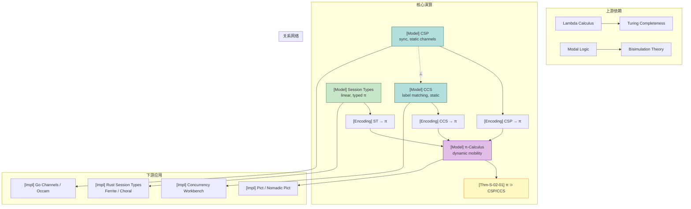
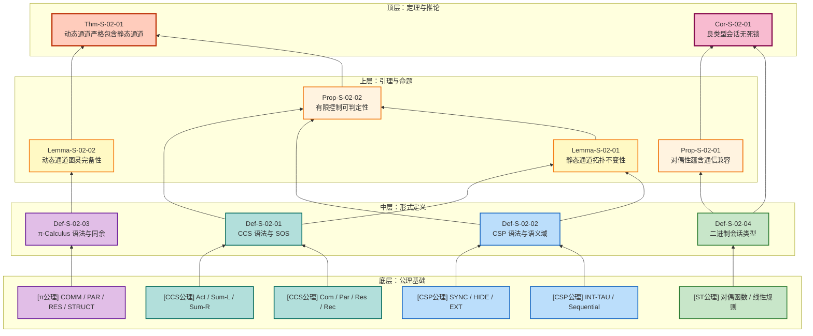
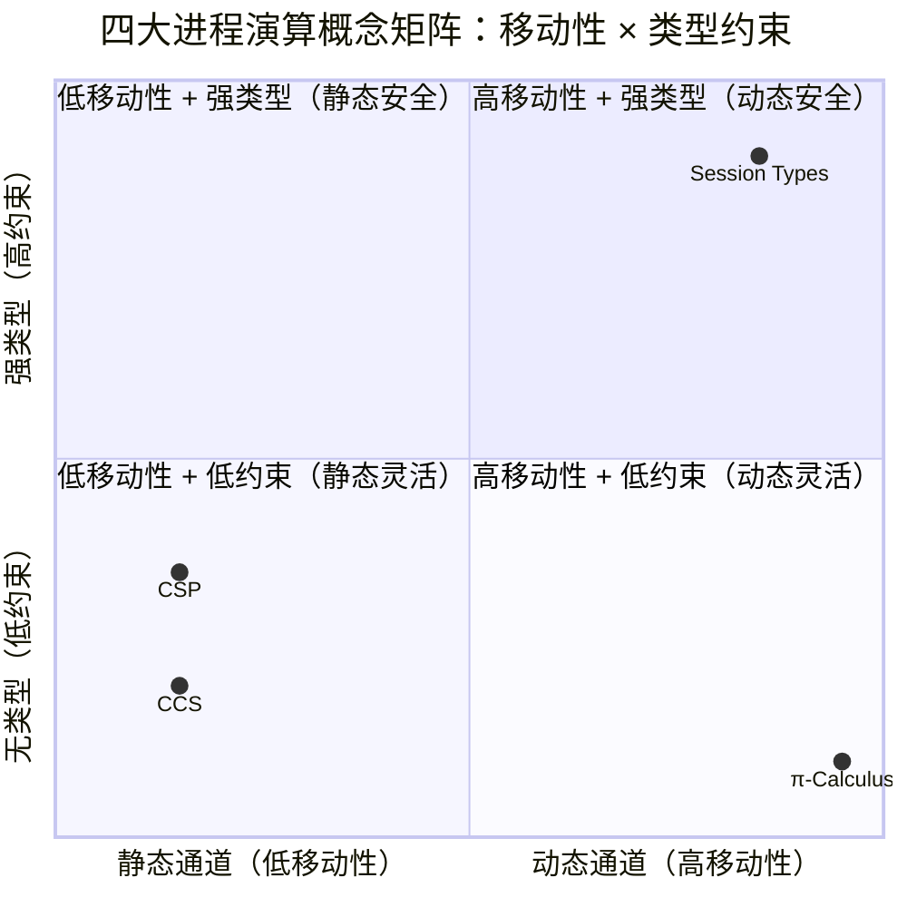

# 进程演算基础 (Process Calculus Primer)

> 所属阶段: Struct | 前置依赖: [AGENTS.md](../../AGENTS.md) | 形式化等级: L3-L4

## 目录

- [进程演算基础 (Process Calculus Primer)](#进程演算基础-process-calculus-primer)
  - [目录](#目录)
  - [1. 概念定义 (Definitions)](#1-概念定义-definitions)
    - [Def-S-02-01. CCS (Calculus of Communicating Systems)](#def-s-02-01-ccs-calculus-of-communicating-systems)
    - [Def-S-02-02. CSP (Communicating Sequential Processes)](#def-s-02-02-csp-communicating-sequential-processes)
    - [Def-S-02-03. π-Calculus](#def-s-02-03-π-calculus)
    - [Def-S-02-04. 二进制会话类型 (Binary Session Types)](#def-s-02-04-二进制会话类型-binary-session-types)
  - [2. 属性推导 (Properties)](#2-属性推导-properties)
    - [Lemma-S-02-01. 静态通道模型的拓扑不变性](#lemma-s-02-01-静态通道模型的拓扑不变性)
    - [Lemma-S-02-02. 动态通道演算的图灵完备性](#lemma-s-02-02-动态通道演算的图灵完备性)
    - [Prop-S-02-01. 对偶性蕴含通信兼容](#prop-s-02-01-对偶性蕴含通信兼容)
    - [Prop-S-02-02. 有限控制静态演算的可判定性](#prop-s-02-02-有限控制静态演算的可判定性)
  - [3. 关系建立 (Relations)](#3-关系建立-relations)
    - [关系 1：CSP $\\perp$ CCS（语义上不可比较）](#关系-1csp-perp-ccs语义上不可比较)
    - [关系 2：CCS $\\subset$ π-演算（严格包含）](#关系-2ccs-subset-π-演算严格包含)
    - [关系 3：CSP $\\subset$ π-演算（表达能力弱于）](#关系-3csp-subset-π-演算表达能力弱于)
    - [关系 4：Session Types $\\subset$ π-演算（类型化子集）](#关系-4session-types-subset-π-演算类型化子集)
  - [4. 论证过程 (Argumentation)](#4-论证过程-argumentation)
    - [论证 1：为什么 CSP 与 CCS 在语义上不可比](#论证-1为什么-csp-与-ccs-在语义上不可比)
    - [论证 2：动态通道为何严格增强表达能力](#论证-2动态通道为何严格增强表达能力)
    - [论证 3：会话类型作为 π-演算的有纪律子集](#论证-3会话类型作为-π-演算的有纪律子集)
  - [5. 形式证明 (Proofs)](#5-形式证明-proofs)
    - [Thm-S-02-01. 动态通道演算严格包含静态通道演算](#thm-s-02-01-动态通道演算严格包含静态通道演算)
    - [Cor-S-02-01. 良类型会话进程无死锁](#cor-s-02-01-良类型会话进程无死锁)
  - [6. 实例验证 (Examples)](#6-实例验证-examples)
    - [示例 1：π-演算中的动态拓扑变化](#示例-1π-演算中的动态拓扑变化)
    - [示例 2：CSP 同步握手](#示例-2csp-同步握手)
    - [示例 3：二进制会话类型协议](#示例-3二进制会话类型协议)
    - [反例 1：违反会话类型协议导致死锁](#反例-1违反会话类型协议导致死锁)
    - [反例 2：π-移动性在 CSP 中编码失败](#反例-2π-移动性在-csp-中编码失败)
  - [7. 可视化 (Visualizations)](#7-可视化-visualizations)
  - [8. 引用参考 (References)](#8-引用参考-references)

## 1. 概念定义 (Definitions)

### Def-S-02-01. CCS (Calculus of Communicating Systems)

Milner 于 1980 年提出的 CCS 是基于标签化同步的进程代数，为后续 π-演算的发展奠定了语法与语义基础 [^1]。

**语法**：

$$
\begin{aligned}
P, Q ::= &\ 0 \quad \text{(空进程 / 终止)} \\
       |\ &\ \alpha.P \quad \text{(前缀，$\alpha \in \mathcal{A} = \mathcal{N} \cup \bar{\mathcal{N}} \cup \{\tau\}$)} \\
       |\ &\ P + Q \quad \text{(非确定性选择和)} \\
       |\ &\ P \mid Q \quad \text{(并行组合)} \\
       |\ &\ P \setminus L \quad \text{(限制 / 隐藏，$L \subseteq \mathcal{N}$)} \\
       |\ &\ P[f] \quad \text{(重标记，$f: \mathcal{A} \to \mathcal{A}$)} \\
       |\ &\ \mu X.P \quad \text{(递归)}
\end{aligned}
$$

其中 $\mathcal{N}$ 为可数无限名字集合，$\bar{\mathcal{N}} = \{\bar{a} \mid a \in \mathcal{N}\}$ 为其共轭集合，$\tau$ 为内部不可观察动作。

**结构化操作语义 (SOS)**：

```
                α.P ──α──► P                        [Act]

        P ──α──► P'                                   [Sum-L]
        ─────────────────
        P + Q ──α──► P'

        Q ──α──► Q'                                   [Sum-R]
        ─────────────────
        P + Q ──α──► Q'

        P ──α──► P'                                   [Par-L]
        ─────────────────
        P | Q ──α──► P' | Q

        Q ──α──► Q'                                   [Par-R]
        ─────────────────
        P | Q ──α──► P | Q'

        P ──a──► P'     Q ──ā──► Q'                   [Com]
        ────────────────────────────
             P | Q ──τ──► P' | Q'

        P ──α──► P'    α,ᾱ ∉ L                        [Res]
        ─────────────────────────
         P \ L ──α──► P' \ L

        P ──α──► P'                                   [Rel]
        ─────────────────────
        P[f] ──f(α)──► P'[f]

        P[rec x.P / x] ──α──► P'                      [Rec]
        ─────────────────────────
           rec x.P ──α──► P'
```

**直观解释**：CCS 将并发进程抽象为通过互补名字（$a$ 与 $\bar{a}$）进行握手通信的实体，通信成功后产生内部动作 $\tau$。空进程 $0$ 提供了终止基准，前缀算子保证行为前缀闭包，限制算子 $\setminus L$ 将外部动作局部化——这是模块化与信息隐藏的形式化基础。

**定义动机**：如果不将通信结果显式建模为 $\tau$，则无法区分内部协商与外部可见行为，从而无法支持后续的抽象与精化。SOS 的引入让 CCS 具备可执行的数学模型，为互模拟等价提供了可直接验证的转移关系。没有 SOS，互模拟将缺乏具体的比较基础。

---

### Def-S-02-02. CSP (Communicating Sequential Processes)

Hoare 于 1985 年提出的 CSP 是基于同步通信和静态事件名的进程代数，强调通过精化关系进行形式化验证 [^3]。

**语法**：

$$
\begin{aligned}
P, Q ::= &\ \text{STOP} \quad \text{(死锁)} \\
       |\ &\ \text{SKIP} \quad \text{(成功终止)} \\
       |\ &\ a \to P \quad \text{(前缀动作，$a \in \Sigma$)} \\
       |\ &\ P \mathbin{\square} Q \quad \text{(外部选择 — 环境决定)} \\
       |\ &\ P \mathbin{\sqcap} Q \quad \text{(内部选择 — 非确定性)} \\
       |\ &\ P \mathbin{|||} Q \quad \text{(交错并行)} \\
       |\ &\ P \mathbin{\parallel_A} Q \quad \text{(同步并行，在事件集 $A$ 上同步)} \\
       |\ &\ P \setminus A \quad \text{(隐藏 — 将 $A$ 中事件内部化为 $\tau$)} \\
       |\ &\ P; Q \quad \text{(顺序组合)} \\
       |\ &\ \mu X.F(X) \quad \text{(递归)}
\end{aligned}
$$

**语义域**：

- $\text{traces}(P)$：迹语义 — 所有可能动作序列的集合。
- $\text{failures}(P)$：失败语义 — 形如 $(s, X)$ 的对，其中 $s \in \text{traces}(P)$，$X$ 为进程在迹 $s$ 之后可能拒绝的事件集。
- $\text{divergences}(P)$：发散语义 — 发散迹集合。

**核心 SOS 规则**：

```
         P ─a→ P'         Q ─a→ Q'
[SYNC] ──────────────────────────────────────────────
        P |[A]| Q ─a→ P' |[A]| Q'        (a ∈ A)

         P ─a→ P'        a ∉ A
[HIDE] ──────────────────────────────────────────────
          P \ A ─τ→ P' \ A

         P ─a→ P'
[EXT-L] ──────────────────────────────────────────────
         P □ Q ─a→ P'

         P ─τ→ P'
[INT-TAU] ────────────────────────────────────────────
           P ⊓ Q ─τ→ P'
```

**直观解释**：CSP 是一种基于**同步通信**和**静态事件名**的进程代数，进程通过预定义的事件集合进行握手式通信。外部选择 $\square$ 允许环境决定走哪条分支，内部选择 $\sqcap$ 则体现非确定性。成功终止 $\text{SKIP}$ 与死锁 $\text{STOP}$ 的区分使得 CSP 能够精细地建模进程的生命周期。

**定义动机**：如果不将通道/事件限制为静态命名，就无法在编译期确定进程间的通信拓扑，从而失去模型检测的可行性。CSP 的静态命名设计使得 FDR 等工具能够对有限状态子集进行穷尽验证，这是工业级形式化验证的基础 [^3]。

---

### Def-S-02-03. π-Calculus

Milner 等人于 1992 年正式提出的 π-演算是支持**名字传递**（移动性）的进程代数，被誉为“并发理论的 λ-演算” [^2][^6]。

**语法**：

$$
\begin{aligned}
P, Q ::= &\ 0 \quad \text{(空进程)} \\
       |\ &\ a(x).P \quad \text{(输入前缀 — 绑定名字 $x$)} \\
       |\ &\ \bar{a}\langle b \rangle.P \quad \text{(输出前缀 — 发送名字 $b$)} \\
       |\ &\ \tau.P \quad \text{(内部动作)} \\
       |\ &\ P + Q \quad \text{(非确定选择)} \\
       |\ &\ P \mid Q \quad \text{(并行组合)} \\
       |\ &\ (\nu a)P \quad \text{(限制 / 新名字创建)} \\
       |\ &\ !P \quad \text{(复制 — 无限副本)} \\
       |\ &\ [a = b]P \quad \text{(匹配守卫)}
\end{aligned}
$$

**结构同余 (Structural Congruence)** $\equiv$：

- $P \mid Q \equiv Q \mid P$（交换）
- $(P \mid Q) \mid R \equiv P \mid (Q \mid R)$（结合）
- $P \mid 0 \equiv P$（单位元）
- $(\nu a)(\nu b)P \equiv (\nu b)(\nu a)P$（限制交换）
- $(\nu a)0 \equiv 0$（限制空进程）
- $(\nu a)(P \mid Q) \equiv P \mid (\nu a)Q$ 若 $a \notin \text{fn}(P)$（限制作用域扩展，Scope Extrusion）

**核心 SOS 规则**：

```
              P{y/x} ──→ P'{y/x}
[COMM] ───────────────────────────────────────────────
        a(x).P | ā⟨y⟩.Q ─τ──► P{y/x} | Q

               P ─α──► P'
[PAR] ────────────────────────────────────────────────
        P | Q ─α──► P' | Q

               P ─α──► P'       α ≠ a, ā
[RES] ────────────────────────────────────────────────
        (νa)P ─α──► (νa)P'

               P ≡ P' ─α──► Q' ≡ Q
[STRUCT] ─────────────────────────────────────────────
               P ─α──► Q
```

**直观解释**：π-演算的核心创新在于通道本身可以作为消息传递。通过 $(\nu a)$ 在运行时创建新名字，并通过 $\bar{a}\langle b \rangle$ 将其发送给其他进程，系统可以在运行时刻动态地重组通信拓扑。结构同余中的 Scope Extrusion 规则使得私有通道的作用域可以随消息传递而安全扩展。

**定义动机**：传统进程代数（CSP/CCS）的通信拓扑在语法层面固定，无法描述分布式系统中动态建立连接的场景（如服务发现、P2P 网络）。π-演算首次在进程代数中形式化了“移动性”，从而具备图灵完备性，能够表达任意可计算函数 [^2]。

---

### Def-S-02-04. 二进制会话类型 (Binary Session Types)

Honda 于 1993 年提出的会话类型将会话协议本身类型化，使得编译器可以在代码运行之前验证通信双方是否“说同一种语言” [^4][^5]。

**语法**：

$$
\begin{aligned}
S, T ::= &\ !U.S \quad \text{(输出值类型 $U$，继续会话 $S$)} \\
       |\ &\ ?U.S \quad \text{(输入值类型 $U$，继续会话 $S$)} \\
       |\ &\ \oplus\{l_1:S_1, \dots, l_n:S_n\} \quad \text{(内部选择 — 发送标签 $l_i$，继续 $S_i$)} \\
       |\ &\ \&\{l_1:S_1, \dots, l_n:S_n\} \quad \text{(外部分支 — 接收标签 $l_i$，继续 $S_i$)} \\
       |\ &\ \mu t.S \quad \text{(递归类型)} \\
       |\ &\ t \quad \text{(类型变量)} \\
       |\ &\ \text{end} \quad \text{(会话终止)}
\end{aligned}
$$

**对偶函数 $\overline{S}$**：

$$
\begin{aligned}
\overline{!U.S} &=\ ?U.\overline{S} \\
\overline{?U.S} &=\ !U.\overline{S} \\
\overline{\oplus\{l_i:S_i\}} &=\ \&\{l_i:\overline{S_i}\} \\
\overline{\&\{l_i:S_i\}} &=\ \oplus\{l_i:\overline{S_i}\} \\
\overline{\mu t.S} &=\ \mu t.\overline{S} \\
\overline{t} &=\ t \\
\overline{\text{end}} &=\ \text{end}
\end{aligned}
$$

**直观解释**：二进制会话类型是一对进程间通信协议的“类型化剧本”，精确规定了谁先发送什么、后接收什么、在哪些标签上做出选择，以及何时结束。对偶性是会话双方的“镜像规则”——如果一方说“我要发送一个字符串”，另一方必须恰好说“我要接收一个字符串”。

**定义动机**：如果不将通信协议结构化为类型，进程间交互的正确性只能依赖运行时测试或程序员记忆。会话类型将 Honda 提出的 dyadic interaction 抽象为可静态检查的语法对象，从而在编译期排除协议不匹配导致的死锁和类型错误 [^4]。

---

## 2. 属性推导 (Properties)

### Lemma-S-02-01. 静态通道模型的拓扑不变性

**陈述**：对于任何不包含动态名字创建与传递的进程演算实例（如 CSP 与 CCS），进程运行时的通信拓扑在语法层面即已完全确定，运行时不会发生变化。

**证明**：

1. 在 CSP 与 CCS 中，动作集仅包含预定义的通道名 $a$ 及其共轭 $\bar{a}$，不存在 $(\nu a)$ 创建算子，且输出动作的值域不包含通道名。
2. 因此，进程能够通信的通道集合完全由其初始语法中的自由名字决定。
3. 运行时没有任何操作可以改变进程的通道连接关系。通信拓扑是初始语法的不变量。 ∎

> **推断 [Theory→Model]**：静态通道模型的拓扑不变性意味着模型检测工具（如 FDR）可以在编译期构造完整的通信图，从而对有限状态子集进行穷尽验证。

---

### Lemma-S-02-02. 动态通道演算的图灵完备性

**陈述**：即使限制为单名（monadic）π-演算，只要支持动态名字创建 $(\nu a)$ 与名字传递 $\bar{a}\langle b \rangle$，该演算仍是图灵完备的。

**证明**：

1. 由 Church-Turing 论题，λ-演算是图灵完备的。
2. Milner (1992) 证明了单名 π-演算可以编码 λ-演算：将 λ-项的变量绑定编码为 π-演算的名字限制 $(\nu a)$；将函数应用编码为通过新创建通道进行的请求-应答交互；将变量引用编码为通过通道名传递的“指针” [^2]。
3. 由于动态通道创建允许在运行时生成新的“指针”，π-演算可以表达 λ-演算中所需的任意复杂的绑定结构和引用关系。
4. 因此，π-演算是图灵完备的，其一般语义等价判定问题（如互模拟）不可判定。 ∎

---

### Prop-S-02-01. 对偶性蕴含通信兼容

**陈述**：若通道 $c$ 两端的会话类型分别为 $S$ 与 $\overline{S}$，则对于 $c$ 上的任何一次通信，发送方的操作与接收方的操作在结构和值类型上完全匹配。

**推导**：

1. 由 Def-S-02-04 的对偶函数，$!U.S$ 的对偶为 $?U.\overline{S}$，$\oplus\{l_i:S_i\}$ 的对偶为 $\&\{l_i:\overline{S_i}\}$。
2. 这意味着如果一方准备输出类型 $U$，另一方必然准备输入类型 $U$；如果一方准备发送标签 $l_j$，另一方必然准备接收标签 $l_j$。
3. 不存在一方输出而另一方也输出、或一方等待标签 $A$ 而另一方发送标签 $B$ 的情况。
4. 因此，通信双方在每一步的操作都是结构兼容的。 ∎

---

### Prop-S-02-02. 有限控制静态演算的可判定性

**陈述**：对于 CSP 与 CCS 的有限控制子集（不含复制算子 $!$ 或无界递归），强互模拟（或失败等价）的判定问题是可判定的，且位于 PSPACE-完全复杂度类。

**推导**：

1. 当通道集合静态且进程语法有限时，系统的可达状态空间是有限的。
2. Christensen, Hüttel & Stirling (1995) 证明了有限 CCS 的强互模拟判定问题是 PSPACE-完全的 [^8]。
3. CSP 的 failures-divergences 语义在有限状态子集上同样可判定，这是工业验证工具 FDR 的理论基础 [^3]。
4. 得证。 ∎

---

## 3. 关系建立 (Relations)

### 关系 1：CSP $\perp$ CCS（语义上不可比较）

**论证**：

- **语义域差异**：CSP 基于迹/失败/发散语义域，CCS 基于互模拟语义域。强互模拟严格细于迹等价（$\sim \Rightarrow =_T$），但与失败等价不可比：存在 $P \sim Q$ 但 $P \neq_F Q$（互模拟不保证环境拒绝相同），也存在 $P =_F Q$ 但 $P \not\sim Q$（失败等价允许内部结构差异）。
- **终止观测**：CSP 有成功终止动作 $\text{SKIP}$（观测为 $\checkmark$），CCS 没有。任何从 CSP 到 CCS 的编码必须模拟 $\checkmark$，但 CCS 的弱互模拟会混淆终止与死锁。
- **选择算子**：CSP 区分外部选择 $\square$ 和内部选择 $\sqcap$，CCS 的 $+$ 算子无法精确保留这种区分在失败语义下。

因此，CSP 和 CCS 在**等价语义**维度上不可比较（$\perp$）。它们可以互相模拟对方的计算行为，但无法保持对方的原始语义等价关系。

---

### 关系 2：CCS $\subset$ π-演算（严格包含）

**论证**：

- **编码存在性**：CCS 是 π-演算在 $\delta_{\text{mob}} = \text{static}$ 时的特例。将 CCS 的每个静态通道 $a$ 映射为 π-演算中的同名通道（但不传递通道名），所有 CCS 的 SOS 规则都是 π-演算规则的受限实例。因此存在保持强互模拟的编码。
- **分离结果**：π-演算支持动态通道创建 $(\nu a)$ 和通道名传递 $\bar{b}\langle a \rangle$，CCS 不支持。由 Lemma-S-02-02，动态通道使得 π-演算具备图灵完备性，而 CCS 的有限控制子集可判定，因此不存在从 π-演算到 CCS 的忠实编码 [^6]。

因此，CCS $\subset$ π-演算。

---

### 关系 3：CSP $\subset$ π-演算（表达能力弱于）

**论证**：

- **编码存在性**：CSP 的同步通信可以通过 π-演算的请求-应答模式模拟。CSP 的交错并行 $|||$ 对应 π-演算的 $\mid$，同步并行 $\parallel_A$ 可以通过共享通道上的握手实现，隐藏 $\setminus A$ 对应 $(\nu a)$ 限制。
- **分离结果**：同关系 2，π-演算的动态拓扑变化能力超出 CSP 的表达范围。由 Lemma-S-02-01，CSP 的通信拓扑是语法不变量，无法表达运行时创建新通道并传递给其他进程的行为。

因此，CSP $\subset$ π-演算（在计算行为表达能力上）。

---

### 关系 4：Session Types $\subset$ π-演算（类型化子集）

**论证**：

- **编码存在性**：任何二进制会话类型都可以编码为带类型注释的 π-演算进程。会话类型的前缀操作（$!, ?, \oplus, \&$）直接对应 π-演算中的输出/输入/标签通信。限制算子 $(\nu c:S)$ 对应 π-演算的 $(\nu c)$，只是增加了类型约束 [^4]。
- **分离结果**：π-演算可以表达无类型或任意类型的通道传递（包括非线性地共享同一个通道），而会话类型要求通道使用必须遵循预定的线性协议。因此存在 π-演算进程（如 $(\nu c)(c\langle c \rangle.0 \mid c(x).x\langle v \rangle.0)$）无法被任何会话类型描述，因为它违反了线性使用约束。

因此，Session Types 是 π-演算的一个**类型化子集**，在表达能力上严格弱于无类型的 π-演算，但获得了更强的静态保证（通信安全、死锁自由）[^5]。

---

## 4. 论证过程 (Argumentation)

### 论证 1：为什么 CSP 与 CCS 在语义上不可比

CSP 与 CCS 常被初学者混淆，因为它们都使用静态通道和同步握手。然而，它们回答的是不同的问题：CSP 问的是“进程在环境中可能如何表现”（通过拒绝集和发散来描述），而 CCS 问的是“进程在任意上下文下是否不可区分”（通过互模拟来描述）。

具体地，考虑两个进程：

$$
P = a \to \text{STOP} \mathbin{\square} b \to \text{STOP}, \quad Q = a \to \text{STOP} \mathbin{\sqcap} b \to \text{STOP}
$$

在 CSP 的失败语义中，$P \neq_F Q$，因为 $P$ 在外部选择点可以拒绝 $b$（当环境选择 $a$ 时），而 $Q$ 由于内部非确定性，可能以 $\tau$ 转移到只接受 $a$ 的分支，从而拒绝集不同。但在 CCS 中，若将 $\square$ 编码为 $+$ 并将 $\sqcap$ 编码为 $\tau.(\dots) + \tau.(\dots)$，则它们在某些互模拟变体下可能等价。这种语义域的错位使得双向忠实编码不存在。

### 论证 2：动态通道为何严格增强表达能力

静态通道 calculi（CSP/CCS）的表达能力受限于“拓扑冻结”：所有可能的通信链接在程序文本中已经写死。这在构建微服务、P2P 网络或移动代理系统时是不够的——这些系统需要在运行时根据外部请求动态建立新的连接。

π-演算通过名字传递打破了这一限制。进程可以执行：

$$
(\nu a)(\bar{b}\langle a \rangle \mid a(x).P)
$$

创建一个新通道 $a$ 并通过现有通道 $b$ 将其传递给环境。接收方一旦获得 $a$，就可以与发送方在一条此前不存在的私有链路上通信。这种行为在静态模型中无法直接表达，因为静态模型没有运行时名字生成机制。

从可判定性的角度看，这一能力直接将系统从 PSPACE-完全的 L3 推向了图灵完备的 L4，使得一般死锁检测和互模拟判定变为不可判定。这是表达能力提升的“代价”。

### 论证 3：会话类型作为 π-演算的有纪律子集

Session Types 并没有增加 π-演算的表达能力；相反，它通过**线性类型约束**限制了 π-演算中某些危险的模式（如非线性的通道共享、协议顺序错乱）。这种限制换取了两项关键保证：

1. **通信安全**（Communication Safety）：由 Prop-S-02-01 保证，发送和接收的类型与方向永远匹配。
2. **死锁自由**（Deadlock Freedom）：由线性逻辑中的 Cut 消除定理保证，只要进程是良类型且封闭的，就绝不会出现所有进程都在等待但没有任何一方可以行动的死锁状态 [^4][^9]。

工程上，Rust 的所有权系统正是这种线性约束的有效实现：会话通道作为具有唯一所有权的值，在发送或接收后所有权转移，旧绑定失效，从而在编译期强制执行线性使用。

---

## 5. 形式证明 (Proofs)

### Thm-S-02-01. 动态通道演算严格包含静态通道演算

**陈述**：π-演算严格比 CSP 和 CCS 更具表达能力。即，存在从 CSP 到 π-演算的忠实编码，也存在从 CCS 到 π-演算的忠实编码；但不存在从 π-演算到 CSP（或 CCS）的忠实编码。

**证明**：

**第一部分：编码存在性（CSP → π 与 CCS → π）**

*CCS → π*：定义编码 $[\![ - ]\!]_{CCS} : \text{CCS} \to \pi$：

$$
\begin{aligned}
[\![0]\!] &= 0 \\
[\![\alpha.P]\!] &= \alpha.[\![P]\!] \quad (\alpha \in \{a, \bar{a}, \tau\}) \\
[\![P + Q]\!] &= [\![P]\!] + [\![Q]\!] \\
[\![P \mid Q]\!] &= [\![P]\!] \mid [\![Q]\!] \\
[\![P \setminus L]\!] &= (\nu \vec{a} \in L)[\![P]\!] \\
[\![\mu X.P]\!] &= \text{rec}\, X.[\![P]\!]
\end{aligned}
$$

CCS 的 SOS 规则 [Act]、[Sum-L]、[Sum-R]、[Par-L]、[Par-R]、[Com]、[Res]、[Rel]、[Rec] 与 π-演算在 $\delta_{\text{mob}} = \text{static}$ 参数下的规则逐条对应。因此该编码保持强互模拟 $\sim$。

*CSP → π*：定义编码 $[\![ - ]\!]_{CSP} : \text{CSP} \to \pi$：

$$
\begin{aligned}
[\![\text{STOP}]\!] &= 0 \\
[\![\text{SKIP}]\!] &= 0 \quad (\text{在迹语义中通过特殊标记处理}) \\
[\![a \to P]\!] &= a(x).[\![P]\!] \quad (x \notin \text{fv}(P)) \\
[\![P \mathbin{\square} Q]\!] &= [\![P]\!] + [\![Q]\!] \\
[\![P \mathbin{\sqcap} Q]\!] &= \tau.[\![P]\!] + \tau.[\![Q]\!] \\
[\![P \mathbin{|||} Q]\!] &= [\![P]\!] \mid [\![Q]\!] \\
[\![P \parallel_A Q]\!] &= (\nu \vec{a} \in A)([\![P]\!] \mid [\![Q]\!]) \\
[\![P \setminus A]\!] &= (\nu \vec{a} \in A)[\![P]\!]
\end{aligned}
$$

CSP 的同步通信规则 [SYNC] 要求发送和接收同时就绪，这与 π-演算的 [COMM] 规则在通道 $a$ 上的握手完全一致。CSP 的迹语义中，$\text{traces}(P \mathbin{\square} Q) = \text{traces}(P) \cup \text{traces}(Q)$，对应 π-演算中 $+$ 的迹集合。因此该编码保持迹语义。

**第二部分：分离结果（π ↛ CSP/CCS）**

假设存在忠实编码 $[\![ - ]\!] : \pi \to \text{CSP}$（或 $\text{CCS}$）。考虑 π-进程：

$$
P_{\text{mob}} = (\nu a)(\bar{b}\langle a \rangle \mid a(x).\bar{c}\langle x \rangle)
$$

该进程执行序列如下：

1. 通过 $(\nu a)$ 创建新名字 $a$。
2. 左分支 $\bar{b}\langle a \rangle$ 将新名字 $a$ 通过公共通道 $b$ 发送出去。
3. 右分支 $a(x)$ 在 $a$ 上接收某个值 $v$。
4. 然后执行 $\bar{c}\langle v \rangle$，将 $v$ 转发到 $c$。

要在 CSP（或 CCS）中编码 $P_{\text{mob}}$，编码后的进程需要在运行时“知道”一个新的事件名 $a$，并在后续步骤中通过它通信。但 CSP 与 CCS 都没有 $(\nu a)$ 操作，无法在运行时创建新事件名。

可能的替代方案是预分配无限多个事件名 $\{a_1, a_2, \dots\}$，但这样：

- 编码不再是组合性的（需要全局名字管理器）；
- 或者状态空间变为无限，且无法保证名保持性（name invariance）；
- 更重要的是，Sangiorgi & Walker (2001) 严格证明了不存在保持同余性的从 π-演算到 CCS 的编码 [^6]。

因此，假设不成立，不存在从 π-演算到 CSP 或 CCS 的忠实编码。

**结论**：π-演算 $\supset$ CSP 且 π-演算 $\supset$ CCS。 ∎

---

### Cor-S-02-01. 良类型会话进程无死锁

**陈述**：设 $R = (\nu c_1:S_1)\dots(\nu c_n:S_n)(P_1 \mid \dots \mid P_m)$ 是一个封闭的、良类型的会话进程（即没有自由通道变量，所有通道都有对偶类型配对）。则 $R$ 要么已经规约到 $0$，要么存在 $R'$ 使得 $R \to R'$。

**证明（基于 Caires-Pfenning 对应）**：

1. **Session 类型 ⟷ 线性逻辑命题**：
   - $!U.S$ 对应 $U \multimap S$（线性蕴涵）
   - $?U.S$ 对应 $U \otimes S$（张量积）
   - $\oplus\{l_i:S_i\}$ 对应 $\oplus_i S_i$（选择和）
   - $\&\{l_i:S_i\}$ 对应 $\&_i S_i$（交积）
   - $\text{end}$ 对应 $\mathbf{1}$（单位元）

2. **进程组合 ⟷ 证明组合 (Cut 规则)**：
   类型规则：
   $$
   \frac{\Gamma \vdash P :: S \quad \Delta \vdash Q :: \overline{S}}{\Gamma, \Delta \vdash (\nu c:S)(P \mid Q) :: \text{end}}
   $$
   这对应于线性逻辑中的 Cut 规则。

3. **Cut 消除 ⟷ 进程规约**：
   线性逻辑的 Cut 消除定理保证：任何包含 Cut 的证明都可以继续规约。在进程层面，这意味着 $(\nu c:S)(P \mid Q)$ 中的通信可以通过规约逐步消除。

4. **死锁排除**：
   假设 $R$ 死锁。则存在一个状态，其中所有子进程都在等待对方执行某个动作，但无法继续。在线性逻辑对应中，这意味着存在一个无法消除的 Cut，与 Cut 消除定理矛盾 [^4][^9]。

因此，良类型的封闭会话进程不会陷入死锁。 ∎

> **推断 [Control→Execution]**：Session Types（控制层类型约束）要求通信端点按对偶协议线性使用。
>
> **推断 [Execution→Data]**：这保证了执行层的通信双方永远不会出现“都在等待接收”或“都在尝试发送”的不匹配状态，从而确保了数据层的死锁自由语义。
>
> **依据**：Cor-S-02-01 的 Cut 消除对应表明，类型检查在编译期排除了所有可能导致死锁的协议模式。

---

## 6. 实例验证 (Examples)

### 示例 1：π-演算中的动态拓扑变化

考虑以下 π-进程：

$$
P = (\nu a)(\bar{b}\langle a \rangle \mid a(x).\bar{c}\langle x \rangle \mid b(y).y\langle \text{msg} \rangle)
$$

**逐步推导**：

1. 进程 $P$ 首先通过 $(\nu a)$ 创建一个新通道 $a$。
2. 左侧并行分量 $\bar{b}\langle a \rangle$ 将新通道 $a$ 通过公共通道 $b$ 发送出去。
3. 中间分量 $a(x).\bar{c}\langle x \rangle$ 准备在 $a$ 上接收消息，收到后转发到 $c$。
4. 右侧分量 $b(y).y\langle \text{msg} \rangle$ 从 $b$ 接收通道名 $y$（即 $a$），然后通过 $y$ 发送消息 $\text{msg}$。
5. 最终，消息 $\text{msg}$ 经过新创建的通道 $a$ 传递，然后被转发到 $c$。

这个例子展示了动态通道创建和传递如何支持运行时拓扑重组，这是 CSP 和 CCS 无法直接表达的。

---

### 示例 2：CSP 同步握手

考虑两个 CSP 进程在事件集 $\{a\}$ 上同步并行：

$$
P = a \to P', \quad Q = a \to Q', \quad R = P \parallel_{\{a\}} Q
$$

**推导**：

1. $P$ 和 $Q$ 都准备执行事件 $a$。
2. 根据 [SYNC] 规则，$P \parallel_{\{a\}} Q \xrightarrow{a} P' \parallel_{\{a\}} Q'$。
3. 事件 $a$ 是外部可见的，因为它是同步集内的公共事件。
4. 若将同步集改为空集，$P \parallel_{\emptyset} Q$ 则 $P$ 和 $Q$ 的 $a$ 动作互不干扰，各自独立执行。

这体现了 CSP 中“显式同步集”对通信粒度的精细控制。

---

### 示例 3：二进制会话类型协议

定义一个客户端-服务器协议，客户端请求一个整数并接收一个布尔值响应：

$$
S_{\text{client}} = !\text{Int}.?\text{Bool}.\text{end}
$$

其对偶类型为服务器端协议：

$$
S_{\text{server}} = \overline{S_{\text{client}}} = ?\text{Int}.!\text{Bool}.\text{end}
$$

对应的进程实现：

$$
\begin{aligned}
P_{\text{client}} &= c!\langle 42 \rangle.c?(x).0 \\
P_{\text{server}} &= c?(y).c!\langle y > 0 \rangle.0
\end{aligned}
$$

组合 $(\nu c:S_{\text{client}})(P_{\text{client}} \mid P_{\text{server}})$ 是良类型的，且由 Cor-S-02-01 保证不会死锁。

---

### 反例 1：违反会话类型协议导致死锁

考虑以下未施加会话类型约束的 π-进程：

$$
P = c\langle v \rangle.c\langle w \rangle.0, \quad Q = c(y).0
$$

强行组合 $(\nu c)(P \mid Q)$：

1. $P$ 首先在 $c$ 上发送 $v$，$Q$ 在 $c$ 上接收 $v$。
2. $Q$ 执行完毕后变为 $0$，不再使用 $c$。
3. $P$ 尝试在 $c$ 上第二次发送 $w$，但 $Q$ 已经终止，没有进程在 $c$ 的另一端接收。
4. $P$ 永久阻塞在第二个输出上，死锁发生。

在会话类型系统中，$P$ 的协议应为 $!\text{T}.!\text{T}.\text{end}$，而 $Q$ 的协议应为 $?\text{T}.?\text{T}.\text{end}$。由于 $Q$ 的协议是 $?\text{T}.\text{end}$，该组合会在类型检查阶段被拒绝，从而在编译期排除此死锁 [^5]。

---

### 反例 2：π-移动性在 CSP 中编码失败

再次考虑 π-进程：

$$
P = (\nu a)(\bar{b}\langle a \rangle \mid a(x).x\langle c \rangle)
$$

**分析**：

- **违反的前提**：CSP 假设所有通信事件名在语法层面静态确定，不存在运行时创建新名字的操作符。
- **导致的异常**：若强行将 $P$ 编码为 CSP，必须预分配无限多个潜在事件名 $\{a_1, a_2, \dots\}$ 来模拟 $(\nu a)$。这导致编码后的 CSP 进程状态空间爆炸，且丧失了“新创建通道 $a$ 仅对特定接收方可见”的封装语义。
- **结论**：任何从 π 到 CSP 的编码在此进程上都会失败，再次证明了 CSP $\subset$ π-Calculus 的严格性。

---

## 7. 可视化 (Visualizations)

以下概念依赖图展示了 CSP、CCS、π-演算与 Session Types 之间的表达能力层次与编码关系。



**图说明**：

- `⊃` 表示严格包含（表达能力更强）。
- `⊥` 表示在等价语义上不可比较。
- 箭头 `→` 表示编码映射的存在性。
- π-演算位于中心，向上游依赖 λ-演算（图灵完备性来源）和模态逻辑（互模拟理论基础），向下游辐射到 Pict 等实现语言。CSP 和 CCS 由于静态通道限制，分别映射到 Go 和并发工作台等工具。

---

以下推理树（Deduction Tree）展示了从四大演算的核心 SOS 公理到顶层定理与推论的完整推导链条，以及各形式化元素之间的跨演算支撑关系。



**推理树说明**：
- 底层为四大演算的核心 SOS 公理/规则；中层为本文的四个形式化定义（Def-S-02-01~04）；上层为引理（Lemma-S-02-01~02）与命题（Prop-S-02-01~02）；顶层为定理 `Thm-S-02-01` 与推论 `Cor-S-02-01`。
- `Lemma-S-02-02`（动态通道图灵完备性）提供分离结果，直接支撑 `Thm-S-02-01` 的第二部分（不存在从 π 到 CSP/CCS 的忠实编码）。
- `Prop-S-02-02`（有限控制可判定性）刻画静态演算的判定边界，与 `Lemma-S-02-02` 共同构成 `Thm-S-02-01` 的“严格包含”证据。
- `Prop-S-02-01`（对偶性蕴含通信兼容）与 `Def-S-02-04` 共同支撑 `Cor-S-02-01` 的死锁自由结论。
- 颜色区分：蓝绿色系 = CCS；蓝色 = CSP；紫色 = π-Calculus；绿色 = Session Types；暖色系 = 引理/命题/定理/推论。

---

以下概念矩阵（Concept Matrix）从移动性（X轴：静态通道 → 动态通道）与类型约束（Y轴：无类型 → 强类型）两个维度，定位四大进程演算的理论坐标。



**矩阵说明**：
- π-Calculus 位于右下象限（高移动性、低类型约束），是表达能力最强的无类型演算，可编码 λ-演算。
- Session Types 位于右上象限（高移动性、强类型约束），在继承 π-Calculus 动态能力的同时，通过线性类型约束换取通信安全与死锁自由。
- CCS 与 CSP 位于左侧（低移动性），二者的差异主要体现在语义域（互模拟 vs. 迹/失败）而非移动性维度。
- 从 π-Calculus 到 Session Types 的垂直跃迁，本质是用类型纪律换取静态保证；从 CCS/CSP 到 π-Calculus 的水平跃迁，本质是用动态通道换取表达能力。
- 工程映射：CSP → FDR/Go Channels；CCS → 并发工作台；π → Pict/Nomadic Pict；Session Types → Rust Ferrite / Choral。

---

## 8. 引用参考 (References)

[^1]: R. Milner, *A Calculus of Communicating Systems*, Springer, 1980.
[^2]: R. Milner, "The Polyadic π-Calculus: A Tutorial," *Logic and Algebra of Specification*, Springer, 1993.
[^3]: C. A. R. Hoare, *Communicating Sequential Processes*, Prentice Hall, 1985.
[^4]: K. Honda, "Types for Dyadic Interaction," *CONCUR 1993*, LNCS 715, Springer, 1993.
[^5]: K. Honda, N. Yoshida, and M. Carbone, "Multiparty Asynchronous Session Types," *POPL 2008*, ACM, 2008.
[^6]: D. Sangiorgi and D. Walker, *The π-calculus: A Theory of Mobile Processes*, Cambridge University Press, 2001.
[^8]: S. Christensen, H. Hüttel, and C. Stirling, "Bisimulation Equivalence is Decidable for all Context-Free Processes," *CONCUR 1993*, Springer, 1993.
[^9]: L. Caires and F. Pfenning, "Session Types as Intuitionistic Linear Propositions," *CONCUR 2010*, Springer, 2010.

---

*文档版本: v1.0 | 创建日期: 2026-04-20*
