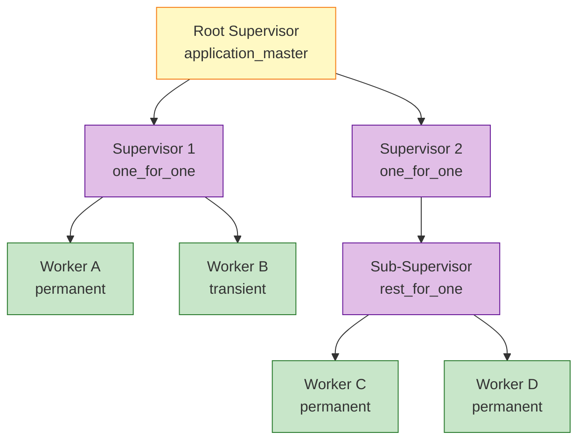
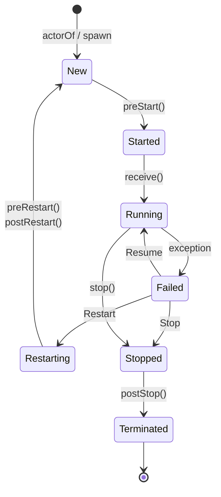

# Actor 模型形式化 (Actor Model Formalization)

> 所属阶段: Struct | 前置依赖: [AGENTS.md](../../AGENTS.md), [01.02-process-calculus-primer.md](./01.02-process-calculus-primer.md) | 形式化等级: L4-L5

---

## 目录

- [Actor 模型形式化 (Actor Model Formalization)](#actor-模型形式化-actor-model-formalization)
  - [目录](#目录)
  - [1. 概念定义 (Definitions)](#1-概念定义-definitions)
    - [Def-S-03-01. Actor (经典 Actor 模型)](#def-s-03-01-actor-经典-actor-模型)
    - [Def-S-03-02. Behavior (行为)](#def-s-03-02-behavior-行为)
    - [Def-S-03-03. Mailbox (邮箱)](#def-s-03-03-mailbox-邮箱)
    - [Def-S-03-04. ActorRef (Actor 不透明引用)](#def-s-03-04-actorref-actor-不透明引用)
    - [Def-S-03-05. Supervision Tree (监督树)](#def-s-03-05-supervision-tree-监督树)
  - [2. 属性推导 (Properties)](#2-属性推导-properties)
    - [Lemma-S-03-01. 邮箱串行处理引理](#lemma-s-03-01-邮箱串行处理引理)
    - [Lemma-S-03-02. 监督树故障传播有界性引理](#lemma-s-03-02-监督树故障传播有界性引理)
    - [Prop-S-03-01. ActorRef 不透明性蕴含位置透明](#prop-s-03-01-actorref-不透明性蕴含位置透明)
  - [3. 关系建立 (Relations)](#3-关系建立-relations)
    - [关系 1：Classic Actor `⊂` Erlang Actor](#关系-1classic-actor--erlang-actor)
    - [关系 2：Actor 模型 `⊂` 异步 π-演算](#关系-2actor-模型--异步-π-演算)
    - [关系 3：Erlang/OTP `≈` Akka Actor（核心语义双模拟等价）](#关系-3erlangotp--akka-actor核心语义双模拟等价)
    - [关系 4：Actor 模型 `↔` Dataflow 模型（图灵完备等价）](#关系-4actor-模型--dataflow-模型图灵完备等价)
  - [4. 论证过程 (Argumentation)](#4-论证过程-argumentation)
    - [论证 1：为什么邮箱串行处理是 Actor 确定性的根基](#论证-1为什么邮箱串行处理是-actor-确定性的根基)
    - [论证 2：确定性边界的打破场景分析](#论证-2确定性边界的打破场景分析)
    - [论证 3：监督树深度与重启强度的权衡](#论证-3监督树深度与重启强度的权衡)
  - [5. 形式证明 (Proofs)](#5-形式证明-proofs)
    - [Thm-S-03-01. Actor 邮箱串行处理下的局部确定性](#thm-s-03-01-actor-邮箱串行处理下的局部确定性)
    - [Thm-S-03-02. 监督树活性定理 (Supervision Tree Liveness)](#thm-s-03-02-监督树活性定理-supervision-tree-liveness)
  - [6. 实例验证 (Examples)](#6-实例验证-examples)
    - [示例 1：Akka Typed 计数器 Actor](#示例-1akka-typed-计数器-actor)
    - [示例 2：Erlang OTP 监督树配置](#示例-2erlang-otp-监督树配置)
    - [反例 1：共享可变状态破坏 Actor 隔离性](#反例-1共享可变状态破坏-actor-隔离性)
    - [反例 2：并发发送下的选择性接收非确定性](#反例-2并发发送下的选择性接收非确定性)
  - [7. 可视化 (Visualizations)](#7-可视化-visualizations)
    - [图 1：监督树层次结构](#图-1监督树层次结构)
    - [图 2：Actor 生命周期状态机](#图-2actor-生命周期状态机)
  - [8. 引用参考 (References)](#8-引用参考-references)

## 1. 概念定义 (Definitions)

### Def-S-03-01. Actor (经典 Actor 模型)

$$
\mathcal{A}_{\text{classic}} = (\alpha, b, m, \sigma)
$$

其中：

- $\alpha \in \text{Addr}$：Actor 的唯一地址（不可伪造的身份标识）[^1][^2]
- $b: \text{Msg} \times \text{State} \to (\text{Behavior} \times \text{State} \times \text{Effect}^*)$：行为函数，描述 Actor 如何处理 incoming 消息
- $m \in \text{Msg}^*$：消息队列（Mailbox），保存其他 Actor 异步发送来的消息
- $\sigma \in \text{State}$：私有内部状态，不对外暴露

**核心操作**：

- $\text{send}(\alpha, v)$：异步发送消息 $v$ 到地址 $\alpha$
- $\text{become}(b')$：将当前行为替换为新行为 $b'$
- $\text{spawn}(b_0, \sigma_0)$：创建具有初始行为 $b_0$ 和初始状态 $\sigma_0$ 的新 Actor

**直观解释**：经典 Actor 是 Hewitt 与 Agha 提出的原始并发模型，通过异步消息传递通信，严格禁止共享内存[^1][^2]。Actor 地址 $\alpha$ 类似于电话号码——可发消息但无法直接触碰内部状态。

**定义动机**：四元组抽象是证明"无共享状态"和"故障隔离"的前提。Mailbox 的显式建模是 Thm-S-03-01 的关键基础。

---

### Def-S-03-02. Behavior (行为)

Behavior 是 Actor 的**反应规则**，定义了在接收到特定消息时应当执行的状态转换、副作用与行为演进：

$$
B : \mathcal{M} \times \Sigma \rightarrow (\mathcal{B}' \times \Sigma' \times \mathcal{E}^*)
$$

其中：

- $\mathcal{M}$：消息域（所有可能接收的消息集合）
- $\Sigma$：状态域
- $\mathcal{B}'$：新的 Behavior（支持 `become` 语义）
- $\mathcal{E}^*$：副作用序列（向其他 Actor 发送消息、创建子 Actor、进行 I/O 等）

**直观解释**：Behavior 是 Actor 的"大脑"，由异步消息驱动触发。每次处理完消息后可通过 `become` 原子切换 Behavior，天然支持有限状态机建模。

**定义动机**：独立形式化 Behavior 是为了精确分析行为切换的原子性，确保新 Behavior 对下一条消息生效，避免新旧行为交错。

---

### Def-S-03-03. Mailbox (邮箱)

Mailbox 是 Actor 的**输入缓冲队列**，负责暂存其他 Actor 异步投递的消息：

$$
\text{Mailbox}(\alpha) \triangleq \langle m_1, m_2, \ldots, m_n \rangle \in \mathbb{M}^*
$$

其中每条消息 $m_i = \langle \text{payload}, \text{timestamp}, \text{sender} \rangle$。

**操作语义**：

```
发送:  α ! v  将消息 ⟨v, t, self⟩ 原子追加到进程 α 的邮箱尾部
接收:  receive C end  从邮箱头部按模式匹配选择并移除第一条匹配消息
```

**模式匹配（Pattern Matching）**[^3]：

```
match(v, p) = θ   若存在替换 θ 使得 pθ = v
match(v, p) = ⊥   否则（匹配失败）
```

**邮箱语义变体**：

| 变体 | 语义 | 代表系统 |
|------|------|----------|
| 纯 FIFO | 严格先进先出，按到达顺序消费 | 经典 Actor [^1] |
| 可搜索队列 | 扫描整个邮箱，选择第一条匹配消息 | Erlang [^3] |
| 有界队列 | 容量受限，溢出触发背压或丢弃 | Akka BoundedMailbox [^4] |

**直观解释**：邮箱是 Actor 的"收件箱"。经典 Actor 假设邮箱是无限大的 FIFO 队列；而工程实现中，Erlang 引入了选择性接收（selective receive），使得邮箱成为**可搜索队列**，允许进程根据当前状态选择性地消费消息，而非严格按 FIFO 顺序[^3]。Akka 则进一步区分了无界邮箱（UnboundedMailbox）和有界邮箱（BoundedMailbox），后者在容量耗尽时可以实施背压策略[^4]。

**定义动机**：

1. **FIFO 顺序保证**：如果不定义时间戳和队列结构，就无法形式化证明消息顺序性。
2. **选择性接收**：Erlang 的 `receive` 允许扫描整个邮箱选择匹配的消息，这与纯 FIFO 语义不同，需要显式建模。
3. **边界分析**：邮箱的物理有限性是系统崩溃的潜在原因（见反例分析），必须在形式化中暴露容量参数。

---

### Def-S-03-04. ActorRef (Actor 不透明引用)

$$
\text{ActorRef} = \langle \text{path} : \text{ActorPath}, \text{refCell} : \text{AtomicReference}[\text{InternalActorRef}] \rangle
$$

其中 `path` 是全局唯一的逻辑地址（如 `/user/counter`），`refCell` 指向运行时的具体 Actor 实例。ActorRef 对外仅暴露 `!`（tell）操作[^4]：

```scala
trait ActorRef {
  def !(message: Any)(implicit sender: ActorRef = Actor.noSender): Unit
  def path: ActorPath
}
```

**直观解释**：ActorRef 是 Actor 的"电话号码"——可发消息但无法直接触碰内部状态[^4]。即使目标 Actor 重启或迁移，发送方无需修改即可继续发送。

**定义动机**：标识与物理实例解耦是位置透明和运行时迁移的基础[^4]。ActorRef 的不可伪造性也防止了身份伪造攻击。

---

### Def-S-03-05. Supervision Tree (监督树)

监督树是一个有根森林 $\mathcal{T} = (V, E, r)$，其中[^3]：

- $V = \mathcal{S} \cup \mathcal{W}$：节点集合，包含监督者（Supervisor）$\mathcal{S}$ 和工作者（Worker）$\mathcal{W}$
- $E \subseteq \mathcal{S} \times (\mathcal{S} \cup \mathcal{W})$：边集合，表示监督关系
- $r \in \mathcal{S}$：根监督者

**监督者形式化**：

$$
\mathcal{S} = \langle \text{Id}, \chi, \sigma, \mathcal{C} \rangle
$$

其中：

- $\chi \in \{\text{one\_for\_one}, \text{one\_for\_all}, \text{rest\_for\_one}, \text{simple\_one\_for\_one}\}$：监督策略
- $\sigma = (I, P)$：重启规格，$I$ 为重启强度（最大重启次数），$P$ 为重启窗口（秒）
- $\mathcal{C} = \{c_1, \ldots, c_n\}$：子进程规格集合，每个 $c_i = \langle \text{ChildId}, \text{StartSpec}, \text{RestartType}, \text{ShutdownTimeout}, \text{ProcessType} \rangle$

**监督策略语义**[^3]：

- **one_for_one**：仅重启崩溃的子进程 $c_i$
- **one_for_all**：终止所有子进程，按启动顺序的逆序依次重启全部子进程
- **rest_for_one**：终止并重启崩溃子进程及其所有"之后启动"的子进程
- **simple_one_for_one**：用于动态子进程，类似于 one_for_one，但所有子进程共享相同的启动规格

**直观解释**：监督树是层级化容错结构，监督者监控子进程并在故障时按策略重启[^3]。它将错误处理从调用栈模型转换为树形决策模型，使故障恢复与业务逻辑正交分离。

**定义动机**：监督树定义故障传播边界，不同策略对应不同容错语义，重启强度 $(I, P)$ 则是防止无限循环的熔断机制。

---

## 2. 属性推导 (Properties)

### Lemma-S-03-01. 邮箱串行处理引理

**陈述**：对于任意 Actor $\alpha$，在任意时刻 $t$，至多只有一个线程 $T$ 在执行 $\alpha$ 的消息处理逻辑（`receive` / `handle_message`）。

**证明**：

1. **前提分析**：由 Def-S-03-03，Mailbox 维护一个 `status` 字段（在 Akka 实现中为 AtomicInteger，在 Erlang VM 中为调度标记），取值为 $\{\text{Idle}, \text{Scheduled}, \text{Running}\}$。
2. **构造/推导**：
   - 当第一条消息到达且 `status = Idle` 时，调度器执行 CAS 操作将状态置为 `Scheduled`，随后提交 `processMailbox` 任务到执行线程。
   - 在 `processMailbox` 执行期间，`status` 被置为 `Running`。此时若有新消息到达并触发调度，CAS(`Idle` → `Scheduled`) 必然失败，因为当前状态为 `Running`。
   - 只有当 `processMailbox` 完成当前批次（或单条）消息处理，并将 `status` 重置为 `Idle` 后，下一次调度才能成功。
3. **结论**：任意时刻，Mailbox 的消息处理逻辑至多被一个线程执行。∎

> **推断 [Execution→Data]**: 执行层的 Mailbox 串行处理机制保证了数据层的 Actor 内部状态一致性，无需显式锁即可实现线程安全。
>
> **依据**：Dispatcher 的 CAS 调度 + Mailbox 单线程执行契约（Def-S-03-03、Lemma-S-03-01）。

---

### Lemma-S-03-02. 监督树故障传播有界性引理

**陈述**：设监督树 $\mathcal{T}$ 的高度为 $h$（根节点深度为 0）。对于任意深度为 $d$ 的叶子工作者 $w$，若 $w$ 崩溃，则故障信号最多向上传播 $h - d$ 层，或在某中间层被成功拦截。

**形式化**：

$$
\text{depth}(w) = d \land \text{height}(\mathcal{T}) = h \Rightarrow \text{propagation\_depth} \leq h - d
$$

**证明**：

1. **前提分析**：由 Def-S-03-05，监督树是无环的层次图，且每个非根节点有且仅有一个监督者父节点。
2. **构造/推导**：
   - $w$ 崩溃时生成 EXIT 信号，通过 `link` 机制发送给其父监督者 $s_{d-1}$（深度 $d-1$）。
   - $s_{d-1}$ 接收信号后，根据策略 $\chi$ 决策：
     - 若决策为 `Resume`、`Restart` 或 `Stop`，故障在 $s_{d-1}$ 处被就地处理，不再向上传播。
     - 若决策为 `Escalate`（或重启强度超限导致监督者自身失败），信号转发给 $s_{d-1}$ 的父节点 $s_{d-2}$。
   - 由于从 $w$ 到根节点 $r$ 的路径唯一，且长度恰好为 $h - d$，因此传播深度不可能超过该值。
3. **结论**：监督树的结构为故障传播提供了天然的上界。∎

---

### Prop-S-03-01. ActorRef 不透明性蕴含位置透明

**陈述**：对于任意发送者 $s$ 和接收者 $r$，消息发送语义 $s \,!\, m$ 与 $r$ 的物理位置无关。

**推导**：

1. 由 Def-S-03-04，ActorRef 仅暴露 `path` 和 `!` 操作，隐藏了底层 `refCell` 的具体实现。
2. `refCell` 可以指向本地 Actor 实例（`LocalActorRef`），也可以指向远程 Actor 的代理（`RemoteActorRef`）。
3. 发送者调用 `!` 时，只与 ActorRef 交互，不直接访问 Actor 实例。
4. 因此，将 Actor 从本地迁移到远程（或反之）不需要修改发送者代码。
5. 得证：ActorRef 的不透明性在接口层面保证了位置透明。∎

---

## 3. 关系建立 (Relations)

### 关系 1：Classic Actor `⊂` Erlang Actor

**论证**：

- **编码存在性**：经典 Actor 模型可编码为 Erlang 的子集——使用纯 FIFO 接收模式（`receive Msg -> ... end` 不含模式匹配守卫），忽略选择性接收和监督树。
- **分离结果**：Erlang 的选择性接收（可搜索 Mailbox）和监督树容错机制在经典 Actor 中无法原语表达。经典 Actor 没有内置的故障恢复抽象，也不支持运行时模块热替换。

**结论**：Erlang Actor 是经典 Actor 模型的严格超集，$\text{ClassicActor} \subset \text{ErlangActor}$。

---

### 关系 2：Actor 模型 `⊂` 异步 π-演算

**论证**（详见 [01.02-process-calculus-primer.md](./01.02-process-calculus-primer.md) 中 π-演算的定义）：

- **编码存在性**：Agha 与 Mason 证明了 Actor 模型可以编码为异步 π-calculus 的受限子集[^1]。核心映射为：
  - `send(α, v)` 编码为 $\bar{\alpha}\langle v \rangle$
  - `receive` 编码为 $\alpha(x).P$
  - `spawn` 编码为 $(\nu c)(\bar{c}\langle P \rangle \mid !c(x).x)$
- **分离结果**：π-演算不原生提供 Mailbox 的 FIFO 顺序保证，也不提供监督树的容错语义。虽然这些可以通过复杂编码模拟，但会丢失模型的简洁性和可分析性。

**结论**：在表达能力上，$\text{Actor\ Model} \subset \text{Async-}\pi$，Actor 模型位于 L4-L5 表达能力层次（参见 [01.02-process-calculus-primer.md](./01.02-process-calculus-primer.md) 的 Thm-S-02-01）。

---

### 关系 3：Erlang/OTP `≈` Akka Actor（核心语义双模拟等价）

**论证**：

- **编码存在性**：Erlang 的 `spawn` 对应 Akka 的 `actorOf`，`!` 对应 `!`，`link` 对应 `watch`，`supervisor` 行为对应 `SupervisorStrategy`[^3][^4]。
- **等价条件**：在理想配置下（每个 Akka Actor 绑定 `PinnedDispatcher`、行为非阻塞、无共享可变状态），Akka Actor 与 Erlang 进程在故障隔离语义上双模拟等价。
- **差异点**：
  - Erlang 是动态类型，Akka 提供静态类型（Akka Typed）。
  - Erlang 进程隔离由 BEAM VM 保证（独立 Heap），Akka 的隔离是约定俗成（JVM 共享内存底层）。

**结论**：两者在核心 Actor 语义层面双模拟等价（`≈`），工程实现路径不同但理论模型一致。

---

### 关系 4：Actor 模型 `↔` Dataflow 模型（图灵完备等价）

**论证**（来源于统一流计算理论）：

- **Actor → Dataflow**：每个 Actor 可映射为 StatefulProcessor，Mailbox 映射为 Channel（Buffer + FIFO 排序），ActorRef 映射为 Processor Identity。
- **Dataflow → Actor**：每个算子可映射为 Actor，数据边映射为异步消息传递，分区策略映射为路由策略。
- **关键差异**：Actor 是动态创建、消息驱动的；Dataflow 是静态拓扑、数据驱动的。但在图灵完备意义上，两者可以互相编码。

**结论**：Actor 模型与 Dataflow 模型在表达能力上等价，区别主要在于控制驱动 vs 数据驱动、动态拓扑 vs 静态拓扑。

---

## 4. 论证过程 (Argumentation)

### 论证 1：为什么邮箱串行处理是 Actor 确定性的根基

Actor 模型将状态修改的并发控制从显式锁转移到了 Mailbox 的隐式串行化。由 Lemma-S-03-01，Mailbox 在任意时刻只被单个线程处理，因此所有状态读取、修改、行为切换都运行在一个逻辑串行流中。`become(b')` 在处理消息 $m_k$ 时原子生效，对 $m_{k+1}$ 生效而不影响 $m_k$，不存在新旧行为交错的竞态窗口。Mailbox 串行处理是 Actor 局部确定性的充要条件，Thm-S-03-01 基于此构建。

---

### 论证 2：确定性边界的打破场景分析

Thm-S-03-01 的条件确定性依赖两个关键前提：**Mailbox 序列的确定性**与**状态私有性**。

- **多发送者交错**：当多个发送者并发投递消息时，全局交错顺序由调度器决定。虽然单发送者顺序保持，但选择性接收（Erlang `receive`）下不同交错可能匹配不同消息，导致整体行为非确定。
- **共享状态绕过**：Akka 的闭包捕获外部 `var` 或 Erlang 的 ETS 表引入了不经过 Mailbox 的共享可变状态。这直接违反 Def-S-03-01 的私有状态假设，使 Lemma-S-03-01 和 Thm-S-03-01 的保证立即失效。

---

### 论证 3：监督树深度与重启强度的权衡

监督树深度 $h$ 和重启强度 $I$ 存在工程权衡。较浅的树（$h \leq 3$）故障恢复快但 ChildSpec 复杂；较深的树（$h > 5$）职责清晰但级联重启延迟高。过高的 $I$（如 100）会导致永久故障无限重启循环；过低的 $I$（如 1）对正常波动过于敏感。OTP 最佳实践建议深度控制在 3 层以内，$I = 3 \sim 5$（$P = 60$ 秒）[^3]。

---

## 5. 形式证明 (Proofs)

### Thm-S-03-01. Actor 邮箱串行处理下的局部确定性

**陈述**：对于任意 Actor $\alpha$，若其初始状态为 $\sigma_0$，Mailbox 中的消息序列为 $\langle m_1, m_2, \ldots, m_n \rangle$，且所有消息均由单线程串行处理（Lemma-S-03-01），则 Actor 的状态转换序列 $\langle \sigma_0, \sigma_1, \ldots, \sigma_n \rangle$ 被唯一确定。形式化地：

$$
\forall \alpha, \forall \vec{m} = \langle m_i \rangle_{i=1}^n, \forall t. \; \text{single\_threaded}(\alpha, t) \Rightarrow \exists! \langle \sigma_i \rangle_{i=0}^n. \; \sigma_i = b_i(m_i, \sigma_{i-1})
$$

其中 $b_i$ 表示处理第 $i$ 条消息时的当前 Behavior。

**证明**：

**步骤 1 — 基例（$i = 1$）**：

由 Lemma-S-03-01，Mailbox 的消息处理在任意时刻都是单线程的。当第一条消息 $m_1$ 被调度执行时，Actor $\alpha$ 的当前 Behavior 为 $b_1$，当前状态为 $\sigma_0$。根据 Def-S-03-02，Behavior 是一个数学函数：

$$
(b_2, \sigma_1, \vec{e}_1) = b_1(m_1, \sigma_0)
$$

函数的定义保证了：给定相同的输入 $(m_1, \sigma_0)$ 和相同的行为 $b_1$，输出 $(b_2, \sigma_1)$ 是唯一的。因此，处理完 $m_1$ 后的新状态 $\sigma_1$ 和新行为 $b_2$ 被唯一确定。同时，由于单线程执行，不存在其他线程在 $m_1$ 处理期间修改 $\sigma_0$ 或 $b_1$。

**步骤 2 — 归纳假设**：

假设对于第 $k-1$ 条消息（$1 < k \leq n$），状态 $\sigma_{k-1}$ 和处理该消息时的行为 $b_{k-1}$ 已经被唯一确定。

**步骤 3 — 归纳步骤（$i = k$）**：

当处理第 $k$ 条消息 $m_k$ 时，由归纳假设，Actor 的当前配置为 $(b_k, \sigma_{k-1})$，其中 $b_k$ 是处理完 $m_{k-1}$ 后通过 `become` 切换得到的行为（若未切换则 $b_k = b_{k-1}$）。再次应用 Def-S-03-02 的函数语义：

$$
(b_{k+1}, \sigma_k, \vec{e}_k) = b_k(m_k, \sigma_{k-1})
$$

由于 $b_k$ 和 $\sigma_{k-1}$ 都是唯一确定的，且 $b_k$ 作为函数产生唯一输出，因此 $\sigma_k$ 和 $b_{k+1}$ 也被唯一确定。

**步骤 4 — 副作用不影响本地确定性**：

副作用序列 $\vec{e}_k$ 可能包含向其他 Actor 发送消息的操作（`send`）。这些操作只会将消息追加到接收方的 Mailbox 中，不会反向修改 $\alpha$ 的状态或 Behavior。因此，即便系统中存在消息反馈回路，反馈消息也必须先进入 $\alpha$ 的 Mailbox，在后续调度中作为 $m_j$（$j > k$）被处理。它们不会影响当前 $m_k$ 处理结果的唯一性。

**步骤 5 — 结论**：

由数学归纳法，对于所有 $i \in \{1, \ldots, n\}$，状态 $\sigma_i$ 都被唯一确定。因此，整个状态转换序列 $\langle \sigma_0, \sigma_1, \ldots, \sigma_n \rangle$ 是给定消息序列 $\vec{m}$ 和初始状态 $\sigma_0$ 的确定性函数。∎


---

### Thm-S-03-02. 监督树活性定理 (Supervision Tree Liveness)

**陈述**：设 $\mathcal{T}$ 是一个良构的监督树，高度 $h < \infty$。对于任意深度为 $d$ 的叶子工作者 $w$，若 $w$ 因**瞬态故障**（transient fault）崩溃，且故障原因在有限时间 $t_{\text{fixed}}$ 内被修复，则 $w$ 将在有限步内被成功重启，前提是其父监督者的重启强度 $I$ 未被耗尽。

**形式化**：

$$
\begin{aligned}
& w \in \text{Leaves}(\mathcal{T}) \land \text{depth}(w) = d \land \text{height}(\mathcal{T}) = h < \infty \\
& \land \text{transient}(\text{cause}(w)) \land \exists t_{\text{fixed}} < \infty. \text{fixed}(\text{cause}(w), t_{\text{fixed}}) \\
& \land \text{count}(\mathcal{H}, t, P) < I \\
& \Rightarrow \Diamond \text{restarted}(w)
\end{aligned}
$$

**证明**：

$w$ 崩溃时，VM 立即通过 `link` 向父监督者 $s_{\text{parent}}$ 发送故障信号。$s_{\text{parent}}$ 根据策略 $\chi$ 和重启历史 $\mathcal{H}$ 决策：若当前窗口计数 $\text{count}(\mathcal{H}, t, P) < I$（定理前提），则执行 `Restart`。由于故障是瞬态的且已在有限时间 $t_{\text{fixed}}$ 内修复，在 $t_{\text{fixed}}$ 后的某次重启必然成功。故障检测为 O(1)，$\mathcal{H}$ 长度受限于 $I$，重启操作原子性，且树高 $h < \infty$，因此总步骤有界，不会超过 $\text{depth}(w) \times I$。∎

---


## 6. 实例验证 (Examples)

### 示例 1：Akka Typed 计数器 Actor

以下 Scala 代码展示了 Def-S-03-01 与 Def-S-03-04 的工程实现：

```scala
sealed trait Command
object Command {
  case object Increment extends Command
  case class GetCount(replyTo: ActorRef[Int]) extends Command
}

val counter: Behavior[Command] = Behaviors.setup { ctx =>
  var count = 0                    // 私有状态 σ
  Behaviors.receiveMessage {       // Behavior b
    case Command.Increment =>
      count += 1                   // 状态转换: σ → σ'
      Behaviors.same               // become(相同行为)
    case Command.GetCount(replyTo) =>
      replyTo ! count              // 副作用: send(ActorRef, Int)
      Behaviors.same
  }
}
```

**逐步推导**：`Behaviors.setup` 创建闭包状态 `count`（对应私有 $\sigma$）；`Behaviors.receiveMessage` 保证单条消息处理（Lemma-S-03-01）；`replyTo: ActorRef[Int]` 体现 ActorRef 类型安全（Def-S-03-04）。由 Thm-S-03-01，给定消息序列 $\langle \text{Increment}, \text{Increment}, \text{GetCount} \rangle$，最终状态 $\sigma_3$ 必然为 $2$。

---

### 示例 2：Erlang OTP 监督树配置

以下 Erlang 代码展示了 Def-S-03-05 的工程实践[^3]：

```erlang
-module(web_server_sup).
-behaviour(supervisor).

-export([start_link/0, init/1]).

start_link() ->
    supervisor:start_link({local, ?MODULE}, ?MODULE, []).

init([]) ->
    SupFlags = #{
        strategy => one_for_one,      % 独立组件，故障隔离
        intensity => 5,               % 5次重启
        period => 60                  % 在60秒内
    },
    Children = [
        #{id => db_pool,
          start => {db_pool, start_link, []},
          restart => permanent,
          shutdown => 5000,
          type => worker},
        #{id => http_listener,
          start => {http_listener, start_link, []},
          restart => permanent,
          shutdown => 5000,
          type => worker},
        #{id => cache_service,
          start => {cache_service, start_link, []},
          restart => transient,
          shutdown => 2000,
          type => worker}
    ],
    {ok, {SupFlags, Children}}.
```

**逐步推导**：`one_for_one` 对应 Def-S-03-05 的策略 $\chi$；`intensity => 5, period => 60` 对应重启规格 $\sigma = (5, 60)$。`permanent` 与 `transient` 分别对应工作者重启类型 $\rho$。由 Thm-S-03-02，瞬态故障将在有限步内成功恢复。

---

### 反例 1：共享可变状态破坏 Actor 隔离性

以下 Akka 代码违反了 Def-S-03-01 的私有状态假设，从而破坏 Thm-S-03-01 的确定性保证[^4]：

```scala
var sharedCounter = 0              // 外部共享可变状态

class BadActor extends Actor {
  def receive = {
    case Increment => sharedCounter += 1
    case GetCount  => sender ! sharedCounter
  }
}

val a1 = system.actorOf(Props[BadActor])
val a2 = system.actorOf(Props[BadActor])
a1 ! Increment
a2 ! Increment
```

**分析**：`sharedCounter += 1` 不是原子操作，两个 `BadActor` 实例并发执行会导致更新丢失（期望 $2$ 实际可能 $1$）。这违反了 Def-S-03-01 的私有状态假设，使 Thm-S-03-01 的保证立即失效。

---

### 反例 2：并发发送下的选择性接收非确定性

考虑以下 Erlang 进程，使用选择性接收处理来自两个发送者的消息：

```erlang
loop(State) ->
    receive
        {priority, X} ->
            loop(State#state{priority = X});
        {normal, Y} ->
            loop(State#state{normal = Y})
    end.
```

**场景**：

- 发送者 $S_1$ 发送 `{normal, 1}` 后发送 `{priority, 2}`
- 发送者 $S_2$ 发送 `{normal, 3}`

**分析**：多发送者场景下，Mailbox 全局交错取决于调度器。若顺序为 `{normal,1},{normal,3},...` 则状态为 `1`；若为 `{normal,3},{normal,1},...` 则状态为 `3`。Thm-S-03-01 的条件确定性依赖于"给定消息序列"，而多发送者使序列本身不确定，导致整体行为非确定。

---

## 7. 可视化 (Visualizations)

以下可视化展示了 Actor 模型的核心结构、生命周期与概念依赖关系。

### 图 1：监督树层次结构



**图说明**：

- 本图展示了一个典型的三层监督树结构。黄色节点为根监督者，紫色节点为各级监督者，绿色节点为叶子工作者。
- `one_for_one` 策略下，单个叶子崩溃只影响自身；`rest_for_one` 策略下，崩溃节点及其右侧兄弟节点会被重启。
- 监督树的深度和策略选择直接决定了故障传播的上界（Lemma-S-03-02、Thm-S-03-02）。

---

### 图 2：Actor 生命周期状态机



**图说明**：

- 本状态机描述了 Actor 从创建到销毁的完整生命周期（Def-S-03-01、Def-S-03-05）。
- `Restart` 路径会触发 `preRestart` 和 `postRestart` 钩子，允许开发者在不丢失 ActorRef 的情况下重置状态。
- `Resume` 路径保留当前 Actor 实例和状态，仅忽略导致异常的消息，适用于可恢复的业务错误。

---


## 8. 引用参考 (References)

[^1]: G. Agha, *Actors: A Model of Concurrent Computation in Distributed Systems*, MIT Press, 1986.
[^2]: C. Hewitt, P. Bishop, and R. Steiger, "A Universal Modular ACTOR Formalism for Artificial Intelligence," *IJCAI 1973*, 1973.
[^3]: J. Armstrong, *Making Reliable Distributed Systems in the Presence of Software Errors*, Ph.D. thesis, KTH Royal Institute of Technology, 2003.
[^4]: B. Virdal et al., "Akka Actor: A Toolkit for Concurrent and Distributed Programming," Lightbend Technical Reports, 2015. (See also Akka Documentation, <https://doc.akka.io/>)
