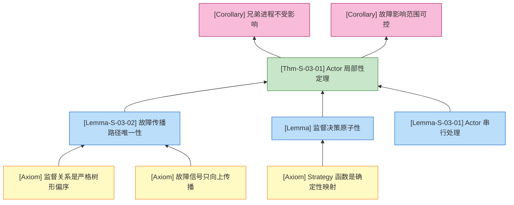

# Actor 模型形式化 (Actor Model Formalization)

> 所属阶段: Struct/01-foundation | 前置依赖: [01.02-process-calculus-primer.md](./01.02-process-calculus-primer.md) | 形式化等级: L4

---

## 1. 概念定义 (Definitions)

### Def-S-03-01. Actor 配置 (Actor Configuration)

一个 **Actor 配置** $\mathcal{C}$ 是描述 Actor 系统全局状态的形式化结构：

$$
\mathcal{C} \triangleq \langle \mathcal{A}, \mathcal{M}, \sigma_{env} \rangle
$$

其中：

- $\mathcal{A}$: 有限 Actor 集合，每个 $a \in \mathcal{A}$ 具有唯一标识符 $\iota(a) \in \mathbb{I}$；
- $\mathcal{M}: \mathbb{I} \to \text{Msg}^*$: 邮箱函数，将地址映射到待处理消息队列；
- $\sigma_{env}$: 环境状态，记录可用地址集合、监督关系图等元信息。

单个 Actor 的内部状态为四元组：

$$
a = \langle \iota, b, \sigma, \pi \rangle
$$

其中 $\iota$ 为地址，$b: \text{Msg} \times \text{State} \to (\text{Behavior} \times \text{State} \times \text{Effect}^*)$ 为行为函数，$\sigma \in \text{State}$ 为私有状态，$\pi \subseteq \mathbb{I}$ 为 acquaintance 集合（可通信地址）[^1][^2]。

**直观解释**：Actor 配置将全局状态显式分解为计算实体、通信基础设施和环境元信息。这种分解是证明"无共享状态"和"故障隔离"的基础——邮箱的显式建模使得消息顺序性可分析，私有状态 $\sigma$ 的限定排除了跨 Actor 内存共享[^1]。

**定义动机**：私有状态 $\sigma$ 排除跨 Actor 共享内存；邮箱函数 $\mathcal{M}$ 使消息顺序可分析；环境状态 $\sigma_{env}$ 支持监督关系的动态变化。

---

### Def-S-03-02. Actor 行为 (Actor Behavior)

Actor 行为 $b$ 定义了 Actor 在接收消息时可执行的三种**原语操作**：

$$
\text{Effect} ::= \text{send}(\iota, v) \mid \text{spawn}(b_0, \sigma_0) \mid \text{become}(b')
$$

其中 $\text{send}(\iota, v)$ 将值 $v$ 异步发送到地址 $\iota$；$\text{spawn}(b_0, \sigma_0)$ 创建新 Actor；$\text{become}(b')$ 将当前行为替换为 $b'$，不影响正在处理的消息和私有状态。

抽象语法：

$$
\begin{aligned}
B &::= \lambda(m, \sigma). \{ \text{case}\ m\ \text{of}\ \overline{p_i \to E_i} \} \\
E &::= \text{skip} \mid \text{send}(\iota, v); E \mid \text{spawn}(B, \sigma); E \mid \text{become}(B); E \mid E_1; E_2
\end{aligned}
$$

**直观解释**：Actor 行为是消息驱动的状态机——每次处理一条消息，根据消息和当前状态决定发送什么、创建谁、以及下一次以什么行为继续存在。`become` 是 Actor 区别于普通对象的核心机制，支持运行时协议切换（如 TCP 连接的状态迁移）[^2]。

**定义动机**：`become` 支持动态协议切换；状态与行为分离为 Typed Actor 研究奠基；三种原语对应 π-演算构造，便于跨模型编码。

---

### Def-S-03-03. Actor 操作语义 (Actor Operational Semantics)

Actor 配置的转移关系为 $\mathcal{C} \xrightarrow{\mu} \mathcal{C}'$，其中 $\mu \in \{ \tau \} \cup \{ \iota!v, \iota?m \}$。

**核心 SOS 规则**：

```
             m = head(M(ι(a)))      b(m, σ) = (b', σ', εs)
[ACT-RECV] ──────────────────────────────────────────────────
       ⟨A, M, σ_env⟩ ──τ──► ⟨A[a↦⟨ι,b',σ',π⟩], M'[ι(a)↦tail(M(ι(a)))], σ_env'⟩

       where M' = M ∪ {enqueue effects from εs}
             σ_env' = σ_env ∪ {spawn effects from εs}

             ι ∈ dom(A)    v is a value
[ACT-SEND] ───────────────────────────────────────────
       ⟨A, M, σ_env⟩ ──ι!v──► ⟨A, M[ι ↦ M(ι) ∘ v], σ_env⟩

             spawn(b₀, σ₀) ∈ εs    ι_new = fresh(σ_env)
[ACT-SPAWN] ──────────────────────────────────────────────────────────────
       ⟨A, M, σ_env⟩ ──τ──► ⟨A ∪ {⟨ι_new, b₀, σ₀, ∅⟩}, M[ι_new ↦ ε], σ_env[ι_new]⟩

             become(b') ∈ εs    a = ⟨ι, b, σ, π⟩
[ACT-BECOME] ─────────────────────────────────────────────────
       ⟨A, M, σ_env⟩ ──τ──► ⟨A[a ↦ ⟨ι, b', σ, π⟩], M, σ_env⟩
```

**直观解释**：SOS 规则将 Actor 的"异步消息传递 + 串行执行"形式化。[ACT-RECV] 的 $\tau$ 动作表示消息处理内部不可见；[ACT-SEND] 追加消息到目标邮箱；[ACT-SPAWN] 和 [ACT-BECOME] 分别处理创建和行为切换[^2][^3]。

**定义动机**：SOS 提供可执行形式模型；单条消息处理原子化为 $\tau$ 转移，精确捕捉无锁一致性；`send`/`spawn` 对应 π-演算构造。

---

### Def-S-03-04. 监督配置与故障边界 (Supervision Configuration)

容错 Actor 系统（如 Erlang/OTP 和 Akka）中，配置扩展为**监督配置** $\mathcal{C}_{sup}$：

$$
\mathcal{C}_{sup} \triangleq \langle \mathcal{A}, \mathcal{M}, \sigma_{env}, \prec_{sup}, \text{Strategy} \rangle
$$

其中：

- $\prec_{sup} \subseteq \mathbb{I} \times \mathbb{I}$: 严格偏序的监督关系；
- $\text{Strategy}: \mathbb{I} \times \text{Error} \to \{ \text{resume}, \text{restart}, \text{stop}, \text{escalate} \}$: 监督策略函数。

监督树 $T = (\mathcal{A}, \prec_{sup})$ 满足：

1. **无环性**：$\prec_{sup}$ 无环；
2. **单根性**：存在唯一根节点；
3. **唯一父节点**：每个非根节点有且仅有一个直接监督者。

**直观解释**：监督配置在基础 Actor 上增加了树形故障处理结构。异常沿 $\prec_{sup}$ 向上传播，监督者根据 Strategy 决定恢复方式[^3][^4]。

**定义动机**：树形偏序为故障传播提供上界；不同子树可配置不同 Strategy，支持模块化容错设计。

---

## 2. 属性推导 (Properties)

### Prop-S-03-01. 消息处理的串行性 (Serial Execution Property)

**陈述**：在任意时刻 $t$，对于任意 Actor $a \in \mathcal{A}$，至多只有一个执行线程在解释 $a$ 的行为函数 $b$。

**推导**：由 Def-S-03-03 的 [ACT-RECV]，单个 Actor 的消息处理是单个 $\tau$ 转移，只能处理队首消息；在 $\tau$ 完成前不会再次触发同一 Actor。因此 $a$ 的行为函数 $b$ 在任何时刻都不会被并发调用，得证不存在数据竞争。

> **推断 [Execution→Data]**：执行层的"单线程处理邮箱"机制保证了数据层的 Actor 内部状态一致性，无需显式锁。
>
> **依据**：Def-S-03-03 的 [ACT-RECV] 将消息处理原子化为不可分的 $\tau$ 动作。

---

### Prop-S-03-02. 监督树故障传播有界性 (Fault Propagation Boundedness)

**陈述**：对于良构的监督树 $T = (\mathcal{A}, \prec_{sup})$，若叶节点 Actor $a$ 故障，则故障传播路径长度不超过 $\text{depth}(a)$。

**推导**：由 Def-S-03-04，$\prec_{sup}$ 是严格树形偏序。Actor 故障时异常发送给直接监督者；若 Strategy 返回非 escalate 则故障被拦截，否则向上传播。由于树高有限且路径唯一，最坏情况下传播到根节点，路径长度不超过 $\text{depth}(a)$。

> **推断 [Control→Execution]**：控制层的监督策略配置直接决定执行层对故障 Actor 实例的处理行为。
>
> **依据**：Def-S-03-04 的 Strategy 函数将高层容错决策映射为底层生命周期操作。

---

### Prop-S-03-03. 异步发送的非阻塞性与最终可达性

**陈述**：`send(ι, v)` 对发送方非阻塞（有限时间内返回，不依赖接收方状态）；在无网络分区且邮箱无溢出的前提下，消息最终进入接收方邮箱。

**推导**：

1. 由 Def-S-03-03 的 [ACT-SEND]，`send` 仅修改 $\mathcal{M}$，不涉及同步握手。
2. 发送方观察动作 $\iota!v$ 执行后可立即继续。
3. 本地邮箱追加为 $O(1)$ 操作。
4. 在可靠性假设下，消息最终进入接收方邮箱。
5. 得证：`send` 既非阻塞又保证最终可达。

---

## 3. 关系建立 (Relations)

### 关系 1：Actor Model 与 π-Calculus 的编码关系

**关系**：Actor Model $\subset$ 异步 π-演算 (Asynchronous $\pi$-calculus)

**论证**：

Agha 和 Mason (1997) 证明了 Actor 模型可忠实编码为异步 π-演算的受限子集[^2]。核心映射：

$$
\begin{aligned}
[\![ \text{send}(a, v) ]\!]_{\pi} &= \bar{a}\langle v \rangle \\
[\![ \text{receive}(m).B ]\!]_{\pi} &= a(m).[\![ B ]\!]_{\pi} \\
[\![ \text{spawn}(B_0, \sigma_0) ]\!]_{\pi} &= (\nu c)(\bar{c}\langle [\![ B_0 ]\!]_{\pi} \rangle \mid !c(x).x) \\
[\![ \text{become}(B') ]\!]_{\pi} &= [\![ B' ]\!]_{\pi}
\end{aligned}
$$

- **编码存在性**：Actor 的 `send` 对应 π-演算输出前缀；`receive` 对应输入前缀；`spawn` 通过 $(\nu c)$ 创建新名字并用复制算子 $!c(x).x$ 实现行为持久化；`become` 对应行为替换[^2][^5]。
- **分离结果**：π-演算支持**通道名传递**（higher-order mobility），可动态重组通信拓扑。Actor 虽可传递地址，但无法像 π-演算那样安全扩展私有通道的作用域（参见 [01.02-process-calculus-primer.md](./01.02-process-calculus-primer.md) 中 Scope Extrusion 的讨论）。

故 Actor Model $\subset$ 异步 π-演算。

---

### 关系 2：Classic Actor 与 Typed Actor 的关系

**关系**：Typed Actor $\subset$ Classic Actor（表达能力上严格子集，安全性上增强）

**论证**：

Typed Actor（如 Akka Typed）在 Classic Actor 上增加了编译时类型约束：

$$
\mathcal{A}_{typed}(T) = \langle \iota, b_T, m_T, \sigma \rangle
$$

其中 $m_T$ 是类型过滤后的邮箱，只包含 $t \in T$ 的消息。

- **编码存在性**：任何 Typed Actor 都可视为增加编译时过滤器的 Classic Actor，运行时行为完全一致。
- **分离结果**：Classic Actor 可接收任意动态构造消息，Typed Actor 会拒绝不符合 $T$ 的发送模式。因此 Typed Actor 表达能力更受限，但获得了编译期排除消息不匹配错误的静态保证。

---

### 关系 3：Actor 模型与 CSP 的关系

**关系**：Actor Model $\perp$ CSP（语义上不可比较）

**论证**：

Actor 与 CSP 在通信范式上存在根本差异（参见 [01.02-process-calculus-primer.md](./01.02-process-calculus-primer.md)）：

| 维度 | Actor Model | CSP |
|------|-------------|-----|
| 通信方式 | 异步消息传递 | 同步握手 |
| 通道/地址 | 动态创建和传递 | 静态事件名集合 |
| 状态模型 | 本地私有状态 | 进程表达式 |

双向模拟均丢失核心特性：将 Actor 编码为 CSP 需用缓冲进程模拟异步，破坏了"发送即完成"直觉；将 CSP 编码为 Actor 需用请求-应答模拟同步，但无法精确表达 CSP 的 failures/divergences 语义。两者均可编码进 π-演算，但彼此之间不可直接比较（$\perp$）。

---

### 图 3.1: Actor 系统架构概念依赖图

```mermaid
graph TB
    subgraph "形式理论基础"
        T1[Actor Calculus<br/>Agha 1986] --> T2[Classic Actor]
        T3[π-Calculus<br/>Milner 1992] --> T4[Actor ⊂ Async-π]
    end

    subgraph "核心概念"
        C1[Actor Configuration<br/>⟨A, M, σ_env⟩]
        C2[Actor Behavior<br/>send | spawn | become]
        C3[Operational Semantics<br/>SOS Rules]
        C4[Supervision Config<br/>⟨A, M, σ_env, ≺_sup, Strategy⟩]
    end

    subgraph "性质保证"
        P1[Serial Execution<br/>无数据竞争]
        P2[Fault Isolation<br/>故障传播有界]
        P3[Asynchronous Send<br/>非阻塞最终可达]
    end

    subgraph "工程实现"
        I1[Erlang/OTP]
        I2[Akka Actor]
        I3[Akka Typed]
    end

    T2 --> C1
    T2 --> C2
    T4 --> C3
    C1 --> C4
    C2 --> C3
    C3 --> P1
    C4 --> P2
    C3 --> P3
    P1 --> I1
    P1 --> I2
    P2 --> I1
    P2 --> I2
    P3 --> I3

    style T1 fill:#fff9c4,stroke:#f57f17
    style T3 fill:#fff9c4,stroke:#f57f17
    style C1 fill:#e1bee7,stroke:#6a1b9a
    style C2 fill:#e1bee7,stroke:#6a1b9a
    style C4 fill:#e1bee7,stroke:#6a1b9a
    style P1 fill:#c8e6c9,stroke:#2e7d32
    style P2 fill:#c8e6c9,stroke:#2e7d32
    style I1 fill:#b2dfdb,stroke:#00695c
    style I2 fill:#b2dfdb,stroke:#00695c
```

**图说明**：展示了 Actor 模型从形式理论到核心概念、性质保证再到工程实现的层次依赖。黄色节点为理论基础；紫色为核心定义；绿色为推导性质；青色为工程实现。

---

## 4. 论证过程 (Argumentation)

### Lemma-S-03-01. Actor 邮箱串行处理引理

**陈述**：设 Actor $a = \langle \iota, b, \sigma, \pi \rangle$ 的邮箱为 $\mathcal{M}(\iota)$。对于任意两条消息 $m_1, m_2 \in \mathcal{M}(\iota)$，它们的处理不会并发执行。

**证明**：由 Def-S-03-03 的 [ACT-RECV]，配置转移要求 $m = \text{head}(\mathcal{M}(\iota(a)))$。设 $m_1$ 为队首，触发 [ACT-RECV] 后系统进入 $\mathcal{C}'$，队首被移除，$m_1$ 不可能再被处理。新消息通过 [ACT-SEND] 入队但位于尾部，须等待当前队首处理完成。因此在 $\tau$ 转移期间，不存在另一条并发 $\tau$ 转移处理同一 Actor 的其他消息。得证：$a$ 的行为函数 $b$ 严格串行执行。 ∎

---

### Lemma-S-03-02. 监督树故障传播路径唯一性

**陈述**：在良构的监督配置 $\mathcal{C}_{sup}$ 中，若 Actor $a$ 故障，则故障传播路径在树 $T = (\mathcal{A}, \prec_{sup})$ 中是唯一的。

**证明**：由 Def-S-03-04，$\prec_{sup}$ 是严格树形偏序，满足唯一父节点性质。当 $a$ 抛出异常时，信号首先发送给直接监督者 $s_1$；若 Strategy 返回 escalate，故障继续传播到 $s_1$ 的监督者 $s_2$。由于树中从任意节点到根的路径唯一，故障传播路径为 $a \to s_1 \to s_2 \to \dots \to \iota_{root}$，步数 $k = \text{depth}(a) - 1$。得证：故障传播路径唯一且长度有界。 ∎

---

### 论证 1：为什么 Actor 的串行执行足以保证无数据竞争

数据竞争的定义是：两个线程并发访问同一内存位置，且至少一个是写操作。在 Actor 模型中：

1. 由 Def-S-03-01，Actor 的内部状态 $\sigma$ 是私有的，不存在外部线程直接访问 $\sigma$ 的规则。
2. 由 Lemma-S-03-01，行为函数 $b$ 的调用是串行的——任意时刻只有一个执行流处理某 Actor 的消息。
3. 由 Def-S-03-03，状态更新和行为切换都发生在同一个 $\tau$ 转移内部，是不可分割的原子操作。

因此，"两个线程并发访问同一 Actor 状态"这一前提在 Actor 核心语义中不成立。这是 Actor 模型无需显式锁即可保证一致性的根本原因[^1][^4]。

> **注意**：该保证仅在 Actor **核心语义**内成立。工程实现若引入共享可变状态（如 Erlang ETS 或 Akka 静态变量），数据竞争可能重新出现（见第 6 节反例）。

---

### 论证 2：Actor 模型与 π-演算的本质差异

虽然 Actor 可编码进异步 π-演算，但两者存在本质差异：

1. **命名机制**：π-演算的名字既是地址又是通道；Actor 的地址 $\iota$ 是**不可伪造的**（unforgeable），只有创建者或接收者知道。acquaintance 集合 $\pi$ 直接限定了 Actor 的通信范围，具有安全意义。
2. **生命周期**：π-演算的进程可任意拆分组合（$P \mid Q$），不存在固定的"创建者-被创建者"关系；Actor 的 `spawn` 创建的新 Actor 通常与父 Actor 存在持久监督关系，这是非对称的。
3. **邮箱语义**：π-演算的输入前缀 $a(x).P$ 严格按到达顺序处理；Actor（尤其是 Erlang）支持**选择性接收**（selective receive），允许扫描邮箱优先匹配特定模式。这在 π-演算中没有直接对应，需额外编码（如维护"待处理消息"缓冲区）来模拟。

这些差异表明：Actor 模型表达能力弱于 π-演算，但在工程可用性和容错设计方面提供了 π-演算不具备的结构化抽象[^3][^4]。

---

## 5. 形式证明 (Proofs)

### Thm-S-03-01. Actor 局部性定理 (Actor Locality Theorem)

**陈述**：设 $\mathcal{C} = \langle \mathcal{A}, \mathcal{M}, \sigma_{env} \rangle$ 是一个 Actor 配置，$a = \langle \iota_a, b_a, \sigma_a, \pi_a \rangle \in \mathcal{A}$。则对于任何不包含地址 $\iota_a$ 的外部观察上下文 $O$（即 $O$ 只与其他 Actor 交互），$a$ 的内部状态变化（$\sigma_a \to \sigma_a'$ 和 $b_a \to b_a'$）对 $O$ 完全不可见；$O$ 只能观察到通过 $\text{send}(\iota, v)$ 显式发送给它的消息。

**形式化陈述**：

$$
\forall a = \langle \iota_a, b_a, \sigma_a, \pi_a \rangle, \forall O \in \text{Context}:
(\iota_a \notin \text{fn}(O)) \implies
\mathcal{C} \xrightarrow{\tau} \mathcal{C}' \text{ (由 } a \text{ 触发)} \Rightarrow
\mathcal{C} \approx_{weak} \mathcal{C}' \text{ 相对于 } O
$$

其中 $\approx_{weak}$ 表示弱互模拟。

**证明**：

**步骤 1**：由 Def-S-03-03 的 [ACT-RECV]，$b_a(m, \sigma_a) = (b_a', \sigma_a', \varepsilon s)$ 中的效果只能是 $\text{send}(\iota, v)$、$\text{spawn}(b_0, \sigma_0)$ 或 $\text{become}(b')$。

**步骤 2**：$\text{become}(b')$ 只修改 $a$ 的行为函数，$O$ 无法直接调用（只能通过 $\text{send}$ 交互），故不可见。状态更新 $\sigma_a \to \sigma_a'$ 发生在私有状态中，同样不可见。

**步骤 3**：`spawn` 创建的新 Actor $a_{new}$ 具有全新地址 $\iota_{new}$。由前提 $\iota_a \notin \text{fn}(O)$ 和地址唯一性，$\iota_{new} \notin \text{fn}(O)$，故 `spawn` 对 $O$ 不可见。

**步骤 4**：若 $\text{send}(\iota, v) \in \varepsilon s$ 且 $\iota \in \text{fn}(O)$，则 $O$ 可观察到 $\iota!v$；否则不可见。因此 `send` 是唯一可能可见的效果。

**步骤 5**：若 $a$ 未向 $O$ 发送消息，则 $O$ 在 $\mathcal{C}$ 和 $\mathcal{C}'$ 下行为完全一致。若 $a$ 向 $O$ 发送 $v$，则 $\mathcal{C}'$ 相对 $\mathcal{C}$ 多一个观察动作 $\iota!v$，之后再次一致。这正是弱互模拟的定义。

**关键案例**：

- **案例 1**（纯内部计算）：$a$ 只更新内部状态，不发送消息，弱互模拟直接成立。
- **案例 2**：$a$ 向 $O$ 发送 $v$，从 $O$ 视角为弱转移，弱互模拟成立。
- **案例 3**：$a$ 创建 $a_{new}$，因 $\iota_{new} \notin \text{fn}(O)$，对 $O$ 不可见。

∎

> **推断 [Theory→Model]**：Actor 局部性定理是 Actor 模型"封装性"和"信息隐藏"的形式化表达，证明了一个 Actor 就像一台图灵机——外部只能看到输入输出带，看不到内部磁带和状态寄存器[^1]。
>
> **推断 [Model→Implementation]**：工程实现必须严格禁止外部对 Actor 内部状态的直接访问。任何违反（如 ETS 共享表）都会破坏 Actor 局部性定理的前提。

---

### Thm-S-03-02. Actor 配置演进定理 (Actor Configuration Progress Theorem)

**陈述**：设 $\mathcal{C} = \langle \mathcal{A}, \mathcal{M}, \sigma_{env} \rangle$ 是一个 Actor 配置。若存在至少一个 Actor $a \in \mathcal{A}$ 其邮箱非空（$\mathcal{M}(\iota(a)) \neq \varepsilon$），则配置可以演进：存在 $\mathcal{C}'$ 使得 $\mathcal{C} \to \mathcal{C}'$。

**形式化陈述**：

$$
\exists a \in \mathcal{A}: \mathcal{M}(\iota(a)) \neq \varepsilon \implies \exists \mu, \mathcal{C}': \mathcal{C} \xrightarrow{\mu} \mathcal{C}'
$$

**证明**：由前提，存在 $a = \langle \iota_a, b_a, \sigma_a, \pi_a \rangle$ 使得 $\mathcal{M}(\iota_a) = m \cdot q \neq \varepsilon$。根据 Def-S-03-03 的 [ACT-RECV]，令 $m = \text{head}(\mathcal{M}(\iota_a))$。在良定义的 Actor 系统中，$b_a$ 对所有输入都有定义（含默认分支），故 $b_a(m, \sigma_a) = (b_a', \sigma_a', \varepsilon s)$ 必然存在。应用 [ACT-RECV] 得：

$$
\mathcal{C} \xrightarrow{\tau} \langle \mathcal{A}[a \mapsto \langle \iota_a, b_a', \sigma_a', \pi_a \rangle], \mathcal{M}[\iota_a \mapsto q], \sigma_{env}' \rangle = \mathcal{C}'
$$

其中 $\sigma_{env}'$ 和 $\mathcal{M}$ 的更新已考虑 $\varepsilon s$ 中的 spawn 和 send 效果。因此，只要存在非空邮箱，配置 $\mathcal{C}$ 就可以演进。 ∎

> **推断 [Execution→Data]**：Actor 配置演进定理保证了系统不会陷入"有工作但无法推进"的全局死锁。只要还有消息待处理，系统就总能继续计算。
>
> **依据**：Def-S-03-03 的 SOS 规则将消息存在性与配置演进直接关联，每个 Actor 都是自包含的计算单元。

---

## 6. 实例验证 (Examples)

### 示例 1：Ping-Pong Actor 系统的形式化推演

**初始配置**：

$$
\mathcal{C}_0 = \langle \{ Ping, Pong \}, \mathcal{M}_0, \sigma_{env} \rangle
$$

其中 $Ping = \langle \iota_p, b_p, 3, \{ \iota_q \} \rangle$，$Pong = \langle \iota_q, b_q, \text{null}, \{ \iota_p \} \rangle$，$\mathcal{M}_0(\iota_p) = [\text{start}]$，$\mathcal{M}_0(\iota_q) = []$。

行为定义：

$$
b_p(m, n) =
\begin{cases}
(\text{send}(\iota_q, \text{ping}); \text{become}(b_p), n-1, [\text{send}(\iota_q, \text{ping})]) & m = \text{start}, n > 0 \\
(\text{send}(\iota_q, \text{ping}); \text{become}(b_p), n-1, [\text{send}(\iota_q, \text{ping})]) & m = \text{pong}, n > 1 \\
(b_p, 0, []) & n \leq 1
\end{cases}
$$

$$
b_q(m, \_) =
\begin{cases}
(\text{send}(\iota_p, \text{pong}); \text{become}(b_q), \text{null}, [\text{send}(\iota_p, \text{pong})]) & m = \text{ping} \\
(b_q, \text{null}, []) & \text{otherwise}
\end{cases}
$$

**推演**：

1. $Ping$ 接收 `start`，状态变为 2，向 $Pong$ 发送 `ping`；$\mathcal{M}_1(\iota_q) = [\text{ping}]$。
2. $Pong$ 接收 `ping`，向 $Ping$ 发送 `pong`；$\mathcal{M}_2(\iota_p) = [\text{pong}]$。
3. 重复 2 轮后 $Ping$ 状态变为 0，最终系统邮箱均为空。

此例展示了 `send` + `become` 如何实现无限循环的有限状态模拟。

---

### 示例 2：监督树故障恢复推演

考虑监督配置 $\mathcal{C}_{sup} = \langle \{ S, W_1, W_2 \}, \mathcal{M}, \sigma_{env}, \prec_{sup}, \text{Strategy} \rangle$，其中：

- $\prec_{sup} = \{ (\iota_s, \iota_{w1}), (\iota_s, \iota_{w2}) \}$
- $\text{Strategy}(\iota_{w1}, e) = \text{restart}$

**故障场景**：$W_1$ 抛出异常 $e$，异常信号发送给监督者 $S$；$S$ 的 Strategy 返回 $\text{restart}$，销毁旧 $W_1$ 并创建 $W_1'$（地址保持 $\iota_{w1}$）。$W_2$ 在此过程中不受影响，状态 $\sigma_{w2}$ 保持不变。这形式化演示了监督树故障隔离：$W_1$ 的故障被限制在自身，不影响兄弟进程 $W_2$。

---

### 反例 1：共享可变状态破坏 Actor 局部性定理

**场景**（Akka）：

```scala
var sharedCounter = 0  // 外部共享可变状态

class BadActor extends Actor {
  def receive = {
    case Increment => sharedCounter += 1
    case GetCount  => sender ! sharedCounter
  }
}

val a1 = system.actorOf(Props[BadActor])
val a2 = system.actorOf(Props[BadActor])
a1 ! Increment
a2 ! Increment
```

**分析**：

- **违反的前提**：Def-S-03-01 中 Actor 内部状态 $\sigma$ 的私有性假设。`sharedCounter` 被多个 Actor 共享访问。
- **导致的异常**：`sharedCounter += 1` 不是原子操作，两个 Actor 可能在不同线程上并发执行，导致更新丢失（最终值可能为 1 而非 2）。
- **定理违反**：Thm-S-03-01 在此失效，因为外部上下文可通过观察 `sharedCounter` 推断 $a_1$ 和 $a_2$ 的内部状态变化。

**结论**：Actor 的形式化保证**仅在核心语义被遵守时成立**。工程实现中的共享状态（静态变量、ETS 表、闭包捕获）会彻底破坏这些保证。

---

### 反例 2：邮箱溢出导致系统崩溃

**场景**（Erlang）：

```erlang
producer(ConsumerPid) ->
    lists:foreach(fun(I) -> ConsumerPid ! {msg, I} end, lists:seq(1, 10000)),
    timer:sleep(1000),
    producer(ConsumerPid).

consumer() ->
    receive
        {msg, I} -> timer:sleep(10), consumer()
    end.
```

**分析**：

- **违反的前提**：Thm-S-03-02 保证系统能演进，但不保证资源无限。Actor 模型理论假设邮箱逻辑无限，物理实现受内存限制。
- **导致的异常**：生产速率 10000 msg/s，消费速率 100 msg/s，邮箱以 9900 msg/s 累积。100 秒后邮箱达 99 万条，最终因 OOM 崩溃或 GC 压力过大导致延迟激增。
- **定理边界**：演进定理保证"有消息就能处理"，但不保证"处理速度跟得上生产速度"。

**结论**：Actor 模型不自动解决背压问题。实际系统必须显式引入 bounded mailbox 或流控机制。

---

## 7. 可视化 (Visualizations)

### 图 7.1: Actor 模型到 π-演算的编码关系图

```mermaid
graph BT
    subgraph "底层理论"
        PI[π-Calculus<br/>Milner 1992]
        API[Async π-Calculus]
    end

    subgraph "编码映射"
        E1[send(a,v) ↦ ā⟨v⟩]
        E2[receive(m).B ↦ a(m).B]
        E3[spawn(B₀,σ₀) ↦ (νc)(c̄⟨B₀⟩ | !c(x).x)]
        E4[become(B') ↦ B']
    end

    subgraph "Actor 模型"
        A1[Classic Actor<br/>Hewitt 1973]
        A2[Erlang Actor<br/>选择性接收扩展]
        A3[Akka Actor<br/>监督树扩展]
    end

    PI --> API
    API --> E1
    API --> E2
    API --> E3
    API --> E4
    E1 --> A1
    E2 --> A1
    E3 --> A1
    E4 --> A1
    A1 --> A2
    A1 --> A3

    style PI fill:#fff9c4,stroke:#f57f17
    style API fill:#fff9c4,stroke:#f57f17
    style A1 fill:#e1bee7,stroke:#6a1b9a
    style A2 fill:#b2dfdb,stroke:#00695c
    style A3 fill:#b2dfdb,stroke:#00695c
```

**图说明**：展示 Actor 核心操作通过 Agha-Mason 编码映射到异步 π-演算。

---

### 图 7.2: 监督树故障隔离的公理-定理推理树



**图说明**：展示从监督树公理到 Actor 局部性定理的完整形式化推导链条。

---

## 8. 引用参考 (References)

[^1]: G. A. Agha, *Actors: A Model of Concurrent Computation in Distributed Systems*, MIT Press, 1986.
[^2]: G. Agha and I. Mason, "Actor Languages: Their Syntax, Semantics, Translation, and Equivalence," *Theoretical Computer Science*, 1997.
[^3]: C. Hewitt, P. Bishop, and R. Steiger, "A Universal Modular Actor Formalism for Artificial Intelligence," *IJCAI*, 1973.
[^4]: P. Haller and M. Odersky, "Actors that Unify Threads and Events," *LNCS*, 4467, Springer, 2007.
[^5]: R. Milner, "The Polyadic π-Calculus: A Tutorial," *Logic and Algebra of Specification*, Springer, 1993.
