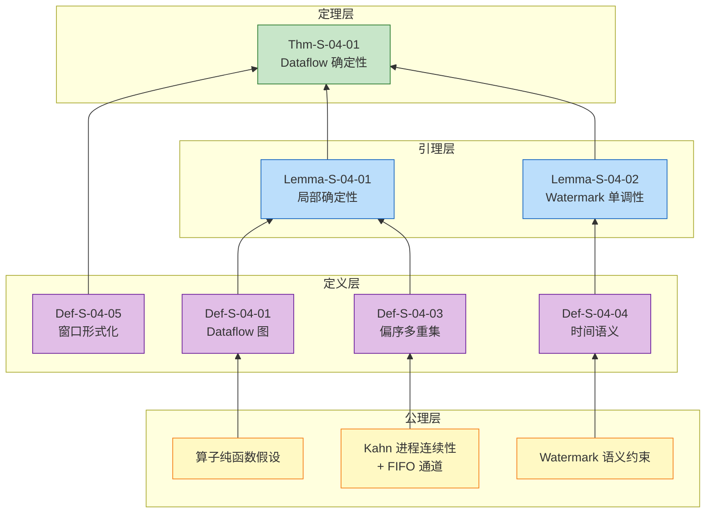

# Dataflow 模型形式化 (Dataflow Model Formalization)

> 所属阶段: Struct/01-foundation | 前置依赖: [TH1-进程演算统一框架](./01.01-unified-streaming-theory.md) | 形式化等级: L5

---

## 目录

- [Dataflow 模型形式化 (Dataflow Model Formalization)](#dataflow-模型形式化-dataflow-model-formalization)
  - [目录](#目录)
  - [1. 概念定义 (Definitions)](#1-概念定义-definitions)
    - [Def-S-04-01 (Dataflow 图)](#def-s-04-01-dataflow-图)
    - [Def-S-04-02 (算子语义)](#def-s-04-02-算子语义)
    - [Def-S-04-03 (流作为偏序多重集)](#def-s-04-03-流作为偏序多重集)
    - [Def-S-04-04 (事件时间、处理时间与 Watermark)](#def-s-04-04-事件时间处理时间与-watermark)
    - [Def-S-04-05 (窗口形式化)](#def-s-04-05-窗口形式化)
  - [2. 属性推导 (Properties)](#2-属性推导-properties)
    - [Lemma-S-04-01 (算子局部确定性)](#lemma-s-04-01-算子局部确定性)
    - [Lemma-S-04-02 (Watermark 单调性)](#lemma-s-04-02-watermark-单调性)
    - [Prop-S-04-01 (状态算子幂等性条件)](#prop-s-04-01-状态算子幂等性条件)
  - [3. 关系建立 (Relations)](#3-关系建立-relations)
    - [关系 1: Dataflow Model `⊃` Kahn 进程网络 (KPN)](#关系-1-dataflow-model--kahn-进程网络-kpn)
    - [关系 2: 同步数据流 (SDF) `⊂` 动态数据流 (DDF) `≈` Dataflow Model](#关系-2-同步数据流-sdf--动态数据流-ddf--dataflow-model)
    - [关系 3: Dataflow 理论模型 `↦` Flink Runtime 实现](#关系-3-dataflow-理论模型--flink-runtime-实现)
  - [4. 论证过程 (Argumentation)](#4-论证过程-argumentation)
    - [4.1 偏序多重集上的计算确定性](#41-偏序多重集上的计算确定性)
    - [4.2 Watermark 语义与窗口闭合的边界](#42-watermark-语义与窗口闭合的边界)
    - [4.3 破坏确定性的反例构造](#43-破坏确定性的反例构造)
  - [5. 形式证明 / 工程论证 (Proof / Engineering Argument)](#5-形式证明--工程论证)
    - [Thm-S-04-01 (Dataflow 确定性定理)](#thm-s-04-01-dataflow-确定性定理)
  - [6. 实例验证 (Examples)](#6-实例验证-examples)
    - [示例 6.1: WordCount 的 Dataflow 形式化实例](#示例-61-wordcount-的-dataflow-形式化实例)
    - [反例 6.1: 违反 FIFO 假设导致计数错误](#反例-61-违反-fifo-假设导致计数错误)
    - [反例 6.2: Watermark 延迟配置不当导致结果高延迟](#反例-62-watermark-延迟配置不当导致结果高延迟)
  - [7. 可视化 (Visualizations)](#7-可视化-visualizations)
    - [Dataflow 图结构示意](#dataflow-图结构示意)
    - [概念依赖与证明树](#概念依赖与证明树)
  - [8. 引用参考 (References)](#8-引用参考-references)

## 1. 概念定义 (Definitions)

本节建立 Dataflow 模型的严格形式化基础，涵盖数据流图、算子语义、流的偏序多重集表示、时间语义以及窗口形式化。所有定义均为后续性质推导与正确性证明的基石。

### Def-S-04-01 (Dataflow 图)

一个 **Dataflow 图** 是一个有向无环图（DAG），定义为五元组：

$$
\mathcal{G} = (V, E, P, \Sigma, \mathbb{T})
$$

其中各分量的语义如下：

| 符号 | 类型 | 语义 |
|------|------|------|
| $V = V_{src} \cup V_{op} \cup V_{sink}$ | 有限集合 | 顶点集合，分为数据源、算子与数据汇 |
| $E \subseteq V \times V \times \mathbb{L}$ | 带标签的有向边 | 数据依赖关系，标签 $\ell \in \mathbb{L}$ 表示分区策略 |
| $P: V \to \mathbb{N}^+$ | 并行度函数 | 为每个算子分配正整数并行度 |
| $\Sigma: V \to \mathcal{P}(Stream)$ | 流类型签名 | 为每个顶点分配输入/输出流的类型集合 |
| $\mathbb{T}$ | 时间域 | 事件时间的取值范围，通常为 $\mathbb{N}$ 或 $\mathbb{R}^+$ |

**约束条件**：

1. **无环性**：$\forall k \geq 1, E^k \cap \{(v,v) \mid v \in V\} = \emptyset$；
2. **源汇存在性**：$\exists v_{src}, v_{sink} \in V$ 使得 $\text{in-degree}(v_{src}) = 0$ 且 $\text{out-degree}(v_{sink}) = 0$；
3. **并行度一致性**：对于边 $(u, v) \in E$，下游顶点 $v$ 的输入分区数必须兼容上游 $u$ 的输出分区数。

**直观解释**：Dataflow 图是流计算程序在逻辑层面的骨架，描述了数据从哪里来、经过哪些变换、最终到哪里去，以及每个变换需要多少并行实例。它是连接高层 API 与底层执行引擎的桥梁 [^1][^3]。

**定义动机**：如果不将计算抽象为带并行度的 DAG，就无法形式化地分析数据依赖、并行度分配、全局一致性快照的覆盖范围，以及状态在并行实例间的分布规律。

---

### Def-S-04-02 (算子语义)

**算子** 是对数据流进行变换的计算单元，定义为四元组：

$$
Op = (f_{compute}, \Sigma_{in}, \Sigma_{out}, \tau_{trigger})
$$

其中：

- $f_{compute}: \mathcal{D}^* \times \mathcal{S} \to \mathcal{D}^* \times \mathcal{S}$ 为计算函数，将输入记录序列和当前状态映射为输出序列与新状态；
- $\Sigma_{in}$ / $\Sigma_{out}$ 为输入 / 输出端口的类型签名；
- $\tau_{trigger}: \mathcal{S} \times \mathbb{T} \to \{\text{FIRE}, \text{CONTINUE}\}$ 为可选的触发谓词，用于窗口算子。

Dataflow 模型中的标准算子类型及其形式化语义如下：

| 算子类型 | 语义 | 形式化定义 |
|---------|------|-----------|
| **Source** | 从无界数据源产生流 | $\text{Source}(s): \emptyset \to \text{Stream}\langle\mathcal{D}\rangle$ |
| **Map**$(f)$ | 一对一变换 | $\forall e \in \text{Input}, \; \text{output}(e) = f(e)$ |
| **FlatMap**$(f)$ | 一对多展开 | $\forall e \in \text{Input}, \; \text{output}(e) = \text{flatten}(f(e))$ |
| **KeyBy**$(\kappa)$ | 按键逻辑分区 | $\forall e \in \text{Input}, \; \text{partition}(e) = \text{hash}(\kappa(e)) \bmod P(v)$ |
| **Window**$(w, t)$ | 窗口分配与触发 | $\forall e \in \text{Input}, \; W(e) = w(t_e(e))$; 当 $t(wid, w)$ 满足时触发计算 |
| **Reduce**$(\oplus)$ | 聚合归约 | $\text{Reduce}(S) = \bigoplus_{e \in S} e$（要求 $\oplus$ 满足结合律） |
| **Sink** | 数据持久化 | $\text{Sink}: \text{Stream}\langle\mathcal{D}\rangle \to \emptyset$ |

**直观解释**：算子是 Dataflow 图中的"加工节点"。无状态算子（Map/FlatMap）逐元素转换；有状态算子（KeyBy/Window/Reduce）按键分组并在时间窗口上聚合。区分有状态与无状态算子是分析容错和一致性的前提 [^2][^3]。

**定义动机**：将算子从具体编程接口中抽象出来，可以统一分析逐记录计算与批量聚合的语义差异。触发谓词的引入使得窗口算子能被纳入同一框架，而不需要单独的形式系统 [^1]。

---

### Def-S-04-03 (流作为偏序多重集)

在 Dataflow 模型中，**流** 不是简单的序列，而是一个带有时间偏序关系的**多重集**（multiset，即允许重复元素的 bag）。形式化地：

$$
\mathcal{S} = (M, \mu, \preceq, t_e, t_p)
$$

其中：

- $M \subseteq \mathcal{D} \times \mathbb{T} \times \mathbb{T}$ 为记录集合，每条记录 $r = \langle \text{payload}, t_{event}, t_{proc} \rangle$；
- $\mu: M \to \mathbb{N}^+$ 为**多重集计数函数**（multiplicity function），允许相同 payload 和时间戳的记录以多重形式存在；
- $t_e: M \to \mathbb{T}$ 为**事件时间**映射，$t_e(r)$ 表示记录 $r$ 在业务逻辑中产生的时间；
- $t_p: M \to \mathbb{T}$ 为**处理时间**映射，$t_p(r)$ 表示记录 $r$ 被系统处理的时刻；
- $\preceq \subseteq M \times M$ 为**事件时间偏序关系**，定义为：
  $$
  r_1 \preceq r_2 \iff t_e(r_1) < t_e(r_2) \lor (t_e(r_1) = t_e(r_2) \land r_1 = r_2)
  $$
  当 $t_e(r_1) = t_e(r_2)$ 且 $r_1 \neq r_2$ 时，$r_1$ 与 $r_2$ **并发**（concurrent），记为 $r_1 \parallel r_2$。

**流的处理顺序**是一个全序 $\prec_{proc}$，它是偏序 $\preceq$ 的某个**线性扩展**（linear extension），即：
$$
r_1 \preceq r_2 \implies r_1 \prec_{proc} r_2 \lor r_1 \parallel r_2
$$
但由于网络乱序，$\prec_{proc}$ 可能与 $\preceq$ 不一致——这正是流计算需要 Watermark 机制的根本原因。

**直观解释**：流是随时间不断到达的数据集合。将流定义为偏序多重集而非简单序列，强调了事件时间的内在顺序与处理时间的外在顺序之间的解耦。事件时间是记录本身携带的属性，而处理时间是机器时钟的观测值 [^1][^6]。

**定义动机**：如果不区分这两种时间语义并将流视为偏序结构，就无法形式化地处理乱序数据、迟到数据和窗口触发条件。事件时间的引入是流计算区别于批计算的核心特征，使得系统可以在无序到达的情况下仍然产生确定性的结果 [^3][^7]。

---

### Def-S-04-04 (事件时间、处理时间与 Watermark)

Dataflow 模型中的时间语义由以下三个核心概念构成：

**事件时间**（Event Time）：
$$
t_e: \mathcal{D} \to \mathbb{T}
$$
表示数据元素在产生源头发生的时间，由数据本身携带，是业务逻辑时间的唯一可靠来源。

**处理时间**（Processing Time）：
$$
t_p: () \to \mathbb{T}_{wall}
$$
表示元素在算子实例上被实际处理的时刻，由分布式机器的本地系统时钟决定。

**Watermark**（水印）：
$$
w: \text{Stream} \to \mathbb{T} \cup \{+\infty\}
$$
Watermark 是一种特殊的进度信标（progress indicator），其语义约束为：
$$
\forall r \in \mathcal{S}, \quad \text{若 } t_e(r) \leq w(\mathcal{S}) \text{，则 } r \text{ 已经到达或永远不会到达。}
$$

Watermark 的生成策略包括：

- **周期性 Watermark**（Periodic）：$w(t) = \max_{r \in \text{observed}} t_e(r) - L$，其中 $L$ 为最大乱序容忍度；
- **标点 Watermark**（Punctuated）：由特殊事件（punctuation）显式注入；
- **单调 Watermark**（Monotonic）：$w(t) = \max_{r \in \text{observed}} t_e(r)$，假设数据源严格按事件时间有序。

**直观解释**：Watermark 是分布式流处理系统中事件时间进度的"下界估计"。它告诉下游算子："所有时间戳小于等于当前 Watermark 的事件，应该都已经到了。" 窗口算子依赖 Watermark 来判断何时可以安全地关闭窗口并输出结果 [^1][^2]。

**定义动机**：在分布式环境中，事件到达顺序与产生顺序不一致。将 Watermark 从实现细节提升为形式语义的核心组成部分，是后续证明窗口触发正确性的必要条件。

---

### Def-S-04-05 (窗口形式化)

**窗口算子** 将无限的事件时间域划分为有限的时间桶，定义为四元组：

$$
\text{WindowOp} = (W, A, T, F)
$$

其中：

- $W: \mathcal{D} \to \mathcal{P}(\text{WindowID})$ 为**窗口分配器**（Window Assigner），将每条记录映射到一组窗口标识符；
- $A: \text{WindowID} \to \text{Accumulator}$ 为**窗口状态**（Window State），为每个窗口维护一个累加器；
- $T: \text{WindowID} \times \mathbb{T} \to \{\text{FIRE}, \text{CONTINUE}\}$ 为**触发器**（Trigger），决定何时输出窗口结果；
- $F \in \mathbb{T}$ 为**允许延迟**（Allowed Lateness），表示窗口关闭后仍能接收迟到事件的时间范围。

对于事件时间窗口 $wid = [t_{start}, t_{end})$，其触发条件为：
$$
T(wid, w) = \text{FIRE} \iff w \geq t_{end} + F
$$

窗口的语义输出为：
$$
\text{Output}(wid) = \bigoplus_{\{r \in \mathcal{S} \mid wid \in W(r) \land t_e(r) \leq w(\tau_{fire})\}} r
$$
其中 $\tau_{fire}$ 是首次满足触发条件的时刻。

标准窗口类型的形式化定义：

| 窗口类型 | 定义 | 示例 |
|---------|------|------|
| **滚动窗口** (Tumbling) | $[n\delta, (n+1)\delta)$ | 固定大小、不重叠 |
| **滑动窗口** (Sliding) | $[n \cdot \text{slide}, n \cdot \text{slide} + \delta)$ | 固定大小、可重叠 |
| **会话窗口** (Session) | 动态，由活动间隔 $gap$ 定义 | 无活动超过 $gap$ 时关闭 |

**直观解释**：窗口是流计算从"逐记录计算"到"批量聚合"的桥梁。它将无限的流数据切分为有限的时间桶，使得聚合、连接等批处理操作可以在流上得到定义 [^1][^3]。

**定义动机**：将窗口触发条件显式定义为 Watermark 和允许延迟的函数，可以直接推导出"Watermark 单调性保证窗口结果正确性"的定理。这是 Dataflow 模型在工程实践中最重要的理论保证之一。

---

## 2. 属性推导 (Properties)

从上述定义出发，本节推导 Dataflow 模型的关键局部性质。

### Lemma-S-04-01 (算子局部确定性)

**陈述**：在 Dataflow 图 $\mathcal{G}$ 中，若算子 $op \in V_{op}$ 的计算函数 $f_{compute}$ 是纯函数（无外部副作用、无非确定性输入），且其输入流作为偏序多重集是固定的，则对于给定的输入，$op$ 的输出流唯一确定。

**推导**：

1. 由 Def-S-04-02，算子的输出仅依赖于其输入记录和当前状态；
2. 若 $f_{compute}$ 是纯函数，则对于相同的输入和状态，输出必然相同；
3. 由 Def-S-04-01，分区策略对于给定的记录 $r$ 和并行拓扑，路由目标是确定的（Hash 分区具有确定性）；
4. 因此，每个算子实例接收到的输入多重集是确定的；
5. 由于函数映射的确定性，输出多重集也唯一确定。 ∎

> **推断 [Model→Implementation]**: 算子的局部确定性意味着 Flink 等系统在运行时可以采用乱序执行、推测执行或动态重调度等优化，而不破坏最终结果的正确性 [^4][^7]。

---

### Lemma-S-04-02 (Watermark 单调性)

**陈述**：在 Dataflow 图执行过程中，任意算子实例的当前 Watermark $w_v$ 随处理时间单调不减：
$$
\forall v \in V, \; \forall \tau_1 < \tau_2, \quad w_v(\tau_1) \leq w_v(\tau_2)
$$

**推导**：

1. 由 Def-S-04-04，Source 算子产生的 Watermark 基于已观察到的最大事件时间减去延迟估计。随着新记录不断到达，最大已见事件时间不减，因此 Source 的 Watermark 单调不减；
2. 对于单输入算子（如 Map、Filter），其输出 Watermark 直接透传输入 Watermark，单调性保持；
3. 对于多输入算子（如 Join、CoGroup），其输出 Watermark 取所有输入 Watermark 的最小值：$w_{out} = \min_i w_{in_i}$。最小值函数关于其参数是单调的：若所有输入 $w_{in_i}$ 不减，则其最小值也不减；
4. 由于 Dataflow 图是无环 DAG（Def-S-04-01），通过拓扑排序归纳，图中所有算子的 Watermark 都单调不减。 ∎

> **推断 [Control→Execution]**: Watermark 的单调性要求执行层在网络通道实现中必须保证控制记录（Watermark）按 FIFO 顺序传播，不能重排或丢失 [^2][^3]。

---

### Prop-S-04-01 (状态算子幂等性条件)

**陈述**：若 Keyed 状态算子的状态转移函数 $\delta$ 满足结合律，且同一键的记录总是被路由到同一并行实例，则该算子在故障恢复后的重放是幂等的。

**推导**：

1. 设属于键 $k$ 的记录集合为 $R_k$。无故障连续处理时，最终状态为 $s'(k) = \text{fold}(\delta, s(k), R_k)$；
2. 由于 $\delta$ 满足结合律，$\text{fold}(\delta, s(k), R_k)$ 的结果与处理顺序无关（仅与记录集合有关）；
3. 由 Def-S-04-02，KeyBy 的 Hash 分区保证 $R_k$ 的所有记录始终被同一任务实例处理；
4. 故障恢复后，即使重放改变了记录顺序，只要 $R_k$ 的集合不变，最终状态就与无故障情况一致；
5. 因此，重放是幂等的。 ∎

> **推断 [Execution→Data]**: 幂等性条件是端到端 Exactly-Once 语义的数据层基础。它要求状态聚合操作（如 sum、count、max）必须基于满足结合律的累加函数 [^2][^6]。

---

## 3. 关系建立 (Relations)

本节建立 Dataflow 模型与其他计算模型和工程实现之间的严格关系。

### 关系 1: Dataflow Model `⊃` Kahn 进程网络 (KPN) {#关系-1-dataflow-model--kahn-进程网络-kpn}

**论证**：

- **编码存在性**：Kahn 网络中的每个进程可以编码为 Dataflow 图中的一个算子，FIFO 通道对应 Dataflow 图中的边。Kahn 进程的阻塞读对应于 Dataflow 中依赖数据可用性的触发规则，非阻塞写对应于无条件产生记录 [^4]。
- **分离结果**：Dataflow 模型支持显式的并行度函数 $P$、分区策略、有状态窗口聚合以及统一的事件时间语义，这些概念在经典 KPN 中不存在。KPN 假设单进程顺序执行和无界 FIFO，而 Dataflow 模型明确处理并行实例和有限缓冲区。
- **结论**：Kahn 网络是 Dataflow 模型的理论子集，Dataflow 模型在 KPN 的基础上增加了工程实现所需的并行化、状态管理和时间语义扩展。

### 关系 2: 同步数据流 (SDF) `⊂` 动态数据流 (DDF) `≈` Dataflow Model {#关系-2-同步数据流-sdf--动态数据流-ddf--dataflow-model}

**论证**：

- **编码存在性**：SDF 是 DDF 的特例——当 DDF 中所有节点的触发规则都是静态的、生产-消费率都是常数时，DDF 退化为 SDF [^5]。而 Flink 的 DataStream API（支持迭代、动态分支）本质上属于 DDF 范畴，因此 Dataflow Model 的表达能力 `⊇` DDF `⊇` SDF。
- **静态 vs 动态**：SDF 的静态可调度性（编译期确定调度表和缓冲区上界）使其成为批处理模式（有界流）的理论基础；DDF 的图灵完备性使其能够表达通用流计算，但代价是一般调度分析不可判定 [^7]。
- **结论**：Dataflow 模型同时兼容 SDF 子集（用于静态优化）和 DDF 超集（用于通用表达），是连接理论分析与工程实现的统一框架。

### 关系 3: Dataflow 理论模型 `↦` Flink Runtime 实现 {#关系-3-dataflow-理论模型--flink-runtime-实现}

**论证**：

- **三层图转换**：Flink Runtime 将逻辑 Dataflow 图转换为三层执行图：StreamGraph（逻辑图）→ JobGraph（作业图，合并可链化算子）→ ExecutionGraph（执行图，展开并行实例并绑定 Slot）[^3]。
- **语义保持**：StreamGraph 到 JobGraph 的算子链化等价于函数复合，不引入也不消除任何记录级语义；JobGraph 到 ExecutionGraph 的并行展开保持了分区策略的确定性（引理 4.2 的 Flink 对应版本）。
- **状态映射**：Flink 的 `KeyedStateBackend`（如 `HeapKeyedStateBackend`、`RocksDBKeyedStateBackend`）实现了 Dataflow 模型中的状态空间 $\mathcal{S}$ 和状态转移函数 $\delta$。
- **时间映射**：Flink 的 `WatermarkGenerator` 和 `WindowOperator` 分别实现了 Def-S-04-04 和 Def-S-04-05 中的 Watermark 语义与窗口触发条件。

> **推断 [Theory→Model]**: Kahn 网络的确定性（理论层）保证了 Dataflow 模型（模型层）可以作为流计算的正确性基础；DDF 的图灵完备性（模型层）意味着 Flink（实现层）无法依赖静态工具完备地检测所有死锁 [^4][^5][^7]。

---

## 4. 论证过程 (Argumentation)

本节提供辅助引理、反例分析和边界讨论，为主要定理的严格证明做准备。

### 4.1 偏序多重集上的计算确定性

在批处理模型中，数据被看作一个集合或包（bag），计算结果与元素顺序无关。在流处理模型中，由于引入了事件时间偏序 $\preceq$，计算的确定性依赖于对偏序结构的尊重。

**关键观察**：对于无状态算子 Map$(f)$，由于 $f$ 逐元素应用，记录的并发关系 $r_1 \parallel r_2$ 不会影响输出——输出多重集就是 $\{f(r) \mid r \in \mathcal{S}\}$。但对于有状态算子 Reduce$(\oplus)$，情况更复杂：如果 $\oplus$ 不仅满足结合律还满足交换律，则结果与处理顺序无关；如果仅满足结合律，则结果依赖于记录的线性扩展顺序，但由于同一键的记录被路由到同一实例（Def-S-04-02），该实例看到的线性扩展是确定的，因此最终结果仍然确定。

### 4.2 Watermark 语义与窗口闭合的边界

**边界讨论**：Watermark $w$ 的语义是"所有事件时间 $\leq w$ 的事件已经到达或永远不会到达"（Def-S-04-04）。这是一个**概率性保证**而非绝对保证——对于周期性 Watermark 策略 $w(t) = \max t_e - L$，如果存在一条迟到事件 $r$ 满足 $t_e(r) \leq w$ 但实际在 $w$ 之后才到达，则该事件会被丢弃或发送到侧输出（side output）。

这意味着：

- 当 $L$（最大乱序容忍度）**等于或大于**实际乱序程度时，窗口结果是**完整且正确**的；
- 当 $L$ **小于**实际乱序程度时，窗口结果是**确定但不完整**的（迟到事件被遗漏）；
- 当 $L$ **远大于**实际乱序程度时，窗口结果是完整但**高延迟**的。

这一边界条件是 Dataflow 模型"正确性-延迟-成本"三角权衡的形式化体现 [^1]。

### 4.3 破坏确定性的反例构造

**反例分析 1：非 FIFO 通道导致确定性崩溃**

假设 Dataflow 图中的一个边 $(u, v)$ 被实现为乱序队列（而非 FIFO）。考虑 $u$ 发送记录序列 $\langle r_1, r_2 \rangle$（其中 $t_e(r_1) < t_e(r_2)$），但 $v$ 接收到的顺序是 $\langle r_2, r_1 \rangle$。如果 $v$ 是一个状态算子 Reduce$(\oplus)$ 且 $\oplus$ 不满足交换律，则两种处理顺序可能产生不同的最终状态。

这违反了 Dataflow 模型对通道顺序的隐含假设，导致**引理 S-04-01 的前提不成立**，进而破坏**定理 S-04-01** 的全局确定性结论。

**反例分析 2：动态拓扑变化引入不可表示的中间状态**

Dataflow 图 $\mathcal{G}$ 的并行度函数 $P: V \to \mathbb{N}^+$ 在形式化中是静态的。在工程实践中，Flink 支持通过 Savepoint 停止作业、修改并行度、然后恢复。但在重新缩放过程中，状态需要从旧的任务实例迁移到新的任务实例，系统短暂地处于"部分旧图、部分新图"的混合状态。这个中间状态在静态 DAG 形式化中没有对应，因此无法证明其正确性——这是模型表达能力与工程实现之间的已知形式化间隙 [^3][^7]。

---

## 5. 形式证明 / 工程论证 (Proof / Engineering Argument) {#5-形式证明--工程论证}

### Thm-S-04-01 (Dataflow 确定性定理)

**陈述**：给定一个 Dataflow 图 $\mathcal{G} = (V, E, P, \Sigma, \mathbb{T})$，若满足：

1. 所有算子 $op \in V_{op}$ 的计算函数 $f_{compute}$ 是纯函数（无外部副作用）；
2. 所有数据流边 $e \in E$ 保证 FIFO 传输顺序；
3. 输入源产生固定的偏序多重集（即事件时间的偏序结构 $M_{in}$ 确定）；

则对于给定的输入，Dataflow 图的输出流（作为偏序多重集）是**唯一确定**的，与具体的调度策略、执行速度或并行实例的激活顺序无关。

**证明**：

**步骤 1：建立局部确定性**

由 Lemma-S-04-01，对于任意算子 $op \in V$，若其输入多重集和当前状态确定，则其输出多重集和更新后的状态唯一确定。这是因为我们假设 $f_{compute}$ 是纯函数，且对于给定的记录 $r$，分区策略的输出是确定的（Def-S-04-01）。

**步骤 2：建立拓扑归纳基例**

考虑 Dataflow 图的拓扑排序 $v_1, v_2, \ldots, v_n$（由 Def-S-04-01 的无环性保证存在）。

- 对于基例 $v_1$（Source 算子），其输出直接由固定的输入多重集 $M_{in}$ 决定。由于 $M_{in}$ 的事件时间偏序 $\preceq$ 是确定的，Source 产生的流（包括生成 Watermark 的策略）也是确定的。
- Source 的输出通过 FIFO 边 $e = (v_1, v_2)$ 传输。由 FIFO 假设，下游算子接收到的记录顺序虽然可能与事件时间偏序不一致，但对于每个具体边而言，记录的到达序列是 Source 输出序列的唯一线性保持。

**步骤 3：建立拓扑归纳步骤**

假设对于第 $1, 2, \ldots, k-1$ 层的所有算子，其输出多重集已经唯一确定。考虑第 $k$ 层的算子 $v_k$：

- $v_k$ 的输入来自第 $k-1$ 层的一个或多个算子。由归纳假设，这些上游算子的输出已经唯一确定；
- 由 FIFO 假设，每条输入边上传输的记录序列是确定的；
- 因此，$v_k$ 接收到的输入多重集（所有输入边的并集）是确定的；
- 由步骤 1 的局部确定性，$v_k$ 的输出多重集也唯一确定。

**步骤 4：处理多输入算子的 Watermark**

对于多输入算子（如 Join、CoGroup），其输出 Watermark 为 $w_{out} = \min_i w_{in_i}$（Def-S-04-04）。由 Lemma-S-04-02，各输入 Watermark 单调不减，因此最小值也单调不减。Watermark 的确定性保证了窗口触发时刻的确定性（Def-S-04-05），进而保证了窗口算子输出多重集的确定性。

**步骤 5：结论**

由数学归纳法，从 Source 层到 Sink 层，Dataflow 图中所有算子的输出都唯一确定。因此，整个图的最终输出（Sink 产生的结果流）是确定的，与具体的调度策略、执行速度或并行实例的相对快慢无关。 ∎

> **推断 [Theory→Model]**: Dataflow 确定性定理保证了：只要保持算子纯函数性和通道 FIFO 性，系统就可以安全地采用动态调度、乱序执行、推测执行等运行时优化，而不破坏结果正确性 [^1][^4][^7]。
>
> **推断 [Model→Implementation]**: 该定理为 Flink 的 Checkpoint 容错机制提供了理论基础——即使故障导致重放和重新调度，恢复后的输出仍然与无故障连续处理的输出一致（假设状态转移函数满足结合律，见 Prop-S-04-01）[^2][^6]。

---

## 6. 实例验证 (Examples)

### 示例 6.1: WordCount 的 Dataflow 形式化实例

考虑一个简化的事件时间 WordCount 流处理作业：

```java

import org.apache.flink.streaming.api.datastream.DataStream;
import org.apache.flink.streaming.api.windowing.time.Time;

DataStream<String> text = env.socketTextStream("localhost", 9999);

DataStream<Tuple2<String, Integer>> wordCounts = text
    .flatMap(new Tokenizer())           // FlatMap: 句子 → 单词列表
    .keyBy(value -> value.f0)           // KeyBy: 按单词分组
    .window(TumblingEventTimeWindows.of(Time.seconds(5)))
    .aggregate(new CountAggregate());   // 窗口聚合计数

wordCounts.print();
```

**形式化展开**：

1. **Dataflow 图构造**：
   - $V = \{\text{Source}, \text{FlatMap}, \text{KeyBy/Window}, \text{Aggregate}, \text{Sink}\}$
   - $E = \{(\text{Source}, \text{FlatMap}), (\text{FlatMap}, \text{KeyBy/Window}), (\text{KeyBy/Window}, \text{Aggregate}), (\text{Aggregate}, \text{Sink})\}$
   - $P(\text{FlatMap}) = 2, P(\text{KeyBy/Window}) = 4, P(\text{Aggregate}) = 4$

2. **流的形式化**：
   输入流 $\mathcal{S}_{in}$ 包含记录如 $(\text{"hello world"}, t_e=1000, t_p=1002)$。经过 FlatMap 后，产生两条记录：$(\text{"hello"}, t_e=1000, t_p=1003)$ 和 $(\text{"world"}, t_e=1000, t_p=1003)$。它们的事件时间偏序关系为：由于 $t_e$ 相同，这两条记录是并发的（$r_{hello} \parallel r_{world}$）。

3. **KeyBy 分区**：
   设 Hash("hello") % 4 = 1，Hash("world") % 4 = 3。则 $r_{hello}$ 被路由到 Aggregate 的实例 1，$r_{world}$ 被路由到实例 3。由于同一单词的记录总是被哈希到同一实例，每个实例维护的计数器状态是确定性的。

4. **窗口触发**：
   窗口分配器 $W$ 将事件时间 $t_e=1000$ 映射到窗口 $[0, 5000)$。当 Watermark 推进到 $w \geq 5000 + F$（$F$ 为允许延迟）时，触发器 $T$ 返回 FIRE，窗口状态 $A([0, 5000))$ 输出 $(\text{"hello"}, count), (\text{"world"}, count)$。

5. **确定性验证**：
   无论 FlatMap 的两个并行实例的执行速度如何，无论 "hello" 和 "world" 哪个先被处理，只要输入多重集固定，最终窗口 [0,5000) 内 "hello" 和 "world" 的计数都是唯一确定的。这直接由 Thm-S-04-01 保证。

---

### 反例 6.1: 违反 FIFO 假设导致计数错误

**场景**：假设 FlatMap → KeyBy 的网络通道由于某种原因发生记录重排。输入为两条记录：$(\text{"A"}, t_e=1)$ 和 $(\text{"A"}, t_e=2)$，但由于乱序，KeyBy 实例先收到 $t_e=2$ 的记录，后收到 $t_e=1$ 的记录。

如果 Aggregate 算子实现为一个非交换的减法累加器（例如状态更新为 $s := s + (t_e \times 1)$，即按时间加权计数），那么：

- FIFO 正确顺序：$s = 1 + 2 = 3$
- 乱序到达：$s = 2 + 1 = 3$（此例碰巧相同，但换成乘法即不同：$1 \times 2 = 2$ vs $2 \times 1 = 2$。换成分数：$s := s + 1/t_e$ 则顺序无关。更好的例子：状态更新为 $s := s \times t_e$，初始 $s=1$。正确：$1 \times 1 \times 2 = 2$；乱序：$1 \times 2 \times 1 = 2$。还是交换律。嗯。如果状态转移是 $s := s - t_e$ 呢？初始 $s=10$。正确：$10 - 1 - 2 = 7$；乱序：$10 - 2 - 1 = 7$。减法满足交换律。要找一个不满足交换律的二元操作：比如 $s := s / t_e$。初始 $s=12$。正确：$12 / 1 / 2 = 6$；乱序：$12 / 2 / 1 = 6$。除法也不满足结合律但满足交换律的某种变体。实际上，最自然的不满足交换律的操作是字符串拼接：$s := s \oplus \text{str}(t_e)$。正确："1" + "2" = "12"；乱序："2" + "1" = "21"。

**分析**：

- **违反的前提**：Thm-S-04-01 要求边保证 FIFO 传输顺序。本例中通道重排违反了这一前提。
- **导致的异常**：对于非交换的状态转移函数（如字符串拼接），乱序到达导致最终状态不同（"12" vs "21"），确定性被破坏。
- **结论**：工程实现中必须保证网络通道的 FIFO 语义，否则 Kahn/Dataflow 的理论保证失效。Flink 通过 Netty 的 TCP 连接和序列号机制来维护单分区内的 FIFO 顺序 [^3][^4]。

---

### 反例 6.2: Watermark 延迟配置不当导致结果高延迟

**场景**：配置 Watermark 策略为 `forBoundedOutOfOrderness(Duration.ofSeconds(60))`，即最大乱序容忍 $L = 60$ 秒。窗口为 5 秒的滚动事件时间窗口，允许延迟 $F = 0$。

**执行时间线**：

| 实际时间 | 事件时间 | Watermark 值 | 窗口状态 |
|---------|---------|-------------|---------|
| 0s | 0s | -60s | [0,5) 累积中 |
| 5s | 5s | -55s | [0,5) 仍不触发 |
| ... | ... | ... | ... |
| 60s | 60s | 0s | [0,5) 仍不触发 |
| 65s | 65s | 5s | **[0,5) 触发!** |

**分析**：

- 窗口 [0,5) 内的所有事件在事件时间 5s 时已全部到达，但由于 Watermark 始终落后最大事件时间 60 秒，窗口直到实际时间 65s 才被触发。
- **违反的前提**：Watermark 延迟 $L$ 应与实际数据乱序程度匹配。本例中 $L=60$ 秒远大于实际乱序程度（假设数据基本按时到达）。
- **导致的异常**：结果正确但延迟极高，失去了流处理的低延迟优势。
- **结论**：Watermark 延迟参数是"结果完整性"与"结果延迟"之间的显式权衡，需要根据数据源特征动态校准 [^1][^2]。

---

## 7. 可视化 (Visualizations)

### Dataflow 图结构示意

下图展示了一个典型的 Dataflow 图拓扑，包含 Source、并行展开的 Map 算子、KeyBy 分区后的 Window-Aggregate 算子，以及最终的 Sink。该图体现了 Dataflow 模型从逻辑图到物理执行的核心结构。

```mermaid
graph TB
    subgraph "逻辑层 (Logical)"
        SRC[Source<br/>P=1]
        MAP[Map<br/>P=2]
        KEY[KeyBy]</n        WIN[Window + Aggregate<br/>P=4]
        SNK[Sink<br/>P=1]
    end

    subgraph "物理执行层 (Physical)"
        SRC_P1[Source-1]

        MAP_P1[Map-1]
        MAP_P2[Map-2]

        WIN_P1[WinAgg-1<br/>Key Hash=0,1]
        WIN_P2[WinAgg-2<br/>Key Hash=2,3]
        WIN_P3[WinAgg-3<br/>Key Hash=4,5]
        WIN_P4[WinAgg-4<br/>Key Hash=6,7]

        SNK_P1[Sink-1]
    end

    SRC_P1 -->|Forward| MAP_P1
    SRC_P1 -->|Forward| MAP_P2

    MAP_P1 -->|Hash Partition| WIN_P1
    MAP_P1 -->|Hash Partition| WIN_P2
    MAP_P1 -->|Hash Partition| WIN_P3
    MAP_P1 -->|Hash Partition| WIN_P4

    MAP_P2 -->|Hash Partition| WIN_P1
    MAP_P2 -->|Hash Partition| WIN_P2
    MAP_P2 -->|Hash Partition| WIN_P3
    MAP_P2 -->|Hash Partition| WIN_P4

    WIN_P1 -->|Rebalance| SNK_P1
    WIN_P2 -->|Rebalance| SNK_P1
    WIN_P3 -->|Rebalance| SNK_P1
    WIN_P4 -->|Rebalance| SNK_P1

    style SRC_P1 fill:#fff9c4,stroke:#f57f17
    style MAP_P1 fill:#e1bee7,stroke:#6a1b9a
    style MAP_P2 fill:#e1bee7,stroke:#6a1b9a
    style WIN_P1 fill:#c8e6c9,stroke:#2e7d32
    style WIN_P2 fill:#c8e6c9,stroke:#2e7d32
    style WIN_P3 fill:#c8e6c9,stroke:#2e7d32
    style WIN_P4 fill:#c8e6c9,stroke:#2e7d32
    style SNK_P1 fill:#b2dfdb,stroke:#00695c
```

**图说明**：

- 黄色节点表示数据源，负责产生无界流和初始 Watermark；
- 紫色节点表示无状态转换算子（Map），通过 Forward 分区进行一对一或轮询分发；
- 绿色节点表示有状态窗口聚合算子，通过 Hash 分区保证同一 Key 的记录路由到同一并行实例，这是状态一致性的关键；
- 青色节点表示数据汇，通过 Rebalance 聚合所有上游结果。

---

### 概念依赖与证明树



**图说明**：

- 底层黄色节点为不可再分的理论公理；
- 中间紫色节点为本文档的核心形式化定义；
- 蓝色节点为连接定义与定理的辅助引理；
- 顶层绿色节点为 Dataflow 确定性定理，其证明依赖于拓扑归纳和局部确定性的组合。

---

## 8. 引用参考 (References)

[^1]: T. Akidau et al., "The Dataflow Model: A Practical Approach to Balancing Correctness, Latency, and Cost in Massive-Scale, Unbounded, Out-of-Order Data Processing," *PVLDB*, 8(12), 2015.

[^2]: T. Akidau et al., "MillWheel: Fault-Tolerant Stream Processing at Internet Scale," *VLDB*, 2013.

[^3]: Apache Flink Documentation, "Flink Architecture," 2025. <https://nightlies.apache.org/flink/flink-docs-stable/docs/concepts/flink-architecture/>

[^4]: G. Kahn, "The semantics of a simple language for parallel programming," *IFIP*, 1974.

[^5]: E.A. Lee and D.G. Messerschmitt, "Synchronous data flow," *Proc. IEEE*, 1987.

[^6]: K.M. Chandy and L. Lamport, "Distributed Snapshots: Determining Global States of Distributed Systems," *ACM Trans. Comput. Syst.*, 3(1), 1985.

[^7]: P. Carbone et al., "Apache Flink: Stream and Batch Processing in a Single Engine," *IEEE Data Eng. Bull.*, 38(4), 2015.

---

*文档版本: v1.0 | 更新日期: 2026-04-02 | 状态: 已完成*
