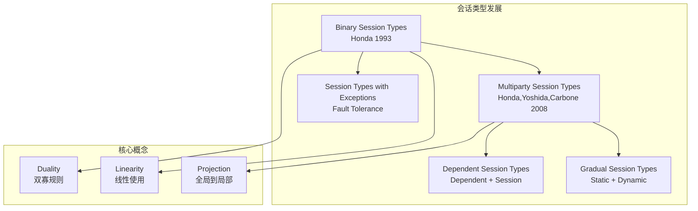
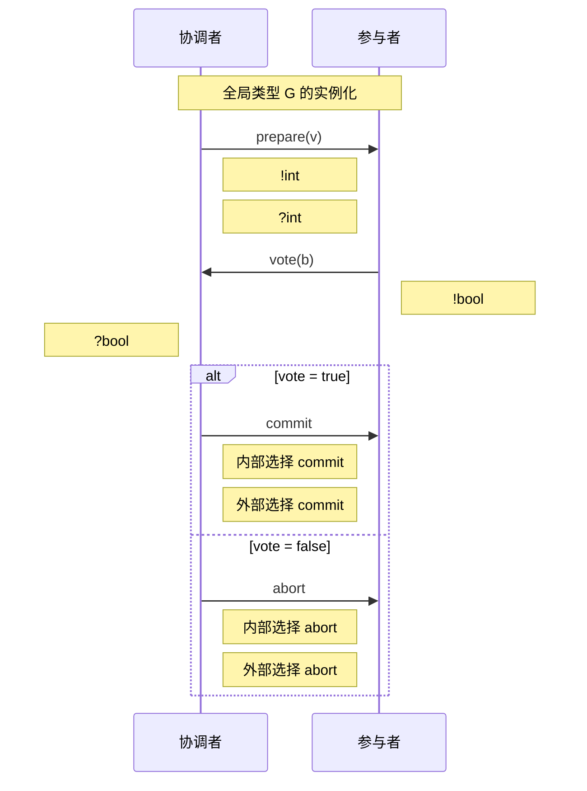
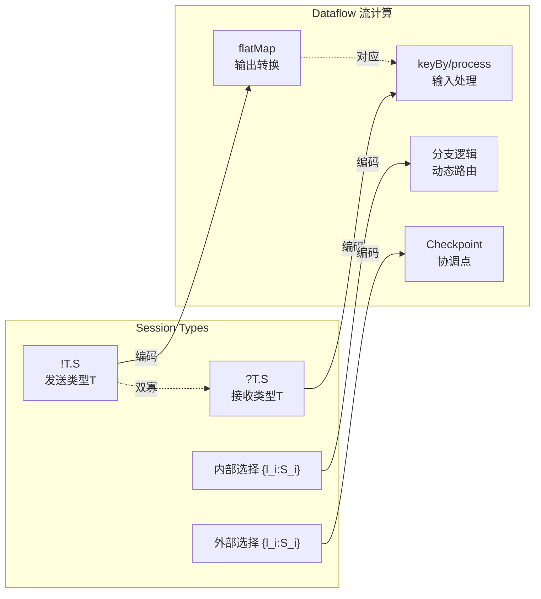
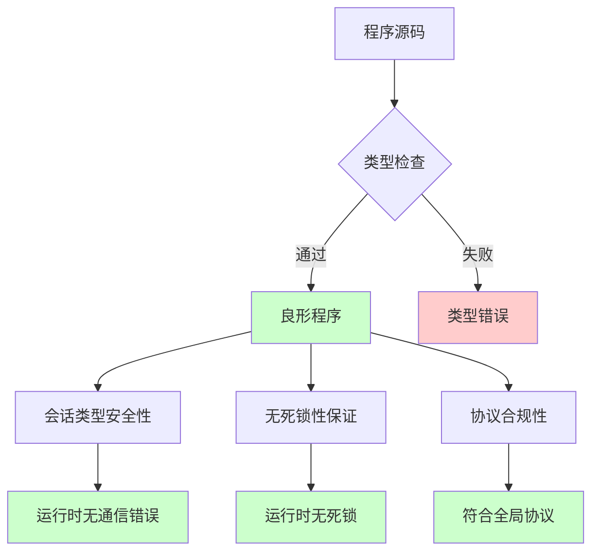

# 1.7 会话类型 (Session Types)

> **所属阶段**: Struct/01-foundation | **前置依赖**: [1.5 CSP形式化](./01.05-csp-formalization.md), [1.3 Actor模型形式化](./01.03-actor-model-formalization.md) | **形式化等级**: L4-L5

---

## 目录

- [1.7 会话类型 (Session Types)](#17-会话类型-session-types)
  - [目录](#目录)
  - [1. 概念定义 (Definitions)](#1-概念定义-definitions)
    - [1.1 二元会话类型语法](#11-二元会话类型语法)
    - [1.2 双寡规则](#12-双寡规则)
    - [1.3 多参会话类型](#13-多参会话类型)
    - [1.4 会话与进程的编码](#14-会话与进程的编码)
  - [2. 属性推导 (Properties)](#2-属性推导-properties)
    - [2.1 类型环境的形成规则](#21-类型环境的形成规则)
    - [2.2 通道线性性](#22-通道线性性)
    - [2.3 子类型关系](#23-子类型关系)
  - [3. 关系建立 (Relations)](#3-关系建立-relations)
    - [3.1 与进程演算的关联](#31-与进程演算的关联)
    - [3.2 与流计算的对应关系](#32-与流计算的对应关系)
    - [3.3 会话类型的扩展体系](#33-会话类型的扩展体系)
  - [4. 论证过程 (Argumentation)](#4-论证过程-argumentation)
    - [4.1 为什么选择线性类型？](#41-为什么选择线性类型)
    - [4.2 内部选择和外部选择的区分](#42-内部选择和外部选择的区分)
    - [4.3 多参会话 vs 二元会话](#43-多参会话-vs-二元会话)
  - [5. 形式证明 / 工程论证 (Proof)](#5-形式证明--工程论证-proof)
    - [5.1 类型安全性定理](#51-类型安全性定理)
    - [5.2 无死锁性定理](#52-无死锁性定理)
    - [5.3 协议合规性定理](#53-协议合规性定理)
  - [6. 实例验证 (Examples)](#6-实例验证-examples)
    - [6.1 两阶段提交协议的会话类型](#61-两阶段提交协议的会话类型)
    - [6.2 流处理管道的会话类型建模](#62-流处理管道的会话类型建模)
  - [7. 可视化 (Visualizations)](#7-可视化-visualizations)
    - [7.1 会话类型层次结构](#71-会话类型层次结构)
    - [7.2 两阶段提交的会话流程](#72-两阶段提交的会话流程)
    - [7.3 会话类型与流计算的映射](#73-会话类型与流计算的映射)
    - [7.4 类型系统的保证](#74-类型系统的保证)
  - [8. 引用参考 (References)](#8-引用参考-references)
  - [附录 A: 符号速查表](#附录-a-符号速查表)

## 1. 概念定义 (Definitions)

会话类型(Session Types)是由 Kohei Honda 于 1993 年提出的类型理论，用于描述通信协议的结构化类型。它为进程间的消息交换提供了形式化的规范，确保通信双方遵循一致的协议。

### 1.1 二元会话类型语法

**定义 1.7.1** (二元会话类型语法). 设 $T$ 为值类型，会话类型 $S$ 的语法定义如下：

$$
\text{Def-S-01-08} \quad S ::=
\begin{cases}
!T.S & \text{(输出: 发送类型 } T \text{ 的值，继续会话 } S) \\
?T.S & \text{(输入: 接收类型 } T \text{ 的值，继续会话 } S) \\
\oplus\{l_1:S_1, \ldots, l_n:S_n\} & \text{(内部选择: 发送标签 } l_i \text{，继续 } S_i) \\
\&\{l_1:S_1, \ldots, l_n:S_n\} & \text{(外部选择: 接收标签 } l_i \text{，继续 } S_i) \\
\text{end} & \text{(会话终止)}
\\
\mu X.S & \text{(递归定义)} \\
X & \text{(递归变量)}
\end{cases}
$$

**直观解释**:

- $!T.S$ 表示进程**发送**一个类型为 $T$ 的消息，然后按照 $S$ 继续
- $?T.S$ 表示进程**接收**一个类型为 $T$ 的消息，然后按照 $S$ 继续
- $\oplus$ (oplus) 表示发送方**选择**一个分支继续
- $\&$ 表示接收方**提供**多个分支供选择

### 1.2 双寡规则

**定义 1.7.2** (双寡 / Duality). 双寡操作 $\overline{S}$ 将会话类型 $S$ 转换为其对偶类型：

$$
\text{Def-S-01-09} \quad
\begin{aligned}
\overline{!T.S} &= ?T.\overline{S} \\
\overline{?T.S} &= !T.\overline{S} \\
\overline{\oplus\{l_i:S_i\}_{i \in I}} &= \&\{l_i:\overline{S_i}\}_{i \in I} \\
\overline{\&\{l_i:S_i\}_{i \in I}} &= \oplus\{l_i:\overline{S_i}\}_{i \in I} \\
\overline{\text{end}} &= \text{end} \\
\overline{\mu X.S} &= \mu X.\overline{S} \\
\overline{X} &= X
\end{aligned}
$$

双寡规则确保通信双方的类型互补：发送对应接收，选择对应分支。

### 1.3 多参会话类型

**定义 1.7.3** (全局类型 / Global Types). 对于涉及多个参与者的会话，全局类型 $G$ 描述所有参与者之间的交互协议：

$$
\text{Def-S-01-10} \quad G ::=
\begin{cases}
p \to q : \{l_i\langle T_i \rangle.G_i\}_{i \in I} & \text{(参与者 } p \text{ 向 } q \text{ 发送标签 } l_i \text{ 和值 } T_i) \\
\mu X.G & \text{(递归)} \\
X & \text{(递归变量)} \\
\text{end} & \text{(终止)}
\end{cases}
$$

其中 $p \to q$ 表示从参与者 $p$ 到 $q$ 的消息交换。通过**投影**操作 $\downarrow$，可以从全局类型推导出每个参与者的局部会话类型。

### 1.4 会话与进程的编码

**定义 1.7.4** (会话-进程编码). 会话类型可以通过以下编码映射到 π-演算进程：

$$
\text{Def-S-01-11} \quad
\begin{aligned}
\llbracket !T.S \rrbracket_x &= \overline{x}\langle y \rangle.(P_T \mid \llbracket S \rrbracket_x) \quad \text{其中 } y:T \\
\llbracket ?T.S \rrbracket_x &= x(y).(\llbracket S \rrbracket_x \mid P'_T) \\
\llbracket \oplus\{l_i:S_i\} \rrbracket_x &= \bigoplus_{i \in I} \overline{x}\langle l_i \rangle.\llbracket S_i \rrbracket_x \\
\llbracket \&\{l_i:S_i\} \rrbracket_x &= x\{\text{case } l_i \Rightarrow \llbracket S_i \rrbracket_x\}_{i \in I}
\end{aligned}
$$

---

## 2. 属性推导 (Properties)

### 2.1 类型环境的形成规则

设 $\Gamma$ 为变量到类型的映射，$\Delta$ 为通道到会话类型的映射。进程 $P$ 的类型判断写作：

$$
\Gamma \vdash P :: \Delta
$$

表示在环境 $\Gamma$ 下，进程 $P$ 使用通道集合 $\Delta$。

**引理 2.1** (环境弱化). 若 $\Gamma \vdash P :: \Delta$ 且 $x \notin \text{fn}(P)$，则：

$$
\text{Lemma-S-01-04} \quad \Gamma, x:T \vdash P :: \Delta
$$

### 2.2 通道线性性

**引理 2.2** (线性使用). 每个会话通道必须按照其类型恰好使用一次：

$$
\text{Lemma-S-01-05} \quad \text{若 } x:S \in \Delta \text{ 且 } x \text{ 在 } P \text{ 中出现，则 } x \text{ 必须完整消耗 } S
$$

线性性确保无死锁：通道不会被部分使用，也不会被竞争访问。

### 2.3 子类型关系

**定义 2.3** (会话子类型). 定义子类型关系 $S \leqslant S'$：

$$
\begin{aligned}
!T.S &\leqslant !T'.S' \quad \text{若 } T' \leqslant T \text{ 且 } S \leqslant S' \\
?T.S &\leqslant ?T'.S' \quad \text{若 } T \leqslant T' \text{ 且 } S \leqslant S' \\
\oplus\{l_i:S_i\}_{i \in I} &\leqslant \oplus\{l_j:S'_j\}_{j \in J} \quad \text{若 } J \subseteq I \text{ 且 } \forall j \in J: S_j \leqslant S'_j
\end{aligned}
$$

**引理 2.4** (子类型协变/逆变). 输出位置协变，输入位置逆变：

$$
\text{Lemma-S-01-06} \quad S_1 \leqslant S_2 \implies \overline{S_2} \leqslant \overline{S_1}
$$

---

## 3. 关系建立 (Relations)

### 3.1 与进程演算的关联

| 进程演算概念 | 会话类型对应 | 语义对应 |
|-------------|-------------|---------|
| 通道 $x$ | 会话端点 $x:S$ | 带类型约束的通信通道 |
| 输出 $\overline{x}\langle v \rangle.P$ | $!T.S$ | 类型化发送后继续 |
| 输入 $x(y).P$ | $?T.S$ | 类型化接收后继续 |
| 选择 $\oplus$ | $\oplus\{l_i:S_i\}$ | 标签分支内部选择 |
| 并行 $P \mid Q$ | 双寡组合 $\Delta_1 \cdot \Delta_2$ | 互补类型组合 |
| 限制 $(\nu x)P$ | 会话隐藏 | 类型检查后的通道封装 |

### 3.2 与流计算的对应关系

会话类型与 Dataflow 流计算之间存在深刻的结构对应：

$$
\begin{aligned}
\text{Dataflow算子链} &\leftrightarrow \text{Session Channel序列} \\
\text{Checkpoint Barrier} &\leftrightarrow \text{会话边界标记} \\
\text{端到端Exactly-Once} &\leftrightarrow \text{会话原子性} \\
\text{Watermark传播} &\leftrightarrow \text{会话时间戳参数} \\
\text{Backpressure} &\leftrightarrow \text{会话流量控制}
\end{aligned}
$$

这种对应为流计算系统的形式化验证提供了理论基础。

### 3.3 会话类型的扩展体系

```
Binary Session Types
       |
       v
Multiparty Session Types
       |
       v
Dependent Session Types
       |
       v
Gradual Session Types
       |
       v
Session Types with Exceptions
```

---

## 4. 论证过程 (Argumentation)

### 4.1 为什么选择线性类型？

**论证 4.1** (线性性的必要性). 考虑非线性通道使用的反例：

```
进程 P: 发送 x.发送 x  (类型: !Int.!Int.end)
进程 Q: 接收 x         (类型: ?Int.end)
```

非线性使用导致：

1. **死锁**: $P$ 第二次发送阻塞，无对应接收者
2. **协议违规**: $Q$ 提前终止，未完成协议

线性类型系统通过强制**恰好一次**使用，在编译期排除此类错误。

### 4.2 内部选择和外部选择的区分

**论证 4.2** (选择类型的设计). 区分 $\oplus$ (内部选择) 和 $\&$ (外部选择) 是必要的：

- **内部选择 ($\oplus$)**: 发送方决定走哪个分支，接收方必须能处理所有可能
- **外部选择 ($\&$)**: 接收方提供选项，发送方从中选择

这种区分保证了**确定性**: 在任何时刻，通信双方对于"谁做选择"有明确共识，避免竞态条件。

### 4.3 多参会话 vs 二元会话

**论证 4.3** (全局类型的优势). 对于三方协议 $A \to B \to C$：

二元方法需要两对独立会话：

- $A \leftrightarrow B$ 使用类型 $S_{AB}$
- $B \leftrightarrow C$ 使用类型 $S_{BC}$

问题在于：$B$ 如何确保从 $A$ 接收后立即转发给 $C$？全局类型通过单一规范描述完整协议，通过投影保证各参与者局部类型的兼容性。

---

## 5. 形式证明 / 工程论证 (Proof)

### 5.1 类型安全性定理

**定理 5.1** (会话类型安全性). 若 $\Gamma \vdash P :: \Delta$ 且 $P \to^* Q$，则：

$$
\text{Thm-S-01-03} \quad \exists \Delta'. \Gamma \vdash Q :: \Delta' \text{ 且 } \Delta' \leqslant \Delta
$$

**证明概要**:

1. **结构归纳**于归约关系 $\to$:
   - 通信归约: $x\langle v \rangle.P \mid x(y).Q \to P \mid Q[v/y]$
   - 选择归约: $\overline{x}\langle l_j \rangle.P \mid x\{\text{case } l_i \Rightarrow Q_i\} \to P \mid Q_j$

2. **替换引理**: 若 $\Gamma \vdash v : T$ 且 $\Gamma, y:T \vdash Q :: \Delta$，则 $\Gamma \vdash Q[v/y] :: \Delta$

3. **归约保持**: 每次归约消耗会话类型的一个构造子，剩余类型仍良形

4. **结论**: 归约后的进程保持类型判断，可能剩余更少的会话义务 $\Box$

### 5.2 无死锁性定理

**定理 5.2** (无死锁性). 对于封闭进程 $P$（无自由变量），若 $\vdash P :: \emptyset$，则 $P$ 不会陷入死锁。

$$
\text{Thm-S-01-04} \quad \vdash P :: \emptyset \implies \neg \exists Q. P \to^* Q \text{ 且 } Q \text{ 死锁}
$$

**证明概要**:

定义进程的状态为所有未完成会话通道的集合。死锁意味着存在循环等待：

$$
P_1 \text{ 等待 } P_2 \text{ 且 } P_2 \text{ 等待 } P_3 \ldots \text{ 且 } P_n \text{ 等待 } P_1
$$

由于会话类型的**线性性**和**双寡互补性**:

- 每个等待边对应一个输出等待输入 (或反之)
- 双寡关系保证等待图是**无环的**（良-founded）
- 因此不存在循环等待 $\Box$

### 5.3 协议合规性定理

**定理 5.3** (协议合规性). 设 $G$ 为全局类型，$\{p_i : S_i\}$ 为各参与者投影。若每个 $P_i$ 满足 $\vdash P_i :: x_i:S_i$，则组合系统满足 $G$ 描述的所有交互序列。

$$
\text{Thm-S-01-05} \quad \forall i. \vdash P_i :: S_i = G \downarrow p_i \implies \prod_i P_i \models G
$$

**工程论证**: 该定理为分布式系统提供了**编译期验证**：

- 开发者分别为每个参与者编写代码
- 类型检查器验证局部实现符合全局协议投影
- 运行时无需额外同步即可保证协议合规

---

## 6. 实例验证 (Examples)

### 6.1 两阶段提交协议的会话类型

**协议描述**: 协调者(C)与参与者(P)的两阶段提交

**全局类型**:

```
G = C -> P: {prepare<int>. P -> C: {vote<bool>.
       C -> P: {commit.end + abort.end}}}
```

**协调者局部类型** (投影到 C):

```haskell
-- 协调者类型
S_C = !int.?bool.&{commit.end, abort.end}
    -- 发送prepare值
    -- 接收vote
    -- 选择commit或abort
```

**参与者局部类型** (投影到 P):

```haskell
-- 参与者类型
S_P = ?int.!bool.+{commit.end, abort.end}
    -- 接收prepare
    -- 发送vote
    -- 等待协调者选择
```

**验证**: $\overline{S_C} = S_P$，类型互补，协议良形。

**伪代码实现**:

```text
# 协调者 (类型: S_C)
def coordinator(ch: Channel[!int.?bool.&{commit.end, abort.end}]):
    ch.send(prepare_value)           # !int
    vote = ch.receive()               # ?bool
    if vote:
        ch.select("commit")           # & 选择 commit
    else:
        ch.select("abort")            # & 选择 abort

# 参与者 (类型: S_P)
def participant(ch: Channel[?int.!bool.+{commit.end, abort.end}]):
    prepare = ch.receive()            # ?int
    vote = validate(prepare)
    ch.send(vote)                     # !bool
    match ch.branch():               # + 分支
        case "commit": commit()
        case "abort":  abort()
```

### 6.2 流处理管道的会话类型建模

**场景**: 生产者 -> 转换器 -> 消费者的流水线

**全局类型**:

```
G = Prod -> Trans: stream<item>.
    Trans -> Cons: stream<result>.
    loop (Trans -> Cons: {next. Prod -> Trans: item.
                          Trans -> Cons: result})
```

**各参与者局部类型**:

```haskell
-- 生产者
S_Prod = !item.?ack.mu X.(!item.?ack.X + end)

-- 转换器
S_Trans = ?item.!result.mu X.(?item.!result.X + end)

-- 消费者
S_Cons = ?result.mu X.(!next.?result.X + end)
```

**与 Flink 的对应**:

| 会话类型构造 | Flink 概念 |
|-------------|-----------|
| `!item.?ack` | 发送记录 + 等待背压信号 |
| `mu X.(...X + end)` | 无限流循环 / 有限流终止 |
| `!next` | Checkpoint Barrier 请求 |
| `end` | 作业终止 / Checkpoint 完成 |

---

## 7. 可视化 (Visualizations)

### 7.1 会话类型层次结构



### 7.2 两阶段提交的会话流程



### 7.3 会话类型与流计算的映射



### 7.4 类型系统的保证



---

## 8. 引用参考 (References)


---

## 附录 A: 符号速查表

| 符号 | 含义 | 出现位置 |
|-----|------|---------|
| !T.S | 输出后延续 | 二元会话类型 |
| ?T.S | 输入后延续 | 二元会话类型 |
| + | 内部选择 | 二元会话类型 |
| & | 外部选择 | 二元会话类型 |
| S-bar | S 的双寡 | 双寡操作 |
| p -> q | 从 p 到 q | 全局类型 |
| downarrow | 投影操作 | 全局到局部 |
| mu X.S | 递归定义 | 递归类型 |
| Gamma |- P :: Delta | 进程 P 的类型判断 | 类型规则 |

---

*文档状态: 草稿 | 最后更新: 2026-04-02 | 形式化等级: L4.5*
