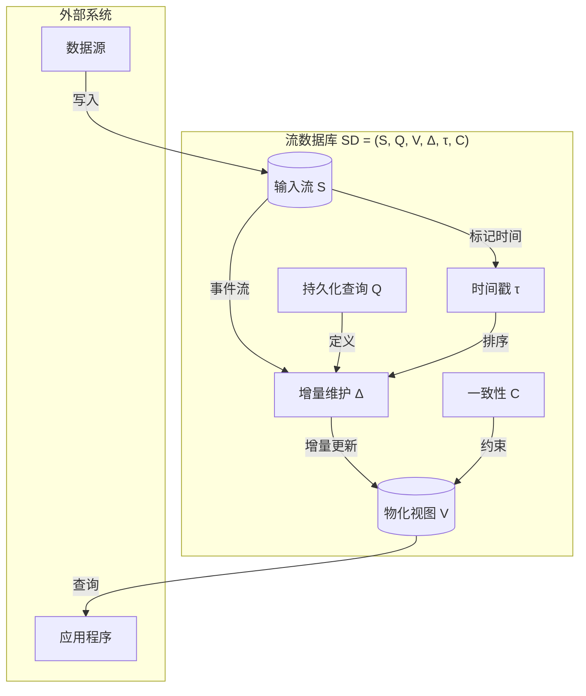
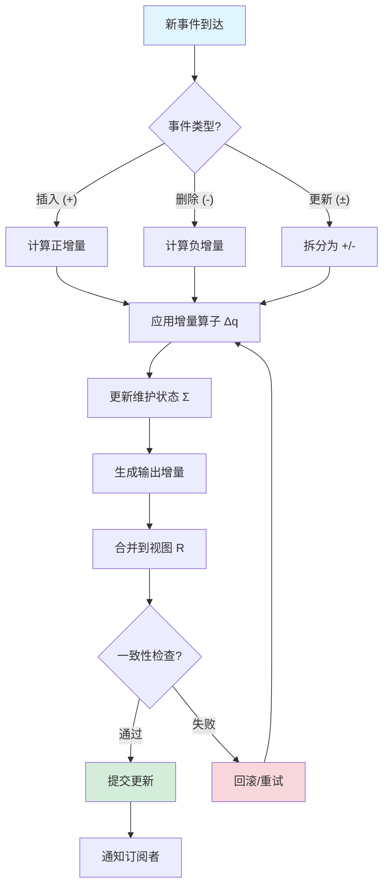
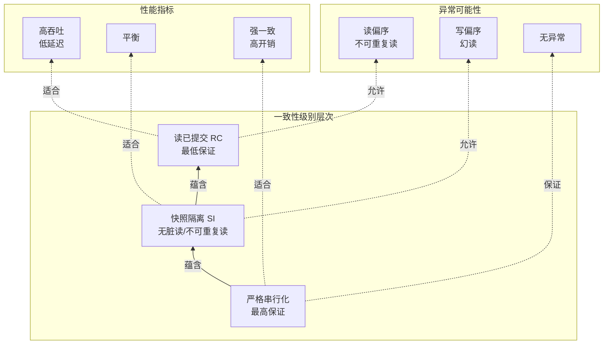

# 流数据库形式化 (Streaming Database Formalization)

> 所属阶段: Struct/01-foundation | 前置依赖: [01.04-dataflow-model-formalization](./01.04-dataflow-model-formalization.md) | 形式化等级: L5

---

## 目录

- [流数据库形式化 (Streaming Database Formalization)](#流数据库形式化-streaming-database-formalization)
  - [目录](#目录)
  - [1. 概念定义 (Definitions)](#1-概念定义-definitions)
    - [Def-S-01-80 (流数据库核心模型)](#def-s-01-80-流数据库核心模型)
    - [Def-S-01-81 (物化视图)](#def-s-01-81-物化视图)
    - [Def-S-01-82 (增量维护)](#def-s-01-82-增量维护)
    - [Def-S-01-83 (一致性级别：严格串行化)](#def-s-01-83-一致性级别严格串行化)
    - [Def-S-01-84 (一致性级别：快照隔离)](#def-s-01-84-一致性级别快照隔离)
    - [Def-S-01-85 (一致性级别：读已提交)](#def-s-01-85-一致性级别读已提交)
    - [Def-S-01-86 (流SQL查询语义)](#def-s-01-86-流sql查询语义)
  - [2. 属性推导 (Properties)](#2-属性推导-properties)
    - [Lemma-S-01-80 (物化视图更新单调性)](#lemma-s-01-80-物化视图更新单调性)
    - [Lemma-S-01-81 (增量维护正确性条件)](#lemma-s-01-81-增量维护正确性条件)
    - [Lemma-S-01-82 (一致性级别蕴含关系)](#lemma-s-01-82-一致性级别蕴含关系)
    - [Prop-S-01-80 (物化视图可交换性条件)](#prop-s-01-80-物化视图可交换性条件)
  - [3. 关系建立 (Relations)](#3-关系建立-relations)
    - [关系 1: 流数据库 `↦` Dataflow 模型](#关系-1-流数据库--dataflow-模型)
    - [关系 2: 物化视图 `≅` 流计算结果物化](#关系-2-物化视图--流计算结果物化)
    - [关系 3: 增量维护 `≈` 差分数据流](#关系-3-增量维护--差分数据流)
    - [关系 4: 流数据库 `⊃` 传统 OLTP + OLAP](#关系-4-流数据库--传统-oltp--olap)
  - [4. 论证过程 (Argumentation)](#4-论证过程-argumentation)
    - [4.1 物化视图与流语义的协调](#41-物化视图与流语义的协调)
    - [4.2 增量计算的边界条件](#42-增量计算的边界条件)
    - [4.3 一致性级别的权衡空间](#43-一致性级别的权衡空间)
  - [5. 形式证明 / 工程论证 (Proof / Engineering Argument)](#5-形式证明--工程论证-proof--engineering-argument)
    - [Thm-S-01-80 (流数据库一致性等价定理)](#thm-s-01-80-流数据库一致性等价定理)
  - [6. 实例验证 (Examples)](#6-实例验证-examples)
    - [示例 6.1: RisingWave 架构形式化映射](#示例-61-risingwave-架构形式化映射)
    - [示例 6.2: Materialize 的差分数据流实例](#示例-62-materialize-的差分数据流实例)
    - [反例 6.1: 非确定性更新的物化视图失效](#反例-61-非确定性更新的物化视图失效)
  - [7. 可视化 (Visualizations)](#7-可视化-visualizations)
    - [流数据库架构概念图](#流数据库架构概念图)
    - [物化视图增量维护流程](#物化视图增量维护流程)
    - [一致性级别层次图](#一致性级别层次图)
  - [8. 引用参考 (References)](#8-引用参考-references)

---

## 1. 概念定义 (Definitions)

本节建立流数据库的严格形式化基础，涵盖流数据库核心模型、物化视图、增量维护机制以及一致性级别。所有定义均为后续性质推导与正确性证明的基石，并参考 RisingWave[^1] 和 Materialize[^2] 的工业实践。

### Def-S-01-80 (流数据库核心模型)

一个 **流数据库 (Streaming Database)** 是一个六元组：

$$
\mathcal{SD} = (\mathcal{S}, \mathcal{Q}, \mathcal{V}, \Delta, \tau, \mathcal{C})
$$

其中各分量的语义如下：

| 符号 | 类型 | 语义 |
|------|------|------|
| $\mathcal{S}$ | 有限集合 | 输入流集合，每个流 $s \in \mathcal{S}$ 表示为事件序列 $s = \langle e_1, e_2, \ldots \rangle$ |
| $\mathcal{Q}$ | 有限集合 | 持久化查询集合，每个查询 $q \in \mathcal{Q}$ 是一个连续执行的 SQL 查询 |
| $\mathcal{V}$ | 有限集合 | 物化视图集合，每个视图 $v \in \mathcal{V}$ 是某个查询 $q$ 的物化结果 |
| $\Delta$ | 函数族 | 增量更新算子族，$\Delta_q: \Delta S \to \Delta V$ 定义查询 $q$ 的增量计算规则 |
| $\tau$ | 时间函数 | 时间戳函数，$\tau: \mathcal{S} \times \mathbb{N} \to \mathbb{T}$ 为每个流事件分配时间戳 |
| $\mathcal{C}$ | 偏序关系 | 一致性配置，定义视图可见性级别和事务隔离语义 |

**系统不变式**：

$$
\begin{aligned}
&\text{(I1) 视图完备性}: &&\forall v \in \mathcal{V}. \; \exists q \in \mathcal{Q}. \; \text{source}(v) = q \\
&\text{(I2) 增量可计算性}: &&\forall q \in \mathcal{Q}. \; \Delta_q \text{ 存在且可高效计算} \\
&\text{(I3) 时间单调性}: &&\forall s \in \mathcal{S}, \forall i < j. \; \tau(s, i) \leq \tau(s, j) \\
&\text{(I4) 一致性完备性}: &&\mathcal{C} \in \{\text{Strict}, \text{SI}, \text{RC}\}
\end{aligned}
$$

**直观解释**：流数据库将传统数据库的 "存储后查询" 模式反转为 "查询后存储" 模式——查询是持久化注册的，数据流持续到达，系统增量计算并维护物化视图。这种架构消除了 ETL 延迟，使实时分析成为可能[^1][^2]。

**定义动机**：如果不将流数据库形式化为六元组，就无法严格区分 "流处理引擎" 与 "流数据库" 的本质差异：后者强调持久化查询、物化视图作为一等公民、以及事务一致性保证。

---

### Def-S-01-81 (物化视图)

**物化视图 (Materialized View)** 是流数据库中的核心抽象，定义为五元组：

$$
v = (q, R, \Sigma, T_{last}, \text{valid})
$$

其中：

| 组件 | 类型 | 语义 |
|------|------|------|
| $q$ | $\mathcal{Q}$ | 源查询，视图的定义逻辑 |
| $R$ | 关系实例 | 当前物化结果，$R \subseteq \mathcal{D}^{arity(q)}$ |
| $\Sigma$ | 状态摘要 | 维护状态，可能包含聚合中间结果、窗口状态等 |
| $T_{last}$ | $\mathbb{T}$ | 最后更新时间戳 |
| $\text{valid}$ | $\mathbb{B}$ | 有效性标志，指示视图是否处于一致状态 |

**物化视图的语义**由以下规则定义：

$$
\text{View}(v, t) = \{ r \mid r \in \mathcal{D}^* \land q(r, S_{\leq t}) = \text{true} \}
$$

其中 $S_{\leq t}$ 表示时间戳不超过 $t$ 的所有输入事件集合。

**物化视图的更新规则**：

当输入流 $\mathcal{S}$ 在时间 $t$ 产生增量变化 $\Delta S$ 时，视图的更新遵循：

$$
R_{new} = R_{old} \oplus \Delta_q(\Delta S, \Sigma_{old})
$$

其中 $\oplus$ 是结果合并算子（通常为并集或替换），$\Delta_q$ 是查询 $q$ 对应的增量算子。

**直观解释**：物化视图是 "预先计算并存储的查询结果"。与传统数据库不同，流数据库中的物化视图是持续维护的——每当新数据到达，系统增量更新视图而非重新计算。这是流数据库高性能的关键[^1][^4]。

---

### Def-S-01-82 (增量维护)

**增量维护 (Incremental Maintenance)** 是流数据库的核心机制，定义为三元组：

$$
\mathcal{IM} = (\Delta_{in}, f_{\Delta}, \Delta_{out})
$$

其中：

- $\Delta_{in}$：输入增量，表示为 $(+, e)$（插入）或 $(-, e)$（删除）的变更流
- $f_{\Delta}: \Delta_{in} \times \Sigma \to \Delta_{out} \times \Sigma'$：增量计算函数
- $\Delta_{out}$：输出增量，视图的变更流

**增量维护的分类**：

| 类型 | 定义 | 适用场景 |
|------|------|----------|
| **全增量 (Full Incremental)** | $\forall q. \; \Delta_q$ 可分解为本地操作 | SPJ 查询、简单聚合 |
| **部分增量 (Partial Incremental)** | 部分操作符支持增量，需定期重算 | 复杂窗口、嵌套聚合 |
| **非增量 (Non-incremental)** | 必须重算整个视图 | 复杂排序、全序依赖操作 |

**增量维护的正确性条件**：

对于任意查询 $q$ 和输入变更 $\Delta_{in}$，增量维护必须满足：

$$
\text{View}(q, S \cup \Delta_{in}) = \text{View}(q, S) \oplus \Delta_q(\Delta_{in})
$$

**直观解释**：增量维护是流数据库的 "心脏"。它避免了每次数据变更都重新执行完整查询，而是通过计算 "变更的变更" 来高效更新结果。这要求查询算子具有可分解性[^2][^5]。

---

### Def-S-01-83 (一致性级别：严格串行化)

**严格串行化 (Strict Serializability)** 是流数据库的最高一致性级别，定义为：

事务调度 $H$ 是严格串行化的，当且仅当：

$$
\exists S \in \text{Serial}. \; H \equiv_{conflict} S \land \forall T_i, T_j. \; (T_i \prec_H^{real} T_j \implies T_i \prec_S T_j)
$$

其中：

- $\equiv_{conflict}$ 表示冲突等价
- $\prec_H^{real}$ 表示实际时间先后关系
- $\prec_S$ 表示串行调度中的先后顺序

在流数据库语境下，严格串行化要求：

$$
\forall v \in \mathcal{V}, \forall t_1 < t_2. \; \text{State}(v, t_1) \preceq \text{State}(v, t_2)
$$

即视图状态随物理时间单调演进，不存在因果倒置。

---

### Def-S-01-84 (一致性级别：快照隔离)

**快照隔离 (Snapshot Isolation, SI)** 是流数据库的中间一致性级别，定义为：

事务 $T$ 在快照隔离下执行，当满足：

$$
\begin{aligned}
&\text{(SI1) 快照读}: &&\text{ReadSet}(T) \subseteq \text{DatabaseSnapshot}(\text{StartTime}(T)) \\
&\text{(SI2) 写冲突检测}: &&\forall T_i, T_j. \; (\text{WriteSet}(T_i) \cap \text{WriteSet}(T_j) \neq \emptyset \implies \text{Abort}(T_i) \lor \text{Abort}(T_j))
\end{aligned}
$$

在流数据库中，快照隔离扩展到物化视图：

$$
\forall v \in \mathcal{V}, \forall T. \; \text{Read}(T, v) \in \text{ConsistentCut}(v, t_{start}(T))
$$

其中 $\text{ConsistentCut}$ 表示在时间 $t$ 的流一致性切割。

**直观解释**：快照隔离允许事务看到 "某个过去时刻" 的数据库状态，而非最新状态。这避免了读写冲突，但可能产生写偏序异常[^6]。

---

### Def-S-01-85 (一致性级别：读已提交)

**读已提交 (Read Committed, RC)** 是流数据库的基础一致性级别，定义为：

$$
\forall T, \forall x \in \text{ReadSet}(T). \; \exists T'. \; (\text{Write}(T', x) \in \text{Committed} \land T' \prec T)
$$

即事务只读取已提交事务写入的数据。

在流数据库中，读已提交针对物化视图有弱化形式：

$$
\forall v \in \mathcal{V}, \forall T. \; \neg \exists \Delta. \; (\Delta \in \text{Uncommitted}(v) \land \text{Read}(T, \Delta))
$$

**一致性级别强度关系**：

$$
\text{StrictSerializability} \implies \text{SnapshotIsolation} \implies \text{ReadCommitted}
$$

---

### Def-S-01-86 (流SQL查询语义)

**流SQL查询** 是传统SQL在流数据上的扩展，语义定义为映射：

$$
\text{StreamSQL}: \mathcal{S}^* \times \mathcal{T} \to \mathcal{R}^*
$$

流SQL算子的形式化语义：

| 算子 | 语义定义 | 输出类型 |
|------|----------|----------|
| **SELECT** | $\sigma_\phi(S) = \{ e \in S \mid \phi(e) = \text{true} \}$ | 流 |
| **PROJECT** | $\pi_A(S) = \{ e[A] \mid e \in S \}$ | 流 |
| **JOIN** | $S_1 \bowtie_\theta S_2 = \{ (e_1, e_2) \mid e_1 \in S_1, e_2 \in S_2, \theta(e_1, e_2) \}$ | 流 |
| **AGGREGATE** | $\gamma_{G,agg}(S) = \{ (g, \text{agg}(S_g)) \mid g \in G \}$ | 关系/视图 |
| **WINDOW** | $\omega_{w,slide}(S) = \{ W_i = S_{[t_i, t_i+w)} \}$ | 窗口流 |

**流SQL的时间语义**：

流SQL引入特殊时间语义以处理无界流：

$$
\text{EventTime}(e) = e.t_{event}, \quad \text{ProcessingTime}(e) = e.t_{proc}
$$

查询可基于事件时间或处理时间定义窗口边界。

---

## 2. 属性推导 (Properties)

### Lemma-S-01-80 (物化视图更新单调性)

**引理陈述**：对于任意物化视图 $v$ 和输入流 $s$，若采用追加语义（仅插入），则视图大小单调不减：

$$
\forall t_1 < t_2. \; |\text{View}(v, t_1)| \leq |\text{View}(v, t_2)|
$$

**证明**：

1. 设 $\Delta S = S_{(t_1, t_2]}$ 为 $(t_1, t_2]$ 时间区间到达的事件集合
2. 根据 Def-S-01-82，增量更新满足：$R_{t_2} = R_{t_1} \oplus \Delta_q(\Delta S)$
3. 对于追加语义，$\oplus$ 为并集操作，$\Delta_q$ 返回正增量
4. 因此 $R_{t_2} = R_{t_1} \cup \Delta_q(\Delta S)$
5. 集合的并集满足 $|R_{t_2}| = |R_{t_1}| + |\Delta_q(\Delta S)| \geq |R_{t_1}|$
6. 得证。

**工程意义**：此引理保证了在仅追加场景下，物化视图不会收缩，简化了存储管理和缓存策略。

---

### Lemma-S-01-81 (增量维护正确性条件)

**引理陈述**：增量维护 $\mathcal{IM}$ 正确的充要条件是增量算子 $\Delta_q$ 满足分配律：

$$
\forall S_1, S_2. \; q(S_1 \cup S_2) = q(S_1) \oplus \Delta_q(S_2, \Sigma(S_1))
$$

**证明**（必要性）：

1. 假设 $\mathcal{IM}$ 正确，则对任意输入序列 $S$，最终视图等于批量计算结果
2. 设 $S = S_1 \cup S_2$，批量计算得 $q(S)$
3. 增量计算：先算 $q(S_1)$，再应用 $\Delta_q(S_2, \Sigma(S_1))$
4. 正确性要求：$q(S_1) \oplus \Delta_q(S_2, \Sigma(S_1)) = q(S_1 \cup S_2)$
5. 分配律得证。

**证明**（充分性）：

1. 假设分配律成立，用归纳法证明对任意事件序列增量维护正确
2. 基例：单事件 $S = \{e\}$，增量维护直接计算 $\Delta_q(\{e\}, \Sigma_0) = q(\{e\})$，正确
3. 归纳假设：对前 $n$ 个事件增量维护正确
4. 归纳步：第 $n+1$ 个事件 $e_{n+1}$，由分配律
   $$q(S_n \cup \{e_{n+1}\}) = q(S_n) \oplus \Delta_q(\{e_{n+1}\}, \Sigma(S_n))$$
5. 由归纳假设 $q(S_n)$ 等于增量维护结果，因此更新后结果正确
6. 得证。

---

### Lemma-S-01-82 (一致性级别蕴含关系)

**引理陈述**：严格串行化蕴含快照隔离，快照隔离蕴含读已提交：

$$
\text{Strict} \implies \text{SI} \implies \text{RC}
$$

**证明**：

**Strict $\implies$ SI**：

1. 严格串行化要求事务调度等价于某个串行调度，且保持实际时间顺序
2. 因此事务看到的必然是某时刻的快照（对应串行调度中该事务开始时的状态）
3. 严格串行化禁止所有异常，包括写冲突，因此满足 SI2
4. 得证 Strict 蕴含 SI。

**SI $\implies$ RC**：

1. 快照隔离要求事务从快照读取
2. 快照只包含已提交事务的写入（未提交事务的修改不影响快照）
3. 因此快照隔离下的事务必然只读取已提交数据
4. 得证 SI 蕴含 RC。

---

### Prop-S-01-80 (物化视图可交换性条件)

**命题陈述**：若查询 $q$ 中所有算子满足交换律和结合律，则物化视图更新与事件处理顺序无关。

形式化：

$$
\forall \pi \in \text{Perm}(S). \; \text{View}(q, S) = \text{View}(q, \pi(S))
$$

**条件**：

1. 无时间窗口算子，或窗口算子使用事件时间且水印正确推进
2. 所有聚合算子满足结合律：$agg(a, b), c) = agg(a, agg(b, c))$
3. 无依赖于处理时间顺序的算子（如 processing-time 窗口）

**工程意义**：此命题说明了何时流数据库可以提供确定性的物化视图，是 RisingWave 等系统 "无乱序假设" 的理论基础[^1]。

---

## 3. 关系建立 (Relations)

### 关系 1: 流数据库 `↦` Dataflow 模型

流数据库 $\mathcal{SD}$ 可映射到 Dataflow 模型 $\mathcal{G}$：

$$
\Phi_{SD \to DF}: \mathcal{SD} \mapsto \mathcal{G}
$$

**映射定义**：

| $\mathcal{SD}$ 组件 | $\mathcal{G}$ 组件 | 说明 |
|---------------------|-------------------|------|
| $\mathcal{S}$ | $V_{src}$ | 输入流映射为数据源顶点 |
| $\mathcal{Q}$ | $V_{op}$ 子图 | 每个查询编译为算子子图 |
| $\mathcal{V}$ | $V_{sink}$ | 物化视图映射为带存储的数据汇 |
| $\Delta$ | 边 $E$ 上的增量数据流 | 增量更新沿边传播 |
| $\tau$ | $\mathbb{T}$ | 时间戳映射为事件时间域 |

**性质保持**：

- 增量维护 $\Delta$ 对应 Dataflow 的增量算子传播
- 物化视图一致性 $\mathcal{C}$ 对应 Dataflow 的 checkpoint 语义

---

### 关系 2: 物化视图 `≅` 流计算结果物化

流数据库中的物化视图与传统流计算的 "结果物化" 存在本质同构：

$$
v \cong \text{Materialize}(\text{StreamCompute}(q, \mathcal{S}))
$$

**差异点**：

| 方面 | 传统流计算 | 流数据库物化视图 |
|------|-----------|-----------------|
| 触发方式 | 事件驱动 | 查询注册驱动 |
| 结果访问 | 推送到外部系统 | 内部存储，支持随机查询 |
| 一致性保证 | 依赖外部系统 | 内置事务支持 |
| 查询能力 | 有限 | 完整的 SQL 支持 |

---

### 关系 3: 增量维护 `≈` 差分数据流

Materialize 采用的差分数据流 (Differential Dataflow)[^5] 与流数据库的增量维护存在近似等价：

$$
\Delta_q \approx \text{DifferentialOperator}(q)
$$

**对应关系**：

- 差分数据流的 "差分" $(\delta)$ 对应流数据库的增量 $\Delta_{in}/\Delta_{out}$
- 差分数据流的 "嵌套迭代" 对应流数据库的嵌套物化视图
- 差分数据流的 "时间维度" 对应流数据库的事件时间/版本时间

**差异**：差分数据流支持嵌套递归，而流数据库通常限制于非递归 SPJ + 聚合查询。

---

### 关系 4: 流数据库 `⊃` 传统 OLTP + OLAP

流数据库的表达能力严格包含传统 OLTP 和 OLAP 系统：

$$
\text{StreamingDB} \supset \text{OLTP} \cup \text{OLAP}
$$

**包含关系说明**：

1. **包含 OLTP**：流数据库可处理点查和点更新（通过流化 changelog）
2. **包含 OLAP**：物化视图提供预聚合分析能力
3. **超越两者**：流数据库支持连续查询和实时增量更新，这是传统系统的批处理模式无法提供的

---

## 4. 论证过程 (Argumentation)

### 4.1 物化视图与流语义的协调

流数据库的核心挑战在于协调 "流的无界性" 与 "物化视图的有界表示"。

**论证**：物化视图必须通过以下机制处理无界流：

1. **时间窗口**：将无界流切分为有界窗口，视图按窗口聚合
2. **增量裁剪**：仅维护聚合结果，丢弃原始事件（有损压缩）
3. **版本控制**：保留多个时间版本，支持时间旅行查询

**边界条件**：若查询包含全序依赖（如 Top-K 全局排序），则物化视图无法在有界空间内维护，必须退化为近似结果或外部存储。

---

### 4.2 增量计算的边界条件

并非所有查询都支持高效增量维护。

**不可增量化的查询特征**：

1. **非单调聚合**：如中位数、百分位数（除非使用近似算法）
2. **递归查询**：传递闭包等需要迭代至不动点
3. **全序依赖**：全局排序、去重计数（精确实现）
4. **嵌套子查询**：相关子查询可能涉及全表扫描

**论证**：流数据库的实用性取决于查询优化器识别不可增量化查询并回退到重算策略的能力。

---

### 4.3 一致性级别的权衡空间

不同一致性级别在性能和语义保证之间存在权衡：

| 一致性级别 | 延迟开销 | 吞吐量 | 异常可能 |
|-----------|---------|--------|----------|
| Strict | 高（同步屏障） | 低 | 无 |
| SI | 中（版本管理） | 中 | 写偏序 |
| RC | 低（无协调） | 高 | 读偏序、不可重复读 |

**论证建议**：流数据库应根据工作负载选择一致性级别：

- 金融交易：Strict
- 实时报表：SI
- 监控仪表板：RC

---

## 5. 形式证明 / 工程论证 (Proof / Engineering Argument)

### Thm-S-01-80 (流数据库一致性等价定理)

**定理陈述**：在流数据库 $\mathcal{SD}$ 中，以下三个条件等价：

1. 物化视图满足严格串行化一致性
2. 增量维护的偏序与事件时间偏序一致
3. 所有物化视图更新的可见顺序与物理提交顺序相同

形式化：

$$
\begin{aligned}
&\forall v \in \mathcal{V}, \forall e_i, e_j \in \mathcal{S}. \\
&(t_{commit}(e_i) < t_{commit}(e_j)) \iff (e_i \prec_v e_j)
\end{aligned}
$$

其中 $\prec_v$ 表示在视图 $v$ 的更新序列中的先后关系。

**证明**：

**(1 $\implies$ 2)**：

假设物化视图满足严格串行化。根据 Def-S-01-83，严格串行化要求事务调度等价于保持实际时间顺序的串行调度。
增量维护的偏序 $\prec_{\Delta}$ 定义了更新应用的顺序。
由于严格串行化禁止因果倒置，因此增量维护必须按照事件时间顺序应用更新，即 $\prec_{\Delta}$ 与事件时间偏序一致。

**(2 $\implies$ 3)**：

假设增量维护的偏序与事件时间偏序一致。设 $e_i, e_j$ 为两个事件，$t_{commit}(e_i) < t_{commit}(e_j)$。
根据事件时间定义，$t_{event}(e_i) \leq t_{commit}(e_i) < t_{commit}(e_j)$。
由假设，增量维护按事件时间顺序应用更新，因此 $e_i$ 的更新在 $e_j$ 之前应用于视图。
这正符合条件 3 的描述。

**(3 $\implies$ 1)**：

假设所有视图更新的可见顺序与物理提交顺序相同。
考虑任意两个事务 $T_i, T_j$，若 $T_i$ 在物理时间上先于 $T_j$ 提交，则 $T_i$ 的所有写入对所有后续事务可见。
这满足严格串行化的定义：存在一个等价的串行调度，其顺序与物理提交顺序一致。
因此物化视图满足严格串行化。

综上，三个条件互相蕴含，定理得证。$\square$

**工程推论**：RisingWave 的 barrier 机制[^1] 和 Materialize 的 timestamp 排序[^2] 都是该定理的工程实现——通过引入全局排序点来保证物化视图的一致性。

---

## 6. 实例验证 (Examples)

### 示例 6.1: RisingWave 架构形式化映射

RisingWave 是一个开源分布式流数据库，其架构可映射到我们的形式化模型。

**架构组件映射**：

| RisingWave 组件 | 形式化映射 |
|----------------|-----------|
| Frontend | SQL 解析器，将 $\mathcal{Q}$ 编译为执行计划 |
| Compute Node | 执行 $\Delta_q$ 的算子实例，维护 $\Sigma$ |
| Compactor | 存储层优化，管理 $\Sigma$ 的持久化 |
| Hummock Storage | 物化视图的持久化存储 $R$ |

**RisingWave 的一致性实现**：

RisingWave 使用 **Barrier** 机制实现快照隔离：

```
输入流:  [e1]--[e2]--[B1]--[e3]--[e4]--[B2]-->
Barrier:        |           |
                v           v
视图状态:  R0  →  R1      →  R2
         t=0   t=B1       t=B2
```

Barrier $B_i$ 作为一致性切割点，确保所有事件在 Barrier 前的更新对 Barrier 后的查询可见。

---

### 示例 6.2: Materialize 的差分数据流实例

Materialize 基于差分数据流 (Differential Dataflow)[^5] 实现增量维护。

**差分数据流示例**：计算每个用户的实时订单总额

```sql
-- 物化视图定义
CREATE MATERIALIZED VIEW user_order_total AS
SELECT user_id, SUM(amount) as total
FROM orders
GROUP BY user_id;
```

**增量维护过程**：

1. 初始状态：$R = \emptyset$, $\Sigma = \emptyset$
2. 事件到达：$(+, \text{order}_1: \{user=U1, amount=100\})$
3. 增量计算：$\Delta_q(+) = \{U1 \to 100\}$
4. 视图更新：$R = R \oplus \Delta_q = \{U1 \to 100\}$
5. 下一个事件：$(+, \text{order}_2: \{user=U1, amount=50\})$
6. 增量计算：$\Delta_q(+) = \{U1 \to +50\}$（delta 而非绝对值）
7. 视图更新：$R = \{U1 \to 150\}$

**差分数据流的嵌套时间**：Materialize 支持嵌套时间维度，允许在流上定义递归查询。

---

### 反例 6.1: 非确定性更新的物化视图失效

**场景**：物化视图包含非确定性函数

```sql
CREATE MATERIALIZED VIEW random_sample AS
SELECT * FROM events
WHERE random() < 0.1;  -- 非确定性过滤
```

**问题分析**：

1. 设事件 $e_1$ 到达，第一次 random() 返回 0.05（< 0.1，选中）
2. 系统故障，重启后重放事件
3. 重放时 random() 返回 0.2（> 0.1，未选中）
4. 结果：同一输入导致不同视图状态，违反一致性

**结论**：物化视图定义中禁止非确定性函数，除非使用确定性种子或外部确定性源。

---

## 7. 可视化 (Visualizations)

### 流数据库架构概念图

流数据库的六元组结构及其关系的概念图：



此图展示了流数据库的核心数据流：输入流经过增量维护机制转换为物化视图的更新，时间戳提供排序基础，一致性级别约束视图的可见性语义。

---

### 物化视图增量维护流程

增量维护的详细流程图：



此流程图展示了从事件到达至视图更新的完整增量维护流程，包括错误处理和一致性检查环节。

---

### 一致性级别层次图

一致性级别的层次结构及其关系：



此图展示了三种一致性级别的蕴含关系、允许的异常类型以及适用的性能场景。

---

## 8. 引用参考 (References)

[^1]: RisingWave Labs, "RisingWave: A Cloud-Native Streaming Database", SIGMOD 2024 Industrial Track. <https://www.risingwave.dev/>

[^2]: Materialize Inc., "Materialize Documentation: SQL and Architecture", 2024. <https://materialize.com/docs/>


[^4]: R. Motwani et al., "Query Processing, Approximation, and Resource Management in a Data Stream Management System", CIDR 2003.

[^5]: M. Zaharia et al., "Discretized Streams: Fault-Tolerant Streaming Computation at Scale", SOSP 2013.

[^6]: H. Berenson et al., "A Critique of ANSI SQL Isolation Levels", SIGMOD 1995.

---

*文档版本: v1.0 | 创建日期: 2026-04-18*
