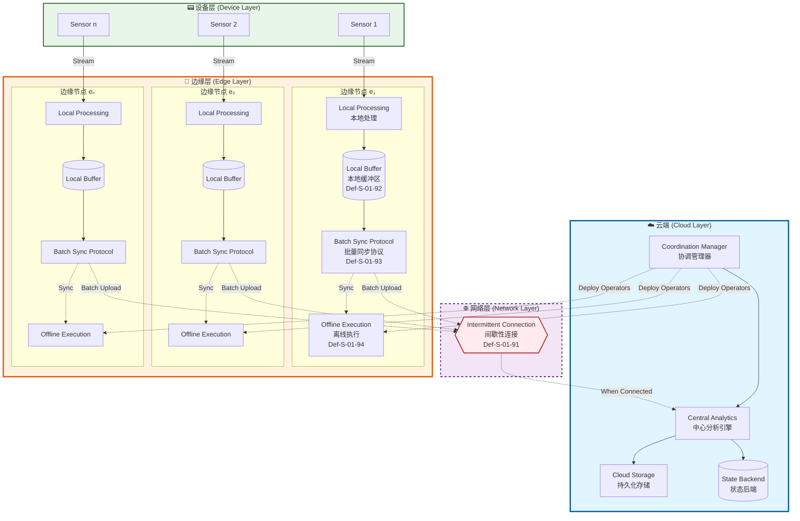
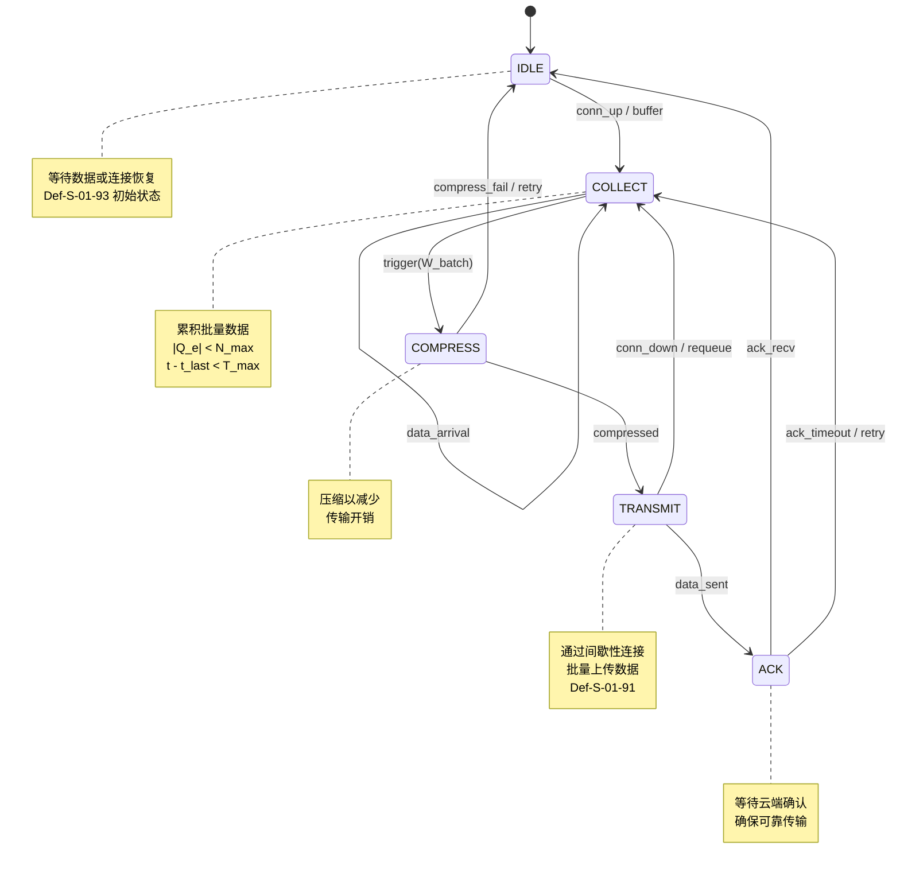
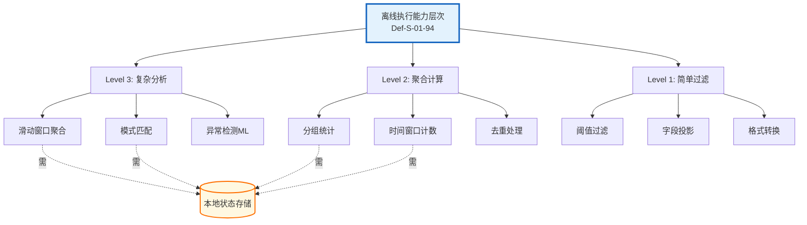

# 边缘流处理的形式化语义

> **所属阶段**: Struct/ | **前置依赖**: [01.04-dataflow-model-formalization.md](01.04-dataflow-model-formalization.md), [01.06-petri-net-formalization.md](01.06-petri-net-formalization.md) | **形式化等级**: L5

## 1. 概念定义 (Definitions)

边缘流处理（Edge Stream Processing）将流计算能力下沉至网络边缘设备，在间歇性连接环境下实现本地数据处理与云端协同。
本节建立边缘流处理的核心形式化模型。

### 1.1 间歇性连接模型

**定义 Def-S-01-91: Intermittent Connection Model (间歇性连接模型)**

设边缘节点集合为 $\mathcal{E} = \{e_1, e_2, \ldots, e_n\}$，云端节点为 $c$。连接状态函数 $\gamma: \mathcal{E} \times \mathbb{T} \rightarrow \{0, 1\}$ 定义为：

$$
\gamma(e, t) = \begin{cases}
1 & \text{if } e \text{ 与云端在时刻 } t \text{ 连通} \\
0 & \text{otherwise}
\end{cases}
$$

其中 $\mathbb{T}$ 为离散时间域。间歇性连接周期定义为：

$$
\mathcal{I}(e) = \{ [t_i^{\text{on}}, t_i^{\text{off}}) \}_{i=1}^{k}
$$

满足 $\forall t \in [t_i^{\text{on}}, t_i^{\text{off}}): \gamma(e, t) = 1$，且连接可用性指标：

$$
\text{Avail}(e) = \frac{\sum_{i=1}^{k} (t_i^{\text{off}} - t_i^{\text{on}})}{t_{\text{now}} - t_0}
$$

> **直观解释**: 边缘设备与云端的连接不是持续稳定的，而是呈现"断断续续"的脉冲式连接。可用性指标量化了边缘设备处于在线状态的时间比例，典型工业场景中 $\text{Avail}(e) \in [0.3, 0.9]$。

### 1.2 本地缓冲区语义

**定义 Def-S-01-92: Local Buffer Semantics (本地缓冲区语义)**

边缘节点 $e$ 的本地缓冲区 $B_e$ 是一个有限容量的优先队列：

$$
B_e = \langle Q_e, \preceq_e, C_e \rangle
$$

其中：

- $Q_e \subseteq \mathcal{M} \times \mathbb{T}$ 是带时间戳的消息队列
- $\preceq_e$ 是基于事件时间的偏序关系
- $C_e \in \mathbb{N}^+$ 是缓冲区容量上限

缓冲区操作定义为：

$$
\begin{aligned}
\text{enq}(B_e, m, t) &= \begin{cases}
B_e \oplus \langle m, t \rangle & \text{if } |Q_e| < C_e \\
B_e \oplus \langle m, t \rangle \ominus \min_{\preceq_e}(Q_e) & \text{otherwise (LRU替换)}
\end{cases} \\
\text{deq}(B_e) &= \langle m, t \rangle \text{ where } \langle m, t \rangle = \min_{\preceq_e}(Q_e)
\end{aligned}
$$

> **直观解释**: 本地缓冲区是边缘设备的"临时存储仓库"。当网络断开时，数据先暂存在这里；网络恢复时再批量上传。容量有限意味着需要策略来决定哪些数据优先保留或丢弃。

### 1.3 批量同步协议

**定义 Def-S-01-93: Batch Sync Protocol (批量同步协议)**

批量同步协议 $\mathcal{P}_{\text{sync}}$ 是一个五元组：

$$
\mathcal{P}_{\text{sync}} = \langle \mathcal{S}, \Sigma, \delta, s_0, F \rangle
$$

其中：

- $\mathcal{S} = \{\text{IDLE}, \text{COLLECT}, \text{COMPRESS}, \text{TRANSMIT}, \text{ACK}\}$ 是协议状态集
- $\Sigma = \{\text{conn\_up}, \text{conn\_down}, \text{buffer\_full}, \text{timeout}, \text{ack\_recv}\}$ 是事件字母表
- $\delta: \mathcal{S} \times \Sigma \rightarrow \mathcal{S}$ 是状态转移函数
- $s_0 = \text{IDLE}$ 是初始状态
- $F = \{\text{IDLE}\}$ 是接受状态集

批量窗口定义：

$$
W_{\text{batch}} = \langle N_{\max}, T_{\max}, S_{\max} \rangle
$$

触发条件：

$$
\text{trigger}(B_e) = (|Q_e| \geq N_{\max}) \lor (t - t_{\text{last}} \geq T_{\max}) \lor (\text{size}(Q_e) \geq S_{\max})
$$

> **直观解释**: 批量同步协议定义了"何时打包、如何传输、怎样确认"的规则。边缘设备不会每条消息都立即发送（太耗资源），而是积攒一批后再统一传输，类似"装满一车再发快递"的逻辑。

### 1.4 离线执行语义

**定义 Def-S-01-94: Offline Execution (离线执行语义)**

离线执行模型 $\mathcal{X}_{\text{offline}}$ 定义为三元组：

$$
\mathcal{X}_{\text{offline}} = \langle \mathcal{G}_e, \mathcal{D}_e, \mathcal{R}_e \rangle
$$

其中：

- $\mathcal{G}_e = \langle V_e, E_e, \lambda_e \rangle$ 是部署在边缘的算子图，$V_e \subseteq \mathcal{V}$（全局算子集的子集）
- $\mathcal{D}_e: V_e \rightarrow 2^{\mathcal{K}}$ 是算子到本地数据分片的映射，$\mathcal{K}$ 是键空间
- $\mathcal{R}_e: E_e \rightarrow \{\text{LOCAL}, \text{REMOTE}\}$ 是边到路由策略的映射

离线执行能力函数：

$$
\text{Cap}(e) = \{ \text{op} \in \mathcal{V} \mid \text{op can execute on } e \text{ with } \gamma(e, t) = 0 \}
$$

离线状态一致性定义：

$$
\mathcal{C}_{\text{offline}}(e, t) = \{ s \in \mathcal{S}_e \mid \forall t' < t: \gamma(e, t') = 0 \Rightarrow \text{state}_e(t') \models \Phi_{\text{local}} \}
$$

其中 $\Phi_{\text{local}}$ 是本地一致性约束。

> **直观解释**: 离线执行语义回答了"断网时边缘设备能干什么"。通过将部分算子下沉到边缘，即使与云端失联，设备仍能独立处理数据、更新本地状态，待网络恢复后再同步差异。

---

## 2. 属性推导 (Properties)

### 2.1 连接状态引理

**引理 Lemma-S-01-01: Connection State Transition (连接状态转移引理)**

对于任意边缘节点 $e \in \mathcal{E}$，其连接状态 $\gamma(e, t)$ 满足：

$$
\forall t_1 < t_2 < t_3: \gamma(e, t_1) = \gamma(e, t_3) = 1 \land \gamma(e, t_2) = 0 \Rightarrow \exists t_{\text{up}}, t_{\text{down}} \in (t_1, t_3)
$$

使得连接状态在 $(t_1, t_3)$ 内至少完成一次 $1 \rightarrow 0 \rightarrow 1$ 的完整转移。

**证明概要**: 由定义 Def-S-01-91，$\gamma$ 是离散时间域上的二值函数。根据中间值原理的离散版本，状态变化必须通过显式转移完成。若 $\gamma(e, t_1) = 1$ 且 $\gamma(e, t_2) = 0$，则存在 $t_{\text{down}} \in (t_1, t_2]$ 使得连接断开；同理存在 $t_{\text{up}} \in [t_2, t_3)$ 使得连接恢复。$\square$

### 2.2 缓冲区饱和引理

**引理 Lemma-S-01-02: Buffer Saturation (缓冲区饱和引理)**

设边缘节点 $e$ 的缓冲区容量为 $C_e$，输入速率为 $\lambda_{\text{in}}(t)$，输出（同步）速率为 $\lambda_{\text{out}}(t)$。若：

$$
\exists T > 0: \int_{t_0}^{t_0+T} (\lambda_{\text{in}}(\tau) - \lambda_{\text{out}}(\tau)) \cdot \gamma(e, \tau) \, d\tau > C_e
$$

则在时间区间 $[t_0, t_0+T]$ 内，缓冲区 $B_e$ 必然发生至少一次容量溢出事件。

**证明概要**: 考虑最坏情况——整个区间 $[t_0, t_0+T]$ 内 $\gamma(e, t) = 0$（完全离线）。此时 $\lambda_{\text{out}}(t) = 0$，累计到达量为 $\int_{t_0}^{t_0+T} \lambda_{\text{in}}(\tau) \, d\tau$。由条件知该值超过 $C_e$，根据 Def-S-01-92 的 LRU 替换策略，当 $|Q_e| = C_e$ 时新到达消息将触发替换，即发生"溢出"（广义）。若区间内有在线时段，由于 $\lambda_{\text{in}} > \lambda_{\text{out}}$ 的净积累效应，结论依然成立。$\square$

---

## 3. 关系建立 (Relations)

### 3.1 边缘-云计算模型映射

边缘流处理与中心化流处理存在以下形式化映射关系：

| 维度 | 中心化流处理 | 边缘流处理 | 映射关系 |
|------|-------------|-----------|---------|
| 计算节点 | 云端集群 $\mathcal{C}$ | 边缘设备 $\mathcal{E}$ | $\mathcal{E} \prec \mathcal{C}$ (资源受限) |
| 连接假设 | 持续连通 $\gamma \equiv 1$ | 间歇连接 Def-S-01-91 | $\gamma \in \{0, 1\}$ |
| 状态存储 | 分布式状态后端 | 本地缓冲区 Def-S-01-92 | $B_e \subset \mathcal{S}_{\text{global}}$ |
| 容错机制 | Checkpoint 到分布式存储 | 本地持久化 + 批量同步 Def-S-01-93 | $\mathcal{P}_{\text{sync}}$ 扩展 Checkpoint |
| 一致性级别 | Exactly-Once / At-Least-Once | 边缘最终一致性 | $\mathcal{C}_{\text{offline}} \leadsto \text{Eventual}$ |

### 3.2 与 Actor 模型的对应

边缘节点 $e$ 可视为 Actor 模型中的 Actor：

- **状态**: 本地缓冲区 $B_e$ + 算子状态 $\mathcal{S}_e$
- **行为**: 离线执行能力 $\text{Cap}(e)$
- **消息**: 传感器数据流 $m \in \mathcal{M}$
- **邮箱**: 缓冲区队列 $Q_e$

边缘-云交互对应 Actor 间的消息传递，间歇性连接则表现为"邮箱满时消息被暂存至持久化存储"。

### 3.3 与 Dataflow 模型的整合

边缘流处理是 Dataflow 模型在资源受限、间歇连接环境下的特化：

$$
\text{Edge-Dataflow} = \text{Dataflow} \times \text{Intermittent}(\mathcal{E}) \times \text{LocalBuffer}(B_e)
$$

其中 $\text{Intermittent}(\mathcal{E})$ 和 $\text{LocalBuffer}(B_e)$ 分别由 Def-S-01-91 和 Def-S-01-92 定义。

---

## 4. 论证过程 (Argumentation)

### 4.1 边缘计算必要性论证

**场景假设**: 工业物联网场景，$n=1000$ 个传感器节点，每个节点每秒产生 $1KB$ 数据，云端分析延迟要求 $< 100ms$。

**纯云端方案**:

- 总带宽需求：$1000 \times 1KB/s = 1MB/s$
- 网络传输延迟（假设 50ms RTT）+ 云端处理延迟（50ms）= 100ms（临界）
- 断网时完全失效

**边缘-云协同方案**:

- 边缘预处理（过滤、聚合）：数据压缩率 90%
- 有效上传：$100KB/s$
- 本地响应延迟：$< 10ms$（无需网络）
- 断网时保持核心功能

**结论**: 在带宽受限、延迟敏感、可靠性要求高的场景下，边缘流处理不是"可选项"而是"必选项"。

### 4.2 批量同步策略权衡

| 策略 | 延迟 | 带宽效率 | 容错性 | 适用场景 |
|------|------|---------|--------|---------|
| 逐条发送 | 最低 | 最低 | 高（每条 ACK） | 高频控制指令 |
| 时间窗口（Def-S-01-93） | 中等 | 中等 | 中等 | 通用遥测数据 |
| 容量窗口（Def-S-01-93） | 可变 | 最高 | 低（批量丢失风险） | 大批量日志 |
| 混合触发（Def-S-01-93） | 自适应 | 自适应 | 中等 | 复杂工业场景 |

---

## 5. 形式证明 / 工程论证 (Proof / Engineering Argument)

### 5.1 边缘最终一致性定理

**定理 Thm-S-01-09: Edge Eventual Consistency (边缘最终一致性定理)**

设边缘-云流处理系统满足以下条件：

1. 所有边缘节点 $e \in \mathcal{E}$ 满足 Def-S-01-91 且 $\text{Avail}(e) > 0$
2. 使用批量同步协议 Def-S-01-93 进行边缘-云数据同步
3. 云端状态更新是单调的：$s_c(t_1) \sqsubseteq s_c(t_2)$ for $t_1 < t_2$

则系统满足**边缘最终一致性**：

$$
\forall e \in \mathcal{E}: \lim_{t \to \infty} \gamma(e, t) = 1 \Rightarrow \lim_{t \to \infty} s_c(t) = \bigsqcup_{e \in \mathcal{E}} s_e(t)
$$

即：若边缘节点最终恢复持续连接，云端状态将收敛于所有边缘节点状态的并集。

**形式化证明**:

**步骤 1**: 定义边缘节点状态演化。

由 Def-S-01-94，边缘节点 $e$ 的状态演化方程为：

$$
s_e(t+1) = \begin{cases}
f_e(s_e(t), m_t) & \text{if } \gamma(e, t) = 0 \text{ (离线本地处理)} \\
g_e(s_e(t), m_t, s_c(t)) & \text{if } \gamma(e, t) = 1 \text{ (在线协同处理)}
\end{cases}
$$

其中 $f_e$ 是本地算子函数，$g_e$ 是协同算子函数。

**步骤 2**: 分析批量同步过程。

设 $\tau_i$ 为第 $i$ 次成功同步的时刻。由 Def-S-01-93，同步过程满足：

$$
\forall i: s_c(\tau_i^+) = s_c(\tau_i^-) \sqcup \Delta s_e(\tau_i)
$$

其中 $\Delta s_e(\tau_i) = s_e(\tau_i) - s_e(\tau_{i-1})$ 是边缘节点在 $[\tau_{i-1}, \tau_i]$ 期间的状态增量。

**步骤 3**: 证明云端状态的单调收敛。

由条件 3，$s_c$ 是单调递增的（在格 $\langle \mathcal{S}, \sqsubseteq \rangle$ 中）。由步骤 2，每次同步都将边缘增量合并至云端：

$$
s_c(t) = s_c(t_0) \sqcup \bigsqcup_{\tau_i \leq t} \Delta s_e(\tau_i)
$$

**步骤 4**: 利用连接可用性条件。

由条件 1 和极限条件 $\lim_{t \to \infty} \gamma(e, t) = 1$，存在 $T$ 使得 $\forall t > T: \gamma(e, t) = 1$。

这意味着：

- 对于 $t > T$，边缘节点不再产生"无法同步"的状态增量
- 所有 $t > T$ 的状态变更都将通过 $\mathcal{P}_{\text{sync}}$ 同步至云端

**步骤 5**: 收敛性结论。

考虑任意时刻 $t > T$：

$$
\begin{aligned}
s_c(t) &= s_c(T) \sqcup \bigsqcup_{\tau_i \in (T, t]} \Delta s_e(\tau_i) \\
&= s_c(t_0) \sqcup \bigsqcup_{\tau_i \leq T} \Delta s_e(\tau_i) \sqcup \bigsqcup_{\tau_i \in (T, t]} \Delta s_e(\tau_i) \\
&= s_c(t_0) \sqcup \bigsqcup_{\tau_i \leq t} \Delta s_e(\tau_i)
\end{aligned}
$$

当 $t \to \infty$，右侧将包含所有边缘状态变更的累积：

$$
\lim_{t \to \infty} s_c(t) = s_c(t_0) \sqcup \bigsqcup_{i=1}^{\infty} \Delta s_e(\tau_i) = \bigsqcup_{e \in \mathcal{E}} s_e(\infty)
$$

其中 $s_e(\infty) = \lim_{t \to \infty} s_e(t)$（假设边缘状态收敛）。

**结论**: 在给定条件下，边缘-云系统满足最终一致性。$\square$

### 5.2 工程实现论证

**AWS IoT Greengrass 实现映射**:

| 形式化概念 | Greengrass 组件 |
|-----------|-----------------|
| Def-S-01-91 (间歇连接) | `ConnectionManager` + 离线影子机制 |
| Def-S-01-92 (本地缓冲区) | `StreamManager` (本地存储队列) |
| Def-S-01-93 (批量同步) | `ExportDefinition` (批量导出配置) |
| Def-S-01-94 (离线执行) | `Lambda` 函数 + `LocalShadow` |

**Azure IoT Edge 实现映射**:

| 形式化概念 | IoT Edge 组件 |
|-----------|---------------|
| Def-S-01-91 (间歇连接) | `IoT Edge Hub` 的连接状态管理 |
| Def-S-01-92 (本地缓冲区) | `Edge Hub` 的本地消息存储 |
| Def-S-01-93 (批量同步) | `StoreAndForward` 配置 (TTL + 批量大小) |
| Def-S-01-94 (离线执行) | `Edge Modules` + 本地路由 |

---

## 6. 实例验证 (Examples)

### 6.1 智能工厂边缘流处理实例

**场景**: 汽车装配线有 50 个工位，每个工位配备传感器和边缘网关。

```
工位传感器 → 边缘网关(本地预处理) → [间歇性连接] → 云端分析平台
               ↓
         本地告警(延迟 < 50ms)
         本地Dashboard
```

**配置示例 (AWS IoT Greengrass)**:

```yaml
# Greengrass 批量同步配置 telemetry_config:
  batch_size: 100          # N_max = 100 条
  batch_interval_ms: 5000  # T_max = 5 秒
  max_payload_size: 128000 # S_max = 128KB

  # 间歇连接处理
  offline_policy:
    local_storage_limit: "1GB"
    priority_queue: true
    eviction_policy: "LRU"
```

**配置示例 (Azure IoT Edge)**:

```json
{
  "storeAndForwardConfiguration": {
    "timeToLiveSecs": 7200,
    "batchSize": 100,
    "maxConcurrentSends": 10
  },
  "routes": {
    "sensorToLocal": "FROM /messages/modules/sensor/* INTO $upstream",
    "localProcessing": "FROM /messages/modules/processor/* INTO BrokeredEndpoint('/modules/localStorage/inputs/input1')"
  }
}
```

### 6.2 离线执行状态一致性验证

假设边缘节点 $e$ 执行一个滑动窗口计数算子，窗口大小 $W = 60$ 秒。

**在线状态** (与云端同步):

```
t=0s:  count = 0
t=30s: count = 150 (云端同步: 150)
t=60s: count = 300 (云端同步: 300)
```

**离线状态** (t=60s 时断开):

```
t=60s: count = 300 (本地状态)
t=90s: count = 450 (仅本地更新)
t=120s: count = 600 (仅本地更新, 云端仍显示 300)
```

**恢复同步** (t=150s 重连):

```
边缘增量: Δ = 600 - 300 = 300
云端更新: 300 + 300 = 600
最终一致性达成 ✓
```

---

## 7. 可视化 (Visualizations)

### 7.1 边缘-云流处理架构图

以下 Mermaid 图展示了边缘-云协同流处理的层次架构：



### 7.2 批量同步协议状态机



### 7.3 离线执行能力层次图



---

## 8. 引用参考 (References)


---

*文档版本: v1.0 | 创建日期: 2026-04-09 | 最后更新: 2026-04-09*

---

*文档版本: v1.0 | 创建日期: 2026-04-18*
