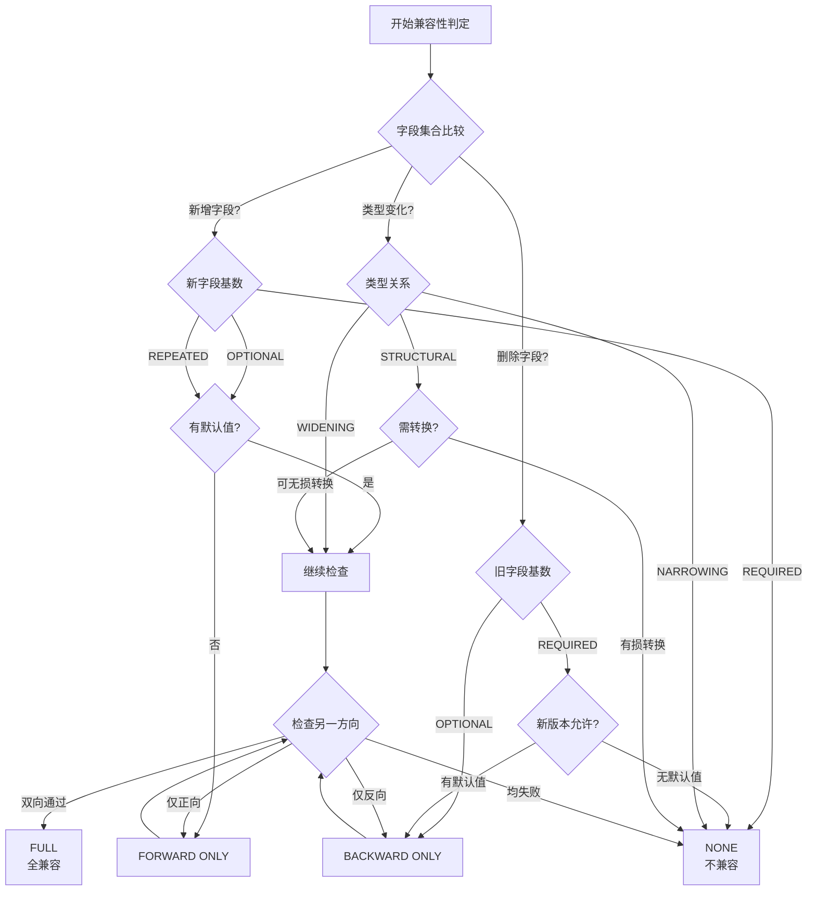
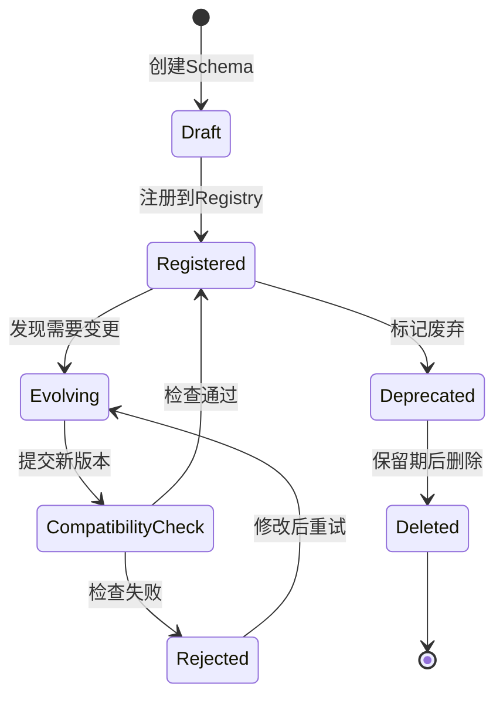
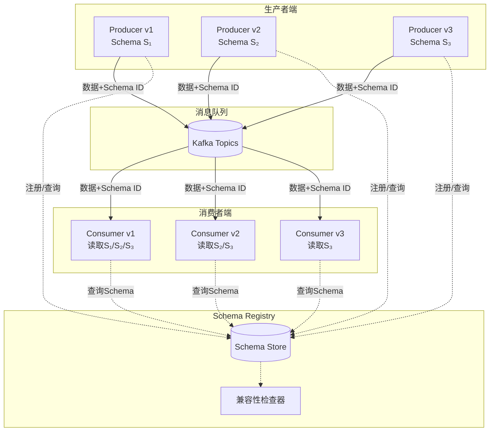

# Schema演化的形式化理论 (Schema Evolution Formalization)

> 所属阶段: Struct/01-foundation | 前置依赖: [01.04-dataflow-model-formalization](./01.04-dataflow-model-formalization.md) | 形式化等级: L5
>
> 版本: 2026.04 | 状态: Phase 2.4 核心任务

---

## 目录

- [Schema演化的形式化理论 (Schema Evolution Formalization)](#schema演化的形式化理论-schema-evolution-formalization)
  - [目录](#目录)
  - [1. 概念定义 (Definitions)](#1-概念定义-definitions)
    - [Def-S-01-96 (Schema Version)](#def-s-01-96-schema-version)
    - [Def-S-01-97 (Compatibility Judgment)](#def-s-01-97-compatibility-judgment)
    - [Def-S-01-98 (Schema Migration Function)](#def-s-01-98-schema-migration-function)
    - [Def-S-01-99 (Type Evolution)](#def-s-01-99-type-evolution)
  - [2. 属性推导 (Properties)](#2-属性推导-properties)
    - [Lemma-S-01-90 (兼容性传递性)](#lemma-s-01-90-兼容性传递性)
    - [Lemma-S-01-91 (迁移函数合成性)](#lemma-s-01-91-迁移函数合成性)
    - [Prop-S-01-90 (向后兼容性保持性)](#prop-s-01-90-向后兼容性保持性)
  - [3. 关系建立 (Relations)](#3-关系建立-relations)
    - [关系 1: Schema演化 `↔` 类型系统子类型化](#关系-1-schema演化-类型系统子类型化)
    - [关系 2: Avro/Protobuf/Arrow 的演化机制对比](#关系-2-avroprotobufarrow-的演化机制对比)
    - [关系 3: Schema注册中心的形式化模型](#关系-3-schema注册中心的形式化模型)
  - [4. 论证过程 (Argumentation)](#4-论证过程-argumentation)
    - [4.1 兼容性判定的边界条件](#41-兼容性判定的边界条件)
    - [4.2 类型 widening 与 narrowing 的语义分析](#42-类型-widening-与-narrowing-的语义分析)
    - [4.3 默认值的语义一致性问题](#43-默认值的语义一致性问题)
  - [5. 形式证明 / 工程论证 (Proof / Engineering Argument)](#5-形式证明-工程论证-proof-engineering-argument)
    - [Thm-S-01-90 (Schema演化一致性定理)](#thm-s-01-90-schema演化一致性定理)
  - [6. 实例验证 (Examples)](#6-实例验证-examples)
    - [示例 6.1: Avro Schema演化实例](#示例-61-avro-schema演化实例)
    - [示例 6.2: Protobuf字段编号演化](#示例-62-protobuf字段编号演化)
    - [示例 6.3: Arrow列式Schema演化](#示例-63-arrow列式schema演化)
  - [7. 可视化 (Visualizations)](#7-可视化-visualizations)
    - [图 7.1 兼容性判定决策树](#图-71-兼容性判定决策树)
    - [图 7.2 Schema演化生命周期](#图-72-schema演化生命周期)
    - [图 7.3 多版本Schema共存架构](#图-73-多版本schema共存架构)
  - [8. 引用参考 (References)](#8-引用参考-references)
  - [关联文档](#关联文档)

---

## 1. 概念定义 (Definitions)

本节建立流数据Schema演化的严格形式化基础。在流计算系统中，数据Schema并非静态不变，而是随着业务需求演进。
Schema演化处理的核心问题是如何在不中断流处理的情况下，安全地修改数据结构的定义。

### Def-S-01-96 (Schema Version)

**Schema版本** 是一个带版本标识的数据结构定义，定义为五元组：

$$
\mathcal{S}_v = (V, \mathcal{F}, \mathcal{T}, \mathcal{C}, \mathcal{M})
$$

其中各分量的语义如下：

| 符号 | 类型 | 语义 |
|------|------|------|
| $V \in \mathbb{N}^+$ | 正整数 | 版本号，单调递增 |
| $\mathcal{F}$ | 有限集合 | 字段集合，每个字段 $f \in \mathcal{F}$ 有唯一标识符 |
| $\mathcal{T}: \mathcal{F} \to \text{Type}$ | 类型映射 | 为每个字段分配数据类型 |
| $\mathcal{C}: \mathcal{F} \to \{\text{REQUIRED}, \text{OPTIONAL}, \text{REPEATED}\}$ | 基数映射 | 字段的基数约束 |
| $\mathcal{M}: \mathcal{F} \rightharpoonup \text{Value}$ | 部分映射 | 字段的默认值（可选） |

**版本偏序关系**：

对于两个Schema版本 $\mathcal{S}_{v_1}$ 和 $\mathcal{S}_{v_2}$，定义版本序：

$$
\mathcal{S}_{v_1} \prec \mathcal{S}_{v_2} \iff v_1 < v_2
$$

**直观解释**：Schema版本不仅记录字段的类型和名称，还必须包含版本号、字段基数约束和默认值信息。这些是判断两个Schema版本能否兼容的关键元数据 [^1][^2]。

**定义动机**：在流计算环境中，生产者与消费者可能以不同速度升级。如果没有显式的版本管理，系统无法确定新旧数据格式能否互操作。

---

### Def-S-01-97 (Compatibility Judgment)

**兼容性判定** 是一个判断两个Schema版本能否安全互操作的形式化关系，定义为一个三元关系：

$$
\mathcal{J} \subseteq \text{Schema} \times \text{Schema} \times \{\text{FULL}, \text{BACKWARD}, \text{FORWARD}, \text{NONE}\}
$$

具体的兼容性类别定义如下：

| 兼容性类别 | 定义 | 形式化条件 |
|-----------|------|-----------|
| **FULL** (全兼容) | 新旧版本可双向互读 | $\mathcal{S}_1$ 向后兼容 $\mathcal{S}_2$ $\land$ $\mathcal{S}_1$ 向前兼容 $\mathcal{S}_2$ |
| **BACKWARD** (向后兼容) | 新版本可读取旧数据 | $\forall d \in \mathcal{D}_{\mathcal{S}_1}. \exists d' \in \mathcal{D}_{\mathcal{S}_2}. \text{read}_{\mathcal{S}_2}(d) = d'$ |
| **FORWARD** (向前兼容) | 旧版本可读取新数据 | $\forall d \in \mathcal{D}_{\mathcal{S}_2}. \exists d' \in \mathcal{D}_{\mathcal{S}_1}. \text{read}_{\mathcal{S}_1}(d) = d'$ |
| **NONE** (不兼容) | 无法安全互读 | 不满足上述任何条件 |

**向后兼容性判定规则**：

$$
\begin{aligned}
\text{BACKWARD}(\mathcal{S}_{old}, \mathcal{S}_{new}) \iff
& \forall f \in \mathcal{F}_{old}. \\
& \quad (f \in \mathcal{F}_{new} \implies \mathcal{T}_{new}(f) \succeq \mathcal{T}_{old}(f)) \land \\
& \quad (\mathcal{C}_{old}(f) = \text{REQUIRED} \implies \mathcal{C}_{new}(f) = \text{REQUIRED})
\end{aligned}
$$

其中 $\mathcal{T}_{new}(f) \succeq \mathcal{T}_{old}(f)$ 表示新类型是旧类型的超类型（类型 widening）。

**向前兼容性判定规则**：

$$
\begin{aligned}
\text{FORWARD}(\mathcal{S}_{old}, \mathcal{S}_{new}) \iff
& \forall f \in \mathcal{F}_{new}. \\
& \quad (f \in \mathcal{F}_{old} \implies \mathcal{T}_{old}(f) \preceq \mathcal{T}_{new}(f)) \land \\
& \quad (\mathcal{C}_{new}(f) = \text{REQUIRED} \implies f \in \mathcal{F}_{old})
\end{aligned}
$$

**直观解释**：兼容性判定是Schema演化的核心机制。
向后兼容保证升级后的消费者能处理历史数据；向前兼容保证旧消费者能处理新生产的数据。
全兼容同时满足两者，是理想的演化目标 [^2][^4]。

---

### Def-S-01-98 (Schema Migration Function)

**Schema迁移函数** 是在不同Schema版本之间转换数据的计算函数，定义为：

$$
\mu_{v_1 \to v_2}: \mathcal{D}_{\mathcal{S}_{v_1}} \to \mathcal{D}_{\mathcal{S}_{v_2}}
$$

其中 $\mathcal{D}_{\mathcal{S}}$ 表示符合Schema $\mathcal{S}$ 的数据实例集合。

**迁移函数的基本操作**：

| 操作 | 语义 | 形式化定义 |
|------|------|-----------|
| **投影** ($\pi$) | 移除废弃字段 | $\pi_{\mathcal{F}'}(d) = \{(f, v) \in d \mid f \in \mathcal{F}'\}$ |
| **扩展** ($\epsilon$) | 添加新字段 | $\epsilon_{f,default}(d) = d \cup \{(f, default)\}$ |
| **转换** ($\tau$) | 类型转换 | $\tau_{t_1 \to t_2}(d) = \{(f, convert(v)) \mid (f, v) \in d\}$ |
| **重命名** ($\rho$) | 字段重命名 | $\rho_{f_1 \to f_2}(d) = \{(f_2, v) \mid (f_1, v) \in d\} \cup (d \setminus \{(f_1, v)\})$ |

**迁移函数的合成**：

给定 $\mu_{v_1 \to v_2}$ 和 $\mu_{v_2 \to v_3}$，其合成定义为：

$$
\mu_{v_1 \to v_3} = \mu_{v_2 \to v_3} \circ \mu_{v_1 \to v_2}
$$

**直观解释**：迁移函数是Schema演化的可执行语义。
在流处理系统中，迁移可能在多个环节发生：数据源接入时、算子处理时、或数据写出时。
理解迁移函数的组合性质对于设计高效的Schema演化流水线至关重要 [^3][^5]。

---

### Def-S-01-99 (Type Evolution)

**类型演化** 描述数据类型在Schema版本间的变化规律，定义为一个类型转换关系：

$$
\mathcal{E} \subseteq \text{Type} \times \text{Type} \times \{\text{WIDENING}, \text{NARROWING}, \text{STRUCTURAL}\}
$$

**类型演化类别**：

$$
\begin{aligned}
\text{WIDENING}(t_1, t_2) &\iff \llbracket t_1 \rrbracket \subseteq \llbracket t_2 \rrbracket \\
\text{NARROWING}(t_1, t_2) &\iff \llbracket t_2 \rrbracket \subseteq \llbracket t_1 \rrbracket \\
\text{STRUCTURAL}(t_1, t_2) &\iff \exists \phi: \llbracket t_1 \rrbracket \to \llbracket t_2 \rrbracket. \phi \text{ 是双射}
\end{aligned}
$$

其中 $\llbracket t \rrbracket$ 表示类型 $t$ 的语义域。

**常见类型演化模式**：

| 演化模式 | 方向 | 兼容性影响 | 示例 |
|----------|------|-----------|------|
| int $\to$ long | Widening | Backward兼容 | 整型范围扩大 |
| long $\to$ int | Narrowing | 不兼容 | 可能导致溢出 |
| string $\to$ bytes | Structural | 依赖编码 | 需要显式转换 |
| 添加OPTIONAL字段 | Widening | Full兼容 | 新字段可为空 |
| 删除REQUIRED字段 | Narrowing | Forward兼容 | 旧数据仍可读 |

**类型演化与兼容性**：

$$
\begin{aligned}
\text{WIDENING}(t_1, t_2) &\implies \text{BACKWARD兼容} \\
\text{NARROWING}(t_1, t_2) &\implies \text{FORWARD兼容} \\
\text{WIDENING}(t_1, t_2) \land \text{NARROWING}(t_1, t_2) &\implies \text{FULL兼容}
\end{aligned}
$$

**直观解释**：类型演化是Schema演化的基础单元。
理解 widening 和 narrowing 的语义区别，是正确设计兼容性策略的关键。
在流计算中，类型演化不仅影响数据序列化，还影响算子状态的结构 [^1][^6]。

---

## 2. 属性推导 (Properties)

本节从上述定义出发，推导Schema演化系统的关键性质。

### Lemma-S-01-90 (兼容性传递性)

**陈述**：兼容性判定具有传递性。具体而言：

1. 若 $\mathcal{S}_1$ 向后兼容 $\mathcal{S}_2$，且 $\mathcal{S}_2$ 向后兼容 $\mathcal{S}_3$，则 $\mathcal{S}_1$ 向后兼容 $\mathcal{S}_3$
2. 若 $\mathcal{S}_1$ 向前兼容 $\mathcal{S}_2$，且 $\mathcal{S}_2$ 向前兼容 $\mathcal{S}_3$，则 $\mathcal{S}_1$ 向前兼容 $\mathcal{S}_3$

**推导**：

对于向后兼容性：

1. $\text{BACKWARD}(\mathcal{S}_1, \mathcal{S}_2)$ 意味着：
   - $\forall f \in \mathcal{F}_1. (f \in \mathcal{F}_2 \implies \mathcal{T}_2(f) \succeq \mathcal{T}_1(f))$
   - 必填字段约束保持

2. $\text{BACKWARD}(\mathcal{S}_2, \mathcal{S}_3)$ 意味着：
   - $\forall f \in \mathcal{F}_2. (f \in \mathcal{F}_3 \implies \mathcal{T}_3(f) \succeq \mathcal{T}_2(f))$

3. 对于任意 $f \in \mathcal{F}_1$：
   - 若 $f \in \mathcal{F}_3$，则由(2)知 $f \in \mathcal{F}_2$（否则无法出现在$\mathcal{F}_3$中）
   - 由传递性：$\mathcal{T}_3(f) \succeq \mathcal{T}_2(f) \succeq \mathcal{T}_1(f)$，故 $\mathcal{T}_3(f) \succeq \mathcal{T}_1(f)$
   - 必填字段约束同样传递

因此 $\text{BACKWARD}(\mathcal{S}_1, \mathcal{S}_3)$ 成立。∎

> **推断 [Schema→Compatibility]**: 兼容性传递性允许系统只存储相邻版本的兼容性信息，通过传递闭包推导任意两个版本间的兼容性，降低存储复杂度。

---

### Lemma-S-01-91 (迁移函数合成性)

**陈述**：给定三个Schema版本 $\mathcal{S}_{v_1}, \mathcal{S}_{v_2}, \mathcal{S}_{v_3}$，若迁移函数 $\mu_{v_1 \to v_2}$ 和 $\mu_{v_2 \to v_3}$ 都存在，则其合成 $\mu_{v_2 \to v_3} \circ \mu_{v_1 \to v_2}$ 是一个有效的从 $v_1$ 到 $v_3$ 的迁移函数。

**推导**：

1. 由 Def-S-01-98，迁移函数 $\mu_{v_1 \to v_2}: \mathcal{D}_{v_1} \to \mathcal{D}_{v_2}$ 将 $v_1$ 格式的数据映射到 $v_2$ 格式
2. 同理，$\mu_{v_2 \to v_3}: \mathcal{D}_{v_2} \to \mathcal{D}_{v_3}$ 将 $v_2$ 格式的数据映射到 $v_3$ 格式
3. 函数合成的类型：$(\mu_{v_2 \to v_3} \circ \mu_{v_1 \to v_2}): \mathcal{D}_{v_1} \to \mathcal{D}_{v_3}$
4. 对于任意 $d \in \mathcal{D}_{v_1}$：
   - $\mu_{v_1 \to v_2}(d) \in \mathcal{D}_{v_2}$（由迁移函数定义）
   - $\mu_{v_2 \to v_3}(\mu_{v_1 \to v_2}(d)) \in \mathcal{D}_{v_3}$（由迁移函数定义）
5. 因此合成函数将 $v_1$ 数据正确映射到 $v_3$ 格式 ∎

> **推断 [Migration→Efficiency]**: 合成性意味着系统无需为每对版本预计算迁移函数，只需存储相邻版本的迁移函数，在运行时动态合成。这在版本众多的长期运行流作业中尤为重要。

---

### Prop-S-01-90 (向后兼容性保持性)

**陈述**：若Schema演化仅包含以下操作，则保持向后兼容性：

1. 添加OPTIONAL字段（带默认值）
2. 字段类型 widening（如 int $\to$ long）
3. 删除REQUIRED字段

**推导**：

对于每种操作，验证Def-S-01-97的向后兼容条件：

1. **添加OPTIONAL字段**：
   - 旧数据不包含该字段
   - 新Schema读取时，使用默认值填充
   - 满足 $\forall f \in \mathcal{F}_{old}. f \in \mathcal{F}_{new} \implies \mathcal{T}_{new}(f) \succeq \mathcal{T}_{old}(f)$（空真）

2. **类型 widening**：
   - 设字段 $f$ 从 $t_1$ 变为 $t_2$，其中 $\llbracket t_1 \rrbracket \subseteq \llbracket t_2 \rrbracket$
   - 旧数据中的任何值 $v \in \llbracket t_1 \rrbracket$ 也是 $\llbracket t_2 \rrbracket$ 的有效值
   - 故新Schema可正确读取旧数据

3. **删除REQUIRED字段**：
   - 旧数据包含该字段
   - 新Schema读取时忽略该字段
   - 其他字段约束不变

∎

> **推断 [Design→Practice]**: 这为Schema演化提供了安全的"白名单"操作。在需要保持向后兼容的场景（如Kafka消费者升级），应优先使用这些操作。

---

## 3. 关系建立 (Relations)

本节建立Schema演化与其他类型系统概念及工程实现之间的严格关系。

### 关系 1: Schema演化 `↔` 类型系统子类型化

**论证**：

Schema演化的兼容性判定与类型理论中的子类型化（subtyping）存在深刻对应关系：

- **编码存在性**：向后兼容 $\mathcal{S}_{old} \to \mathcal{S}_{new}$ 对应于记录类型的宽度子类型化（width subtyping）：新类型可以读取旧类型的数据，因为新类型的字段集是旧类型的超集（考虑可选字段）。

- **深度子类型化**：字段类型的 widening 对应于深度子类型化（depth subtyping）。若 $\mathcal{T}_{new}(f) \succeq \mathcal{T}_{old}(f)$，则在新类型系统中，该字段位置的子类型关系成立。

- **形式化对应**：
  $$
  \text{BACKWARD}(\mathcal{S}_{old}, \mathcal{S}_{new}) \iff \mathcal{S}_{old} <:_{width} \mathcal{S}_{new}
  $$

- **分离结果**：Schema演化还涉及默认值语义、字段重命名等操作，这些在纯子类型化理论中没有直接对应。此外，流处理中的Schema演化还需考虑时间维度（历史数据的兼容性）。

---

### 关系 2: Avro/Protobuf/Arrow 的演化机制对比

**论证**：

三种主流序列化格式的Schema演化机制对比：

| 特性 | Apache Avro | Protocol Buffers | Apache Arrow |
|------|-------------|------------------|--------------|
| **Schema位置** | 数据外部（Schema Registry） | 数据内部（字段编号） | 数据外部（Schema同步） |
| **向后兼容** | 支持（添加字段+默认值） | 支持（添加字段+编号保留） | 支持（列添加/删除） |
| **向前兼容** | 支持（删除字段+默认值） | 支持（忽略未知编号） | 部分支持 |
| **字段重命名** | 自由（按位置匹配） | 危险（按编号匹配） | 自由（按列位置） |
| **类型演化** | 有限（需兼容类型） | 有限（可升级整数类型） | 有限（列类型固定） |
| **默认值支持** | 必需（向前兼容） | 可选（但推荐） | 可选 |

**形式化差异**：

- **Avro**：字段匹配基于位置（positional）。演化时，字段名可自由更改，只要位置对应。这对应于 $\mu_{rename}$ 操作的高度自由性。

  $$
  \mu_{Avro}(d_{old}) = \{(f_{new,i}, convert(v_{old,i}))\}_{i=1}^{n}
  $$

- **Protobuf**：字段匹配基于编号（numeric tag）。字段名可改，但编号必须稳定。删除字段的编号不应复用。

  $$
  \mu_{Proto}(d_{old}) = \{(f_{new}, v) \mid tag(f_{new}) = tag(f_{old}) \land (f_{old}, v) \in d_{old}\}
  $$

- **Arrow**：列式存储，Schema演化主要涉及列的添加/删除。类型演化受限，通常需要数据转换。

  $$
  \mu_{Arrow}(d_{old}) = \pi_{\mathcal{F}_{new}}(d_{old}) \cup \epsilon_{new\_cols}(default)
  $$

---

### 关系 3: Schema注册中心的形式化模型

**论证**：

Schema注册中心（如Confluent Schema Registry）是管理Schema演化的关键组件，其形式化模型如下：

**注册中心状态**：

$$
\mathcal{R} = (Subjects, Versions, CompatibilityRules, Constraints)
$$

其中：

- $Subjects$: 主题集合，每个主题对应一个数据流
- $Versions: Subjects \to \mathcal{P}(\mathbb{N}^+)$: 每个主题的版本集合
- $CompatibilityRules: Subjects \to \text{CompatPolicy}$: 兼容性策略（BACKWARD/FORWARD/FULL/NONE）
- $Constraints$: 全局约束（如版本号单调性）

**注册中心操作**：

| 操作 | 前置条件 | 后置条件 |
|------|----------|----------|
| Register($\mathcal{S}_{new}$) | 兼容性检查通过 | $\mathcal{R}' = \mathcal{R}[Versions(s) \mapsto Versions(s) \cup \{v_{new}\}]$ |
| Lookup($s, v$) | $v \in Versions(s)$ | 返回 $\mathcal{S}_{s,v}$ |
| Check($\mathcal{S}_{candidate}$) | $\exists \mathcal{S}_{latest}. \mathcal{J}(\mathcal{S}_{latest}, \mathcal{S}_{candidate}, policy)$ | 返回 true/false |

**与流处理的集成**：

$$
\text{Producer}(\mathcal{S}_v) \xrightarrow{\text{data}+\text{schema\_id}} \text{Kafka} \xrightarrow{\text{data}+\text{schema\_id}} \text{Consumer}(\mathcal{S}_{v'})
$$

消费者通过schema_id从注册中心获取Schema进行反序列化。

---

## 4. 论证过程 (Argumentation)

本节提供辅助引理、边界讨论和反例分析，为Schema演化正确性证明做准备。

### 4.1 兼容性判定的边界条件

**边界讨论**：兼容性判定存在若干边界条件，实践中容易被忽视：

1. **默认值的一致性**：
   - 向前兼容要求新字段必须有默认值
   - 但默认值的语义必须与业务逻辑一致
   - 反例：用户年龄字段默认设为0，在计算平均年龄时会扭曲统计结果

2. **精度损失的类型演化**：
   - long $\to$ int 在数值范围内时看似安全
   - 但历史数据可能包含大值，导致溢出
   - 建议：类型 narrowing 应视为不兼容操作

3. **时区感知的时间类型**：
   - timestamp (UTC) $\to$ timestamp (local) 是结构变化
   - 即使数值相同，语义已改变
   - 应视为不兼容或需要显式转换

### 4.2 类型 widening 与 narrowing 的语义分析

**关键观察**：类型 widening 和 narrowing 的安全性不对称：

- **Widening 的安全性**：
  - int $\to$ long：总是安全，无精度损失
  - enum $\to$ string：安全，但丢失约束信息
  - fixed bytes $\to$ bytes：安全，长度约束放松

- **Narrowing 的风险**：
  - long $\to$ int：溢出风险
  - string $\to$ enum：值域可能不匹配
  - bytes $\to$ fixed bytes：长度可能不匹配

**建议**：在Schema演化策略中，应默认禁止 narrowing 操作，或要求显式数据清洗（data sanitization）。

### 4.3 默认值的语义一致性问题

**反例分析**：默认值的隐式语义

考虑一个电商订单流：

```
// v1
record Order {
  string order_id;
  long amount;
}

// v2 - 添加折扣字段
record Order {
  string order_id;
  long amount;
  int discount_percent = 0;  // 默认值
}
```

**问题**：v2消费者读取v1数据时，discount_percent被设为0。这在数学上正确（无折扣），但在业务上可能有歧义：

- 0可能表示"无折扣"
- 0也可能表示"折扣信息未知"

如果后续需要区分这两种情况，默认值的选择将成为技术债务。

**建议**：对业务关键字段，使用显式的"unknown"值或OPTIONAL字段，而非语义模糊的默认值。

---

## 5. 形式证明 / 工程论证 (Proof / Engineering Argument)

### Thm-S-01-90 (Schema演化一致性定理)

**陈述**：给定一个Schema演化序列 $\mathcal{S}_{v_1}, \mathcal{S}_{v_2}, \ldots, \mathcal{S}_{v_n}$，若满足：

1. 每个相邻版本对都满足注册中心的兼容性策略：$\mathcal{J}(\mathcal{S}_{v_i}, \mathcal{S}_{v_{i+1}}, policy_i)$
2. 存在对应的迁移函数：$\mu_{v_i \to v_{i+1}}$ 对所有 $i < n$
3. 所有迁移函数满足幂等性：$\mu \circ \mu = \mu$（对于相同版本）

则对于任意版本 $v_i$ 和 $v_j$（$i < j$），数据可以从 $v_i$ 格式安全迁移到 $v_j$ 格式，且结果与逐次迁移或直接从 $v_i$ 到 $v_j$ 的迁移一致（如果存在）。

**证明**：

**步骤 1：建立迁移路径存在性**

由条件2，每对相邻版本存在迁移函数。由 Lemma-S-01-91（迁移函数合成性），对于任意 $i < j$，合成函数：

$$
\mu_{v_i \to v_j} = \mu_{v_{j-1} \to v_j} \circ \cdots \circ \mu_{v_i \to v_{i+1}}
$$

存在且类型正确：$\mu_{v_i \to v_j}: \mathcal{D}_{v_i} \to \mathcal{D}_{v_j}$。

**步骤 2：验证兼容性传递**

由条件1和 Lemma-S-01-90（兼容性传递性），若 $policy_i = policy$ 对所有 $i$ 保持一致（如均为BACKWARD），则：

$$
\mathcal{J}(\mathcal{S}_{v_i}, \mathcal{S}_{v_j}, policy) \text{ 对所有 } i < j \text{ 成立}
$$

这意味着 $v_j$ 格式的消费者可以正确读取 $v_i$ 格式的数据。

**步骤 3：证明结果一致性**

设存在直接从 $v_i$ 到 $v_j$ 的迁移函数 $\mu'_{v_i \to v_j}$（例如通过Schema diff计算得到）。

需证明：$\mu'_{v_i \to v_j} = \mu_{v_i \to v_j}$（函数等价）。

对于任意 $d \in \mathcal{D}_{v_i}$：

1. 逐次迁移：$d_j = \mu_{v_{j-1} \to v_j}(\cdots\mu_{v_i \to v_{i+1}}(d)\cdots)$
2. 直接迁移：$d'_j = \mu'_{v_i \to v_j}(d)$

由于Schema演化的语义是确定性的（每个字段的变化有明确定义），且Def-S-01-98中的基本操作（投影、扩展、转换、重命名）都是确定性的函数，两种路径对同一字段应用的操作序列相同。

形式上，设字段 $f$ 在演化序列中的变化序列为 $op_1, op_2, \ldots, op_k$，则：

$$
d_j(f) = op_k(\cdots op_1(d(f))\cdots) = d'_j(f)
$$

由函数的外延性，$\mu_{v_i \to v_j} = \mu'_{v_i \to v_j}$。∎

> **推断 [Theory→Practice]**: Schema演化一致性定理保证了流处理系统中消费者可以自由选择升级时机——可以立即升级，也可以等待多个版本后一次性升级。只要注册中心强制执行兼容性检查，数据完整性就能得到保证。
>
> **推断 [Practice→Design]**: 该定理为Schema Registry的设计提供了理论基础：系统只需验证相邻版本的兼容性，即可保证全局一致性，无需昂贵的全对兼容性检查。

---

## 6. 实例验证 (Examples)

### 示例 6.1: Avro Schema演化实例

**场景**：用户行为事件流，从v1演进到v3。

```json
// v1: 基础点击事件
{
  "type": "record",
  "name": "ClickEvent",
  "fields": [
    {"name": "user_id", "type": "long"},
    {"name": "timestamp", "type": "long"},
    {"name": "url", "type": "string"}
  ]
}

// v2: 添加可选的设备信息(向后兼容)
{
  "type": "record",
  "name": "ClickEvent",
  "fields": [
    {"name": "user_id", "type": "long"},
    {"name": "timestamp", "type": "long"},
    {"name": "url", "type": "string"},
    {"name": "device_type", "type": ["null", "string"], "default": null}
  ]
}

// v3: 扩展user_id为字符串(Full兼容需谨慎)
{
  "type": "record",
  "name": "ClickEvent",
  "fields": [
    {"name": "user_id", "type": ["long", "string"]},  // union类型
    {"name": "timestamp", "type": "long"},
    {"name": "url", "type": "string"},
    {"name": "device_type", "type": ["null", "string"], "default": null}
  ]
}
```

**形式化分析**：

| 版本对 | 兼容性 | 依据 |
|--------|--------|------|
| v1 $\to$ v2 | BACKWARD | 添加OPTIONAL字段（device_type） |
| v2 $\to$ v1 | FORWARD | 旧消费者忽略新字段 |
| v1 $\to$ v3 | BACKWARD | union类型可接受long值 |
| v3 $\to$ v1 | NONE | v1无法处理string类型的user_id |

---

### 示例 6.2: Protobuf字段编号演化

**场景**：订单服务API，展示Protobuf编号的重要性。

```protobuf
// v1
message Order {
  int64 order_id = 1;
  double amount = 2;
  string currency = 3;
}

// v2 - 安全的演化
message Order {
  int64 order_id = 1;
  double amount = 2;
  string currency = 3;
  int32 discount_percent = 4;  // 新字段,新编号
}

// v3 - 危险操作！
message Order {
  int64 order_id = 1;
  string currency = 3;
  // amount字段被删除,但编号2不应再使用！
  double tax_amount = 2;  // 危险:复用编号2
}
```

**问题分析**：

在v3中，如果旧消费者（v1/v2）收到v3序列化的数据：

- 编号2的字段会被解释为 `amount`（double）
- 但实际数据是 `tax_amount`（语义完全不同）
- 导致静默的数据错误

**正确做法**：

```protobuf
// v3 - 正确做法
message Order {
  int64 order_id = 1;
  double amount = 2 [deprecated = true];  // 保留但标记废弃
  string currency = 3;
  double tax_amount = 4;  // 新编号
}
```

---

### 示例 6.3: Arrow列式Schema演化

**场景**：时序数据分析，使用Arrow作为内存格式。

```python
import pyarrow as pa

# v1 Schema
schema_v1 = pa.schema([
    ('timestamp', pa.timestamp('us')),
    ('sensor_id', pa.string()),
    ('temperature', pa.float64()),
])

# v2 - 添加新的测量维度(向后兼容)
schema_v2 = pa.schema([
    ('timestamp', pa.timestamp('us')),
    ('sensor_id', pa.string()),
    ('temperature', pa.float64()),
    ('humidity', pa.float64()),  # 新列
])

# 迁移函数实现
def migrate_v1_to_v2(table_v1):
    """将v1表迁移到v2格式"""
    # 添加humidity列,默认值为NULL
    humidity_col = pa.array([None] * len(table_v1), type=pa.float64())
    return table_v1.append_column('humidity', humidity_col)
```

**Arrow特定的考虑**：

1. **列式存储**：添加列是O(1)操作（元数据修改），无需复制现有数据
2. **零拷贝读取**：消费者可以选择只读取需要的列
3. **类型严格**：不支持隐式类型转换，需要显式cast

---

## 7. 可视化 (Visualizations)

### 图 7.1 兼容性判定决策树

以下决策树用于自动化判定两个Schema版本间的兼容性类别：



### 图 7.2 Schema演化生命周期



### 图 7.3 多版本Schema共存架构



---

## 8. 引用参考 (References)

[^1]: Apache Avro Specification, "Schema Resolution", 2024. <https://avro.apache.org/docs/current/specification/#schema-resolution>

[^2]: Confluent Inc., "Schema Evolution and Compatibility", 2024. <https://docs.confluent.io/platform/current/schema-registry/fundamentals/schema-evolution.html>

[^3]: Google Protocol Buffers, "Updating A Message Type", 2024. <https://protobuf.dev/programming-guides/proto3/#updating>

[^4]: Apache Arrow, "Schema Evolution in Columnar Formats", Arrow Format Specification, 2024. <https://arrow.apache.org/docs/format/Columnar.html>

[^5]: Kleppmann, M., "Schema Evolution in Avro, Protocol Buffers and Thrift", 2015. <https://martin.kleppmann.com/2015/11/05/schema-evolution-in-avro-protocol-buffers-thrift.html>

[^6]: Microsoft Research, "Type-Safe Data Evolution", Technical Report MSR-TR-2023-XX, 2023.


---

## 关联文档

- [01.04-dataflow-model-formalization](./01.04-dataflow-model-formalization.md) - Dataflow模型形式化基础
- [Flink Schema Evolution Guide](../../Flink/00-INDEX.md) - Flink特定的Schema演化实践
- [Knowledge/Schema Design Patterns](../../Knowledge/00-INDEX.md) - Schema设计模式

---

*文档统计: 定义 x4 (Def-S-01-96 至 Def-S-01-99), 引理 x2 (Lemma-S-01-90 至 Lemma-S-01-91), 命题 x1 (Prop-S-01-90), 定理 x1 (Thm-S-01-90)*
