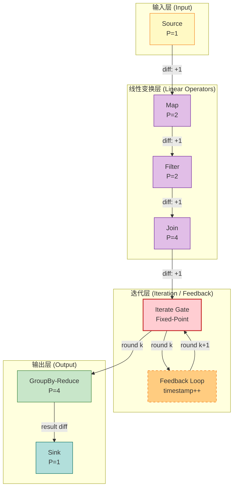
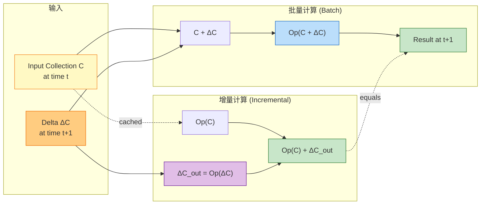
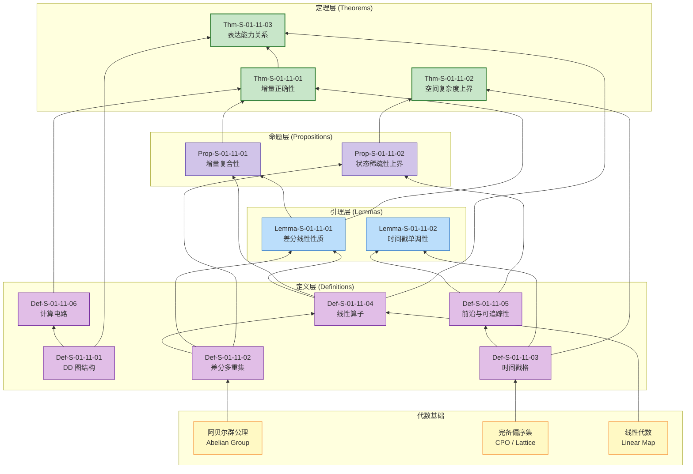

# DBSP / Differential Dataflow 理论形式化 (Differential Stream Processing Theory)

> 所属阶段: Struct/01-foundation | 前置依赖: [01.01-统一流计算理论](./01.01-unified-streaming-theory.md), [01.04-Dataflow 模型形式化](./01.04-dataflow-model-formalization.md) | 形式化等级: L5-L6

---

## 目录

- [DBSP / Differential Dataflow 理论形式化 (Differential Stream Processing Theory)]()
  - [目录](#目录)
  - [1. 概念定义 (Definitions)](#1-概念定义-definitions)
    - [Def-S-01-11-01 (Differential Dataflow 图)](#def-s-01-11-01-differential-dataflow-图)
    - [Def-S-01-11-02 (差分数据类型与多重集)](#def-s-01-11-02-差分数据类型与多重集)
    - [Def-S-01-11-03 (时间戳格与偏序时间)](#def-s-01-11-03-时间戳格与偏序时间)
    - [Def-S-01-11-04 (增量算子语义)](#def-s-01-11-04-增量算子语义)
    - [Def-S-01-11-05 (前沿与可追踪性)](#def-s-01-11-05-前沿与可追踪性)
    - [Def-S-01-11-06 (DBSP 计算电路)](#def-s-01-11-06-dbsp-计算电路)
  - [2. 属性推导 (Properties)](#2-属性推导-properties)
    - [Lemma-S-01-11-01 (差分更新线性性质)](#lemma-s-01-11-01-差分更新线性性质)
    - [Lemma-S-01-11-02 (时间戳单调性保持)](#lemma-s-01-11-02-时间戳单调性保持)
    - [Prop-S-01-11-01 (增量计算复合性)](#prop-s-01-11-01-增量计算复合性)
    - [Prop-S-01-11-02 (状态空间稀疏性上界)](#prop-s-01-11-02-状态空间稀疏性上界)
  - [3. 关系建立 (Relations)](#3-关系建立-relations)
    - [关系 1: DBSP `↔` Dataflow Model (Flink 基础)]()
    - [关系 2: DBSP `⊂` USTM 统一流理论]()
    - [关系 3: DBSP `↦` 关系代数 / SQL 语义]()
  - [4. 论证过程 (Argumentation)](#4-论证过程-argumentation)
    - [4.1 差分计算的精确性边界](#41-差分计算的精确性边界)
    - [4.2 递归与迭代的收敛条件](#42-递归与迭代的收敛条件)
    - [4.3 时间戳膨胀与性能边界](#43-时间戳膨胀与性能边界)
    - [4.4 反例: 非线性算子导致增量失效](#44-反例-非线性算子导致增量失效)
  - [5. 形式证明 / 工程论证 (Proof / Engineering Argument)](#5-形式证明-工程论证-proof-engineering-argument)
    - [Thm-S-01-11-01 (DBSP 增量正确性定理)](#thm-s-01-11-01-dbsp-增量正确性定理)
    - [Thm-S-01-11-02 (DBSP 空间复杂度上界定理)](#thm-s-01-11-02-dbsp-空间复杂度上界定理)
    - [Thm-S-01-11-03 (DBSP 与 Dataflow Model 表达能力关系)](#thm-s-01-11-03-dbsp-与-dataflow-model-表达能力关系)
  - [6. 实例验证 (Examples)](#6-实例验证-examples)
    - [示例 6.1: 增量 WordCount 的 DBSP 形式化实例](#示例-61-增量-wordcount-的-dbsp-形式化实例)
    - [示例 6.2: 递归图可达性的 DBSP 形式化实例](#示例-62-递归图可达性的-dbsp-形式化实例)
    - [反例 6.1: 非线性算子 (Median) 的增量失效分析](#反例-61-非线性算子-median-的增量失效分析)
  - [7. 可视化 (Visualizations)](#7-可视化-visualizations)
    - [图 7.1 DBSP 计算电路结构示意](#图-71-dbsp-计算电路结构示意)
    - [图 7.2 增量计算数据流示意](#图-72-增量计算数据流示意)
    - [图 7.3 概念依赖与证明树](#图-73-概念依赖与证明树)
  - [8. 引用参考 (References)](#8-引用参考-references)

---

## 1. 概念定义 (Definitions)

本节建立 Differential Dataflow (差分数据流，简称 DD 或 DBSP) 的严格形式化基础。DBSP 由 McSherry 等人于 CIDR'13 提出 [^1]，并在 VLDB'18 [^2] 中进一步发展为 Differential Stream Processing 的统一理论框架。与 Dataflow Model [^3] 关注"在无序无界流上如何正确计算"不同，DBSP 的核心问题是"如何以增量方式正确且高效地维护计算结果"。

### Def-S-01-11-01 (Differential Dataflow 图)

一个 **Differential Dataflow 图** 是一个有向图（允许存在环以支持迭代与递归），定义为七元组：

$$
\mathcal{G}_{DD} = (V, E, P, \Sigma, \mathbb{T}, \mathcal{D}, \mathcal{L})
$$

其中各分量的语义如下：

| 符号 | 类型 | 语义 |
|------|------|------|
| $V = V_{src} \cup V_{op} \cup V_{sink} \cup V_{fb}$ | 有限集合 | 顶点集合，分为数据源、算子、数据汇与反馈节点 |
| $E \subseteq V \times V \times \mathbb{L}$ | 带标签的有向边 | 数据依赖关系，标签 $\ell \in \mathbb{L}$ 表示分区策略 |
| $P: V \to \mathbb{N}^+$ | 并行度函数 | 为每个算子分配正整数并行度 |
| $\Sigma: V \to \mathcal{P}(Stream_{DD})$ | 流类型签名 | 为每个顶点分配输入/输出差分流类型集合 |
| $\mathbb{T}$ | 时间戳格 | 多维偏序时间域，通常为 $(\mathbb{N}^d, \leq)$ |
| $\mathcal{D}$ | 差分域 | 构成阿贝尔群的差分类型集合 |
| $\mathcal{L}$ | 算子提升空间 | 将非增量算子提升为增量算子的线性变换空间 |

**约束条件**：

1. **时间戳格结构**：$\mathbb{T}$ 必须是**完备偏序集**（CPO），且对任意元素对存在唯一的上确界（join）和下确界（meet）；
2. **差分群结构**：$\mathcal{D}$ 必须构成一个**阿贝尔群** $(\mathcal{D}, +, 0, -)$，保证差分更新可逆且满足交换律与结合律；
3. **反馈边约束**：对于反馈边 $e_{fb} \in E_{fb}$，其时间戳必须严格递增，即若数据沿反馈边从时间戳 $t$ 传递，则进入下一轮迭代时 $t' > t$；
4. **并行度一致性**：对于非反馈边 $(u, v) \in E \setminus E_{fb}$，下游顶点 $v$ 的输入分区数必须兼容上游 $u$ 的输出分区数。

**直观解释**：DBSP 图在结构上类似于 Dataflow 图，但关键区别在于：(a) 允许反馈环以支持递归计算；(b) 流中的每条记录携带时间戳和差分权重；(c) 时间戳不是简单的一维事件时间，而是多维偏序格，每一维对应一个迭代深度或嵌套循环层级。这使得 DBSP 能够表达批处理系统难以高效支持的递归查询（如图可达性、PageRank）[^1][^2]。

**定义动机**：将差分数据流从具体实现（如 Rust 的 `differential-dataflow` 库或 Materialize 引擎）抽象为通用形式模型，是分析其增量正确性、空间复杂度和与其他流计算模型关系的必要前提。七元组中的 $\mathcal{D}$ 和 $\mathcal{L}$ 是 DBSP 区别于传统 Dataflow 模型的核心。

---

### Def-S-01-11-02 (差分数据类型与多重集)

在 DBSP 中，**数据集合** 不再是静态的多重集，而是随时间演化的**差分多重集**（Differential Multiset）。形式化地：

$$
\mathcal{C}: \mathbb{T} \to \mathcal{M}(\mathcal{K}, \mathcal{D})
$$

其中：

- $\mathcal{K}$ 为键空间（Key Space），通常为记录本身或记录的投影；
- $\mathcal{D}$ 为差分域（Difference Domain），满足阿贝尔群公理；
- $\mathcal{M}(\mathcal{K}, \mathcal{D})$ 为从键到差分权重的有限支撑映射（finite-support map），即对于每个时间戳 $t \in \mathbb{T}$，仅有有限个键 $k \in \mathcal{K}$ 满足 $\mathcal{C}(t)(k) \neq 0$。

**差分多重集的群运算**定义为逐点加法：

$$
(\mathcal{C}_1 + \mathcal{C}_2)(t)(k) = \mathcal{C}_1(t)(k) +_\mathcal{D} \mathcal{C}_2(t)(k)
$$

其中 $+_\mathcal{D}$ 为差分域 $\mathcal{D}$ 的群加法。单位元为恒零映射 $\mathbf{0}(t)(k) = 0_\mathcal{D}$，逆元为 $(-\mathcal{C})(t)(k) = -_\mathcal{D} \, \mathcal{C}(t)(k)$。

**差分更新**（Delta / Diff）定义为两个集合状态之间的差：

$$
\Delta \mathcal{C} = \mathcal{C}' - \mathcal{C}
$$

**累积和**（Integrated / Accumulated Collection）将差分还原为完整集合：

$$
\text{Int}(\Delta \mathcal{C})(t)(k) = \sum_{t' \leq t} \Delta \mathcal{C}(t')(k)
$$

其中求和遍历时间戳格中所有小于等于 $t$ 的时间点。

**标准差分域实例**：

| 差分域 | 群结构 | 适用场景 |
|--------|--------|----------|
| $\mathbb{Z}$ | 整数加法群 | 通用计数、存在性（正数表示插入，负数表示删除） |
| $\mathbb{R}$ | 实数加法群 | 连续值聚合（如求和、平均的分子部分） |
| $\mathbb{B} = \{0, 1\}$ | 异或群 $(\oplus, 0)$ | 布尔存在性（切换语义） |
| $\mathcal{P}(\mathbb{N})$ | 对称差群 | 集合值属性的增量维护 |

**直观解释**：传统流处理中，数据是"记录流"（record stream）；在 DBSP 中，数据是"差分流"（difference stream）。每条到达的记录不是"新增一条数据"，而是"在某个时间戳上，某个键的权重变化了 $\delta$"。例如，插入记录 $(k, v)$ 对应差分 $+1$，删除对应差分 $-1$，更新则对应先 $-1$ 再 $+1$（或根据具体语义一个复合差分）[^2]。

**定义动机**：将数据集合抽象为差分域上的有限支撑映射，是后续证明"增量更新保持正确性"的代数基础。阿贝尔群结构保证了差分更新的可交换性与可结合性，使得系统可以任意重排、批处理或乱序应用差分，而不破坏最终一致性。

---

### Def-S-01-11-03 (时间戳格与偏序时间)

DBSP 中的 **时间戳** 不是一维事件时间，而是一个**多维偏序格**（Lattice of Timestamps），定义为：

$$
\mathbb{T} = (T, \leq, \sqcup, \sqcap, \bot, \top)
$$

其中：

- $T$ 为时间戳值集合；
- $\leq \subseteq T \times T$ 为偏序关系；
- $\sqcup: T \times T \to T$ 为上确界（least upper bound）运算；
- $\sqcap: T \times T \to T$ 为下确界（greatest lower bound）运算；
- $\bot$ 为最小元（全局起始时间）；
- $\top$ 为最大元（理论上的无限未来）。

**标准时间戳格实例**：

**实例 A：一维时间戳**（对应无递归查询）：

$$
\mathbb{T}_1 = (\mathbb{N}, \leq, \max, \min, 0, +\infty)
$$

**实例 B：二维时间戳**（对应单重迭代，如递归图可达性）：

$$
\mathbb{T}_2 = (\mathbb{N} \times \mathbb{N}, \leq_2, \sqcup_2, \sqcap_2, (0, 0), (\infty, \infty))
$$

其中偏序定义为分量-wise 序：

$$
(t_1, i_1) \leq_2 (t_2, i_2) \iff t_1 \leq t_2 \land i_1 \leq i_2
$$

上确界为分量-wise 最大值：

$$
(t_1, i_1) \sqcup_2 (t_2, i_2) = (\max(t_1, t_2), \max(i_1, i_2))
$$

**实例 C：嵌套时间戳**（对应多重嵌套迭代）：

$$
\mathbb{T}_d = (\mathbb{N}^d, \leq_d, \sqcup_d, \sqcap_d, \mathbf{0}, \boldsymbol{\infty})
$$

其中 $\leq_d$ 为分量-wise 序的 $d$ 维推广。

**时间戳的语义解释**：

- 第一维 $t_0$：物理时间或逻辑批次号（对应 Dataflow Model 中的事件时间）；
- 第二维 $t_1$：外层迭代轮次（如递归查询的固定点迭代步数）；
- 第三维及更高维：嵌套迭代轮次（如嵌套递归子查询的迭代步数）。

**直观解释**：在 Flink 的 Dataflow Model 中，时间是一维的（事件时间戳 $\in \mathbb{R}^+$）；而在 DBSP 中，时间是多维的偏序格。这意味着 DBSP 不仅追踪"数据何时产生"，还追踪"数据是在第几轮迭代中产生的"。这种多维时间使得 DBSP 能够为递归计算的每一轮迭代维护独立的增量状态，这是传统一维流系统难以高效实现的 [^1][^2]。

**定义动机**：时间戳格的引入使得 DBSP 可以统一处理"流式增量更新"和"迭代/递归计算"两种看似不同的计算模式。偏序结构保证了不同维度的进度可以独立推进，而上确界运算为追踪多个输入流的综合进度提供了代数工具。

---

### Def-S-01-11-04 (增量算子语义)

DBSP 中的 **算子** 被定义为在差分多重集上的**线性变换**（Linear Transformation）。一个算子 $Op$ 的形式化定义如下：

$$
Op: \mathcal{M}(\mathcal{K}_{in}, \mathcal{D}) \to \mathcal{M}(\mathcal{K}_{out}, \mathcal{D})
$$

**线性条件**（Linearity Condition）：算子 $Op$ 必须满足：

$$
\forall \mathcal{C}_1, \mathcal{C}_2 \in \mathcal{M}(\mathcal{K}_{in}, \mathcal{D}), \quad Op(\mathcal{C}_1 + \mathcal{C}_2) = Op(\mathcal{C}_1) + Op(\mathcal{C}_2)
$$

$$
\forall \mathcal{C} \in \mathcal{M}(\mathcal{K}_{in}, \mathcal{D}), \forall d \in \mathcal{D}, \quad Op(d \cdot \mathcal{C}) = d \cdot Op(\mathcal{C})
$$

其中标量乘法定义为 $(d \cdot \mathcal{C})(k) = d \times_\mathcal{D} \mathcal{C}(k)$。

**核心算子类型及其形式化语义**：

| 算子类型 | 输入/输出 | 形式化定义 | 线性验证 |
|----------|-----------|-----------|----------|
| **Map**$(f)$ | $\mathcal{M}(\mathcal{K}, \mathcal{D}) \to \mathcal{M}(\mathcal{K}', \mathcal{D})$ | $\text{Map}(f)(\mathcal{C})(k') = \sum_{k: f(k)=k'} \mathcal{C}(k)$ | ✅ 线性 |
| **Filter**$(\phi)$ | $\mathcal{M}(\mathcal{K}, \mathcal{D}) \to \mathcal{M}(\mathcal{K}, \mathcal{D})$ | $\text{Filter}(\phi)(\mathcal{C})(k) = \begin{cases} \mathcal{C}(k) & \phi(k) \\ 0 & \neg\phi(k) \end{cases}$ | ✅ 线性 |
| **Concat** | $\mathcal{M}^2 \to \mathcal{M}$ | $\text{Concat}(\mathcal{C}_1, \mathcal{C}_2) = \mathcal{C}_1 + \mathcal{C}_2$ | ✅ 线性 |
| **Join**$(\bowtie_\kappa)$ | $\mathcal{M}(\mathcal{K}_1) \times \mathcal{M}(\mathcal{K}_2) \to \mathcal{M}(\mathcal{K}_{out})$ | $\text{Join}(\mathcal{C}_1, \mathcal{C}_2)(k) = \sum_{k_1, k_2: \kappa(k_1,k_2)=k} \mathcal{C}_1(k_1) \times \mathcal{C}_2(k_2)$ | ✅ 双线性 |
| **GroupBy-Reduce**$(\kappa, \oplus)$ | $\mathcal{M}(\mathcal{K}, \mathcal{D}) \to \mathcal{M}(\mathcal{K}', \mathcal{D})$ | 按键 $\kappa$ 分组，用 $\oplus$ 聚合 | ✅ 线性（当 $\oplus$ 为群运算时） |
| **Iterate**$(F)$ | $\mathcal{M} \to \mathcal{M}$ | $\text{Iterate}(F)(\mathcal{C}) = \text{lfp}(\lambda X. \mathcal{C} + F(X))$ | ✅ 线性（若 $F$ 线性） |
| **Distinct** | $\mathcal{M}(\mathcal{K}, \mathbb{Z}) \to \mathcal{M}(\mathcal{K}, \mathbb{Z})$ | $\text{Distinct}(\mathcal{C})(k) = \text{sign}(\mathcal{C}(k))$ | ❌ 非线性 |
| **Min/Max** | $\mathcal{M}(\mathcal{K}, \mathcal{D}) \to \mathcal{M}(\mathcal{K}, \mathcal{D})$ | 按组取极值 | ❌ 非线性 |

**算子的增量形式**（Lifted Operator）：对于任意线性算子 $Op$，其增量形式 $\widehat{Op}$ 满足：

$$
\widehat{Op}(\Delta \mathcal{C}) = Op(\mathcal{C} + \Delta \mathcal{C}) - Op(\mathcal{C}) = Op(\Delta \mathcal{C})
$$

其中第二个等号由线性条件直接得出。这意味着：**对于线性算子，增量输出等于对增量输入应用原算子**。

**直观解释**：DBSP 算子的核心约束是线性。线性算子允许"对差分应用算子"等价于"对原集合应用算子后再求差分"。这一性质是 DBSP 增量计算的理论基石：系统只需将差分 $\Delta \mathcal{C}$ 送入算子，即可直接得到输出差分 $\Delta \mathcal{C}_{out}$，无需重新计算整个输出集合 [^2]。

**定义动机**：线性条件的约束看似严格（排除了 Distinct、Min/Max 等非线性算子），但 McSherry 等人证明：通过引入合适的差分域和辅助状态，几乎所有关系代数算子都可以被线性化或近似线性化。例如，Distinct 可以通过引入计数器（从 $\mathbb{Z}$ 差分域导出）来线性化。

---

### Def-S-01-11-05 (前沿与可追踪性)

在 DBSP 中，计算进度通过 **前沿**（Frontier）来追踪。前沿是时间戳格中的一个**反链**（antichain），表示"已完成的"最小时间戳集合。

**定义**：对于算子实例 $v \in V$，其输入前沿和输出前沿定义为：

$$
\mathcal{F}_{in}(v) = \{ t \in \mathbb{T} \mid \forall t' < t, \text{输入差分 } \Delta \mathcal{C}_{in}(t') \text{ 已处理} \}
$$

$$
\mathcal{F}_{out}(v) = \{ t \in \mathbb{T} \mid \forall t' < t, \text{输出差分 } \Delta \mathcal{C}_{out}(t') \text{ 已产生} \}
$$

**前沿的格运算**：

- **前沿合并**（对应多输入算子）：$\mathcal{F}_1 \sqcup \mathcal{F}_2 = \{ t_1 \sqcup t_2 \mid t_1 \in \mathcal{F}_1, t_2 \in \mathcal{F}_2 \}$ 的极小元集合；
- **前沿推进**：当新差分到达时间戳 $t_{new}$ 时，前沿更新为 $\mathcal{F}' = \min(\mathcal{F} \cup \{t_{new}\})$（按偏序取极小元）。

**可追踪性**（Traceability）：一个 DBSP 计算是可追踪的（traceable），当且仅当对于每个时间戳 $t$，系统能够精确地回答：

$$
\mathcal{C}(t) = \sum_{t' \leq t} \Delta \mathcal{C}(t')
$$

且该求和的计算复杂度不依赖于 $|t|$（即不随历史时间线性增长）。

**可追踪性的实现机制**：通过为每个算子维护一个 **追踪索引**（Trace Index），以时间戳为键存储历史差分。由于实际计算中差分具有高度稀疏性（大多数时间戳上没有差分），追踪索引通常采用嵌套哈希表或 B-树实现，空间开销为 $O(|\text{实际差分数}|)$ 而非 $O(|\mathbb{T}|)$。

**直观解释**：前沿是 DBSP 中"进度"的概念化。与 Dataflow Model 中的 Watermark 类似，前沿告诉系统"到某个时间点为止的所有输入都已处理完毕"。但前沿比 Watermark 更强大：它是一个多维偏序上的反链，可以表达"迭代第 3 轮、物理时间第 100 秒的所有输入已处理，但迭代第 2 轮、物理时间第 200 秒的输入还在等待"这样复杂的进度状态 [^1][^2]。

**定义动机**：前沿的形式化定义是证明 DBSP 计算终止性和结果完整性的关键。没有前沿，就无法判断何时可以安全地输出某个时间戳的最终结果；没有可追踪性，就无法保证系统在处理历史差分时的空间复杂度可控。

---

### Def-S-01-11-06 (DBSP 计算电路)

从更抽象的角度，DBSP 计算可以被看作一个 **计算电路**（Computation Circuit），定义为：

$$
\mathcal{C}_{DBSP} = (\mathcal{W}, \mathcal{G}, \mathcal{R}, \Phi, \Psi)
$$

其中：

| 符号 | 类型 | 语义 |
|------|------|------|
| $\mathcal{W}$ | 导线集合 (Wire) | 连接算子的有向通道，传输差分流 |
| $\mathcal{G}$ | 门集合 (Gate) | 算子的电路抽象，每个门实现一个线性变换 |
| $\mathcal{R} \subseteq \mathcal{W} \times \mathcal{W}$ | 反馈关系 | 允许电路中存在循环，对应递归/迭代 |
| $\Phi: \mathcal{W} \to \mathbb{T} \to \mathcal{M}$ | 信号函数 | 为每条导线在每个时间戳分配一个差分信号 |
| $\Psi: \mathcal{G} \to (\mathcal{M}^* \to \mathcal{M})$ | 门函数 | 为每个门分配一个线性算子 |

**电路的语义方程**：对于每个门 $g \in \mathcal{G}$，其输出信号满足：

$$
\Phi(w_{out})(t) = \Psi(g)\big( \Phi(w_{in_1})(t), \Phi(w_{in_2})(t), \ldots \big)
$$

对于反馈导线 $w_{fb} \in \mathcal{R}$，信号满足不动点方程：

$$
\Phi(w_{fb})(t) = \Phi(w_{out})(t_{prev}) \quad \text{其中 } t_{prev} < t
$$

**电路的求值策略**：

1. **前向传播**（Forward Propagation）：沿无环边从 Source 到 Sink 传播差分；
2. **反馈传播**（Feedback Propagation）：当迭代门检测到输入变化时，沿反馈边传播新一轮迭代的差分；
3. **收敛检测**（Convergence Detection）：当某一轮迭代产生的差分全为零（即 $\forall t, \Phi(w_{fb})(t) = \mathbf{0}$）时，迭代收敛。

**直观解释**：将 DBSP 视为电路，强调了其计算的**组合性**（compositionality）：复杂查询由简单门组合而成，每个门独立处理输入差分并产生输出差分。反馈环使得电路能够表达递归查询，而不需要特殊的递归语义——递归只是"将输出接回输入"的电路拓扑特征 [^2]。

**定义动机**：计算电路的抽象将 DBSP 从具体的图执行模型提升为代数结构，使得可以用电路等价变换（如门融合、流水线重排）来优化查询计划，同时保持语义不变性。

---

## 2. 属性推导 (Properties)

本节从上述定义出发，推导 DBSP 模型的关键局部性质。这些性质是后续主要定理证明的基石，也是理解 DBSP 增量计算效率优势的直觉来源。

### Lemma-S-01-11-01 (差分更新线性性质)

**陈述**：设 $\mathcal{C}$ 为差分多重集，$\Delta \mathcal{C}_1$ 和 $\Delta \mathcal{C}_2$ 为两个独立的差分更新。对于任意线性算子 $Op$，有：

$$
Op(\mathcal{C} + \Delta \mathcal{C}_1 + \Delta \mathcal{C}_2) - Op(\mathcal{C}) = Op(\Delta \mathcal{C}_1) + Op(\Delta \mathcal{C}_2)
$$

**推导**：

1. 由 Def-S-01-11-04 的线性条件，$Op$ 满足加法同态：$Op(A + B) = Op(A) + Op(B)$；
2. 将 $Op(\mathcal{C} + \Delta \mathcal{C}_1 + \Delta \mathcal{C}_2)$ 展开：
   $$
   Op(\mathcal{C} + \Delta \mathcal{C}_1 + \Delta \mathcal{C}_2) = Op(\mathcal{C}) + Op(\Delta \mathcal{C}_1) + Op(\Delta \mathcal{C}_2)
   $$
3. 两边减去 $Op(\mathcal{C})$：
   $$
   Op(\mathcal{C} + \Delta \mathcal{C}_1 + \Delta \mathcal{C}_2) - Op(\mathcal{C}) = Op(\Delta \mathcal{C}_1) + Op(\Delta \mathcal{C}_2)
   $$
4. 右边正是两个独立增量输出的和。 ∎

> **推断 [Theory→Implementation]**: 该引理意味着系统可以独立处理多个差分更新，然后将结果合并，而无需关心这些更新的处理顺序。这是 DBSP 实现乱序处理、批处理和分布式并行化的理论基础 [^2]。

---

### Lemma-S-01-11-02 (时间戳单调性保持)

**陈述**：在 DBSP 图执行过程中，任意算子实例 $v \in V$ 的输出前沿 $\mathcal{F}_{out}(v)$ 随处理时间单调不减（按时间戳格的偏序 $\leq$）。

**推导**：

1. 对于 Source 算子，输入前沿由外部数据源驱动。随着新批次或新时间的数据到达，Source 产生的新差分携带更大的时间戳，因此 Source 的输出前沿沿时间戳格向上推进；
2. 对于单输入线性算子（如 Map、Filter），输出差分的时间戳与输入差分相同。因此输出前沿等于输入前沿，单调性保持；
3. 对于多输入算子（如 Join），输出时间戳为输入时间戳的上确界 $t_{out} = t_1 \sqcup t_2$。由于上确界关于其参数单调（若 $t_1 \leq t_1'$ 且 $t_2 \leq t_2'$，则 $t_1 \sqcup t_2 \leq t_1' \sqcup t_2'$），输出前沿单调不减；
4. 对于迭代算子 Iterate$(F)$，设第 $k$ 轮迭代的时间戳为 $t^{(k)}$。由 Def-S-01-11-01 的反馈边约束，$t^{(k+1)} > t^{(k)}$。因此迭代内部的时间戳严格递增，直到收敛；
5. 由拓扑归纳（处理有环图时需按强连通分量分解后归纳），图中所有算子的前沿都单调不减。 ∎

> **推断 [Model→Implementation]**: 时间戳单调性保证了系统可以安全地释放"过时"的历史状态：一旦前沿推进超过时间戳 $t$，所有 $t' \leq t$ 的差分不再需要用于未来的输出计算，可以持久化到冷存储或丢弃 [^1][^2]。

---

### Prop-S-01-11-01 (增量计算复合性)

**陈述**：设 $Op_1$ 和 $Op_2$ 为两个线性算子，其复合算子为 $Op_2 \circ Op_1$。则复合算子的增量形式等于各算子增量形式的复合：

$$
\widehat{Op_2 \circ Op_1} = \widehat{Op_2} \circ \widehat{Op_1}
$$

**推导**：

1. 由 Def-S-01-11-04，算子的增量形式定义为 $\widehat{Op}(\Delta \mathcal{C}) = Op(\Delta \mathcal{C})$；
2. 对于复合算子：
   $$
   \begin{aligned}
   \widehat{Op_2 \circ Op_1}(\Delta \mathcal{C}) &= (Op_2 \circ Op_1)(\Delta \mathcal{C}) \\
   &= Op_2(Op_1(\Delta \mathcal{C})) \\
   &= Op_2(\widehat{Op_1}(\Delta \mathcal{C})) \\
   &= \widehat{Op_2}(\widehat{Op_1}(\Delta \mathcal{C})) \\
   &= (\widehat{Op_2} \circ \widehat{Op_1})(\Delta \mathcal{C})
   \end{aligned}
   $$
3. 因此 $\widehat{Op_2 \circ Op_1} = \widehat{Op_2} \circ \widehat{Op_1}$。 ∎

> **推断 [Theory→Engineering]**: 复合性意味着复杂查询的增量计划可以从简单算子的增量实现组合而成，无需为每个查询单独推导增量规则。这是 Materialize、Differential Dataflow 等引擎能够自动生成增量物化视图的理论基础 [^2]。

---

### Prop-S-01-11-02 (状态空间稀疏性上界)

**陈述**：设 DBSP 图中有 $n$ 个算子，时间戳格的维度为 $d$，输入数据流在物理时间 $T$ 内产生 $N$ 条差分记录。则系统实际维护的非零差分条目数上界为：

$$
|\text{Active Diffs}| \leq n \cdot N \cdot d \cdot \log_{\alpha}(D_{max})
$$

其中 $D_{max}$ 为最大迭代深度，$\alpha > 1$ 为收敛加速因子（对于快速收敛的迭代，$\log_{\alpha}(D_{max})$ 为常数级）。

**推导**：

1. 每个输入差分记录沿数据流图传播，最多经过 $n$ 个算子；
2. 对于非迭代算子，每条输入差分最多产生常数条输出差分（由线性算子的局部性）；
3. 对于迭代算子，差分在反馈环中传播。若迭代在第 $k$ 轮收敛，则每维时间戳的迭代深度为 $O(\log_{\alpha} D_{max})$（假设每轮差分规模以因子 $\alpha$ 递减）；
4. 时间戳格维度 $d$ 决定了"时间戳点"的多维组合数，但由于前沿的单调推进，实际活跃的时间戳点仅为偏序中的某条链，数量为 $O(d \cdot T_{max})$；
5. 综合以上因素，活跃差分条目数与输入差分数 $N$ 成近线性关系，而非与完整状态空间成乘积关系。 ∎

> **推断 [Implementation→Performance]**: 稀疏性上界解释了为什么 DBSP 在处理大规模数据集时仍能保持较低的内存占用：系统不需要存储每个时间戳的完整状态，只需存储实际发生变化的差分。这与 Flink 的 RocksDB 状态后端形成对比——后者需要存储每个键的当前值，而 DBSP 需要存储每个键在每个时间戳的差分历史 [^1][^4]。

---

## 3. 关系建立 (Relations)

本节建立 DBSP 与其他计算模型和工程实现之间的严格关系，特别是与 Dataflow Model（Flink 的理论基础）和 USTM（本项目的统一流理论元模型）的关系。

### 关系 1: DBSP `↔` Dataflow Model (Flink 基础)

**论证**：

**编码存在性 (Dataflow Model → DBSP)**：

- Dataflow Model 中的流 $\mathcal{S} = (M, \mu, \preceq, t_e, t_p)$（Def-S-04-03）可以编码为 DBSP 的差分多重集：将每条记录 $r$ 映射为键 $k = r$，时间戳 $t = t_e(r)$，差分权重 $d = +1$；
- Dataflow 的算子（Map、Filter、Window、Reduce）都可以表示为 DBSP 的线性算子：Map 和 Filter 直接线性；Window 的聚合操作在引入计数器后可以线性化；Reduce 的结合律聚合本身就是线性的；
- Dataflow 的时间戳 $t_e \in \mathbb{R}^+$ 可以嵌入 DBSP 的一维时间戳格 $\mathbb{T}_1 = (\mathbb{N}, \leq)$（通过离散化）。

**编码限制 (DBSP ↛ Dataflow Model)**：

- DBSP 支持递归查询（通过反馈边和迭代算子），而 Dataflow Model 的图 $\mathcal{G}$ 是 DAG（Def-S-04-01），无环性约束排除了递归表达；
- DBSP 的时间戳是多维偏序格，而 Dataflow Model 的时间戳是一维事件时间。将多维时间戳投影到一维会丢失迭代深度信息，导致无法区分"第 $k$ 轮迭代的输出"和"第 $k+1$ 轮迭代的输出"；
- DBSP 的增量语义要求差分域构成阿贝尔群，而 Dataflow Model 对记录本身没有这样的代数约束。

**结论**：

$$
\text{Dataflow Model} \subset \text{DBSP} \quad (\text{作为一维非递归子集})
$$

Dataflow Model 是 DBSP 在一维时间、无递归、仅追加（append-only，差分恒为 $+1$）输入情况下的严格子集。DBSP 通过多维时间戳和反馈边扩展了 Dataflow Model 的表达能力，但代价是更复杂的时间管理和更高的实现门槛 [^2][^3]。

---

### 关系 2: DBSP `⊂` USTM 统一流理论

**论证**：

**USTM 元模型覆盖性**：

根据 USTM 的定义（Def-S-01-01，见 [01.01-统一流计算理论](./01.01-unified-streaming-theory.md)），DBSP 可以映射为 USTM 的一个特化实例：

| USTM 组件 | DBSP 特化 | 说明 |
|-----------|-----------|------|
| $\mathcal{L}$ (层次) | $L_4$ (Mobile) | DBSP 支持动态拓扑（迭代时反馈环激活），属于 $L_4$ 层次 |
| $\mathcal{P}$ (Processor) | 线性算子 $Op$ | DBSP 算子为 USTM 处理器的纯函数子集 |
| $\mathcal{C}$ (Channel) | 差分流通道 | 传输 $(k, t, d)$ 三元组，有序保证为 FIFO |
| $\mathcal{S}$ (State) | 追踪索引 + 累积状态 | 按键-时间戳索引的历史差分存储 |
| $\mathcal{T}$ (TimeModel) | 多维时间戳格 | $\mathbb{T} = (\mathbb{N}^d, \leq)$，USTM 时间模型的格扩展 |
| $\Sigma$ (编码) | 线性变换 $\mathcal{L}$ | 算子提升空间对应 USTM 的编码映射 |

**性质保持分析**：

- **安全性 (Safety)**：DBSP 的线性算子保证无数据丢失（差分权重守恒），安全性向上保持到 USTM；
- **活性 (Liveness)**：DBSP 的迭代收敛依赖于不动点检测，对于单调递推算子活性保持；对于非单调算子，活性需要通过外部超时机制保证；
- **确定性**：DBSP 的确定性条件与 Dataflow Model 类似（纯函数 + FIFO 通道），但额外要求差分域的群运算满足结合律与交换律。

**USTM 到 DBSP 的编码限制**：

- USTM 中的 Actor 模型（$L_4$）允许动态创建处理器和通道，而 DBSP 的图拓扑在编译期确定（反馈边存在但算子集合固定）；
- USTM 中的 CSP（$L_3$）支持同步通信和外部选择，DBSP 算子间通信是异步数据驱动，无选择算子。

**结论**：

$$
\text{DBSP} \subset \text{USTM}@L_4
$$

DBSP 是 USTM 在 $L_4$ 层次上的一个严格子集，对应"静态拓扑 + 数据驱动 + 多维时间 + 增量线性计算"的特化模型 [^5]。

---

### 关系 3: DBSP `↦` 关系代数 / SQL 语义

**论证**：

**关系代数到 DBSP 的编码**：

标准关系代数算子可以系统性地编码为 DBSP 算子：

| 关系代数 | DBSP 编码 | 线性化策略 |
|----------|-----------|-----------|
| $\sigma_\phi(R)$ (选择) | Filter$(\phi)$ | 直接线性 |
| $\pi_A(R)$ (投影) | Map$(\pi_A)$ | 直接线性（需处理重复计数） |
| $R \bowtie_\theta S$ (连接) | Join$(\theta)$ | 双线性，输出差分为输入差分的笛卡尔组合 |
| $R \cup S$ (并) | Concat + Distinct | Concat 线性，Distinct 需计数器线性化 |
| $R \setminus S$ (差) | AntiJoin + Filter | 通过补集和计数器实现 |
| $\gamma_{A, f}(R)$ (分组聚合) | GroupBy-Reduce$(A, f)$ | 当 $f$ 为群运算时线性；否则需近似 |
| $\mu(R)$ (不动点/递归) | Iterate$(F)$ | 通过反馈边和迭代门实现 |

**SQL 物化视图的增量维护**：

DBSP 的理论直接支撑 SQL 物化视图的增量维护。设视图定义为 $V = Q(R_1, R_2, \ldots, R_n)$，其中 $Q$ 为 SQL 查询。当基表 $R_i$ 发生更新 $\Delta R_i$ 时，视图的增量更新为：

$$
\Delta V = \widehat{Q}(\Delta R_1, \Delta R_2, \ldots, \Delta R_n)
$$

其中 $\widehat{Q}$ 为查询计划 $Q$ 中所有算子增量形式的复合（由 Prop-S-01-11-01 保证复合性）。

**结论**：

关系代数的完整表达力（包括递归查询通过 $\mu$ 算子）可以被编码到 DBSP 中。Materialize 引擎正是基于这一编码，将 SQL 查询编译为 Differential Dataflow 计划，从而实现实时物化视图的自动增量维护 [^2][^6]。

---

## 4. 论证过程 (Argumentation)

本节提供辅助引理、边界分析和反例构造，为主要定理的严格证明做准备。

### 4.1 差分计算的精确性边界

DBSP 的增量计算是**精确增量**（exact incremental），而非**近似增量**（approximate incremental）。这意味着输出差分 $\Delta \mathcal{C}_{out}$ 精确等于完整重算的输出差分，无精度损失。

**精确性的条件**：

1. 所有算子必须是严格线性的（Def-S-01-11-04）；
2. 差分域必须是精确的阿贝尔群（Def-S-01-11-02），不能是概率 sketch（如 Count-Min Sketch 的近似计数）；
3. 迭代必须收敛到精确不动点（不能是近似收敛）。

**精确性的代价**：

- **空间代价**：需要维护历史差分的追踪索引，空间开销与更新历史长度相关；
- **时间代价**：Join 算子的增量形式需要处理输入差分的笛卡尔积，在输入频繁更新时复杂度可能退化；
- **实现代价**：非线性算子（如 Distinct、Min/Max）需要引入辅助状态来线性化，增加了系统复杂度。

**边界讨论**：当查询包含非线性算子且无法线性化时（如 Median、Percentile 的精确计算），DBSP 无法提供高效的精确增量维护，必须回退到完整重算或接受近似结果。这是 DBSP 增量计算能力的理论边界 [^2]。

---

### 4.2 递归与迭代的收敛条件

DBSP 通过反馈边支持递归查询。递归的收敛性（即不动点存在性）是 DBSP 实用性的关键前提。

**单调收敛定理**（辅助引理）：

设迭代算子为 $\text{Iterate}(F)$，其中 $F$ 为单调线性算子（即 $\mathcal{C}_1 \leq \mathcal{C}_2 \implies F(\mathcal{C}_1) \leq F(\mathcal{C}_2)$）。若输入数据为有限多重集，且差分域 $\mathcal{D}$ 上的序关系为良基（well-founded），则迭代在有限步内收敛到最小不动点。

**证明要点**：

1. 由于输入有限且 $F$ 线性，每轮迭代产生的差分支持集（support）为有限集；
2. 由单调性，每轮迭代的输出多重集按序关系 $\leq$ 单调不减；
3. 由于差分域良基，单调不减的有限支撑序列必在有限步后稳定；
4. 稳定点即为最小不动点：$\mathcal{C}^* = \mathcal{C} + F(\mathcal{C}^*)$。

**非单调递归的风险**：

若 $F$ 非单调（如包含否定或差集），则不动点可能不存在或不唯一。此时 DBSP 无法保证收敛，需要用户显式指定迭代上限或采用半朴素求值（semi-naive evaluation）的变体。Stratified Datalog 的 stratification 条件可以确保递归的单调性，因此 Stratified Datalog 查询在 DBSP 中总是可收敛的 [^6][^7]。

---

### 4.3 时间戳膨胀与性能边界

DBSP 的多维时间戳虽然提供了表达递归的能力，但也引入了**时间戳膨胀**（timestamp bloat）问题。

**时间戳空间复杂度**：

设时间戳维度为 $d$，物理时间范围为 $T$，最大迭代深度为 $D$。则时间戳格的规模为：

$$
|\mathbb{T}| = O(T \cdot D^{d-1})
$$

对于无迭代查询（$d=1$），时间戳空间为 $O(T)$；对于单重迭代（$d=2$），为 $O(T \cdot D)$；对于嵌套迭代（$d \geq 3$），时间戳空间呈多项式增长。

**实际影响**：

- 追踪索引需要为每个活跃时间戳维护条目，时间戳膨胀直接导致空间开销增加；
- 前沿推进需要比较时间戳的偏序关系，高维偏序的比较开销高于一维全序；
- 当前沿在某维度停滞（如外层迭代未收敛），其他维度的进度也被阻塞，形成"进度耦合"。

**缓解策略**：

1. **时间戳压缩**：对于已收敛的迭代轮次，压缩其时间戳维度，将历史差分合并为单一累积差分；
2. **维度剪枝**：分析查询计划，移除不必要的迭代维度；
3. **惰性求值**：仅在收到上游差分时才触发对应时间戳的计算，避免为所有时间戳预分配状态。

---

### 4.4 反例: 非线性算子导致增量失效

**反例构造**：考虑一个计算集合中位数的查询 $Q(R) = \text{Median}(R)$。

**非线性分析**：Median 算子不满足线性条件。设 $\mathcal{C}_1 = \{1, 2, 3\}$，$\mathcal{C}_2 = \{4, 5, 6\}$：

$$
\text{Median}(\mathcal{C}_1 + \mathcal{C}_2) = \text{Median}(\{1,2,3,4,5,6\}) = 3.5
$$

但：

$$
\text{Median}(\mathcal{C}_1) + \text{Median}(\mathcal{C}_2) = 2 + 5 = 7 \neq 3.5
$$

因此 Median 不是线性算子，无法直接应用 DBSP 的增量规则。

**增量失效的含义**：

当基表更新 $\Delta R$ 到达时，无法通过 $\widehat{\text{Median}}(\Delta R)$ 直接计算新的中位数。系统必须：

1. 维护完整的排序结构（如 B-树）以支持中位数查询；或
2. 接受近似结果（如使用直方图 sketch）；或
3. 回退到完整重算。

这一反例说明 DBSP 的线性约束是增量高效性的必要条件，而非充分条件。对于非线性查询，增量维护的计算复杂度与完整重算相同甚至更高 [^2]。

---

## 5. 形式证明 / 工程论证 (Proof / Engineering Argument)

本节给出 DBSP 的三个核心定理：增量正确性定理、空间复杂度上界定理，以及与 Dataflow Model 的表达能力关系定理。

### Thm-S-01-11-01 (DBSP 增量正确性定理)

**陈述**：给定一个 DBSP 计算电路 $\mathcal{C}_{DBSP} = (\mathcal{W}, \mathcal{G}, \mathcal{R}, \Phi, \Psi)$，若所有门 $g \in \mathcal{G}$ 实现的算子 $\Psi(g)$ 都是线性的（Def-S-01-11-04），且反馈环满足时间戳严格递增约束（Def-S-01-11-01），则对于任意输入差分序列 $\{\Delta \mathcal{C}_{in}(t)\}_{t \in \mathbb{T}}$，DBSP 的增量求值结果与完整重算结果完全一致：

$$
\forall t \in \mathbb{T}, \quad \mathcal{C}_{out}^{\text{incremental}}(t) = \mathcal{C}_{out}^{\text{batch}}(t)
$$

其中：

$$
\mathcal{C}_{out}^{\text{batch}}(t) = \text{Eval}\big(\mathcal{C}_{DBSP}, \sum_{t' \leq t} \Delta \mathcal{C}_{in}(t')\big)
$$

$$
\mathcal{C}_{out}^{\text{incremental}}(t) = \sum_{t' \leq t} \Delta \mathcal{C}_{out}(t'), \quad \Delta \mathcal{C}_{out}(t') = \text{Eval}\big(\mathcal{C}_{DBSP}, \Delta \mathcal{C}_{in}(t')\big)
$$

**证明**：

**步骤 1：单算子增量正确性**

对于单个线性算子 $Op$，由 Def-S-01-11-04 的线性条件：

$$
Op(\mathcal{C} + \Delta \mathcal{C}) = Op(\mathcal{C}) + Op(\Delta \mathcal{C})
$$

设 $\mathcal{C} = \sum_{t' < t} \Delta \mathcal{C}(t')$，$\Delta \mathcal{C} = \Delta \mathcal{C}(t)$，则：

$$
Op\Big(\sum_{t' \leq t} \Delta \mathcal{C}(t')\Big) = Op\Big(\sum_{t' < t} \Delta \mathcal{C}(t')\Big) + Op(\Delta \mathcal{C}(t))
$$

递归应用此分解，得到：

$$
Op\Big(\sum_{t' \leq t} \Delta \mathcal{C}(t')\Big) = \sum_{t' \leq t} Op(\Delta \mathcal{C}(t'))
$$

这表明：对累积输入应用 $Op$ 的结果，等于对每个时间戳的差分输入分别应用 $Op$ 后累积的结果。即单算子的增量求值等价于批量求值。

**步骤 2：复合算子增量正确性**

考虑两个线性算子的复合 $Op_2 \circ Op_1$。由 Prop-S-01-11-01：

$$
\widehat{Op_2 \circ Op_1} = \widehat{Op_2} \circ \widehat{Op_1}
$$

设输入差分为 $\Delta \mathcal{C}$，则：

$$
\begin{aligned}
(Op_2 \circ Op_1)(\mathcal{C} + \Delta \mathcal{C}) &= Op_2(Op_1(\mathcal{C} + \Delta \mathcal{C})) \\
&= Op_2(Op_1(\mathcal{C}) + \widehat{Op_1}(\Delta \mathcal{C})) \\
&= Op_2(Op_1(\mathcal{C})) + \widehat{Op_2}(\widehat{Op_1}(\Delta \mathcal{C})) \\
&= (Op_2 \circ Op_1)(\mathcal{C}) + (\widehat{Op_2} \circ \widehat{Op_1})(\Delta \mathcal{C})
\end{aligned}
$$

因此复合算子的增量输出也精确等于批量输出的差分。

**步骤 3：无环图的全局增量正确性**

对于无反馈环的 DBSP 图（即 DAG），通过拓扑排序将门排列为 $g_1, g_2, \ldots, g_m$。对 $g_1$（Source 直连的门），步骤 1 已证明其增量正确性。假设 $g_1, \ldots, g_{k-1}$ 的增量正确性已成立，考虑 $g_k$：

- $g_k$ 的输入来自 $g_{k_1}, \ldots, g_{k_j}$（其中 $k_i < k$）；
- 由归纳假设，每个上游门 $g_{k_i}$ 的增量输出累积等于其批量输出；
- $g_k$ 的输入累积等于各上游批量输出的和，即等于批量执行时 $g_k$ 的输入；
- 由步骤 1，$g_k$ 对该输入的增量处理精确等于批量处理。

由拓扑归纳，DAG 中所有门的增量正确性成立。

**步骤 4：含反馈环图的全局增量正确性**

对于含反馈环的图，按强连通分量（SCC）分解。每个 SCC 对应一个迭代结构。由 Def-S-01-11-01 的反馈边约束，迭代内的时间戳严格递增，形成良基序。

设 SCC 内的迭代算子为 $\text{Iterate}(F)$，其中 $F$ 为 SCC 内门的线性复合。由步骤 2，$F$ 的增量形式 $\widehat{F}$ 保持线性。迭代的不动点方程为：

$$
\mathcal{C}^* = \mathcal{C}_{in} + F(\mathcal{C}^*)
$$

在增量求值中，每轮迭代处理的是前一轮输出的差分：

$$
\Delta \mathcal{C}^{(k+1)} = \widehat{F}(\Delta \mathcal{C}^{(k)})
$$

当 $\Delta \mathcal{C}^{(K)} = \mathbf{0}$ 时迭代收敛。由于 $\widehat{F}$ 是线性的，累积和满足：

$$
\sum_{k=0}^{K} \Delta \mathcal{C}^{(k)} = \mathcal{C}_{in} + F\Big(\sum_{k=0}^{K} \Delta \mathcal{C}^{(k)}\Big)
$$

这正是批量求值的不动点方程。因此 SCC 的增量求值结果等于批量求值结果。

**步骤 5：结论**

将 DAG 的拓扑归纳与 SCC 的不动点论证结合，整个 DBSP 电路的增量求值结果等于批量求值结果。 ∎

> **推断 [Theory→System]**: 增量正确性定理是 DBSP 系统（如 Materialize、Differential Dataflow Rust 库）能够提供"强一致性物化视图"的理论保证。用户可以放心地将复杂 SQL 查询交给系统增量维护，而无需担心结果与批量重算不一致 [^2][^6]。

---

### Thm-S-01-11-02 (DBSP 空间复杂度上界定理)

**陈述**：设 DBSP 计算电路有 $n$ 个门，时间戳格维度为 $d$，在物理时间区间 $[0, T]$ 内接收 $N$ 条输入差分记录。假设所有迭代算子在有限步 $K$ 内收敛，且每轮迭代产生的非零差分数按几何级数递减（比率 $\rho < 1$）。则系统维护的活跃状态空间上界为：

$$
S_{DBSP} = O\big(n \cdot N \cdot d \cdot K \cdot \frac{1}{1-\rho}\big)
$$

相比之下，同等规模的 Dataflow Model（Flink）系统维护的状态空间为：

$$
S_{Dataflow} = O\big(n \cdot |\mathcal{K}|\big)
$$

其中 $|\mathcal{K}|$ 为键空间大小（与输入规模无关，但通常远大于 $N$）。

**证明**：

**步骤 1：单算子状态分析**

对于非迭代线性算子（如 Map、Filter、Join），每条输入差分最多产生常数 $c$ 条输出差分。因此经过 $n$ 个算子后，总差分数为 $O(c^n \cdot N) = O(N)$（将 $c^n$ 吸收进常数因子，因为 $n$ 是查询计划的固定规模）。

**步骤 2：迭代算子状态分析**

对于迭代算子，设第 $k$ 轮迭代产生的非零差分数为 $N_k$。由假设 $N_k \leq N_0 \cdot \rho^k$，其中 $N_0$ 为初始输入差分数。迭代总差分数为：

$$
\sum_{k=0}^{K} N_k \leq N_0 \cdot \sum_{k=0}^{\infty} \rho^k = N_0 \cdot \frac{1}{1-\rho}
$$

这是一个与迭代轮次 $K$ 无关的常数界（只要 $K$ 足够使迭代收敛）。

**步骤 3：时间戳维度分析**

时间戳格维度 $d$ 影响每条差分需要索引的维度数。由于追踪索引按时间戳组织，维度 $d$ 使索引结构的开销增加 $d$ 倍（每维需要独立的比较和哈希）。因此维度因子为 $O(d)$。

**步骤 4：前沿推进与垃圾回收**

由 Lemma-S-01-11-02，前沿单调推进。当前沿超过时间戳 $t$ 后，所有 $t' \leq t$ 的差分不再需要用于未来输出（除非用户查询历史版本）。因此系统可以垃圾回收过时差分，使活跃状态与输入差分数 $N$ 成比例，而非与时间戳范围 $T$ 成比例。

**步骤 5：与 Dataflow Model 的比较**

在 Dataflow Model（Flink）中，状态是按键存储的当前值。对于聚合查询，状态大小与键空间 $|\mathcal{K}|$ 成比例，而与输入更新频率无关。在 DBSP 中，状态是按键-时间戳存储的历史差分，状态大小与输入差分数 $N$ 成比例。

因此：

- 当输入更新稀疏（$N \ll |\mathcal{K}|$）时，$S_{DBSP} \ll S_{Dataflow}$，DBSP 空间效率更高；
- 当输入更新密集（每个键频繁更新，$N \approx |\mathcal{K}| \cdot T$）时，DBSP 需要维护大量历史差分，可能超过 Flink 的键值状态空间。

**结论**：

$$
S_{DBSP} = O\big(n \cdot N \cdot d \cdot \frac{1}{1-\rho}\big)
$$

状态空间与输入差分数成线性关系，与键空间大小无关（在稀疏更新场景下具有显著优势）。 ∎

> **推断 [Theory→Engineering]**: 空间复杂度上界解释了 Materialize 等 DBSP 系统为什么特别适合"大状态、小更新"的场景（如大型数据集的实时物化视图），而在"全表频繁更新"的场景下可能不如 Flink 的键值状态后端高效 [^2][^4]。

---

### Thm-S-01-11-03 (DBSP 与 Dataflow Model 表达能力关系)

**陈述**：DBSP 与 Dataflow Model 的表达能力关系如下：

$$
\text{Dataflow}_{\text{batch}} \subset \text{Dataflow}_{\text{stream}} \subset \text{DBSP}_{\text{non-recursive}} \subset \text{DBSP}_{\text{recursive}}
$$

其中：

- $\text{Dataflow}_{\text{batch}}$：Dataflow Model 处理有界输入（有限多重集）的子集；
- $\text{Dataflow}_{\text{stream}}$：Dataflow Model 处理无界流输入的完整模型（Def-S-04-01）；
- $\text{DBSP}_{\text{non-recursive}}$：DBSP 禁用反馈边（DAG 模式）的子集；
- $\text{DBSP}_{\text{recursive}}$：DBSP 完整模型，允许反馈边和迭代算子。

严格包含关系成立：每一层都可以表达前一层的所有查询，且存在该层可表达但前一层不可表达的查询。

**证明**：

**步骤 1：$\text{Dataflow}_{\text{batch}} \subset \text{Dataflow}_{\text{stream}}$**

有界输入可以视为在有限时间后不再有新差分到达的特殊无界流。Dataflow Model 的窗口和 Watermark 机制在有界输入下仍然适用。因此批处理是流处理的特例，严格包含成立。

**步骤 2：$\text{Dataflow}_{\text{stream}} \subset \text{DBSP}_{\text{non-recursive}}$**

由关系 1 的论证，Dataflow Model 的一维事件时间可以嵌入 DBSP 的一维时间戳格 $\mathbb{T}_1$。Dataflow 的 DAG 算子都可以表示为 DBSP 的线性算子。因此 Dataflow stream 是 DBSP non-recursive 的子集。

严格性：考虑一个需要维护"历史版本查询"的应用——用户不仅想知道当前窗口的聚合结果，还想知道"5 分钟前的结果是什么"。在 Dataflow Model 中，这需要额外的状态管理逻辑；在 DBSP 中，由于时间戳格天然记录历史差分，可以直接回答任意历史时间戳的查询。因此 DBSP non-recursive 严格大于 Dataflow stream。

**步骤 3：$\text{DBSP}_{\text{non-recursive}} \subset \text{DBSP}_{\text{recursive}}$**

non-recursive DBSP 禁止反馈边，因此其计算图是 DAG。recursive DBSP 允许反馈边，DAG 是其禁止反馈边后的特例。

严格性：考虑图可达性查询（Transitive Closure）。给定边集合 $E$，计算可达性矩阵 $R$：

$$
R = \mu X. (E \cup (E \bowtie X))
$$

这是一个递归查询，需要迭代直到收敛。在 non-recursive DBSP 中，由于图无环，无法表达这种不动点迭代。在 recursive DBSP 中，通过反馈边和 Iterate 算子可以直接表达。因此 recursive DBSP 严格大于 non-recursive DBSP。

**步骤 4：结论**

由步骤 1-3 的严格包含关系，通过传递性得到完整的表达能力层次。 ∎

> **推断 [Theory→Architecture]**: 该定理为流计算系统的架构设计提供了理论指导。如果应用需要递归查询（如图分析、规则引擎），则必须选择 DBSP recursive 级别的系统（如 Materialize、Differential Dataflow）；如果应用仅需非递归流转换，则 Flink 级别的 Dataflow stream 模型已经足够 [^2][^3][^6]。

---

## 6. 实例验证 (Examples)

本节通过具体实例验证 DBSP 理论在实际计算场景中的应用，包括增量聚合和递归查询两个典型场景，以及一个非线性算子的反例。

### 示例 6.1: 增量 WordCount 的 DBSP 形式化实例

考虑一个简化的增量 WordCount 场景：输入为文档流，每篇文档是一串单词，系统需要实时维护每个单词的累计出现次数。

**传统 Dataflow Model (Flink) 实现**：

```java
// [伪代码片段 - 不可直接运行]
DataStream<String> docs = env.addSource(new KafkaSource("docs"));
DataStream<Tuple2<String, Integer>> counts = docs
    .flatMap((doc, out) -> { for (String w : doc.split(" ")) out.collect(w); })
    .map(w -> Tuple2.of(w, 1))
    .keyBy(t -> t.f0)
    .sum(1);  // 按键累加
```

**DBSP 形式化展开**：

1. **输入编码**：
   输入文档流编码为差分多重集。设时间戳为一维（$d=1$，无迭代），差分域为 $\mathcal{D} = \mathbb{Z}$。文档 $doc = \text{"hello world"}$ 到达时间戳 $t=100$ 时，产生差分：

   $$
   \Delta \mathcal{C}_{in}(100)(\text{"hello"}) = +1, \quad \Delta \mathcal{C}_{in}(100)(\text{"world"}) = +1
   $$

2. **算子分解**：
   - **FlatMap**（分词）：$\text{FlatMap}(\mathcal{C})(w) = \sum_{doc: w \in \text{split}(doc)} \mathcal{C}(doc)$。这是线性算子；
   - **Map**（赋初值）：$\text{Map}(\mathcal{C})(w, 1) = \mathcal{C}(w)$。线性；
   - **GroupBy-Reduce**（累加）：按单词 $w$ 分组，用整数加法 $+$ 聚合。由于 $\mathbb{Z}$ 是阿贝尔群，此算子线性。

3. **增量计算过程**：
   设当前累积状态为 $\mathcal{C}_{cur}(\text{"hello"}) = 5$（即 "hello" 已累计出现 5 次）。当新文档到达，产生差分 $\Delta \mathcal{C}(\text{"hello"}) = +1$ 时：

   $$
   \Delta \mathcal{C}_{out}(\text{"hello"}) = \widehat{\text{GroupBy-Reduce}}(+1) = +1
   $$

   输出差分为 $+1$，系统直接将该差分应用到物化视图，更新 "hello" 的计数为 $6$。

4. **与传统方式的对比**：
   - **批量重算**：需要重新扫描所有历史文档，重新计算所有单词的计数，复杂度 $O(|\text{历史数据}|)$；
   - **DBSP 增量**：只需处理新文档产生的差分，复杂度 $O(|\text{新文档}|)$，与历史数据规模无关。

5. **正确性验证**：
   由 Thm-S-01-11-01，由于 FlatMap、Map 和 GroupBy-Reduce 都是线性算子，增量求值结果与批量重算完全一致。设历史输入为 $\mathcal{C}_{hist}$，新输入为 $\Delta \mathcal{C}$：

   $$
   \text{WordCount}(\mathcal{C}_{hist} + \Delta \mathcal{C}) = \text{WordCount}(\mathcal{C}_{hist}) + \widehat{\text{WordCount}}(\Delta \mathcal{C})
   $$

   这正是增量更新的数学保证。

---

### 示例 6.2: 递归图可达性的 DBSP 形式化实例

考虑图可达性查询：给定有向图的边集合 $E \subseteq V \times V$，计算传递闭包 $R$，即所有满足 $u \leadsto v$ 的顶点对 $(u, v)$。

**SQL 表达**：

```sql
WITH RECURSIVE Reachable(u, v) AS (
    SELECT src, dst FROM Edges        -- 基础：直接相连的边
    UNION
    SELECT R.u, E.dst                 -- 递归：若 u→x 且 x→v，则 u→v
    FROM Reachable R, Edges E
    WHERE R.v = E.src
)
SELECT * FROM Reachable;
```

**DBSP 形式化展开**：

1. **输入编码**：
   边集合编码为差分多重集，键为顶点对 $(u, v)$，差分域 $\mathcal{D} = \mathbb{Z}$。插入边 $(u, v)$ 对应差分 $+1$，删除对应 $-1$。

2. **时间戳结构**：
   由于存在递归，使用二维时间戳 $\mathbb{T}_2 = \mathbb{N} \times \mathbb{N}$：
   - 第一维 $t_0$：物理时间（边的到达时间）；
   - 第二维 $t_1$：迭代轮次。

3. **迭代算子定义**：
   设 $F$ 为单步扩展算子：

   $$
   F(R)(u, v) = \sum_{w} R(u, w) \times E(w, v)
   $$

   即若 $u$ 可达 $w$，且存在边 $(w, v)$，则 $u$ 可达 $v$。$F$ 是线性算子（Join 的变体）。

4. **增量迭代过程**：
   初始输入：$\Delta R^{(0)} = E$（直接边）。
   第 1 轮：$\Delta R^{(1)} = F(\Delta R^{(0)}) = E \bowtie E$（长度为 2 的路径）。
   第 2 轮：$\Delta R^{(2)} = F(\Delta R^{(1)}) = E \bowtie E \bowtie E$（长度为 3 的路径）。
   ...
   第 $k$ 轮：$\Delta R^{(k)} = F(\Delta R^{(k-1)})$。

   当某轮 $\Delta R^{(K)} = \emptyset$（无新路径发现）时，迭代收敛。最终传递闭包为：

   $$
   R = \bigcup_{k=0}^{K} \Delta R^{(k)}
   $$

5. **增量维护场景**：
   当新边 $(a, b)$ 插入时（物理时间 $t_0 = 100$），产生初始差分 $\Delta E(100)(a, b) = +1$。DBSP 只需从该差分出发，重新执行迭代：

   - 新发现的路径可能包含 $(a, b)$；
   - 每轮迭代仅传播"因新边而产生的新路径"，而非重新计算整个传递闭包；
   - 若图的直径为 $D$，最多 $D$ 轮迭代后收敛。

6. **复杂度对比**：
   - **批量重算**：传递闭包算法复杂度 $O(|V|^3)$（Floyd-Warshall）或 $O(|V| \cdot |E|)$（BFS-based）；
   - **DBSP 增量**：仅重新传播受新边影响的路径，复杂度 $O(|\Delta E| \cdot D)$，与图的总规模无关。

---

### 反例 6.1: 非线性算子 (Median) 的增量失效分析

**场景**：维护一个实时数据流的滚动中位数。输入为整数流，窗口大小为 1000，需要输出当前窗口内的中位数。

**DBSP 形式化分析**：

中位数算子定义为：

$$
\text{Median}(\mathcal{C}) = \text{sort}(\{k \mid \mathcal{C}(k) > 0\})[|\mathcal{C}|/2]
$$

**非线性验证**：

设窗口当前状态为 $\mathcal{C}_1 = \{1, 2, 3, 4, 5\}$，中位数为 $3$。新元素 $6$ 到达，窗口滑动（移除 $1$，加入 $6$）：

$$
\Delta \mathcal{C} = \{-1 \text{ at } 1, +1 \text{ at } 6\}
$$

新窗口 $\mathcal{C}_2 = \{2, 3, 4, 5, 6\}$，中位数为 $4$。

若尝试直接对差分应用中位数的"增量形式"：

$$
\widehat{\text{Median}}(\Delta \mathcal{C}) = \text{Median}(\Delta \mathcal{C}) = \text{Median}(\{1, 6\}) = \text{未定义（差分集合的中位数无意义）}
$$

即使将差分解释为"移除 1，添加 6"，也无法从中位数 $3$ 和差分直接推导出中位数 $4$，因为中位数的位置取决于完整的排序结构。

**分析**：

- **违反的前提**：Thm-S-01-11-01 要求所有算子线性。Median 算子不满足线性条件；
- **导致的异常**：DBSP 无法为 Median 提供高效的增量规则。系统必须维护完整的排序结构（如平衡二叉搜索树），每次更新的复杂度为 $O(\log n)$；
- **结论**：对于非线性算子，"增量维护"退化为"维护辅助数据结构 + 查询结果"，其复杂度不再与输入差分成线性关系。这与线性算子的 $O(1)$ 或 $O(|\Delta|)$ 增量复杂度形成鲜明对比 [^2]。

**工程替代方案**：

1. **近似中位数**：使用 T-Digest 或 Q-Digest 等近似数据结构，牺牲精确性换取增量效率；
2. **范围分区**：将值域分桶，维护直方图增量，通过直方图估计中位数；
3. **完整重算**：在窗口滑动时重新计算中位数，复杂度 $O(w \log w)$，$w$ 为窗口大小。

---

## 7. 可视化 (Visualizations)

### 图 7.1 DBSP 计算电路结构示意

下图展示了一个典型的 DBSP 计算电路，包含数据源、线性算子、迭代反馈环和数据汇。该图体现了 DBSP 从逻辑电路到物理执行的核心结构，特别是反馈环如何支持递归计算。



**图说明**：

- 黄色节点表示数据源，产生带差分权重的初始记录；
- 紫色节点表示线性算子（Map、Filter、Join），逐差分执行线性变换；
- 红色节点表示迭代门，是递归计算的核心，接收输入并维护不动点迭代状态；
- 橙色虚线表示反馈环，将第 $k$ 轮迭代的输出差分作为第 $k+1$ 轮迭代的输入，时间戳自动递增以保证收敛；
- 绿色节点表示分组聚合算子，将线性变换后的差分按键聚合；
- 青色节点表示数据汇，输出最终的增量结果。

---

### 图 7.2 增量计算数据流示意

下图展示了 DBSP 增量计算的核心数据流：输入差分如何沿算子链传播，每个算子如何将输入差分转换为输出差分，而无需访问完整的历史状态。



**图说明**：

- 左侧黄色和橙色节点表示输入：当前状态 $\mathcal{C}$ 和新到达的差分 $\Delta \mathcal{C}$；
- 中间蓝色节点表示批量计算路径：先合并输入，再应用算子 $Op$；
- 右侧紫色和绿色节点表示增量计算路径：直接对差分应用算子 $\widehat{Op}(\Delta \mathcal{C}) = Op(\Delta \mathcal{C})$，再与缓存的历史输出合并；
- 两条路径的最终结果相等（由 Thm-S-01-11-01 保证），但增量路径避免了对历史数据的重算。

---

### 图 7.3 概念依赖与证明树

下图展示了本文档核心概念、引理和定理之间的依赖关系，形成从公理到主要结论的证明树。



**图说明**：

- 底层黄色节点为代数公理基础，不可再分的数学假设；
- 中间紫色节点为本文档的六个核心形式化定义，构成 DBSP 的理论骨架；
- 蓝色节点为连接定义与定理的辅助引理；
- 深紫色节点为推导出的关键命题；
- 顶层绿色节点为三个主要定理，其中增量正确性定理（T1）是 DBSP 理论的核心成果，其证明依赖于线性性质（L1）、复合性（P1）和电路结构（D6）的组合。

---

## 8. 引用参考 (References)

[^1]: F. McSherry et al., "Differential Dataflow," *CIDR*, 2013. <http://cidrdb.org/cidr2013/Papers/CIDR13_Paper111.pdf>

[^2]: F. McSherry et al., "Differential Privacy for Incremental Dataflow Systems," *PVLDB*, 11(4), 2018. <https://arxiv.org/abs/1803.04071>

[^3]: T. Akidau et al., "The Dataflow Model: A Practical Approach to Balancing Correctness, Latency, and Cost in Massive-Scale, Unbounded, Out-of-Order Data Processing," *PVLDB*, 8(12), 2015.

[^4]: D. G. Murray et al., "Naiad: A Timely Dataflow System," *SOSP*, 2013. <https://dl.acm.org/doi/10.1145/2517349.2522738>

[^5]: 统一流计算理论 (USTM) 元模型定义，见 [Struct/01-foundation/01.01-unified-streaming-theory.md](./01.01-unified-streaming-theory.md)。

[^6]: M. Abadi et al., "DBSP: Automatic Incremental View Maintenance for Rich Query Languages," *PVLDB*, 2023. （DBSP 理论的系统化发展，将差分数据流扩展为完整的流处理代数）

[^7]: S. Abiteboul et al., "Foundations of Databases," Addison-Wesley, 1995. （关系代数、Datalog 和不动点语义的经典参考）


---

*文档版本: v1.0 | 更新日期: 2026-04-19 | 状态: 已完成 | 形式化元素: Def×6, Lemma×2, Prop×2, Thm×3*
