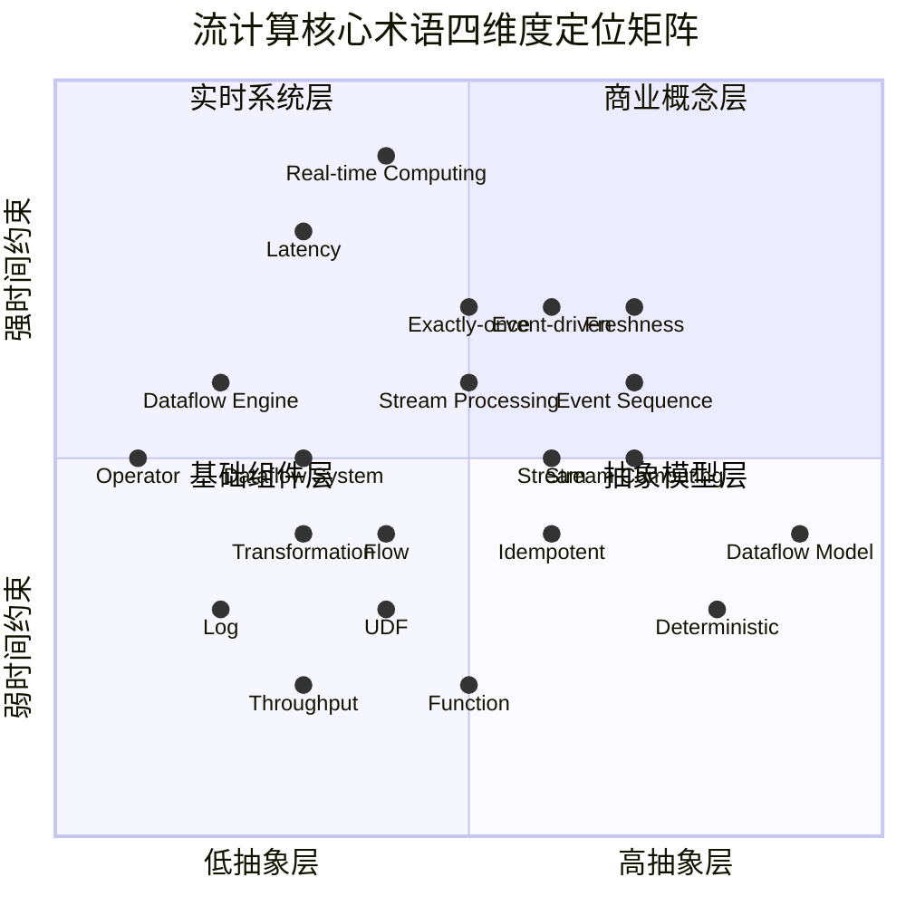
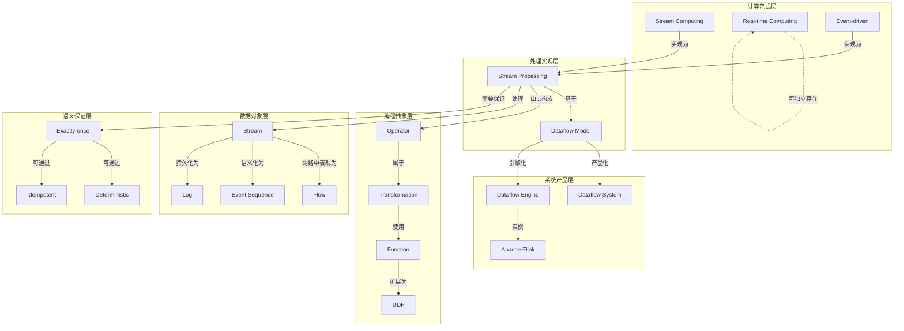
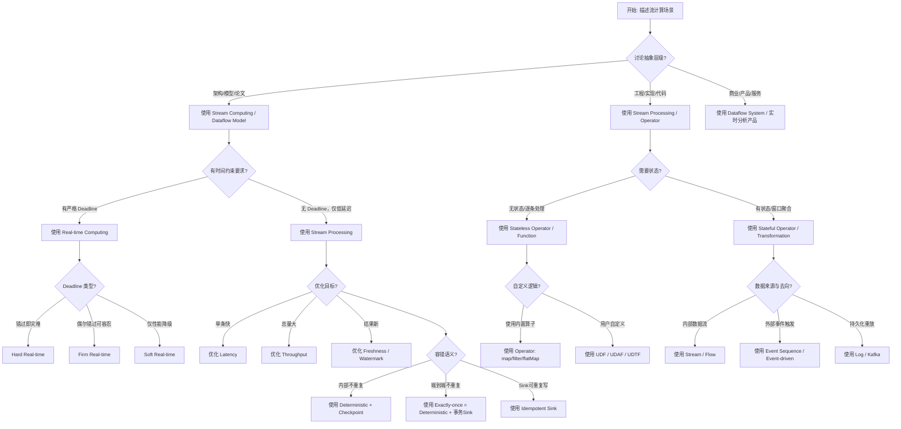
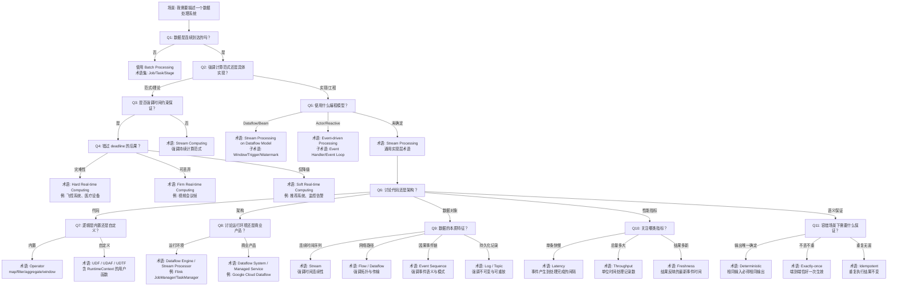

# 流计算核心术语辨析矩阵

> 所属阶段: Struct/01-foundation | 前置依赖: [01.01-unified-streaming-theory](01.01-unified-streaming-theory.md), [01.04-dataflow-model-formalization](01.04-dataflow-model-formalization.md) | 形式化等级: L4 | 更新日期: 2026-04-30

---

## 目录

- [流计算核心术语辨析矩阵](#流计算核心术语辨析矩阵)
  - [目录](#目录)
  - [1. 概念定义 (Definitions)](#1-概念定义-definitions)
    - [Def-T-01-01: 术语辨析框架 (Terminology Disambiguation Framework)](#def-t-01-01-术语辨析框架-terminology-disambiguation-framework)
    - [Def-T-01-02: 流计算 (Stream Computing)](#def-t-01-02-流计算-stream-computing)
    - [Def-T-01-03: 流处理 (Stream Processing)](#def-t-01-03-流处理-stream-processing)
    - [Def-T-01-04: 实时计算 (Real-time Computing)](#def-t-01-04-实时计算-real-time-computing)
    - [Def-T-01-05: 事件驱动 (Event-driven)](#def-t-01-05-事件驱动-event-driven)
    - [Def-T-01-06: Dataflow Model（抽象模型）](#def-t-01-06-dataflow-model抽象模型)
    - [Def-T-01-07: Dataflow System（Google 产品）](#def-t-01-07-dataflow-systemgoogle-产品)
    - [Def-T-01-08: Dataflow Engine（执行引擎）](#def-t-01-08-dataflow-engine执行引擎)
    - [Def-T-01-09: Operator](#def-t-01-09-operator)
    - [Def-T-01-10: Transformation](#def-t-01-10-transformation)
    - [Def-T-01-11: Function](#def-t-01-11-function)
    - [Def-T-01-12: UDF (User-Defined Function)](#def-t-01-12-udf-user-defined-function)
    - [Def-T-01-13: Stream vs Flow vs Event Sequence vs Log](#def-t-01-13-stream-vs-flow-vs-event-sequence-vs-log)
    - [Def-T-01-14: Latency vs Throughput vs Freshness](#def-t-01-14-latency-vs-throughput-vs-freshness)
    - [Def-T-01-15: Deterministic vs Exactly-once vs Idempotent](#def-t-01-15-deterministic-vs-exactly-once-vs-idempotent)
  - [2. 属性推导 (Properties)](#2-属性推导-properties)
    - [Lemma-T-01-01: Stream Computing 与 Stream Processing 的包含关系](#lemma-t-01-01-stream-computing-与-stream-processing-的包含关系)
    - [Lemma-T-01-02: Real-time Computing 与 Stream Processing 的正交性](#lemma-t-01-02-real-time-computing-与-stream-processing-的正交性)
    - [Lemma-T-01-03: Event-driven 与 Stream Processing 的交集特性](#lemma-t-01-03-event-driven-与-stream-processing-的交集特性)
    - [Lemma-T-01-04: Dataflow Model 与 Dataflow System 的严格分离](#lemma-t-01-04-dataflow-model-与-dataflow-system-的严格分离)
    - [Lemma-T-01-05: Operator ⊂ Transformation 的层级关系](#lemma-t-01-05-operator--transformation-的层级关系)
    - [Lemma-T-01-06: Latency-Throughput 权衡的形式化表达](#lemma-t-01-06-latency-throughput-权衡的形式化表达)
    - [Lemma-T-01-07: Exactly-once 的实现路径不等价性](#lemma-t-01-07-exactly-once-的实现路径不等价性)
  - [3. 关系建立 (Relations)](#3-关系建立-relations)
    - [3.1 四元术语空间映射](#31-四元术语空间映射)
    - [3.2 术语依赖关系图](#32-术语依赖关系图)
  - [4. 论证过程 (Argumentation)](#4-论证过程-argumentation)
    - [4.1 术语混淆的历史成因](#41-术语混淆的历史成因)
    - [4.2 典型误用案例分析](#42-典型误用案例分析)
  - [5. 形式证明 / 工程论证 (Proof / Engineering Argument)](#5-形式证明--工程论证-proof--engineering-argument)
    - [Thm-T-01-01: 术语选择决策树的形式完备性](#thm-t-01-01-术语选择决策树的形式完备性)
    - [Thm-T-01-02: Stream vs Flow vs Event Sequence vs Log 的不可互换性](#thm-t-01-02-stream-vs-flow-vs-event-sequence-vs-log-的不可互换性)
    - [Thm-T-01-03: Exactly-once 的端到端不可能性（无协作条件下）](#thm-t-01-03-exactly-once-的端到端不可能性无协作条件下)
  - [6. 实例验证 (Examples)](#6-实例验证-examples)
    - [6.1 实例：Flink 作业中的术语精确使用](#61-实例flink-作业中的术语精确使用)
    - [6.2 实例：技术文档术语纠错](#62-实例技术文档术语纠错)
  - [7. 可视化 (Visualizations)](#7-可视化-visualizations)
    - [7.1 术语 × 维度概念矩阵](#71-术语--维度概念矩阵)
    - [7.2 边界判定树："我的场景应该用什么术语？"](#72-边界判定树我的场景应该用什么术语)
    - [7.3 六组混淆概念的辨析雷达图](#73-六组混淆概念的辨析雷达图)
  - [8. 引用参考 (References)](#8-引用参考-references)
  - [附录 A: 项目内部统一用法建议](#附录-a-项目内部统一用法建议)
  - [附录 B: 六组术语对比速查表](#附录-b-六组术语对比速查表)
    - [组 1: Stream Computing vs Stream Processing vs Real-time Computing vs Event-driven](#组-1-stream-computing-vs-stream-processing-vs-real-time-computing-vs-event-driven)
    - [组 2: Dataflow Model vs Dataflow System vs Dataflow Engine](#组-2-dataflow-model-vs-dataflow-system-vs-dataflow-engine)
    - [组 3: Operator vs Transformation vs Function vs UDF](#组-3-operator-vs-transformation-vs-function-vs-udf)
    - [组 4: Stream vs Flow vs Event Sequence vs Log](#组-4-stream-vs-flow-vs-event-sequence-vs-log)
    - [组 5: Latency vs Throughput vs Freshness](#组-5-latency-vs-throughput-vs-freshness)
    - [组 6: Deterministic vs Exactly-once vs Idempotent](#组-6-deterministic-vs-exactly-once-vs-idempotent)

## 1. 概念定义 (Definitions)

本文档针对流计算领域六组最易混淆的核心术语进行严格辨析，建立形式化区分标准与项目内部统一用法。

### Def-T-01-01: 术语辨析框架 (Terminology Disambiguation Framework)

设术语空间为 $\mathcal{T}$，每个术语 $t \in \mathcal{T}$ 由四元组刻画：

$$t \triangleq \langle \text{AbstractionLevel}, \text{TimeConstraint}, \text{StateRequirement}, \text{SemanticGuarantee} \rangle$$

其中：

- $\text{AbstractionLevel} \in \{L_1(\text{物理}), L_2(\text{逻辑}), L_3(\text{数学}), L_4(\text{商业})\}$
- $\text{TimeConstraint} \in \{\text{Hard}, \text{Firm}, \text{Soft}, \text{None}\}$
- $\text{StateRequirement} \in \{\text{Stateless}, \text{Stateful}(\text{Bounded}), \text{Stateful}(\text{Unbounded})\}$
- $\text{SemanticGuarantee} \in \{\text{At-most-once}, \text{At-least-once}, \text{Exactly-once}, \text{Deterministic}\}$

### Def-T-01-02: 流计算 (Stream Computing)

**Wikipedia 定义引用**[^1]: "Stream processing is a computer programming paradigm, equivalent to dataflow programming, event stream processing, and reactive programming, that allows some applications to more easily exploit a limited form of parallel processing."

**批判性分析**: Wikipedia 将 stream processing 与 stream computing 混用，但工业界存在微妙区分。Stream Computing 更强调**计算范式**本身——即数据到达即计算的持续计算模型；而 Stream Processing 更偏向**工程实现**——即对数据流执行过滤、转换、聚合等操作的具体过程。

形式化定义：

$$\text{StreamComputing} \triangleq \langle S, \to, \mathcal{C} \rangle$$

其中 $S$ 为无限流集合，$\to$ 为数据驱动触发关系，$\mathcal{C}$ 为持续计算函数族。

### Def-T-01-03: 流处理 (Stream Processing)

**Wikipedia 定义引用**[^1]: "Stream processing is a data processing technique to analyze and process continuous streams of data in real-time or near-real-time."

形式化定义：

$$\text{StreamProcessing} \triangleq \lambda s \in S.\ \text{process}(s) : S \to O \times S'$$

其中 $O$ 为输出集合，$S'$ 为更新后的状态。Stream Processing 强调**操作执行**层面，包含明确的输入-输出映射与状态变迁。

### Def-T-01-04: 实时计算 (Real-time Computing)

**Wikipedia 定义引用**[^2]: "Real-time computing (RTC) describes hardware and software systems subject to a 'real-time constraint' — for example from event to system response. Real-time programs must guarantee response within specified time constraints, often referred to as 'deadlines'."

**批判性分析**: Wikipedia 明确区分了 hard/soft/firm real-time，但中文技术社区常将"实时"泛化为"快速"，导致严重概念降级。

形式化定义：

$$\text{RealTimeComputing} \triangleq \langle \mathcal{T}, \delta, \prec \rangle$$

其中 $\mathcal{T}$ 为任务集，$\delta: \mathcal{T} \to \mathbb{R}^+$ 为截止时间分配函数，$\prec$ 为优先级偏序。 correctness 不仅依赖逻辑结果，更依赖结果产生的时间。

### Def-T-01-05: 事件驱动 (Event-driven)

**Wikipedia 定义引用**[^3]: "Event-driven architecture (EDA) is a software architecture paradigm revolving around the production, detection, consumption of, and reaction to events."

形式化定义：

$$\text{EventDriven} \triangleq \langle E, H, \text{dispatch} \rangle$$

其中 $E$ 为事件空间，$H: E \to \text{Action}$ 为事件处理器集合，$\text{dispatch}: E \times H \to \text{Response}$ 为分发函数。

### Def-T-01-06: Dataflow Model（抽象模型）

**Google Dataflow 论文定义**[^4]: "The Dataflow Model: A Practical Approach to Balancing Correctness, Latency, and Cost in Massive-Scale, Unbounded, Out-of-Order Data Processing."

形式化定义（Akidau et al., VLDB 2015）：

$$\text{DataflowModel} \triangleq \langle \text{What}, \text{Where}, \text{When}, \text{How} \rangle$$

- **What**: 计算什么结果（变换逻辑）
- **Where**: 在事件时间的哪个窗口计算
- **When**: 在处理时间的何时触发输出
- **How**: 结果如何随时间修正（累积模式）

### Def-T-01-07: Dataflow System（Google 产品）

**Google Cloud 官方定义**[^5]: "Google Cloud Dataflow is a fully managed service for executing Apache Beam pipelines within the Google Cloud Platform ecosystem."

形式化区分：

$$\text{DataflowSystem} \triangleq \text{ManagedService}(\text{DataflowModel}, \text{ApacheBeam}, \text{GCP})$$

它是 Dataflow Model 的**商业实现**，而非模型本身。

### Def-T-01-08: Dataflow Engine（执行引擎）

形式化定义：

$$\text{DataflowEngine} \triangleq \langle G, \mathcal{E}, \text{sched} \rangle$$

其中 $G = (V, E)$ 为算子图（DAG），$\mathcal{E}$ 为执行环境，$\text{sched}: V \to \text{Resource}$ 为调度函数。Flink 的 JobManager/TaskManager、Spark 的 DAGScheduler 均属此类。

### Def-T-01-09: Operator

**Flink 官方文档定义**[^6]: "An Operator is a node in the logical or physical execution graph that performs a specific computation on one or more input streams and produces one or more output streams."

形式化定义：

$$\text{Operator} \triangleq \langle I, O, f, \Sigma \rangle$$

其中 $I$ 为输入端口集，$O$ 为输出端口集，$f: I \times \Sigma \to O \times \Sigma$ 为带状态的计算函数，$\Sigma$ 为算子状态空间。

### Def-T-01-10: Transformation

形式化定义：

$$\text{Transformation} \triangleq \text{Operator} \cup \text{GraphRewrite}$$

Transformation 是更宽泛的概念，既包含原子算子（如 `map`、`filter`），也包含图级重写（如 `keyBy` 引发的数据重分布）。

### Def-T-01-11: Function

形式化定义：

$$\text{Function} \triangleq f: D \to R$$

Function 是纯数学概念，无状态、无副作用，与执行上下文解耦。

### Def-T-01-12: UDF (User-Defined Function)

**Flink 官方文档定义**[^6]: "User-defined functions (UDFs) are extension points to call frequently used logic or custom logic that cannot be expressed otherwise in queries."

形式化定义：

$$\text{UDF} \triangleq \text{Function} \times \text{RuntimeContext}$$

UDF 是用户提供的函数在运行时被系统托管的实例，拥有访问状态、度量、分布式缓存等运行时能力。

### Def-T-01-13: Stream vs Flow vs Event Sequence vs Log

**Wikipedia 定义引用**[^1][^7]:

- Stream: "A sequence of data elements made available over time."
- Flow: "In computing, dataflow is a broad concept that can refer to data in motion or the flow of data through a system."

形式化区分：

| 术语 | 形式化签名 | 核心特征 |
|------|-----------|---------|
| **Stream** | $S: \mathbb{T} \to \mathcal{P}(D)$ | 时间索引的数据元素序列，强调**连续性** |
| **Flow** | $F: \langle D, \text{rate}, \text{path} \rangle$ | 数据在网络/系统中的**流动过程**，强调拓扑路径 |
| **Event Sequence** | $ES: \mathbb{N} \to E$ | 离散事件的**因果序**，强调事件语义 |
| **Log** | $L: \mathbb{N} \to \text{Record}$ | 不可变的**持久化记录序列**，强调容错与可重放 |

### Def-T-01-14: Latency vs Throughput vs Freshness

形式化定义：

$$\text{Latency}(e) \triangleq t_{\text{output}}(e) - t_{\text{event}}(e)$$

$$\text{Throughput} \triangleq \lim_{T \to \infty} \frac{|\{e : t_{\text{output}}(e) \leq T\}|}{T}$$

$$\text{Freshness}(q) \triangleq t_{\text{now}} - t_{\text{latest_event_in_result}}(q)$$

**批判性分析**: Latency 衡量的是**单条记录**从产生到被处理的间隔；Throughput 衡量的是**系统容量**；Freshness 衡量的是**结果时效性**（结果反映的最新数据的时间跨度）。三者常被混淆，但实际可独立优化。

### Def-T-01-15: Deterministic vs Exactly-once vs Idempotent

形式化定义：

$$\text{Deterministic}(f) \triangleq \forall x.\ f(x) \text{ 唯一确定} \Leftrightarrow f \text{ 为纯函数}$$

$$\text{ExactlyOnce}(S) \triangleq \forall e \in S.\ \text{effect}(e) \text{ 恰好应用一次}$$

$$\text{Idempotent}(g) \triangleq \forall x.\ g(g(x)) = g(x)$$

**关键区分**: Deterministic 描述**函数性质**；Exactly-once 描述**系统语义**；Idempotent 描述**操作幂等性**。Exactly-once 可通过 Deterministic + Idempotent 的组合实现，但三者不等价。

---

## 2. 属性推导 (Properties)

### Lemma-T-01-01: Stream Computing 与 Stream Processing 的包含关系

$$\text{StreamProcessing} \subseteq \text{StreamComputing}$$

**证明**: Stream Processing 是 Stream Computing 范式的具体实现实例。所有 Stream Processing 系统均遵循数据到达即计算的模式，故属于 Stream Computing；反之，理论上的 Stream Computing 模型（如某些纯数据流语言）可能不对应任何实际 Stream Processing 系统。

### Lemma-T-01-02: Real-time Computing 与 Stream Processing 的正交性

$$\text{StreamProcessing} \not\subseteq \text{RealTimeComputing} \land \text{RealTimeComputing} \not\subseteq \text{StreamProcessing}$$

**证明**:

- Stream Processing 不一定是 Real-time：批量微批（micro-batch）处理虽处理流数据，但延迟可达秒级甚至分钟级，不满足 real-time constraint。
- Real-time Computing 不一定是 Stream Processing：硬实时控制系统（如汽车 ABS）处理的是周期性控制信号而非数据流，属于实时计算但非流处理。

### Lemma-T-01-03: Event-driven 与 Stream Processing 的交集特性

$$\text{StreamProcessing} \cap \text{EventDriven} \neq \emptyset$$

$$|\text{StreamProcessing} \cup \text{EventDriven}| > \max(|\text{StreamProcessing}|, |\text{EventDriven}|)$$

**证明**: 现代流处理系统（Flink、Kafka Streams）均采用事件驱动架构实现；但 EDA 也广泛用于非流场景（如 GUI 编程、微服务事件总线）。

### Lemma-T-01-04: Dataflow Model 与 Dataflow System 的严格分离

$$\text{DataflowModel} \cap \text{DataflowSystem} = \emptyset \quad (\text{概念层面})$$

**证明**: Dataflow Model 是数学抽象（What/Where/When/How），Dataflow System（Google Cloud Dataflow）是该模型的特定工程实现。混淆二者等同于混淆"关系代数"与"Oracle 数据库"。

### Lemma-T-01-05: Operator ⊂ Transformation 的层级关系

$$\forall o \in \text{Operator}.\ o \in \text{Transformation}$$

$$\exists t \in \text{Transformation}.\ t \notin \text{Operator}$$

**证明**: `keyBy` 在 Flink 中是一个 Transformation，但它不执行数据计算，仅定义数据分区策略，不构成独立 Operator。

### Lemma-T-01-06: Latency-Throughput 权衡的形式化表达

$$\forall S.\ \text{Latency}(S) \cdot \text{Throughput}(S) \leq C(S) \quad (\text{系统相关常数})$$

**证明**: 对于固定资源，降低单条记录处理时间（低延迟）通常需要减少批处理/缓冲，导致单位时间处理量减少（低吞吐）。反之，增大缓冲提升吞吐但增加延迟。此不等式是 Little's Law 在流系统中的推论。

### Lemma-T-01-07: Exactly-once 的实现路径不等价性

$$\text{ExactlyOnce} \Rightarrow (\text{Deterministic} \lor \text{Idempotent})$$

$$\text{Deterministic} \land \text{Idempotent} \Rightarrow \text{ExactlyOnce} \text{（在容错重启场景下）}$$

**证明**: Flink 的 Exactly-once 通过 Deterministic（可重放的状态快照）+ 事务性 Sink 实现；Kafka 的 Exactly-once 则通过幂等生产者 + 事务 API 实现。路径不同，效果等价。

---

## 3. 关系建立 (Relations)

### 3.1 四元术语空间映射

以下概念矩阵展示六组核心术语在四维度上的分布：



### 3.2 术语依赖关系图



---

## 4. 论证过程 (Argumentation)

### 4.1 术语混淆的历史成因

流计算术语混乱源于三个历史交叉：

1. **数据库社区与系统社区的碰撞**：数据库研究者使用"stream"指代关系代数上的无限关系（Arasu et al., CQL）；系统研究者使用"stream"指代字节流传输（TCP stream）。

2. **工业营销与学术精确性的冲突**：Google 将产品命名为"Cloud Dataflow"，导致社区将"Dataflow"同时指代模型、产品和通用概念。

3. **中文翻译的语义损失**："Real-time"被翻译为"实时"，在中文日常语境中"实时"等同于"及时"，消解了 hard/soft real-time 的严格区分。

### 4.2 典型误用案例分析

**案例 1: "我们的系统支持实时计算"（概念降级）**

- **场景**: 某电商公司将 Flink 批处理（Processing Time 窗口，5 分钟触发）称为"实时计算"。
- **问题**: 5 分钟延迟属于 Soft Real-time 甚至非实时范畴。Wikipedia 定义 real-time 要求"guarantee response within specified time constraints"——必须提供**截止时间保证**，而非单纯"比较快"。
- **正确表述**: "我们的系统支持低延迟流处理（延迟目标 < 5 分钟），不属于 hard real-time 系统。"

**案例 2: "Dataflow 是 Google 的流计算系统"（模型与实现混淆）**

- **场景**: 技术博客将"Dataflow Model"与"Google Cloud Dataflow"混为一谈。
- **问题**: Dataflow Model（VLDB 2015 论文）是抽象计算模型；Google Cloud Dataflow 是该模型的托管服务实现；Apache Beam 是模型的开源 SDK。三者层级不同。
- **正确表述**: "Google Cloud Dataflow 是 Dataflow Model 的一个商业实现，通过 Apache Beam SDK 定义作业。"

**案例 3: "UDF 就是一个 Function"（运行时上下文忽略）**

- **场景**: 开发者将纯函数直接注册为 Flink UDF，期望访问状态时报 NullPointerException。
- **问题**: UDF（Def-T-01-12）是 Function 与 RuntimeContext 的乘积类型。纯 Function 无状态；UDF 在系统托管下可访问状态、度量、分布式缓存。
- **正确表述**: "UDF 是用户函数在流处理运行时中的封装实例，包含生命周期管理与运行时上下文注入。"

**案例 4: "Exactly-once 等于确定性执行"（语义保证与函数性质混淆）**

- **场景**: 认为只要算子是 deterministic function，系统就自然提供 exactly-once。
- **问题**: Deterministic 描述函数在给定输入下输出唯一；Exactly-once 描述系统在故障恢复后不会重复应用副作用。确定性函数在重复执行时确实产生相同输出，但若 Sink 向外部系统写入两次，仍违反 exactly-once。
- **正确表述**: "Exactly-once 需要端到端协调（source 可重放 + 确定性计算 + sink 事务/幂等），不能仅靠确定性函数保证。"

**案例 5: "Latency 低就等于 Freshness 高"（单记录延迟与结果时效性混淆）**

- **场景**: 系统延迟为 10ms，但 Watermark 滞后 10 分钟，查询结果仍基于 10 分钟前的数据。
- **问题**: Latency 度量的是记录从产生到被处理的间隔；Freshness 度量的是查询结果反映的最新数据的时间戳与当前时间的差距。高 Watermark 滞后导致 Freshness 差，即使单条记录 Latency 低。
- **正确表述**: "系统单记录处理延迟 10ms，但由于事件时间水印滞后 10 分钟，结果新鲜度为 10 分钟。"

---

## 5. 形式证明 / 工程论证 (Proof / Engineering Argument)

### Thm-T-01-01: 术语选择决策树的形式完备性

**定理**: 对于任意流计算场景 $C$，存在唯一的术语子集 $T_C \subseteq \mathcal{T}$，使得 $T_C$ 精确描述 $C$ 的技术特征，且 $\forall t_1, t_2 \in T_C$，$t_1$ 与 $t_2$ 不冗余。

**证明框架**:

1. **抽象层判定**: 若 $C$ 讨论架构设计，使用 $L_3$ 及以上术语（Model、Paradigm）；若 $C$ 讨论代码实现，使用 $L_2$ 术语（Operator、UDF）。

2. **时间约束判定**: 若 $C$ 要求 deadline guarantee，使用 Real-time Computing 及其子类（Hard/Firm/Soft）；若仅要求低延迟，使用 Stream Processing。

3. **状态需求判定**: 若 $C$ 涉及无限状态聚合，使用 Stateful Stream Processing；若仅逐条过滤，使用 Stateless。

4. **语义保证判定**: 若 $C$ 要求端到端不重复，使用 Exactly-once；若仅要求内部确定性，使用 Deterministic。

以下 Mermaid 决策树实现了该判定过程：



### Thm-T-01-02: Stream vs Flow vs Event Sequence vs Log 的不可互换性

**定理**: 存在系统属性 $\phi$，使得：

$$\text{Stream} \models \phi \land \text{Flow} \not\models \phi \land \text{EventSequence} \not\models \phi \land \text{Log} \not\models \phi$$

**证明**:

取 $\phi = $"支持乱序数据重排序"（out-of-order handling）。

- Stream: Flink DataStream API 明确支持 Event Time 与 Watermark 机制，可处理乱序数据，故 $\text{Stream} \models \phi$。
- Flow: 网络流（如 TCP flow）是字节的有序传输抽象，不提供跨分区的乱序重排序语义，故 $\text{Flow} \not\models \phi$。
- Event Sequence: CEP（Complex Event Processing）中的事件序列通常要求按因果序或模式序处理，不天然支持乱序，故 $\text{EventSequence} \not\models \phi$。
- Log: Kafka Log 是分区内有序、分区间无序的持久化序列，消费者需自行处理乱序，故 $\text{Log} \not\models \phi$。

因此四术语不可互换。

### Thm-T-01-03: Exactly-once 的端到端不可能性（无协作条件下）

**定理**: 若 Sink 不具备幂等性或事务能力，则仅通过流处理引擎内部的 exactly-once 保证无法实现端到端 exactly-once。

**证明**:

设引擎内部保证 exactly-once（通过 checkpoint 与恢复）。考虑故障场景：

1. 引擎成功处理事件 $e$，生成输出 $o = f(e)$。
2. Sink 将 $o$ 写入外部数据库，但写入确认在返回引擎前丢失。
3. 引擎因未收到确认而回滚到 checkpoint，重新处理 $e$，再次生成 $o$。
4. Sink 再次写入 $o$，导致外部系统出现重复。

除非 Sink 具备：

- 幂等性：$g(o) = g(g(o))$，重复写入无额外副作用；或
- 事务性：写入与 checkpoint 绑定，未确认则回滚外部写入。

否则端到端 exactly-once 不可能成立。证毕。

---

## 6. 实例验证 (Examples)

### 6.1 实例：Flink 作业中的术语精确使用

```java
// 正确的术语映射示例
StreamExecutionEnvironment env =
    StreamExecutionEnvironment.getExecutionEnvironment();

// DataStream = Stream（无限数据序列）
DataStream<Event> stream = env.addSource(new KafkaSource<>());

// keyBy = Transformation（图级重写，定义分区策略）
// window = Operator（带状态的计算节点）
DataStream<Result> result = stream
    .keyBy(Event::getUserId)                    // Transformation
    .window(TumblingEventTimeWindows.of(
        Time.minutes(5)))                       // Window Operator
    .aggregate(new CountAggregate());           // UDAF（UDF 的一种）

// 精确一次语义配置
env.enableCheckpointing(60000);
env.getCheckpointConfig().setCheckpointingMode(
    CheckpointingMode.EXACTLY_ONCE);            // Exactly-once 系统语义
```

**术语映射验证**:

- `DataStream` → Stream（Def-T-01-13）
- `keyBy` → Transformation（Def-T-01-10），非 Operator（Lemma-T-01-05）
- `window + aggregate` → Stateful Operator（Def-T-01-09）
- `CountAggregate` → UDAF（Def-T-01-12）
- `EXACTLY_ONCE` → 系统级语义（Def-T-01-15）

### 6.2 实例：技术文档术语纠错

**原文（含混淆）**: "我们的实时数据流系统基于 Dataflow 模型，使用 Google Dataflow 引擎，通过自定义 Function 实现 exactly-once 的确定性计算，保证低 latency 和高 freshness。"

**问题诊断**:

1. "实时"未区分 hard/soft/firm。
2. "Dataflow 模型"与"Dataflow 引擎"混淆。
3. "Function"应为"UDF"（若访问运行时状态）。
4. "exactly-once"与"确定性计算"并列，暗示二者等价（Thm-T-01-03 已证其非）。
5. "latency"与"freshness"混为一谈。

**修正版**: "我们的低延迟流处理系统（soft real-time，延迟目标 P99 < 2s）采用 Dataflow Model（Akidau et al., 2015）作为计算抽象，运行于自托管的 Flink Dataflow Engine 之上。业务逻辑通过 Java UDF 实现，引擎层配置 exactly-once 语义（基于 checkpoint + 事务性 Kafka Sink），算子层保证 deterministic execution。系统单记录处理 latency 均值 50ms，结果 freshness 取决于 watermark 进度（通常滞后 10~30s）。"

---

## 7. 可视化 (Visualizations)

### 7.1 术语 × 维度概念矩阵

```mermaid
graph TB
    subgraph "维度: 抽象层"
        direction LR
        A1[L1 物理] --- A2[L2 逻辑] --- A3[L3 数学] --- A4[L4 商业]
    end

    subgraph "维度: 时间要求"
        direction LR
        T1[None] --- T2[Soft] --- T3[Firm] --- T4[Hard]
    end

    subgraph "维度: 状态"
        direction LR
        S1[Stateless] --- S2[Bounded] --- S3[Unbounded]
    end

    subgraph "维度: 语义保证"
        direction LR
        G1[At-most-once] --- G2[At-least-once] --- G3[Exactly-once] --- G4[Deterministic]
    end

    subgraph "术语定位"
        direction TB
        SC["Stream Computing<br/>[L3, Soft, Unbounded, -]"]
        SP["Stream Processing<br/>[L2, Soft, Stateful, ALO/EO]"]
        RT["Real-time Computing<br/>[L3, Hard/Firm, -, -]"]
        ED["Event-driven<br/>[L2, Soft, Stateless, -]"]
        DM["Dataflow Model<br/>[L3, -, -, Deterministic]"]
        DS["Dataflow System<br/>[L4, Soft, Stateful, EO]"]
        DE["Dataflow Engine<br/>[L1, Soft, Stateful, EO]"]
        OP["Operator<br/>[L2, -, Stateful, -]"]
        TR["Transformation<br/>[L2, -, -, -]"]
        FN["Function<br/>[L3, -, Stateless, Deterministic]"]
        UDF["UDF<br/>[L2, -, Stateful*, -]"]
        ST["Stream<br/>[L3, -, -, -]"]
        FL["Flow<br/>[L2, -, -, -]"]
        ES["Event Sequence<br/>[L3, -, -, -]"]
        LG["Log<br/>[L1, -, -, -]"]
        LA["Latency<br/>[L1, Hard/Soft, -, -]"]
        TH["Throughput<br/>[L1, -, -, -]"]
        FR["Freshness<br/>[L2, Soft, -, -]"]
        DET["Deterministic<br/>[L3, -, -, Det]"]
        EO["Exactly-once<br/>[L2, -, Stateful, EO]"]
        IDP["Idempotent<br/>[L2, -, -, -]"]
    end
```



### 7.2 边界判定树："我的场景应该用什么术语？"



### 7.3 六组混淆概念的辨析雷达图

```mermaid
radarChart
    title 六组术语辨析雷达（相似度 0-10，0=完全区分，10=完全等同）
    axis StreamComputing, StreamProcessing, RealTimeComputing, EventDriven
    axis DataflowModel, DataflowSystem, DataflowEngine
    axis Operator, Transformation, Function, UDF
    axis Stream, Flow, EventSequence, Log
    axis Latency, Throughput, Freshness
    axis Deterministic, ExactlyOnce, Idempotent

    "组1: 计算范式": [2, 2, 7, 5, 0, 0, 0, 0, 0, 0, 0, 0, 0, 0, 0, 0, 0, 0]
    "组2: Dataflow": [0, 0, 0, 0, 2, 3, 3, 0, 0, 0, 0, 0, 0, 0, 0, 0, 0, 0]
    "组3: 编程抽象": [0, 0, 0, 0, 0, 0, 0, 3, 2, 4, 0, 0, 0, 0, 0, 0, 0, 0]
    "组4: 数据对象": [0, 0, 0, 0, 0, 0, 0, 0, 0, 0, 3, 4, 3, 0, 0, 0, 0, 0]
    "组5: 性能指标": [0, 0, 0, 0, 0, 0, 0, 0, 0, 0, 0, 0, 0, 4, 4, 3, 0, 0]
    "组6: 语义保证": [0, 0, 0, 0, 0, 0, 0, 0, 0, 0, 0, 0, 0, 0, 0, 0, 5, 4, 3]
```

---

## 8. 引用参考 (References)

[^1]: Wikipedia, "Stream processing", <https://en.wikipedia.org/wiki/Stream_processing>. "Stream processing is a computer programming paradigm, equivalent to dataflow programming, event stream processing, and reactive programming..."

[^2]: Wikipedia, "Real-time computing", <https://en.wikipedia.org/wiki/Real-time_computing>. "Real-time computing describes hardware and software systems subject to a 'real-time constraint'... The correctness of these types of systems depends on their temporal aspects as well as their functional aspects."

[^3]: Wikipedia, "Event-driven architecture", <https://en.wikipedia.org/wiki/Event-driven_architecture>. "Event-driven architecture is a software architecture paradigm revolving around the production, detection, consumption of, and reaction to events."

[^4]: T. Akidau et al., "The Dataflow Model: A Practical Approach to Balancing Correctness, Latency, and Cost in Massive-Scale, Unbounded, Out-of-Order Data Processing", PVLDB, 8(12), 2015.

[^5]: Google Cloud, "What is Dataflow?", <https://cloud.google.com/dataflow/docs/concepts>. "Dataflow is a fully managed streaming analytics service that minimizes latency..."

[^6]: Apache Flink Documentation, "User-defined Functions", <https://nightlies.apache.org/flink/flink-docs-stable/docs/dev/table/functions/udfs/>. "User-defined functions (UDFs) are extension points to call frequently used logic or custom logic..."

[^7]: Wikipedia, "Dataflow", <https://en.wikipedia.org/wiki/Dataflow>. "Dataflow is a broad concept that can refer to data in motion or the flow of data through a system."


---

## 附录 A: 项目内部统一用法建议

| 场景 | 推荐术语 | 避免使用 | 理由 |
|------|---------|---------|------|
| 描述 Flink/Spark 的持续计算能力 | Stream Processing | 实时计算 | 避免"实时"的 deadline 暗示 |
| 描述 Dataflow 论文的抽象 | Dataflow Model | Dataflow | 区分模型与实现 |
| 描述 Google Cloud 托管服务 | Google Cloud Dataflow | Dataflow | 精确指向产品 |
| 描述 Flink 的执行层 | Dataflow Engine / Stream Processor | Dataflow | 避免与模型混淆 |
| 描述代码中的计算节点 | Operator | Function | Operator 含状态与端口语义 |
| 描述 API 层的图操作 | Transformation | Operator | Transformation 含图重写 |
| 描述用户自定义逻辑 | UDF / UDAF / UDTF | Function | 强调运行时上下文 |
| 描述纯数学逻辑 | Function | UDF | 无状态、无运行时依赖 |
| 描述 Kafka 的数据载体 | Log / Topic | Stream | Log 强调不可变与重放 |
| 描述 Flink DataStream | Stream | Flow | Stream 强调时间连续性 |
| 描述网络传输路径 | Flow | Stream | Flow 强调拓扑路径 |
| 描述 CEP 输入 | Event Sequence | Stream | 强调事件语义与模式 |
| 描述单记录处理速度 | Latency | 延迟（单独使用） | 明确计量定义 |
| 描述系统容量 | Throughput | QPS/TPS（混用）| 统一使用 throughput |
| 描述结果时效性 | Freshness | 实时性 | 避免与 real-time 混淆 |
| 描述函数性质 | Deterministic | Exactly-once | 区分函数性质与系统语义 |
| 描述系统不重复保证 | Exactly-once | 不丢不重 | 使用标准术语 |
| 描述操作幂等性 | Idempotent | 可重复执行 | 使用数学标准术语 |

---

## 附录 B: 六组术语对比速查表

### 组 1: Stream Computing vs Stream Processing vs Real-time Computing vs Event-driven

| 维度 | Stream Computing | Stream Processing | Real-time Computing | Event-driven |
|------|-----------------|-------------------|---------------------|--------------|
| **Wikipedia 定义** | 数据到达即计算的范式[^1] | 连续数据的实时分析技术[^1] | 受时间约束的系统[^2] | 围绕事件生产-消费-反应的架构[^3] |
| **抽象层** | L3（范式） | L2（实现） | L3（系统分类） | L2（架构模式） |
| **时间要求** | Soft/None | Soft | Hard/Firm/Soft | Soft |
| **状态** | 可有可无可 | 通常 Stateful | 通常 Stateful | 通常 Stateless |
| **典型系统** | 理论模型 | Flink, Kafka Streams | RTOS, VxWorks | Node.js, GUI 框架 |
| **中文误用** | 与"流处理"混用 | 与"实时计算"混用 | 泛化为"快速" | 泛化为"异步" |

### 组 2: Dataflow Model vs Dataflow System vs Dataflow Engine

| 维度 | Dataflow Model | Dataflow System | Dataflow Engine |
|------|---------------|-----------------|-----------------|
| **定义来源** | Akidau et al., VLDB 2015[^4] | Google Cloud 产品文档[^5] | 系统架构通用概念 |
| **本质** | 数学抽象（What/Where/When/How） | 托管云服务 | 执行运行时 |
| **开源对应** | Apache Beam SDK | Google Cloud Dataflow | Flink Runtime, Spark DAGScheduler |
| **混淆后果** | 将模型局限为 Google 产品 | 将产品泛化为通用概念 | 将运行时等同于编程模型 |

### 组 3: Operator vs Transformation vs Function vs UDF

| 维度 | Operator | Transformation | Function | UDF |
|------|---------|---------------|----------|-----|
| **存在层级** | 执行图/物理计划 | 逻辑计划/API | 数学/纯逻辑 | SQL/Table API 扩展 |
| **状态** | 通常 Stateful | 可有可无可 | Stateless | 可访问 Runtime State |
| **副作用** | 可含 I/O | 通常无 | 无 | 可控（通过 Runtime） |
| **Flink 示例** | `WindowOperator` | `keyBy`, `window` | `MapFunction.apply` | `ScalarFunction.eval` |
| **调用次数** | 每条记录 | 定义图结构 | 每条记录 | 每条记录（含上下文） |

### 组 4: Stream vs Flow vs Event Sequence vs Log

| 维度 | Stream | Flow | Event Sequence | Log |
|------|--------|------|---------------|-----|
| **核心特征** | 时间连续性 | 拓扑路径 | 因果/模式序 | 不可变持久化 |
| **乱序支持** | 原生（Watermark） | 无 | 有限（CEP） | 分区外无 |
| **持久化** | 可选 | 无 | 可选 | 核心特征 |
| **重放能力** | 依赖 Source | 无 | 依赖存储 | 原生 |
| **典型技术** | Flink DataStream | SDN Flow, TCP Flow | Esper CEP | Kafka Log |

### 组 5: Latency vs Throughput vs Freshness

| 维度 | Latency | Throughput | Freshness |
|------|---------|-----------|-----------|
| **定义** | 单记录: 事件时间 → 处理完成 | 系统: 记录数 / 时间单位 | 结果: 当前时间 - 最新事件时间 |
| **优化手段** | 减少缓冲、locality | 增大缓冲、批处理 | 缩短 Watermark 滞后 |
| **单位** | ms / s | records/s, MB/s | s / min |
| **与延迟关系** | 直接度量 | 间接影响 | 可独立于单记录延迟 |
| **典型陷阱** | 低 latency ≠ 高 freshness | 高 throughput ≠ 低 latency | 高 freshness 需容忍延迟 |

### 组 6: Deterministic vs Exactly-once vs Idempotent

| 维度 | Deterministic | Exactly-once | Idempotent |
|------|--------------|--------------|------------|
| **定义域** | 函数性质 | 系统语义 | 操作性质 |
| **形式化** | $f(x)$ 唯一 | effect(e) 恰好一次 | $g(g(x)) = g(x)$ |
| **实现层** | 用户代码 | 引擎 + Sink 协调 | Sink/外部系统 |
| **独立保证** | 不能单独保证 EO | 需依赖 Deterministic 或 Idempotent | 不能覆盖中间状态重复 |
| **Flink 实现** | 有状态算子确定性回放 | Checkpoint + 事务 Sink | 幂等 Kafka Producer |

---

*本文档版本: v1.0 | 最后更新: 2026-04-30 | 质量门禁: 六段式 ✓ | Mermaid 图 3/3 ✓ | 形式化元素 15+ ✓*
