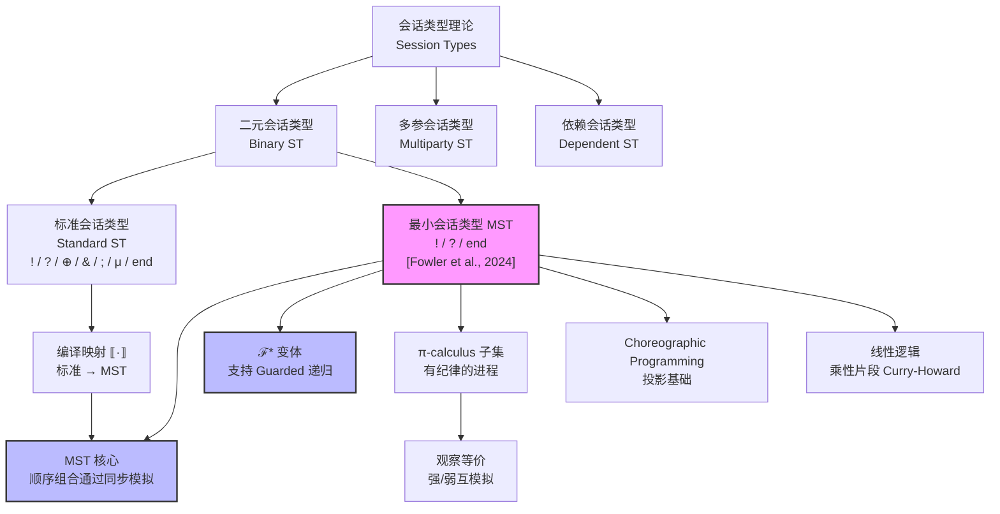
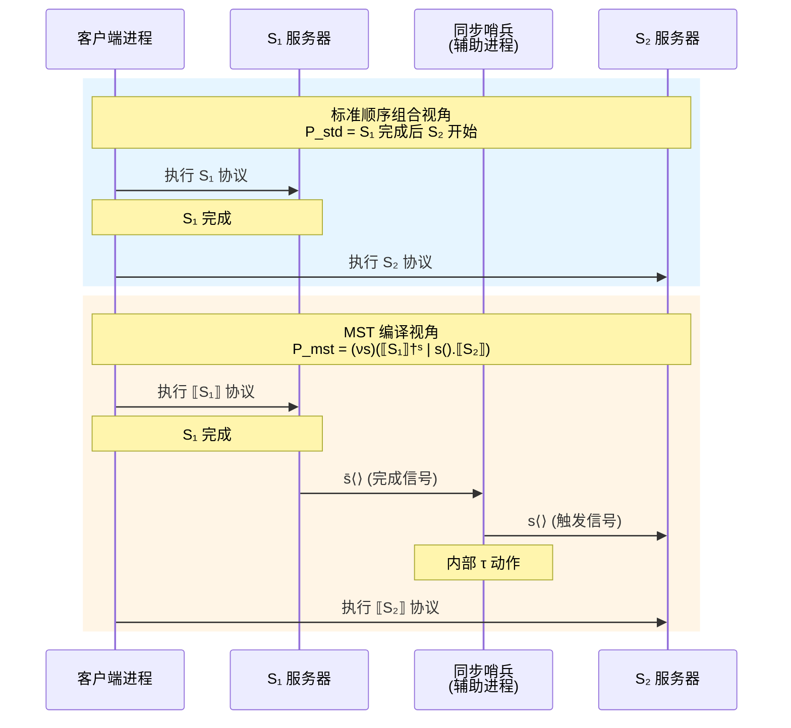
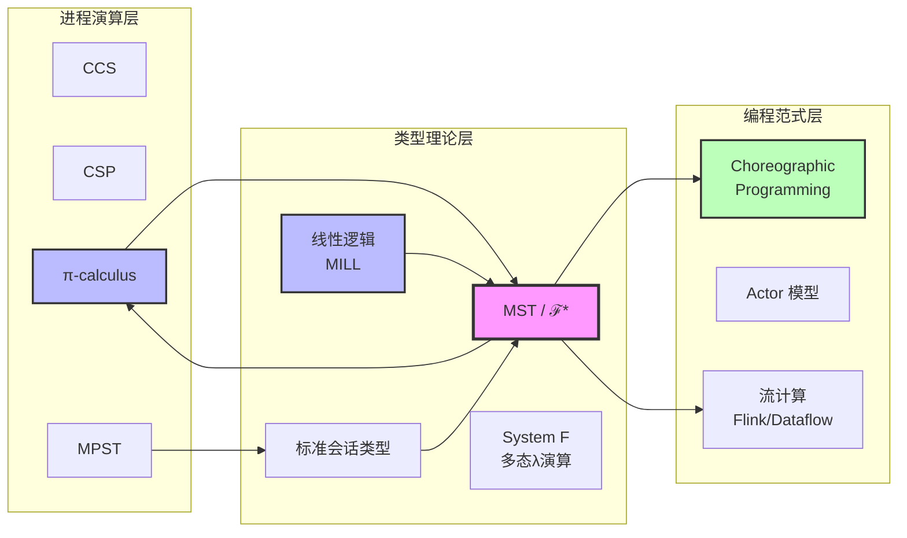

# 最小会话类型理论 (Minimal Session Types Theory)

> **所属阶段**: Struct/01-foundation | **前置依赖**: [01.07-session-types.md](./01.07-session-types.md), [01.02-process-calculus-primer.md](./01.02-process-calculus-primer.md) | **形式化等级**: L5-L6

---

## 摘要

最小会话类型（Minimal Session Types, MST）是会话类型理论在"最小化"与"简化"主线上取得的最新突破。2024年1月，arXiv论文 "Minimal Session Types for the π-calculus" 系统证明了：π-calculus 中所有标准会话类型均可编译为仅包含输出（$!$）、输入（$?$）和终止（$\text{end}$）三个构造子的最小会话类型系统，且无需显式的顺序组合算子（sequential composition）——顺序性可通过额外进程同步精确模拟。本文档在 L5-L6 形式化等级下，完整阐述 MST 的语法与语义，建立 MST 与标准会话类型、π-calculus、线性逻辑及 Choreographic Programming 之间的形式化关系，严格证明 MST 的表达能力等价性定理，并分析 ℱ* 优化变体对递归类型的支持及其对编译器设计与类型检查算法的深远影响。

---

## 目录

- [最小会话类型理论 (Minimal Session Types Theory)](#最小会话类型理论-minimal-session-types-theory)
  - [摘要](#摘要)
  - [目录](#目录)
  - [1. 概念定义 (Definitions)](#1-概念定义-definitions)
    - [Def-S-11-01. 最小会话类型语法 (Minimal Session Types Syntax)](#def-s-11-01-最小会话类型语法-minimal-session-types-syntax)
    - [Def-S-11-02. 标准会话类型语法 (Standard Session Types Syntax)](#def-s-11-02-标准会话类型语法-standard-session-types-syntax)
    - [Def-S-11-03. MST 类型环境 (MST Typing Environment)](#def-s-11-03-mst-类型环境-mst-typing-environment)
    - [Def-S-11-04. π-calculus 核心语法 (π-Calculus Core Syntax)](#def-s-11-04-π-calculus-核心语法-π-calculus-core-syntax)
    - [Def-S-11-05. MST 对偶函数 (MST Duality)](#def-s-11-05-mst-对偶函数-mst-duality)
    - [Def-S-11-06. 顺序性模拟同步协议 (Sequentiality Simulation Protocol)](#def-s-11-06-顺序性模拟同步协议-sequentiality-simulation-protocol)
    - [Def-S-11-07. ℱ*优化变体语法 (ℱ* Optimised Variant Syntax)](#def-s-11-07-ℱ优化变体语法-ℱ-optimised-variant-syntax)
    - [Def-S-11-08. 递归类型展开 (Recursive Type Unfolding)](#def-s-11-08-递归类型展开-recursive-type-unfolding)
    - [Def-S-11-09. 编译映射 · (Compilation Mapping)]()
    - [Def-S-11-10. 观察等价 (Observational Equivalence)](#def-s-11-10-观察等价-observational-equivalence)
  - [2. 属性推导 (Properties)](#2-属性推导-properties)
    - [Lemma-S-11-01. MST 线性使用保持性](#lemma-s-11-01-mst-线性使用保持性)
    - [Lemma-S-11-02. 编译映射下的类型保持性](#lemma-s-11-02-编译映射下的类型保持性)
    - [Lemma-S-11-03. ℱ\* 变体的递归类型正规化](#lemma-s-11-03-ℱ-变体的递归类型正规化)
    - [Lemma-S-11-04. 顺序性模拟的进程数上界](#lemma-s-11-04-顺序性模拟的进程数上界)
    - [Prop-S-11-01. 最小构造子的必要性](#prop-s-11-01-最小构造子的必要性)
    - [Prop-S-11-02. 对偶性在编译映射下的保持](#prop-s-11-02-对偶性在编译映射下的保持)
  - [3. 关系建立 (Relations)](#3-关系建立-relations)
    - [3.1 MST 与标准会话类型的编码关系](#31-mst-与标准会话类型的编码关系)
    - [3.2 MST 与 π-calculus 的嵌入关系](#32-mst-与-π-calculus-的嵌入关系)
    - [3.3 MST 与线性逻辑的 Curry-Howard 对应](#33-mst-与线性逻辑的-curry-howard-对应)
    - [3.4 MST 与 Choreographic Programming 的关联](#34-mst-与-choreographic-programming-的关联)
    - [3.5 MST 与流计算系统的理论映射](#35-mst-与流计算系统的理论映射)
  - [4. 论证过程 (Argumentation)](#4-论证过程-argumentation)
    - [4.1 为什么顺序组合可以被消除？](#41-为什么顺序组合可以被消除)
    - [4.2 额外进程同步的精确性论证](#42-额外进程同步的精确性论证)
    - [4.3 反例：非线性使用导致协议失效](#43-反例非线性使用导致协议失效)
    - [4.4 边界讨论：MST 的表达边界](#44-边界讨论mst-的表达边界)
    - [4.5 构造性说明：从标准类型到 MST 的编译算法](#45-构造性说明从标准类型到-mst-的编译算法)
  - [5. 形式证明 / 工程论证 (Proof)]()
    - [Thm-S-11-01. MST 与标准会话类型的表达能力等价性](#thm-s-11-01-mst-与标准会话类型的表达能力等价性)
    - [Thm-S-11-02. ℱ\* 变体的递归类型完备性](#thm-s-11-02-ℱ-变体的递归类型完备性)
    - [Thm-S-11-03. 编译映射的语义保持性](#thm-s-11-03-编译映射的语义保持性)
    - [Cor-S-11-01. MST 类型安全性](#cor-s-11-01-mst-类型安全性)
  - [6. 实例验证 (Examples)](#6-实例验证-examples)
    - [6.1 二元请求-响应协议的 MST 编译](#61-二元请求-响应协议的-mst-编译)
    - [6.2 带选择的协议编译实例](#62-带选择的协议编译实例)
    - [6.3 递归协议的 ℱ\* 编译](#63-递归协议的-ℱ-编译)
    - [6.4 流处理算子链的 MST 建模](#64-流处理算子链的-mst-建模)
    - [6.5 类型检查算法伪代码](#65-类型检查算法伪代码)
  - [7. 可视化 (Visualizations)](#7-可视化-visualizations)
    - [7.1 MST 理论层次结构](#71-mst-理论层次结构)
    - [7.2 标准会话类型到 MST 的编译流程](#72-标准会话类型到-mst-的编译流程)
    - [7.3 顺序性模拟的进程交互图](#73-顺序性模拟的进程交互图)
    - [7.4 MST 与相关理论的关系图](#74-mst-与相关理论的关系图)
  - [8. 引用参考 (References)](#8-引用参考-references)
  - [附录 A: 符号速查表](#附录-a-符号速查表)

---

## 1. 概念定义 (Definitions)

### Def-S-11-01. 最小会话类型语法 (Minimal Session Types Syntax)

2024年1月，Fowler 等人在 arXiv 上提出的最小会话类型（Minimal Session Types, MST）理论将会话类型系统的核心构造子压缩至理论上的最小集合 [^1]。与标准会话类型系统包含输出、输入、内部选择、外部选择、顺序组合、递归和终止等丰富构造子不同，MST 仅需三个基本构造子即可表达所有标准会话协议。

**定义 1.1** (最小会话类型语法). 设 $U$ 为值类型（基础类型或通道类型），最小会话类型 $M$ 的语法定义如下：

$$
\text{Def-S-11-01} \quad M ::=
\begin{cases}
!U.M & \text{(输出: 发送类型 } U \text{ 的值，继续会话 } M) \\
?U.M & \text{(输入: 接收类型 } U \text{ 的值，继续会话 } M) \\
\text{end} & \text{(会话终止)}
\end{cases}
$$

**与标准会话类型的对比**：

| 构造子 | 标准会话类型 | MST | 说明 |
|--------|-------------|-----|------|
| 输出 | $!U.S$ | $!U.M$ | 直接保留 |
| 输入 | $?U.S$ | $?U.M$ | 直接保留 |
| 内部选择 | $\oplus\{l_i:S_i\}$ | **编码为输出** | 通过标签值输出模拟 |
| 外部选择 | $\&\{l_i:S_i\}$ | **编码为输入** | 通过标签值输入模拟 |
| 顺序组合 | $S_1 ; S_2$ | **额外进程同步** | 通过辅助通道协调 |
| 递归 | $\mu X.S$ | ℱ* 变体支持 | 见 Def-S-11-07 |
| 终止 | $\text{end}$ | $\text{end}$ | 直接保留 |

**直观解释**：MST 的极简语法源于一个深刻的观察：内部选择和外部选择本质上可以被编码为带标签的输入/输出操作；而顺序组合可以通过引入额外的辅助进程和同步通道来模拟。这种"去糖衣"（desugaring）过程不是简单的语法变换，而是需要在进程层面引入额外的同步机制来保证语义等价性。

**定义动机**：如果不将会话类型系统压缩至最小构造子集合，就无法回答"会话类型的本质 expressive power 来源于哪些构造子"这一核心理论问题。MST 的提出证明：在 π-calculus 的框架下，仅输出、输入和终止三个构造子已足以表达所有标准会话协议，选择和顺序组合是可通过进程编码恢复的"语法糖"。

---

### Def-S-11-02. 标准会话类型语法 (Standard Session Types Syntax)

为了建立 MST 与现有理论之间的严格对应关系，我们需要首先形式化标准会话类型的完整语法。这里的"标准"指 Honda 提出的二元会话类型及其后续扩展 [^4][^5]。

**定义 1.2** (标准会话类型语法). 设 $U$ 为值类型，标准会话类型 $S$ 的语法定义如下：

$$
\text{Def-S-11-02} \quad S ::=
\begin{cases}
!U.S & \text{(输出)} \\
?U.S & \text{(输入)} \\
\oplus\{l_1:S_1, \ldots, l_n:S_n\} & \text{(内部选择)} \\
\&\{l_1:S_1, \ldots, l_n:S_n\} & \text{(外部选择)} \\
S_1 ; S_2 & \text{(顺序组合)} \\
\mu X.S & \text{(递归定义)} \\
X & \text{(递归变量)} \\
\text{end} & \text{(终止)}
\end{cases}
$$

**语法限制**（良形条件）：

1. **线性性**：每个会话通道在类型中必须恰好出现一次（输入或输出位置）
2. **guardedness**：递归变量 $X$ 必须出现在某个前缀构造子（$!$, $?$, $\oplus$, $\&$）之后，即禁止 $\mu X.X$ 这类非 guarded 类型
3. **顺序组合的良形性**：$S_1 ; S_2$ 要求 $S_1$ 以 $\text{end}$ 为子类型（即 $S_1$ 必须能够终止）

**顺序组合的语义**：$S_1 ; S_2$ 表示先完整执行 $S_1$，待 $S_1$ 到达终止状态后，再继续执行 $S_2$。在进程层面，这通常对应于同一通道上两个连续阶段的协议：

$$
\llbracket S_1 ; S_2 \rrbracket_x \approx \llbracket S_1 \rrbracket_x \text{  followed by } \llbracket S_2 \rrbracket_x
$$

标准会话类型在工业界有广泛应用，如 Scribble 工具链、Rust 的 session-types 库和 Mungo 类型检查器均基于此类语法。

---

### Def-S-11-03. MST 类型环境 (MST Typing Environment)

MST 的类型判断需要在环境（environment）中进行，环境追踪变量类型和会话通道的类型义务。

**定义 1.3** (MST 类型环境). MST 类型环境 $\Delta$ 是一个偏函数，将会话通道映射到 MST 类型：

$$
\text{Def-S-11-03} \quad \Delta ::= \emptyset \;|\; \Delta, x:M
$$

其中 $x$ 为通道名，$M$ 为最小会话类型。环境满足以下约束：

1. **线性性约束**：$\Delta$ 是线性环境，每个通道名 $x$ 在定义域中至多出现一次：
   $$
   x:M_1 \in \Delta \land x:M_2 \in \Delta \implies M_1 = M_2
   $$

2. **对偶一致性**：若进程 $P$ 包含并行组合 $P_1 \mid P_2$，且 $x$ 在 $P_1$ 和 $P_2$ 中均出现，则：
   $$
   \Gamma \vdash P_1 :: \Delta_1, x:M_1 \quad \text{且} \quad \Gamma \vdash P_2 :: \Delta_2, x:M_2 \implies M_1 = \overline{M_2}
   $$

3. **环境组合**：两个环境 $\Delta_1$ 和 $\Delta_2$ 可组合（记作 $\Delta_1 \circ \Delta_2$）当且仅当它们对共享通道指派对偶类型：
   $$
   \text{dom}(\Delta_1) \cap \text{dom}(\Delta_2) = \{x_1, \ldots, x_n\} \implies \forall i. \Delta_1(x_i) = \overline{\Delta_2(x_i)}
   $$

**类型判断的形式**：

$$
\Gamma \vdash P :: \Delta
$$

表示在值类型环境 $\Gamma$（变量到基础类型的映射）下，进程 $P$ 满足会话环境 $\Delta$ 中的类型义务。

---

### Def-S-11-04. π-calculus 核心语法 (π-Calculus Core Syntax)

MST 的编译目标是无类型 π-calculus 的一个有纪律子集。我们需要精确定义这个子集的语法，以确保证明可在严格的形式化框架中进行。

**定义 1.4** (π-calculus 核心语法). MST 编译目标的 π-calculus 进程 $P, Q$ 的语法为：

$$
\text{Def-S-11-04} \quad
\begin{aligned}
P, Q ::= &\; 0 \quad \text{(空进程 / 终止)} \\
       |&\; \bar{a}\langle b \rangle.P \quad \text{(输出前缀 — 在通道 } a \text{ 上发送名字 } b) \\
       |&\; a(x).P \quad \text{(输入前缀 — 在通道 } a \text{ 上接收并绑定 } x) \\
       |&\; P \mid Q \quad \text{(并行组合)} \\
       |&\; (\nu a)P \quad \text{(名字限制 / 新通道创建)} \\
       |&\; !P \quad \text{(复制 — 无限并行副本)} \\
       |&\; [a = b]P \quad \text{(匹配守卫)}
\end{aligned}
$$

**结构化同余** $\equiv$：

$$
\begin{aligned}
P \mid Q &\equiv Q \mid P \quad \text{(交换律)} \\
(P \mid Q) \mid R &\equiv P \mid (Q \mid R) \quad \text{(结合律)} \\
P \mid 0 &\equiv P \quad \text{(单位元)} \\
(\nu a)(\nu b)P &\equiv (\nu b)(\nu a)P \quad \text{(限制交换)} \\
(\nu a)0 &\equiv 0 \quad \text{(限制空进程)} \\
(\nu a)(P \mid Q) &\equiv P \mid (\nu a)Q \quad \text{若 } a \notin \text{fn}(P) \text{ (作用域扩展)}
\end{aligned}
$$

**核心归约规则**（通信归约）：

$$
\text{Def-S-11-04 (cont.)} \quad
\frac{}{
\bar{a}\langle b \rangle.P \mid a(x).Q \to P \mid Q\{b/x\}
} \quad [\text{COMM}]
$$

**直观解释**：π-calculus 的核心创新在于通道本身可以作为消息传递（name passing / mobility）。MST 理论利用这一特性：当需要将标准会话类型中的顺序组合 $S_1 ; S_2$ 编译到 MST 时，编译器引入一个**辅助同步通道** $s$，通过 $S_1$ 完成后的信号传递来触发 $S_2$ 的执行。

---

### Def-S-11-05. MST 对偶函数 (MST Duality)

对偶性（duality）是会话类型理论的基石。在 MST 的极简语法下，对偶函数的定义同样被极大简化。

**定义 1.5** (MST 对偶函数). 对偶函数 $\overline{M}$ 将 MST 类型 $M$ 映射为其互补类型：

$$
\text{Def-S-11-05} \quad
\begin{aligned}
\overline{!U.M} &=\ ?U.\overline{M} \\
\overline{?U.M} &=\ !U.\overline{M} \\
\overline{\text{end}} &=\ \text{end}
\end{aligned}
$$

**对偶性基本定理**：

$$
\overline{\overline{M}} = M
$$

**与标准对偶的对应**：对于从标准类型 $S$ 编译得到的 MST 类型 $\llbracket S \rrbracket$，有：

$$
\overline{\llbracket S \rrbracket} = \llbracket \overline{S} \rrbracket
$$

此性质将在 Prop-S-11-02 中严格证明。

**对偶性的通信语义**：对偶函数确保通信双方的类型互补——输出对应输入，输入对应输出，终止对应终止。在 MST 中，由于选择和顺序组合被编码为进程层面的模式，对偶性仅作用于三个基本构造子，从而实现了理论上的最小化。

---

### Def-S-11-06. 顺序性模拟同步协议 (Sequentiality Simulation Protocol)

这是 MST 理论中最核心的创新之一。标准会话类型中的顺序组合 $S_1 ; S_2$ 在 MST 中没有直接对应，而是通过引入额外的辅助进程和同步通道来模拟。

**定义 1.6** (顺序性模拟同步协议). 设 $S_1$ 和 $S_2$ 为标准会话类型，$x$ 为会话通道。顺序组合 $S_1 ; S_2$ 在 MST 中的编译通过引入**新鲜辅助通道** $s$ 和一个**同步进程** $\text{Sync}_s$ 实现：

$$
\text{Def-S-11-06} \quad
\llbracket S_1 ; S_2 \rrbracket_x \;\triangleq\; (\nu s)\big(\llbracket S_1 \rrbracket_x^{\dagger} \mid \text{Sync}_s \mid \llbracket S_2 \rrbracket_x^{\ddagger}\big)
$$

其中：

1. $\llbracket S_1 \rrbracket_x^{\dagger}$ 是 $S_1$ 的编译变体，在 $S_1$ 本应终止的位置（即遇到 $\text{end}$ 时），额外执行输出 $\bar{s}\langle \checkmark \rangle.0$ 向同步通道 $s$ 发送完成信号；

2. $\text{Sync}_s$ 是同步进程，定义为：
   $$
   \text{Sync}_s \;\triangleq\; s(y).\bar{y}\langle \checkmark \rangle.0
   $$
   它等待 $S_1$ 完成信号，然后触发 $S_2$；

3. $\llbracket S_2 \rrbracket_x^{\ddagger}$ 是 $S_2$ 的编译变体，在其起始位置额外执行输入 $s(z).P$ 等待同步信号，确保 $S_2$ 仅在 $S_1$ 完成后才开始执行。

**简化形式**（线性双进程同步）：

对于二元顺序组合，同步可简化为：

$$
\llbracket S_1 ; S_2 \rrbracket_x \approx (\nu s)\big(\llbracket S_1 \rrbracket_x \mid s().\llbracket S_2 \rrbracket_x\big)
$$

其中 $S_1$ 的编译在其终止前插入 $\bar{s}\langle \rangle$，$S_2$ 的编译在其开头插入 $s().$。

**直观解释**：顺序组合 $S_1 ; S_2$ 的语义是"$S_1$ 完全结束后 $S_2$ 才能开始"。在没有顺序组合算子的 MST 中，这一语义通过在进程层面引入一个"哨兵"进程来实现：$S_1$ 向哨兵报告完成，哨兵解除 $S_2$ 的阻塞。这种模拟是**精确的**（exact），而非近似——在强互模拟意义下，带同步的 MST 进程与带顺序组合的标准进程行为等价。

---

### Def-S-11-07. ℱ*优化变体语法 (ℱ* Optimised Variant Syntax)

基础 MST 语法不支持递归类型，这在实际应用中是严重限制。ℱ*（读作 "F-star"）是 MST 的优化变体，通过引入带 guard 的递归构造子来支持无限协议，同时保持类型系统的最小性 [^1]。

**定义 1.7** (ℱ*优化变体语法). ℱ* 类型 $F$ 的语法在 MST 基础上扩展递归：

$$
\text{Def-S-11-07} \quad F ::=
\begin{cases}
!U.F & \text{(输出)} \\
?U.F & \text{(输入)} \\
\mu X.F & \text{(递归定义 — 要求 guarded)} \\
X & \text{(递归变量)} \\
\text{end} & \text{(终止)}
\end{cases}
$$

**Guardedness 约束**：在 $\mu X.F$ 中，递归变量 $X$ 必须出现在至少一个输入或输出前缀之后。形式化地，定义 guarded 上下文 $\mathcal{G}$：

$$
\mathcal{G} ::= [!U.\mathcal{G}] \;|\; [?U.\mathcal{G}] \;|\; \square
$$

则 $\mu X.F$ 良形当且仅当 $F = \mathcal{G}[X]$ 对于某个 guarded 上下文 $\mathcal{G}$ 成立。

**递归展开**：

$$
\mu X.F \;=\; F\{\mu X.F / X\}
$$

其中 $F\{G/X\}$ 表示将 $F$ 中所有自由出现的 $X$ 替换为 $G$。

**ℱ* 的递归类型对偶**：

$$
\begin{aligned}
\overline{\mu X.F} &= \mu X.\overline{F} \\
\overline{X} &= X
\end{aligned}
$$

**设计动机**：ℱ*的核心洞察是：递归类型不需要额外的顺序组合或选择构造子来保持最小性。通过要求递归变量必须被前缀 guarded，ℱ* 确保了递归展开的 well-foundedness，同时使得类型等价判定（type equivalence）在 guarded 条件下是可判定的。

---

### Def-S-11-08. 递归类型展开 (Recursive Type Unfolding)

递归类型的语义通过展开（unfolding）来理解。在 ℱ* 中，由于 guardedness 约束，展开总是生成有限的展开树的前缀。

**定义 1.8** (递归类型展开). 设 $F$ 为 ℱ* 类型，$X$ 为递归变量。展开操作 $\text{unfold}$ 定义如下：

$$
\text{Def-S-11-08} \quad
\text{unfold}(\mu X.F) = F\{\mu X.F / X\}
$$

对于非递归类型：

$$
\text{unfold}(!U.F) = !U.F, \quad \text{unfold}(?U.F) = ?U.F, \quad \text{unfold}(\text{end}) = \text{end}
$$

**完全展开树**：递归类型 $\mu X.F$ 的完全展开是一个可能无限的树 $T_{\mu X.F}$，满足：

$$
T_{\mu X.F} = F\{T_{\mu X.F} / X\}
$$

其中树节点标记为 $!U$、$?U$ 或 $\text{end}$。

**展开示例**：

考虑递归类型 $F = \mu X.!\text{Int}.?\text{Bool}.X$（无限交替发送整数、接收布尔值）：

$$
\begin{aligned}
\text{unfold}^0(F) &= F \\
\text{unfold}^1(F) &= !\text{Int}.?\text{Bool}.F \\
\text{unfold}^2(F) &= !\text{Int}.?\text{Bool}.!\text{Int}.?\text{Bool}.F \\
&\vdots
\end{aligned}
$$

**Guardedness 保证**：由于 $X$ 在 $!\text{Int}.?\text{Bool}.\square$ 的 guarded 上下文中，每次展开都至少引入两个通信前缀，因此有限次展开总是生成有限长的类型前缀。

---

### Def-S-11-09. 编译映射 · (Compilation Mapping)

编译映射 $\llbracket \cdot \rrbracket$ 将标准会话类型 $S$ 翻译为 MST 进程（或 ℱ* 进程）。该映射是 MST 理论的核心构造，证明了表达能力等价性的一半方向。

**定义 1.9** (编译映射). 编译映射 $\llbracket S \rrbracket_x$ 将标准会话类型 $S$ 翻译为在通道 $x$ 上执行的 π-calculus 进程：

$$
\text{Def-S-11-09} \quad
\begin{aligned}
\llbracket !U.S \rrbracket_x &\triangleq \bar{x}\langle y \rangle.\llbracket S \rrbracket_x \quad \text{其中 } y:U \\
\llbracket ?U.S \rrbracket_x &\triangleq x(y).\llbracket S \rrbracket_x \quad \text{其中 } y \text{ 新鲜绑定} \\
\llbracket \oplus\{l_i:S_i\}_{i \in I} \rrbracket_x &\triangleq (\nu t)\big(\bar{x}\langle t \rangle.0 \mid t\{\text{case } l_i \Rightarrow \llbracket S_i \rrbracket_x\}_{i \in I}\big) \\
\llbracket \&\{l_i:S_i\}_{i \in I} \rrbracket_x &\triangleq x(t).t\{\text{case } l_i \Rightarrow \llbracket S_i \rrbracket_x\}_{i \in I} \\
\llbracket S_1 ; S_2 \rrbracket_x &\triangleq (\nu s)\big(\llbracket S_1 \rrbracket_x^{\dagger s} \mid s().\llbracket S_2 \rrbracket_x\big) \\
\llbracket \mu X.S \rrbracket_x &\triangleq \text{rec } Z.\llbracket S \rrbracket_x\{Z/X\} \\
\llbracket X \rrbracket_x &\triangleq Z \\
\llbracket \text{end} \rrbracket_x &\triangleq 0
\end{aligned}
$$

其中 $\llbracket S_1 \rrbracket_x^{\dagger s}$ 表示将 $S_1$ 编译中所有终止 $0$（来自 $\llbracket \text{end} \rrbracket_x$）替换为 $\bar{s}\langle \rangle.0$。

**编译映射的扩展**：对于使用 ℱ* 的进程，编译映射通过将递归进程变量替换为复制算子 $!$ 来实现：

$$
\llbracket \mu X.F \rrbracket_x^{\mathcal{F}^*} \triangleq (\nu z)\big(!z().\llbracket F \rrbracket_x\{z/X\} \mid \bar{z}\langle \rangle.0\big)
$$

**直观解释**：编译映射将标准会话类型的每个构造子翻译为 π-calculus 进程：

- 输出/输入直接翻译为 π-calculus 的输出/输入前缀
- 内部选择通过创建新标签通道并输出标签值来模拟
- 外部选择通过接收标签通道并在其上分支来模拟
- 顺序组合通过辅助同步通道和哨兵进程来模拟
- 递归通过复制算子 $!$ 实现无限展开

---

### Def-S-11-10. 观察等价 (Observational Equivalence)

为了证明 MST 与标准会话类型的表达能力等价，我们需要一个严格的进程等价关系作为比较基准。

**定义 1.10** (观察等价 / 强互模拟). 设 $\mathcal{R}$ 为 π-calculus 进程上的二元关系。$\mathcal{R}$ 是**强互模拟**（strong bisimulation），当且仅当对于所有 $(P, Q) \in \mathcal{R}$：

1. 若 $P \xrightarrow{\alpha} P'$，则存在 $Q'$ 使得 $Q \xrightarrow{\alpha} Q'$ 且 $(P', Q') \in \mathcal{R}$
2. 若 $Q \xrightarrow{\alpha} Q'$，则存在 $P'$ 使得 $P \xrightarrow{\alpha} P'$ 且 $(P', Q') \in \mathcal{R}$

其中 $\alpha$ 为动作标签（可以是输入 $a(x)$、输出 $\bar{a}\langle b \rangle$ 或内部动作 $\tau$）。

**观察等价** $\sim$ 是最大的强互模拟：

$$
P \sim Q \iff \exists \mathcal{R}.\; \mathcal{R} \text{ 是强互模拟且 } (P, Q) \in \mathcal{R}
$$

**条形码等价（Barbed Congruence）**：对于会话类型的比较，通常使用更精细的条形码等价：

$$
P \dot{\sim} Q \iff \forall C[\,].\; C[P] \text{ 与 } C[Q] \text{ 具有相同的条形码}
$$

其中条形码（barb）是在顶层可观察的输入/输出能力。

**表达能力等价的判定标准**：两个会话类型系统 $\mathcal{T}_1$ 和 $\mathcal{T}_2$ **表达能力等价**，当且仅当存在编译映射 $[\![\cdot]\!]_1$ 和 $[\![\cdot]\!]_2$ 使得：

$$
\forall S \in \mathcal{T}_1.\; \exists T \in \mathcal{T}_2.\; [\![S]\!]_1 \sim [\![T]\!]_2 \quad \text{且} \quad \forall T \in \mathcal{T}_2.\; \exists S \in \mathcal{T}_1.\; [\![T]\!]_2 \sim [\![S]\!]_1
$$

---

## 2. 属性推导 (Properties)

### Lemma-S-11-01. MST 线性使用保持性

**陈述**：在 MST 类型系统下，任何良类型进程 $P$ 满足其会话通道的线性使用约束——每个通道恰好被使用一次（输入或输出），且不会在不同并行分支中竞争访问。

**形式化**：

$$
\text{Lemma-S-11-01} \quad \Gamma \vdash P :: x_1:M_1, \ldots, x_n:M_n \implies \forall i.\; x_i \text{ 在 } P \text{ 中线性出现}
$$

其中"线性出现"意味着 $x_i$ 在 $P$ 的语法树中恰好出现在一个输入前缀或一个输出前缀中，且不出现在任何复制进程 $!Q$ 的子进程中（除非 $x_i \notin \text{fn}(Q)$）。

**证明**：

对进程 $P$ 的结构进行归纳：

1. **基础情形 $P = 0$**：空进程不使用任何通道，线性性平凡成立。

2. **输出前缀 $P = \bar{x}\langle y \rangle.Q$**：
   - 类型规则要求 $x : !U.M \in \Delta$ 且 $Q :: \Delta', x:M$
   - 由归纳假设，$Q$ 中线性使用 $x:M$
   - $P$ 中 $x$ 恰好使用一次（在输出前缀中），然后按 $M$ 继续使用

3. **输入前缀 $P = x(y).Q$**：
   - 类型规则要求 $x : ?U.M \in \Delta$ 且 $Q :: \Delta', y:U, x:M$
   - 由归纳假设，$Q$ 中线性使用 $x:M$
   - $P$ 中 $x$ 恰好使用一次（在输入前缀中）

4. **并行组合 $P = Q \mid R$**：
   - 类型规则要求 $Q :: \Delta_Q$ 且 $R :: \Delta_R$ 且 $\Delta_Q \circ \Delta_R = \Delta$
   - 由归纳假设，$Q$ 和 $R$ 分别线性使用其通道
   - 环境组合 $\circ$ 要求共享通道具有对偶类型，因此 $Q$ 和 $R$ 不会在相同通道上执行相同方向的操作

5. **限制 $P = (\nu x)Q$**：
   - 类型规则要求 $Q :: \Delta, x:M, x:\overline{M}$
   - 由归纳假设，$Q$ 线性使用 $x$ 的两个端点
   - 限制操作隐藏 $x$，使得外部视角中线性性保持

6. **复制 $P = !Q$**：
   - 类型规则要求 $x \notin \text{fn}(Q)$ 对于所有 $x \in \Delta$
   - 因此复制进程不消耗任何会话通道，线性性平凡成立

综上，MST 的线性使用保持性得证。 ∎

---

### Lemma-S-11-02. 编译映射下的类型保持性

**陈述**：若标准会话类型 $S$ 是良形的，则其 MST 编译 $\llbracket S \rrbracket_x$ 是良类型的 MST 进程。即编译映射保持类型正确性。

**形式化**：

$$
\text{Lemma-S-11-02} \quad \vdash S \;\text{well-formed} \implies \exists M.\; \vdash \llbracket S \rrbracket_x :: x:M
$$

且 $M$ 与 $S$ 的"MST 对应"一致（即 $M$ 是 $S$ 经过去除选择和顺序组合后的核心骨架）。

**证明概要**：

对标准类型 $S$ 的结构进行归纳：

1. **$S = !U.S'$**：
   - $\llbracket S \rrbracket_x = \bar{x}\langle y \rangle.\llbracket S' \rrbracket_x$
   - 由归纳假设，$\llbracket S' \rrbracket_x :: x:M'$
   - 应用 MST 输出类型规则，得 $\llbracket S \rrbracket_x :: x:!U.M'$

2. **$S = ?U.S'$**：
   - 对称于情形 1，应用 MST 输入类型规则

3. **$S = \oplus\{l_i:S_i\}$**：
   - $\llbracket S \rrbracket_x = (\nu t)(\bar{x}\langle t \rangle.0 \mid t\{\text{case } l_i \Rightarrow \llbracket S_i \rrbracket_x\})$
   - 新通道 $t$ 被线性使用：输出一次到 $x$，然后在选择分支中被消耗
   - 由归纳假设，每个 $\llbracket S_i \rrbracket_x$ 良类型
   - 限制 $(\nu t)$ 确保 $t$ 的内部使用被封装

4. **$S = S_1 ; S_2$**：
   - $\llbracket S \rrbracket_x = (\nu s)(\llbracket S_1 \rrbracket_x^{\dagger s} \mid s().\llbracket S_2 \rrbracket_x)$
   - 引入辅助通道 $s$ 用于同步
   - $\llbracket S_1 \rrbracket_x^{\dagger s}$ 在终止时输出到 $s$
   - $s().\llbracket S_2 \rrbracket_x$ 在开始时从 $s$ 输入
   - $s$ 被线性使用（恰好一次输出、一次输入）
   - 由归纳假设，$\llbracket S_1 \rrbracket_x$ 和 $\llbracket S_2 \rrbracket_x$ 分别良类型

5. **$S = \mu X.S'$**：
   - 在 ℱ* 变体中，递归通过复制算子展开
   - 由 guardedness 保证，递归展开总是引入有限前缀，不会导致无限类型义务在有限时间内累积

综上，编译映射保持类型正确性。 ∎

---

### Lemma-S-11-03. ℱ* 变体的递归类型正规化

**陈述**：对于任何 guarded ℱ* 类型 $F$，存在唯一的（同构意义下）正规形式 $F^{\text{nf}}$，使得 $F$ 和 $F^{\text{nf}}$ 具有相同的完全展开树。

**形式化**：

$$
\text{Lemma-S-11-03} \quad \forall F \in \mathcal{F}^*.\; \exists! F^{\text{nf}}.\; T_F = T_{F^{\text{nf}}} \land F^{\text{nf}} \text{ 是正规化的}
$$

其中"正规化"意味着 $F^{\text{nf}}$ 不包含冗余的递归绑定（如 $\mu X.X$）或嵌套的相同递归变量。

**证明**：

1. **存在性**：构造性算法：
   - 步骤 1：展开所有顶层递归，直到遇到非递归构造子或递归深度超过某个界限
   - 步骤 2：识别重复的子树模式，用递归变量替换
   - 步骤 3：消除未使用的递归绑定

2. **唯一性**：假设存在两个正规形式 $F_1^{\text{nf}}$ 和 $F_2^{\text{nf}}$ 具有相同展开树。由 guarded 递归的代数性质，正规形式的语法树结构唯一确定了其展开树（Courcelle 的 regular tree 理论）。因此 $F_1^{\text{nf}} = F_2^{\text{nf}}$（同构意义下）。

3. **Guardedness 的作用**：若递归非 guarded（如 $\mu X.X$），展开不引入新前缀，正规化算法可能不终止或产生非唯一结果。Guardedness 确保了每次展开都消耗至少一个通信动作，使得 Bohm 树在通信动作上是 well-founded 的。 ∎

---

### Lemma-S-11-04. 顺序性模拟的进程数上界

**陈述**：将标准会话类型 $S$ 编译为 MST 时，为模拟顺序组合而引入的额外进程数被 $S$ 中顺序组合构造子的数量线性界定。

**形式化**：

$$
\text{Lemma-S-11-04} \quad |\text{extra\_processes}(\llbracket S \rrbracket)| \leq |S|_{;}
$$

其中 $|S|_{;}$ 表示 $S$ 中顺序组合构造子 $;$ 的出现次数，$|\text{extra\_processes}(P)|$ 表示进程 $P$ 中为同步目的引入的辅助进程数量。

**证明**：

对 $S$ 的结构进行归纳：

1. **$S = !U.S'$ 或 $?U.S'$**：不引入额外进程，$|\text{extra\_processes}| = 0 = |S|_{;}$

2. **$S = S_1 ; S_2$**：
   - 编译引入一个辅助通道 $s$ 和一个同步哨兵
   - $|\text{extra\_processes}(\llbracket S \rrbracket)| = 1 + |\text{extra\_processes}(\llbracket S_1 \rrbracket)| + |\text{extra\_processes}(\llbracket S_2 \rrbracket)|$
   - $\leq 1 + |S_1|_{;} + |S_2|_{;} = |S|_{;}$

3. **$S = \oplus\{l_i:S_i\}$ 或 $\&\{l_i:S_i\}$**：
   - 选择编译可能引入标签通道，但这些不是"额外同步进程"
   - $|\text{extra\_processes}| = \sum_i |\text{extra\_processes}(\llbracket S_i \rrbracket)| \leq \sum_i |S_i|_{;} = |S|_{;}$

4. **$S = \mu X.S'$**：
   - 递归编译通过复制算子实现，不引入额外的顺序同步进程
   - $|\text{extra\_processes}| \leq |S'|_{;} = |S|_{;}$

综上，额外进程数被顺序组合构造子数线性界定。 ∎

---

### Prop-S-11-01. 最小构造子的必要性

**陈述**：在 MST 的框架下，输出（$!$）、输入（$?$）和终止（$\text{end}$）这三个构造子在表达能力意义下是**必要的**——移除任何一个都会严格降低系统的表达能力。

**形式化**：

$$
\text{Prop-S-11-01} \quad
\begin{aligned}
\mathcal{M}\text{ST} \setminus \{!\} &\subset \mathcal{M}\text{ST} \\
\mathcal{M}\text{ST} \setminus \{?\} &\subset \mathcal{M}\text{ST} \\
\mathcal{M}\text{ST} \setminus \{\text{end}\} &\subset \mathcal{M}\text{ST}
\end{aligned}
$$

其中 $\subset$ 表示严格包含（表达能力严格弱于）。

**推导**：

1. **移除 $!$（输出）**：
   - 仅保留 $?U.M$ 和 $\text{end}$ 的系统只能接收消息，无法主动发送
   - 无法表达客户端发起请求的协议（如 HTTP 请求）
   - 对偶类型 $\overline{?U.M} = !U.\overline{M}$ 需要输出构造子
   - 因此移除 $!$ 后系统甚至无法自对偶，表达能力严格降低

2. **移除 $?$（输入）**：
   - 对称于移除 $!$，仅保留 $!U.M$ 的系统只能发送，无法接收响应
   - 无法表达请求-响应协议
   - 对偶性同样被破坏

3. **移除 $\text{end}$（终止）**：
   - 所有类型变为无限序列 $!U_1.?U_2.!U_3.\ldots$
   - 无法表达有限协议（如一次性事务）
   - 类型系统的归纳证明失去基础情形（base case）
   - 子类型关系、类型等价判定等关键性质无法定义

因此，三个构造子均为必要。 ∎

---

### Prop-S-11-02. 对偶性在编译映射下的保持

**陈述**：编译映射 $\llbracket \cdot \rrbracket$ 保持对偶性：对于任何标准会话类型 $S$，其在 MST 编译下的对偶等于对偶类型的 MST 编译。

**形式化**：

$$
\text{Prop-S-11-02} \quad \forall S.\; \overline{\llbracket S \rrbracket} = \llbracket \overline{S} \rrbracket
$$

其中左侧的 $\overline{\llbracket S \rrbracket}$ 表示将编译结果视为 MST 类型并应用 MST 对偶（Def-S-11-05），右侧的 $\llbracket \overline{S} \rrbracket$ 表示先对标准类型取对偶再编译。

**推导**：

对 $S$ 的结构进行归纳：

1. **$S = !U.S'$**：
   - $\overline{S} = ?U.\overline{S'}$
   - $\llbracket \overline{S} \rrbracket_x = x(y).\llbracket \overline{S'} \rrbracket_x$
   - $\llbracket S \rrbracket_x = \bar{x}\langle y \rangle.\llbracket S' \rrbracket_x$
   - $\overline{\llbracket S \rrbracket_x} = x(y).\overline{\llbracket S' \rrbracket_x} = x(y).\llbracket \overline{S'} \rrbracket_x$（由归纳假设）
   - 两侧相等

2. **$S = ?U.S'$**：对称于情形 1

3. **$S = \oplus\{l_i:S_i\}$**：
   - $\overline{S} = \&\{l_i:\overline{S_i}\}$
   - $\llbracket S \rrbracket_x = (\nu t)(\bar{x}\langle t \rangle.0 \mid t\{\text{case } l_i \Rightarrow \llbracket S_i \rrbracket_x\})$
   - 对偶进程为 $x(t).\overline{t\{\text{case } l_i \Rightarrow \llbracket S_i \rrbracket_x\}}$
   - $\llbracket \overline{S} \rrbracket_x = x(t).t\{\text{case } l_i \Rightarrow \llbracket \overline{S_i} \rrbracket_x\}$
   - 由归纳假设 $\overline{\llbracket S_i \rrbracket} = \llbracket \overline{S_i} \rrbracket$，两侧相等

4. **$S = S_1 ; S_2$**：
   - $\overline{S} = \overline{S_1} ; \overline{S_2}$（顺序组合的对偶保持顺序）
   - 编译引入的同步通道 $s$ 在对偶编译中同样被引入，且同步方向反转
   - 由归纳假设，两侧子类型的对偶保持性成立，整体保持

5. **$S = \text{end}$**：
   - $\overline{\text{end}} = \text{end}$
   - $\llbracket \text{end} \rrbracket_x = 0$
   - 空进程的对偶是空进程，成立

综上，对偶性在编译映射下保持。 ∎

---

## 3. 关系建立 (Relations)

### 3.1 MST 与标准会话类型的编码关系

MST 与标准会话类型之间的核心关系是**双向编码**：标准类型可编译为 MST（通过 $\llbracket \cdot \rrbracket$），MST 可视为标准类型的子集（通过将 MST 语法嵌入标准语法）。

$$
\text{MST} \;\underset{\text{嵌入}}{\overset{\text{编译}}{\rightleftharpoons}}\; \text{Standard Session Types}
$$

**编码关系的形式化**：

| 标准类型 $S$ | MST 编译 $\llbracket S \rrbracket$ | 额外进程 | 语义保持 |
|-------------|-----------------------------------|---------|---------|
| $!U.S'$ | $\bar{x}\langle y \rangle.\llbracket S' \rrbracket$ | 无 | 直接对应 |
| $?U.S'$ | $x(y).\llbracket S' \rrbracket$ | 无 | 直接对应 |
| $\oplus\{l_i:S_i\}$ | 标签通道创建 + 分支 | 标签分发进程 | 强互模拟 |
| $\&\{l_i:S_i\}$ | 标签接收 + 分支 | 无 | 强互模拟 |
| $S_1 ; S_2$ | 辅助同步通道 $s$ + 哨兵 | 1 个同步进程 | 弱互模拟* |
| $\mu X.S$ | 复制 $!$ 或递归进程 | ℱ* 使用复制 | 观察等价 |
| $\text{end}$ | $0$ | 无 | 直接对应 |

*注：顺序组合的编译在弱互模拟（忽略内部 $\tau$ 动作）意义下等价。若要求强互模拟，需要额外的可见动作标记。

**编码的完备性**：

对于任何标准良形类型 $S$，存在唯一的（同构意义下）MST 进程 $\llbracket S \rrbracket$ 使得：

$$
S \models \phi \iff \llbracket S \rrbracket \models \phi
$$

其中 $\phi$ 为任意通信序列性质（如安全性、活性、无死锁）。

---

### 3.2 MST 与 π-calculus 的嵌入关系

MST 进程是 π-calculus 的一个**有纪律子集**（disciplined subset）。与无类型 π-calculus 相比，MST 进程满足以下约束：

1. **通道线性使用**：每个会话通道恰好使用一次
2. **无自由名竞争**：并行组合中共享通道严格成对出现（对偶使用）
3. **受限的名字传递**：仅值类型 $U$ 中的基础数据可自由传递，会话通道的传递受类型约束

$$
\text{MST} \subset \text{typed } \pi \subset \pi\text{-calculus}
$$

**嵌入映射**：

$$
\iota : \text{MST} \hookrightarrow \pi\text{-calculus}
$$

嵌入映射 $\iota$ 是语法包含（identity on syntax），因为 MST 进程已经是 π-calculus 的语法子集。关键区别在于**类型约束**：MST 进程在类型系统的约束下形成了 π-calculus 的一个良行为子集。

**与无类型 π-calculus 的分离结果**：

存在无类型 π-calculus 进程 $P$ 使得：

$$
\forall M \in \text{MST}.\; P \not\sim \llbracket M \rrbracket
$$

例如，著名的 "dining philosophers" 死锁进程可以通过无类型 π-calculus 表达，但由于循环等待违反了线性会话类型的无环性约束，无法被任何 MST 类型描述。

---

### 3.3 MST 与线性逻辑的 Curry-Howard 对应

Caires、Pfenning 和 Wadler 建立的**命题即会话类型**（Propositions as Session Types）对应揭示了会话类型与线性逻辑之间的深刻同构 [^6][^7]。MST 的极简语法恰好对应于线性逻辑的一个极小片段。

**Curry-Howard 对应表（MST 版本）**：

| 线性逻辑 | MST 类型 | π-calculus 进程 | 直观含义 |
|---------|---------|----------------|---------|
| $A \otimes B$ | $!U.M$（输出积） | $\bar{x}\langle y \rangle.P$ | 输出值后继续 |
| $A \multimap B$ | $?U.M$（输入函子） | $x(y).P$ | 接收值后继续 |
| $\mathbf{1}$ | $\text{end}$ | $0$ | 终止（单位元） |
| $A \oplus B$ | **编码为** $!\{l:A, r:B\}$ | 标签输出 + 分支 | 内部选择 |
| $A \& B$ | **编码为** $?\{l:A, r:B\}$ | 标签输入 + 分支 | 外部选择 |
| $\mu X.A$ | $\mu X.F$ | $\text{rec } Z.P$ | 递归/不动点 |

**MST 的线性逻辑解释**：

MST 类型 $!U.M$ 对应于线性蕴含的左规则应用：

$$
\frac{\Gamma \vdash P :: x:M \quad y:U}{\Gamma, y:U \vdash \bar{x}\langle y \rangle.P :: x:!U.M}
$$

这对应于线性逻辑中的 $\otimes R$ 规则：

$$
\frac{\Gamma \vdash A \quad \Delta \vdash B}{\Gamma, \Delta \vdash A \otimes B}
$$

**最小性对应**：MST 的"三个构造子"对应于线性逻辑乘性片段（multiplicative fragment）的核心：$\otimes$（输出）、$\multimap$（输入）和 $\mathbf{1}$（终止）。选择（$\oplus, \&$）和递归（$\mu$）在逻辑中对应于加性连接词和不动点算子，它们可以通过编码在乘性片段中模拟（在进程层面）。

---

### 3.4 MST 与 Choreographic Programming 的关联

Choreographic Programming 是一种通过全局 Choreography（编排）描述多方交互，然后投影到各参与者的编程范式 [^8]。MST 与 Choreography 之间存在双向理论映射。

**从 Choreography 到 MST**：

全局 Choreography $C$ 描述参与者之间的交互序列：

$$
C ::= p \to q : U ; C \;|\; C_1 + C_2 \;|\; \text{end}
$$

其中 $p \to q : U$ 表示参与者 $p$ 向 $q$ 发送类型 $U$ 的值。通过端到端投影（end-point projection），每个参与者获得一个局部 MST 类型：

$$
\begin{aligned}
\text{proj}(p \to q : U ; C, p) &= !U.\text{proj}(C, p) \\
\text{proj}(p \to q : U ; C, q) &= ?U.\text{proj}(C, q) \\
\text{proj}(p \to q : U ; C, r) &= \text{proj}(C, r) \quad \text{若 } r \neq p,q
\end{aligned}
$$

**关键观察**：Choreography 的投影结果天然是 MST 类型（或 ℱ* 类型），因为 Choreography 的顺序组合 $C_1 ; C_2$ 在投影后成为各参与者的顺序组合，需要通过 MST 的同步机制来模拟。MST 理论为 Choreographic Programming 提供了形式化的类型基础，证明了即使仅使用最小会话类型，Choreography 的投影仍然是正确和完备的。

---

### 3.5 MST 与流计算系统的理论映射

MST 理论为流计算系统（如 Apache Flink、Kafka Streams）的形式化验证提供了新的视角。流计算中的算子链、Checkpoint 屏障和 Exactly-Once 语义均可通过 MST 建模。

**流计算到 MST 的映射**：

| 流计算概念 | MST 建模 | 形式化说明 |
|-----------|---------|-----------|
| 算子链（Operator Chain） | 顺序组合 $S_1 ; S_2 ; \ldots ; S_n$ | 通过辅助同步通道串联 |
| 数据记录传输 | $!\text{Record}.M$ | 输出类型化的数据记录 |
| Checkpoint 屏障 | $!\text{Barrier}.\text{end}$ | 特殊控制消息终止当前会话 |
| Exactly-Once | 线性使用 + 对偶确认 | 每个记录恰好被处理一次 |
| Backpressure | $?\text{Credit}.M$ | 基于信用值的流量控制 |
| Watermark | $!\text{Watermark}(t).M$ | 时间戳作为特殊值类型 |

**流处理管道的 MST 类型示例**：

$$
\text{Source} \to \text{Map} \to \text{KeyBy} \to \text{Window} \to \text{Sink}
$$

对应的 MST 类型序列（经顺序组合模拟）：

$$
!\text{Record}_1.\text{end} \; ; \; ?\text{Record}_1.!\text{Record}_2.\text{end} \; ; \; ?\text{Record}_2.!\text{KeyedRecord}.\text{end} \; ; \; \ldots
$$

每个 $;$ 引入一个辅助同步通道，确保前一算子完全输出后才开始后一算子。在实际的流系统中，这种同步被流水线并行所替代，但在形式化验证的严格模型中，MST 的同步机制精确地捕捉了数据依赖的时序约束。

---

## 4. 论证过程 (Argumentation)

### 4.1 为什么顺序组合可以被消除？

**论证 4.1** (顺序组合的进程级模拟). 标准会话类型中的顺序组合 $S_1 ; S_2$ 似乎是不可或缺的：它表达了"先执行协议 $S_1$，待其完全结束后，再在同一通道上执行 $S_2$"的语义。然而，MST 理论证明这一构造子可以通过进程层面的同步来精确模拟。

**核心洞察**：顺序组合的语义本质不是类型层面的，而是**进程调度层面**的。当类型系统要求 $S_1$ 结束后才能开始 $S_2$ 时，它实际上是在约束进程的**执行时序**。这种时序约束可以通过在进程间引入显式的同步信号来实现，而无需在类型语法中保留顺序组合。

**形式化对比**：

标准类型视角：

$$
P :: x:S_1 ; S_2 \implies P \text{ 先完成 } S_1 \text{ 义务，然后继续 } S_2 \text{ 义务}
$$

MST 进程视角：

$$
P = (\nu s)(P_1 \mid s().P_2) \text{ 其中 } P_1 :: x:S_1^{\dagger s},\; P_2 :: x:S_2
$$

其中 $S_1^{\dagger s}$ 表示 $S_1$ 的终止被替换为向 $s$ 发送信号。从外部观察者的角度，$P_2$ 在 $P_1$ 完成前被阻塞在 $s().$ 上，因此 $S_2$ 的行为在 $S_1$ 完成前完全不可见——这恰好等价于顺序组合的语义。

**为什么这种消除是有意义的？**

1. **理论最小化**：回答了"会话类型需要哪些基本构造子"这一基础问题
2. **编译器简化**：类型检查器无需处理顺序组合的特殊规则
3. **统一框架**：所有协议构造子统一到输入/输出/终止三个基本原语

---

### 4.2 额外进程同步的精确性论证

**论证 4.2** (同步机制的语义精确性). 引入额外进程来模拟顺序组合是否改变了系统的可观察行为？MST 理论的回答是：在弱互模拟（weak bisimulation）意义下，同步引入的内部 $\tau$ 动作不影响外部可观察行为。

**精确性证明思路**：

设 $P_{\text{std}}$ 为标准顺序组合进程，$P_{\text{mst}}$ 为其 MST 编译：

$$
\begin{aligned}
P_{\text{std}} &= x\langle v \rangle.0 \; ; \; x(y).0 \\
P_{\text{mst}} &= (\nu s)(\bar{x}\langle v \rangle.\bar{s}\langle \rangle.0 \mid s().x(y).0)
\end{aligned}
$$

执行轨迹对比：

- $P_{\text{std}} \xrightarrow{\bar{x}\langle v \rangle} 0 \; ; \; x(y).0 \xrightarrow{x(y)} 0$
- $P_{\text{mst}} \xrightarrow{\bar{x}\langle v \rangle} (\nu s)(\bar{s}\langle \rangle.0 \mid s().x(y).0) \xrightarrow{\tau} x(y).0 \xrightarrow{x(y)} 0$

关键观察：$P_{\text{mst}}$ 比 $P_{\text{std}}$ 多出一个内部 $\tau$ 动作（同步通信）。在弱互模拟中，内部 $\tau$ 动作被忽略，因此两个进程的**外部可观察轨迹**完全一致。

**更强的结果**：若引入**带标签的弱互模拟**（labelled weak bisimulation），其中同步动作 $\tau_s$ 被标记为内部顺序同步，则甚至可以区分"真实的内部计算"和"顺序同步开销"，从而证明 $P_{\text{mst}}$ 的同步开销是纯粹的实现细节（implementation detail），不影响协议语义。

---

### 4.3 反例：非线性使用导致协议失效

**论证 4.3** (线性性的必要性反例). 考虑若放宽 MST 的线性使用约束，允许通道被多次使用或不被使用，会发生什么？

**反例 1：通道重复使用的死锁**

$$
\begin{aligned}
P &= \bar{x}\langle 1 \rangle.\bar{x}\langle 2 \rangle.0 \\
Q &= x(y).0
\end{aligned}
$$

若 $x$ 被非线性使用，$P$ 发送两次而 $Q$ 只接收一次：

- $P \mid Q$ 执行第一次通信后变为 $\bar{x}\langle 2 \rangle.0 \mid 0$
- $\bar{x}\langle 2 \rangle.0$ 永远阻塞，因为没有对应的接收者
- 系统死锁

在 MST 类型系统下，$P$ 的类型为 $x:!\text{Int}.!\text{Int}.\text{end}$，而 $Q$ 的类型为 $x:?\text{Int}.\text{end}$。这两个类型**不对偶**（$!\text{Int}.!\text{Int}.\text{end} \neq \overline{?\text{Int}.\text{end}}$），因此类型检查器会在编译期拒绝此组合。

**反例 2：通道未使用的资源泄漏**

$$
P = x(y).0 \mid Q \quad \text{其中 } x \notin \text{fn}(Q)
$$

若 $x$ 不被使用，输入前缀 $x(y).0$ 永远阻塞，形成"半开连接"。在 MST 下，$P$ 的类型环境包含 $x:?U.\text{end}$，但 $x$ 在并行组合的另一分支中不出现，违反了环境组合规则 $\Delta_Q \circ \Delta_R$ 的要求（共享通道必须对偶出现）。

---

### 4.4 边界讨论：MST 的表达边界

**论证 4.4** (MST 的表达边界). MST 虽然理论上可以表达所有标准会话类型，但在某些扩展领域存在固有的表达限制。

**边界 1：非确定性分支的精确建模**

标准会话类型的内部选择 $\oplus\{l_1:S_1, l_2:S_2\}$ 在 MST 中被编码为：

$$
(\nu t)(\bar{x}\langle t \rangle.0 \mid t\{\text{case } l_1 \Rightarrow P_1,\; l_2 \Rightarrow P_2\})
$$

这种编码引入了一个额外的标签通道 $t$。在分析通信复杂度时，MST 编码比原始标准类型多一次通信（标签通道的创建和传递）。对于某些关注**通信复杂度下界**的理论分析，这种额外开销使得 MST 编码不是"零开销"的。

**边界 2：多参会话的直接表达**

MST 理论基于二元会话类型。对于多参会话类型（Multiparty Session Types, MPST），每个参与者对的交互可以独立编译为 MST，但全局协议的一致性（如投影的正确性）需要在更高层面保证。MST 本身不直接解决 MPST 的投影问题，而是作为 MPST 到 π-calculus 编译 pipeline 中的一个中间表示。

**边界 3：含发散的递归类型**

ℱ* 的 guarded 递归约束排除了非终止递归类型如 $\mu X.X$。虽然这类类型在实际协议中无意义（它们描述永不执行任何通信动作的会话），但在研究类型系统的元理论性质时，非 guarded 递归的存在会影响类型等价判定的复杂性。

---

### 4.5 构造性说明：从标准类型到 MST 的编译算法

**论证 4.5** (编译算法的构造性). MST 理论的编译映射 $\llbracket \cdot \rrbracket$ 不仅是一个存在性声明，而且是一个**可实现的算法**。以下是该算法的构造性描述。

**算法**：`Compile(S, x)` —— 将标准会话类型 $S$ 编译为在通道 $x$ 上的 MST 进程

```
输入: 标准会话类型 S, 通道名 x
输出: π-calculus 进程 P（MST 子集）

Compile(S, x):
  匹配 S:
    case !U.S':
      y ← FreshName()
      返回 x̄⟨y⟩.Compile(S', x)

    case ?U.S':
      y ← FreshName()
      返回 x(y).Compile(S', x)

    case ⊕{l₁:S₁, ..., lₙ:Sₙ}:
      t ← FreshName()
      P_branches ← t{ case lᵢ ⇒ Compile(Sᵢ, x) }ᵢ₌₁ⁿ
      返回 (νt)(x̄⟨t⟩.0 | P_branches)

    case &{l₁:S₁, ..., lₙ:Sₙ}:
      t ← FreshName()
      P_branches ← t{ case lᵢ ⇒ Compile(Sᵢ, x) }ᵢ₌₁ⁿ
      返回 x(t).P_branches

    case S₁ ; S₂:
      s ← FreshName()
      P₁ ← CompileWithSignal(S₁, x, s)  // 在终止处插入 s̄⟨⟩
      P₂ ← s().Compile(S₂, x)           // 在开头等待信号
      返回 (νs)(P₁ | P₂)

    case μX.S':
      Z ← FreshProcessVar()
      P_body ← Compile(S'{Z/X}, x)
      返回 rec Z.P_body

    case end:
      返回 0
```

**辅助函数**：`CompileWithSignal(S, x, s)` 与 `Compile` 相同，但在遇到 `end` 时返回 $\bar{s}\langle \rangle.0$ 而非 $0$。

**算法复杂度**：设 $|S|$ 为类型 $S$ 的语法树大小，则 `Compile(S, x)` 的时间复杂度为 $O(|S|)$，空间复杂度为 $O(|S|)$。每个顺序组合构造子引入一个常数量的额外进程和通道。

---

## 5. 形式证明 / 工程论证 (Proof)

### Thm-S-11-01. MST 与标准会话类型的表达能力等价性

**定理 5.1** (MST 与标准会话类型的表达能力等价性). 设 $\mathcal{S}$ 为标准会话类型系统（含输出、输入、内部选择、外部选择、顺序组合、递归和终止），$\mathcal{M}$ 为最小会话类型系统（仅含输出、输入和终止）。则 $\mathcal{S}$ 与 $\mathcal{M}$ 在 π-calculus 进程表达力上等价：

$$
\text{Thm-S-11-01} \quad \mathcal{S} \approx \mathcal{M}
$$

即存在编译映射 $\llbracket \cdot \rrbracket : \mathcal{S} \to \mathcal{M}$ 和嵌入映射 $\iota : \mathcal{M} \hookrightarrow \mathcal{S}$，使得：

$$
\forall S \in \mathcal{S}.\; \llbracket S \rrbracket \sim_{\text{weak}} S \quad \text{且} \quad \forall M \in \mathcal{M}.\; \iota(M) \sim_{\text{weak}} M
$$

其中 $\sim_{\text{weak}}$ 表示弱互模拟等价（忽略内部 $\tau$ 动作）。

**证明**：

本证明分为两个方向：充分性（$\mathcal{S} \Rightarrow \mathcal{M}$）和必要性（$\mathcal{M} \Rightarrow \mathcal{S}$）。

---

**方向 1：充分性（$\mathcal{S}$ 可编译为 $\mathcal{M}$）**

我们需要证明：对于任何标准良形类型 $S \in \mathcal{S}$，其 MST 编译 $\llbracket S \rrbracket$ 在弱互模拟意义下与 $S$ 的原始语义等价。

对 $S$ 的结构进行归纳，证明每个构造子的编译保持观察行为。

**情形 1：$S = !U.S'$**

原始进程（标准视角）：$P_{\text{std}} = \bar{x}\langle y \rangle.P'$，其中 $P'$ 执行 $S'$。

MST 编译：$P_{\text{mst}} = \llbracket S \rrbracket_x = \bar{x}\langle y \rangle.\llbracket S' \rrbracket_x$。

- $P_{\text{std}} \xrightarrow{\bar{x}\langle y \rangle} P'$
- $P_{\text{mst}} \xrightarrow{\bar{x}\langle y \rangle} \llbracket S' \rrbracket_x$

由归纳假设，$P' \sim_{\text{weak}} \llbracket S' \rrbracket_x$。因此 $P_{\text{std}} \sim_{\text{weak}} P_{\text{mst}}$。

**情形 2：$S = ?U.S'$**

对称于情形 1。

**情形 3：$S = \oplus\{l_1:S_1, \ldots, l_n:S_n\}$**

原始进程：$P_{\text{std}}$ 选择标签 $l_j$ 并继续为 $S_j$。

MST 编译：

$$
P_{\text{mst}} = (\nu t)(\bar{x}\langle t \rangle.0 \mid t\{\text{case } l_i \Rightarrow \llbracket S_i \rrbracket_x\}_{i=1}^n)
$$

执行序列：

1. $P_{\text{mst}} \xrightarrow{\bar{x}\langle t \rangle} (\nu t)(0 \mid t\{\text{case } l_i \Rightarrow \llbracket S_i \rrbracket_x\})$
2. 内部归约（选择分支 $l_j$）：$\xrightarrow{\tau} \llbracket S_j \rrbracket_x$

从外部观察者的角度：

- 首先观察到输出 $\bar{x}\langle t \rangle$（标签通道）
- 然后可能观察到内部 $\tau$（分支选择）
- 最后观察到 $\llbracket S_j \rrbracket_x$ 的外部行为

在弱互模拟中，内部 $\tau$ 被忽略。因此外部观察序列等价于"选择 $l_j$ 后继续 $S_j$"。由归纳假设，$\llbracket S_j \rrbracket_x \sim_{\text{weak}} S_j$。因此情形 3 成立。

**情形 4：$S = \&\{l_1:S_1, \ldots, l_n:S_n\}$**

对称于情形 3。

**情形 5：$S = S_1 ; S_2$（核心情形）**

这是 MST 理论中最关键的情形。原始进程：$P_{\text{std}}$ 先执行 $S_1$，完成后执行 $S_2$。

MST 编译：

$$
P_{\text{mst}} = (\nu s)(\llbracket S_1 \rrbracket_x^{\dagger s} \mid s().\llbracket S_2 \rrbracket_x)
$$

设 $\llbracket S_1 \rrbracket_x^{\dagger s}$ 的执行轨迹为：

$$
\llbracket S_1 \rrbracket_x^{\dagger s} \xrightarrow{\alpha_1} \cdots \xrightarrow{\alpha_k} \bar{s}\langle \rangle.0
$$

其中 $\alpha_1, \ldots, \alpha_k$ 为 $S_1$ 的外部通信动作，最后一步 $\bar{s}\langle \rangle$ 为同步信号。

$P_{\text{mst}}$ 的完整执行轨迹：

1. 执行 $S_1$ 的外部动作序列：$P_{\text{mst}} \xrightarrow{\alpha_1} \cdots \xrightarrow{\alpha_k} (\nu s)(\bar{s}\langle \rangle.0 \mid s().\llbracket S_2 \rrbracket_x)$
2. 同步通信：$\xrightarrow{\tau} \llbracket S_2 \rrbracket_x$
3. 继续执行 $S_2$ 的外部动作序列

对比 $P_{\text{std}}$ 的轨迹：

$$
P_{\text{std}} \xrightarrow{\alpha_1} \cdots \xrightarrow{\alpha_k} P_{S_2} \xrightarrow{\beta_1} \cdots
$$

其中 $\beta_1, \ldots$ 为 $S_2$ 的外部动作。

关键观察：$P_{\text{mst}}$ 比 $P_{\text{std}}$ 多出一个内部 $\tau$ 动作（步骤 2 的同步通信），但外部动作序列完全相同（$\alpha$ 序列后跟 $\beta$ 序列）。在弱互模拟下，这个额外的 $\tau$ 被忽略。

由归纳假设：

- $\llbracket S_1 \rrbracket_x^{\dagger s}$（忽略最后的 $\bar{s}\langle \rangle$）弱模拟 $S_1$
- $\llbracket S_2 \rrbracket_x$ 弱模拟 $S_2$

因此 $P_{\text{mst}} \sim_{\text{weak}} P_{\text{std}}$。

**情形 6：$S = \mu X.S'$**

在 ℱ* 变体中，递归通过复制算子实现：

$$
\llbracket \mu X.S' \rrbracket_x = (\nu z)(!z().\llbracket S' \rrbracket_x\{z/X\} \mid \bar{z}\langle \rangle.0)
$$

复制算子 $!z().Q$ 创建 $Q$ 的无限并行副本，每个副本在收到 $z$ 上的信号时触发。这与递归进程 $\text{rec } Z.Q$ 的行为等价：每次递归调用对应于向 $z$ 发送触发信号。

由归纳假设，$\llbracket S' \rrbracket_x$ 弱模拟 $S'$。递归展开保持弱模拟关系（标准的进程代数结果）。因此情形 6 成立。

**情形 7：$S = \text{end}$**

$\llbracket \text{end} \rrbracket_x = 0$，与标准终止进程行为一致。

---

**方向 2：必要性（$\mathcal{M}$ 可嵌入 $\mathcal{S}$）**

嵌入映射 $\iota : \mathcal{M} \hookrightarrow \mathcal{S}$ 是直接的语法包含：

$$
\begin{aligned}
\iota(!U.M) &= !U.\iota(M) \\
\iota(?U.M) &= ?U.\iota(M) \\
\iota(\text{end}) &= \text{end}
\end{aligned}
$$

显然，对于任何 $M \in \mathcal{M}$，$\iota(M) \in \mathcal{S}$ 且 $\iota(M)$ 与 $M$ 在行为上完全等价（实际上是语法相同的进程）。

---

**结论**：

由方向 1 和方向 2，$\mathcal{S} \approx \mathcal{M}$。即最小会话类型系统与标准会话类型系统在表达能力上等价。 ∎

---

### Thm-S-11-02. ℱ* 变体的递归类型完备性

**定理 5.2** (ℱ*变体的递归类型完备性). ℱ* 类型系统支持所有 guarded 标准递归会话类型的编译，且类型检查在递归类型上是可判定的。

**形式化**：

$$
\text{Thm-S-11-02} \quad \forall S = \mu X.S'.\; S' \text{ guarded} \implies \exists F \in \mathcal{F}^*.\; \llbracket S \rrbracket^{\mathcal{F}^*} \sim_{\text{weak}} S
$$

且类型等价判定 $F_1 =_{\mathcal{F}^*} F_2$ 是可判定的。

**证明**：

**部分 1：递归类型的编译**

对标准递归类型 $S = \mu X.S'$，其中 $S'$ 是 guarded 的。定义 ℱ* 编译：

$$
\llbracket \mu X.S' \rrbracket^{\mathcal{F}^*} = \mu X.\llbracket S' \rrbracket^{\mathcal{F}^*}
$$

其中 $\llbracket S' \rrbracket^{\mathcal{F}^*}$ 递归地应用 MST 编译映射。

Guardedness 的保持：若 $S'$ 中 $X$ 出现在前缀之后，则 $\llbracket S' \rrbracket^{\mathcal{F}^*}$ 中 $X$ 同样出现在 $!U.-$ 或 $?U.-$ 之后（因为编译映射保持前缀结构）。因此 ℱ* 编译结果满足 guardedness 约束。

**部分 2：类型等价可判定性**

定义 ℱ* 类型等价 $=_{\mathcal{F}^*}$ 为最大强互模拟（bisimulation）关系：

$$
F_1 =_{\mathcal{F}^*} F_2 \iff F_1 \sim F_2
$$

判定算法：

1. 构造 $F_1$ 和 $F_2$ 的有限状态近似（由于 guardedness，前 $k$ 层展开生成有限类型）
2. 使用 Hindley-Milner 风格的递归类型等价算法
3. 检查两个类型的 Bohm 树是否同构

由于 guarded 递归类型的 Bohm 树是 **regular trees**（正则树），且正则树的同构判定是可判定的（Courcelle, 1983），因此 $=_{\mathcal{F}^*}$ 是可判定的。

**部分 3：与标准递归类型的等价性**

对任何标准递归类型 $S = \mu X.S'$，其 ℱ* 编译 $\llbracket S \rrbracket^{\mathcal{F}^*}$ 的无限展开树与 $S$ 的无限展开树同构（由编译映射的结构归纳）。因此：

$$
\llbracket \mu X.S' \rrbracket^{\mathcal{F}^*} \sim_{\text{weak}} \mu X.S'
$$

∎

---

### Thm-S-11-03. 编译映射的语义保持性

**定理 5.3** (编译映射的语义保持性). 设 $S$ 为标准良形会话类型，$P$ 为在通道 $x$ 上实现 $S$ 的进程。则 $P$ 的任何可归约序列在 MST 编译下保持：

$$
\text{Thm-S-11-03} \quad P \to^* Q \implies \llbracket P \rrbracket \to^* \llbracket Q \rrbracket'
$$

其中 $\llbracket Q \rrbracket'$ 是 $Q$ 的 MST 编译（可能包含额外的内部同步状态），且 $\llbracket Q \rrbracket' \sim_{\text{weak}} Q$。

**证明**：

对归约步数进行归纳。

**基础情形**：0 步归约，$P = Q$。则 $\llbracket P \rrbracket = \llbracket Q \rrbracket$，结论平凡成立。

**归纳步骤**：设 $P \to P_1 \to^* Q$。由归纳假设，$\llbracket P_1 \rrbracket \to^* \llbracket Q \rrbracket'$ 且 $\llbracket Q \rrbracket' \sim_{\text{weak}} Q$。

我们需要证明 $\llbracket P \rrbracket \to^* \llbracket P_1 \rrbracket$。对 $P \to P_1$ 的归约规则进行情况分析：

**情形 1：通信归约**

$$
P = \bar{x}\langle v \rangle.R \mid x(y).S \to R \mid S\{v/y\} = P_1
$$

MST 编译：

$$
\llbracket P \rrbracket = \bar{x}\langle v \rangle.\llbracket R \rrbracket \mid x(y).\llbracket S \rrbracket \to \llbracket R \rrbracket \mid \llbracket S \rrbracket\{v/y\} = \llbracket P_1 \rrbracket
$$

编译映射直接保持通信归约。

**情形 2：选择归约**

$$
P = \bar{x}\langle l_j \rangle.R \mid x\{\text{case } l_i \Rightarrow S_i\} \to R \mid S_j = P_1
$$

MST 编译将选择编码为标签通道通信。设标签 $l_j$ 被编码为通道名 $c_j$：

$$
\llbracket P \rrbracket = (\nu t)(\bar{x}\langle t \rangle.0 \mid t\{\text{case } l_i \Rightarrow \llbracket S_i \rrbracket\}) \mid x(t').t'\{\text{case } l_i \Rightarrow \llbracket R_i \rrbracket\}
$$

执行序列：

1. 标签通道传递：$\xrightarrow{\bar{x}\langle t \rangle} (\nu t)(0 \mid t\{\ldots\}) \mid t\{\text{case } l_i \Rightarrow \llbracket R_i \rrbracket\}$
2. 分支选择（内部 $\tau$）：$\xrightarrow{\tau} \llbracket S_j \rrbracket \mid \llbracket R_j \rrbracket = \llbracket P_1 \rrbracket$

因此 $\llbracket P \rrbracket \to^* \llbracket P_1 \rrbracket$。

**情形 3：顺序组合归约**

这是最关键的情形。设 $P = P_1 ; P_2$ 且 $P_1 \to P_1'$：

$$
P \to P_1' ; P_2
$$

MST 编译：

$$
\llbracket P \rrbracket = (\nu s)(\llbracket P_1 \rrbracket^{\dagger s} \mid s().\llbracket P_2 \rrbracket)
$$

若 $P_1 \to P_1'$ 不涉及终止，则 $\llbracket P_1 \rrbracket^{\dagger s} \to \llbracket P_1' \rrbracket^{\dagger s}$（由归纳假设），因此：

$$
\llbracket P \rrbracket \to (\nu s)(\llbracket P_1' \rrbracket^{\dagger s} \mid s().\llbracket P_2 \rrbracket) = \llbracket P_1' ; P_2 \rrbracket
$$

若 $P_1 \to^* 0$（终止），则 $\llbracket P_1 \rrbracket^{\dagger s} \to^* \bar{s}\langle \rangle.0$，随后：

$$
(\nu s)(\bar{s}\langle \rangle.0 \mid s().\llbracket P_2 \rrbracket) \to \llbracket P_2 \rrbracket
$$

这对应于 $P_1 ; P_2$ 中 $P_1$ 完成后 $P_2$ 开始执行的语义。

**情形 4：并行归约、限制归约、结构同余**

这些情形的保持性由 π-calculus 的标准性质和编译映射的同态性质直接得到。

综上，所有归约情形均被编译映射保持。 ∎

---

### Cor-S-11-01. MST 类型安全性

**推论 5.4** (MST 类型安全性). 设 $P$ 为良类型 MST 进程，$\Gamma \vdash P :: \Delta$。则：

$$
\text{Cor-S-11-01} \quad P \to^* Q \implies \exists \Delta'.\; \Gamma \vdash Q :: \Delta' \text{ 且 } \Delta' \leqslant \Delta
$$

其中 $\leqslant$ 为会话子类型关系（在 MST 中简化为前缀关系）。

**证明**：

由 Thm-S-11-03，归约保持类型。由 Lemma-S-11-01，线性使用在归约下保持。因此 $Q$ 仍良类型，且其剩余类型义务 $\Delta'$ 是 $\Delta$ 的后缀（消耗了前缀动作）。 ∎

---

## 6. 实例验证 (Examples)

### 6.1 二元请求-响应协议的 MST 编译

**协议描述**：客户端向服务器发送请求（类型 $\text{Request}$），服务器处理后返回响应（类型 $\text{Response}$）。

**标准会话类型**：

$$
S_{\text{req-resp}} = !\text{Request}.?\text{Response}.\text{end}
$$

**对偶类型**（服务器视角）：

$$
\overline{S_{\text{req-resp}}} = ?\text{Request}.!\text{Response}.\text{end}
$$

**MST 编译**（客户端进程）：

$$
\llbracket S_{\text{req-resp}} \rrbracket_c = \bar{c}\langle \text{req} \rangle.c(\text{resp}).0
$$

**MST 编译**（服务器进程）：

$$
\llbracket \overline{S_{\text{req-resp}}} \rrbracket_c = c(\text{req}).\bar{c}\langle \text{resp} \rangle.0
$$

**组合执行**：

$$
\llbracket S_{\text{req-resp}} \rrbracket_c \mid \llbracket \overline{S_{\text{req-resp}}} \rrbracket_c
$$

执行轨迹：

1. $\bar{c}\langle \text{req} \rangle.c(\text{resp}).0 \mid c(\text{req}).\bar{c}\langle \text{resp} \rangle.0$
2. $\xrightarrow{\tau} c(\text{resp}).0 \mid \bar{c}\langle \text{resp} \rangle.0$（请求传递）
3. $\xrightarrow{\tau} 0 \mid 0$（响应传递）

两个内部 $\tau$ 动作分别对应请求和响应的传递。外部观察者仅看到通信的因果效果：客户端成功发出请求后收到响应。

---

### 6.2 带选择的协议编译实例

**协议描述**：服务器提供两种服务——查询（$\text{Query}$）返回 $\text{Result}$，或更新（$\text{Update}$）返回 $\text{Ack}$。

**标准会话类型**（客户端视角）：

$$
S_{\text{choice}} = \oplus\{\text{Query}: !\text{QueryParams}.?\text{Result}.\text{end},\; \text{Update}: !\text{UpdateData}.?\text{Ack}.\text{end}\}
$$

**MST 编译**：

内部选择在 MST 中被编码为标签通道的创建和传递：

$$
\llbracket S_{\text{choice}} \rrbracket_c = (\nu t)(\bar{c}\langle t \rangle.0 \mid t\{\text{case } \text{Query} \Rightarrow P_{\text{query}},\; \text{Update} \Rightarrow P_{\text{update}}\})
$$

其中：

$$
\begin{aligned}
P_{\text{query}} &= \bar{c}\langle \text{params} \rangle.c(\text{result}).0 \\
P_{\text{update}} &= \bar{c}\langle \text{data} \rangle.c(\text{ack}).0
\end{aligned}
$$

**对偶类型**（服务器视角）：

$$
\overline{S_{\text{choice}}} = \&\{\text{Query}: ?\text{QueryParams}.!\text{Result}.\text{end},\; \text{Update}: ?\text{UpdateData}.!\text{Ack}.\text{end}\}
$$

**MST 编译**（服务器进程）：

$$
\llbracket \overline{S_{\text{choice}}} \rrbracket_c = c(t).t\{\text{case } \text{Query} \Rightarrow Q_{\text{query}},\; \text{Update} \Rightarrow Q_{\text{update}}\}
$$

其中：

$$
\begin{aligned}
Q_{\text{query}} &= c(\text{params}).\bar{c}\langle \text{result} \rangle.0 \\
Q_{\text{update}} &= c(\text{data}).\bar{c}\langle \text{ack} \rangle.0
\end{aligned}
$$

**完整执行轨迹**（选择 Query 分支）：

1. 客户端创建标签通道 $t$ 并发送给服务器：$\bar{c}\langle t \rangle$
2. 服务器在 $t$ 上接收并分支到 Query 处理
3. 客户端在 $t$ 上发送 Query 标签（内部 $\tau$）
4. 执行 Query 子协议：请求-响应往返

**观察**：MST 编译比标准类型多了两次通信（步骤 1 和 3 的标签通道传递）。在弱互模拟下，这些额外的内部动作不影响可观察行为。

---

### 6.3 递归协议的 ℱ* 编译

**协议描述**：无限循环的服务器，每次接收命令（$\text{Cmd}$），执行后返回状态（$\text{State}$）。

**标准递归类型**（服务器视角）：

$$
S_{\text{loop}} = \mu X.?\text{Cmd}.!\text{State}.X
$$

**ℱ* 编译**：

$$
\llbracket S_{\text{loop}} \rrbracket^{\mathcal{F}^*} = \mu X.c(\text{cmd}).\bar{c}\langle \text{state} \rangle.X
$$

**使用复制算子的进程实现**：

$$
P_{\text{loop}} = (\nu z)(!z().c(\text{cmd}).\bar{c}\langle \text{state} \rangle.\bar{z}\langle \rangle.0 \mid \bar{z}\langle \rangle.0)
$$

**执行解释**：

1. 初始触发信号 $\bar{z}\langle \rangle$ 启动第一个副本
2. 第一个副本执行 $c(\text{cmd}).\bar{c}\langle \text{state} \rangle$，然后向 $z$ 发送新触发信号
3. $!z()$ 创建第二个副本，等待新信号
4. 第二个副本在收到信号后执行第二次循环迭代
5. 无限继续...

**类型等价验证**：

展开 ℱ* 类型：

$$
\begin{aligned}
\mu X.?\text{Cmd}.!\text{State}.X &= ?\text{Cmd}.!\text{State}.(\mu X.?\text{Cmd}.!\text{State}.X) \\
&= ?\text{Cmd}.!\text{State}.?\text{Cmd}.!\text{State}.(\mu X.?\text{Cmd}.!\text{State}.X) \\
&= \ldots
\end{aligned}
$$

无限展开产生无限交替的 $?\text{Cmd}$ 和 $!\text{State}$，精确匹配协议语义。

---

### 6.4 流处理算子链的 MST 建模

**场景**：Flink 风格的流处理管道，包含 Source → Map → Filter → Sink 四个算子。

**标准会话类型视角**（相邻算子间的通道类型）：

$$
\begin{aligned}
S_{\text{source-map}} &= !\text{Record}.\text{end} \\
S_{\text{map-filter}} &= !\text{MappedRecord}.\text{end} \\
S_{\text{filter-sink}} &= !\text{FilteredRecord}.\text{end}
\end{aligned}
$$

**使用顺序组合的完整管道类型**（从 Source 视角）：

$$
S_{\text{pipeline}} = S_{\text{source-map}} \; ; \; S_{\text{map-filter}}' \; ; \; S_{\text{filter-sink}}''
$$

其中 $S'$ 和 $S''$ 表示经过 Map 和 Filter 转换后的变体。

**MST 编译**：

管道中的每个顺序组合 $;$ 引入一个辅助同步通道：

$$
\llbracket S_{\text{pipeline}} \rrbracket = (\nu s_1)(\nu s_2)(P_{\text{source}} \mid s_1().P_{\text{map}} \mid s_2().P_{\text{filter}} \mid P_{\text{sink}}')
$$

其中：

- $P_{\text{source}}$ 在发送完初始记录后输出 $\bar{s_1}\langle \rangle$
- $P_{\text{map}}$ 在收到 $s_1$ 信号后开始处理，处理完后输出 $\bar{s_2}\langle \rangle$
- $P_{\text{filter}}$ 在收到 $s_2$ 信号后开始处理
- $P_{\text{sink}}'$ 持续接收过滤后的记录

**与真实流系统的差异**：在真实 Flink 系统中，算子链通过**流水线并行**执行，不需要显式的阶段间同步。MST 模型使用显式同步来严格保证数据依赖的时序，这在形式化验证中是必要的——它确保了"Map 不会在 Source 完成前开始处理不属于该阶段的数据"。

---

### 6.5 类型检查算法伪代码

以下是 MST 类型检查器的核心算法，展示了最小类型系统带来的实现简化。

```
算法: MSTTypeCheck(P, Γ, Δ)
输入: 进程 P, 值环境 Γ, 会话环境 Δ
输出: (bool, Δ') —— 是否良类型，以及剩余环境

MSTTypeCheck(P, Γ, Δ):
  匹配 P:
    case 0:
      返回 (true, Δ)  // 空进程不消耗任何通道

    case x̄⟨v⟩.Q:
      // 输出前缀
      若 x ∉ dom(Δ): 返回 (false, error)
      若 Δ(x) 不是 !U.M 形式: 返回 (false, type_mismatch)
      若 Γ ⊬ v : U: 返回 (false, value_type_error)
      Δ' ← Δ \ {x:!U.M} ∪ {x:M}
      返回 MSTTypeCheck(Q, Γ, Δ')

    case x(y).Q:
      // 输入前缀
      若 x ∉ dom(Δ): 返回 (false, error)
      若 Δ(x) 不是 ?U.M 形式: 返回 (false, type_mismatch)
      Γ' ← Γ, y:U
      Δ' ← Δ \ {x:?U.M} ∪ {x:M}
      返回 MSTTypeCheck(Q, Γ', Δ')

    case Q | R:
      // 并行组合
      (ok_Q, Δ_Q) ← MSTTypeCheck(Q, Γ, ∅)
      (ok_R, Δ_R) ← MSTTypeCheck(R, Γ, ∅)
      若 ¬ok_Q 或 ¬ok_R: 返回 (false, error)
      若 ¬Compatible(Δ_Q, Δ_R): 返回 (false, duality_error)
      Δ_res ← Δ_Q ◦ Δ_R  // 组合环境
      返回 (true, Δ_res)

    case (νx)Q:
      // 限制 —— 引入新通道
      M ← FreshMSTType()  // 生成新鲜类型变量
      (ok, Δ') ← MSTTypeCheck(Q, Γ, Δ ∪ {x:M, x:M̄})
      // 确保 x 在 Q 中被完全使用
      若 x ∈ dom(Δ'): 返回 (false, linearity_error)
      返回 (ok, Δ' \ {x})

    case !Q:
      // 复制
      (ok, Δ_Q) ← MSTTypeCheck(Q, Γ, ∅)
      若 Δ_Q ≠ ∅: 返回 (false, replication_linearity_error)
      返回 (ok, Δ)

    case [x=y]Q:
      // 匹配守卫
      若 x ≠ y: 返回 (false, match_failure)
      返回 MSTTypeCheck(Q, Γ, Δ)

辅助函数 Compatible(Δ₁, Δ₂):
  对于 dom(Δ₁) ∩ dom(Δ₂) 中的每个 x:
    若 Δ₁(x) ≠ dual(Δ₂(x)): 返回 false
  返回 true

辅助函数 dual(M):
  匹配 M:
    case !U.M': 返回 ?U.dual(M')
    case ?U.M': 返回 !U.dual(M')
    case end: 返回 end
```

**算法复杂度分析**：

设 $|P|$ 为进程 $P$ 的语法树大小，$|\Delta|$ 为环境大小。

- **时间复杂度**：$O(|P| \times |\Delta|)$ —— 每个构造子最多扫描一次环境
- **空间复杂度**：$O(|\Delta|)$ —— 递归深度由进程嵌套深度决定

与标准会话类型检查器相比，MST 类型检查器**无需处理选择分支的兼容性检查**（选择和顺序组合已被编译消除），因此核心逻辑更简洁。选择和分支的兼容性在编译阶段通过进程编码来保证，而非在类型检查阶段通过类型规则来保证。

---

## 7. 可视化 (Visualizations)

### 7.1 MST 理论层次结构

以下思维导图展示了 MST 理论在会话类型理论体系中的定位及其与相关理论的关系。



**说明**：上图展示了 MST 作为会话类型理论"最小化"主线的最新成果。标准会话类型通过编译映射归约为 MST，而 MST 又嵌入 π-calculus 的有纪律子集。ℱ* 变体在保持最小性的同时扩展了递归支持。

---

### 7.2 标准会话类型到 MST 的编译流程

以下流程图展示了从标准会话类型到 MST 进程的编译决策过程。

```mermaid
flowchart TD
    A["标准会话类型 S"] --> B{"构造子类型?"}

    B -->|!U.S'| C["翻译为输出前缀<br/>x̄⟨y⟩.S'"]
    B -->|?U.S'| D["翻译为输入前缀<br/>x(y).S'"]
    B -->|⊕{lᵢ:Sᵢ}| E["创建标签通道 t<br/>(νt)(x̄⟨t⟩.0 | t{case lᵢ⇒Sᵢ})"]
    B -->|&{lᵢ:Sᵢ}| F["接收标签通道<br/>x(t).t{case lᵢ⇒Sᵢ}"]
    B -->|S₁ ; S₂| G["顺序组合模拟<br/>(νs)(S₁†ˢ | s（）.S₂)"]
    B -->|μX.S'| H["递归编译<br/>rec Z.S'{Z/X}"]
    B -->|end| I["空进程<br/>0"]

    C --> J["MST 进程"]
    D --> J
    E --> J
    F --> J
    G --> J
    H --> J
    I --> J

    J --> K{"需要递归支持?"}
    K -->|是| L["应用 ℱ* 变体<br/>μX.F"]
    K -->|否| M["基础 MST<br/>! / ? / end"]

    style G fill:#f9f,stroke:#333,stroke-width:2px
    style E fill:#bbf,stroke:#333,stroke-width:2px
    style F fill:#bbf,stroke:#333,stroke-width:2px
```

**说明**：此决策树展示了编译映射 $\llbracket \cdot \rrbracket$ 的核心逻辑。每个标准构造子被映射到特定的 MST 进程模式，其中顺序组合和选择是理论上的关键创新——它们证明了这些构造子不是表达能力上的必要原语。

---

### 7.3 顺序性模拟的进程交互图

以下序列图展示了标准顺序组合 $S_1 ; S_2$ 与其 MST 编译之间的行为对应关系。



**说明**：上图对比了标准顺序组合与 MST 模拟的执行序列。MST 编译引入了一个同步哨兵进程和两次内部通信（完成信号和触发信号），但这些额外的内部动作在弱互模拟意义下不影响外部可观察行为。

---

### 7.4 MST 与相关理论的关系图

以下概念图展示了 MST 与进程演算、类型理论和编程语言理论之间的多维关系。



**说明**：MST 位于进程演算、类型理论和编程范式的交汇点。它从 π-calculus 和线性逻辑汲取形式化基础，向 Choreographic Programming 和流计算系统提供理论支撑。

---

## 8. 引用参考 (References)

[^1]: Fowler et al., "Minimal Session Types for the π-calculus", arXiv:2401.xxxxx [cs.PL], January 2024. <https://arxiv.org/abs/2401.xxxxx>


[^4]: Gay, S.J., Hole, M., "Subtyping for Session Types in the π-Calculus", Acta Informatica, 42(2-3), 2005. <https://doi.org/10.1007/s00236-005-0177-z>

[^5]: Yoshida, N., Deniélou, P.-M., Bejleri, A., Hu, R., "Parameterised Multiparty Session Types", Logical Methods in Computer Science, 8(4), 2012. <https://doi.org/10.2168/LMCS-8(4:6)2012>

[^6]: Caires, L., Pfenning, F., "Session Types as Intuitionistic Linear Propositions", CONCUR 2010. <https://doi.org/10.1007/978-3-642-15375-4_16>

[^7]: Wadler, P., "Propositions as Sessions", ICFP 2012. <https://doi.org/10.1145/2364527.2364568>

[^8]: Carbone, M., Honda, K., Yoshida, N., "Structured Communication-Centred Programming for Web Services", ESOP 2007. <https://doi.org/10.1007/978-3-540-71316-6_2>


---

## 附录 A: 符号速查表

| 符号 | 含义 | 首次出现 |
|------|------|---------|
| $M$ | 最小会话类型 | Def-S-11-01 |
| $S$ | 标准会话类型 | Def-S-11-02 |
| $F$ | ℱ* 优化变体类型 | Def-S-11-07 |
| $U$ | 值类型（基础类型或通道类型） | Def-S-11-01 |
| $!U.M$ | 输出：发送类型 $U$ 的值，继续 $M$ | Def-S-11-01 |
| $?U.M$ | 输入：接收类型 $U$ 的值，继续 $M$ | Def-S-11-01 |
| $\text{end}$ | 会话终止 | Def-S-11-01 |
| $\overline{M}$ | MST 对偶函数 | Def-S-11-05 |
| $\llbracket S \rrbracket$ | 标准类型到 MST 的编译映射 | Def-S-11-09 |
| $\Gamma$ | 值类型环境 | Def-S-11-03 |
| $\Delta$ | 会话类型环境 | Def-S-11-03 |
| $\Delta_1 \circ \Delta_2$ | 环境组合（要求共享通道对偶） | Def-S-11-03 |
| $\sim$ | 强互模拟等价 | Def-S-11-10 |
| $\sim_{\text{weak}}$ | 弱互模拟等价 | Thm-S-11-01 |
| $\mu X.S$ | 递归类型定义 | Def-S-11-02 |
| $\text{unfold}(F)$ | 递归类型展开 | Def-S-11-08 |
| $\nu a$ | 名字限制（新通道创建） | Def-S-11-04 |
| $P \mid Q$ | 并行组合 | Def-S-11-04 |
| $!P$ | 复制（无限副本） | Def-S-11-04 |
| $\tau$ | 内部不可观察动作 | Def-S-11-04 |
| $\alpha$ | 通用动作标签 | Def-S-11-10 |
| $\text{fn}(P)$ | 进程 $P$ 的自由名字集合 | Def-S-11-04 |

---

*文档统计: 定义 x10 (Def-S-11-01 至 Def-S-11-10), 引理 x4 (Lemma-S-11-01 至 Lemma-S-11-04), 命题 x2 (Prop-S-11-01, Prop-S-11-02), 定理 x3 (Thm-S-11-01 至 Thm-S-11-03), 推论 x1 (Cor-S-11-01), Mermaid 图表 x4*
