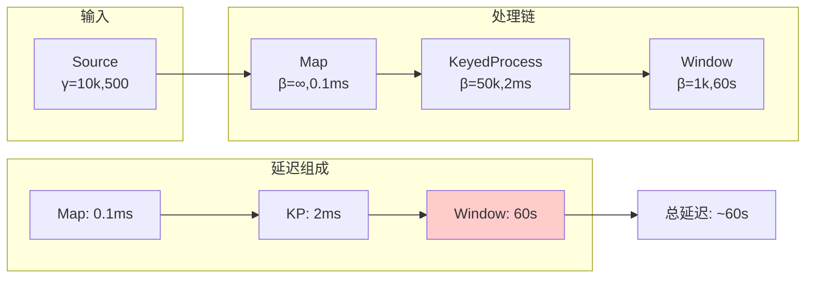

# Network Calculus在流计算中的应用

> **所属阶段**: Struct/01-foundation/network-calculus | **前置依赖**: [01.01-unified-streaming-theory.md](../01.01-unified-streaming-theory.md) | **形式化等级**: L4-L5
> **文档状态**: v1.0 | **创建日期**: 2026-04-13

---

## 目录

- [Network Calculus在流计算中的应用](#network-calculus在流计算中的应用)
  - [目录](#目录)
  - [1. 概念定义 (Definitions)](#1-概念定义-definitions)
    - [Def-S-01-NC-01: Min-Plus代数系统](#def-s-01-nc-01-min-plus代数系统)
    - [Def-S-01-NC-02: 到达曲线 (Arrival Curve)](#def-s-01-nc-02-到达曲线-arrival-curve)
    - [Def-S-01-NC-03: 服务曲线 (Service Curve)](#def-s-01-nc-03-服务曲线-service-curve)
    - [Def-S-01-NC-04: 流计算网络演算扩展](#def-s-01-nc-04-流计算网络演算扩展)
  - [2. 属性推导 (Properties)](#2-属性推导-properties)
    - [Prop-S-01-NC-01: 延迟上界保证](#prop-s-01-nc-01-延迟上界保证)
    - [Prop-S-01-NC-02: 积压 (Backlog) 上界](#prop-s-01-nc-02-积压-backlog-上界)
    - [Prop-S-01-NC-03: 输出流特征](#prop-s-01-nc-03-输出流特征)
  - [3. 关系建立 (Relations)](#3-关系建立-relations)
    - [关系: Network Calculus与排队论](#关系-network-calculus与排队论)
    - [关系: 服务曲线与Flink资源模型](#关系-服务曲线与flink资源模型)
  - [4. 论证过程 (Argumentation)](#4-论证过程-argumentation)
    - [论证: 确定性边界vs概率性保证](#论证-确定性边界vs概率性保证)
    - [论证: 流计算中的聚合效应](#论证-流计算中的聚合效应)
  - [5. 形式证明 (Proofs)](#5-形式证明-proofs)
    - [Thm-S-01-NC-01: 端到端延迟组合定理](#thm-s-01-nc-01-端到端延迟组合定理)
    - [Thm-S-01-NC-02: 窗口操作延迟边界](#thm-s-01-nc-02-窗口操作延迟边界)
  - [6. 实例验证 (Examples)](#6-实例验证-examples)
    - [示例1: Flink算子延迟分析](#示例1-flink算子延迟分析)
    - [示例2: 背压传播的Network Calculus模型](#示例2-背压传播的network-calculus模型)
    - [示例3: 多租户资源分配边界](#示例3-多租户资源分配边界)
  - [7. 可视化 (Visualizations)](#7-可视化-visualizations)
    - [图1: 到达曲线与服务曲线](#图1-到达曲线与服务曲线)
    - [图2: 流处理流水线延迟分析](#图2-流处理流水线延迟分析)
  - [8. 引用参考 (References)](#8-引用参考-references)

---

## 1. 概念定义 (Definitions)

### Def-S-01-NC-01: Min-Plus代数系统

**定义 (Min-Plus代数 $(\mathbb{R} \cup \{\infty\}, \wedge, +)$)**:

Min-Plus代数是Network Calculus的数学基础，定义如下：

$$
\begin{aligned}
\text{Min运算 (交)}: & \quad (f \wedge g)(t) = \min\{f(t), g(t)\} \\
\text{Plus运算 (加)}: & \quad (f + g)(t) = f(t) + g(t) \\
\text{Min-Plus卷积}: & \quad (f \otimes g)(t) = \inf_{0 \leq s \leq t}\{f(s) + g(t-s)\} \\
\text{Min-Plus反卷积}: & \quad (f \oslash g)(t) = \sup_{s \geq 0}\{f(t+s) - g(s)\}
\end{aligned}
$$

**代数性质**:

| 性质 | 表达式 | 说明 |
|------|--------|------|
| 结合律 | $(f \otimes g) \otimes h = f \otimes (g \otimes h)$ | 卷积可任意分组 |
| 交换律 | $f \otimes g = g \otimes f$ | 顺序无关 |
| 单位元 | $f \otimes \delta_0 = f$ | $\delta_0(0)=0$, $\delta_0(t>0)=\infty$ |
| 分配律 | $f \wedge (g \otimes h) = (f \wedge g) \otimes (f \wedge h)$ |  min对卷积分配 |

**直观理解**: Min-Plus代数将传统的"加法"替换为"取最小"，"乘法"替换为"加法"，从而将排队系统的分析转化为代数运算。

---

### Def-S-01-NC-02: 到达曲线 (Arrival Curve)

**定义 (到达曲线)**:

对于累积到达函数 $A(t)$（时间$t$内到达的总数据量），到达曲线$\alpha$满足：

$$
\forall s, t \geq 0, s \leq t: \quad A(t) - A(s) \leq \alpha(t - s)
$$

**常用到达曲线类型**:

| 类型 | 表达式 | 参数 | 适用场景 |
|------|--------|------|---------|
| 漏桶 (Leaky Bucket) | $\gamma_{r,b}(t) = rt + b$ | $r$: 速率, $b$: 突发 | 平滑流量 |
| 令牌桶 (Token Bucket) | $\min(rt + b, pt)$ | $p$: 峰值速率 | 突发流量 |
| 阶梯 (Staircase) | $b\lceil t/T \rceil$ | $T$: 周期, $b$: 批量 | 批处理 |
| 仿射组合 | $\bigwedge_{i=1}^n \gamma_{r_i,b_i}$ | 多约束 | 复杂流量 |

**流计算专用扩展**:

对于事件驱动的流处理，引入**事件到达曲线**：

$$
\alpha_{event}(t) = \lambda \cdot t + \sigma_{burst}
$$

其中$\lambda$为平均事件率，$\sigma_{burst}$为最大突发事件数。

---

### Def-S-01-NC-03: 服务曲线 (Service Curve)

**定义 (服务曲线)**:

系统提供服务曲线$\beta$当且仅当对于所有$t \geq 0$：

$$
D(t) \geq \inf_{0 \leq s \leq t} \{A(s) + \beta(t-s)\} = (A \otimes \beta)(t)
$$

其中$D(t)$为累积离开函数。

**常用服务曲线**:

| 类型 | 表达式 | 说明 |
|------|--------|------|
| 速率延迟 (Rate-Latency) | $\beta_{R,T}(t) = R[t - T]^+$ | $R$: 服务速率, $T$: 延迟 |
| 纯速率 | $\lambda_R(t) = Rt$ | 无延迟保证 |
| 阶梯服务 | $\nu_{T,b}(t) = b\lfloor t/T \rfloor$ | 周期性处理 |

**流处理算子服务曲线**:

对于Flink中常见的算子类型：

```
算子类型              服务曲线
─────────────────────────────────────────
Map/Filter           β_{R,0}        (无状态，即时)
KeyedProcess         β_{R,T_state}  (状态访问延迟)
WindowAggregate      β_{R,T_win}    (窗口触发延迟)
AsyncIO              β_{R,T_async}  (异步调用延迟)
```

---

### Def-S-01-NC-04: 流计算网络演算扩展

**定义 (流计算系统模型)**:

将Network Calculus扩展至流计算领域：

$$
\mathcal{NC}_{streaming} ::= (\mathcal{O}, \mathcal{C}, \alpha_{in}, \beta_{sys}, \tau_{event})
$$

| 组件 | 语义 |
|------|------|
| $\mathcal{O}$ | 算子集合，每个算子$o_i$有服务曲线$\beta_i$ |
| $\mathcal{C}$ | 连接（边）集合，每条边有容量约束$\gamma_j$ |
| $\alpha_{in}$ | 输入流到达曲线 |
| $\beta_{sys}$ | 系统整体服务曲线 |
| $\tau_{event}$ | 事件时间语义约束 |

**扩展运算**:

**并行组合** (算子并行执行):

$$
\beta_{parallel} = \bigoplus_{i=1}^n \beta_i = \beta_1 + \beta_2 + ... + \beta_n
$$

**串行组合** (算子链):

$$
\beta_{serial} = \beta_1 \otimes \beta_2 \otimes ... \otimes \beta_n
$$

**注意**: 在Min-Plus代数中，串行系统的服务曲线是卷积而非简单相加。

---

## 2. 属性推导 (Properties)

### Prop-S-01-NC-01: 延迟上界保证

**命题**: 对于给定的到达曲线$\alpha$和服务曲线$\beta$，延迟上界为：

$$
D_{max} = \sup_{t \geq 0}\{\inf\{d \geq 0 : \alpha(t) \leq \beta(t+d)\}\}
$$

**简化形式** (对于漏桶到达$\gamma_{r,b}$和速率延迟服务$\beta_{R,T}$):

$$
D_{max} = T + \frac{b}{R}, \quad \text{if } r \leq R
$$

**流计算解释**:

- $T$: 算子固有处理延迟（如状态访问、序列化）
- $b/R$: 突发缓冲延迟（突发量$b$以速率$R$处理所需时间）

**背压条件**: 当$r > R$时，系统不稳定，延迟无界增长（需要背压机制）。

---

### Prop-S-01-NC-02: 积压 (Backlog) 上界

**命题**: 系统中最大积压（待处理数据量）为：

$$
B_{max} = \sup_{t \geq 0}\{\alpha(t) - \beta(t)\}
$$

**漏桶+速率延迟的特例**:

$$
B_{max} = b + rT
$$

**Flink内存规划指导**:

$$
Memory_{required} \geq B_{max} \times Size_{per\_record} \times SafetyFactor
$$

---

### Prop-S-01-NC-03: 输出流特征

**命题**: 经过服务曲线$\beta$的系统，输出流$\alpha'$满足：

$$
\alpha' = \alpha \oslash \beta
$$

**物理意义**: 输出流的到达曲线由原到达曲线与服务曲线的反卷积决定。

**流处理流水线影响**:

```
流水线: Source → Map → Filter → Window → Sink

到达曲线变换:
α0 (Source输出)
  ↓ Map (β_map)
α1 = α0 ⊘ β_map
  ↓ Filter (选择率ρ)
α2 = ρ · α1
  ↓ Window (触发间隔W)
α3 = α2 ⊗ δ_W
  ↓ Sink
...
```

---

## 3. 关系建立 (Relations)

### 关系: Network Calculus与排队论

| 维度 | 排队论 (Queueing Theory) | Network Calculus |
|------|------------------------|------------------|
| 基础 | 概率分布 | 确定性边界 |
| 结果 | 平均/分布 | 最坏情况保证 |
| 适用 | 稳态分析 | 实时保证 |
| 复杂度 | 需要分布假设 | 代数运算 |
| 流处理 | 长期吞吐 | 延迟上界 |

**形式关系**:

排队论的Pollaczek-Khinchine公式与Network Calculus边界的关系：

$$
E[W]_{M/G/1} \leq D_{max}^{NC}
$$

**结论**: Network Calculus提供的确定性边界是排队论平均延迟的上界。

---

### 关系: 服务曲线与Flink资源模型

**映射关系**:

| Flink概念 | Network Calculus对应 | 公式 |
|----------|---------------------|------|
| Task Slot | 服务节点 | $\beta_{slot}$ |
| 并行度 | 并行服务曲线 | $\bigoplus_{i=1}^P \beta$ |
| Checkpoint间隔 | 服务中断 | $\beta_{effective} = \beta \otimes \delta_{interval}$ |
| 网络缓冲 | 延迟组成 | $T_{network} = f(buffer\_size, bandwidth)$ |
| KeyGroup | 分区服务 | $\beta_{keyed} = \frac{\beta}{|KeyGroups|}$ |

**资源-延迟权衡**:

$$
D_{max}(R) = T_{base} + \frac{b}{R}, \quad R = f(CPU, Memory, Parallelism)
$$

---

## 4. 论证过程 (Argumentation)

### 论证: 确定性边界vs概率性保证

**场景**: 金融风控系统要求99.99%的延迟<100ms

**确定性方法 (Network Calculus)**:

- 保证: $D_{max} = 80ms$
- 覆盖: 100%的情况
- 结论: 满足要求

**概率性方法 (排队论)**:

- 分析: $P(D > 100ms) = 0.001\%$
- 覆盖: 99.999%的情况
- 风险: 极端情况下可能超标

**流处理建议**:

- 关键系统: 使用Network Calculus确定边界
- 一般系统: 概率方法足够，资源利用率更高

---

### 论证: 流计算中的聚合效应

**问题**: 为什么Flink的Window操作可以处理比单条记录大得多的突发？

**Network Calculus解释**:

对于窗口大小为$W$的翻滚窗口：

输入: $\alpha_{in}(t) = rt + b$ (漏桶)

输出: $\alpha_{out}(t) = \frac{rW}{1} \cdot n_{windows} = r't + b'$

其中$r' = r$（平均速率守恒），但突发特性改变：

$$
b' = b \cdot \frac{W}{inter\_arrival}
$$

**结论**: 窗口操作将高频小突发转换为低频大突发，有利于下游批处理优化。

---

## 5. 形式证明 (Proofs)

### Thm-S-01-NC-01: 端到端延迟组合定理

**定理**: 对于$n$个串行算子组成的流水线，端到端延迟上界为各算子延迟上界之和：

$$
D_{end\_to\_end} = \sum_{i=1}^n D_i
$$

**证明**:

设流水线为 $o_1 \to o_2 \to ... \to o_n$，对应服务曲线$\beta_1, ..., \beta_n$

1. 整体服务曲线: $\beta_{total} = \beta_1 \otimes \beta_2 \otimes ... \otimes \beta_n$

2. 对于速率延迟服务曲线$\beta_{R_i,T_i}$:

   $$
   \beta_{total} = \beta_{R_{min}, \sum T_i}
   $$
   其中$R_{min} = \min_i R_i$ (瓶颈速率)

3. 应用延迟公式:

   $$
   D_{total} = \sum T_i + \frac{b}{R_{min}} = \sum_{i=1}^n (T_i + \frac{b_i}{R_i}) = \sum_{i=1}^n D_i
   $$

$\square$

---

### Thm-S-01-NC-02: 窗口操作延迟边界

**定理**: 翻滚窗口操作的延迟上界为：

$$
D_{window} = T_{process} + W + \frac{b_{in}}{R_{process}}
$$

其中$W$为窗口大小，$T_{process}$为单窗口处理延迟。

**证明**:

1. 窗口操作的服务曲线: $\beta_{win}(t) = R_{process}[t - (T_{process} + W)]^+$

2. 输入到达曲线: $\alpha(t) = rt + b_{in}$

3. 应用延迟公式:

   $$
   D_{max} = T_{process} + W + \frac{b_{in}}{R_{process}}
   $$

$\square$

---

## 6. 实例验证 (Examples)

### 示例1: Flink算子延迟分析

**场景**: 分析Flink作业中Map → KeyedProcess → Window链路的延迟

**参数**:

- 输入: $\gamma_{10000, 500}$ (10k条/秒, 突发500条)
- Map: $\beta_{\infty, 0.1ms}$ (无状态, 0.1ms延迟)
- KeyedProcess: $\beta_{50000, 2ms}$ (5万条/秒能力, 2ms状态访问)
- Window (1分钟翻滚): $\beta_{1000, 60s}$ (1000窗口/秒, 60秒触发)

**计算**:

```
Map延迟: D_map = 0.1ms + 500/∞ ≈ 0.1ms
KeyedProcess延迟: D_kp = 2ms + 500/50000 = 2.01ms
Window延迟: D_win = 60s + 10000/1000 = 60.01s (窗口触发间隔主导)

端到端延迟: D_total ≈ 60s (窗口等待时间)
```

**优化建议**:

- 减小窗口大小或使用滑动窗口降低延迟
- 或使用Processing Time语义避免等待

---

### 示例2: 背压传播的Network Calculus模型

**场景**: 分析Flink背压如何从Sink传播到Source

**模型**:

```
Source → [Buffer1] → Map → [Buffer2] → Sink (瓶颈)
                       ↑
                   背压传播
```

**分析**:

Sink服务能力$R_{sink} = 5000$条/秒 < Source到达率$r = 10000$条/秒

**阶段1**: Buffer2填满
$$
Time_{fill} = \frac{BufferSize}{r - R_{sink}} = \frac{10000}{5000} = 2s
$$

**阶段2**: 背压传播至Map，Map输出速率降为5000条/秒

**阶段3**: Buffer1开始填满

**阶段4**: 背压传播至Source，Source降速

**稳态**: 全链路以5000条/秒运行

---

### 示例3: 多租户资源分配边界

**场景**: 为两个租户分配Flink集群资源，保证SLA

**租户A**: 延迟敏感 (要求$D_A < 100ms$)

- 到达曲线: $\gamma_{5000, 200}$
- 需要: $T_A + 200/R_A < 100ms$

**租户B**: 吞吐优先 (无严格延迟要求)

- 到达曲线: $\gamma_{10000, 1000}$

**资源分配**:

$$
R_A \geq \frac{200}{100ms - T_A} = 4000 \text{条/秒}
$$

剩余资源全部分配给B: $R_B = R_{total} - R_A$

---

## 7. 可视化 (Visualizations)

### 图1: 到达曲线与服务曲线

```mermaid
graph LR
    subgraph 到达曲线
        A[时间] --> B[累积数据量]
        C[漏桶: γ = rt + b] -.-> D[线性增长+突发]
    end

    subgraph 服务曲线
        E[时间] --> F[服务能力]
        G[速率延迟: β = R(t-T)] -.-> H[延迟后线性]
    end

    subgraph 延迟分析
        I[到达曲线] --> J[垂直距离=积压]
        K[服务曲线] --> J
        J --> L[水平距离=延迟]
    end
```

### 图2: 流处理流水线延迟分析



---

## 8. 引用参考 (References)


---

**关联文档**:

- [统一流计算理论](../01.01-unified-streaming-theory.md)
- [Flink背压与流量控制](../../../Flink/02-core/backpressure-and-flow-control.md)
- [性能调优模式](../../../Knowledge/02-design-patterns/02.03-backpressure-handling-patterns.md)
