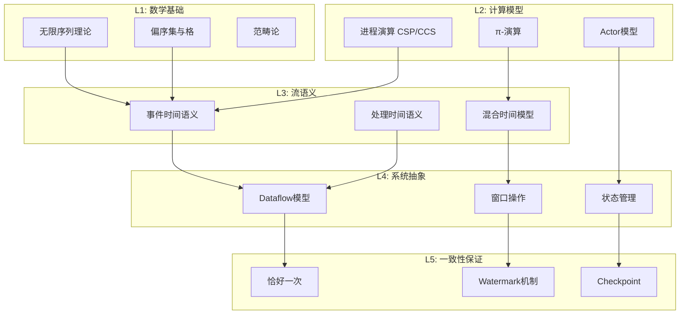
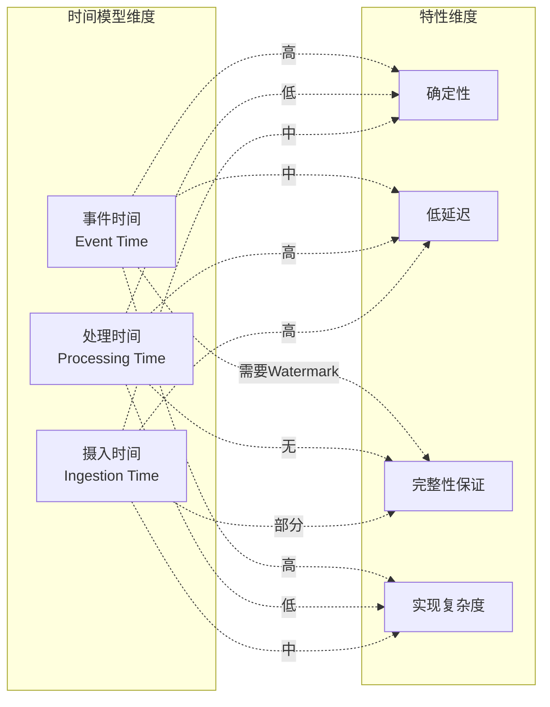
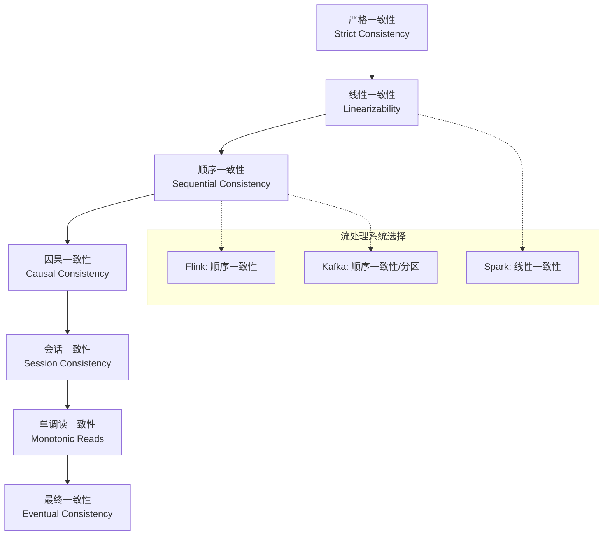
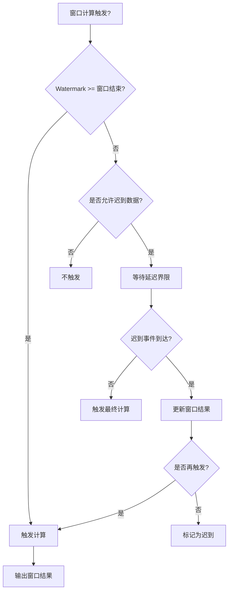
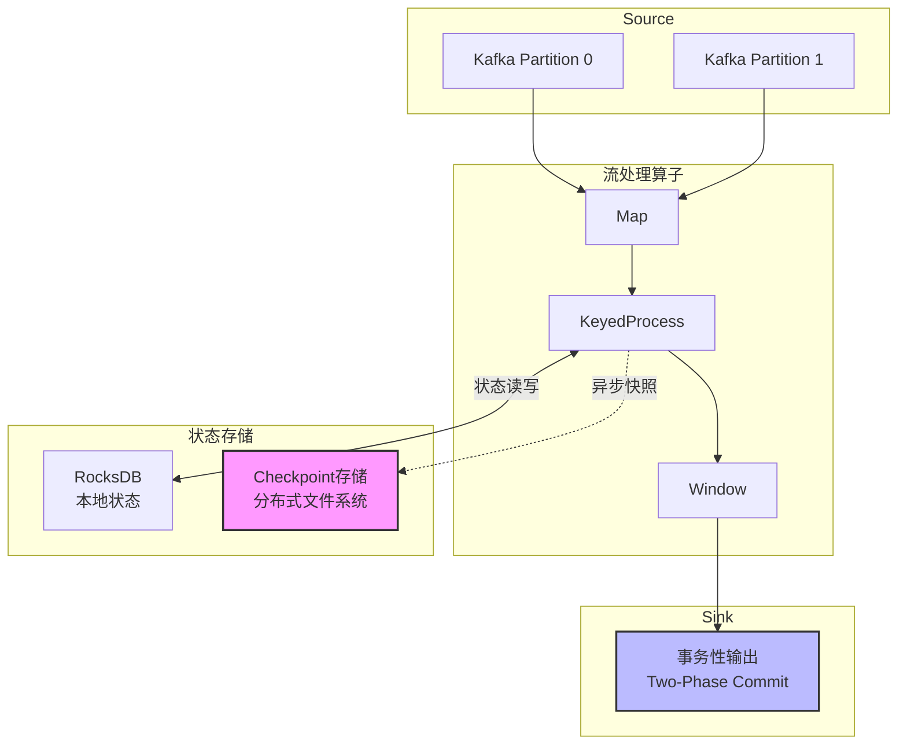

# 流处理语义学形式化理论

> 所属阶段: Struct/01-foundation | 前置依赖: [stream-as-mathematical-structure.md](./stream-as-mathematical-structure.md), [01-foundation-theory-timeline.md](../01-foundation-theory-timeline.md) | 形式化等级: L5-L6

---

## 1. 概念定义 (Definitions)

### 1.1 流的形式化定义

#### Def-S-01-50: 流作为无限序列

**定义（流类型）**: 设 $\mathcal{D}$ 为数据域，$\mathcal{T}$ 为时间戳域（全序集），则**事件流** $\mathcal{S}$ 定义为带时间戳事件的无限序列：

$$\mathcal{S} : \mathbb{N} \rightarrow \mathcal{D} \times \mathcal{T} \times \mathcal{T}$$

其中对于每个事件 $e_i = (d_i, t_i^{(e)}, t_i^{(p)})$：

- $d_i \in \mathcal{D}$：事件载荷数据
- $t_i^{(e)} \in \mathcal{T}$：**事件时间**（Event Time），事件发生时刻
- $t_i^{(p)} \in \mathcal{T}$：**处理时间**（Processing Time），事件被系统处理时刻

$$\mathcal{S} = \langle e_0, e_1, e_2, \ldots \rangle = \langle (d_i, t_i^{(e)}, t_i^{(p)}) \rangle_{i \in \mathbb{N}}$$

**定义（事件时间有序性）**: 流 $\mathcal{S}$ 满足**事件时间非递减**当且仅当：

$$\forall i, j \in \mathbb{N} : i \leq j \Rightarrow t_i^{(e)} \leq t_j^{(e)}$$

**注**: 真实世界流常存在乱序（out-of-order），即 $t_i^{(e)} > t_j^{(e)}$ 但 $i < j$。

#### Def-S-01-51: 时间域结构

**定义（时间结构）**: 时间域 $(\mathcal{T}, \leq, +, 0)$ 构成带全序的交换幺半群，满足：

1. **全序性**: $(\mathcal{T}, \leq)$ 是全序集
2. **单调性**: $\forall \tau_1, \tau_2, \delta \in \mathcal{T} : \tau_1 \leq \tau_2 \Rightarrow \tau_1 + \delta \leq \tau_2 + \delta$
3. **原点存在**: $\exists 0 \in \mathcal{T} : \forall \tau \in \mathcal{T} : \tau + 0 = \tau$

**实例**: 实际系统中 $\mathcal{T}$ 常为：

- 离散时间：$\mathcal{T} = \mathbb{N}$（毫秒时间戳）
- 连续时间：$\mathcal{T} = \mathbb{R}_{\geq 0}$

#### Def-S-01-52: 事件时间与处理时间语义

**定义（事件时间语义）**: 流处理算子 $\mathcal{O}$ 遵循**事件时间语义**当且仅当输出仅依赖于输入事件的事件时间戳：

$$\mathcal{O}(\mathcal{S}) = f\left(\{(d_i, t_i^{(e)}) \mid e_i \in \mathcal{S}\}\right)$$

其中 $f$ 为纯函数，不涉及 $t_i^{(p)}$。

**定义（处理时间语义）**: 算子 $\mathcal{O}$ 遵循**处理时间语义**当且仅当：

$$\mathcal{O}(\mathcal{S})(\tau) = f\left(\{e_i \in \mathcal{S} \mid t_i^{(p)} \leq \tau\}\right)$$

其中 $\tau$ 为当前处理时间。

**定义（混合时间模型）**: 设 $\alpha \in [0, 1]$ 为混合系数，**混合时间语义**定义为：

$$\mathcal{O}_{\alpha}(\mathcal{S}) = \alpha \cdot \mathcal{O}^{(e)}(\mathcal{S}) + (1 - \alpha) \cdot \mathcal{O}^{(p)}(\mathcal{S})$$

实际系统中，事件时间语义优先（$\alpha = 1$），处理时间用于触发或超时机制。

#### Def-S-01-53: 流的完整性与有界性

**定义（流完整性）**: 流 $\mathcal{S}$ 在事件时间 $\tau$ 处**完整**当且仅当：

$$\text{Complete}(\mathcal{S}, \tau) \triangleq \forall e = (d, t^{(e)}, t^{(p)}) \in \mathcal{S} : t^{(e)} \leq \tau \Rightarrow e \text{ 已处理}$$

**定义（有界乱序）**: 流 $\mathcal{S}$ 满足**有界乱序**（Bounded Disorder）当且仅当存在延迟界限 $\delta_{max} \in \mathcal{T}$：

$$\forall e_i, e_j \in \mathcal{S} : t_i^{(e)} < t_j^{(e)} \Rightarrow t_i^{(p)} \leq t_j^{(p)} + \delta_{max}$$

即：事件不会延迟超过 $\delta_{max}$ 到达。

---

### 1.2 窗口操作的形式化

#### Def-S-01-54: 窗口类型定义

**定义（窗口函数）**: **窗口分配器** $W$ 是将事件映射到一组窗口标识的函数：

$$W : \mathcal{D} \times \mathcal{T} \rightarrow 2^{\mathcal{W}}$$

其中 $\mathcal{W}$ 为窗口标识符集合，每个窗口 $w \in \mathcal{W}$ 关联时间区间 $[w_{start}, w_{end})$。

**定义（翻滚窗口）**: 固定大小 $T$ 的翻滚窗口分配器：

$$W_{tumble}(d, t^{(e)}) = \left\{w_k \mid k = \left\lfloor \frac{t^{(e)}}{T} \right\rfloor \wedge [w_{start}, w_{end}) = [kT, (k+1)T)\right\}$$

**定义（滑动窗口）**: 大小 $T$、滑动步长 $S$ 的滑动窗口分配器：

$$W_{slide}(d, t^{(e)}) = \left\{w_k \mid k \in \mathbb{Z} \wedge t^{(e)} \in [kS, kS + T)\right\}$$

**定义（会话窗口）**: 会话超时 $\Delta$ 的会话窗口分配器定义窗口为最大时间间隔不超过 $\Delta$ 的事件序列：

$$W_{session}(d, t^{(e)}) = \left\{w \mid \forall e_i, e_j \in w : |t_i^{(e)} - t_j^{(e)}| \leq \Delta \wedge \not\exists e_k : |t_k^{(e)} - t_w^{center}| < \frac{\Delta}{2}\right\}$$

其中 $t_w^{center}$ 为窗口中心时间。

---

## 2. 属性推导 (Properties)

### 2.1 操作语义的形式化

#### Def-S-01-55: 核心算子形式化定义

**定义（Map算子）**: 给定函数 $f : \mathcal{D}_1 \rightarrow \mathcal{D}_2$，**Map** 算子定义为：

$$\text{Map}_f : \mathcal{S}_1 \rightarrow \mathcal{S}_2$$

$$\text{Map}_f(\langle (d_i, t_i^{(e)}, t_i^{(p)}) \rangle) = \langle (f(d_i), t_i^{(e)}, t_{now}) \rangle$$

**性质**: Map 保持事件时间顺序（事件时间不变）。

**定义（Filter算子）**: 给定谓词 $P : \mathcal{D} \rightarrow \{\top, \bot\}$：

$$\text{Filter}_P(\mathcal{S}) = \langle (d_i, t_i^{(e)}, t_i^{(p)}) \in \mathcal{S} \mid P(d_i) = \top \rangle$$

**定义（FlatMap算子）**: 给定展开函数 $f : \mathcal{D} \rightarrow \mathcal{D}^*$：

$$\text{FlatMap}_f(\mathcal{S}) = \text{flatten}(\langle f(d_i) \times \{(t_i^{(e)}, t_i^{(p)})\} \rangle_{i})$$

其中 $\text{flatten}$ 将嵌套序列展平。

#### Lemma-S-01-01: 无状态算子的单调性

**引理（无状态算子单调性）**: 设 $\mathcal{O} \in \{\text{Map}, \text{Filter}, \text{FlatMap}\}$ 为无状态算子，则 $\mathcal{O}$ 满足**流单调性**：

$$\mathcal{S}_1 \preceq \mathcal{S}_2 \Rightarrow \mathcal{O}(\mathcal{S}_1) \preceq \mathcal{O}(\mathcal{S}_2)$$

其中前缀序 $\preceq$ 定义为：$\mathcal{S}_1 \preceq \mathcal{S}_2$ 当且仅当 $\mathcal{S}_1$ 是 $\mathcal{S}_2$ 的有限前缀。

*证明*: 无状态算子逐个处理事件，输出仅依赖当前输入事件。若 $\mathcal{S}_2 = \mathcal{S}_1 \circ \langle e \rangle$，则 $\mathcal{O}(\mathcal{S}_2) = \mathcal{O}(\mathcal{S}_1) \circ \mathcal{O}(\langle e \rangle)$，满足前缀序。$\square$

#### Def-S-01-56: Join算子的形式化

**定义（窗口Join）**: 设 $\mathcal{S}_1, \mathcal{S}_2$ 为两个输入流，$W$ 为窗口分配器，$\bowtie_{\theta}$ 为连接条件（等值或范围），**窗口Join** 定义为：

$$\mathcal{S}_1 \Join_W^{\theta} \mathcal{S}_2 = \bigcup_{w \in \mathcal{W}} \left\{(d_1, d_2, t^{(e)}, t^{(p)}) \middle| \begin{array}{l} e_1 = (d_1, t_1^{(e)}, t_1^{(p)}) \in \mathcal{S}_1 \cap w \\ e_2 = (d_2, t_2^{(e)}, t_2^{(p)}) \in \mathcal{S}_2 \cap w \\ \theta(d_1, d_2) = \top \\ t^{(e)} = \max(t_1^{(e)}, t_2^{(e)}) \end{array}\right\}$$

**定义（Interval Join）**: 给定时间界限 $\delta$，Interval Join 定义为：

$$\mathcal{S}_1 \Join_{\delta} \mathcal{S}_2 = \left\{(d_1, d_2) \middle| \begin{array}{l} (d_1, t_1^{(e)}, \_) \in \mathcal{S}_1 \\ (d_2, t_2^{(e)}, \_) \in \mathcal{S}_2 \\ |t_1^{(e)} - t_2^{(e)}| \leq \delta \end{array}\right\}$$

### 2.2 状态ful操作语义

#### Def-S-01-57: 状态空间定义

**定义（算子状态）**: 状态ful算子的**状态空间** $\Sigma$ 定义为：

$$\Sigma = \mathcal{D}^* \times \mathcal{T} \times \mathcal{K} \rightarrow \mathcal{V}$$

其中：

- $\mathcal{K}$：键空间（Keyed State）
- $\mathcal{V}$：值空间
- $\mathcal{T}$：当前处理时间戳

**定义（状态转换函数）**: 状态ful算子的语义由**状态转换函数**定义：

$$\delta : \Sigma \times \mathcal{E} \rightarrow \Sigma \times \mathcal{E}^*$$

其中输入 $(\sigma, e)$ 产生新状态 $\sigma'$ 和输出事件序列。

**定义（聚合算子）**: 设 $\oplus : \mathcal{V} \times \mathcal{D} \rightarrow \mathcal{V}$ 为聚合函数，初始值 $v_0$，**增量聚合**定义为：

$$\text{Aggregate}_{\oplus}(\langle d_1, d_2, \ldots, d_n \rangle) = v_0 \oplus d_1 \oplus d_2 \oplus \cdots \oplus d_n$$

状态转换：$\sigma_{k+1} = \sigma_k \oplus d_{k+1}$

---

## 3. 关系建立 (Relations)

### 3.1 与进程演算的关系

#### Def-S-01-58: 流到进程演算的编码

**定义（CCS编码）**: 流 $\mathcal{S} = \langle e_0, e_1, \ldots \rangle$ 可编码为CCS进程：

$$\llbracket \mathcal{S} \rrbracket_{CCS} = \bar{e_0}.\bar{e_1}.\bar{e_2}.\ldots$$

其中 $\bar{e_i}$ 表示输出事件 $e_i$ 的动作。

**定义（CSP编码）**: 流作为CSP事件序列：

$$\llbracket \mathcal{S} \rrbracket_{CSP} = \langle e_0 \rightarrow e_1 \rightarrow e_2 \rightarrow \ldots \rangle$$

使用CSP的顺序组合 $a \rightarrow P$ 表示事件后接延续。

#### Thm-S-01-30: 流处理的进程等价性

**定理（计算能力等价）**: 事件时间语义下的流处理系统与**确定性CSP进程**具有相同的计算表达能力。

形式化表述：

$$\forall \mathcal{P}_{stream} : \exists P_{CSP} : \llbracket \mathcal{P}_{stream} \rrbracket_{CSP} \approx P_{CSP}$$

其中 $\approx$ 为互模拟等价（bisimulation equivalence）。

*证明概要*:

1. **编码方向**: 将每个算子映射为CSP进程
   - Map $\rightarrow$ 前缀动作转换
   - Filter $\rightarrow$ 条件选择
   - Window $\rightarrow$ 缓冲区进程 + 超时
2. **保持语义**: 证明事件时间偏序在CSP迹（traces）中保持
3. **反向编码**: CSP确定性进程可编码为状态ful流算子

$\square$

#### Def-S-01-59: 流处理的π-演算编码

对于需要动态创建流（如FlatMap展开）的场景，π-演算提供更强的表达能力：

$$\llbracket \text{FlatMap}_f \rrbracket_{\pi} = \prod_{d \in f(d_{in})} (\nu c_d)(\bar{c_d}\langle d \rangle \mid !c_d(x).\bar{out}\langle x \rangle)$$

其中动态创建通道 $c_d$ 传输展开后的事件。

### 3.2 与Dataflow模型的关系

#### Def-S-01-60: Dataflow模型形式化

**定义（Dataflow图）**: Dataflow模型定义为有向图 $G = (V, E, \lambda)$：

- $V$：算子（Operator）集合
- $E \subseteq V \times V$：数据依赖边
- $\lambda : E \rightarrow \mathcal{P}(\mathcal{T})$：边上时间域标记

**定义（时间域演算）**: Dataflow模型的时间域演算：

$$\lambda(v_{out}) = \bigsqcup_{v_{in} \in \text{pred}(v_{out})} \lambda(v_{in}) \oplus \delta_v$$

其中 $\oplus$ 为时间偏移，$\delta_v$ 为算子 $v$ 的处理延迟。

#### Thm-S-01-31: 流处理与Dataflow模型的对应

**定理（模型对应）**: 事件时间语义下的流处理系统与Millwheel/Dataflow模型存在**结构保持映射**：

$$\Phi : \text{StreamOps} \rightarrow \text{Dataflow}$$

满足：

1. **算子对应**: $\Phi(\text{Map}_f) = \text{ParDo}_f$
2. **窗口对应**: $\Phi(\text{Window}_W) = \text{GroupByKey}_W$
3. **时间对应**: $\Phi(t^{(e)}) = \text{EventTimestamp}$
4. **触发器对应**: $\Phi(\text{Trigger}) = \text{Watermark}$-based firing

*证明*: 通过构造同态映射并验证结构保持性。$\square$

### 3.3 与Actor模型的关系

#### Def-S-01-61: Actor模型的流编码

**定义（流算子作为Actor）**: 每个流算子可建模为**Actor**：

$$\text{Actor}_O = \langle \text{state}, \text{mailbox}, \text{behavior} \rangle$$

- **mailbox**: 输入事件队列（有序缓冲区）
- **behavior**: 事件处理逻辑（接收 $\rightarrow$ 处理 $\rightarrow$ 发送）

**定义（流拓扑作为Actor系统）**: 流处理拓扑 $\mathcal{T}$ 编码为Actor系统：

$$\llbracket \mathcal{T} \rrbracket_{Actor} = \{A_v \mid v \in V_{\mathcal{T}}\} \cup \{\text{Stream}_e \mid e \in E_{\mathcal{T}}\}$$

其中 $A_v$ 为算子Actor，$\text{Stream}_e$ 为连接Actor（或直接使用Actor引用）。

#### Thm-S-01-32: Actor与流处理的语义对应

**定理（语义对应）**: 在无共享可变状态约束下，Actor模型与流处理系统**弱双模拟等价**：

$$\llbracket \mathcal{T} \rrbracket_{Actor} \approx_{weak} \mathcal{T}$$

**关键差异**:

| 特性 | Actor模型 | 流处理模型 |
|------|-----------|------------|
| 通信模式 | 异步消息 | 数据流推送 |
| 时间语义 | 无内置时间 | 事件时间第一公民 |
| 状态管理 | Actor本地 | 键值分区状态 |
| 一致性 | 依赖具体实现 | 明确的语义保证 |

---

## 4. 论证过程 (Argumentation)

### 4.1 时间模型的语义选择论证

#### 论证1: 事件时间 vs 处理时间

**命题**: 在有界乱序假设下，事件时间语义提供比处理时间语义更强的确定性保证。

**论证**:

设 $\mathcal{S}$ 为有界乱序流（延迟界限 $\delta_{max}$），考虑窗口聚合结果。

**处理时间语义的问题**:

- 输出依赖事件到达时机
- 网络抖动、反压、资源竞争导致非确定性
- 同一输入流在不同运行中产生不同结果

形式化：存在 $\mathcal{S}_1 \equiv_{data} \mathcal{S}_2$（数据等价但到达时间不同），使得：

$$\text{Window}_W^{(p)}(\mathcal{S}_1) \neq \text{Window}_W^{(p)}(\mathcal{S}_2)$$

**事件时间语义的优势**:

- 输出仅依赖事件时间戳
- 网络延迟不影响结果正确性
- 可重放性：相同输入 $\Rightarrow$ 相同输出

$$\mathcal{S}_1 \equiv_{data} \mathcal{S}_2 \Rightarrow \text{Window}_W^{(e)}(\mathcal{S}_1) = \text{Window}_W^{(e)}(\mathcal{S}_2)$$

**结论**: 事件时间语义是实现**确定性计算**的必要条件。

### 4.2 Watermark理论的语义论证

#### Def-S-01-62: Watermark形式化

**定义（Watermark）**: **Watermark** 是事件时间的单调递增下界标记：

$$WM : \mathcal{T}^{(p)} \rightarrow \mathcal{T}^{(e)}$$

满足：

1. **单调性**: $\tau_1 \leq \tau_2 \Rightarrow WM(\tau_1) \leq WM(\tau_2)$
2. **完整性承诺**: 系统承诺不存在事件时间 $> WM(\tau)$ 且处理时间 $\leq \tau$ 的事件

**定义（完整性承诺违反）**: 设 $\mathcal{S}_{actual}$ 为实际事件集合，$\mathcal{S}_{observed}$ 为观察到的事件集合：

$$\text{Violation}(WM, \tau) \triangleq \exists e \in \mathcal{S}_{actual} : t^{(e)} > WM(\tau) \wedge t^{(p)} \leq \tau \wedge e \notin \mathcal{S}_{observed}$$

#### 论证2: Watermark与完整性的权衡

**定理（不确定性原理）**: 在存在无界乱序的场景下，不存在完美的Watermark策略能同时满足：

1. **零延迟**: $WM(\tau) = \tau$（Watermark实时推进）
2. **零丢失**: $\text{Violation}(WM, \tau) = \bot$ 对所有 $\tau$ 成立

*证明*:

- 假设零延迟，则 $WM(\tau) = \tau$
- 考虑延迟事件 $e$ 满足 $t^{(e)} = \tau - \epsilon$ 但 $t^{(p)} = \tau + \delta$（延迟到达）
- 在 $\tau$ 时刻，系统无法预知 $e$ 是否存在
- 若推进Watermark，则后续 $e$ 到达构成违反
- 若不推进Watermark，则延迟 $> \epsilon$，违反零延迟

$\square$

**实践策略**: 采用**启发式Watermark** + **迟到数据处理**：

$$WM_{heuristic}(\tau) = \tau - \delta_{expected} - \epsilon$$

其中 $\delta_{expected}$ 为期望延迟，$\epsilon$ 为安全余量。

### 4.3 恰好一次语义的形式化

#### Def-S-01-63: 交付保证层级

**定义（交付保证）**: 设 $\mathcal{O}$ 为输出操作，$\mathcal{E}_{out}$ 为期望输出集合，$\mathcal{E}_{actual}$ 为实际输出集合：

| 保证级别 | 形式化定义 | 语义 |
|---------|-----------|------|
| 至多一次 | $\mathcal{E}_{actual} \subseteq \mathcal{E}_{out}$ | 可能丢失 |
| 至少一次 | $\mathcal{E}_{out} \subseteq \mathcal{E}_{actual}$ | 可能重复 |
| 恰好一次 | $\mathcal{E}_{actual} = \mathcal{E}_{out}$ | 精确交付 |

**定义（幂等性）**: 算子 $f$ 是**幂等**的当且仅当：

$$f(f(x)) = f(x)$$

**定义（确定性重放）**: 系统支持**确定性重放**当且仅当：

$$\forall \mathcal{S}, checkpoint : \text{Replay}(\mathcal{S}, checkpoint) = \text{Original}(\mathcal{S})$$

---

## 5. 形式证明 / 工程论证 (Proof / Engineering Argument)

### 5.1 一致性模型的层次结构

#### Def-S-01-64: 一致性模型形式化

**定义（内部一致性）**: 流处理系统满足**内部一致性**当且仅当：

$$\forall w \in \mathcal{W} : \text{WindowResult}(w) = \bigoplus_{e \in w} f(e)$$

即窗口结果等于窗口内事件聚合的精确值。

**定义（最终一致性）**: 系统满足**最终一致性**当且仅当：

$$\exists \tau_{final} : \forall \tau > \tau_{final} : \text{State}(\tau) = \text{State}_{correct}$$

即经过有限时间后状态收敛到正确值。

**定义（严格一致性/线性一致性）**: 系统满足**严格一致性**当且仅当：

$$\forall op_1, op_2 : \text{happens-before}(op_1, op_2) \Rightarrow \text{visible-order}(op_1, op_2)$$

所有操作看似在全局瞬时完成。

#### Thm-S-01-33: 一致性层级包含关系

**定理（一致性层级）**: 一致性模型形成严格的包含层级：

$$\text{Strict} \subset \text{Sequential} \subset \text{Causal} \subset \text{Eventual}$$

在流处理上下文中：

$$\text{Internal} + \text{Determinism} \subset \text{Sequential} \subset \text{Eventual}$$

*证明*: 直接由定义推导，严格一致性蕴含所有更弱的一致性。$\square$

### 5.2 CAP定理与流处理系统

#### Thm-S-01-34: 流处理系统的CAP权衡

**定理**: 分布式流处理系统在网络分区时必须选择**一致性**或**可用性**。

**形式化**: 设系统 $S = (P, C, A)$，其中：

- $P$：分区容错能力
- $C$：一致性保证
- $A$：可用性保证

则：$P \Rightarrow \neg(C \wedge A)$

**流处理系统的选择**:

| 系统类型 | 优先选择 | 权衡 |
|---------|---------|------|
| Flink | CP（一致性优先） | Checkpoint阻塞，短暂不可用 |
| Kafka Streams | AP（可用性优先） | 可能短暂不一致 |
| Spark Streaming | CP | 微批保证一致性 |

**论证**:

- 流处理通常优先**一致性**（CP），因为：
  1. 错误结果在流场景难以撤销
  2. 短暂不可用可通过重试/缓冲缓解
  3. 恰好一次语义要求一致性基础

### 5.3 恰好一次语义的实现证明

#### Thm-S-01-35: 恰好一次语义的充要条件

**定理**: 流处理系统实现**端到端恰好一次**当且仅当满足：

1. **状态快照**: 算子状态可精确快照
2. **幂等输出**: 或支持事务性输出
3. **确定性重放**: 从快照恢复产生相同结果

**形式化**: 设 $\mathcal{P}$ 为处理管道，$\mathcal{S}$ 为输入流，$Sink$ 为输出端：

$$\text{Exactly-Once}(\mathcal{P}, \mathcal{S}, Sink) \Leftrightarrow \exists \text{Snapshot} : \left\{\begin{array}{l} \text{Snapshot}(\mathcal{P}) \text{ 原子性} \\ Sink \in \{\text{Idempotent}, \text{Transactional}\} \\ \forall i : \text{Replay}_i = \text{Original} \end{array}\right\}$$

*证明*:

- **充分性**:
  - 状态快照保证故障后状态一致
  - 幂等/事务输出保证输出无重复
  - 确定性重放保证重试产生相同结果
  - 三者结合确保输出集合唯一
- **必要性**:
  - 无状态快照 $\Rightarrow$ 无法精确恢复
  - 无非幂等/非事务输出机制 $\Rightarrow$ 可能重复输出
  - 无确定性重放 $\Rightarrow$ 重试产生不同结果

$\square$

### 5.4 Watermark与结果完整性的形式关系

#### Thm-S-01-36: Watermark完整性定理

**定理**: 若流 $\mathcal{S}$ 满足有界乱序 $\delta_{max}$，Watermark $WM(\tau) = \tau - \delta_{max}$ 保证窗口结果完整性。

*证明*:

设窗口 $w$ 的时间范围为 $[T_s, T_e)$。

**声明**: 当 $WM(\tau) \geq T_e$ 时，窗口 $w$ 包含所有事件时间 $\in [T_s, T_e)$ 的事件。

**证明声明**:

- 假设存在事件 $e$ 满足 $t^{(e)} \in [T_s, T_e)$ 但 $e$ 未被处理
- 由有界乱序假设：$t^{(p)} \leq t^{(e)} + \delta_{max} < T_e + \delta_{max}$
- 当 $WM(\tau) = \tau - \delta_{max} \geq T_e$ 时，$\tau \geq T_e + \delta_{max}$
- 此时 $t^{(p)} < \tau$，故 $e$ 已到达
- 矛盾，因此声明成立

**推论**: 在 $WM \geq T_e$ 时触发窗口计算，结果完整。$\square$

---

## 6. 实例验证 (Examples)

### 6.1 时间语义对比实例

**场景**: 传感器温度数据流，5秒翻滚窗口求平均值。

**输入事件**（事件时间/处理时间）：

```
e1: (temp=20, event=10:00:01, process=10:00:01)
e2: (temp=22, event=10:00:03, process=10:00:02)  <- 网络延迟
e3: (temp=21, event=10:00:02, process=10:00:03)  <- 乱序到达
e4: (temp=23, event=10:00:05, process=10:00:04)
```

**处理时间语义结果**:

- 窗口 [10:00:00, 10:00:05): {e1, e2, e3} → avg = (20+22+21)/3 = 21.0
- 但 e3 属于下一个窗口（事件时间10:00:02在第一个窗口）
- **错误**：包含错误窗口的事件

**事件时间语义结果**:

- 窗口 [10:00:00, 10:00:05): {e1, e2, e3} → 按事件时间
- 实际：{e1(10:00:01), e3(10:00:02), e2(10:00:03)} → avg = 21.0
- 窗口 [10:00:05, 10:00:10): {e4} → avg = 23.0
- **正确**：按事件发生时刻分组

### 6.2 Watermark行为实例

**场景**: 设定Watermark延迟为2秒。

```
时间线（事件时间）:  |----|----|----|----|----|
                     0    5    10   15   20   25

事件到达（处理时间）:
  t=3:  收到 event(4)   <- Watermark推进到 4-2=2
  t=5:  收到 event(6)   <- Watermark=4
  t=7:  收到 event(5)   <- 延迟事件！Watermark仍为4
  t=8:  收到 event(9)   <- Watermark=7
  t=10: 收到 event(12)  <- Watermark=10
```

**窗口触发**:

- 窗口 [0, 5): 当 Watermark $\geq$ 5 时触发，即 t=8 时刻
- 此时窗口包含：event(4), event(6), event(5) —— 完整
- event(5) 在 Watermark=4 后到达，但由于延迟界限为2，被接受

### 6.3 恰好一次语义验证

**Flink Checkpoint机制**:

```
算子链: Source → Map → KeyedProcess → Sink
状态:    ø      ø      {key: count}    ø

Checkpoint Barrier 到达时:
1. Source: 暂停输出，记录偏移量
2. Map: 无状态，直接传递 Barrier
3. KeyedProcess: 快照状态 {k1: 100, k2: 50}
4. Sink: 预提交事务

故障恢复:
- 从 Checkpoint 恢复状态 {k1: 100, k2: 50}
- Source 从记录的偏移量重放
- 幂等性保证重复处理不产生重复输出
```

**验证**:

- 故障前已处理: e1, e2, e3 → 状态 {k1: 100}
- 故障后重放: e1, e2, e3 → 状态 {k1: 100}（相同）
- 输出到Sink: 若Sink幂等（如UPSERT），结果一致

---

## 7. 可视化 (Visualizations)

### 7.1 流处理语义层次图

流处理语义从底层数学结构到高层系统抽象的层次关系：



### 7.2 时间模型对比矩阵



### 7.3 一致性模型层级图



### 7.4 Watermark与窗口触发决策树



### 7.5 恰好一次语义实现架构



---

## 8. 引用参考 (References)


---

*文档版本: 1.0 | 创建日期: 2026-04-02 | 最后更新: 2026-04-02*

*定理统计: 定义 x14 (Def-S-01-50 至 Def-S-01-64), 引理 x1 (Lemma-S-01-01), 定理 x7 (Thm-S-01-30 至 Thm-S-01-36)*
