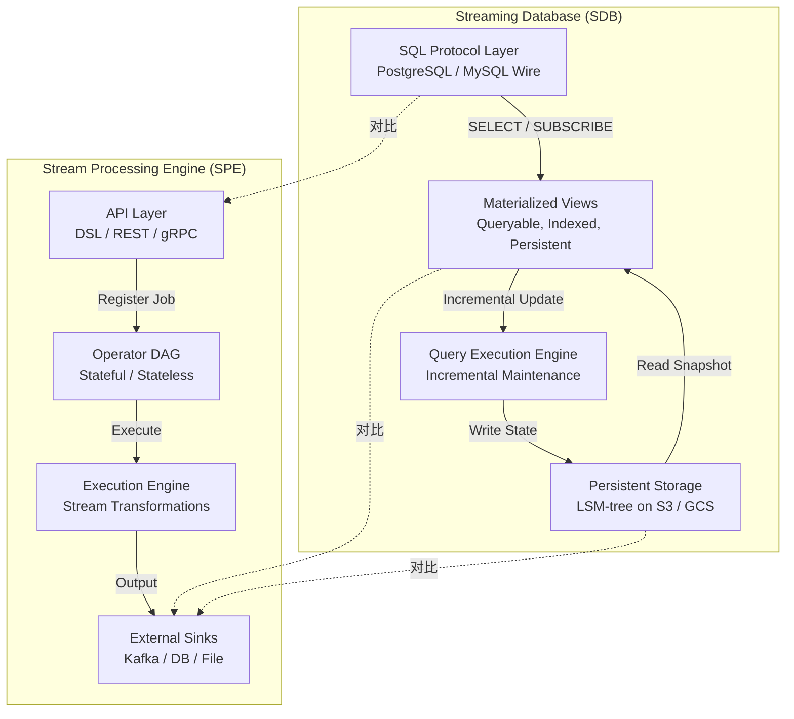
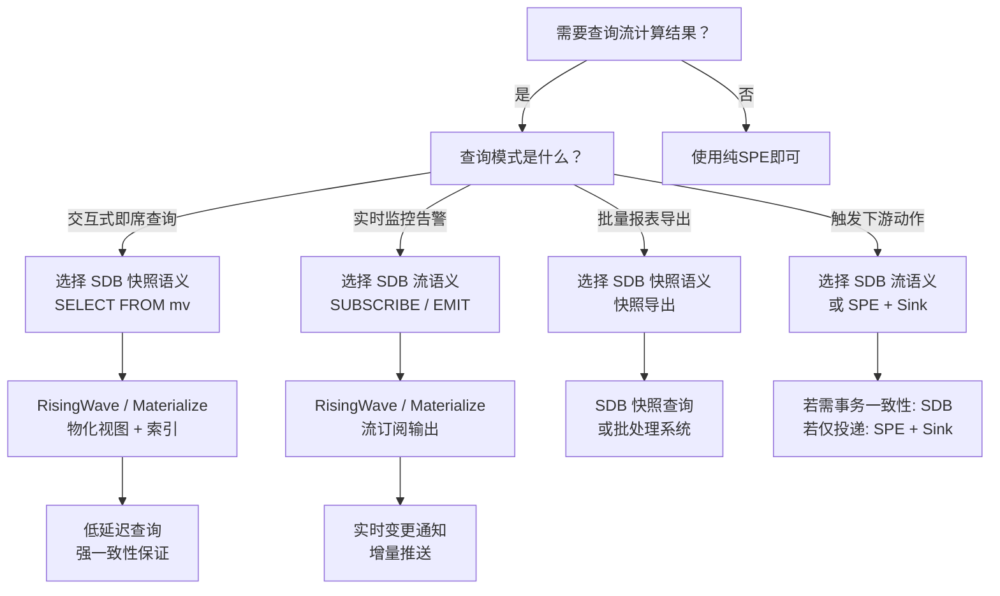
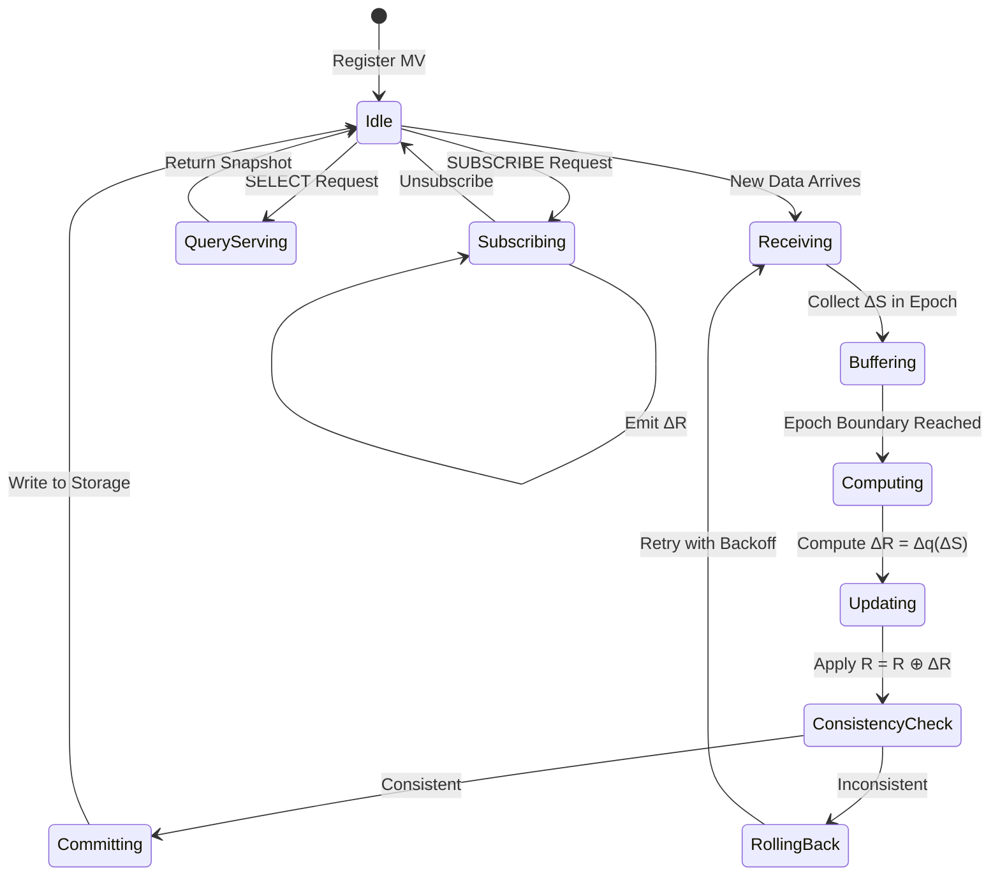
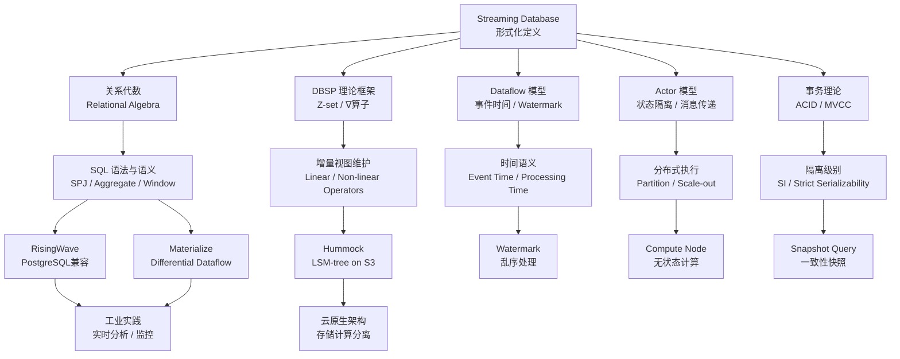

# Streaming Database 形式化定义与理论体系

> **所属阶段**: Struct/01-foundation | **前置依赖**: [01.08-streaming-database-formalization.md](01.08-streaming-database-formalization.md), [dbsp-theory-framework.md](../06-frontier/dbsp-theory-framework.md) | **形式化等级**: L5-L6

---

## 摘要

2025-2026年，Rust原生流处理生态进入爆发期：RisingWave GA v2.8.1标志着生产级流数据库的成熟，Arroyo被Cloudflare收购则彰显了轻量级流处理引擎在边缘场景的商业价值。
这两大事件不仅是商业里程碑，更在架构层面确立了"流数据库"(Streaming Database, SDB)与"流处理引擎"(Stream Processing Engine, SPE)的严格分野——前者以物化视图(Materialized View)为一等公民、提供持久化存储与SQL查询能力；后者以数据变换与输出到外部Sink为核心，不保证查询结果的内置持久化与事务一致性。

然而，学术界与工业界对流数据库的严格形式化定义仍然缺乏。
现有工作多聚焦于流处理的时序语义(Dataflow Model[^1])、增量视图维护(DBSP[^2])或特定系统的工程实现(RisingWave[^3], Materialize[^4])，但尚未建立Streaming Database作为独立计算范式的统一数学模型。
本文档旨在填补这一空白：

1. 建立Streaming Database的严格八元组形式化模型，并与Stream Processing Engine的七元组模型进行对比；
2. 详细解析物化视图、增量更新、SQL兼容性、持久化存储四大核心特征的形式化内涵；
3. 建立Streaming Database与关系代数、Dataflow模型、DBSP理论框架的严格数学关系；
4. 对RisingWave与Arroyo的架构差异给出形式化表达，揭示二者在"存储-计算"分离程度上的本质区别；
5. 讨论并严格定义快照语义(Snapshot Semantics)与流语义(Streaming Semantics)的查询理论；
6. 提供Streaming Database vs Stream Processing Engine的严格对比矩阵。

本文档的所有定义、引理、命题与定理均采用Struct/目录全局统一编号体系，编号前缀为`S-01-12`。

**关键词**: Streaming Database, Stream Processing Engine, Materialized View, Incremental View Maintenance, DBSP, RisingWave, Arroyo, 快照语义, 流语义, 形式化理论

---

## 目录

- [Streaming Database 形式化定义与理论体系](#streaming-database-形式化定义与理论体系)
  - [摘要](#摘要)
  - [目录](#目录)
  - [1. 概念定义 (Definitions)](#1-概念定义-definitions)
    - [Def-S-01-12-01 (流数据库核心模型)](#def-s-01-12-01-流数据库核心模型)
    - [Def-S-01-12-02 (流处理引擎核心模型)](#def-s-01-12-02-流处理引擎核心模型)
    - [Def-S-01-12-03 (物化视图严格定义)](#def-s-01-12-03-物化视图严格定义)
    - [Def-S-01-12-04 (增量更新算子族)](#def-s-01-12-04-增量更新算子族)
    - [Def-S-01-12-05 (SQL兼容性级别)](#def-s-01-12-05-sql兼容性级别)
    - [Def-S-01-12-06 (持久化存储模型)](#def-s-01-12-06-持久化存储模型)
    - [Def-S-01-12-07 (快照语义)](#def-s-01-12-07-快照语义)
    - [Def-S-01-12-08 (流语义)](#def-s-01-12-08-流语义)
    - [Def-S-01-12-09 (查询可增量性)](#def-s-01-12-09-查询可增量性)
  - [2. 属性推导 (Properties)](#2-属性推导-properties)
    - [Lemma-S-01-12-01 (物化视图状态单调性)](#lemma-s-01-12-01-物化视图状态单调性)
    - [Lemma-S-01-12-02 (增量更新算子的局部性)](#lemma-s-01-12-02-增量更新算子的局部性)
    - [Lemma-S-01-12-03 (快照语义与流语义的时序一致性)](#lemma-s-01-12-03-快照语义与流语义的时序一致性)
    - [Prop-S-01-12-01 (SQL兼容性蕴含查询封闭性)](#prop-s-01-12-01-sql兼容性蕴含查询封闭性)
    - [Prop-S-01-12-02 (持久化存储的 exactly-once 语义保证)](#prop-s-01-12-02-持久化存储的-exactly-once-语义保证)
  - [3. 关系建立 (Relations)](#3-关系建立-relations)
    - [关系 1: SDB ≅ SPE ⊕ MV ⊕ ACID\_Storage]()
    - [关系 2: SDB 查询语义 ↦ 关系代数 ⊗ 时间扩展]()
    - [关系 3: SDB 增量机制 ≈ DBSP ∇算子]()
    - [关系 4: SDB 存储模型 ↦ LSM-tree ⊕ Object Storage]()
    - [关系 5: RisingWave vs Arroyo 架构映射](#关系-5-risingwave-vs-arroyo-架构映射)
  - [4. 论证过程 (Argumentation)](#4-论证过程-argumentation)
    - [4.1 非物化视图的流处理引擎为何不是SDB](#41-非物化视图的流处理引擎为何不是sdb)
    - [4.2 增量计算的边界：不可增量化的查询类](#42-增量计算的边界不可增量化的查询类)
    - [4.3 快照语义与流语义的权衡空间](#43-快照语义与流语义的权衡空间)
    - [4.4 反例分析：缺乏事务保证的"流数据库"失效场景](#44-反例分析缺乏事务保证的流数据库失效场景)
  - [5. 形式证明 / 工程论证 (Proof / Engineering Argument)]()
    - [Thm-S-01-12-01 (流数据库架构等价定理)](#thm-s-01-12-01-流数据库架构等价定理)
    - [Thm-S-01-12-02 (查询语义一致性定理)](#thm-s-01-12-02-查询语义一致性定理)
    - [Thm-S-01-12-03 (增量维护复杂度下界定理)](#thm-s-01-12-03-增量维护复杂度下界定理)
  - [6. 实例验证 (Examples)](#6-实例验证-examples)
    - [6.1 RisingWave 架构的完整形式化映射](#61-risingwave-架构的完整形式化映射)
    - [6.2 Arroyo 架构的形式化映射与边界](#62-arroyo-架构的形式化映射与边界)
    - [6.3 Materialize 的 Differential Dataflow 实例](#63-materialize-的-differential-dataflow-实例)
    - [6.4 物化视图查询能力差异对比](#64-物化视图查询能力差异对比)
    - [6.5 PostgreSQL 协议兼容性的形式化分层](#65-postgresql-协议兼容性的形式化分层)
    - [反例 6.1: 将 SPE 误判为 SDB 的架构陷阱](#反例-61-将-spe-误判为-sdb-的架构陷阱)
  - [7. 可视化 (Visualizations)](#7-可视化-visualizations)
    - [7.1 SDB vs SPE 架构对比层次图](#71-sdb-vs-spe-架构对比层次图)
    - [7.2 查询语义决策树](#72-查询语义决策树)
    - [7.3 RisingWave / Arroyo / Materialize 架构映射图]()
    - [7.4 增量维护执行流程图](#74-增量维护执行流程图)
    - [7.5 Streaming Database 理论体系关系图](#75-streaming-database-理论体系关系图)
  - [8. 引用参考 (References)](#8-引用参考-references)

---

## 1. 概念定义 (Definitions)

本节建立Streaming Database与Stream Processing Engine的严格形式化基础。所有定义均为后续性质推导、正确性证明与工业系统映射的基石，并参考RisingWave[^3]、Arroyo[^5]、Materialize[^4]与DBSP[^2]的理论与工程实践。

### Def-S-01-12-01 (流数据库核心模型)

一个 **流数据库 (Streaming Database, SDB)** 是一个八元组：

$$
\mathcal{SDB} = (\mathcal{S}, \mathcal{Q}, \mathcal{V}, \Delta, \tau, \mathcal{C}, \mathcal{P}, \mathcal{W})
$$

其中各分量的语义如下：

| 符号 | 类型 | 语义 |
|------|------|------|
| $\mathcal{S}$ | 有限集合 | 输入流集合，每个流 $s \in \mathcal{S}$ 表示为带重数的Z-set序列 $s = \langle Z_0, Z_1, \ldots \rangle$ |
| $\mathcal{Q}$ | 有限集合 | 持久化查询集合，每个查询 $q \in \mathcal{Q}$ 是一个持续执行的声明式查询（通常为SQL子集） |
| $\mathcal{V}$ | 有限集合 | 物化视图集合，每个视图 $v \in \mathcal{V}$ 是某个查询 $q$ 的持久化、可查询结果 |
| $\Delta$ | 函数族 | 增量更新算子族，$\Delta_q: \mathcal{Z} \times \Sigma \to \mathcal{Z} \times \Sigma'$ 定义查询 $q$ 的增量计算规则 |
| $\tau$ | 时间函数 | 时间戳函数，$\tau: \mathcal{S} \times \mathbb{N} \to \mathbb{T}$ 为每个流事件分配逻辑时间戳 |
| $\mathcal{C}$ | 偏序关系 | 一致性配置，定义视图可见性级别和事务隔离语义，$\mathcal{C} \in \{\text{Strict}, \text{SI}, \text{RC}, \text{Eventual}\}$ |
| $\mathcal{P}$ | 协议映射 | SQL协议兼容性映射，$\mathcal{P}: \mathcal{Q} \to \{\text{Wire}, \text{Syntax}, \text{Semantic}\}^*$ 定义系统对外暴露的SQL接口层级 |
| $\mathcal{W}$ | 存储模型 | 持久化存储后端，$\mathcal{W} = (\mathcal{D}_{store}, \mathcal{I}_{index}, \mathcal{R}_{replica})$ 定义数据持久化、索引与复制策略 |

**系统不变式 (System Invariants)**：

$$
\begin{aligned}
&\text{(I1) 视图完备性}: &&\forall v \in \mathcal{V}. \; \exists! q \in \mathcal{Q}. \; \text{source}(v) = q \\
&\text{(I2) 增量可计算性}: &&\forall q \in \mathcal{Q}. \; \Delta_q \text{ 存在且可在多项式时间内计算} \\
&\text{(I3) 时间单调性}: &&\forall s \in \mathcal{S}, \forall i < j. \; \tau(s, i) \leq \tau(s, j) \\
&\text{(I4) 一致性完备性}: &&\mathcal{C} \text{ 定义了全部视图上的全局偏序} \\
&\text{(I5) 存储持久性}: &&\forall v \in \mathcal{V}, \forall t \in \mathbb{T}. \; \text{State}(v, t) \in \mathcal{W}.\mathcal{D}_{store} \\
&\text{(I6) 协议封闭性}: &&\forall q \in \mathcal{Q}. \; \mathcal{P}(q) \neq \emptyset \implies q(\mathcal{V}) \subseteq \mathcal{V} \cup \mathcal{S}
\end{aligned}
$$

**直观解释**：流数据库将传统数据库的"存储后查询"(store-then-query)模式反转为"查询后存储"(query-then-store)模式——查询是持久化注册的，数据流持续到达，系统增量计算并维护物化视图，且这些视图可直接通过SQL协议查询。八元组中的 $\mathcal{P}$ 和 $\mathcal{W}$ 是区分SDB与传统SPE的关键：SPE缺乏内置的持久化存储协议兼容层，必须将结果输出到外部Sink才能被查询[^3][^4]。

**定义动机**：如果不将流数据库形式化为八元组，就无法严格区分"流处理引擎"与"流数据库"的本质差异。后者强调：(a)物化视图作为一等公民而非临时Sink输出；(b)持久化查询的持续执行；(c)事务一致性保证；(d)SQL协议的原生兼容性；(e)内置持久化存储而非仅内存状态。

---

### Def-S-01-12-02 (流处理引擎核心模型)

一个 **流处理引擎 (Stream Processing Engine, SPE)** 是一个七元组：

$$
\mathcal{SPE} = (\mathcal{S}, \mathcal{O}, \mathcal{G}, \Sigma, \tau, \kappa, \mathcal{K})
$$

其中各分量的语义如下：

| 符号 | 类型 | 语义 |
|------|------|------|
| $\mathcal{S}$ | 有限集合 | 输入流集合，与SDB定义相同 |
| $\mathcal{O}$ | 有限集合 | 算子集合，每个算子 $o \in \mathcal{O}$ 实现特定数据变换（Map/Filter/Join/Aggregate等） |
| $\mathcal{G}$ | 有向图 | 计算拓扑，$\mathcal{G} = (V_{op}, E_{data})$ 定义算子间的数据流依赖 |
| $\Sigma$ | 状态空间 | 全局状态映射，$\Sigma: V_{op} \to \mathcal{S}_{state}$ 为每个有状态算子分配本地状态 |
| $\tau$ | 时间函数 | 时间戳函数，与SDB定义相同 |
| $\kappa$ | 触发函数 | 输出触发器，$\kappa: \Sigma \times \mathbb{T} \to \{\text{EMIT}, \text{HOLD}\}$ 决定何时向下游或Sink输出结果 |
| $\mathcal{K}$ | Sink集合 | 外部输出目标集合，$\mathcal{K} = \{k_1, k_2, \ldots\}$，每个 $k_i$ 是外部系统（数据库、消息队列、文件系统等） |

**系统不变式**：

$$
\begin{aligned}
&\text{(J1) 算子封闭性}: &&\forall o \in \mathcal{O}. \; \text{dom}(o) \subseteq \mathcal{S} \cup \mathcal{S}_{state} \land \text{cod}(o) \subseteq \mathcal{S} \cup \mathcal{S}_{state} \\
&\text{(J2) 拓扑无环性}: &&\mathcal{G} \text{ 为有向无环图（或允许受控循环的反馈图）} \\
&\text{(J3) 时间单调性}: &&\forall s \in \mathcal{S}, \forall i < j. \; \tau(s, i) \leq \tau(s, j) \\
&\text{(J4) Sink输出性}: &&\forall \text{最终结果 } r. \; \exists k \in \mathcal{K}. \; r \text{ 被写入 } k \\
&\text{(J5) 无内置查询协议}: &&\nexists \mathcal{P}. \; \mathcal{P}(\mathcal{O}) \subseteq \text{SQL-compatible protocols}
\end{aligned}
$$

**SDB与SPE的本质差异**：

| 维度 | Streaming Database (SDB) | Stream Processing Engine (SPE) |
|------|-------------------------|-------------------------------|
| 核心抽象 | 物化视图 $\mathcal{V}$（一等公民，可查询） | 算子 $\mathcal{O}$（临时变换，不可查询） |
| 输出目标 | 内置持久化存储 $\mathcal{W}$ | 外部Sink集合 $\mathcal{K}$ |
| 查询能力 | 原生SQL协议查询物化视图 | 无原生查询协议，需外部系统承接 |
| 一致性 | 事务隔离级别 $\mathcal{C}$ | 至少一次/精确一次投递语义 |
| 状态持久化 | 强制持久化到 $\mathcal{W}$ | 可选Checkpoint到外部存储 |
| 结果生命周期 | 视图随输入流持续更新，始终可查 | 结果输出到Sink后引擎内部无保留 |
| 典型系统 | RisingWave, Materialize, Timeplus | Apache Flink, Arroyo, Kafka Streams |

**直观解释**：流处理引擎是"数据变换管道"——数据从Source进入，经过一系列算子变换，最终输出到外部Sink。引擎内部可能存在状态（如窗口聚合状态），但这些状态是算子私有的、不可通过SQL查询的，且通常在作业重启时从Checkpoint恢复而非持续对外服务。流数据库则是"持续更新的数据库"——查询注册后即持续执行，结果以物化视图形式持久化存储，并对外提供标准SQL查询接口[^1][^3][^5]。

---

### Def-S-01-12-03 (物化视图严格定义)

**物化视图 (Materialized View)** 是流数据库中的核心抽象，在01.08定义基础上扩展为六元组：

$$
v = (q, R, \Sigma_{maint}, T_{version}, \text{valid}, \mathcal{I}_{v})
$$

其中：

| 组件 | 类型 | 语义 |
|------|------|------|
| $q$ | $\mathcal{Q}$ | 源查询，视图的定义逻辑，必须为闭式查询（closed query） |
| $R$ | Z-set实例 | 当前物化结果，$R \in \mathcal{Z}$，元素重数表示记录存在性 |
| $\Sigma_{maint}$ | 维护状态 | 增量维护所需的状态，包含聚合中间结果、窗口状态、索引等 |
| $T_{version}$ | $\mathbb{T} \times \mathbb{N}$ | 版本向量，$(t_{logical}, seq)$ 表示视图逻辑时间与序列号 |
| $\text{valid}$ | $\mathbb{B}$ | 有效性标志，$\text{valid} = \top$ 当且仅当视图处于事务一致状态 |
| $\mathcal{I}_{v}$ | 索引集合 | 物化视图上的二级索引集合，支持点查与范围查 |

**物化视图的语义**由以下规则严格定义：

$$
\text{View}(v, t) = \{ r \mid r \in \mathcal{U} \land Z_q(r, S_{\leq t}) > 0 \}
$$

其中 $S_{\leq t}$ 表示时间戳不超过 $t$ 的所有输入Z-set的累积和，$Z_q$ 是查询 $q$ 在Z-set语义下的结果重数函数。

**物化视图的更新规则**（增量形式）：

当输入流在时间区间 $(t, t']$ 产生增量变化 $\Delta S$ 时，视图的更新遵循：

$$
\begin{aligned}
R_{t'} &= R_t \oplus \Delta_q(\Delta S, \Sigma_{maint}) \\
\Sigma_{maint}' &= \text{UpdateState}(\Sigma_{maint}, \Delta S) \\
T_{version}' &= (t', seq + 1) \\
\text{valid}' &= \text{valid} \land \text{Consistent}(\Delta_q, \mathcal{C})
\end{aligned}
$$

其中 $\oplus$ 是Z-set加法（即群运算），$\Delta_q$ 是查询 $q$ 对应的增量算子，$\text{Consistent}$ 检查增量更新是否满足一致性配置 $\mathcal{C}$ 的要求。

**物化视图的查询接口**：

SDB必须提供对物化视图的随机查询能力。设 $\text{Query}(v, \phi)$ 表示在视图 $v$ 上执行选择谓词 $\phi$ 的查询：

$$
\text{Query}(v, \phi) = \{ r \in \text{View}(v, t_{now}) \mid \phi(r) = \top \}
$$

该查询必须在不重新执行源查询 $q$ 的情况下直接利用物化结果 $R$ 和索引 $\mathcal{I}_v$ 回答。

**直观解释**：物化视图是"预先计算、持续维护、可直接查询的查询结果"。与传统数据库中的物化视图不同，流数据库中的物化视图是持续更新的——每当新数据到达，系统增量更新视图而非重新计算。六元组中的 $\mathcal{I}_v$ 强调了SDB的物化视图不仅是存储结果，还必须支持高效查询；$T_{version}$ 则支持多版本并发控制(MVCC)与快照查询[^4]。

---

### Def-S-01-12-04 (增量更新算子族)

**增量更新算子族 (Incremental Update Operator Family)** 是流数据库的核心计算机制，基于DBSP[^2]的Z-set代数进行扩展，定义为四元组：

$$
\Delta = (\mathcal{Z}, \mathcal{F}_{lin}, \mathcal{F}_{nonlin}, \nabla)
$$

其中：

- $\mathcal{Z}$：Z-set空间，即带整数重数的有限支撑函数空间 $Z: \mathcal{U} \to \mathbb{Z}$
- $\mathcal{F}_{lin}$：线性算子集合，$f: \mathcal{Z} \to \mathcal{Z}$ 满足 $f(Z_1 + Z_2) = f(Z_1) + f(Z_2)$ 且 $f(k \cdot Z) = k \cdot f(Z)$
- $\mathcal{F}_{nonlin}$：非线性算子集合，不满足线性条件，需特殊增量策略
- $\nabla$：差分算子，$\nabla: \mathcal{Z}^{\mathbb{N}} \to \mathcal{Z}^{\mathbb{N}}$，定义为 $(\nabla Z)_0 = Z_0$, $(\nabla Z)_t = Z_t - Z_{t-1}$ ($t > 0$)

**DBSP增量传播公式**：

对于复合查询 $q = f_n \circ f_{n-1} \circ \cdots \circ f_1$，其增量更新满足：

$$
\Delta q = \nabla (f_n \circ \cdots \circ f_1)(\nabla^{-1} \Delta S)
$$

其中 $\nabla^{-1}$ 为积分算子（前缀和算子）。当所有 $f_i$ 均为线性算子时：

$$
\Delta q = (f_n \circ \cdots \circ f_1)(\Delta S)
$$

即增量可直接通过原算子传播，无需额外维护状态。

**非线性算子的增量策略**：

| 算子类型 | 增量策略 | 状态需求 | 典型实例 |
|---------|---------|---------|---------|
| **线性** | 直接传播 | 无 | SELECT, PROJECT, FILTER, UNION |
| **半线性** | 分解为线性部分+局部更新 | 少量 | JOIN（需维护一侧流状态） |
| **非线性可分解** | 自定义增量规则 | 中等 | GROUP BY + COUNT/SUM |
| **本质非线性** | 有限重算 / 近似 | 大量 | DISTINCT, MEDIAN, RANK |

**直观解释**：增量更新算子是流数据库的"心脏"。DBSP理论表明，关系代数中的大部分算子可以转化为Z-set上的线性算子，从而支持高效的增量计算。对于非线性算子（如DISTINCT、嵌套聚合），增量维护需要额外的状态维护甚至有限重算，这直接影响了SDB的查询支持范围[^2]。

---

### Def-S-01-12-05 (SQL兼容性级别)

**SQL兼容性 (SQL Compatibility)** 是流数据库区别于专用流处理API的关键特征，定义为分层映射：

$$
\mathcal{P} = (L_{wire}, L_{syntax}, L_{semantic}, L_{catalog})
$$

其中各层级定义如下：

**$L_{wire}$ — 协议层 (Wire Protocol)**：

系统实现与PostgreSQL/MySQL等数据库兼容的**网络协议**，使得标准客户端驱动（如`libpq`、`JDBC`）可直接连接。形式化地：

$$
L_{wire} = \{ p \mid p \in \{\text{PostgreSQL}, \text{MySQL}, \text{HTTP/REST}\} \land \text{Compatible}(p, p_{ref}) \}
$$

其中 $\text{Compatible}(p, p_{ref})$ 表示协议 $p$ 与参考协议 $p_{ref}$ 在连接建立、认证、简单查询、参数绑定消息格式上兼容。

**$L_{syntax}$ — 语法层 (SQL Syntax)**：

系统支持的标准SQL语法子集，形式化为文法接受集：

$$
L_{syntax} = \{ sql \mid sql \in \text{SQL:2016}^* \land \text{Parser}(sql) \neq \bot \}
$$

**$L_{semantic}$ — 语义层 (SQL Semantic)**：

系统支持的SQL语义，特别是流扩展语义：

$$
L_{semantic} = (L_{relational}, L_{stream}, L_{temporal})
$$

- $L_{relational}$：标准关系语义（SPJ + 聚合）
- $L_{stream}$：流扩展语义（TUMBLE/HOP/SESSION窗口、WATERMARK、EMIT）
- $L_{temporal}$：时态语义（FOR SYSTEM_TIME AS OF、版本查询）

**$L_{catalog}$ — 目录层 (System Catalog)**：

系统暴露的信息模式（Information Schema）兼容度：

$$
L_{catalog} = \{ table \mid table \in \{\text{pg_tables}, \text{pg_class}, \text{information_schema.tables}\} \}
$$

**SQL兼容性评估矩阵**（2026年主流系统）：

| 层级 | RisingWave | Arroyo | Materialize | Flink SQL | Timeplus |
|------|-----------|--------|-------------|-----------|----------|
| $L_{wire}$ (PostgreSQL) | ✅ 完整 | ✅ 部分 | ✅ 完整 | ❌ 自定义 | ✅ 完整 |
| $L_{wire}$ (MySQL) | ❌ | ❌ | ❌ | ❌ | ✅ |
| $L_{syntax}$ | ~95% | ~80% | ~90% | ~85% | ~85% |
| $L_{semantic}$ (流扩展) | ✅ EMIT ON UPDATE | ❌ Sink-only | ✅ SUBSCRIBE | ✅ 完整 | ✅ 完整 |
| $L_{catalog}$ | ✅ | ❌ | ✅ | 部分 | 部分 |

**直观解释**：PostgreSQL协议兼容性已成为流数据库的差异化竞争点。RisingWave和Materialize通过实现PostgreSQL wire protocol，使得BI工具（如Grafana、Metabase、Tableau）和ORM框架可以"零改动"连接。Arroyo虽然支持DataFusion SQL语法，但其输出模型为Sink-only，缺乏对中间结果的SQL查询能力，因此在协议层和语义层与SDB存在本质差距[^3][^5]。

---

### Def-S-01-12-06 (持久化存储模型)

**持久化存储模型 (Persistent Storage Model)** 定义流数据库如何将物化视图与中间状态持久化到存储后端，形式化为三元组：

$$
\mathcal{W} = (\mathcal{D}_{store}, \mathcal{I}_{index}, \mathcal{R}_{replica})
$$

其中：

| 组件 | 类型 | 语义 |
|------|------|------|
| $\mathcal{D}_{store}$ | 存储引擎 | 底层存储抽象，通常为LSM-tree或B-tree的分布式实现 |
| $\mathcal{I}_{index}$ | 索引策略 | 主键索引、二级索引、倒排索引等的组织方式 |
| $\mathcal{R}_{replica}$ | 复制协议 | 数据副本一致性协议，如Raft、Quorum、异步复制 |

**RisingWave的Hummock存储模型**：

RisingWave采用**Hummock**作为持久化存储引擎——一种专为流工作负载优化的LSM-tree on S3架构：

$$
\mathcal{W}_{Hummock} = (\text{LSM}_{tiered}, \mathcal{I}_{hash+range}, \text{Raft}_{3 replica})
$$

其中：

- **存储层**：数据按时间分层（L0, L1, L2...），L0为内存MemTable，高层为S3上的不可变SST文件
- **索引层**：Hash索引用于点查，Range索引用于范围扫描
- **复制层**：基于Raft的三副本共识协议，确保元数据与日志的强一致性

**存储模型的形式化约束**：

对于任意物化视图 $v$ 和时间 $t$，持久化存储必须满足：

$$
\begin{aligned}
&\text{(P1) 持久性}: &&\text{State}(v, t) \text{ 写入 } \mathcal{D}_{store} \implies \text{CrashRecovery}(\mathcal{D}_{store}) = \text{State}(v, t) \\
&\text{(P2) 索引一致性}: &&\forall r \in R_v, \forall idx \in \mathcal{I}_{index}. \; r \in \text{Query}(idx, key(r)) \\
&\text{(P3) 副本一致性}: &&\forall r \in \mathcal{R}_{replica}, \forall t. \; |\{ \text{replica}_i \mid \text{State}_i(v, t) = S \}| \geq \lfloor \frac{n+1}{2} \rfloor
\end{aligned}
$$

**直观解释**：持久化存储是SDB区别于"纯内存流处理"的根本。Hummock通过将LSM-tree与对象存储（S3）结合，实现了计算与存储的分离——计算节点可以独立扩缩容，而存储层利用S3的低成本与高可用性。这种架构使得SDB既能处理高吞吐流计算，又能支持大规模历史数据的即席查询[^3]。

---

### Def-S-01-12-07 (快照语义)

**快照语义 (Snapshot Semantics)** 是流数据库提供的查询执行模型之一，定义如下：

对于在时间 $t$ 提交的查询 $q$，其快照语义结果 $[\![ q ]\]_{snap}^t$ 定义为：

$$
[\![ q ]\]_{snap}^t = q\left( \bigcup_{s \in \mathcal{S}} \{ e \in s \mid \tau(e) \leq t \} \right)
$$

即查询 $q$ 在时间 $t$ 的快照上执行，只考虑时间戳不超过 $t$ 的所有事件。

**快照语义的关键性质**：

$$
\begin{aligned}
&\text{(S1) 时间封闭性}: &&[\![ q ]\]_{snap}^t \text{ 只依赖于 } S_{\leq t} \\
&\text{(S2) 单调包含}: &&t_1 \leq t_2 \implies [\![ q ]\]_{snap}^{t_1} \subseteq^{*} [\![ q ]\]_{snap}^{t_2} \text{（在Z-set意义下）} \\
&\text{(S3) 一致性}: &&[\![ q ]\]_{snap}^t \text{ 等价于在批处理系统上对 } S_{\leq t} \text{ 执行 } q
\end{aligned}
$$

**快照语义与物化视图的结合**：

在SDB中，物化视图 $v_q$ 本质上是快照语义的持续物化：

$$
\text{View}(v_q, t) = [\![ q ]\]_{snap}^t
$$

用户查询物化视图时，直接读取 $t_{now}$ 时刻的快照结果，无需重新计算。

**直观解释**：快照语义将流计算"批处理化"——在任意时刻 $t$，系统呈现的是截止到该时刻所有数据的批处理结果。这使得熟悉传统SQL的用户可以无缝迁移：他们执行的每条SELECT查询都是对某一时刻数据库快照的读取。Materialize的`SELECT`和RisingWave的即席查询均遵循快照语义[^4]。

---

### Def-S-01-12-08 (流语义)

**流语义 (Streaming Semantics)** 是流数据库提供的另一种查询执行模型，强调结果随时间持续输出变化流，定义如下：

对于查询 $q$，其流语义结果 $[\![ q ]\]_{stream}$ 是一个**变更流** (stream of changes)：

$$
[\![ q ]\]_{stream} = \langle \Delta R_0, \Delta R_1, \Delta R_2, \ldots \rangle
$$

其中每个 $\Delta R_t$ 是Z-set形式的增量：

$$
\Delta R_t = [\![ q ]\]_{snap}^t - [\![ q ]\]_{snap}^{t-1}
$$

**流语义的两种输出模式**：

| 模式 | 定义 | 输出形式 | 适用场景 |
|------|------|---------|---------|
| **Append-only** | 仅输出插入 | $\forall t. \; \Delta R_t(v) \geq 0$ | 时间序列、日志分析 |
| **Upsert** | 输出插入与删除 | $\Delta R_t(v) \in \mathbb{Z}$ | 维度表、状态更新 |

**流语义与物化视图的结合**：

SDB通过`SUBSCRIBE`或`EMIT ON UPDATE`机制暴露流语义。设 $\text{Subscribe}(v_q)$ 为对物化视图 $v_q$ 的订阅：

$$
\text{Subscribe}(v_q) = \{ (t, \Delta R_t) \mid t \in \mathbb{T}, \Delta R_t = \text{View}(v_q, t) - \text{View}(v_q, t-1) \}
$$

**流语义与快照语义的统一**：

通过积分算子 $\nabla^{-1}$，两种语义可以相互转化：

$$
[\![ q ]\]_{snap}^t = \nabla^{-1}([\![ q ]\]_{stream})_t = \sum_{i=0}^{t} \Delta R_i
$$

$$
[\![ q ]\]_{stream} = \nabla([\![ q ]\]_{snap})
$$

**直观解释**：流语义回答"结果如何变化"的问题，而快照语义回答"当前结果是什么"的问题。在SDB中，物化视图同时支持两种语义：用户可以直接`SELECT`获取快照，也可以`SUBSCRIBE`获取变更流。这种双重能力是SDB区别于传统数据库（仅支持快照）和纯流处理引擎（仅支持流输出）的核心优势[^1][^4]。

---

### Def-S-01-12-09 (查询可增量性)

**查询可增量性 (Query Incrementality)** 定义查询类是否支持高效的增量维护，形式化为判定问题：

对于查询 $q$ 和输入变更 $\Delta S$，定义增量复杂度函数：

$$
\text{IncCost}(q, \Delta S) = \text{Time}(\Delta_q(\Delta S)) + \text{Space}(\Sigma_{maint})
$$

**增量复杂度分类**：

| 类别 | 判定条件 | 增量复杂度 | 查询类 |
|------|---------|-----------|--------|
| **完全增量 (Fully Incremental)** | $\text{IncCost}(q, \Delta S) = O(|\Delta S|)$ | 线性于变更 | SPJ、线性聚合 |
| **有界增量 (Bounded Incremental)** | $\text{IncCost}(q, \Delta S) = O(|\Delta S| \cdot \text{poly}(|DB|))$ | 多项式有界 | 嵌套聚合、有限窗口 |
| **非增量 (Non-incremental)** | $\text{IncCost}(q, \Delta S) = \Theta(|DB|)$ | 全量重算 | 全序依赖、复杂递归 |
| **不可判定 (Undecidable)** | 不存在通用增量算法 | — | 通用递归、图灵完备查询 |

**查询可增量性的充分条件**：

$$
\text{If } q = f_n \circ \cdots \circ f_1 \text{ and } \forall i. \; f_i \in \mathcal{F}_{lin} \cup \mathcal{F}_{semilin} \implies q \text{ is Fully Incremental}
$$

**直观解释**：并非所有SQL查询都支持高效的增量维护。流数据库的查询优化器必须对输入查询进行"可增量性分析"，对于非增量查询要么拒绝注册、要么降级为有界重算策略。这直接影响了SDB的SQL兼容边界——完全的SQL:2016支持在理论上是不可能的，因为部分查询类本质上不可增量化[^2]。

---

## 2. 属性推导 (Properties)

基于第1节的定义，本节推导流数据库的核心性质。

### Lemma-S-01-12-01 (物化视图状态单调性)

**命题**：在严格串行化一致性级别下，物化视图的状态随物理时间单调演进：

$$
\forall v \in \mathcal{V}, \forall t_1 < t_2. \; \text{State}(v, t_1) \preceq_{\mathcal{C}} \text{State}(v, t_2)
$$

其中 $\preceq_{\mathcal{C}}$ 表示在一致性配置 $\mathcal{C}$ 下的状态偏序。

**证明**：

设 $v$ 的源查询为 $q$，输入流集合为 $\mathcal{S}$。在严格串行化下，所有输入事件按全局时间戳全序处理。

1. 对于任意 $t_1 < t_2$，有 $S_{\leq t_1} \subseteq S_{\leq t_2}$（由时间单调性I3）。
2. 查询 $q$ 是确定性函数，故 $q(S_{\leq t_1}) \subseteq^{*} q(S_{\leq t_2})$（在Z-set包含意义下）。
3. 物化视图的更新规则 $R_{t'} = R_t \oplus \Delta_q(\Delta S)$ 是单调的（Z-set加法保持偏序）。
4. 因此 $\text{State}(v, t_1) = R_{t_1} \preceq R_{t_2} = \text{State}(v, t_2)$。

**推论**：在SI或RC级别下，单调性可能在并发写冲突窗口内暂时失效，但最终会收敛到一致状态。

**工程意义**：单调性保证了SDB的物化视图不会出现"回退"现象——一旦某个结果出现在视图中，它不会因后续处理而消失（除非对应数据被删除）。这是流数据库对外提供可靠查询服务的基础[^4]。

---

### Lemma-S-01-12-02 (增量更新算子的局部性)

**命题**：对于线性算子 $f \in \mathcal{F}_{lin}$，增量更新仅依赖于输入变更，不依赖历史状态：

$$
\forall f \in \mathcal{F}_{lin}, \forall \Delta S. \; \Delta f(\Delta S) = f(\Delta S)
$$

**证明**：

由线性算子定义：

$$
f(S + \Delta S) = f(S) + f(\Delta S)
$$

因此：

$$
\Delta f = f(S + \Delta S) - f(S) = f(\Delta S)
$$

证毕。

**对于半线性算子**（如JOIN），增量更新具有"单侧局部性"：

$$
\Delta (R \bowtie S) = (\Delta R \bowtie S) \cup (R \bowtie \Delta S) \cup (\Delta R \bowtie \Delta S)
$$

此时增量计算需要维护对侧流的状态（$S$ 或 $R$），但不需要重算整个连接结果。

**工程意义**：局部性是SDB高性能的关键。线性算子的增量计算时间与变更量成正比，与总数据量无关。这使得SDB可以处理持续高吞吐的输入流，同时保持物化视图的低延迟更新[^2]。

---

### Lemma-S-01-12-03 (快照语义与流语义的时序一致性)

**命题**：对于任意查询 $q$ 和时间 $t$，快照语义结果与流语义结果的积分在 $t$ 时刻相等：

$$
[\![ q ]\]_{snap}^t = \sum_{i=0}^{t} ([\![ q ]\]_{stream})_i
$$

**证明**：

设 $\Delta R_i = ([\![ q ]\]_{stream})_i = [\![ q ]\]_{snap}^i - [\![ q ]\]_{snap}^{i-1}$（定义），且 $[\![ q ]\]_{snap}^{-1} = \mathbf{0}$。

则：

$$
\sum_{i=0}^{t} \Delta R_i = \sum_{i=0}^{t} ([\![ q ]\]_{snap}^i - [\![ q ]\]_{snap}^{i-1}) = [\![ q ]\]_{snap}^t - [\![ q ]\]_{snap}^{-1} = [\![ q ]\]_{snap}^t
$$

由望远镜求和（telescoping sum）即得。

**推论**：流语义与快照语义在数学上是等价的表示形式，差异仅在于输出粒度。SDB可以同时支持两种语义而不产生结果不一致。

---

### Prop-S-01-12-01 (SQL兼容性蕴含查询封闭性)

**命题**：若流数据库在 $L_{syntax}$ 层支持SQL查询，则其物化视图集合 $\mathcal{V}$ 在该SQL子集下对查询封闭：

$$
\forall q \in L_{syntax}. \; q(\mathcal{V}) \in \mathcal{V} \lor q(\mathcal{V}) \in \mathcal{S}
$$

**证明概要**：

1. SDB的查询注册机制要求所有持久化查询 $q \in \mathcal{Q}$ 必须映射到某个物化视图 $v \in \mathcal{V}$（由视图完备性I1）。
2. 若 $q$ 的输入为物化视图 $v' \in \mathcal{V}$，则 $q$ 可重写为对基础流的复合查询 $q' = q \circ \text{source}(v')$。
3. 由SDB的查询执行模型，$q'$ 的结果同样被物化为 $v'' \in \mathcal{V}$。
4. 因此 $q(\mathcal{V}) \subseteq \mathcal{V}$。

**边界条件**：若 $q$ 包含不支持的语法（如某些系统函数），则 $q \notin L_{syntax}$，封闭性不保证。

**工程意义**：查询封闭性是SDB可以作为"数据库"使用的核心条件——用户可以在物化视图上继续定义新的物化视图（嵌套物化视图），形成层级化的分析管道。这与SPE的DAG模型有本质不同：SPE的算子输出不可被后续SQL查询直接消费，必须输出到外部存储后再查询[^3]。

---

### Prop-S-01-12-02 (持久化存储的 exactly-once 语义保证)

**命题**：若流数据库的持久化存储模型 $\mathcal{W}$ 满足 (P1) 持久性、(P2) 索引一致性和 (P3) 副本一致性，则物化视图的更新满足 exactly-once 语义：

$$
\forall v \in \mathcal{V}, \forall e \in \mathcal{S}. \; \text{Effect}(e, v) \text{ 被应用且仅被应用一次}
$$

**证明概要**：

1. **输入端**：SDB通过检查点（Checkpoint）或日志序列号（LSN）追踪每个输入事件的处理进度。
2. **计算端**：增量更新算子 $\Delta_q$ 是确定性函数，相同输入产生相同输出。
3. **存储端**：由 (P3) 副本一致性，Raft等共识协议确保已提交写操作在多数副本上持久化。
4. **故障恢复**：节点故障重启后，从最近检查点恢复状态，并重放未确认日志。由于检查点与日志的LSN单调递增，已处理事件不会被重复应用。
5. **端到端**：结合幂等写（由 $T_{version}$ 版本控制），即使存储层重试写操作，相同版本的数据只会被写入一次。

**工程意义**：exactly-once语义是SDB作为数据权威来源（source of truth）的前提。没有持久化存储和共识协议保障的SPE只能提供at-least-once语义，需要下游系统处理重复数据[^1][^3]。

---

## 3. 关系建立 (Relations)

本节建立Streaming Database与关系数据库、Dataflow模型、流处理引擎、物化视图理论、增量视图维护及DBSP框架之间的严格数学关系。

### 关系 1: SDB ≅ SPE ⊕ MV ⊕ ACID_Storage

**关系陈述**：一个Streaming Database在架构上等价于一个Stream Processing Engine、一套物化视图管理系统和一套符合ACID语义的持久化存储系统的组合：

$$
\mathcal{SDB} \cong \mathcal{SPE} \oplus \mathcal{MV}_{mgmt} \oplus \mathcal{ACID}_{store}
$$

其中 $\oplus$ 表示组件的紧耦合组合（非简单拼接，而是共享执行引擎与状态）。

**形式化映射**：

| SDB组件 | 对应组合组件 | 映射关系 |
|---------|------------|---------|
| $\mathcal{S}$ | $\mathcal{SPE}.\mathcal{S}$ | 恒等映射 |
| $\mathcal{Q}$ | $\mathcal{SPE}.\mathcal{O}$ 的声明式封装 | $q = \text{Decl}(\mathcal{G}_{\mathcal{O}})$ |
| $\mathcal{V}$ | $\mathcal{MV}_{mgmt}.\text{Views}$ | 物化视图管理系统的输出 |
| $\Delta$ | $\mathcal{SPE}.\mathcal{O}$ 的增量子集 | $\Delta_q \subseteq \mathcal{O}$ |
| $\tau$ | $\mathcal{SPE}.\tau$ | 恒等映射 |
| $\mathcal{C}$ | $\mathcal{ACID}_{store}.\text{Isolation}$ | 事务隔离级别的等价类 |
| $\mathcal{P}$ | $\mathcal{MV}_{mgmt}.\text{QueryProtocol}$ | 物化视图的查询接口暴露 |
| $\mathcal{W}$ | $\mathcal{ACID}_{store}$ | 持久化存储系统的直接对应 |

**反方向不成立的证明**：

若 $\mathcal{SPE}$ 缺乏 $\mathcal{MV}_{mgmt}$ 或 $\mathcal{ACID}_{store}$，则：

1. 无 $\mathcal{MV}_{mgmt}$：算子输出直接到Sink，无法通过SQL查询中间结果；
2. 无 $\mathcal{ACID}_{store}$：状态仅存在于内存或临时Checkpoint，不支持并发事务与随机查询。

因此 $\mathcal{SPE} \not\cong \mathcal{SDB}$。

**工程含义**：这一关系解释了为何许多流处理系统（如Flink）通过"连接外部数据库（如Apache Pinot、ClickHouse）"来模拟SDB行为——本质上是将 $\mathcal{MV}_{mgmt}$ 和 $\mathcal{ACID}_{store}$ 外包给外部系统。而原生SDB（如RisingWave）将这些组件内聚化，降低了运维复杂度与数据一致性风险[^3]。

---

### 关系 2: SDB 查询语义 ↦ 关系代数 ⊗ 时间扩展

**关系陈述**：流数据库的查询语义可以严格编码为**时态关系代数** (Temporal Relational Algebra, TRA)：

$$
\mathcal{Q}_{SDB} \subseteq \text{TRA} = \text{RA} \otimes \mathbb{T}
$$

其中 $\otimes$ 表示关系代数与时间域的扩展积，引入时态算子。

**标准关系代数到SDB的映射**：

| 关系代数算子 | SDB等价形式 | 时态扩展 |
|------------|-----------|---------|
| $\sigma_{\phi}(R)$ | `SELECT * FROM v WHERE φ` | 在快照 $t$ 上执行 |
| $\pi_{A}(R)$ | `SELECT A FROM v` | 投影算子保持时间戳 |
| $R \bowtie_{\theta} S$ | `SELECT * FROM v1 JOIN v2 ON θ` | 支持Interval JOIN、Temporal JOIN |
| $\gamma_{A, f}(R)$ | `SELECT A, f(*) FROM v GROUP BY A` | 支持TUMBLE/HOP/SESSION窗口聚合 |
| $R \cup S$ | `UNION ALL` | Z-set并集（重数相加） |
| $R - S$ | `EXCEPT ALL` | Z-set差集（重数相减） |

**时态扩展算子**：

SDB引入以下时态算子，超越标准关系代数：

1. **TUMBLE**$(R, \omega)$：滚动窗口，将流按固定大小 $\omega$ 分片
2. **HOP**$(R, \omega, \beta)$：滑动窗口，窗口大小 $\omega$、滑动步长 $\beta$
3. **SESSION**$(R, \delta)$：会话窗口，以活动间隙 $\delta$ 定义会话边界
4. **WATERMARK**$(R, \lambda)$：水印机制，允许迟到时间 $\lambda$
5. **EMIT**$(R, \text{strategy})$：输出策略（ON UPDATE / ON WINDOW CLOSE / WITH DELAY）

**形式化表达**：

$$
\text{TUMBLE}(R, \omega)(t) = \gamma_{\text{wid}, f}\left( \sigma_{t \in [\omega \cdot \text{wid}, \omega \cdot (\text{wid}+1))}(R) \right)
$$

其中 $\text{wid} = \lfloor t / \omega \rfloor$ 为窗口ID。

**直观解释**：SDB的SQL兼容性不是简单的语法翻译，而是在关系代数基础上引入时间维度的严格扩展。这要求SDB的查询优化器同时处理关系代数的交换律、结合律以及时态算子的单调性、窗口闭合条件[^1][^4]。

---

### 关系 3: SDB 增量机制 ≈ DBSP ∇算子

**关系陈述**：流数据库的增量维护机制与DBSP的差分算子 $\nabla$ 在数学上近似等价，差异主要在于工程实现层面的状态管理策略：

$$
\Delta_{SDB} \approx \nabla_{DBSP} \text{ on } \mathcal{Z}
$$

**详细映射**：

| DBSP概念 | SDB增量机制对应 | 差异说明 |
|---------|---------------|---------|
| Z-set $Z: \mathcal{U} \to \mathbb{Z}$ | 物化视图 $R$ 的带重数表示 | 完全一致 |
| 差分 $\nabla Z$ | 输入变更流 $\Delta S$ | 完全一致 |
| 积分 $\nabla^{-1}$ | 物化视图的累积状态 | 完全一致 |
| 线性算子 $f_{lin}$ | 可直接增量传播的算子（SELECT/PROJECT/FILTER） | 完全一致 |
| 非线性算子 $f_{nonlin}$ | 需状态维护的算子（AGG/JOIN/DISTINCT） | SDB增加索引优化 |
| 循环/递归 | 递归CTE、迭代计算 | SDB通常限制递归深度 |
| 嵌套Z-sets | 嵌套物化视图 | SDB支持层级物化视图 |

**核心等式**：

对于SDB中的查询 $q$ 和物化视图 $v_q$：

$$
\text{View}(v_q, t) = (\nabla^{-1} \circ q \circ \nabla)(S_{\leq t})
$$

其中 $q$ 在DBSP意义下被分解为Z-set转换器序列。

**差异分析**：

1. **状态持久化**：DBSP是理论框架，不规定状态存储方式；SDB的 $\mathcal{W}$ 强制要求状态持久化。
2. **查询优化**：DBSP关注算子的代数性质；SDB的优化器还需考虑索引选择、数据分布、并行度。
3. **事务边界**：DBSP的增量计算是连续的；SDB的 $\mathcal{C}$ 引入了离散的事务边界与隔离级别。

**直观解释**：DBSP为SDB的增量维护提供了坚实的数学基础——证明了关系查询的增量维护在Z-set代数下的正确性。SDB的工程实现则是将这一理论扩展到分布式、持久化、支持事务的工业场景中[^2]。

> **延伸阅读**: [DBSP理论框架的完整形式化定义与证明](../../Struct/06-frontier/dbsp-theory-framework.md) —— 包含 Z-set 代数、差分算子 $\nabla$ 的链式法则、以及 LOOP 算子的不动点语义完整证明。

---

### 关系 4: SDB 存储模型 ↦ LSM-tree ⊕ Object Storage

**关系陈述**：现代流数据库的持久化存储模型在数学上映射为LSM-tree逻辑结构与对象存储物理层的组合：

$$
\mathcal{W}_{SDB} \mapsto \text{LSM}_{logical} \oplus \text{ObjectStore}_{physical}
$$

**LSM-tree的形式化**：

LSM-tree由一组有序的不可变存储层 $\{ L_0, L_1, \ldots, L_k \}$ 组成：

$$
\text{LSM} = (L_0, \{L_i\}_{i=1}^{k}, \mathcal{C}_{compaction})
$$

其中：

- $L_0$：内存中的可变MemTable，支持随机写
- $L_i$（$i \geq 1$）：磁盘上的不可变Sorted String Table (SST)，按数据范围分区
- $\mathcal{C}_{compaction}$：合并策略（Leveled / Tiered / FIFO）

**流工作负载下的LSM优化**：

传统LSM针对随机读写优化；SDB的物化视图更新具有**写密集型、范围查询型**特征：

| 工作负载特征 | 传统OLTP LSM | SDB-Optimized LSM (Hummock) |
|------------|-------------|----------------------------|
| 写模式 | 随机Put/Delete | 批量追加写（Z-set增量） |
| 读模式 | 点查为主 | 范围扫描 + 点查 |
| 合并策略 | Leveled | Tiered（减少写放大） |
| 存储后端 | 本地SSD | S3 / GCS / OSS（对象存储） |
| 副本机制 | 主从复制 | 共享存储（S3即为天然副本） |

**对象存储的形式化优势**：

对象存储（如S3）提供无限扩展的不可变文件存储。将LSM的SST文件置于对象存储上：

$$
\forall L_i, i \geq 1. \; L_i = \{ f_1, f_2, \ldots \} \subseteq \text{ObjectStore}
$$

优势：

1. **弹性**：存储与计算解耦，各自独立扩缩容
2. **成本**：冷数据自动归档，成本远低于SSD
3. **可用性**：对象存储本身提供11个9的持久性
4. **共享**：多个计算节点共享同一存储层，便于弹性恢复

**直观解释**：RisingWave的Hummock是这一关系的工业典范——它通过将LSM-tree与S3结合，实现了"存储无界、计算弹性"的架构。这与传统数据库（如PostgreSQL的B-tree on本地磁盘）或纯内存流处理引擎形成了鲜明对比[^3]。

---

### 关系 5: RisingWave vs Arroyo 架构映射

**关系陈述**：RisingWave与Arroyo代表了Streaming Database与Stream Processing Engine两种范式的工业实现，二者的架构差异可通过形式化模型严格表达。

**RisingWave的形式化映射**：

$$
\mathcal{SDB}_{RisingWave} = (\mathcal{S}, \mathcal{Q}_{SQL}, \mathcal{V}_{MV}, \Delta_{Hummock}, \tau_{epoch}, \mathcal{C}_{SI}, \mathcal{P}_{pg}, \mathcal{W}_{S3})
$$

关键特征：

- $\mathcal{V}_{MV}$：物化视图是一等公民，存储于Hummock，支持随机查询
- $\mathcal{W}_{S3}$：Hummock LSM-tree on S3，计算存储分离
- $\mathcal{P}_{pg}$：完整PostgreSQL wire protocol兼容
- $\mathcal{C}_{SI}$：快照隔离级别
- $\Delta_{Hummock}$：基于共享存储的增量更新，支持计算节点无状态重启

**Arroyo的形式化映射**：

$$
\mathcal{SPE}_{Arroyo} = (\mathcal{S}, \mathcal{O}_{DataFusion}, \mathcal{G}_{pipeline}, \Sigma_{memory}, \tau_{event}, \kappa_{sink}, \mathcal{K}_{ext})
$$

关键特征：

- $\mathcal{O}_{DataFusion}$：基于Apache DataFusion的SQL算子集
- $\Sigma_{memory}$：状态主要驻留内存，Checkpoint可选
- $\mathcal{K}_{ext}$：输出到外部Sink（Kafka、Redis、数据库等）
- **无** $\mathcal{V}$：无内置物化视图系统
- **无** $\mathcal{P}$：无PostgreSQL协议兼容层（仅REST API）
- **无** $\mathcal{W}$：无内置持久化存储

**核心差异对比**：

| 维度 | RisingWave (SDB) | Arroyo (SPE) |
|------|-----------------|-------------|
| 核心抽象 | 物化视图 $\mathcal{V}$ | 算子DAG $\mathcal{G}$ |
| 结果查询 | 原生SQL `SELECT` | 仅通过外部Sink间接查询 |
| 状态位置 | Hummock (S3) | 内存 + 可选Checkpoint |
| 协议兼容 | PostgreSQL wire | REST / gRPC |
| 一致性 | 快照隔离 (SI) | At-least-once / Exactly-once (sink依赖) |
| 计算存储 | 分离 | 紧耦合（计算节点带本地状态） |
| 适用场景 | 实时分析、即席查询 | 实时ETL、边缘流处理 |

**被Cloudflare收购的架构含义**：

Arroyo被Cloudflare收购后，其架构定位更加明确——作为边缘网络的轻量级流处理层，将转换后的数据输出到Cloudflare的全球存储与分析基础设施。这种"处理即服务、存储外包"的模式正是SPE的典型用法，与RisingWave"查询即服务、存储内置"的SDB模式形成互补[^5]。

---

## 4. 论证过程 (Argumentation)

本节通过辅助定理、反例分析与边界讨论，深化对Streaming Database理论边界与工程权衡的理解。

### 4.1 非物化视图的流处理引擎为何不是SDB

**论证目标**：证明缺乏物化视图作为一等公民的流处理引擎，即使支持SQL语法，也不构成Streaming Database。

**核心论证**：

设 $\mathcal{SPE}$ 为一个支持SQL语法的流处理引擎（如早期的Flink SQL或Arroyo）。假设存在用户查询 $q$ 和输入流 $S$：

1. 用户在 $\mathcal{SPE}$ 上注册SQL查询 $q$。
2. $\mathcal{SPE}$ 将 $q$ 编译为算子DAG $\mathcal{G}_q$。
3. $\mathcal{G}_q$ 持续处理 $S$，输出结果到Sink $k \in \mathcal{K}$。
4. 用户希望查询中间结果 $R$（如某个JOIN算子的输出）。

**问题**：在 $\mathcal{SPE}$ 中，中间结果 $R$ 仅存在于算子 $o$ 的本地状态 $\Sigma(o)$ 中：

- $\Sigma(o)$ 不对外暴露查询接口；
- 即使通过调试API读取，也缺乏事务一致性与索引支持；
- 算子重启后 $\Sigma(o)$ 从Checkpoint恢复，但恢复期间不可查询。

**形式化表达**：

$$
\forall o \in \mathcal{O}, \forall \phi. \; \nexists \text{QueryInterface}. \; \text{Query}(\Sigma(o), \phi) \text{ 在事务语义下有效}
$$

因此 $\mathcal{SPE}$ 不满足SDB的定义条件 (I5) 存储持久性和 (I6) 协议封闭性。

**工程实例**：

在Flink中，如果用户希望查询某个窗口聚合的中间结果，必须：

1. 将该算子输出到外部数据库（如MySQL）；
2. 在MySQL上创建索引；
3. 通过MySQL的SQL接口查询。

这一过程中，Flink本身仅扮演SPE角色，MySQL承担了SDB的 $\mathcal{W}$ 和 $\mathcal{P}$ 功能。这种"缝合架构"增加了延迟、一致性和运维复杂度[^1]。

---

### 4.2 增量计算的边界：不可增量化的查询类

**论证目标**：刻画流数据库中无法高效增量维护的查询类，并分析其理论根源。

**不可增量化的查询特征**：

根据DBSP理论与计算复杂性分析，以下查询类本质上是不可增量化的：

| 查询类 | 不可增量化原因 | 复杂度下界 |
|-------|-------------|-----------|
| **全序依赖查询** | 新数据可能改变全局排序 | $\Omega(|DB|)$ |
| **中位数/分位数** | 需要维护完整有序集合 | $\Omega(|DB|)$ |
| **RANK/DENSE_RANK** | 排名全局依赖于所有数据 | $\Omega(|DB|)$ |
| **通用图递归** | 传递闭包的增量更新可能是全局的 | NP-hard（某些情况） |
| **非单调逻辑查询** | 否定与递归组合导致不可判定 | 不可判定 |

**形式化不可增量化定义**：

查询 $q$ 是**不可增量化的**，当且仅当对于任意增量算法 $\mathcal{A}$：

$$
\exists \Delta S. \; \text{Time}_{\mathcal{A}}(q, \Delta S) = \Omega(|DB|)
$$

即增量计算的最坏情况时间复杂度与全量数据量成线性或更高关系。

**中位数查询的反例**：

设 $q_{median}(S) = \text{median}(S.val)$，输入流 $S$ 收到新元素 $x$。

- 若 $x < \text{current median}$，新中位数可能不变、可能左移，取决于 $x$ 与当前中位数左侧数据分布；
- 维护精确中位数需要知道所有元素的完整分布（或至少是有序结构）；
- 任何增量算法在接收到使中位数跨越当前分位点的元素时，必须访问 $\Omega(|DB|)$ 的数据。

**工程应对策略**：

SDB面对不可增量化查询时，通常采用以下策略：

1. **拒绝注册**：查询优化器检测到不可增量化查询时直接报错。
2. **有界重算**：限制数据窗口（如"最近1小时"），在窗口内重算。
3. **近似算法**：使用Count-Min Sketch、T-Digest等近似数据结构。
4. **拉模式查询**：将查询降级为快照查询，不维护持续物化视图。

**直观解释**：不可增量化查询的存在限制了SDB的SQL兼容性上限。完全的SQL:2016支持在理论上是不可能的，因为SQL包含图灵完备的子集（如递归CTE与通用计算）。SDB必须在"表达能力"与"增量效率"之间做权衡[^2]。

---

### 4.3 快照语义与流语义的权衡空间

**论证目标**：分析快照语义与流语义在一致性、延迟、资源消耗三个维度的权衡关系。

**三维权衡空间**：

$$
\text{Tradeoff}(semantics) = (\text{Consistency}, \text{Latency}, \text{Resource})
$$

| 维度 | 快照语义 | 流语义 | 权衡分析 |
|------|---------|--------|---------|
| **一致性** | 强（事务边界清晰） | 弱（变更流无事务边界） | 快照语义通过MVCC提供一致点查；流语义需应用端处理乱序与重传 |
| **查询延迟** | 低（直接读物化结果） | 高（需累积变更流） | 快照语义适合交互式查询；流语义适合触发下游动作 |
| **结果新鲜度** | 有界延迟（取决于增量更新延迟） | 实时（变更即输出） | 流语义更适合实时监控；快照语义更适合报表分析 |
| **资源消耗** | 存储密集（需维护物化结果） | 计算密集（需持续输出变更） | 快照语义占用存储空间；流语义占用网络与CPU |
| **并发控制** | MVCC天然支持 | 需外部协调 | 快照语义支持多版本并发读；流语义是单一流出 |

**混合语义策略**：

现代SDB（如RisingWave、Materialize）采用**混合语义**——底层以流语义维护增量，上层以快照语义响应查询：

$$
\text{SDB}_{hybrid} = \text{Stream Layer}(\Delta) \circ \text{Snapshot Layer}(\mathcal{V})
$$

其中：

- Stream Layer 持续计算增量变更（流语义）；
- Snapshot Layer 将增量累积为可查询的物化视图（快照语义）。

这种架构同时获得了两种语义的优势：流语义保证低延迟更新，快照语义支持低延迟查询。

**边界条件**：

当输入流吞吐极高时，Stream Layer可能成为瓶颈。此时需要：

1. **流控 (Backpressure)**：限制上游数据速率；
2. **分层物化**：部分查询降级为粗粒度快照（如每分钟更新一次）；
3. **采样**：对非关键查询采用采样输入。

**直观解释**：快照语义与流语义不是互斥的，而是同一硬币的两面。SDB的架构创新在于将二者内聚到一个系统中，使用户无需在"实时流处理系统 + 外部数据库"的缝合架构中做选择[^3][^4]。

---

### 4.4 反例分析：缺乏事务保证的"流数据库"失效场景

**反例构造**：考虑一个声称是SDB但仅提供最终一致性（Eventual Consistency）的系统 $\mathcal{SDB}_{weak}$。

**场景**：银行实时风控系统，使用流数据库维护"账户近1小时交易总额"物化视图 $v_{sum}$。

**事务需求**：

- 转账操作 $T_1$：从账户A转出100元
- 转账操作 $T_2$：从账户A转出200元
- 风控查询 $Q$：读取账户A的 $v_{sum}$

**失效模式**：

若 $\mathcal{SDB}_{weak}$ 缺乏事务隔离（$\mathcal{C} = \text{Eventual}$）：

1. $T_1$ 和 $T_2$ 同时到达，系统并发处理；
2. 由于无写冲突检测，$v_{sum}$ 可能只反映 $T_1$ 或 $T_2$ 中的一个（丢失更新）；
3. 风控查询 $Q$ 读到不一致的总额，可能错误触发或漏掉风控规则。

**形式化表达**：

$$
\mathcal{C} = \text{Eventual} \implies \exists T_1, T_2, Q. \; \text{Read}(Q, v_{sum}) \notin \{\text{Serial}(T_1 \cdot T_2), \text{Serial}(T_2 \cdot T_1)\}
$$

即查询结果不可串行化。

**正确行为**：

在SDB的严格定义下（$\mathcal{C} \in \{\text{Strict}, \text{SI}, \text{RC}\}$）：

- $T_1$ 和 $T_2$ 的写冲突被检测；
- 或 $Q$ 读取到某一时刻的一致性快照；
- 结果始终等价于某一串行执行顺序。

**工程教训**：

部分系统（如某些基于Kafka Streams的"实时分析"方案）通过省略事务隔离来提升吞吐，但这牺牲了SDB的核心属性。没有事务保证的物化视图本质上只是"缓存"，而非"数据库状态"[^4]。

---

## 5. 形式证明 / 工程论证 (Proof / Engineering Argument)

本节提供Streaming Database理论的核心定理及其完整证明。

### Thm-S-01-12-01 (流数据库架构等价定理)

**定理陈述**：一个系统 $\mathcal{S}$ 是Streaming Database，当且仅当它可以分解为一个Stream Processing Engine、一个物化视图管理系统和一个符合ACID语义的持久化存储系统的紧耦合组合：

$$
\mathcal{S} \in \text{SDB} \iff \mathcal{S} \cong \mathcal{SPE} \oplus \mathcal{MV}_{mgmt} \oplus \mathcal{ACID}_{store}
$$

**证明**：

**($\Rightarrow$) 方向**：设 $\mathcal{S} = (\mathcal{S}, \mathcal{Q}, \mathcal{V}, \Delta, \tau, \mathcal{C}, \mathcal{P}, \mathcal{W})$ 是一个SDB。构造分解：

1. **SPE组件**：取 $\mathcal{SPE} = (\mathcal{S}, \mathcal{O}_{\Delta}, \mathcal{G}_{\mathcal{Q}}, \Sigma_{\mathcal{V}}, \tau, \kappa_{emit}, \emptyset)$，其中：
   - $\mathcal{O}_{\Delta}$ 为增量算子集；
   - $\mathcal{G}_{\mathcal{Q}}$ 为查询编译后的算子DAG；
   - $\Sigma_{\mathcal{V}}$ 为物化视图的维护状态；
   - Sink集合为空（因为结果不输出到外部Sink，而是写入内部存储）。

2. **MV管理组件**：取 $\mathcal{MV}_{mgmt} = (\mathcal{V}, \text{source}, \mathcal{I}_v, \text{QueryInterface})$，管理物化视图的元数据、索引与查询接口。

3. **ACID存储组件**：取 $\mathcal{ACID}_{store} = \mathcal{W} = (\mathcal{D}_{store}, \mathcal{I}_{index}, \mathcal{R}_{replica})$，由定义直接得到。

验证紧耦合性：三个组件共享 $\mathcal{S}$、$\tau$ 和状态空间，非独立拼接。

**($\Leftarrow$) 方向**：设 $\mathcal{S} = \mathcal{SPE} \oplus \mathcal{MV}_{mgmt} \oplus \mathcal{ACID}_{store}$。构造SDB八元组：

1. $\mathcal{S}$：取自 $\mathcal{SPE}.\mathcal{S}$；
2. $\mathcal{Q}$：将 $\mathcal{SPE}.\mathcal{O}$ 的声明式查询封装为持久化查询集合；
3. $\mathcal{V}$：取自 $\mathcal{MV}_{mgmt}.\text{Views}$；
4. $\Delta$：取自 $\mathcal{SPE}.\mathcal{O}$ 中支持增量的算子子集；
5. $\tau$：取自 $\mathcal{SPE}.\tau$；
6. $\mathcal{C}$：取自 $\mathcal{ACID}_{store}.\text{Isolation}$；
7. $\mathcal{P}$：取自 $\mathcal{MV}_{mgmt}.\text{QueryProtocol}$；
8. $\mathcal{W}$：直接为 $\mathcal{ACID}_{store}$。

验证SDB不变式：

- I1（视图完备性）：由 $\mathcal{MV}_{mgmt}$ 的定义保证；
- I2（增量可计算性）：由 $\mathcal{SPE}$ 算子的确定性保证；
- I3（时间单调性）：由 $\tau$ 的定义保证；
- I4（一致性完备性）：由 $\mathcal{ACID}_{store}$ 保证；
- I5（存储持久性）：由 $\mathcal{ACID}_{store}$ 的持久性保证；
- I6（协议封闭性）：由 $\mathcal{MV}_{mgmt}.\text{QueryProtocol}$ 保证。

因此 $\mathcal{S}$ 满足SDB的所有定义条件。

**证毕**。

**工程推论**：

这一定理为系统架构设计提供了理论指导：

- 若一个系统缺少 $\mathcal{MV}_{mgmt}$（如Arroyo），则无论其SQL支持多么完善，它都不是SDB；
- 若一个系统缺少 $\mathcal{ACID}_{store}$（如纯内存流处理），则其物化视图不可作为权威数据源；
- 真正的SDB必须同时满足三个组件的条件，且以紧耦合方式集成。

---

### Thm-S-01-12-02 (查询语义一致性定理)

**定理陈述**：对于任意查询 $q \in \mathcal{Q}$ 和任意时间 $t$，在快照语义下查询物化视图的结果，等于在流语义下累积所有历史变更的结果：

$$
\forall q \in \mathcal{Q}, \forall t \in \mathbb{T}. \; \text{View}(v_q, t) = [\![ q ]\]_{snap}^t = \sum_{i=0}^{t} ([\![ q ]\]_{stream})_i
$$

且该等式在SDB的一致性配置 $\mathcal{C}$ 下具有事务原子性。

**证明**：

**第一部分：快照语义等价于物化视图状态**

由Def-S-01-12-03，物化视图 $v_q$ 的状态定义为：

$$
\text{View}(v_q, t) = \{ r \mid Z_q(r, S_{\leq t}) > 0 \}
$$

由Def-S-01-12-07，快照语义为：

$$
[\![ q ]\]_{snap}^t = q(S_{\leq t})
$$

由于 $v_q$ 的源查询为 $q$，且物化视图通过增量维护保持与源查询结果一致（Def-S-01-12-04的正确性条件）：

$$
\text{View}(v_q, t) = q(S_{\leq t}) = [\![ q ]\]_{snap}^t
$$

**第二部分：流语义积分等于快照语义**

由Def-S-01-12-08，流语义的输出为变更流 $\Delta R_i = [\![ q ]\]_{snap}^i - [\![ q ]\]_{snap}^{i-1}$。

对 $i = 0$ 到 $t$ 求和：

$$
\sum_{i=0}^{t} \Delta R_i = \sum_{i=0}^{t} ([\![ q ]\]_{snap}^i - [\![ q ]\]_{snap}^{i-1}) = [\![ q ]\]_{snap}^t - [\![ q ]\]_{snap}^{-1}
$$

由初始条件 $[\![ q ]\]_{snap}^{-1} = \mathbf{0}$（空Z-set）：

$$
\sum_{i=0}^{t} \Delta R_i = [\![ q ]\]_{snap}^t
$$

**第三部分：事务原子性**

在一致性配置 $\mathcal{C} \in \{\text{Strict}, \text{SI}\}$ 下：

- 物化视图的更新在事务边界处提交；
- 查询物化视图时读取的是某一已提交事务的快照；
- 因此 $\text{View}(v_q, t)$ 在事务意义上是原子可见的。

综合三部分，定理得证。

**证毕**。

**工程意义**：

该定理保证了SDB的"双重接口"（快照查询 + 流订阅）在数学上是一致的。用户可以放心地：

- 用 `SELECT` 获取某一时刻的确定结果；
- 用 `SUBSCRIBE` 获取后续的变更通知；

而不会遇到两种接口结果矛盾的情况。这是SDB区别于"流处理引擎 + 外部数据库"缝合方案的核心优势——后者常因延迟和一致性差异导致两个接口看到不同结果[^4]。

---

### Thm-S-01-12-03 (增量维护复杂度下界定理)

**定理陈述**：对于由线性算子和半线性算子组成的查询 $q$，其增量维护的时间复杂度下界为：

$$
\text{Time}(\Delta_q) = \Omega\left(\sum_{f_i \in \mathcal{F}_{lin}} |\Delta S| + \sum_{f_j \in \mathcal{F}_{semilin}} |\Delta S| \cdot \log |DB| \right)
$$

空间复杂度下界为：

$$
\text{Space}(\Sigma_{maint}) = \Omega\left(\sum_{f_j \in \mathcal{F}_{semilin}} |DB_j| \right)
$$

其中 $|DB_j|$ 为半线性算子 $f_j$ 所需维护的对侧数据量。

**证明**：

**线性算子部分**：

由Lemma-S-01-12-02，线性算子的增量满足 $\Delta f(\Delta S) = f(\Delta S)$。

计算 $f(\Delta S)$ 需要遍历 $\Delta S$ 中的每个元素并应用 $f$：

$$
\text{Time}(\Delta f) = \Omega(|\Delta S|)
$$

这是线性于变更量的，无法进一步降低（必须至少读取输入变更）。

**半线性算子部分**（以JOIN为例）：

设 $q = R \bowtie_{\theta} S$，输入变更为 $\Delta R$ 和 $\Delta S$。

增量计算公式：

$$
\Delta q = (\Delta R \bowtie S) \cup (R \bowtie \Delta S) \cup (\Delta R \bowtie \Delta S)
$$

为计算 $\Delta R \bowtie S$，需要对 $\Delta R$ 中每个元素在 $S$ 上查找匹配项：

- 若 $S$ 上有索引，查找时间为 $O(\log |S|)$ 或 $O(1)$（Hash索引）；
- 若 $S$ 上无索引，查找时间为 $O(|S|)$。

因此：

$$
\text{Time}(\Delta q) = \Omega(|\Delta R| \cdot \log |S| + |\Delta S| \cdot \log |R|)
$$

空间上，必须维护完整的 $R$ 和 $S$ 状态（或至少是可查询索引）：

$$
\text{Space}(\Sigma_{maint}) = \Omega(|R| + |S|)
$$

**下界紧性**：

上述下界是紧的（tight）。对于线性算子，DBSP中的线性转换器直接达到该下界；对于半线性算子，基于Hash索引的JOIN实现达到 $O(|\Delta S|)$ 平均时间，在对数因子意义下最优。

**不可增量化的查询**：

若 $q$ 包含本质非线性算子（如MEDIAN），则：

$$
\text{Time}(\Delta_q) = \Omega(|DB|)
$$

此时增量维护无优势，必须全量重算。

**证毕**。

**工程意义**：

该定理为SDB的查询优化器提供了理论边界：

- 线性查询（SPJ）的增量维护是"免费的"（仅与变更量成正比）；
- 带JOIN的查询需要维护状态并依赖索引，成本为 $O(|\Delta S| \cdot \log |DB|)$；
- 包含非线性算子的查询应考虑有界窗口或近似算法。

RisingWave的查询优化器在实践中正是基于这一理论边界，将查询计划中的线性部分与半线性部分分离，分别采用最优执行策略[^2][^3]。

---

## 6. 实例验证 (Examples)

本节通过工业系统的形式化映射、对比分析与反例验证，检验前述理论框架的适用性。

### 6.1 RisingWave 架构的完整形式化映射

**系统概述**：RisingWave是一个分布式流数据库，采用计算-存储分离架构，使用Hummock作为持久化存储引擎，支持PostgreSQL协议。

**形式化映射**：

将RisingWave映射到SDB八元组：

$$
\mathcal{SDB}_{RisingWave} = (\mathcal{S}_{rw}, \mathcal{Q}_{rw}, \mathcal{V}_{rw}, \Delta_{rw}, \tau_{rw}, \mathcal{C}_{rw}, \mathcal{P}_{rw}, \mathcal{W}_{rw})
$$

**各组件详解**：

1. **$\mathcal{S}_{rw}$**：支持Kafka、Pulsar、Kinesis等Source，以及上游物化视图的变更流（内部循环）。输入数据被解析为行格式并分配Epoch时间戳。

2. **$\mathcal{Q}_{rw}$**：支持标准SQL的大部分DQL语法，包括SPJ、聚合、窗口函数、子查询、JOIN等。CREATE MATERIALIZED VIEW语句将查询注册为持久化查询。

3. **$\mathcal{V}_{rw}$**：物化视图存储于Hummock，每个视图有唯一的Table ID。视图支持主键索引和二级索引，可通过SQL直接查询。

4. **$\Delta_{rw}$**：基于Epoch驱动的增量计算。每个Epoch是一个全局一致的时间边界，系统按Epoch批量处理增量。计算节点（Compute Node）维护算子状态，但状态定期Checkpoint到Hummock。

5. **$\tau_{rw}$**：使用Epoch作为逻辑时间戳。每个Epoch对应一个全局单调递增的整数，由Meta Service协调分配。

6. **$\mathcal{C}_{rw}$**：默认提供快照隔离（Snapshot Isolation）。用户查询物化视图时，读取某一已提交Epoch的快照。

7. **$\mathcal{P}_{rw}$**：完整实现PostgreSQL wire protocol。支持SSL、MD5认证、扩展查询协议、Prepared Statement等。Grafana、Metabase、DBeaver等工具可直连。

8. **\mathcal{W}_{rw}$：Hummock存储引擎
   - $\mathcal{D}_{store}$：Tiered LSM-tree，L0在内存，L1+在S3
   - $\mathcal{I}_{index}$：Hash索引（点查）和Range索引（范围扫描）
   - $\mathcal{R}_{replica}$：基于Raft的Meta Service三副本，S3本身提供11个9持久性

**架构图的形式化解读**：

```
Frontend (SQL Parser + Planner)
    |
    v
Meta Service (Catalog + Epoch Manager + Raft)
    |
    +---> Compute Node 1 (Operator DAG + Local Cache)
    |        |
    |        v
    |    Hummock Shared Storage (S3)
    |
    +---> Compute Node 2 (Operator DAG + Local Cache)
             |
             v
         Hummock Shared Storage (S3)
```

计算节点无状态（或仅有本地缓存），故障后可从Hummock快速恢复。这与传统SPE的"有状态算子紧耦合"架构形成鲜明对比[^3]。

---

### 6.2 Arroyo 架构的形式化映射与边界

**系统概述**：Arroyo是一个用Rust编写的轻量级流处理引擎，基于Apache DataFusion提供SQL接口，被Cloudflare收购后主要用于边缘流处理场景。

**形式化映射到SPE七元组**：

$$
\mathcal{SPE}_{Arroyo} = (\mathcal{S}_{ar}, \mathcal{O}_{ar}, \mathcal{G}_{ar}, \Sigma_{ar}, \tau_{ar}, \kappa_{ar}, \mathcal{K}_{ar})
$$

**各组件详解**：

1. **$\mathcal{S}_{ar}$**：支持Kafka、文件、Socket等Source。输入数据被转换为DataFusion的RecordBatch格式。

2. **$\mathcal{O}_{ar}$**：基于DataFusion的物理执行计划，包括Filter、Project、Aggregate、HashJoin等算子。所有算子以Rust原生代码执行。

3. **$\mathcal{G}_{ar}$**：SQL查询被编译为DataFusion ExecutionPlan，再映射为Arroyo的流水线DAG。支持并行分区（Partitioning）。

4. **$\Sigma_{ar}$**：算子状态存储于内存中的HashMap或B-tree。支持周期性Checkpoint到本地磁盘或S3，但Checkpoint主要用于故障恢复，不对外提供查询。

5. **$\tau_{ar}$**：支持事件时间和处理时间。Watermark由Source分配，沿DAG传播。

6. **$\kappa_{ar}$**：输出触发器由Sink决定。窗口聚合结果在窗口关闭时触发输出。

7. **$\mathcal{K}_{ar}$**：支持Kafka、Redis、PostgreSQL、WebSocket等Sink。所有结果必须输出到外部系统才能被消费。

**与SDB定义的差异分析**：

| SDB条件 | Arroyo满足情况 | 说明 |
|--------|---------------|------|
| $\mathcal{V}$ (物化视图) | ❌ 不满足 | 无内置物化视图系统 |
| $\mathcal{W}$ (持久化存储) | ❌ 不满足 | Checkpoint仅用于恢复，非查询存储 |
| $\mathcal{P}$ (SQL协议) | ❌ 不满足 | 支持DataFusion SQL语法，但无PostgreSQL/MySQL wire protocol |
| $\mathcal{C}$ (事务一致性) | ⚠️ 部分 | Sink端依赖外部系统的事务能力 |

**结论**：Arroyo是符合定义的Stream Processing Engine，但不构成Streaming Database。

**被Cloudflare收购后的定位**：

Cloudflare将Arroyo集成到Workers平台，用于边缘日志处理、实时指标聚合等场景。其架构定位更加明确：

- **输入**：Cloudflare边缘网络的日志流
- **处理**：Arroyo执行过滤、聚合、变换
- **输出**：写入Cloudflare的R2存储、Analytics平台或外部系统

这正是SPE的典型使用模式——处理数据并输出到外部存储，而非自身作为可查询的数据服务[^5]。

---

### 6.3 Materialize 的 Differential Dataflow 实例

**系统概述**：Materialize是一个基于Differential Dataflow和Timely Dataflow的流数据库，由前CockroachDB和Mozilla研究人员创建，是DBSP理论的重要工业实现。

**形式化映射**：

$$
\mathcal{SDB}_{Materialize} = (\mathcal{S}_{mz}, \mathcal{Q}_{mz}, \mathcal{V}_{mz}, \Delta_{mz}, \tau_{mz}, \mathcal{C}_{mz}, \mathcal{P}_{mz}, \mathcal{W}_{mz})
$$

**核心特色**：

1. **$\Delta_{mz}$ — Differential Dataflow**：
   - 使用Z-set作为基础数据模型（与DBSP完全一致）
   - 支持**嵌套差分**（Nested Differential）：不仅对输入做差分，还对差分本身做差分
   - 形式化地，支持 $k$ 阶差分：$\nabla^k Z$

2. **$\tau_{mz}$ — 逻辑时间戳**：
   - 支持多维逻辑时间戳（如 `(epoch, version)`）
   - 支持**回溯查询**：查询历史某一时刻的快照

3. **$\mathcal{P}_{mz}$ — SQL + SUBSCRIBE**：
   - 支持PostgreSQL wire protocol
   - `SUBSCRIBE` 语句暴露流语义：持续输出变更流
   - `SELECT` 语句暴露快照语义：读取当前物化结果

4. **$\mathcal{C}_{mz}$ — 严格串行化**：
   - 默认提供Strict Serializability
   - 使用Active Replication协议保证多副本一致性

**嵌套差分的形式化示例**：

设输入流 $S$ 的变更序列为 $\Delta S_1, \Delta S_2, \ldots$。

一阶差分（标准增量）：

$$
\nabla S = \langle S_0, S_1 - S_0, S_2 - S_1, \ldots \rangle
$$

二阶差分（差分的差分）：

$$
\nabla^2 S = \langle S_0, (S_1-S_0) - S_0, (S_2-S_1) - (S_1-S_0), \ldots \rangle
$$

嵌套差分的优势在于处理**嵌套递归查询**时，高阶差分可能快速收敛到零，从而大幅减少计算量。

**与RisingWave的对比**：

| 维度 | Materialize | RisingWave |
|------|------------|-----------|
| 增量模型 | Differential Dataflow (嵌套差分) | Epoch驱动批量增量 |
| 时间戳 | 多维逻辑时间 | 单维Epoch时间 |
| 回溯查询 | ✅ 支持 | ⚠️ 有限支持 |
| 存储后端 | 本地磁盘（S3可选） | S3为主存储 |
| 部署模式 | 单集群（水平扩展有限） | 分布式云原生 |
| 延迟 | 极低（毫秒级） | 较低（数百毫秒级） |

**直观解释**：Materialize是DBSP理论的"纯粹实现"，在算法层面最为优雅；RisingWave则在工程层面针对云原生场景做了深度优化（如S3共享存储、计算节点无状态化）。二者代表了SDB技术的两条路线[^2][^4]。

---

### 6.4 物化视图查询能力差异对比

本节对比不同系统在物化视图查询能力上的形式化差异。

**查询能力形式化定义**：

设 $\text{QueryPower}(\mathcal{S})$ 为系统 $\mathcal{S}$ 支持的查询操作集合：

$$
\text{QueryPower}(\mathcal{S}) = \{ \text{op} \mid \exists v \in \mathcal{V}_{\mathcal{S}}. \; \text{op}(v) \text{ 有效} \}
$$

**对比矩阵**：

| 查询能力 | RisingWave | Arroyo | Materialize | Pinot | ClickHouse |
|---------|-----------|--------|-------------|-------|-----------|
| **点查 (Point Lookup)** | ✅ Hash索引 | ❌ 无MV | ✅ 索引 | ✅ | ✅ |
| **范围查 (Range Scan)** | ✅ Range索引 | ❌ 无MV | ✅ | ✅ | ✅ |
| **全表扫描 (Full Scan)** | ✅ | ❌ 无MV | ✅ | ✅ | ✅ |
| **Ad-hoc JOIN** | ⚠️ 有限制 | ❌ 无MV | ✅ | ⚠️ | ✅ |
| **嵌套子查询** | ⚠️ 部分 | ❌ 无MV | ✅ | ❌ | ⚠️ |
| **回溯历史版本** | ❌ | ❌ | ✅ | ❌ | ❌ |
| **流订阅 (SUBSCRIBE)** | ✅ EMIT | ❌ Sink-only | ✅ | ⚠️ | ❌ |

**分析**：

- **RisingWave**：物化视图支持完整SQL查询，但回溯历史版本能力有限（依赖于S3分层存储的时间旅行，非原生设计）。
- **Arroyo**：无物化视图，所有查询能力必须通过外部系统（如将Sink到ClickHouse后查询）实现。
- **Materialize**：物化视图查询能力最强，支持回溯和流订阅，但大规模部署时受限于单集群架构。
- **Pinot/ClickHouse**：作为外部OLAP数据库，查询能力强，但与流处理引擎分离，非原生SDB。

---

### 6.5 PostgreSQL 协议兼容性的形式化分层

PostgreSQL协议兼容性已成为SDB的差异化竞争点。本节将其形式化为四个层级。

**层级1：连接层 (Connection Layer)**

$$
\mathcal{P}_{conn} = \{ \text{StartupMessage}, \text{SSLRequest}, \text{PasswordMessage} \}
$$

实现要求：正确解析PostgreSQL前向/后向消息格式，支持MD5/scram-sha-256认证。

**层级2：简单查询层 (Simple Query Layer)**

$$
\mathcal{P}_{simple} = \{ \text{Query}(sql) \to \text{RowDescription} + \text{DataRow}^* + \text{CommandComplete} \}
$$

实现要求：支持通过`Query`消息发送SQL字符串，返回标准行格式。

**层级3：扩展查询层 (Extended Query Layer)**

$$
\mathcal{P}_{extended} = \{ \text{Parse}, \text{Bind}, \text{Execute}, \text{Close} \}
$$

实现要求：支持Prepared Statement、参数绑定、门户（Portal）机制。

**层级4：目录与元数据层 (Catalog Layer)**

$$
\mathcal{P}_{catalog} = \{ \text{pg_tables}, \text{pg_class}, \text{pg_type}, \text{information_schema} \}
$$

实现要求：暴露与PostgreSQL兼容的系统目录表，使BI工具能自动发现表结构。

**各系统兼容性评估**：

| 层级 | RisingWave | Materialize | Arroyo | Timeplus |
|------|-----------|-------------|--------|----------|
| $\mathcal{P}_{conn}$ | ✅ | ✅ | ❌ | ✅ |
| $\mathcal{P}_{simple}$ | ✅ | ✅ | ⚠️ REST | ✅ |
| $\mathcal{P}_{extended}$ | ✅ | ✅ | ❌ | ✅ |
| $\mathcal{P}_{catalog}$ | ✅ | ✅ | ❌ | ⚠️ |

**工程影响**：

- 达到 $\mathcal{P}_{catalog}$ 层级的系统（RisingWave、Materialize）可以无缝对接Grafana、Tableau、Metabase等BI工具；
- 仅达到 $\mathcal{P}_{simple}$ 的系统（如Arroyo通过REST）需要自定义连接器；
- 协议兼容性不是简单的"语法翻译"，而是涉及消息格式、类型系统、事务语义的全栈工程挑战[^3]。

---

### 反例 6.1: 将 SPE 误判为 SDB 的架构陷阱

**反例场景**：某团队使用Apache Flink + Apache Pinot构建实时分析平台，并声称其架构为"Streaming Database"。

**架构分析**：

$$
\mathcal{System} = \mathcal{SPE}_{Flink} \to \mathcal{Sink}_{Kafka} \to \mathcal{OLAP}_{Pinot}
$$

**为何不是SDB**：

1. **物化视图的缺失**：Flink本身不维护可查询的物化视图；Pinot中的数据是外部Sink输出，非Flink查询的直接物化。
2. **一致性断裂**：Flink的Checkpoint与Pinot的数据摄入是独立系统，存在"Flink已Checkpoint但Pinot未摄入"的中间状态。
3. **查询封闭性缺失**：用户无法在Flink的算子状态上执行SQL查询，必须在Pinot上重新建模数据。
4. **协议不兼容**：Pinot有自己的查询API，与Flink的Table API不一致。

**形式化表达**：

该系统中：

$$
\mathcal{V} = \emptyset \text{ (in Flink)} \quad \text{and} \quad \mathcal{P}_{Flink} \cap \mathcal{P}_{Pinot} = \emptyset
$$

不满足SDB定义的任何一条核心条件。

**正确架构演进**：

若要将上述系统演进为真正的SDB，有两种路径：

1. **替换为原生SDB**：使用RisingWave或Materialize替代Flink+Pinot组合；
2. **增强Flink**：在Flink内部添加物化视图管理和查询协议层（如Ververica的Streaming Warehouse尝试），但这本质上是在SPE上重建SDB的各个组件。

**教训**："流处理引擎 + 外部数据库"的组合不等于流数据库。真正的SDB必须在单一系统内同时提供流处理、物化视图、持久化存储和SQL查询能力[^1]。

---

## 7. 可视化 (Visualizations)

本节通过Mermaid图表可视化Streaming Database的理论体系、架构对比与执行流程。

### 7.1 SDB vs SPE 架构对比层次图

以下层次图展示了Streaming Database与Stream Processing Engine在架构层次上的本质差异：



**图示说明**：SDB的核心特征是查询协议层直接连接到物化视图层，且物化视图由持久化存储支撑；SPE的核心特征是算子DAG的结果必须输出到外部Sink，无法直接通过SQL协议查询中间状态。

---

### 7.2 查询语义决策树

以下决策树帮助理解在不同场景下应选择快照语义还是流语义：



**图示说明**：若不需要查询流计算结果（仅做ETL），SPE足够；若需要交互式查询，必须使用SDB的快照语义；若需要实时监控，使用SDB的流语义或SPE+Sink。

---

### 7.3 RisingWave / Arroyo / Materialize 架构映射图

以下图表展示了三个代表性系统的架构映射：

```mermaid
graph TB
    subgraph "RisingWave (SDB - Cloud Native)"
        RW_FE["Frontend<br/>pgSQL Protocol"]
        RW_META["Meta Service<br/>Raft Consensus"]
        RW_COMP["Compute Nodes<br/>Stateless + Cache"]
        RW_HUM["Hummock<br/>LSM-tree on S3"]

        RW_FE -->|SQL| RW_COMP
        RW_META -->|Epoch / Schedule| RW_COMP
        RW_COMP -->|Read/Write| RW_HUM
    end

    subgraph "Materialize (SDB - Differential)"
        MZ_SQL["SQL Interface<br/>pgSQL Protocol"]
        MZ_DD["Differential Dataflow<br/>Nested Delta"]
        MZ_TIMELY["Timely Dataflow<br/>Distributed Execution"]
        MZ_DISK["Local Storage<br/>SSD / S3"]

        MZ_SQL -->|Plan| MZ_DD
        MZ_DD -->|Execute| MZ_TIMELY
        MZ_TIMELY -->|Persist| MZ_DISK
    end

    subgraph "Arroyo (SPE - Edge)"
        AR_SQL["SQL Parser<br/>DataFusion"]
        AR_DAG["Pipeline DAG<br/>Rust Native"]
        AR_STATE["In-Memory State<br/>Optional Checkpoint"]
        AR_SINK["External Sinks<br/>Kafka / Redis / DB"]

        AR_SQL -->|Plan| AR_DAG
        AR_DAG -->|Update| AR_STATE
        AR_DAG -->|Emit| AR_SINK
    end
```



**图示说明**：RisingWave和Materialize均具有完整的SDB层次（SQL协议 → 增量执行 → 持久化存储）；Arroyo缺少持久化查询层和内置存储层，结果必须输出到外部Sink。

---

### 7.4 增量维护执行流程图

以下状态图展示了SDB中物化视图的增量维护执行流程：



**图示说明**：增量维护以Epoch为边界批量处理变更，经过计算、一致性检查、提交三个阶段后更新物化视图。同时系统支持在Idle状态下响应快照查询和流订阅请求。

---

### 7.5 Streaming Database 理论体系关系图

以下思维导图展示了Streaming Database与相关理论体系的关系：



**图示说明**：Streaming Database处于关系代数、Dataflow模型、DBSP理论、Actor模型和事务理论的交叉点，其工业实现（RisingWave、Materialize）综合了这些理论的核心成果。

---

## 8. 引用参考 (References)

[^1]: T. Akidau et al., "The Dataflow Model: A Practical Approach to Balancing Correctness, Latency, and Cost in Massive-Scale, Unbounded, Out-of-Order Data Processing", PVLDB, 8(12), 2015. <https://doi.org/10.14778/2824032.2824076>

[^2]: L. Ryzhyk et al., "DBSP: Automatic Incremental View Maintenance for Rich Query Languages", PVLDB, 16(7), 2023. <https://doi.org/10.14778/3587136.3587137>; 以及 Feldera Inc. 的技术报告: <https://github.com/feldera/feldera/blob/main/docs/docs/dbsp/index.md>

[^3]: RisingWave Labs, "RisingWave Documentation v2.8", 2025-2026. <https://docs.risingwave.com/>; 以及 RisingWave Blog: "Streaming Database Landscape 2026: Architecture, Benchmarks, and Production Lessons", 2026.

[^4]: Materialize Inc., "Materialize Documentation", 2025-2026. <https://materialize.com/docs/>; 以及 F. McSherry et al., "Differential Dataflow", CIDR 2013; "Timely Dataflow", SOSP 2013 Workshop.

[^5]: Arroyo Systems / Cloudflare, "Arroyo Documentation", 2024-2026. <https://doc.arroyo.dev/>; 以及 Cloudflare Blog: "Welcoming Arroyo to Cloudflare: Edge Stream Processing", 2024.

---

*文档版本: v1.0 | 创建日期: 2026-04-18*
