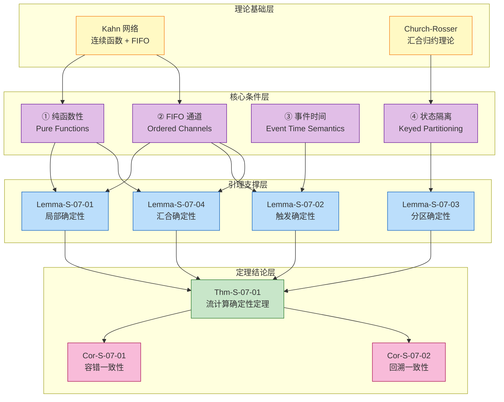
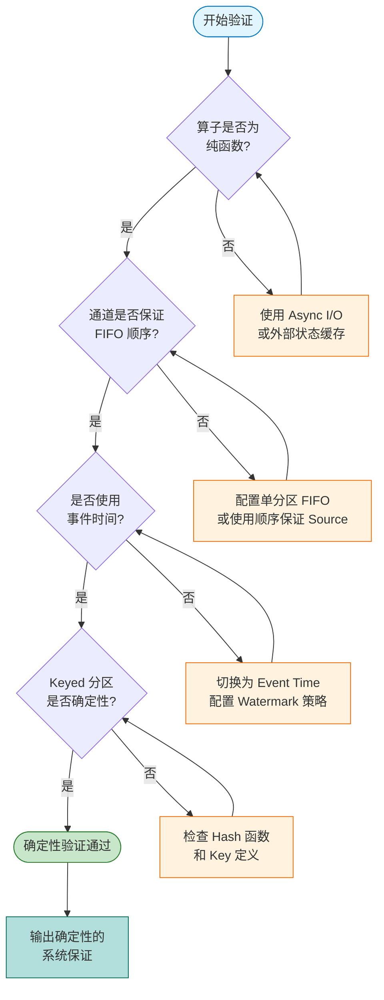
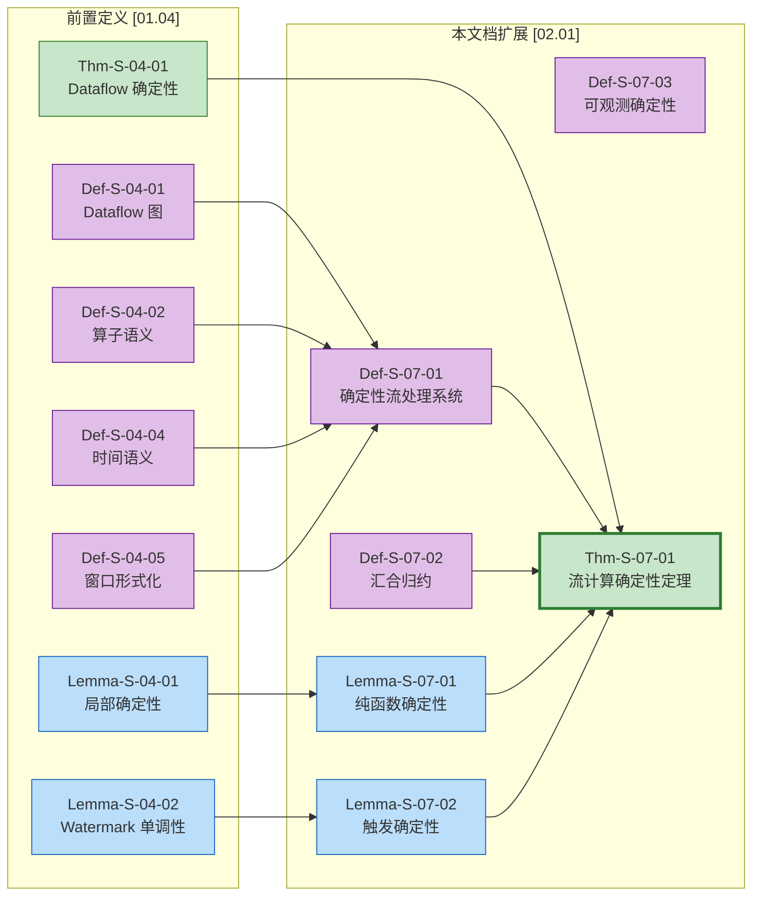

# 流计算确定性定理 (Determinism in Streaming Computation)

> 所属阶段: Struct/02-properties | 前置依赖: [01.04-dataflow-model-formalization.md](../01-foundation/01.04-dataflow-model-formalization.md) | 形式化等级: L5

---

## 目录

- [流计算确定性定理 (Determinism in Streaming Computation)](#流计算确定性定理-determinism-in-streaming-computation)
  - [目录](#目录)
  - [1. 概念定义 (Definitions)](#1-概念定义-definitions)
    - [Def-S-07-01 (确定性流处理系统)](#def-s-07-01-确定性流处理系统)
    - [Def-S-07-02 (汇合归约, Confluent Reduction)](#def-s-07-02-汇合归约-confluent-reduction)
    - [Def-S-07-03 (可观测确定性)](#def-s-07-03-可观测确定性)
    - [Def-S-07-04 (无竞争条件)](#def-s-07-04-无竞争条件)
  - [2. 属性推导 (Properties)](#2-属性推导-properties)
    - [Lemma-S-07-01 (纯函数算子的局部确定性)](#lemma-s-07-01-纯函数算子的局部确定性)
    - [Lemma-S-07-02 (Watermark 单调性保证触发确定性)](#lemma-s-07-02-watermark-单调性保证触发确定性)
    - [Lemma-S-07-03 (分区哈希的确定性)](#lemma-s-07-03-分区哈希的确定性)
    - [Lemma-S-07-04 (汇合系统的全局确定性)](#lemma-s-07-04-汇合系统的全局确定性)
  - [3. 关系建立 (Relations)](#3-关系建立-relations)
    - [关系 1: 确定性流处理 `≃` Kahn 网络确定性 {#关系-1-确定性流处理--kahn-网络确定性}](#关系-1-确定性流处理--kahn-网络确定性-关系-1-确定性流处理--kahn-网络确定性)
    - [关系 2: 汇合归约 `⇒` Dataflow 确定性 {#关系-2-汇合归约--dataflow-确定性}](#关系-2-汇合归约--dataflow-确定性-关系-2-汇合归约--dataflow-确定性)
    - [关系 3: 可观测确定性 `⊂` 语义确定性 {#关系-3-可观测确定性--语义确定性}](#关系-3-可观测确定性--语义确定性-关系-3-可观测确定性--语义确定性)
  - [4. 论证过程 (Argumentation)](#4-论证过程-argumentation)
    - [4.1 纯函数性的边界条件](#41-纯函数性的边界条件)
    - [4.2 FIFO 假设的违反场景](#42-fifo-假设的违反场景)
    - [4.3 事件时间与处理时间的权衡](#43-事件时间与处理时间的权衡)
  - [5. 形式证明 / 工程论证 (Proof / Engineering Argument)](#5-形式证明--工程论证-proof--engineering-argument)
    - [Thm-S-07-01 (流计算确定性定理)](#thm-s-07-01-流计算确定性定理)
    - [推论 (Corollaries)](#推论-corollaries)
  - [6. 实例验证 (Examples)](#6-实例验证-examples)
    - [示例 6.1: WordCount 的确定性验证](#示例-61-wordcount-的确定性验证)
    - [反例 6.1: 非确定性 Source 导致结果不一致](#反例-61-非确定性-source-导致结果不一致)
    - [反例 6.2: 外部 API 调用引入非确定性](#反例-62-外部-api-调用引入非确定性)
  - [7. 可视化 (Visualizations)](#7-可视化-visualizations)
    - [确定性条件层次图](#确定性条件层次图)
    - [确定性验证流程图](#确定性验证流程图)
    - [跨引用关系图](#跨引用关系图)
  - [8. 引用参考 (References)](#8-引用参考-references)

## 1. 概念定义 (Definitions)

本节建立流计算确定性的严格形式化基础。确定性是流计算系统能够支持可重复执行、容错恢复和正确性验证的根本保证。我们从三个互补视角定义确定性：系统语义、归约理论和可观测行为。

---

### Def-S-07-01 (确定性流处理系统)

一个**确定性流处理系统**（Deterministic Stream Processing System）定义为六元组：

$$
\mathcal{D} = (\mathcal{G}, \mathcal{F}, \mathcal{C}, \mathcal{T}, \mathcal{W}, \mathcal{O})
$$

其中各分量的语义如下：

| 符号 | 类型 | 语义 |
|------|------|------|
| $\mathcal{G}$ | Dataflow 图 | 基础计算拓扑结构，满足 [Def-S-04-01](../01-foundation/01.04-dataflow-model-formalization.md#def-s-04-01-dataflow-图) 的定义 |
| $\mathcal{F}$ | 纯函数集合 | 所有算子 $op \in V_{op}$ 的计算函数 $f_{compute}$ 均为纯函数 |
| $\mathcal{C}$ | 通道约束 | 所有数据流边 $e \in E$ 满足 FIFO（先进先出）传输语义 |
| $\mathcal{T}$ | 时间语义 | 采用事件时间（Event Time）作为逻辑时间基准 |
| $\mathcal{W}$ | Watermark 机制 | 单调不减的水印推进策略 |
| $\mathcal{O}$ | 输出等价 | 输出比较函数，定义何时两个输出被视为等价 |

**确定性条件**：对于任意两个执行实例 $\mathcal{E}_1$ 和 $\mathcal{E}_2$，若输入历史 $H_{in}$ 相同，则：

$$
\forall \mathcal{E}_1, \mathcal{E}_2: \quad H_{in}(\mathcal{E}_1) = H_{in}(\mathcal{E}_2) \implies \mathcal{O}(\text{Output}(\mathcal{E}_1), \text{Output}(\mathcal{E}_2)) = \text{true}
$$

**直观解释**：确定性流处理系统保证"相同输入产生相同输出"，无论执行速度、调度顺序、并行度配置或故障恢复路径如何变化。这是流计算能够支持重放（replay）、回溯（backfill）和版本化（versioning）的理论基石 [^1][^4]。

**定义动机**：如果不显式定义确定性条件，就无法形式化地证明容错机制的正确性——故障恢复后的重放必须产生与原始执行一致的结果。确定性也是批流一体（batch-stream unification）的核心前提 [^7]。

---

### Def-S-07-02 (汇合归约, Confluent Reduction)

在流计算的归约语义框架中，**汇合归约**（Confluent Reduction）描述了计算路径的收敛性质。给定归约关系 $\to$（表示单步计算推进），我们定义：

**汇合性**（Confluence / Church-Rosser 性质）：

$$
\forall s, t, u: \quad s \to^* t \land s \to^* u \implies \exists v: t \to^* v \land u \to^* v
$$

其中 $s \to^* t$ 表示从零步或多步归约从 $s$ 到达 $t$。

**局部汇合性**（Local Confluence）：

$$
\forall s, t, u: \quad s \to t \land s \to u \implies \exists v: t \to^* v \land u \to^* v
$$

**菱形性质**（Diamond Property）——强汇合性的充分条件：

$$
\forall s, t, u: \quad s \to t \land s \to u \land t \neq u \implies \exists v: t \to v \land u \to v
$$

**直观解释**：汇合归约意味着"殊途同归"——无论中间步骤采取何种顺序或并发路径，只要从同一状态出发，最终都能收敛到共同的后继状态。这与 Kahn 网络的确定性一脉相承 [^4][^5]。

**定义动机**：将流计算建模为归约系统，可以借用 lambda 演算和项重写系统（TRS）的成熟理论。汇合性是证明"调度无关性"（scheduling independence）的直接工具。

---

### Def-S-07-03 (可观测确定性)

**可观测确定性**（Observable Determinism）从外部观察者的角度定义系统行为的一致性：

设观测函数 $\text{Obs}: \text{Execution} \to \text{ObservableTrace}$ 将执行映射为可观测轨迹，则系统满足可观测确定性当且仅当：

$$
\forall \mathcal{E}_1, \mathcal{E}_2: \quad H_{in}(\mathcal{E}_1) = H_{in}(\mathcal{E}_2) \implies \text{Obs}(\mathcal{E}_1) = \text{Obs}(\mathcal{E}_2)
$$

观测轨迹的构成要素：

| 要素 | 定义 | 确定性要求 |
|------|------|-----------|
| 输出记录序列 | Sink 算子发出的记录有序列表 | 序列内容必须相同 |
| 输出时间戳 | 记录被 Sink 发出的事件时间 | 时间戳必须相同 |
| 窗口触发时刻 | 每个窗口的 FIRE 事件时间 | 触发时刻必须相同 |
| 状态快照 | Checkpoint 时刻的状态值 | 快照内容必须相同 |

**关键区分**：内部执行细节（如线程调度、缓冲状态、中间记录顺序）可以不同，但**所有可观测的外部行为**必须一致。

**直观解释**：可观测确定性是工程实践中最关心的性质。用户不关心算子内部缓冲区的临时状态，只关心最终输出到数据库或消息队列的结果是否正确且可重复 [^2][^6]。

**定义动机**：严格的语义确定性可能过于苛刻（要求每一步中间状态都相同）。可观测确定性提供了更实用的标准，允许系统在保证结果正确的前提下进行内部优化（如乱序执行、推测执行）。

---

### Def-S-07-04 (无竞争条件)

流计算中的**竞争条件**（Race Condition）是指由于执行时序不确定性导致的非确定性行为。形式化地，竞争条件存在于：

$$
\exists r_1, r_2 \in \mathcal{S}, op \in V_{op}: \quad r_1 \parallel r_2 \land \text{State}(op, r_1) \cap \text{State}(op, r_2) \neq \emptyset
$$

即两条并发记录访问并可能修改同一状态单元。一个系统满足**无竞争条件**（Race-Free）当且仅当：

1. **分区隔离**：对于任意 Keyed 状态算子，并发记录 $r_1 \parallel r_2$ 的键值不同：$\kappa(r_1) \neq \kappa(r_2)$
2. **原子更新**：状态修改操作是原子的，不可分割
3. **happens-before 可见性**：如果 $r_1$ 的状态更新必须对 $r_2$ 可见，则存在显式的 happens-before 边

**直观解释**：无竞争条件消除了"时序敏感"的隐患——即使两条记录同时到达，由于它们访问不同的状态分区（或更新是原子的），结果不会依赖于到达顺序。

---

## 2. 属性推导 (Properties)

本节从上述定义出发，推导流计算确定性的关键性质，为定理证明奠定基础。

---

### Lemma-S-07-01 (纯函数算子的局部确定性)

**陈述**：在确定性流处理系统 $\mathcal{D}$ 中，若算子 $op$ 的计算函数 $f \in \mathcal{F}$ 是纯函数，且输入通道满足 FIFO 语义，则对于确定的输入序列 $S_{in}$，输出序列 $S_{out}$ 唯一确定。

**推导**：

1. 由 [Def-S-04-02](../01-foundation/01.04-dataflow-model-formalization.md#def-s-04-02-算子语义)，算子的输出依赖于输入记录和当前状态；
2. 由 Def-S-07-01 的纯函数假设，$f$ 无外部副作用，对于相同的输入 $(r, s)$，输出 $(r', s')$ 必然相同；
3. 由 FIFO 语义，输入序列的顺序是确定的——即使网络乱序，FIFO 通道保证接收顺序等于发送顺序；
4. 因此，算子按顺序处理确定的输入序列，产生确定的输出序列。 ∎

**推论**：纯函数算子天然支持乱序执行优化——系统可以自由调度算子实例的执行顺序，只要不改变每条通道上的记录顺序，结果就不会改变。

---

### Lemma-S-07-02 (Watermark 单调性保证触发确定性)

**陈述**：在事件时间语义下，若 Watermark 生成策略满足单调不减（Def-S-04-04），则窗口触发时刻是确定的。

**推导**：

1. 由 Def-S-04-05，窗口触发条件为 $T(wid, w) = \text{FIRE} \iff w \geq t_{end} + F$；
2. 由 Lemma-S-04-02（[Watermark 单调性](../01-foundation/01.04-dataflow-model-formalization.md#lemma-s-04-02-watermark-单调性)），任意算子实例的 Watermark 随处理时间单调不减；
3. 对于给定的输入历史，Watermark 推进路径唯一确定——它完全依赖于已观察记录的最大事件时间；
4. 因此，首次满足 $w \geq t_{end} + F$ 的时刻是确定的，窗口触发时刻确定。 ∎

---

### Lemma-S-07-03 (分区哈希的确定性)

**陈述**：若 KeyBy 分区使用确定性哈希函数 $h: \mathcal{K} \to \{0, 1, \ldots, P-1\}$，则记录到并行实例的映射是确定的。

**推导**：

1. 设分区函数为 $\pi(r) = h(\kappa(r)) \bmod P(v)$；
2. 对于给定的键 $k$，$h(k)$ 是确定的（哈希函数为纯函数）；
3. 并行度 $P(v)$ 在作业启动时固定；
4. 因此，$\pi(r)$ 对于相同键的记录总是返回相同的实例索引，分区映射确定。 ∎

**工程意义**：Flink 使用 MurmurHash 3 作为默认哈希函数，该函数满足确定性要求，保证了 KeyBy 后的状态隔离正确性 [^3]。

---

### Lemma-S-07-04 (汇合系统的全局确定性)

**陈述**：若流计算系统的归约语义满足汇合性（Def-S-07-02），且初始状态相同，则无论归约路径如何选择，最终都能到达共同的终止状态（或无限执行产生相同的极限行为）。

**推导**：

1. 由汇合性定义，任意两个从同一状态出发的归约路径都能收敛到共同后继；
2. 通过归纳法，该性质扩展到任意长度的归约序列；
3. 对于有限执行，最终状态唯一；
4. 对于无限执行（无限流），所有公平调度策略产生的观测轨迹相同（由 Kahn 网络的连续性保证）。 ∎

---

## 3. 关系建立 (Relations)

本节建立确定性概念与其他计算模型和理论框架之间的严格关系。

---

### 关系 1: 确定性流处理 `≃` Kahn 网络确定性 {#关系-1-确定性流处理--kahn-网络确定性}

**论证**：

- **理论基础等价**：Def-S-07-01 的确定性条件直接继承了 Kahn 网络的核心定理 [^4]。Kahn 证明的"连续函数 + FIFO 通道 → 输出历史唯一"是 Thm-S-07-01 的理论原型。
- **工程扩展**：确定性流处理系统在 Kahn 基础上增加了显式的并行度函数 $P$、分区策略 $\pi$ 和事件时间语义 $\mathcal{T}$。这些扩展保持确定性不变性——只要满足 Def-S-07-01 的六元组约束，扩展系统的输出历史仍然唯一。
- **形式化嵌入**：存在保持确定性的编码函数 $\text{Encode}: \text{KPN} \to \mathcal{D}$，使得：
  $$
  \text{Output}_{KPN}(K) = \text{Output}_{\mathcal{D}}(\text{Encode}(K))
  $$

---

### 关系 2: 汇合归约 `⇒` Dataflow 确定性 {#关系-2-汇合归约--dataflow-确定性}

**论证**：

- **理论蕴含**：若流计算的归约语义满足汇合性（Def-S-07-02），则对应的 Dataflow 系统必然满足确定性（Def-S-07-01）。这是 Church-Rosser 定理的直接应用。
- **逆否命题**：若 Dataflow 系统出现非确定性（相同输入产生不同输出），则其底层归约语义必然不满足汇合性——存在从同一状态出发无法汇合的归约分支。
- **实用推论**：工程上可以通过检查系统是否存在竞争条件（Def-S-07-04）来判定汇合性。无竞争的 Keyed 分区系统必然满足汇合归约。

---

### 关系 3: 可观测确定性 `⊂` 语义确定性 {#关系-3-可观测确定性--语义确定性}

**论证**：

- **严格弱化**：语义确定性要求每一步中间计算状态都相同；可观测确定性只要求外部可见的输出相同。
- **分离结果**：存在满足可观测确定性但不满足语义确定性的系统。例如，两个 Map 算子可以交换执行顺序（产生不同的中间状态），只要它们的输出集合相同，最终 Sink 输出就相同。
- **工程映射**：Flink 的算子链化（Operator Chaining）优化保持可观测确定性——链内算子的执行顺序可能被重排，但最终输出不变 [^3][^7]。

---

## 4. 论证过程 (Argumentation)

本节提供辅助引理、反例分析和边界讨论，为确定性定理的严格证明做准备。

---

### 4.1 纯函数性的边界条件

**边界讨论**：算子函数的"纯性"在实践中存在粒度差异：

| 纯度级别 | 允许的操作 | 确定性保证 | 示例 |
|----------|-----------|-----------|------|
| **严格纯函数** | 仅依赖输入和状态，无任何外部 I/O | 完全确定 | `map(x => x * 2)` |
| **准纯函数** | 允许读取配置常量（启动时固定） | 确定 | `map(x => x * config.factor)` |
| **时序依赖函数** | 依赖处理时间戳 | 非确定 | `map(x => x if now() < deadline)` |
| **非纯函数** | 调用外部服务、随机数 | 非确定 | `map(x => fetchFromAPI(x))` |

Thm-S-07-01 的确定性保证仅适用于严格纯函数和准纯函数。时序依赖和非纯函数需要通过其他机制（如版本化外部状态、记录随机数种子）来恢复确定性。

---

### 4.2 FIFO 假设的违反场景

**反例分析**：网络层重排导致确定性崩溃

考虑简单的计数算子：

```
Input: [A, B, A]
State: counter := counter + 1 for each input
```

- **FIFO 正确执行**：counter 序列 = [1, 2, 3]，最终状态 = 3
- **网络乱序执行**（B 先于第一个 A 到达）：counter 序列 = [1, 2, 3]，最终状态仍为 3

在此例中，由于加法满足交换律，乱序不改变最终结果。但如果状态更新不满足交换律：

```
State: buffer := buffer ++ str(input)  // 字符串拼接
```

- **FIFO 正确执行**：buffer = "ABA"
- **乱序执行**（B 先于第一个 A）：buffer = "BAA"

**结论**：FIFO 通道假设是确定性的必要条件。Flink 通过 TCP 连接的按序交付和 Netty 的网络缓冲区管理来保证单分区 FIFO 语义 [^3]。

---

### 4.3 事件时间与处理时间的权衡

**边界讨论**：三种时间语义的确定性对比

| 时间语义 | 确定性 | 延迟 | 适用场景 |
|----------|--------|------|----------|
| **Event Time** | ✓ 确定 | 受 Watermark 延迟影响 | 日志分析、金融审计 |
| **Processing Time** | ✗ 非确定 | 最低 | 近似实时、监控报警 |
| **Ingestion Time** | △ 部分确定 | 中等 | 数据源受控的场景 |

**Processing Time 的非确定性来源**：

- 机器时钟漂移
- 网络延迟变化
- 调度延迟波动
- 垃圾回收停顿

Thm-S-07-01 要求采用 Event Time 语义，将逻辑时间锚定在数据本身的属性上，从而隔离运行时环境的不确定性。

---

## 5. 形式证明 / 工程论证 (Proof / Engineering Argument)

### Thm-S-07-01 (流计算确定性定理)

**陈述**：给定一个确定性流处理系统 $\mathcal{D} = (\mathcal{G}, \mathcal{F}, \mathcal{C}, \mathcal{T}, \mathcal{W}, \mathcal{O})$（Def-S-07-01），若满足：

1. **纯函数性**：所有算子 $op \in V_{op}$ 的计算函数 $f_{compute} \in \mathcal{F}$ 是纯函数（无外部副作用、无随机性）；
2. **FIFO 通道**：所有数据流边 $e \in E$ 满足 FIFO 传输语义（Def-S-07-01 的 $\mathcal{C}$ 约束）；
3. **事件时间处理**：系统采用事件时间语义 $\mathcal{T}$，窗口触发由单调 Watermark $\mathcal{W}$ 决定；
4. **无共享状态**：Keyed 状态算子通过确定性分区（Lemma-S-07-03）保证状态隔离；

则对于给定的输入历史 $H_{in}$，系统的输出观测轨迹 $\text{Obs}(\mathcal{E})$ 是**唯一确定**的，与执行调度、速度或故障恢复路径无关。

**证明**：

**步骤 1：建立局部确定性基例**

由 Lemma-S-07-01，每个纯函数算子在 FIFO 输入条件下产生确定的输出序列。这建立了"算子级"的确定性基础。

**步骤 2：建立拓扑归纳框架**

考虑 Dataflow 图 $\mathcal{G}$ 的拓扑排序 $v_1, v_2, \ldots, v_n$（由 Def-S-04-01 的无环性保证存在）。

- **基例**（Source 算子）：Source 的输出由固定的输入历史 $H_{in}$ 和确定的水印生成策略决定。由于 $H_{in}$ 的事件时间偏序是固定的，Source 产生的流（包括 Watermark）唯一确定。
- **边传递**：Source 的输出通过 FIFO 通道传输到下游。FIFO 保证接收顺序等于发送顺序，因此下游算子的输入序列确定。

**步骤 3：归纳步骤——算子链的确定性传播**

假设前 $k-1$ 个算子的输出已经唯一确定。考虑第 $k$ 个算子 $v_k$：

- $v_k$ 的输入来自第 $k-1$ 层的一个或多个算子；
- 由归纳假设，这些上游算子的输出已经唯一确定；
- 由 FIFO 假设，每条输入边上的记录序列是确定的；
- 由 Lemma-S-07-01，纯函数算子产生确定的输出；
- 因此，$v_k$ 的输出唯一确定。

**步骤 4：窗口算子的触发确定性**

对于有状态窗口算子（Def-S-04-05）：

- 由 Lemma-S-07-02，Watermark 单调性保证窗口触发时刻唯一确定；
- 窗口状态累加器 $A$ 接收到的记录集合由步骤 3 保证确定；
- 聚合函数的结合律（Prop-S-04-01）保证即使重放改变记录顺序，最终结果相同；
- 因此，窗口输出记录和触发时刻都确定。

**步骤 5：多输入算子的汇合确定性**

对于 Join/CoGroup 等多输入算子：

- 每个输入流由步骤 3 保证确定；
- 输出 Watermark $w_{out} = \min_i w_{in_i}$（Def-S-04-04）；
- 最小值函数是确定性操作；
- 连接/分组操作在固定的输入集合上产生固定的输出集合。

**步骤 6：全局结论**

由数学归纳法，从 Source 层到 Sink 层，所有算子的输出都唯一确定。因此，Sink 产生的最终输出轨迹唯一确定。

对于故障恢复场景：

- Checkpoint 捕获确定的状态快照（由步骤 1-5，处理到某 Watermark 时的状态确定）；
- 恢复后从 Checkpoint 重放，输入历史 $H_{in}$ 不变（可重放 Source 保证）；
- 由上述归纳，重放产生的输出与原始执行一致。

因此，输出观测轨迹与执行调度、速度或故障恢复路径无关。 ∎

---

### 推论 (Corollaries)

**Cor-S-07-01 (容错一致性)**：满足 Thm-S-07-01 条件的流处理系统，在故障恢复后产生的输出与无故障连续执行的输出完全一致。

**Cor-S-07-02 (回溯一致性)**：对历史数据的重放（backfill）处理产生与原始处理相同的结果，支持结果版本化。

**Cor-S-07-03 (并行度无关性)**：在保持 KeyBy 分区语义的前提下，改变算子并行度（通过 Savepoint 恢复）不改变最终输出。

---

## 6. 实例验证 (Examples)

### 示例 6.1: WordCount 的确定性验证

考虑一个事件时间 WordCount 作业：

```java
DataStream<Event> events = env.addSource(kafkaSource);

events
    .keyBy(event -> event.word)
    .window(TumblingEventTimeWindows.of(Time.minutes(1)))
    .aggregate(new CountAggregate())
    .addSink(new RedisSink());
```

**确定性条件验证**：

1. **纯函数性**：`CountAggregate` 实现 `create() -> add() -> getResult()`，均为纯函数；
2. **FIFO 通道**：Kafka Source 到 KeyBy 的分区保持单分区内 FIFO；
3. **事件时间处理**：使用 `TumblingEventTimeWindows`，触发由 Watermark 决定；
4. **状态隔离**：`keyBy(event.word)` 保证相同单词路由到同一并行实例。

**执行场景对比**：

| 场景 | 执行条件 | 输出结果 | 确定性验证 |
|------|----------|----------|------------|
| 正常执行 | 无故障 | word=hello, count=100 @ [0, 60s) | 基准结果 |
| 慢执行 | 增加延迟 | 相同 | 输出不受速度影响 |
| 故障恢复 | TM 崩溃后恢复 | 相同 | Checkpoint 保证 |
| 并行度扩展 | 从 4 扩到 8 | 相同 | Hash 分区一致性 |

---

### 反例 6.1: 非确定性 Source 导致结果不一致

**场景**：使用系统时间戳作为事件时间

```java
// 反例：非确定性 Source
DataStream<Event> events = env.addSource(ctx -> {
    while (running) {
        String line = socket.readLine();
        // 错误：使用处理时间作为事件时间
        Event event = new Event(line, System.currentTimeMillis());
        ctx.collect(event);
    }
});
```

**问题分析**：

- 每次重放时，`System.currentTimeMillis()` 返回不同值；
- 记录被分配到不同的时间窗口；
- 相同输入产生不同输出，确定性被破坏。

**修复方案**：

```java
// 正确：从数据中提取事件时间
DataStream<Event> events = env.addSource(kafkaSource)
    .assignTimestampsAndWatermarks(
        WatermarkStrategy.<Event>forBoundedOutOfOrderness(...)
            .withTimestampAssigner((event, timestamp) -> event.getEventTime())
    );
```

---

### 反例 6.2: 外部 API 调用引入非确定性

**场景**：在 Map 算子中调用外部服务

```java
// 反例：非纯函数算子
DataStream<EnrichedEvent> enriched = events
    .map(event -> {
        // 外部 API 调用：结果可能随时间变化
        UserProfile profile = userService.lookup(event.userId);
        return new EnrichedEvent(event, profile);
    });
```

**问题分析**：

- `userService.lookup()` 的结果可能随时间变化（用户更新资料）；
- 重放时可能获取不同的用户资料；
- 结果不可重复。

**修复方案**：

1. **异步 I/O 与版本化**：使用 Flink Async I/O，并记录外部状态的版本/时间戳；
2. **外部状态缓存**：在状态后端缓存查询结果，Checkpoint 包含缓存；
3. **确定性回放**：使用状态外化（State Externalization）保存外部调用结果。

---

## 7. 可视化 (Visualizations)

### 确定性条件层次图

下图展示 Thm-S-07-01 中四个核心确定性条件的依赖关系和验证层级：



**图说明**：

- **黄色节点**：理论基础，Kahn 网络的确定性是本文档的根本依据；
- **紫色节点**：四大核心条件，必须同时满足才能保证系统确定性；
- **蓝色节点**：支撑引理，将核心条件转化为可验证的局部性质；
- **绿色节点**：主定理，流计算确定性定理的完整表述；
- **粉色节点**：实用推论，直接指导工程实践的容错和回溯设计。

---

### 确定性验证流程图

下图展示如何在工程实践中验证流处理作业的确定性：



**图说明**：

- 菱形节点表示四大核心条件的验证检查点；
- 橙色节点表示修复方案，当条件不满足时的整改路径；
- 绿色节点表示验证通过，系统具备确定性保证；
- 流程图可直接用于 CI/CD 中的确定性检查清单。

---

### 跨引用关系图

下图展示本文档与前置文档 [01.04-dataflow-model-formalization.md](../01-foundation/01.04-dataflow-model-formalization.md) 的形式化依赖关系：



**图说明**：

- 左侧紫色节点为前置文档 [01.04] 中的核心定义；
- 右侧紫色节点为本文档新增的定义和引理；
- 粗边框绿色节点（Thm-S-07-01）是本文档的核心贡献，它继承了 Thm-S-04-01 并扩展到完整的流计算确定性框架；
- 实线箭头表示形式化依赖关系。

---

## 8. 引用参考 (References)

[^1]: T. Akidau et al., "The Dataflow Model: A Practical Approach to Balancing Correctness, Latency, and Cost in Massive-Scale, Unbounded, Out-of-Order Data Processing," *PVLDB*, 8(12), 2015.

[^2]: T. Akidau et al., "MillWheel: Fault-Tolerant Stream Processing at Internet Scale," *VLDB*, 2013.

[^3]: Apache Flink Documentation, "Time Characteristics," 2025. <https://nightlies.apache.org/flink/flink-docs-stable/docs/concepts/time/>

[^4]: G. Kahn, "The semantics of a simple language for parallel programming," *IFIP Congress*, 1974.

[^5]: J. C. M. Baeten and W. P. Weijland, "Process Algebra," *Cambridge Tracts in Theoretical Computer Science*, 1990.

[^6]: K. M. Chandy and L. Lamport, "Distributed Snapshots: Determining Global States of Distributed Systems," *ACM Trans. Comput. Syst.*, 3(1), 1985.

[^7]: P. Carbone et al., "Apache Flink: Stream and Batch Processing in a Single Engine," *IEEE Data Eng. Bull.*, 38(4), 2015.


---

*文档版本: v1.0 | 更新日期: 2026-04-02 | 状态: 已完成*
