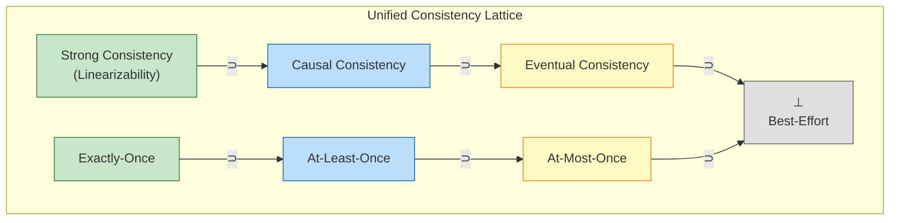
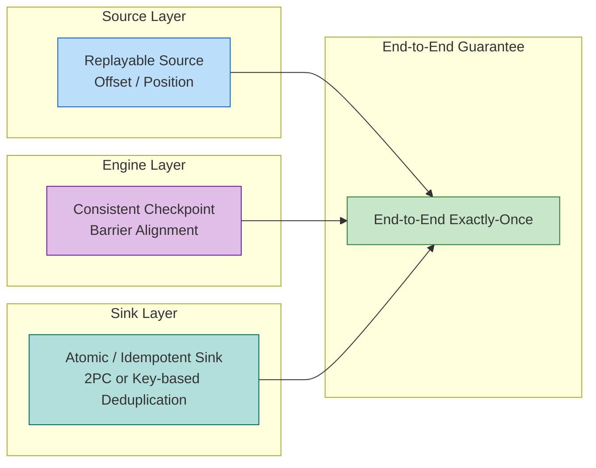

# 流计算一致性层级 (Consistency Hierarchy in Streaming)

> 所属阶段: Struct/02-properties | 前置依赖: [01.04-dataflow-model-formalization.md](../01-foundation/01.04-dataflow-model-formalization.md) | 形式化等级: L5

---

## 目录

- [流计算一致性层级 (Consistency Hierarchy in Streaming)](#流计算一致性层级-consistency-hierarchy-in-streaming)
  - [目录](#目录)
  - [1. 概念定义 (Definitions)](#1-概念定义-definitions)
    - [Def-S-08-01 (Dataflow 执行轨迹)](#def-s-08-01-dataflow-执行轨迹)
    - [Def-S-08-02 (At-Most-Once 语义)](#def-s-08-02-at-most-once-语义)
    - [Def-S-08-03 (At-Least-Once 语义)](#def-s-08-03-at-least-once-语义)
    - [Def-S-08-04 (Exactly-Once 语义)](#def-s-08-04-exactly-once-语义)
    - [Def-S-08-05 (端到端一致性)](#def-s-08-05-端到端一致性)
    - [Def-S-08-06 (内部一致性)](#def-s-08-06-内部一致性)
    - [Def-S-08-07 (Strong Consistency)](#def-s-08-07-strong-consistency)
    - [Def-S-08-08 (Causal Consistency)](#def-s-08-08-causal-consistency)
    - [Def-S-08-09 (Eventual Consistency)](#def-s-08-09-eventual-consistency)
  - [2. 属性推导 (Properties)](#2-属性推导-properties)
    - [Lemma-S-08-01 (Exactly-Once 蕴含 At-Least-Once)](#lemma-s-08-01-exactly-once-蕴含-at-least-once)
    - [Lemma-S-08-02 (Exactly-Once 蕴含 At-Most-Once)](#lemma-s-08-02-exactly-once-蕴含-at-most-once)
    - [Lemma-S-08-03 (At-Least-Once 与 At-Most-Once 的误差互补性)](#lemma-s-08-03-at-least-once-与-at-most-once-的误差互补性)
    - [Lemma-S-08-04 (Strong Consistency 蕴含 Causal Consistency)](#lemma-s-08-04-strong-consistency-蕴含-causal-consistency)
    - [Lemma-S-08-05 (Causal Consistency 蕴含 Eventual Consistency)](#lemma-s-08-05-causal-consistency-蕴含-eventual-consistency)
    - [Prop-S-08-01 (端到端一致性的分解)](#prop-s-08-01-端到端一致性的分解)
  - [3. 关系建立 (Relations)](#3-关系建立-relations)
    - [关系 1: Dataflow 确定性定理与一致性层级的联系](#关系-2-内部一致性--chandy-lamport-分布式快照)
    - [关系 2: 内部一致性 `≈` Chandy-Lamport 分布式快照 {#关系-2-内部一致性--chandy-lamport-分布式快照}](#关系-2-内部一致性--chandy-lamport-分布式快照)
    - [关系 3: Exactly-Once 语义与线性一致性的关系](#关系-3-exactly-once-语义与线性一致性的关系)
  - [4. 论证过程 (Argumentation)](#4-论证过程-argumentation)
    - [引理 4.1 (Source 可重放保证无丢失)](#引理-41-source-可重放保证无丢失)
    - [引理 4.2 (Barrier 对齐保证快照一致性)](#引理-42-barrier-对齐保证快照一致性)
    - [反例 4.1 (内部一致 ≠ 端到端一致) {#反例-41-内部一致--端到端一致}](#反例-41-内部一致--端到端一致)
    - [边界讨论 4.2 (幂等 Sink 的补偿能力)](#边界讨论-42-幂等-sink-的补偿能力)
  - [5. 形式证明 (Proofs)](#5-形式证明-proofs)
    - [Thm-S-08-01 (Exactly-Once 在网络分区下的必要条件)](#thm-s-08-01-exactly-once-在网络分区下的必要条件)
    - [Thm-S-08-02 (端到端 Exactly-Once 正确性定理)](#thm-s-08-02-端到端-exactly-once-正确性定理)
    - [Thm-S-08-03 (统一一致性层级蕴含链)](#thm-s-08-03-统一一致性层级蕴含链)
  - [6. 实例验证 (Examples)](#6-实例验证-examples)
    - [示例 6.1: Flink Kafka 端到端 Exactly-Once](#示例-61-flink-kafka-端到端-exactly-once)
    - [示例 6.2: 幂等 HBase Sink 实现 Exactly-Once](#示例-62-幂等-hbase-sink-实现-exactly-once)
    - [反例 6.3: 非幂等 HTTP Sink 破坏 At-Most-Once](#反例-63-非幂等-http-sink-破坏-at-most-once)
    - [反例 6.4: Source 偏移量超前提交破坏 At-Least-Once](#反例-64-source-偏移量超前提交破坏-at-least-once)
  - [7. 可视化 (Visualizations)](#7-可视化-visualizations)
    - [统一一致性层级格 (Unified Consistency Lattice)](#统一一致性层级格-unified-consistency-lattice)
    - [端到端一致性构成图](#端到端一致性构成图)
  - [8. 引用参考 (References)](#8-引用参考-references)

## 1. 概念定义 (Definitions)

本节在 Dataflow 模型的形式化基础之上，建立流计算系统一致性层级的严格数学定义。所有定义均依赖于前置文档 [01.04-dataflow-model-formalization.md](../01-foundation/01.04-dataflow-model-formalization.md) 中对 Dataflow 图、算子语义、偏序多重集以及事件时间的刻画[^4][^6]。

---

### Def-S-08-01 (Dataflow 执行轨迹)

设 $\mathcal{G} = (V, E, P, \Sigma, \mathbb{T})$ 为一个 Dataflow 图（参见 Def-S-04-01），其**全局执行轨迹** $\mathcal{T}$ 定义为全局状态与系统事件的交替序列：

$$
\mathcal{T} = \langle s_0, e_1, s_1, e_2, s_2, \dots, e_n, s_n \rangle
$$

其中，全局状态 $s_i$ 包含三部分：

- **算子状态**：$\{ \sigma_v^{(i)} \}_{v \in V_{op}}$，记录各算子在时刻 $i$ 的局部状态；
- **通道状态**：$\{ Q_c^{(i)} \}_{c \in E}$，记录各数据通道 $c$ 上的在途消息（in-flight messages）序列；
- **源偏移量**：$\{ o_{src}^{(i)} \}_{src \in V_{src}}$，记录各 Source 算子已经确认消费的外部系统位置（如 Kafka offset）。

系统事件 $e_i$ 属于以下集合：

$$
e_i \in \{ \text{Process}(v, r), \; \text{BarrierArrive}(v, c, k), \; \text{CheckpointTrigger}(k), \; \text{SinkCommit}(T_k) \}
$$

分别对应：算子 $v$ 处理记录 $r$、Barrier $k$ 到达通道 $c$、触发第 $k$ 次 Checkpoint、以及 Sink 提交事务 $T_k$。

**直观解释**：执行轨迹是 Dataflow 图在运行时全部动态行为的“电影胶片”。通过追踪轨迹，我们可以精确地知道每条记录何时被哪个算子处理、每个算子的状态如何演化、以及每个 Sink 何时将结果暴露给外部世界[^1][^2]。

**定义动机**：如果不将运行时刻画为轨迹，就无法对“恰好一次”进行形式化——因为“一次”必须是在时间维度上可计数的。该定义将离散的 Checkpoint 事件与连续的数据处理统一在同一个时序框架中，为后续的一致性层级比较提供了公共的度量衡。

---

### Def-S-08-02 (At-Most-Once 语义)

给定一个输入记录集合 $I$ 和一条执行轨迹 $\mathcal{T}$，设观察函数 $\mathcal{O}(\mathcal{T})$ 提取 $\mathcal{T}$ 中所有已被 Sink **提交到外部系统且可见**的输出记录构成的多重集。对于任意输入记录 $r \in I$，定义其**因果影响计数**为：

$$
c(r, \mathcal{T}) = |\{ o \in \mathcal{O}(\mathcal{T}) \mid \text{caused\_by}(o, r) \}|
$$

其中 $\text{caused\_by}(o, r)$ 表示输出记录 $o$ 的生成因果依赖于输入记录 $r$ 的处理（即 $r$ 经由某条 Dataflow 路径对 $o$ 的产生做出了贡献）。

一个流计算系统满足 **At-Most-Once** 语义，当且仅当：

$$
\forall r \in I. \; c(r, \mathcal{T}) \leq 1
$$

**直观解释**：每条输入数据对最终外部世界的影响**最多只有一次**。系统允许数据在传输或处理过程中丢失（即 $c(r, \mathcal{T}) = 0$），但绝对禁止同一记录产生两次或更多次可见副作用。At-Most-Once 是一致性保证中最宽松的一级，常用于可容忍少量丢失的监控指标、日志采样等场景[^3][^5]。

**定义动机**：At-Most-Once 消除了所有去重、重试和事务开销，换取最低的延迟和最高的吞吐。将该语义形式化为因果影响计数的上界，使得“不重复”这一工程目标可以直接与容错机制的正确性证明对接。

---

### Def-S-08-03 (At-Least-Once 语义)

一个流计算系统满足 **At-Least-Once** 语义，当且仅当：

$$
\forall r \in I. \; c(r, \mathcal{T}) \geq 1
$$

**直观解释**：每条输入数据对最终外部世界的影响**至少有一次**。系统不允许数据永久丢失（即 $c(r, \mathcal{T}) \geq 1$），但可能在故障恢复或重试场景下导致同一记录被处理多次，从而产生重复的副作用。At-Least-Once 是大多数流处理引擎（如 Flink 在默认配置下）提供的基础保证，适用于日志聚合、事件驱动微服务等场景[^1][^5]。

**定义动机**：在分布式环境中，网络分区、节点宕机或超时重试是常态。At-Least-Once 通过允许重复来简化容错协议的设计——系统只需要确保“每条消息最终被处理”，而无需处理复杂的去重逻辑。该定义将“无丢失”与“可能重复”这对工程权衡严格数学化。

---

### Def-S-08-04 (Exactly-Once 语义)

一个流计算系统满足 **Exactly-Once** 语义，当且仅当：

$$
\forall r \in I. \; c(r, \mathcal{T}) = 1
$$

**直观解释**：每条输入数据对最终外部世界的影响**有且仅有一次**。系统既不丢失数据（排除 $c(r) = 0$），也不产生重复副作用（排除 $c(r) \geq 2$）。Exactly-Once 是金融交易、计费系统、库存扣款等对正确性要求极高的业务场景的核心需求[^3][^5]。

**定义动机**：Exactly-Once 并非指“物理上每条记录只被机器处理一次”——这在分布式故障恢复中是不可能的。它强调的是**观察等价性**：无论系统经历了多少次故障、重放或重调度，外部系统最终观察到的状态变化，与在理想无故障环境中每条记录恰好被处理一次所得到的状态变化完全一致。该定义将语义保证从“消息投递次数”提升为“副作用效果的可观测唯一性”。

---

### Def-S-08-05 (端到端一致性)

对于一条完整的流处理作业 $J = (Src, Ops, Snk)$，**端到端一致性**（End-to-End Consistency）指从外部数据源到外部数据汇的整个管道的一致性保证。具体地，端到端 Exactly-Once 由以下三个子属性的合取构成：

$$
\text{End-to-End-EO}(J) \iff \text{Replayable}(Src) \land \text{ConsistentCheckpoint}(Ops) \land \text{AtomicOutput}(Snk)
$$

其中：

- **$\text{Replayable}(Src)$**：Source 支持从持久化的位置标记（offset / position）重新读取数据。故障后，Source 可以从最近一次成功 Checkpoint 记录的偏移量开始重放。
- **$\text{ConsistentCheckpoint}(Ops)$**：引擎内部通过分布式快照（如 Chandy-Lamport 算法）捕获所有算子的一致全局状态，恢复后内部状态与无故障执行到同一时刻的状态一致[^2]。
- **$\text{AtomicOutput}(Snk)$**：Sink 对外部系统的写入满足原子性（事务性提交）或幂等性，确保重复处理不会导致重复的可见输出。

**直观解释**：端到端一致性不是流处理引擎内部一个孤立机制，而是 **Source、引擎、Sink 三方协同**的结果。如果只保证引擎内部 Exactly-Once，而 Source 偏移量提前提交或 Sink 非幂等，那么数据可能在进入引擎之前丢失，或在离开引擎之后重复[^1][^5]。

**定义动机**：工程实践中常见的误区是将 Flink 的 Checkpoint 机制等同于端到端 Exactly-Once。该定义明确将一致性边界扩展到外部系统，迫使架构设计者在 Source 和 Sink 两侧同步实现相应的容错协议。

---

### Def-S-08-06 (内部一致性)

**内部一致性**（Internal Consistency）指流处理引擎自身在故障恢复后，其内部算子状态与全局快照的一致性。形式化地，设 $\mathcal{G}_k$ 为第 $k$ 次 Checkpoint 捕获的全局快照，则：

$$
\text{Internal-Consistency}(Ops) \iff \forall k. \; \text{Consistent}(\mathcal{G}_k) \land \text{NoOrphans}(\mathcal{G}_k) \land \text{Reachable}(\mathcal{G}_k)
$$

其中 $\text{Consistent}(\mathcal{G}_k)$、$\text{NoOrphans}(\mathcal{G}_k)$ 和 $\text{Reachable}(\mathcal{G}_k)$ 分别对应 Chandy-Lamport 分布式快照算法的三大核心性质：一致割集、无孤儿消息、状态可达[^2]。

**直观解释**：内部一致性回答的问题是“恢复后，引擎内部的状态是否有效？”它不关心 Sink 是否已经向外部系统重复提交数据，也不关心 Source 是否已经不可重放地丢弃了偏移量。

**定义动机**：区分内部一致性与端到端一致性是理解流计算容错机制的关键。内部一致性是端到端一致性的**必要不充分条件**。它为 Checkpoint 算法的正确性提供了独立的验证目标，同时也揭示了为什么某些系统（如仅开启 Checkpoint 但使用非事务性 Sink 的作业）仍然会出现数据重复或丢失。

---

### Def-S-08-07 (Strong Consistency)

在分布式状态共享的语境下，**强一致性**（Strong Consistency，亦称线性一致性 Linearizability）要求所有操作在全局历史上存在一个唯一的线性化点，使得任何外部观察者看到的执行顺序与真实时间顺序完全一致[^8]。形式化地，对于流处理系统中作用于共享状态 $S$ 的任意操作序列 $\langle op_1, op_2, \dots \rangle$：

$$
\forall op_i, op_j.\; \text{if } t_{\text{real}}(op_i) \prec t_{\text{real}}(op_j) \text{ then } op_i \prec_S op_j
$$

其中 $\prec_S$ 为所有进程一致认可的串行顺序。强一致性是分布式一致性格中的最强元。

**直观解释**：强一致性意味着系统表现得像单线程副本，所有读写操作原子生效，不存在并发冲突或可见性延迟。对于流计算而言，当 Sink 将结果写入外部共享存储时，强一致性保证了所有后续读取者立即看到最新结果。

**定义动机**：将强一致性纳入统一框架，可以明确流计算的 Exactly-Once 语义在向外输出时所能达到的上界——只有当外部系统本身提供线性一致性时，端到端 Exactly-Once 才能等价于强一致性。

---

### Def-S-08-08 (Causal Consistency)

**因果一致性**（Causal Consistency）要求系统至少保留存在因果依赖关系的操作之间的顺序。若操作 $op_i$ 在 happens-before 关系下先于 $op_j$（记为 $op_i \prec_{hb} op_j$），则任何进程观察到的顺序都必须满足 $op_i \prec_{obs} op_j$；而对于并发的、无因果关系的操作，不同进程可以观察到不同的顺序。形式化地：

$$
\forall op_i, op_j.\; op_i \prec_{hb} op_j \implies op_i \prec_{obs} op_j
$$

**直观解释**：因果一致性放松了全局实时序的要求，只要求有因果联系的事件按因果顺序被看到。在流计算中，如果两条记录经过同一个算子或存在数据依赖，它们的输出顺序必须被下游保持；而来自不同源、互无关连的记录可以以任意顺序被处理。

**定义动机**：许多分布式流处理系统（如 Flink 的并行算子）天然满足因果一致性，但不一定满足强一致性。将因果一致性显式定义出来，可以解释为什么在没有全局锁的情况下，系统仍然能够产生确定性的结果。

---

### Def-S-08-09 (Eventual Consistency)

**最终一致性**（Eventual Consistency）保证：如果系统在一段时间内没有新的更新操作，则所有副本最终将达到相同的状态[^7]。形式化地，设 $S_p(t)$ 为进程 $p$ 在时刻 $t$ 观察到的状态副本，则：

$$
\forall p, q.\; \left( \lim_{t \to \infty} \text{Updates}(t) = \emptyset \right) \implies \left( \lim_{t \to \infty} S_p(t) = \lim_{t \to \infty} S_q(t) \right)
$$

**直观解释**：最终一致性只承诺长远来看所有副本会一致，不保证实时性、因果顺序或收敛过程中读取值的正确性。它是分布式一致性格中的最弱元，常见于跨地域复制、缓存系统以及某些无事务保证的 Sink。

**定义动机**：在流计算管道的最末端，如果外部系统只能提供最终一致性（如 Elasticsearch、Cassandra 的某些配置），那么即使 Flink 内部实现了 Exactly-Once，端到端语义也只能退化为最终一致性。该定义明确了系统能力的下界。

---

## 2. 属性推导 (Properties)

从第 1 节的定义出发，本节推导一致性层级之间的基本逻辑关系与误差边界。

---

### Lemma-S-08-01 (Exactly-Once 蕴含 At-Least-Once)

**陈述**：若流计算系统对输入集合 $I$ 满足 Exactly-Once 语义，则该系统必然满足 At-Least-Once 语义。

**证明**：

由 Def-S-08-04，Exactly-Once 要求：

$$
\forall r \in I. \; c(r, \mathcal{T}) = 1
$$

由于 $1 \geq 1$，上式直接蕴含：

$$
\forall r \in I. \; c(r, \mathcal{T}) \geq 1
$$

而这正是 Def-S-08-03 所定义的 At-Least-Once 语义。∎

> **推断 [Theory→Model]**：Exactly-Once 是在 At-Least-Once 的基础上增加了“无重复”的约束。因此，任何实现 Exactly-Once 的系统都必须首先解决数据丢失问题（通过可重放 Source 和一致 Checkpoint），然后再引入去重或事务机制[^1][^5]。

---

### Lemma-S-08-02 (Exactly-Once 蕴含 At-Most-Once)

**陈述**：若流计算系统对输入集合 $I$ 满足 Exactly-Once 语义，则该系统必然满足 At-Most-Once 语义。

**证明**：

由 Def-S-08-04，Exactly-Once 要求：

$$
\forall r \in I. \; c(r, \mathcal{T}) = 1
$$

由于 $1 \leq 1$，上式直接蕴含：

$$
\forall r \in I. \; c(r, \mathcal{T}) \leq 1
$$

而这正是 Def-S-08-02 所定义的 At-Most-Once 语义。∎

> **推断 [Theory→Model]**：Exactly-Once 同样是在 At-Most-Once 的基础上增加了“无丢失”的约束。因此，任何实现 Exactly-Once 的系统都必须确保故障恢复时能够重放未确认的数据，而不能简单地跳过[^3][^5]。

---

### Lemma-S-08-03 (At-Least-Once 与 At-Most-Once 的误差互补性)

为统一分析三种语义，定义针对单条记录 $r$ 的两种误差度量：

- **丢失误差**：$\varepsilon_{\text{loss}}(r) = \max(0, 1 - c(r, \mathcal{T}))$
- **重复误差**：$\varepsilon_{\text{dup}}(r) = \max(0, c(r, \mathcal{T}) - 1)$

则三种语义可等价刻画为：

| 语义级别 | 误差约束 |
|---------|---------|
| At-Most-Once | $\forall r. \; \varepsilon_{\text{dup}}(r) = 0$ |
| At-Least-Once | $\forall r. \; \varepsilon_{\text{loss}}(r) = 0$ |
| Exactly-Once | $\forall r. \; \varepsilon_{\text{loss}}(r) = 0 \land \varepsilon_{\text{dup}}(r) = 0$ |

**陈述**：Exactly-Once 的误差约束集合等于 At-Least-Once 与 At-Most-Once 误差约束集合的交集。

**证明**：

设 $C_{\text{EO}}$、$C_{\text{AL}}$、$C_{\text{AM}}$ 分别为三种语义对应的误差约束集合。

- $C_{\text{AM}} = \{ (\varepsilon_{\text{loss}}, \varepsilon_{\text{dup}}) \mid \forall r, \varepsilon_{\text{dup}}(r) = 0 \}$
- $C_{\text{AL}} = \{ (\varepsilon_{\text{loss}}, \varepsilon_{\text{dup}}) \mid \forall r, \varepsilon_{\text{loss}}(r) = 0 \}$
- $C_{\text{EO}} = \{ (\varepsilon_{\text{loss}}, \varepsilon_{\text{dup}}) \mid \forall r, \varepsilon_{\text{loss}}(r) = 0 \land \varepsilon_{\text{dup}}(r) = 0 \}$

显然：

$$
C_{\text{EO}} = C_{\text{AL}} \cap C_{\text{AM}}
$$

即 Exactly-Once 等价于同时满足“无丢失”与“无重复”。∎

> **推断 [Model→Implementation]**：从工程实现角度看，At-Least-Once 和 At-Most-Once 分别对应两条独立的容错轴线——**重放轴线**（解决丢失）和**去重轴线**（解决重复）。Exactly-Once 的实现必须同时在这两条轴线上投入机制（Checkpoint + 事务/幂等）[^1][^3][^5]。

---

### Lemma-S-08-04 (Strong Consistency 蕴含 Causal Consistency)

**陈述**：若一个分布式系统满足强一致性（Def-S-08-07），则该系统必然满足因果一致性（Def-S-08-08）。

**证明**：

由强一致性的定义，所有操作在全局历史上存在一个唯一的、与真实时间一致的串行顺序 $\prec_S$。happens-before 关系 $\prec_{hb}$ 是真实时间偏序的一个子集（即 $op_i \prec_{hb} op_j$ 意味着 $op_i$ 在物理上或逻辑上先于 $op_j$ 发生）。因此：

$$
op_i \prec_{hb} op_j \implies op_i \prec_S op_j
$$

而强一致性要求所有进程观察到的顺序 $\prec_{obs}$ 就是 $\prec_S$。于是：

$$
op_i \prec_{hb} op_j \implies op_i \prec_{obs} op_j
$$

这正是因果一致性的定义。∎

> **推断 [Theory→Model]**：强一致性是因果一致性的充分条件。任何通过全局锁或单一主副本实现的流处理输出（如写入强一致的数据库），天然继承了因果一致性。

---

### Lemma-S-08-05 (Causal Consistency 蕴含 Eventual Consistency)

**陈述**：若一个分布式系统满足因果一致性（Def-S-08-08），则该系统必然满足最终一致性（Def-S-08-09）。

**证明**：

因果一致性要求所有存在因果依赖的操作按相同顺序被所有进程观察到。考虑一个有限的操作序列，在停止新的更新后，各进程按照相同的因果顺序应用所有操作，其最终状态仅取决于操作序列的内容而与观察进程无关。因此：

$$
\lim_{t \to \infty} S_p(t) = \text{Apply}(\text{AllOps}, \prec_{hb})
$$

该极限与进程 $p$ 无关，故对所有进程 $p, q$ 都有 $\lim_{t \to \infty} S_p(t) = \lim_{t \to \infty} S_q(t)$。这正是最终一致性的定义。∎

> **推断 [Model→Implementation]**：在工程实现中，因果一致性通常依赖向量时钟或逻辑时间戳来保证。只要系统持续传播并合并这些时间戳，最终一致性作为其副产品自动成立。

---

### Prop-S-08-01 (端到端一致性的分解)

**陈述**：对于流处理作业 $J = (Src, Ops, Snk)$，端到端 Exactly-Once 成立当且仅当内部一致性、Source 可重放性与 Sink 原子性同时成立。

**证明**：

**$(\Rightarrow)$ 方向**：

假设 $\text{End-to-End-EO}(J)$ 成立。由 Def-S-08-05：

1. $\text{Replayable}(Src)$ 直接成立；
2. $\text{AtomicOutput}(Snk)$ 直接成立；
3. 若内部一致性不成立，则恢复后算子状态可能处于不一致割集，存在孤儿消息或不可达状态。此时即使 Source 重放正确，算子也可能产生与理想执行不同的输出，导致 $c(r, \mathcal{T}) \neq 1$，与端到端 Exactly-Once 矛盾。因此 $\text{ConsistentCheckpoint}(Ops)$ 必须成立。

**$(\Leftarrow)$ 方向**：

假设三个子属性同时成立。由内部一致性，恢复后算子状态等价于无故障执行到某个一致割集的状态（参见 Def-S-08-06 与 Chandy-Lamport 定理[^2]）。由 Source 可重放性，所有在 Checkpoint 之后到达的数据可被完整重放，保证 $c(r) \geq 1$。由 Sink 原子性（事务或幂等），重复处理不会产生重复的外部可见输出，保证 $c(r) \leq 1$。结合两者，$c(r) = 1$，即端到端 Exactly-Once 成立。∎

---

## 3. 关系建立 (Relations)

本节建立一致性层级与 Dataflow 形式模型、分布式快照理论以及线性一致性之间的严格映射。

---

### 关系 1: Dataflow 确定性定理与一致性层级的联系 {#关系-2-内部一致性--chandy-lamport-分布式快照}

前置文档 [01.04-dataflow-model-formalization.md](../01-foundation/01.04-dataflow-model-formalization.md) 中的 **Thm-S-04-01 (Dataflow 确定性定理)** 指出：在算子纯函数、通道 FIFO 和输入偏序多重集固定的前提下，Dataflow 图的输出是唯一确定的，与调度策略无关[^4][^6]。

**论证**：

- 该定理为一致性层级的比较提供了**基准线**（baseline）：$\mathcal{T}_{\text{ideal}}$（理想无故障执行轨迹）的输出是唯一的。
- At-Most-Once 允许输出是 $\mathcal{O}(\mathcal{T}_{\text{ideal}})$ 的**子多重集**（可能缺失部分记录）；
- At-Least-Once 允许输出是 $\mathcal{O}(\mathcal{T}_{\text{ideal}})$ 的**超多重集**（可能包含重复记录）；
- Exactly-Once 要求输出**等于** $\mathcal{O}(\mathcal{T}_{\text{ideal}})$。

因此，一致性层级可被理解为：系统输出与理想 Dataflow 确定性输出之间的**偏离程度**的上界控制。

---

### 关系 2: 内部一致性 `≈` Chandy-Lamport 分布式快照 {#关系-2-内部一致性--chandy-lamport-分布式快照}

**论证**：

Flink 的 Checkpoint 机制在语义上等价于 Chandy-Lamport 分布式快照算法[^2]。具体对应关系如下：

| Flink 概念 | Chandy-Lamport 概念 |
|-----------|-------------------|
| Checkpoint Barrier | Marker 消息 |
| 算子状态快照 | 进程局部状态记录 |
| Barrier 对齐条件 | “收到所有入边 marker 后记录状态” |
| 全局 Checkpoint | 全局一致快照 $\mathcal{G}$ |

由 Chandy-Lamport 一致性定理（参见 [04.03-chandy-lamport-consistency.md](../04-proofs/04.03-chandy-lamport-consistency.md)），该快照满足一致割集、无孤儿消息和状态可达性[^2]。因此：

$$
\text{Flink-Checkpoint} \approx \text{Chandy-Lamport-Snapshot}
$$

进而有：

$$
\text{Internal-Consistency}(Ops) \iff \text{Consistent}(\mathcal{G}) \land \text{NoOrphans}(\mathcal{G}) \land \text{Reachable}(\mathcal{G})
$$

---

### 关系 3: Exactly-Once 语义与线性一致性的关系

**论证**：

Exactly-Once 语义可被看作是**线性一致性**（Linearizability）在流处理场景下的一个受限实例：

- 线性一致性要求每个操作在系统历史中存在一个唯一的**线性化点**，使得所有操作看起来是原子执行的；
- 对于 Exactly-Once，每条输入记录 $r$ 对 Sink 副作用的产生也可以被视为一个“操作”，其线性化点即为 Sink 事务提交（commit）或幂等写入生效的瞬间；
- 因此，Exactly-Once 保证了每个 $r$ 的副作用操作在全局历史中被线性化**恰好一次**。

形式化地：

$$
\text{Exactly-Once}(J) \implies \text{Linearizable}(\{ \text{SideEffect}(r) \mid r \in I \})
$$

但反之不成立：线性一致性只保证操作顺序的正确性，不保证没有操作被遗漏（即不保证 At-Least-Once）[^3]。

---

## 4. 论证过程 (Argumentation)

本节提供辅助引理、反例分析和边界讨论，为第 5 节的主要定理做准备。

---

### 引理 4.1 (Source 可重放保证无丢失)

**陈述**：若 Source 支持从持久化偏移量 $offset$ 重放，且 Flink 在每次成功 Checkpoint 时持久化 Source 的当前偏移量，则故障恢复后不会丢失数据。

**证明**：

1. **前提分析**：设成功完成的最后一个 Checkpoint 为 $C_n$，其记录的 Source 偏移量为 $o_n$。
2. **构造/推导**：故障发生后，作业从 $C_n$ 恢复，Source 被重置到偏移量 $o_n$。由于 Source 可重放，从 $o_n$ 开始的所有记录都可以被重新读取。
3. **结论**：在 $C_n$ 之后、故障之前被处理的数据会被重新处理，因此没有数据永久丢失。∎

> **推断 [Execution→Data]**：该引理直接对应 At-Least-Once 语义中的“无丢失”轴。无论 Sink 是否具有去重能力，只要 Source 可重放且 Checkpoint 与偏移量绑定，数据至少会被处理一次[^1][^5]。

---

### 引理 4.2 (Barrier 对齐保证快照一致性)

**陈述**：在 Barrier 对齐模式下，每个算子 $v$ 在收到所有输入通道的 Barrier $b_{id}$ 后才进行状态快照。该快照捕获了 $v$ 处理完所有属于 Checkpoint $id$ 之前的数据后的状态。

**证明**：

1. **前提分析**：设算子 $v$ 有 $k$ 个输入通道 $ch_1, \dots, ch_k$。
2. **构造/推导**：Barrier $b_{id}$ 将每个通道的数据流划分为两部分——$b_{id}$ 之前的记录和 $b_{id}$ 之后的记录。对齐条件要求 $v$ 在处理完所有 $k$ 个通道的 $b_{id}$ 之前记录后，才触发快照。
3. **结论**：因此快照状态不包含任何 $b_{id}$ 之后记录的处理效果，也不遗漏任何 $b_{id}$ 之前记录的处理效果。快照对应于逻辑时间上的一个一致割集（consistent cut），满足 Chandy-Lamport 算法的一致性要求[^2]。∎

> **推断 [Theory→Implementation]**：Barrier 对齐是 Flink 实现内部一致性的核心机制。它确保了恢复后的算子状态与无故障执行到同一逻辑时刻的状态等价，为 Dataflow 确定性定理（Thm-S-04-01）在故障场景下的延续提供了基础[^4][^6]。

---

### 反例 4.1 (内部一致 ≠ 端到端一致) {#反例-41-内部一致--端到端一致}

**场景**：一个 Flink 作业使用了可重放的 Kafka Source 和开启了 Aligned Checkpoint，但 Sink 是一个简单的 HTTP POST 调用（非事务、非幂等）。

**执行时序**：

1. 记录 $r$ 被 Source 读取，经过算子处理，到达 Sink。
2. Sink 执行 `httpClient.post(url, result_of_r)`，外部系统已收到并处理该请求。
3. 此时 Checkpoint $C_n$ 尚未成功完成（可能还在等待下游 Barrier 对齐）。
4. 作业突然故障，Checkpoint $C_n$ 失败。
5. 恢复时，作业回滚到上一个成功 Checkpoint $C_{n-1}$ 的状态。
6. Source 从 $C_{n-1}$ 记录的偏移量开始重放，记录 $r$ 被再次处理。
7. Sink 再次发出相同的 HTTP POST 请求。

**分析**：

- **内部一致性**：由于 Checkpoint 机制正确，恢复后算子状态是一致的。
- **端到端一致性**：外部系统观察到了两次 $r$ 的副作用，即 $c(r, \mathcal{T}) = 2$，违反了 Exactly-Once 和 At-Most-Once。

**结论**：内部一致性 alone 不足以保证端到端 Exactly-Once。Sink 必须具备事务性或幂等性，才能将引擎内部的一致性转化为外部可见的一致性[^1][^3][^5]。

---

### 边界讨论 4.2 (幂等 Sink 的补偿能力)

在某些场景下，Sink 不支持 2PC（如 HBase、文件系统）。此时可通过**幂等性**实现端到端 Exactly-Once。

**关键观察**：若 Sink 写入操作 $f$ 满足：

$$
\forall r, S. \; f(r, f(r, S)) = f(r, S)
$$

则在故障恢复后，即使记录 $r$ 被重复处理并重复写入 Sink，多次写入的效果与一次写入相同。结合引理 4.1（无丢失）和引理 4.2（内部一致性），系统的最终输出效果等价于 Exactly-Once。

**边界风险**：

1. **并发修改**：若外部系统在处理重复写入的同时，有其他并发写入修改了同一键，则基于读取-修改-写入（Read-Modify-Write）的幂等操作可能失效。
2. **状态范围**：幂等性通常依赖于外部系统的主键或版本号。如果 Sink 的写入涉及跨键的原子更新（如多表事务），单纯依靠单键幂等无法保证全局一致性。

因此，幂等 Sink 是事务 Sink 的一个**充分但非必要**的替代路径，适用于无事务支持的键值存储或文件系统[^1][^3][^5]。

---

## 5. 形式证明 (Proofs)

### Thm-S-08-01 (Exactly-Once 在网络分区下的必要条件)

**陈述**：在一个存在网络分区的分布式流处理系统中，若系统希望保证 Exactly-Once 状态一致性（Def-S-08-04），则必须至少满足以下三种机制之一[^7][^8]：

1. **幂等 Sink**（Idempotent Sinks）：Sink 的写入操作满足幂等性，使得重复处理同一记录不会产生额外的可见副作用；
2. **事务性 2PC**（Transactional 2PC）：Sink 与引擎通过两阶段提交协议将输出原子化，使得每个 Checkpoint 周期的输出要么全部可见、要么全部不可见；
3. **确定性重放**（Deterministic Replay）：系统能够从一致的全局快照精确地重放输入记录序列，且重放后的计算路径与原始路径完全一致，从而通过内部状态消去重复。

**形式化表述**：

设 $\mathcal{P}$ 表示系统存在网络分区，$\text{EO}(J)$ 表示作业 $J$ 满足 Exactly-Once 语义，则：

$$
\mathcal{P} \land \text{EO}(J) \implies \text{Idempotent}(Snk) \lor \text{Transactional2PC}(Snk) \lor \text{DeterministicReplay}(J)
$$

**证明**：

**步骤 1：分析网络分区导致的故障模式**

网络分区下可能出现两种故障[^7]：

- **Sink 端分区**：Coordinator（如 Flink JobManager）与 Sink 参与者之间的通信中断，导致 Sink 无法确认事务是否已提交。若事务已部分提交，恢复后可能收到重复提交指令。
- **Source/Engine 端分区**：Source 与引擎之间的偏移量同步失败，或引擎内部 Barrier 对齐超时导致 Checkpoint 失败。恢复后，系统必须从上一个成功 Checkpoint 重放数据。

无论哪种分区，**重复处理**（即某条记录 $r$ 被处理多次）是不可避免的：因为分区可能导致已处理记录的确认信息丢失，而系统为了不出丢失必须重放。

**步骤 2：排除“三种机制皆不满足”的情形**

假设系统既不使用幂等 Sink，也不使用事务性 2PC，也不支持确定性重放。考虑记录 $r$ 在 Checkpoint $C_{n-1}$ 和 $C_n$ 之间被处理并到达 Sink：

- 由于无幂等性，Sink 对 $r$ 的每次写入都会产生新的可见副作用；
- 由于无事务性 2PC，Sink 的写入无法与 Checkpoint 边界对齐，$r$ 可能在 $C_n$ 完成前就已经对外可见；
- 由于无确定性重放，恢复后算子状态可能与原始路径不一致，无法通过状态抵消重复效果。

因此，在网络分区导致 $r$ 被重放的情况下，$c(r, \mathcal{T}) \geq 2$，即 Exactly-Once 被破坏。

**步骤 3：构造性证明——任一机制均可恢复 Exactly-Once**

- **若 Sink 幂等**：即使 $r$ 被处理 $k \geq 1$ 次，由幂等性 $\text{write}(r, \text{write}(r, S)) = \text{write}(r, S)$，最终效果与一次写入相同，故 $c(r, \mathcal{T}) = 1$。
- **若 Sink 使用事务性 2PC**：事务提交与 Checkpoint 边界对齐。已提交事务的记录不会被重放（Source offset 已推进），未提交事务的记录在恢复后会被 abort 并重新处理，因此对外可见效果恰好一次。
- **若系统支持确定性重放**：即使记录被重放，由于全局快照一致且计算路径确定，重放后的算子状态与原始路径在逻辑上等价。若 Sink 的副作用仅依赖于最终状态，则重复处理不会改变最终状态，从而 $c(r, \mathcal{T}) = 1$。

**步骤 4：结论**

在网络分区下，重复处理是不可避免的系统行为。若系统希望保证 Exactly-Once，则必须至少通过幂等 Sink、事务性 2PC 或确定性重放来消除重复处理的副作用。因此：

$$
\mathcal{P} \land \text{EO}(J) \implies \text{Idempotent}(Snk) \lor \text{Transactional2PC}(Snk) \lor \text{DeterministicReplay}(J)
$$

∎

---

### Thm-S-08-02 (端到端 Exactly-Once 正确性定理)

**陈述**：设流处理作业 $J = (Src, Ops, Snk)$ 满足以下条件：

1. $Src$ 是可重放的（Def-S-08-05）；
2. $Ops$ 使用 Barrier 对齐的 Checkpoint 机制，且满足内部一致性（Def-S-08-06）；
3. $Snk$ 满足原子性输出（事务性 2PC 或幂等写入）。

则 $J$ 保证端到端 Exactly-Once 语义。

**证明**：

我们需要证明：$\forall r \in I. \; c(r, \mathcal{T}) = 1$。

**步骤 1：无丢失（At-Least-Once）**

由引理 4.1，可重放 Source 保证故障恢复后从最后一个成功 Checkpoint $C_n$ 的偏移量重放。因此所有在 $C_n$ 之后到达的记录都会被重新处理。不存在记录被永久丢失的情况，即：

$$
\forall r \in I. \; c(r, \mathcal{T}) \geq 1
$$

**步骤 2：无重复（At-Most-Once）**

考虑任意记录 $r$。设 $r$ 在 Checkpoint $C_{n-1}$ 和 $C_n$ 之间被 Source 读取并流经算子，最终到达 Sink。

- 在 Checkpoint $C_n$ 触发时，若 Sink 采用事务性协议：
  - Sink 事务 $T_n$ 进入 pre-committed 状态（数据已写入但不可见）。
  - 若 $C_n$ 成功完成，JobManager 调用 $T_n$.commit()。此时 $r$ 的效果对外可见。
  - 若作业在 $C_n$ 成功后故障并恢复：
    - 作业状态恢复到 $C_n$ 的快照。
    - Source 从 $C_n$ 记录的偏移量开始，不会重放 $r$（因为 $r$ 已在 $C_n$ 之前被确认）。
    - 算子不会重新处理 $r$。
    - Sink 不会重新提交 $T_n$（或即使重新提交，幂等 commit 保证无重复效果）。
  - 若作业在 $C_n$ 完成前故障：
    - 作业恢复到 $C_{n-1}$ 的状态。
    - Source 从 $C_{n-1}$ 的偏移量重放，$r$ 会被重新处理。
    - 但 $T_n$ 会被 abort()，之前 pre-committed 的 $r$ 效果被回滚，对外不可见。
    - 重新处理后的 $r$ 将进入新的事务 $T_n'$，最终通过新的 Checkpoint 提交。

- 若 Sink 采用幂等性而非事务性：
  - 由边界讨论 4.2，重复写入同一记录的效果被抵消。
  - 因此无论故障发生在哪个阶段，$r$ 对外部系统的可见效果不会超过一次。

综上，在任何故障恢复路径下，$r$ 对外部系统的可见效果满足：

$$
\forall r \in I. \; c(r, \mathcal{T}) \leq 1
$$

**步骤 3：组合**

由步骤 1 和步骤 2，$\forall r \in I, c(r, \mathcal{T}) \geq 1 \land c(r, \mathcal{T}) \leq 1$，因此：

$$
\forall r \in I. \; c(r, \mathcal{T}) = 1
$$

这正是 Exactly-Once 的定义。∎

---

### Thm-S-08-03 (统一一致性层级蕴含链)

**陈述**：在分布式流计算系统中，以下两条蕴含链严格成立：

1. **Exactly-Once ⊃ At-Least-Once ⊃ At-Most-Once**：由 Lemma-S-08-01 与 Lemma-S-08-02，Exactly-Once 分别蕴含 At-Least-Once 与 At-Most-Once，两者合取夹逼出 Exactly-Once。
2. **Strong Consistency ⊃ Causal Consistency ⊃ Eventual Consistency**：由 Lemma-S-08-04 与 Lemma-S-08-05，强一致性蕴含因果一致性，因果一致性蕴含最终一致性。

**证明**：

直接引用相应引理即得。∎

---

## 6. 实例验证 (Examples)

本节通过 Flink 工程实例验证上述理论结果。

---

### 示例 6.1: Flink Kafka 端到端 Exactly-Once

以下代码展示了 Flink 中实现端到端 Exactly-Once 的标准配置：Kafka Source 结合 Checkpoint 偏移量提交，以及 Kafka Sink 的两阶段提交（2PC）[^1][^5]。

```java

import org.apache.flink.streaming.api.datastream.DataStream;
import org.apache.flink.streaming.api.windowing.time.Time;

// 1. Kafka Source：可重放，偏移量随 Checkpoint 提交
FlinkKafkaConsumer<String> source = new FlinkKafkaConsumer<>(
    "input-topic",
    new SimpleStringSchema(),
    properties
);
source.setCommitOffsetsOnCheckpoints(true);

// 2. Flink 处理逻辑
DataStream<Result> processed = env
    .addSource(source)
    .map(new ProcessingMap())
    .keyBy(Result::getKey)
    .window(TumblingEventTimeWindows.of(Time.seconds(5)))
    .aggregate(new ResultAggregate());

// 3. Kafka Sink：启用 EXACTLY_ONCE 语义（内部使用 2PC）
FlinkKafkaProducer<Result> sink = new FlinkKafkaProducer<>(
    "output-topic",
    new ResultSerializer(),
    properties,
    FlinkKafkaProducer.Semantic.EXACTLY_ONCE
);

processed.addSink(sink);
```

**形式化验证**：

1. **Source 可重放**：`setCommitOffsetsOnCheckpoints(true)` 确保 Kafka offset 只在 Checkpoint 成功时提交。故障后 offset 回退到上一个成功 Checkpoint 的位置，满足引理 4.1 的无丢失条件。
2. **内部一致性**：Flink 的 Aligned Checkpoint 通过 Barrier 对齐捕获一致的全局状态，满足引理 4.2 和 Def-S-08-06。
3. **Sink 原子性**：`FlinkKafkaProducer.Semantic.EXACTLY_ONCE` 在内部将每个 Checkpoint 周期映射为一个 Kafka 事务（Kafka Transactional IDs）。Checkpoint 成功后 commit 事务，失败时 abort，满足 Thm-S-08-02 的原子输出条件。

因此，该配置保证端到端 Exactly-Once。

---

### 示例 6.2: 幂等 HBase Sink 实现 Exactly-Once

对于不支持分布式事务的外部系统（如 HBase），可通过幂等写入实现 Exactly-Once。

```java
public class IdempotentHBaseSink implements SinkFunction<Event> {
    @Override
    public void invoke(Event value, Context context) {
        // 使用事件 ID 作为 RowKey，保证唯一性
        String rowKey = value.getId();
        Put put = new Put(Bytes.toBytes(rowKey));
        put.addColumn(
            Bytes.toBytes("cf"),
            Bytes.toBytes("payload"),
            Bytes.toBytes(value.toString())
        );
        // 重复 Put 同一 RowKey 会覆盖相同值，效果不变
        hbaseTable.put(put);
    }
}
```

**形式化验证**：

- HBase 的 `Put` 操作以 RowKey 为唯一标识。重复执行 `put(put)` 同一 RowKey 会覆盖原有值（若值相同则状态不变）。
- 因此该 Sink 满足幂等性条件：$\text{write}(r, \text{write}(r, S)) = \text{write}(r, S)$。
- 结合 Flink 内部 Checkpoint（引理 4.2）和 Kafka Source 可重放（引理 4.1），根据 Thm-S-08-02，该作业在效果上等价于端到端 Exactly-Once。

---

### 反例 6.3: 非幂等 HTTP Sink 破坏 At-Most-Once

```java
import org.apache.flink.streaming.api.functions.sink.SinkFunction;

class HttpSink implements SinkFunction<Record> {
    @Override
    public void invoke(Record value, Context context) {
        // 无事务、无幂等保证
        httpClient.post("https://api.example.com/charge", value);
    }
}
```

**场景**：金融交易流水处理，每条记录触发一次账户扣款 HTTP 请求。

**分析**：

- **违反的前提**：Sink 非事务性（HTTP POST 无法回滚），非幂等（重复 POST 会导致多次扣款）。
- **导致的异常**：Checkpoint $C_n$ 成功前，Sink 已发出扣款请求。作业故障后恢复到 $C_{n-1}$，记录被重放，再次发出扣款请求。用户被重复扣款，即 $c(r, \mathcal{T}) \geq 2$。
- **结论**：非事务性、非幂等 Sink 无法保证端到端 Exactly-Once 或 At-Most-Once。

---

### 反例 6.4: Source 偏移量超前提交破坏 At-Least-Once

```java
import org.apache.flink.streaming.api.functions.source.SourceFunction;

class EagerKafkaSource implements SourceFunction<Record> {
    @Override
    public void run(SourceContext<Record> ctx) {
        while (running) {
            Record r = kafkaConsumer.poll();
            ctx.collect(r);
            // 错误：在 Checkpoint 成功前就提交 offset
            kafkaConsumer.commitSync();
        }
    }
}
```

**场景**：Kafka Source 在每条记录被 collect 后立即提交 offset，而不是等待 Checkpoint 成功。

**分析**：

- **违反的前提**：Source 偏移量提交与 Flink Checkpoint 不同步。Def-S-08-05 要求 Source 可重放且偏移量与 Checkpoint 绑定。
- **导致的异常**：
  1. 记录 $r_1, r_2, r_3$ 被读取并 collect。
  2. Source 立即提交 offset = 3。
  3. Checkpoint $C_n$ 触发，但尚未完成（算子状态快照进行中）。
  4. 作业故障，Checkpoint $C_n$ 失败。
  5. 恢复时，Source 从 Kafka 读取，发现 offset 已经是 3，因此不会重放 $r_1, r_2, r_3$。
  6. 但 Flink 内部状态恢复到 $C_{n-1}$，$r_1, r_2, r_3$ 的处理效果丢失，即 $c(r, \mathcal{T}) = 0$。
- **结论**：Source 偏移量超前提交破坏了“无丢失”保证，导致 At-Least-Once 失效。

---

## 7. 可视化 (Visualizations)

### 统一一致性层级格 (Unified Consistency Lattice)

下图展示了流计算系统中六类核心一致性保证的格结构。左侧为状态一致性维度（Strong → Causal → Eventual），右侧为交付保证维度（Exactly-Once → At-Least-Once → At-Most-Once），两者在底部的 Best-Effort 节点汇合，形成完整的一致性偏序格。



**图说明**：

- **绿色节点**（Strong Consistency、Exactly-Once）代表最强保证，分别对应状态一致性与交付语义两个维度的顶峰。
- **蓝色节点**（Causal Consistency、At-Least-Once）是中间层保证，满足工程上大部分场景的可用性与正确性需求。
- **黄色节点**（Eventual Consistency、At-Most-Once）是最弱可接受保证，常用于对延迟敏感或可容忍少量不一致的场景。
- **灰色节点**（⊥ Best-Effort）是格结构的公共下界，表示没有任何一致性承诺的基线状态。

---

### 端到端一致性构成图

下图展示了端到端 Exactly-Once 的三个必要组成部分及其协同关系。



**图说明**：

- **蓝色节点**代表 Source 层的可重放性，负责消除数据丢失。
- **紫色节点**代表引擎层的 Checkpoint 一致性，负责在故障恢复后重建一致的内部状态。
- **青色节点**代表 Sink 层的原子性或幂等性，负责消除外部可见的重复输出。
- 三者缺一不可，共同构成了端到端 Exactly-Once（绿色节点）。

---

## 8. 引用参考 (References)

[^1]: Apache Flink Documentation, "Checkpointing" and "Exactly-Once Semantics", 2025. <https://nightlies.apache.org/flink/flink-docs-stable/docs/dev/datastream/fault-tolerance/checkpointing/>

[^2]: K. M. Chandy and L. Lamport, "Distributed Snapshots: Determining Global States of Distributed Systems," *ACM Trans. Comput. Syst.*, 3(1), 1985.

[^3]: M. Kleppmann, *Designing Data-Intensive Applications*, O'Reilly Media, 2017. (Chapter 11: Stream Processing)

[^4]: T. Akidau et al., "The Dataflow Model: A Practical Approach to Balancing Correctness, Latency, and Cost in Massive-Scale, Unbounded, Out-of-Order Data Processing," *PVLDB*, 8(12), 2015.

[^5]: Apache Flink Documentation, "Consistency Guarantees", 2025. <https://nightlies.apache.org/flink/flink-docs-stable/docs/learn-flink/fault_tolerance/>

[^6]: P. Carbone et al., "Apache Flink: Stream and Batch Processing in a Single Engine," *IEEE Data Eng. Bull.*, 38(4), 2015.

[^7]: E. Brewer, "Towards Robust Distributed Systems," *PODC*, 2000. (CAP Theorem)

[^8]: L. Lamport, "The Part-Time Parliament," *ACM Trans. Comput. Syst.*, 16(2), 1998. (Paxos)

---

*文档版本: v1.0 | 更新日期: 2026-04-02 | 状态: 已完成*
