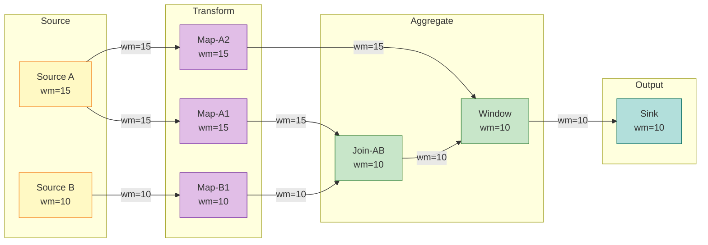

# Watermark 单调性定理 (Watermark Monotonicity Theorem)

> 所属阶段: Struct/02-properties | 前置依赖: [01.04-dataflow-model-formalization.md](../01-foundation/01.04-dataflow-model-formalization.md) | 形式化等级: L5

---

## 目录

- [Watermark 单调性定理 (Watermark Monotonicity Theorem)](#watermark-单调性定理-watermark-monotonicity-theorem)
  - [目录](#目录)
  - [1. 概念定义 (Definitions)](#1-概念定义-definitions)
    - [Def-S-09-01 (事件时间 Event Time)](#def-s-09-01-事件时间-event-time)
    - [Def-S-09-02 (水印 Watermark)](#def-s-09-02-水印-watermark)
    - [迟到数据 (Late Data)](#迟到数据-late-data)
    - [窗口触发器 (Window Trigger)](#窗口触发器-window-trigger)
  - [2. 属性推导 (Properties)](#2-属性推导-properties)
    - [Lemma-S-09-01 (最小值保持单调性)](#lemma-s-09-01-最小值保持单调性)
  - [3. 关系建立 (Relations)](#3-关系建立-relations)
    - [关系 1: Watermark 单调性与 Dataflow 模型形式化的衔接](#关系-1-watermark-单调性与-dataflow-模型形式化的衔接)
    - [关系 2: Watermark 单调性与 Kahn 进程网络偏序](#关系-2-watermark-单调性与-kahn-进程网络偏序)
    - [关系 3: Watermark 单调性与 Checkpoint 一致性](#关系-3-watermark-单调性与-checkpoint-一致性)
  - [4. 论证过程 (Argumentation)](#4-论证过程-argumentation)
    - [4.1 基于流前缀的偏序归纳框架](#41-基于流前缀的偏序归纳框架)
    - [4.2 空闲源与 Watermark 推进的边界讨论](#42-空闲源与-watermark-推进的边界讨论)
    - [4.3 破坏单调性的反例构造](#43-破坏单调性的反例构造)
  - [5. 形式证明 / 工程论证 (Proof / Engineering Argument)](#5-形式证明-工程论证-proof-engineering-argument)
    - [Thm-S-09-01 (Watermark 单调性定理)](#thm-s-09-01-watermark-单调性定理)
    - [步骤 1：基例 — Source 算子的 Watermark 单调性](#步骤-1-基例--source-算子的-watermark-单调性)
    - [步骤 2：归纳假设](#步骤-2归纳假设)
    - [步骤 3：归纳步骤 — 第 $k$ 个算子的单调性保持](#步骤-3-归纳步骤--第-k-个算子的单调性保持)
      - [情况 A：单输入单输出算子（Map、Filter、FlatMap 等）](#情况-a单输入单输出算子mapfilterflatmap-等)
      - [情况 B：多输入单输出算子（Join、Union、CoGroup 等）](#情况-b多输入单输出算子joinunioncogroup-等)
    - [步骤 4：结论](#步骤-4结论)
    - [推论 (Corollaries)](#推论-corollaries)
  - [6. 实例验证 (Examples)](#6-实例验证-examples)
    - [示例 6.1: 三算子 DAG 中的 Watermark 单调推进](#示例-61-三算子-dag-中的-watermark-单调推进)
    - [反例 6.2: 非单调 Watermark 导致窗口重复触发](#反例-62-非单调-watermark-导致窗口重复触发)
  - [7. 可视化 (Visualizations)](#7-可视化-visualizations)
  - [8. 引用参考 (References)](#8-引用参考-references)

## 1. 概念定义 (Definitions)

本节为 Watermark 单调性定理建立严格的形式化基础。所有定义均基于事件时间语义，并直接服务于后续的引理推导与定理证明。

### Def-S-09-01 (事件时间 Event Time)

设 $\ ext{Record}$ 为流中所有可能记录的集合，$\mathbb{T} = \mathbb{R}_{\geq 0}$ 为时间域。事件时间是一个从记录到时间域的映射：

$$
t_e: \text{Record} \to \mathbb{T}
$$

对于任意记录 $r \in \text{Record}$，$t_e(r)$ 表示该记录在业务逻辑中产生时刻的时间戳，由数据源在生成记录时附加，且在后续处理过程中不可被流处理系统修改。

**直观解释**：事件时间是数据本身携带的"业务发生时刻"，与数据何时到达系统、何时被处理完全解耦，是乱序流上保证结果确定性的唯一可靠时间基准 [^1][^3]。

**定义动机**：在分布式环境中，网络延迟、背压和重传导致记录的物理到达顺序与其事件时间顺序不一致。事件时间将计算语义与物理传输解耦，是流处理正确性的必要前提。

---

### Def-S-09-02 (水印 Watermark)

Watermark 是流处理系统向数据流中注入的一种特殊进度信标（progress indicator），形式化为从数据流到时间域的单调函数：

$$
wm: \text{Stream} \to \mathbb{T} \cup \{+\infty\}
$$

设当前观察到的 watermark 值为 $w$，其语义断言为：

$$
\forall r \in \text{Stream}_{\text{future}}. \; t_e(r) \geq w \lor \text{Late}(r, w)
$$

即：所有事件时间严格小于 $w$ 的记录，要么已经到达并被处理，要么已被系统判定为"迟到"而不再被目标窗口接受。

**Watermark 生成策略**：在 Source 端，最常见的周期性生成策略为

$$
wm(t) = \max_{r \in \text{Observed}(t)} t_e(r) - \delta
$$

其中 $\delta \geq 0$ 为系统容忍的最大乱序边界（max out-of-orderness），$\text{Observed}(t)$ 表示到处理时刻 $t$ 为止 Source 已接收到的所有记录集合。

**直观解释**：Watermark 是系统发出的"进度信号"，告诉下游算子"事件时间小于等于当前 Watermark 的数据不会再正常到达了" [^1][^2]。

**定义动机**：在无限流上，系统永远无法确定"是否还有更老的数据未到"。Watermark 通过引入有界的不确定性假设，将无限等待转化为可决策的进度推进机制，使得窗口可以在有限延迟内触发并输出结果。

---

### 迟到数据 (Late Data)

给定一个已配置的允许延迟参数 $L \geq 0$（allowed lateness），记录 $r$ 相对于当前 watermark $w$ 的"迟到"判定谓词定义为：

$$
\text{Late}(r, w) \iff t_e(r) \leq w - L
$$

当 $L = 0$ 时，判定条件简化为 $t_e(r) \leq w$。当 $L > 0$ 时，系统在 watermark 越过窗口结束时间后仍保留一段宽限期，允许事件时间落在 $[w-L, w]$ 范围内的记录被重新纳入窗口计算 [^2][^3]。

---

### 窗口触发器 (Window Trigger)

设窗口 $W$ 是事件时间轴上的一个左闭右开区间 $W = [t_{\text{start}}, t_{\text{end}}) \subseteq \mathbb{T}$。基于 Watermark 的窗口触发器 $Tr$ 是决定窗口何时从"活跃"状态转换为"可输出"状态的谓词：

$$
Tr(W, w) \in \{\text{FIRE}, \text{CONTINUE}\}
$$

其形式化定义为：

$$
Tr(W, w) = \text{FIRE} \iff w \geq t_{\text{end}}(W) + L
$$

其中 $L$ 为允许延迟参数。触发器仅依赖于当前 watermark 值 $w$ 和窗口本身的结束时间 $t_{\text{end}}(W)$，与处理时间、到达顺序无关。

**直观解释**：触发器是窗口的"闹钟"，决定系统何时将窗口内已聚合的结果发往下游。Watermark 单调性保证这个"闹钟"只会响一次，从而保证结果的唯一性 [^1][^3]。

---

## 2. 属性推导 (Properties)

### Lemma-S-09-01 (最小值保持单调性)

设 $A^{(1)}, A^{(2)}, \ldots, A^{(n)}$ 为 $n$ 个单调不减的序列，其中 $A^{(i)} = \langle a^{(i)}_1, a^{(i)}_2, \ldots \rangle$ 满足 $\forall k: a^{(i)}_k \leq a^{(i)}_{k+1}$。定义序列 $C = \langle c_1, c_2, \ldots \rangle$ 为：

$$
c_k = \min_{1 \leq i \leq n} a^{(i)}_k
$$

则 $C$ 也是单调不减序列，即 $\forall k: c_k \leq c_{k+1}$。

**证明**：

对于任意时刻 $k$ 和 $k+1$：

1. 由假设，每个输入序列单调不减，因此 $\forall i: a^{(i)}_k \leq a^{(i)}_{k+1}$。
2. 考虑 $c_k = \min_i a^{(i)}_k$。不妨设该最小值由某个下标 $j$ 取得，即 $c_k = a^{(j)}_k$。
3. 则 $c_k = a^{(j)}_k \leq a^{(j)}_{k+1}$。
4. 而 $c_{k+1} = \min_i a^{(i)}_{k+1} \leq a^{(j)}_{k+1}$。
5. 综合步骤 3 和 4，得 $c_k \leq c_{k+1}$。

由 $k$ 的任意性，$C$ 单调不减。 ∎

**语义解释**：在 Flink 等多输入算子中，输出 Watermark 通常取所有输入 Watermark 的最小值。本引理保证：即使多个上游流的进度不同步，最小值操作本身不会破坏 Watermark 的单调性。

---

## 3. 关系建立 (Relations)

### 关系 1: Watermark 单调性与 Dataflow 模型形式化的衔接

本文档的 Watermark 单调性定理是对 [01.04-dataflow-model-formalization.md](../01-foundation/01.04-dataflow-model-formalization.md) 中 **Def-S-04-04** 和 **Lemma-S-04-02** 的严格深化与独立证明。

- **编码存在性**：Def-S-04-04 将 Watermark 定义为进度信标 $w: \text{Stream} \to \mathbb{T} \cup \{+\infty\}$。本文档的 Def-S-09-02 在此基础上显式引入了迟到数据谓词和允许延迟参数，使语义断言更完备。
- **分离结果**：Lemma-S-04-02 通过拓扑排序归纳给出了 Dataflow 图中 Watermark 单调不减的推导。本文档的 Thm-S-09-01 进一步对 Source 算子进行**基于流前缀的归纳证明**，将单调性保证提升到 L5 形式化等级。

> **推断 [Model→Property]**: Dataflow 模型中的 Watermark 语义约束（Def-S-04-04）与算子局部确定性（Lemma-S-04-01）共同蕴含了全局 Watermark 单调性（Thm-S-09-01），而全局单调性又是 **Thm-S-04-01**（Dataflow 确定性定理）的关键前提之一。

### 关系 2: Watermark 单调性与 Kahn 进程网络偏序

**论证**：

Kahn Process Network (KPN) 的确定性建立在 FIFO 通道和进程连续函数的基础上。Dataflow 模型引入事件时间偏序后，物理到达顺序可能与事件时间偏序不一致。Watermark 单调性可以被视为在事件时间偏序上的一个**标量下界同步机制**，将无限流上的偏序推进显式化为单调不减的标量序列。

因此，Watermark 单调性是 KPN 确定性语义在**允许有限乱序**的流处理场景下的必要扩展。没有单调性保证，窗口触发时刻将依赖于乱序到达的具体时序，从而破坏结果确定性。

### 关系 3: Watermark 单调性与 Checkpoint 一致性

**论证**：

Flink 的 Checkpoint 机制基于 Chandy-Lamport 分布式快照算法。快照中每个算子必须持久化其当前 Watermark $w_{\text{checkpointed}}$，恢复时 $w_{\text{recovered}} = w_{\text{checkpointed}}$。

如果恢复后的 Watermark 可以从比 $w_{\text{checkpointed}}$ 更小的值重新开始，则已经触发过的窗口可能再次触发，导致重复输出，破坏 Exactly-Once 语义。因此，Checkpoint 一致性要求 Watermark 单调性必须被**持久化到检查点状态**中 [^2][^3]。


---

## 4. 论证过程 (Argumentation)

本节提供辅助引理、反例分析和边界讨论，为 Watermark 单调性定理的严格证明做准备。

### 4.1 基于流前缀的偏序归纳框架

设 Source $s$ 在处理时间 $t$ 之前观察到的记录集合为 $R(t) \subseteq \text{Record}$。由于系统不断接收新数据，$R(t)$ 随时间单调扩张：$t_1 < t_2 \implies R(t_1) \subseteq R(t_2)$。对于周期性 Watermark 生成策略 $\wm_s(t) = \max_{r \in R(t)} t_e(r) - \delta$，函数 $g(R) = \max_{r \in R} t_e(r)$ 关于集合包含是单调的。因此，$\wm_s(t)$ 关于处理时间 $t$ 单调不减。这一观察构成了后续定理证明中"基例"的核心——我们将通过对流前缀进行归纳，证明 Source Watermark 的单调性。

### 4.2 空闲源与 Watermark 推进的边界讨论

在多输入算子中，输出 Watermark 通常定义为所有活跃输入 Watermark 的最小值：$\wm_{\text{out}}(t) = \min_{j \in \text{Active}(t)} \wm_{\text{in}_j}(t)$。若输入源 $k$ 在区间 $[t_0, t_0 + \Delta]$ 内无输出，系统可将其标记为空闲并从最小值计算中移除。

**边界分析**：

- 若不移除空闲源，其停滞的 Watermark 会通过最小值传播阻塞整个 DAG 的进度，导致 watermark 长时间不增长，下游窗口无法触发。
- 只要活跃输入的 Watermark 单调不减，Lemma-S-09-01 仍然适用。因此，空闲源机制是**防止全局进度被局部静默性拖垮**的必要补偿策略，且不破坏单调性保证。

### 4.3 破坏单调性的反例构造

**反例**：假设某算子错误地实现 Watermark 传播逻辑，使其输出 Watermark 等于输入 Watermark 减去一个随机扰动 $\epsilon(t) > 0$：$\wm_{\text{out}}(t) = \wm_{\text{in}}(t) - \epsilon(t)$。

考虑 $t_1 < t_2$：输入 watermark 从 10 增至 12，若 $\epsilon(t_1)=1, \epsilon(t_2)=5$，则输出 watermark 从 9 降至 7，单调性被破坏。

**后果**：当 Watermark 倒退时，下游窗口可能已经基于 $w=9$ 触发了 $[0, 9)$ 的输出。若 Watermark 回退到 $w=7$，系统要么重新触发窗口导致重复输出（破坏 Exactly-Once），要么忽略回退导致语义断言与已触发窗口矛盾。因此，Watermark 单调不减是流处理系统状态一致性的**核心不变式** [^1][^2]。

---

## 5. 形式证明 / 工程论证 (Proof / Engineering Argument)

### Thm-S-09-01 (Watermark 单调性定理)

设 $\mathcal{G} = (V, E, P, \Sigma, \mathbb{T})$ 为一个采用事件时间语义的 Dataflow 有向无环图（满足 [01.04-dataflow-model-formalization.md](../01-foundation/01.04-dataflow-model-formalization.md) 中 Def-S-04-01 的所有约束）。对于图中任意算子 $v \in V$，设其输出 Watermark 序列为 $\{w_v(t)\}_{t \in \mathbb{T}}$（其中 $t$ 为处理时间或离散的流前缀索引），则该序列满足单调不减：

$$
\forall v \in V, \; \forall t_1 \leq t_2: \quad w_v(t_1) \leq w_v(t_2)
$$

即：**Source 产生的 Watermark 单调不减，且该性质在流经任意算子后仍然保持**。

---

**证明**：

我们采用**结构归纳法**（structural induction）对 Dataflow 图 $\mathcal{G}$ 的拓扑排序进行证明。设 $v_1, v_2, \ldots, v_{|V|}$ 是 $\mathcal{G}$ 的一个拓扑排序（由 Def-S-04-01 的无环性保证存在）。

### 步骤 1：基例 — Source 算子的 Watermark 单调性

考虑任意 Source 算子 $s \in V_{\text{src}}$。设 $R_s(t)$ 为 Source $s$ 到处理时刻 $t$ 为止已观察到的记录集合。根据 Def-S-09-02，Source 的周期性 Watermark 生成策略为 $w_s(t) = \max_{r \in R_s(t)} t_e(r) - \delta_s$，其中 $\delta_s \geq 0$ 为固定最大乱序容忍参数。

**对流前缀进行归纳**：

- **基例**：当 $t = t_0$（系统启动时刻），$R_s(t_0) = \emptyset$，$w_s(t_0) = -\infty$。对于任意 $t \geq t_0$，$w_s(t) \geq w_s(t_0)$ 显然成立。
- **归纳步骤**：设时刻 $t$ 时单调性成立。考虑新接收记录集合 $\Delta R = R_s(t+\Delta t) \setminus R_s(t)$。
  - 若 $\Delta R = \emptyset$，则 $w_s(t+\Delta t) = w_s(t)$。
  - 若 $\Delta R \neq \emptyset$，则 $\max_{r \in R_s(t+\Delta t)} t_e(r) \geq \max_{r \in R_s(t)} t_e(r)$，两边同减 $\delta_s$ 得 $w_s(t+\Delta t) \geq w_s(t)$。

由归纳法，Source 算子的 Watermark 序列单调不减。 ∎(基例)

### 步骤 2：归纳假设

假设对于拓扑排序中前 $k-1$ 个算子 $v_1, v_2, \ldots, v_{k-1}$，其输出 Watermark 均满足单调不减性质。即：

$$
\forall j < k, \; \forall t_1 \leq t_2: \quad w_{v_j}(t_1) \leq w_{v_j}(t_2)
$$

### 步骤 3：归纳步骤 — 第 $k$ 个算子的单调性保持

考虑第 $k$ 个算子 $v_k$。根据算子类型，分两种情况讨论：

#### 情况 A：单输入单输出算子（Map、Filter、FlatMap 等）

设 $v_k$ 的唯一上游输入为 $u$。根据 Def-S-04-02，此类算子不对记录进行时间重排，传播规则为 $w_{v_k}(t) = w_u(t) - d_{\text{proc}}$，其中 $d_{\text{proc}} \geq 0$ 为固定处理延迟。

由归纳假设，$w_u(t)$ 单调不减。对于任意 $t_1 \leq t_2$：$w_u(t_1) \leq w_u(t_2) \implies w_{v_k}(t_1) \leq w_{v_k}(t_2)$。

因此，单输入算子保持 Watermark 单调性。 ∎(情况 A)

#### 情况 B：多输入单输出算子（Join、Union、CoGroup 等）

设 $v_k$ 有 $m \geq 2$ 个上游输入 $u_1, \ldots, u_m$。根据 Def-S-04-04，多输入算子的输出 Watermark 取所有输入的最小值：$w_{v_k}(t) = \min_i w_{u_i}(t)$。

由归纳假设，每个 $w_{u_i}(t)$ 单调不减。根据 **Lemma-S-09-01**，$w_{v_k}(t)$ 也是单调不减序列。 ∎(情况 B)

### 步骤 4：结论

由数学归纳法，对于拓扑排序中每一个算子 $v_k$，其输出 Watermark 均单调不减。因此：

$$
\boxed{\forall v \in V, \; \forall t_1 \leq t_2: \quad w_v(t_1) \leq w_v(t_2)}
$$

∎

---

### 推论 (Corollaries)

由 Thm-S-09-01 可直接推出以下重要结论：

**推论 1 (窗口触发唯一性)**：若窗口 $W$ 基于 Watermark 触发（$\text{Trigger}(W, w) = \text{FIRE} \iff w \geq t_{\text{end}}(W) + L$），则窗口首次触发后，不会因 Watermark 再次推进而对同一窗口重复触发首次输出。

*证明*：设窗口在 $w_k$ 处首次触发，则 $w_k \geq t_{\text{end}}(W) + L$。由 Thm-S-09-01，对于所有后续 watermark $w_j$（$j > k$），有 $w_j \geq w_k \geq t_{\text{end}}(W) + L$。触发条件一旦满足即永久为真，不会再次以"首次触发"的方式输出同一窗口结果。 ∎

**推论 2 (结果完备性)**：若 Watermark $w$ 满足完整性断言（Def-S-09-02），且窗口 $W$ 在 $w \geq t_{\text{end}}(W) + L$ 时触发，则窗口结果包含所有事件时间落在 $W$ 内且未被判定为迟到的记录。

*证明*：对于任意记录 $r$ 满足 $t_{\text{start}}(W) \leq t_e(r) < t_{\text{end}}(W) \leq w$。由 Watermark 断言，$t_e(r) < w$ 意味着 $r$ 已经到达或已被判定为迟到。若 $r$ 未被判定为迟到，则它已被分配到窗口 $W$ 并参与聚合计算。 ∎

**推论 3 (Checkpoint 恢复安全性)**：在 Flink 的 Checkpoint 机制下，恢复后的 Watermark 不会倒退，因此已经触发过的窗口不会再次重复输出，Exactly-Once 语义得以保持 [^2][^3]。

---

## 6. 实例验证 (Examples)

### 示例 6.1: 三算子 DAG 中的 Watermark 单调推进

考虑一个简化事件时间流处理作业，Dataflow 图包含 Source-1 ($S_1$)、Map-1 ($M_1$)、Window-Aggregate-1 ($W_1$)。Source 采用周期性 Watermark 策略，$\delta = 2$ 秒；Map 透传 Watermark；Window 为滚动窗口 $[0, 10)$，$L = 0$。

| $t$ | 记录 | $t_e$ | $\max t_e$ | $w_{S_1}$ | $w_{M_1}$ | 状态 |
|----|------|-------|------------|----------|----------|------|
| 0 | $r_1$ | 3 | 3 | 1 | 1 | [0,10) 累积 |
| 1 | $r_2$ | 5 | 5 | 3 | 3 | [0,10) 累积 |
| 2 | $r_3$ | 7 | 7 | 5 | 5 | [0,10) 累积 |
| 3 | $r_4$ | 4 | 7 | 5 | 5 | [0,10) 累积（乱序到达但不回退） |
| 4 | $r_5$ | 9 | 9 | 7 | 7 | [0,10) 累积 |
| 5 | $r_6$ | 11 | 11 | 9 | 9 | [0,10) 未触发 |
| 6 | $r_7$ | 12 | 12 | 10 | 10 | **[0,10) 触发** |

**分析**：在 $t=3$ 时 $r_4$ 乱序到达，但 $\max t_e$ 仍为 7，Watermark 不回退，体现单调性。$t=6$ 时 $w=10$ 首次满足触发条件，窗口输出结果。由 Thm-S-09-01，后续 Watermark 不会低于 10，不会重复触发。

### 反例 6.2: 非单调 Watermark 导致窗口重复触发

假设开发者在自定义 `ProcessFunction` 中错误地将输出 Watermark 设为当前记录事件时间减去随机值：

```java
// 错误实现示例
public void onWatermark(Watermark wm, Context ctx, Collector<Out> out) {
    long randomDelay = (long)(Math.random() * 5);
    ctx.emitWatermark(new Watermark(currentElementTimestamp - randomDelay));
}
```

| 步骤 | 上游 $w$ | 元素 $t_e$ | 随机延迟 | 输出 $w$ | 后果 |
|-----|---------|-----------|---------|---------|------|
| 1 | 10 | 12 | 2 | 10 | 窗口 [0,10) 触发 |
| 2 | 11 | 13 | 4 | 9 | **Watermark 倒退!** |
| 3 | 12 | 14 | 1 | 13 | 可能重复触发 |

**分析**：步骤 2 中 Watermark 从 10 倒退到 9，导致已触发窗口的状态与进度信标语义矛盾。步骤 3 中若系统未防御重复触发，将破坏 Exactly-Once 语义。因此，任何自定义算子发射 Watermark 时都必须保证输出值不小于此前已发射的最大值 [^2][^3]。

---

## 7. 可视化 (Visualizations)

下图展示了一个典型 Dataflow DAG 中的 Watermark 传播过程。黄色节点为 Source，紫色为 Map，绿色为 Join/Window，青色为 Sink。



**图说明**：Source A 的 Watermark 为 15，Source B 为 10。Map 算子直接透传输入 Watermark。Join-AB 作为多输入算子，输出 Watermark 取最小值 $\min(15, 10) = 10$。Window 算子接收多个输入后同样收敛到 10。Sink 接收到 Watermark 10，表示事件时间 $\leq 10$ 的记录已完整处理。此图直观展示了 **Thm-S-09-01** 的工程实现：尽管 DAG 中不同分支进度不同，但每个节点本地的 Watermark 序列都保持单调不减。

---

## 8. 引用参考 (References)

[^1]: T. Akidau et al., "The Dataflow Model: A Practical Approach to Balancing Correctness, Latency, and Cost in Massive-Scale, Unbounded, Out-of-Order Data Processing," *PVLDB*, 8(12), 2015.

[^2]: Apache Flink Documentation, "Event Time and Watermarks," 2025. <https://nightlies.apache.org/flink/flink-docs-stable/docs/concepts/time/>

[^3]: P. Carbone et al., "Apache Flink: Stream and Batch Processing in a Single Engine," *IEEE Data Engineering Bulletin*, 38(4), 2015.


---

*文档版本: v1.0 | 更新日期: 2026-04-02 | 状态: 已完成*
