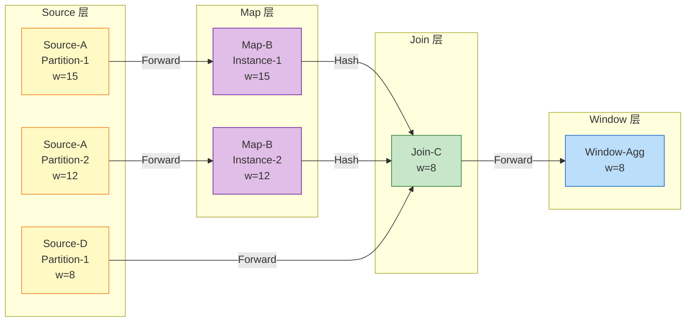

# Watermark 单调性定理 (Watermark Monotonicity Theorem)

> 所属阶段: Struct/02-properties | 前置依赖: [../01-foundation/01.04-dataflow-model-formalization.md](../01-foundation/01.04-dataflow-model-formalization.md) | 形式化等级: L5

---

## 1. 概念定义 (Definitions)

本节在 Dataflow 模型形式化框架 [../01-foundation/01.04-dataflow-model-formalization.md](../01-foundation/01.04-dataflow-model-formalization.md) 的基础上，建立 Watermark 机制的核心形式化定义。

### Def-S-09-01 (Watermark 作为分区到时间戳的映射)

在 Dataflow 图 $\mathcal{G} = (V, E, P, \Sigma, \mathbb{T})$ 中，Watermark 被严格形式化为从**数据分区**到**事件时间戳**的函数：

$$W: P \to \mathbb{T}$$

其中 $P$ 是数据流的所有逻辑分区构成的集合，$\mathbb{T} = \mathbb{R}_{\geq 0} \cup \{+\infty\}$ 为扩展事件时间域。$W(p)$ 的语义断言为："对于分区 $p$，所有事件时间严格小于 $W(p)$ 的记录要么已经到达，要么已被判定为迟到" [^1][^2]：

$$\forall p \in P, \; \forall r \in \text{Future}(p): \; t_e(r) \geq W(p) \;\lor\; \text{Late}(r, W(p))$$

**直观解释**：Watermark 是绑定到分区层面的进度信号，在每个数据分区上独立演进，随后通过算子语义合并传播。它是后续证明全局单调性的基础。

---

### Def-S-09-02 (事件时间进度)

事件时间进度 $\Phi$ 描述系统对无限事件时间轴的推进程度：

$$\Phi: V \times P \times \mathbb{T}_{proc} \to \mathbb{T}, \quad \Phi(v, p, \tau) = W_v(p, \tau)$$

算子 $v$ 的**全局事件时间进度**为其所有输入分区 Watermark 的保守下界：

$$\Phi_{global}(v, \tau) = \min_{p \in \text{InPartitions}(v)} W_v(p, \tau)$$

**直观解释**：全局进度回答了"系统在处理时间 $\tau$ 时已经确信事件时间推进到了哪一刻"，是窗口触发、状态清理和 Checkpoint 协调的共同基础 [^1][^3]。

---

### Def-S-09-03 (Watermark 生成规则与传播规则)

**生成规则**：对于 Source 算子分区 $p$，设已观察记录集合为 $R(p, \tau)$：

- **周期性有界乱序**：$W_{gen}(p, \tau) = \max_{r \in R(p, \tau)} t_e(r) - \delta$，其中 $\delta \geq 0$ 为最大乱序容忍度 [^3]；
- **单调生成**：$W_{gen}(p, \tau) = \max_{r \in R(p, \tau)} t_e(r)$（$\delta = 0$ 的特例）；
- **标点生成**：$W_{gen}(p, \tau) = t_e(r_{wm}) - \epsilon$，其中 $r_{wm}$ 为显式标点记录。

**传播规则**：设算子 $op$ 有 $n$ 个输入分区，Watermark 分别为 $W_{in}(p_1), \ldots, W_{in}(p_n)$：

- **单输入算子**（Map, Filter, FlatMap）：$W_{out} = W_{in} - d_{proc}$，$d_{proc} \geq 0$；
- **多输入对齐/合并算子**（Join, CoGroup, Union）：$W_{out} = \min_{i=1}^{n} W_{in}(p_i)$；
- **拆分算子**：$\forall j: W_{out}^{(j)} = W_{in} - d_{proc}^{(j)}$。

**空闲源规则**：若分区 $p_i$ 在 $[\tau_0, \tau_0 + \theta]$ 内无记录到达，则被标记为 idle，在最小值计算中排除：

$$W_{out}(p_{out}, \tau) = \min_{p_j \in \text{Active}(\tau)} W_{in}(p_j)$$

其中 $\theta > 0$ 为空闲超时阈值 [^3]。

**直观解释**：生成规则铸造 Watermark，传播规则决定其在 DAG 中的流动方式，空闲源规则防止局部静默拖垮全局进度。

---

## 2. 属性推导 (Properties)

### Lemma-S-09-01 (Source Watermark 单调性)

**陈述**：对于任意 Source 算子分区 $p$，其生成的 Watermark 随处理时间单调不减：

$$\forall \tau_1 < \tau_2, \quad W_{gen}(p, \tau_1) \leq W_{gen}(p, \tau_2)$$

**推导**：

1. 由 Def-S-09-03，$W_{gen}(p, \tau) = \max_{r \in R(p, \tau)} t_e(r) - \delta$；
2. 当 $\tau_1 < \tau_2$ 时，$R(p, \tau_1) \subseteq R(p, \tau_2)$；
3. 故 $\max_{r \in R(p, \tau_1)} t_e(r) \leq \max_{r \in R(p, \tau_2)} t_e(r)$；
4. 两边同减常数 $\delta$，得证。标点生成与单调生成同理成立。 ∎

> **推断 [Control→Execution]**: Source Watermark 的单调性要求单分区 FIFO 传输。Flink 通过 Netty TCP 连接维护这一前提 [^3][^4]。

---

### Prop-S-09-01 (最小值算子保持单调性)

**陈述**：设 $A(\tau), B(\tau)$ 单调不减，则 $C(\tau) = \min(A(\tau), B(\tau))$ 也单调不减。

**推导**：任取 $\tau_1 < \tau_2$，则 $A(\tau_1) \leq A(\tau_2)$，$B(\tau_1) \leq B(\tau_2)$。$C(\tau_1) = \min(A(\tau_1), B(\tau_1)) \leq A(\tau_1) \leq A(\tau_2)$，同理 $\leq B(\tau_2)$，故 $\leq \min(A(\tau_2), B(\tau_2)) = C(\tau_2)$。 ∎

---

## 3. 关系建立 (Relations)

### 关系 1: Watermark 单调性 `↦` Dataflow 确定性

Dataflow 模型将流视为偏序多重集（Def-S-04-03）。Watermark $W: P \to \mathbb{T}$ 是插入偏序结构中的**同步屏障**，将无限流切分为"已完整"和"尚未完整"两个区域 [^1][^4]。没有 Watermark，窗口算子永远无法确定何时安全触发；单调性通过保证进度信号永不倒退，将逻辑触发序列从物理乱序中剥离，使 Event Time 语义下的窗口触发是确定性的。

> **推断 [Theory→Implementation]**: Watermark 单调性是 Flink Exactly-Once 语义的必要条件。若 Watermark 倒退，已提交的窗口结果可能需要撤回，破坏端到端一致性 [^2][^3]。

### 关系 2: Watermark 传播代数 `≈` 有界格

Watermark 值域 $\mathcal{W} = \mathbb{T} \cup \{-\infty\}$ 配备标准序构成格。多输入对齐 $w_{out} = \min_i w_{in_i}$ 即 **meet 运算** $\sqcap$；并行分区合并可用 **join 运算** $\sqcup = \max$ 表达 [^5]。该格满足结合律、交换律和幂等律，意味着无论 DAG 拓扑多复杂，Watermark 传播结果都与路径无关——这正是 Flink 无需全局 Watermark 协调器的理论基础。

---

## 4. 论证过程 (Argumentation)

### 4.1 多输入算子的保守性

**辅助命题**：对于 $n$ 输入算子，若 $w_{out} = \min_i w_{in_i} \geq t$，则所有输入分区都已处理了事件时间严格小于 $t$ 的记录。

**分析**：由 $w_{out} = \min_i w_{in_i} \geq t$ 得 $\forall i: w_{in_i} \geq t$。再由 Def-S-09-01 的语义，各输入上所有 $t_e < t$ 的记录已到达或已迟到。因此 Join、CoGroup 等算子在此条件下不会产生遗漏 [^1][^2]。

### 4.2 破坏单调性的反例

**反例 1（非 FIFO 通道）**：Source 发送 $w_1=10, w_2=20$，但下游因乱序先收到 20 再收到 10。窗口 $[0,15)$ 在 $w=20$ 时触发，随后 $w=10$ 到达意味着"还有 $t_e<10$ 的数据可能未到"，但窗口已关闭，结果不可撤回，确定性被破坏 [^3][^4]。

**反例 2（空闲源未配置）**：Join 算子的输入 $A$ 活跃（$w_A$ 持续推进），输入 $B$ 停滞在 $w_B=50$。则 $w_{out}=\min(w_A, 50)=50$ 永远不变，所有下游窗口无法触发。这验证了空闲源规则的必要性 [^3]。

---

## 5. 形式证明 (Proofs)

### Thm-S-09-01 (Watermark 单调性定理)

**陈述**：在任意无环 Dataflow 图 $\mathcal{G} = (V, E, P, \Sigma, \mathbb{T})$ 中，若：

1. 所有边 $e \in E$ 保证单分区 FIFO 传输；
2. Source 算子采用 Def-S-09-03 的生成策略；
3. 中间算子采用 Def-S-09-03 的传播规则；
4. 空闲源超时机制正确工作（若配置）；

则对任意算子 $v \in V$ 的任意分区 $p$：

$$\forall \tau_1 < \tau_2: \quad W_v(p, \tau_1) \leq W_v(p, \tau_2)$$

**证明**：

对 Dataflow 图做拓扑排序 $v_1, v_2, \ldots, v_m$，按拓扑层次进行结构归纳。

**基例（Source）**：由 Lemma-S-09-01，任意 Source 分区 $p$ 的 $W_{v_1}(p, \tau)$ 单调不减。基例成立。

**归纳假设**：假设前 $k-1$ 个算子的所有分区 Watermark 均单调不减。

**归纳步骤（算子 $v_k$）**：分三类讨论：

1. **单输入算子**（Map, Filter, FlatMap）：设输入来自 $v_j$（$j<k$）的分区 $p_{in}$。由归纳假设 $W_{v_j}(p_{in}, \tau)$ 单调不减。传播规则为 $W_{v_k}(p_{out}, \tau) = W_{v_j}(p_{in}, \tau) - d_{proc}$，$d_{proc} \geq 0$ 为常数，故单调性保持。

2. **多输入对齐/合并算子**（Join, CoGroup, Union）：设 $n$ 个输入分别来自上游 $u_1, \ldots, u_n$（序号均 $<k$）。由归纳假设各 $W_{u_i}(p_i, \tau)$ 单调不减。传播规则为 $W_{v_k}(p_{out}, \tau) = \min_i W_{u_i}(p_i, \tau)$。由 Prop-S-09-01，最小值保持单调性。

3. **拆分算子**：每个输出分区的 Watermark 为输入 Watermark 减去非负常数，单调性继承自输入。

**空闲源补充**：当某输入 $p_i$ 被标记为 idle 时，最小值运算排除该输入。由于移除的是最小值候选之一，新的最小值不会小于旧值，Watermark 不会倒退。

由结构归纳法，图中所有算子的所有分区上的 Watermark 均单调不减。 ∎

**关键案例**：

- **理想流**（$\delta=0$）：Watermark 严格跟随最大事件时间，只在观察到更晚事件时推进。
- **有界乱序流**（$\delta>0$）：Watermark 可能暂时停滞，但绝不会倒退。
- **空闲源激活**：$w_{out}$ 可能跳跃上升，但仍是单调不减的。

> **推断 [Control→Execution]**: 单调性定理保证 Checkpoint 可安全持久化当前 Watermark。恢复时从该值继续推进，不会导致窗口重复触发 [^2][^3]。

---

## 6. 实例验证 (Examples)

### 示例 6.1: 三节点 DAG 的 Watermark 传播

拓扑：Source A（2 分区）$\to$ Map B（2 实例）$\to$ Join C（1 实例）$\leftarrow$ Source D（1 分区）。设 $d_{proc} \approx 0$：

| $\tau$ | $W_{A,1}$ | $W_{A,2}$ | $W_{B,1}$ | $W_{B,2}$ | $W_D$ | $W_C$ |
|---|---|---|---|---|---|---|
| 1 | 5 | 3 | 5 | 3 | 2 | 2 |
| 2 | 10 | 8 | 10 | 8 | 4 | 4 |
| 3 | 15 | 12 | 15 | 12 | 6 | 6 |
| 4 | 20 | 18 | 20 | 18 | 8 | 8 |

Join C 的 Watermark 序列 $2, 4, 6, 8$ 始终单调不减，验证了 Thm-S-09-01。同时也体现了"短板效应"——全局进度由最慢的 Source D 决定。

---

### 示例 6.2: 滚动窗口触发验证

窗口 $[0,10)$，$F=0$，Source 采用 $\delta=2$：

| 到达顺序 | $t_e$ | $\max t_e$ | $w$ | 窗口状态 |
|---|---|---|---|---|
| 1 | 3 | 3 | 1 | 累积 |
| 2 | 7 | 7 | 5 | 累积 |
| 3 | 5 | 7 | 5 | 累积（容忍范围内）|
| 4 | 12 | 12 | 10 | **触发** |
| 5 | 8 | 12 | 10 | 迟到丢弃 |

事件 4 使 $w=10 \geq t_{end}$，窗口触发。后续 $w$ 只会更大，不会重新打开 $[0,10)$。

---

### 反例 6.1: 延迟配置过大导致高延迟

实际乱序 $\leq 1$s，但配置 $\delta=30$s：

| 实际时间 | $t_e$ | $w$ | 窗口 [0,10) |
|---|---|---|---|
| 10s | 10 | -20 | 不触发 |
| 40s | 40 | 10 | **触发（延迟 30s）** |

结果正确但延迟极高，体现了正确性-延迟的显式权衡 [^1][^3]。

---

### 反例 6.2: 空闲源导致全局停滞

Join 的输入 A 活跃，输入 B 每小时一条记录且未配置 idle：

| 时间 | $w_A$ | $w_B$ | $w_{Join}$ |
|---|---|---|---|
| 0 | 100 | 100 | 100 |
| 5min | 5000 | 100 | 100 |
| 1h | 360000 | 100 | 100 |

$w_{Join}$ 永远卡在 100，下游窗口全部停滞。必须配置 `withIdleness` 以排除空闲分区 [^3]。

---

## 7. 可视化 (Visualizations)

下图展示 Watermark 在典型 DAG 中的生成、透传与最小值对齐过程。

**图说明**：黄色 Source 生成本地 Watermark；紫色 Map 基本透传；绿色 Join 通过 $w_{out}=\min(15,12,8)=8$ 对齐；蓝色 Window-Agg 依据 Watermark 触发窗口。无论上游差异多大，下游 Watermark 始终单调不减。

---

## 8. 引用参考 (References)

[^1]: T. Akidau et al., "The Dataflow Model: A Practical Approach to Balancing Correctness, Latency, and Cost in Massive-Scale, Unbounded, Out-of-Order Data Processing," *PVLDB*, 8(12), 2015.

[^2]: T. Akidau et al., "MillWheel: Fault-Tolerant Stream Processing at Internet Scale," *Proceedings of the VLDB Endowment*, 2013.

[^3]: Apache Flink Documentation, "Event Time and Watermarks," 2025. <https://nightlies.apache.org/flink/flink-docs-stable/docs/concepts/time/>

[^4]: G. Kahn, "The Semantics of a Simple Language for Parallel Programming," *Information Processing*, 1974.

[^5]: P. Carbone et al., "State Management in Apache Flink: Consistent Stateful Distributed Stream Processing," *PVLDB*, 10(12), 2017.

---

*文档版本: v1.0 | 更新日期: 2026-04-02 | 状态: 已完成*
