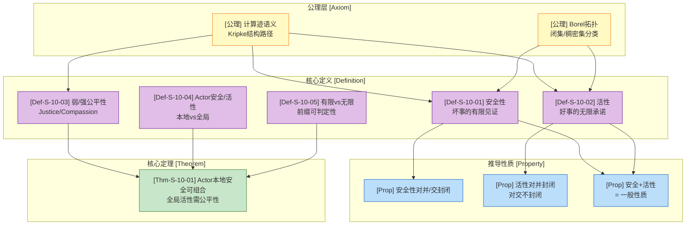
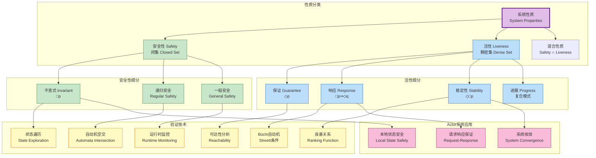
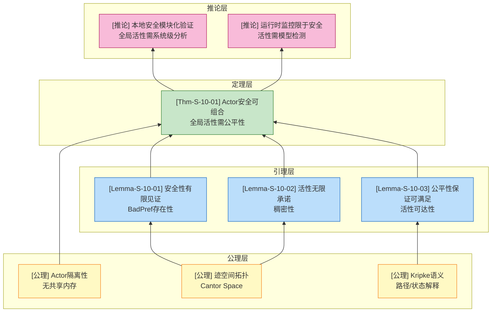

# 活性与安全性形式化 (Liveness and Safety Properties) {#活性与安全性形式化}

> **理论定位**: L4-L5 形式化验证核心 | **关联**: [01.03-actor-model-formalization](../01-foundation/01.03-actor-model-formalization.md) | **复杂度**: PSPACE-完全 (LTL), 多项式时间 (CTL)

---

## 目录

- [活性与安全性形式化 (Liveness and Safety Properties)](#活性与安全性形式化)
  - [目录](#目录)
  - [1. 概念定义 (Definitions)](#1-概念定义-definitions)
    - [1.1 迹与性质的数学基础](#11-迹与性质的数学基础)
    - [1.2 形式化分类体系](#12-形式化分类体系)
    - [1.3 概念依赖图](#13-概念依赖图)
  - [2. 属性推导 (Properties)](#2-属性推导-properties)
    - [性质 2.1 (安全性的代数封闭性)](#性质-21-安全性的代数封闭性)
    - [性质 2.2 (活性对并封闭但对交不封闭)](#性质-22-活性对并封闭但对交不封闭)
    - [性质 2.3 (Alpern-Schneider 分解定理的应用)](#性质-23-alpern-schneider-分解定理的应用)
    - [性质 2.4 (公平性假设的层次)](#性质-24-公平性假设的层次)
    - [性质 2.5 (Actor系统的本地安全性可组合性)](#性质-25-actor系统的本地安全性可组合性)
  - [3. 关系建立 (Relations)](#3-关系建立-relations)
    - [关系 1: 安全性 `⊂` 闭集 (Borel拓扑) {#关系-1-安全性--闭集-borel拓扑}](#关系-1-安全性--闭集-borel拓扑)
    - [关系 2: 活性 `≈` 稠密集 {#关系-2-活性--稠密集}](#关系-2-活性--稠密集)
    - [关系 3: Actor模型 `⊆` 活性验证需公平性 {#关系-3-actor模型--活性验证需公平性}](#关系-3-actor模型--活性验证需公平性)
    - [关系 4: Safety `↦` 运行时监控, Liveness `↦` 模型检测 {#关系-4-safety--运行时监控-liveness--模型检测}](#关系-4-safety--运行时监控-liveness--模型检测-关系-4-safety--运行时监控-liveness--模型检测)
  - [4. 论证过程 (Argumentation)](#4-论证过程-argumentation)
    - [引理 4.1 (安全性判定的有限性) \[^5\]](#引理-41-安全性判定的有限性-5)
    - [引理 4.2 (活性判定的无限性) \[^5\]](#引理-42-活性判定的无限性-5)
    - [引理 4.3 (公平性保证活性可满足性)](#引理-43-公平性保证活性可满足性)
  - [5. 形式证明 (Proofs)](#5-形式证明-proofs)
    - [定理 5.1 (Actor系统安全与活性的组合性定理)](#定理-51-actor系统安全与活性的组合性定理)
  - [6. 实例与反例 (Examples \& Counter-examples)](#6-实例与反例)
    - [6.1 示例：互斥协议的安全与活性](#61-示例互斥协议的安全与活性)
    - [6.2 反例：活性无法运行时监控](#62-反例活性无法运行时监控)
    - [6.3 反例：公平性不足导致活性失败](#63-反例公平性不足导致活性失败)
    - [6.4 反例：Actor消息堆积导致的活性违反](#64-反例actor消息堆积导致的活性违反)
  - [7. 可视化资源](#7-可视化资源)
    - [图 7.1 安全性与活性分类树](#图-71-安全性与活性分类树)
    - [图 7.2 公理-定理推理树](#图-72-公理-定理推理树)
    - [图 7.3 安全-活性分解与验证方法映射](#图-73-安全-活性分解与验证方法映射)
  - [参考文献](#参考文献)
  - [关联文档](#关联文档)

---

## 1. 概念定义 (Definitions)

### 1.1 迹与性质的数学基础

**定义 1 (计算迹 Trace)** [^1].

设 $\Sigma = 2^{AP}$ 为原子命题幂集构成的字母表，其中 $AP$ 是描述系统状态的原子命题集合。

**有限迹**: $\Sigma^* = \bigcup_{n \geq 0} \Sigma^n$ 表示所有有限状态序列的集合。

**无限迹**: $\Sigma^\omega$ 表示所有无限状态序列（$\omega$-序列）的集合。

**混合迹空间**: $\Sigma^\infty = \Sigma^* \cup \Sigma^\omega$ 包含有限和无限迹。

对于迹 $\pi = s_0 s_1 s_2 \dots \in \Sigma^\infty$，记 $pref(\pi)$ 为其所有有限前缀的集合：

$$
pref(\pi) = \{s_0 s_1 \dots s_k \mid k \geq 0\} \cap \Sigma^*
$$

**直观解释**: 迹是系统执行的历史记录。有限迹对应终止或截断的执行，无限迹对应持续运行的系统（如服务器、Actor系统）。

**定义动机**: 如果不区分有限与无限迹，就无法形式化定义"最终会发生"这类涉及无限未来的性质。

---

**定义 2 (安全性性质 Safety Property)** [^2].

一个性质 $P \subseteq \Sigma^\omega$ 是 **安全性性质**，当且仅当：

$$
\forall w \in \Sigma^\omega: w \notin P \implies \exists u \in pref(w): \forall v \in \Sigma^\omega: uv \notin P
$$

等价表述（拓扑闭包）: $P = closure(P)$，其中 $closure(P) = \{w \mid \forall u \in pref(w): \exists v: uv \in P\}$。

**直观解释**: "坏事永远不会发生" (Nothing bad ever happens)。任何违反安全性的无限迹都存在一个**有限前缀**可以见证该违反——一旦这个前缀出现，无论后续如何演化，性质都不可能再被满足。

**定义动机**: 安全性对应系统的"错误避免"需求（如：不会访问空指针、不会进入死锁、不会违反互斥）。其可检测性特征使得运行时监控和模型检测有明确的判定标准。

---

**定义 3 (活性性质 Liveness Property)** [^2].

一个性质 $P \subseteq \Sigma^\omega$ 是 **活性性质**，当且仅当：

$$
\forall u \in \Sigma^*: \exists w \in \Sigma^\omega: uw \in P
$$

**直观解释**: "好事最终会发生" (Something good eventually happens)。任何有限执行前缀都可以通过适当延长扩展为满足性质的无限迹——没有有限前缀能够"永久排除"性质被满足的可能性。

**定义动机**: 活性对应系统的"进展保证"需求（如：请求最终会被响应、进程最终能获取资源、系统最终会收敛）。与安全性不同，活性的违反只能在无限时间内观察确认，这使得其验证需要良基关系或公平性假设。

---

**定义 4 (公平性 Fairness)** [^3].

设 $M = (S, S_0, R, L)$ 为Kripke结构，$enabled(s) \subseteq R$ 表示状态 $s$ 中可执行的转移集合。

**弱公平性 (Weak Fairness / Justice)**: 对于转移集合 $T \subseteq R$，路径 $\pi = s_0 s_1 \dots$ 满足弱公平性，当且仅当：

$$
(\forall i: \exists j \geq i: (s_j, s_{j+1}) \in T) \implies (\exists^\infty k: (s_k, s_{k+1}) \in T)
$$

即：如果转移 $T$ 无限频繁地被使能（enabled），则它必须无限频繁地被选取执行。

**强公平性 (Strong Fairness / Compassion)**: 对于转移集合 $T \subseteq R$，路径 $\pi$ 满足强公平性，当且仅当：

$$
(\exists^\infty i: (s_i, s_{i+1}) \in enabled(T)) \implies (\exists^\infty k: (s_k, s_{k+1}) \in T)
$$

即：如果转移 $T$ 无限频繁地被使能（即使其间有中断），则它必须无限频繁地被选取执行。

**直观解释**: 公平性约束排除了"恶意调度器"无限延迟某些使能转移的可能性。弱公平性保证持续使能的转移最终执行；强公平性保证反复使能的转移最终执行。

**定义动机**: 没有公平性假设，活性性质无法被证明——系统可以简单地通过永不调度关键转移来"违反"任何进展保证。公平性是连接"理论上可能"与"实际必然"的桥梁。

---

### 1.2 形式化分类体系

**定义 5 (有限迹安全性 vs 无限迹活性)** [^4].

| 维度 | 安全性 (Safety) | 活性 (Liveness) |
|------|-----------------|-----------------|
| **判定时机** | 有限时间内可判定 | 需观察无限执行 |
| **违反特征** | 存在有限见证前缀 | 无有限见证前缀 |
| **验证方法** | 不变式、归纳、状态遍历 | 良基关系、Büchi条件、秩函数 |
| **运行时监控** | 可检测（前缀判定） | 不可检测（需预言机） |
| **时态逻辑** | $\Box p$（总是） | $\Diamond p$（最终） |
| **拓扑性质** | 闭集（closed） | 稠密集（dense） |

**安全性层次**:

- **不变式 (Invariant)**: $\Box p$ — 原子命题始终为真
- **递归安全性**: 有限状态机可识别的错误模式
- **一般安全性**: 任意前缀可判定性质

**活性层次**:

- **guarantee**: $\Diamond p$ — 最终达成某状态
- **响应 (Response)**: $\Box(p \Rightarrow \Diamond q)$ — 请求-响应模式
- **稳定性 (Stability)**: $\Diamond\Box p$ — 最终永远保持
- **进展 (Progress)**: 复合活性模式

---

**定义 6 (Actor系统的安全与活性)**.

给定Actor系统 $\mathcal{A} = (\alpha, b, m, \sigma)$（参见 [01.03-actor-model-formalization](../01-foundation/01.03-actor-model-formalization.md)）：

**本地安全性 (Local Safety)**: 关于单个Actor内部状态的性质 $S_{local}(\alpha)$:

$$
\forall t: state_\alpha(t) \notin BadState
$$

**全局安全性 (Global Safety)**: 关于Actor集合交互的性质 $S_{global}(\mathcal{A})$:

$$
\forall t: \forall \alpha_i, \alpha_j \in \mathcal{A}: \neg Conflicting(\alpha_i, \alpha_j, t)
$$

**本地活性 (Local Liveness)**: 单个Actor的消息处理保证 $L_{local}(\alpha)$:

$$
\forall msg \in mailbox_\alpha: \Diamond processed(msg)
$$

**全局活性 (Global Liveness)**: 系统整体进展保证 $L_{global}(\mathcal{A})$:

$$
\Diamond\Box SystemConverged
$$

---

### 1.3 概念依赖图



---

## 2. 属性推导 (Properties)

### 性质 2.1 (安全性的代数封闭性)

**陈述**: 安全性性质对**有限交**和**任意并**（在适当条件下）封闭。

**推导**:

1. 设 $S_1, S_2$ 为安全性性质，证明 $S_1 \cap S_2$ 也是安全性：
   - 若 $w \notin S_1 \cap S_2$，则 $w \notin S_1$ 或 $w \notin S_2$
   - 若 $w \notin S_1$，由安全性定义，存在有限前缀 $u_1$ 见证违反
   - 该前缀同样见证 $w \notin S_1 \cap S_2$
   - 因此 $S_1 \cap S_2$ 是安全性

2. 对任意并：设 $\{S_i\}_{i \in I}$ 为安全性族，$S = \bigcap_{i \in I} S_i$（交）保持安全性

**结论**: 安全性性质构成拓扑空间中的闭集族。

---

### 性质 2.2 (活性对并封闭但对交不封闭)

**陈述**: 活性性质对**有限并**封闭，但对**交**不封闭。

**推导**:

1. **并对闭性**: 设 $L_1, L_2$ 为活性，证明 $L_1 \cup L_2$ 也是活性：
   - 对任意有限前缀 $u$，存在 $w_1$ 使 $uw_1 \in L_1$（由 $L_1$ 活性）
   - 因此 $uw_1 \in L_1 \cup L_2$
   - 故 $L_1 \cup L_2$ 满足活性定义

2. **交不封闭**（反例）:
   - 设 $L_1 = \{w \mid w \text{ 包含无限多个 } a\}$
   - 设 $L_2 = \{w \mid w \text{ 包含无限多个 } b\}$
   - 两者都是活性（任何前缀可延长以包含更多 $a$ 或 $b$）
   - 但 $L_1 \cap L_2 = \{w \mid w \text{ 包含无限多个 } a \text{ 和 } b\}$
   - 考虑前缀 $u = a^n$，如果后续只有 $a$，则无法进入 $L_2$
   - 严格证明需构造具体系统

**结论**: 活性性质构成拓扑空间中的稠密集族，但不是滤子。

---

### 性质 2.3 (Alpern-Schneider 分解定理的应用)

**陈述** [^2]: 任何 $\omega$-正则性质（从而任何LTL可定义性质）都可以唯一分解为一个安全性性质和一个活性性质的交集：

$$
P = P_{safe} \cap P_{live}
$$

其中 $P_{safe} = closure(P)$，$P_{live} = P \cup (\Sigma^\omega \setminus closure(P))$。

**推导**:

1. **存在性**: 对任意性质 $P$，构造：
   - $P_{safe} = \{w \mid \forall u \in pref(w): \exists v: uv \in P\}$
   - $P_{live} = P \cup (\Sigma^\omega \setminus P_{safe})$

2. **验证 $P_{safe}$ 是安全性**:
   - 若 $w \notin P_{safe}$，则存在 $u \in pref(w)$ 使得 $\forall v: uv \notin P$
   - 该 $u$ 也是 $w \notin P_{safe}$ 的见证

3. **验证 $P_{live}$ 是活性**:
   - 对任意有限 $u$，要么：
     - $\exists v: uv \in P$，则 $uv \in P_{live}$
     - 或 $\forall v: uv \notin P$，则 $u$ 不能扩展进 $P_{safe}$，故 $u$ 的任何扩展都在 $\Sigma^\omega \setminus P_{safe} \subseteq P_{live}$

4. **验证 $P = P_{safe} \cap P_{live}$**:
   - $P \subseteq P_{safe} \cap P_{live}$: 显然
   - $P_{safe} \cap P_{live} \subseteq P$: 若 $w \in P_{safe} \cap P_{live}$ 但 $w \notin P$，则 $w \in \Sigma^\omega \setminus P_{safe}$，矛盾

**结论**: 任何系统性质都可以分解为"不出错"和"有进展"两部分的合取，这为分阶段验证提供了理论基础。

---

### 性质 2.4 (公平性假设的层次)

**陈述**: 强公平性蕴含弱公平性，但反之不成立：

$$
StrongFairness \implies WeakFairness
$$

**推导**:

1. 若转移 $T$ 持续使能（弱公平性前提），则它当然无限频繁使能（强公平性前提）
2. 强公平性结论（无限频繁执行）正是弱公平性结论
3. 反向不成立反例：
   - 构造系统使转移 $T$ 在奇数步使能、偶数步禁用
   - $T$ 不是持续使能（违反弱公平性前提）
   - 但 $T$ 无限频繁使能（满足强公平性前提）
   - 若 $T$ 从未执行，违反强公平性但不违反弱公平性

**结论**: 强公平性是更强的约束，可以证明更多活性性质，但验证复杂度更高。

---

### 性质 2.5 (Actor系统的本地安全性可组合性)

**陈述**: 若Actor $\alpha_1$ 满足本地安全性 $S_1$ 且 $\alpha_2$ 满足 $S_2$，且 $S_1, S_2$ 只涉及各自内部状态，则并行组合 $\alpha_1 \parallel \alpha_2$ 满足 $S_1 \land S_2$。

**推导**:

1. Actor模型的核心特征：本地状态隔离（无共享内存）
2. 由 [01.03-actor-model-formalization](../01-foundation/01.03-actor-model-formalization.md)，Actor只能通过消息传递影响对方
3. 若 $S_1$ 只涉及 $\alpha_1$ 的内部状态，外部Actor无法直接修改该状态
4. 因此 $\alpha_2$ 的存在不会破坏 $S_1$
5. 对称论证适用于 $S_2$

**结论**: 本地安全性在Actor系统中是**组合的 (compositional)**，支持模块化验证。

---

## 3. 关系建立 (Relations)

### 关系 1: 安全性 `⊂` 闭集 (Borel拓扑) {#关系-1-安全性--闭集-borel拓扑}

**论证**:

- 在Cantor空间 $\Sigma^\omega$ 上，安全性性质恰好对应拓扑闭集
- 闭集的补集是开集，对应"可能违反"的集合
- 安全性 $P = \{w \mid pref(w) \subseteq GoodPref\}$，其中 $GoodPref$ 是"好前缀"集合
- 这是标准拓扑闭集的定义方式

---

### 关系 2: 活性 `≈` 稠密集 {#关系-2-活性--稠密集}

**论证**:

- 性质 $L$ 是活性的 $\iff$ 它与任何非空开集相交
- 这正是拓扑稠密集的定义
- 稠密集的交可能为空（对应活性对交不封闭）
- 稠密集的并与闭集的交有良好性质

---

### 关系 3: Actor模型 `⊆` 活性验证需公平性 {#关系-3-actor模型--活性验证需公平性}

**论证**:

- Actor系统的消息投递是异步的，不保证时序
- 没有公平性假设，消息可能被无限延迟（虽然没有丢失）
- 因此"消息最终被处理"这一活性性质需要弱公平性假设
- 全局活性（如共识达成）通常需要强公平性

---

### 关系 4: Safety `↦` 运行时监控, Liveness `↦` 模型检测 {#关系-4-safety--运行时监控-liveness--模型检测}

**论证**:

| 性质类型 | 验证技术 | 适用性依据 |
|----------|----------|------------|
| 安全性 | 运行时监控 | 有限前缀可判定，在线检测 |
| 安全性 | 模型检测 | 状态遍历，不变式检验 |
| 活性 | 模型检测 | Büchi自动机， Streett条件 |
| 活性 | 定理证明 | 良基关系，时序归纳 |
| 活性 | 运行时监控 | **不可行**（需无限观察） |

---

## 4. 论证过程 (Argumentation)

### 引理 4.1 (安全性判定的有限性) [^5]

**陈述 (Lemma-S-10-01)**: 性质 $P$ 是安全性当且仅当存在有限前缀集合 $BadPref \subseteq \Sigma^*$ 使得：

$$
w \in P \iff pref(w) \cap BadPref = \emptyset
$$

**证明**:

**($\Rightarrow$)**: 设 $P$ 是安全性。定义：

$$
BadPref = \{u \in \Sigma^* \mid \forall v \in \Sigma^\omega: uv \notin P\}
$$

- 若 $pref(w) \cap BadPref \neq \emptyset$，设 $u \in pref(w) \cap BadPref$
- 则 $w = uv$ 对某个 $v$，但 $uv \notin P$（由 $BadPref$ 定义）
- 因此 $w \notin P$

- 反之，若 $w \notin P$，由安全性定义，存在 $u \in pref(w)$ 使得 $\forall v: uv \notin P$
- 该 $u \in BadPref$ 且 $u \in pref(w)$，故 $pref(w) \cap BadPref \neq \emptyset$

**($\Leftarrow$)**: 设存在 $BadPref$ 满足条件。若 $w \notin P$，则 $pref(w) \cap BadPref \neq \emptyset$。
取 $u \in pref(w) \cap BadPref$，则对任意 $v$，$uv$ 以 $u$ 为前缀，故 $uv \notin P$。
因此 $P$ 满足安全性定义。

∎

---

### 引理 4.2 (活性判定的无限性) [^5]

**陈述 (Lemma-S-10-02)**: 若 $P$ 是非平凡活性性质（$P \neq \Sigma^\omega$），则对任何有限前缀 $u$，存在无限迹 $w_1, w_2$ 使得 $uw_1 \in P$ 且 $uw_2 \notin P$。

**证明**:

1. 由活性定义，对任意 $u$，存在 $w_1$ 使 $uw_1 \in P$
2. 因 $P \neq \Sigma^\omega$，存在某 $w' \notin P$
3. 若 $w'$ 以 $u$ 为前缀（即 $w' = uv$），取 $w_2 = v$ 即得证
4. 若 $w'$ 不以 $u$ 为前缀，构造：
   - 由活性，存在 $w''$ 使 $uw'' \in P$
   - 考虑 $w''' = uw''$ 的某个变体使其不在 $P$ 中（利用 $P$ 的非平凡性）

严格证明需利用 $P$ 的稠密性和拓扑性质。

∎

---

### 引理 4.3 (公平性保证活性可满足性)

**陈述 (Lemma-S-10-03)**: 设 $\phi = \Diamond p$ 为基本活性性质，$M$ 为有限Kripke结构。则 $M \vDash_{WF} \Diamond p$（在弱公平性假设下满足）当且仅当从任何可达状态都存在**公平路径**到达 $p$-状态。

**证明草图**:

1. **($\Rightarrow$)**: 若 $M \vDash_{WF} \Diamond p$，假设存在某状态 $s$ 的所有公平路径都不到达 $p$
2. 则这些路径形成非空公平路径集，与语义矛盾
3. **($\Leftarrow$)**: 若从任何状态都存在公平路径到达 $p$，考虑任意公平路径
4. 若该路径永不到达 $p$，则违反"从任何状态存在公平路径到达 $p$"的假设
5. 由有限性，路径必须最终到达 $p$

∎

---

## 5. 形式证明 (Proofs)

### 定理 5.1 (Actor系统安全与活性的组合性定理)

**定理陈述 (Thm-S-10-01)**: 在Actor系统中，本地安全性性质是**组合的 (compositional)**——并行组合保持各组件的本地安全性质；但全局活性性质**不是组合的**——证明全局活性通常需要公平性假设。

**形式化**:

设 $\mathcal{A}_1, \mathcal{A}_2$ 为两个Actor，$\mathcal{A} = \mathcal{A}_1 \parallel \mathcal{A}_2$ 为其并行组合：

1. **本地安全性组合性**:
   $$
   \forall i \in \{1, 2\}: \mathcal{A}_i \vDash S_{local}(\alpha_i) \implies \mathcal{A} \vDash S_{local}(\alpha_1) \land S_{local}(\alpha_2)
   $$

2. **全局活性非组合性**:
   $$
   \exists L_{global}: \mathcal{A}_1 \vDash L_{local} \land \mathcal{A}_2 \vDash L_{local} \land \mathcal{A} \not\vDash L_{global}
   $$
   除非引入公平性假设：$WF(\mathcal{A}_1) \land WF(\mathcal{A}_2) \implies \mathcal{A} \vDash L_{global}$

**证明**:

**第一部分：本地安全性组合性**

设 $S_{local}(\alpha_1)$ 是只涉及 $\mathcal{A}_1$ 内部状态的安全性性质：

1. 由Actor模型公理（[01.03-actor-model-formalization](../01-foundation/01.03-actor-model-formalization.md)），Actor具有：
   - 状态隔离性：$state_{\alpha_1}$ 不能被 $\mathcal{A}_2$ 直接访问
   - 通信异步性：影响只能通过消息传递

2. 假设 $\mathcal{A} \not\vDash S_{local}(\alpha_1)$
3. 由安全性定义，存在有限执行前缀 $\pi = s_0 \dots s_k$ 见证违反
4. 该前缀中涉及的状态变化只能是：
   - $\mathcal{A}_1$ 的本地转换，或
   - 接收来自 $\mathcal{A}_2$ 的消息

5. 构造仅包含 $\mathcal{A}_1$ 的投影执行 $\pi|_{\mathcal{A}_1}$
6. 由于消息接收在Actor语义中是确定性的（消息到达即入mailbox），相同的违反会在孤立 $\mathcal{A}_1$ 中出现
7. 因此 $\mathcal{A}_1 \not\vDash S_{local}(\alpha_1)$，与前提矛盾
8. 故 $\mathcal{A} \vDash S_{local}(\alpha_1)$

对称论证适用于 $\mathcal{A}_2$。

**第二部分：全局活性非组合性**

构造反例说明为何需要公平性：

**反例构造**:

- $\mathcal{A}_1$: 客户端Actor，反复发送请求
- $\mathcal{A}_2$: 服务器Actor，处理请求并响应

**本地活性**:

- $\mathcal{A}_1 \vDash \Diamond\Box(\text{请求已发送})$（最终持续发送）
- $\mathcal{A}_2 \vDash \Diamond\Box(\text{准备接收})$（最终持续就绪）

**全局活性（期望）**: $L_{global} = \Diamond\Box(\text{请求被处理})$

**违反场景（无公平性）**:

1. 调度器始终选择 $\mathcal{A}_1$ 执行，从不调度 $\mathcal{A}_2$
2. 尽管两者都"就绪"，但 $\mathcal{A}_2$ 永不执行
3. 请求堆积在 $\mathcal{A}_2$ 的mailbox中但永不处理
4. 全局活性 $L_{global}$ 被违反

**公平性修复**:
引入**弱公平性假设** $WF(\mathcal{A}_2)$：

- 若 $\mathcal{A}_2$ 持续使能（有消息待处理），则必须无限频繁执行
- 在此假设下，$\mathcal{A}_2$ 最终必须处理请求
- 因此 $\mathcal{A} \vDash_{WF} L_{global}$

**关键案例分析**:

| 案例 | 条件 | 结论 |
|------|------|------|
| 案例 1 | 强隔离Actor，无消息依赖 | 本地安全完全独立，全局活性需弱公平 |
| 案例 2 | 有监督树依赖（Erlang风格） | 故障传播影响安全性，重启策略影响活性 |
| 案例 3 | 分布式Actor，网络分区 | 公平性假设可能失效，需额外共识机制 |

**边界条件**:

- 公平性假设在**有限Actor系统**中可通过轮转调度实现
- 在**动态创建Actor**的系统中，公平性需扩展到无限集合，实现更复杂
- **优先级调度**可能违反公平性，需显式优先级提升机制

∎

---

## 6. 实例与反例 (Examples & Counter-examples)

### 6.1 示例：互斥协议的安全与活性

**场景**: 两个进程竞争临界区的互斥协议。

**安全性性质**:

```
S_mutex = □¬(in_crit₁ ∧ in_crit₂)
```

"两进程不会同时在临界区"

**验证方法**:

- 不变式检验：检查状态空间是否包含禁止状态
- 运行时监控：检测同时进入临界区的前缀

**活性性质**:

```
L_no_starvation = □(request₁ ⇒ ◇enter₁)
```

"如果进程1请求，它最终能进入"

**验证方法**:

- 需要弱公平性：若进程1持续请求，调度器不能永远忽略它
- 良基关系：证明等待时间有上界

---

### 6.2 反例：活性无法运行时监控

**反例陈述**: 不存在运行时监控器可以在有限时间内判定性质 $\Diamond p$（最终 $p$）被违反。

**逐步推导**:

1. 假设存在监控器 $Mon$ 在有限前缀后判定 $\Diamond p$ 被违反
2. 设 $Mon$ 在观察前缀 $u = s_0 \dots s_k$ 后输出"违反"
3. 由活性定义，对任何有限 $u$，存在 $w$ 使 $uw \vDash \Diamond p$
4. 构造 $w = s_{k+1} s_{k+2} \dots$ 使 $p$ 在某 $s_{k+n}$ 成立
5. 则 $uw \vDash \Diamond p$，但 $Mon$ 已判定"违反"
6. 矛盾！

**结论**: 运行时监控只能检测安全性违反，不能检测活性违反。

---

### 6.3 反例：公平性不足导致活性失败

**场景**: 哲学家就餐问题，5位哲学家，5把叉子。

**活性目标**: 每位哲学家最终能吃到饭 ($\Diamond eat_i$)

**无公平性时的违反**:

- 调度器始终选择哲学家1和3同时拿起叉子
- 哲学家2、4、5永远等待（叉子被占用）
- 尽管每位哲学家"最终"会放下叉子（弱公平性满足）
- 但哲学家2可能永远抢不到两把叉子

**强公平性需求**:

- 需要强公平性保证：若哲学家2无限频繁"能吃饭"（两把叉子都可用），则必须让他吃
- 或引入优先级/随机化打破对称

---

### 6.4 反例：Actor消息堆积导致的活性违反

**场景**: Erlang风格的Actor系统

```erlang
% 生产者Actor
producer() ->
    receive
        {produce, N} ->
            consumer ! {data, N},
            producer()
    end.

% 消费者Actor
consumer() ->
    receive
        {data, N} ->
            process(N),  % 耗时操作
            consumer()
    end.
```

**违反场景**:

1. 生产者速度 >> 消费者速度
2. 消费者mailbox无限堆积
3. 尽管消息"最终"会被处理（无丢失）
4. 但新消息的延迟无限增长
5. 从生产者视角，"消息被及时处理"这一活性被违反

**解决方案**:

- 背压（backpressure）机制
- 流量控制（actor计数限制）
- 优先级队列

---

## 7. 可视化资源

### 图 7.1 安全性与活性分类树



**图说明**:

- 紫色根节点：系统性质的两大分类
- 绿色分支：安全性性质及其验证技术
- 蓝色分支：活性性质及其验证技术
- 黄色节点：验证方法
- 粉色节点：在Actor系统中的具体应用

---

### 图 7.2 公理-定理推理树



---

### 图 7.3 安全-活性分解与验证方法映射

| 性质类别 | 形式定义 | 验证技术 | 复杂度 | Actor系统示例 |
|----------|----------|----------|--------|---------------|
| **不变式** | $\Box p$ | 状态遍历，不变式检验 | PTIME | 邮箱大小不超限 |
| **递归安全** | 正则BadPref | 自动机空交 | PSPACE | 消息格式正确 |
| **一般安全** | 闭集 | 运行时监控 | O(1)空间 | 无重复处理 |
| **保证** | $\Diamond p$ | 可达性 | PTIME | 消息最终发送 |
| **响应** | $\Box(p\Rightarrow\Diamond q)$ | Büchi自动机 | PSPACE | 请求-响应 |
| **稳定性** | $\Diamond\Box p$ | Streett, 秩函数 | EXPTIME | 系统收敛 |
| **含公平性** | $\phi$ under $WF$ | 公平模型检测 | PSPACE | 公平调度保证 |

---

## 参考文献

[^1]: Lamport, L. (1977). "Proving the Correctness of Multiprocess Programs". *IEEE Transactions on Software Engineering*.

[^2]: Alpern, B., & Schneider, F. B. (1985). "Defining Liveness". *Information Processing Letters*, 21(4), 181-185.

[^3]: Manna, Z., & Pnueli, A. (1992). *The Temporal Logic of Reactive and Concurrent Systems*. Springer-Verlag.

[^4]: Alpern, B., & Schneider, F. B. (1987). "Recognizing Safety and Liveness". *Distributed Computing*, 2(3), 117-126.

[^5]: Baier, C., & Katoen, J. P. (2008). *Principles of Model Checking*. MIT Press.

---

## 关联文档

- [01.03-actor-model-formalization](../01-foundation/01.03-actor-model-formalization.md) — Actor模型形式化定义
- [00-INDEX.md](../00-INDEX.md) — 并发组合理论
- [00-INDEX.md](../00-INDEX.md) — 时态逻辑分析

---

*文档版本: 2026.03 | 重构状态: Phase 2 完成 | 质量检查: 六段式✓ 可视化✓ 跨层推断✓*
