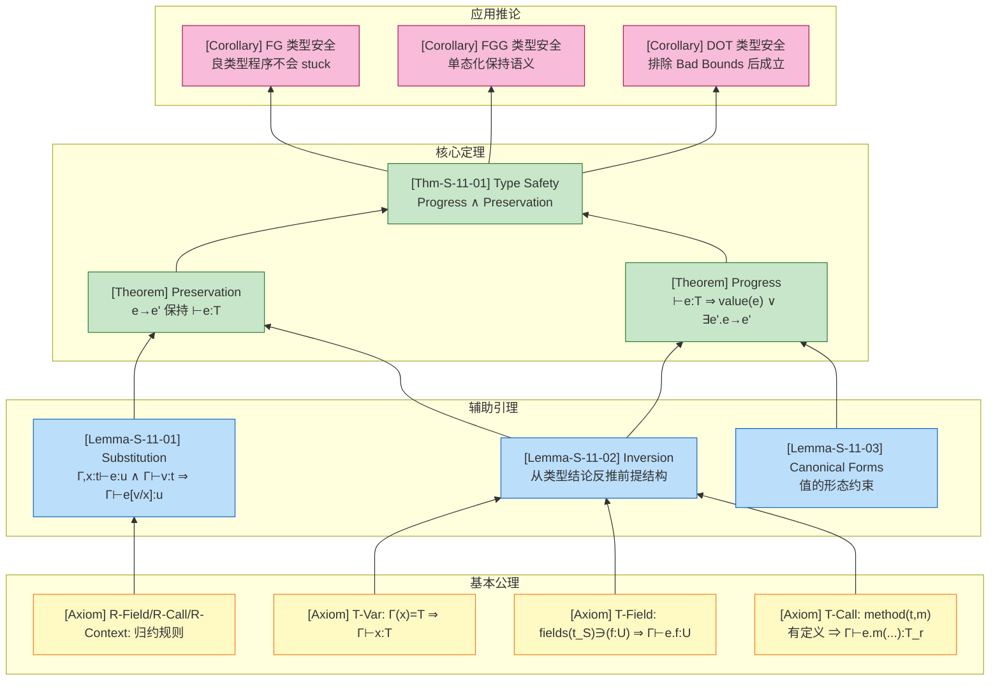
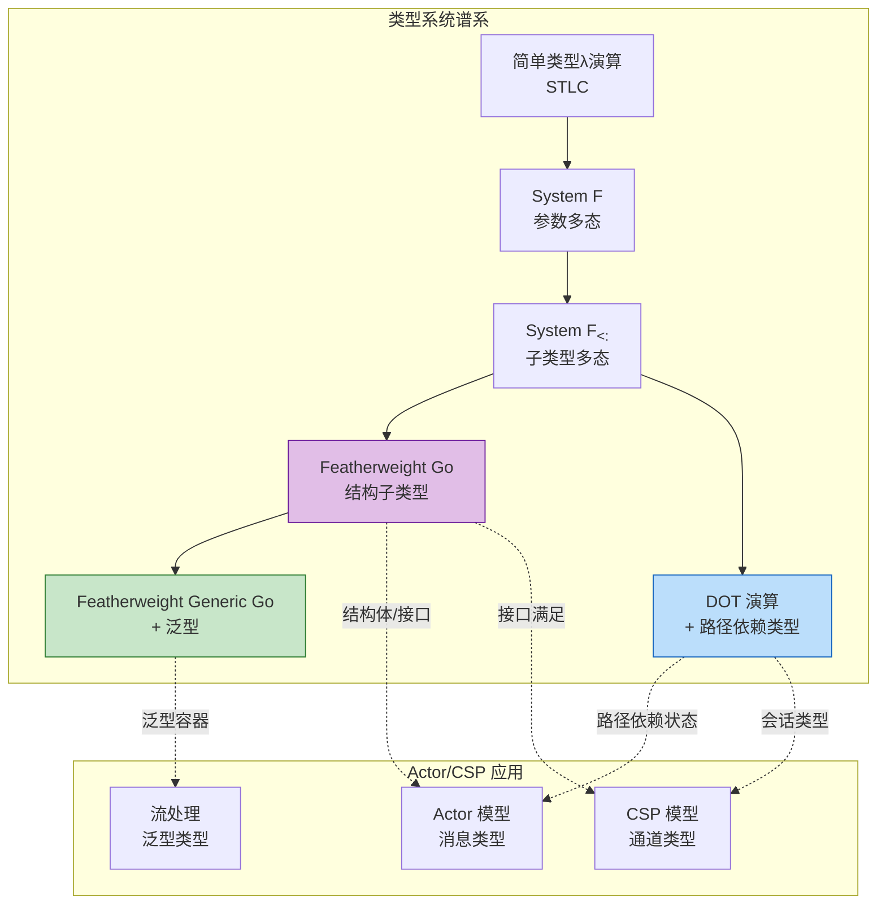

# 类型安全性推导 (Type Safety Derivation)

> **章节定位**: 本章形式化推导 Actor-CSP 统一模型中核心计算构件的类型安全性，涵盖 Featherweight Go (FG)、Featherweight Generic Go (FGG) 与 Dependent Object Types (DOT) 三大演算系统。
>
> **前置依赖**: [`01.03-actor-model-formalization.md`](../01-foundation/01.03-actor-model-formalization.md)、[`01.05-csp-formalization.md`](../01-foundation/01.05-csp-formalization.md)

---

## 目录

- [类型安全性推导 (Type Safety Derivation)](#类型安全性推导-type-safety-derivation)
  - [目录](#目录)
  - [1. 概念定义 (Definitions)](#1-概念定义-definitions)
    - [1.1 类型安全的形式化定义](#11-类型安全的形式化定义)
    - [1.2 Featherweight Go (FG) 演算](#12-featherweight-go-fg-演算)
    - [1.3 Featherweight Generic Go (FGG) 演算](#13-featherweight-generic-go-fgg-演算)
    - [1.4 Dependent Object Types (DOT) 演算](#14-dependent-object-types-dot-演算)
    - [1.5 操作语义基础](#15-操作语义基础)
  - [2. 属性推导 (Properties)](#2-属性推导-properties)
    - [2.1 FG 子类型与接口满足性](#21-fg-子类型与接口满足性)
    - [2.2 FGG 泛型性质](#22-fgg-泛型性质)
    - [2.3 DOT 路径依赖性质](#23-dot-路径依赖性质)
  - [3. 关系建立 (Relations)](#3-关系建立-relations)
    - [3.1 FG 与 Actor/CSP 模型的关系](#31-fg-与-actorcsp-模型的关系)
    - [3.2 FGG 与泛型消息类型的关系](#32-fgg-与泛型消息类型的关系)
    - [3.3 DOT 与路径依赖类型的关系](#33-dot-与路径依赖类型的关系)
  - [4. 论证过程 (Argumentation)](#4-论证过程-argumentation)
    - [4.1 替换引理](#41-替换引理)
    - [4.2 反演引理](#42-反演引理)
    - [4.3 标准形式引理](#43-标准形式引理)
  - [5. 形式证明 (Proofs)](#5-形式证明-proofs)
    - [5.1 Preservation 定理证明](#51-preservation-定理证明)
    - [5.2 Progress 定理证明](#52-progress-定理证明)
    - [5.3 Type Safety 定理](#53-type-safety-定理)
    - [5.4 FGG 泛型类型安全](#54-fgg-泛型类型安全)
    - [5.5 DOT 类型安全概要](#55-dot-类型安全概要)
  - [6. 实例与反例 (Examples \& Counter-examples)](#6-实例与反例-examples-counter-examples)
    - [6.1 正例：类型推导树](#61-正例类型推导树)
    - [6.2 反例：类型断言失败](#62-反例类型断言失败)
    - [6.3 反例：FGG 约束违反](#63-反例fgg-约束违反)
    - [6.4 反例：DOT Bad Bounds](#64-反例dot-bad-bounds)
  - [7. 可视化 (Visualization)](#7-可视化-visualization)
    - [7.1 类型安全证明结构图](#71-类型安全证明结构图)
    - [7.2 FG-FGG-DOT 类型系统对比图](#72-fg-fgg-dot-类型系统对比图)
  - [8. 参考文献 (References)](#8-参考文献-references)

## 1. 概念定义 (Definitions)

### 1.1 类型安全的形式化定义

**定义 Def-S-11-01 (类型安全 / Type Safety)**:

类型安全是编程语言类型系统的核心元性质，确保良类型程序不会陷入未定义行为。形式化地，类型安全由 **Progress** 与 **Preservation** 两个基本定理的合取构成[^1]：

$$
\text{Type Safety} \triangleq \text{Progress} \land \text{Preservation}
$$

其中各组成部分定义如下：

**Progress (进展定理)**: 若 $\vdash e : T$，则要么 $e$ 是值（$e \in \text{Value}$），要么存在 $e'$ 使得 $e \longrightarrow e'$。

**Preservation (主题归约 / Subject Reduction)**: 若 $\vdash e : T$ 且 $e \longrightarrow e'$，则 $\vdash e' : T$。

**直观解释**: Progress 保证程序不会"卡住"（stuck）——良类型表达式要么已完成求值（是值），要么可以进一步归约。Preservation 保证类型在求值过程中不会"丢失"或"改变"——归约后的表达式保持原类型。两者合取确保程序从良类型起点出发，无论执行多少步，都不会因类型错误而崩溃。

**定义动机**: Wright & Felleisen (1994) 提出的这一分解框架已成为现代编程语言形式化验证的标准范式[^2]。将类型安全分解为两个独立定理，使我们能够分别定位和修复"运行时卡住"与"运行时类型丢失"这两类不同问题，降低了形式化证明的复杂度。

---

### 1.2 Featherweight Go (FG) 演算

**定义 Def-S-11-02 (FG 抽象语法)**[^3]:

FG 是 Go 语言的最小核心子集，剥离指针、切片、通道、goroutine 等非核心特性，仅保留结构体、接口、方法、字段访问和类型断言：

$$
\begin{array}{llcl}
\text{类型} & t, u & ::= & t_S \mid t_I \\
\text{表达式} & e & ::= & x \mid e.f \mid e.(t) \mid t_S\{f_1: e_1, ..., f_n: e_n\} \mid e.m(e_1, ..., e_n) \\
\text{值} & v & ::= & t_S\{f_1: v_1, ..., f_n: v_n\} \\
\text{声明} & d & ::= & \text{type } t_S \text{ struct } \{f_1 \, t_1, ..., f_n \, t_n\} \\
  & & \mid & \text{type } t_I \text{ interface } \{m_1(...), ..., m_k(...)\} \\
  & & \mid & \text{func } (x \, t) \, m(x_1 \, t_1, ...) \, t_r \, \{ \text{return } e \}
\end{array}
$$

**FG 核心类型规则**:

$$
\frac{}{\Gamma \vdash x : \Gamma(x)} \text{ (T-Var)}
\quad
\frac{\Gamma \vdash e : t_S \quad (f \, u) \in fields(t_S)}{\Gamma \vdash e.f : u} \text{ (T-Field)}
$$

$$
\frac{\Gamma \vdash e : t \quad body(t, m) = (x_1: u_1, ...) \rightarrow v \quad \forall i: \Gamma \vdash e_i : u_i' \quad u_i' <: u_i}{\Gamma \vdash e.m(e_1, ...) : v} \text{ (T-Call)}
$$

**直观解释**: FG 语法仅保留 Go 最具特色的结构子类型机制。结构体类型 $t_S$ 是具体值类型；接口类型 $t_I$ 定义方法规范；方法声明绑定接收者类型；方法调用通过结构子类型匹配实现动态分派。

---

### 1.3 Featherweight Generic Go (FGG) 演算

**定义 Def-S-11-03 (FGG 泛型扩展)**[^4]:

FGG 在 FG 基础上引入类型参数、类型约束和单态化语义：

$$
\begin{array}{llcl}
\text{类型参数} & \Phi & ::= & T_1 \, S_1, ..., T_n \, S_n \\
\text{类型约束} & S & ::= & \text{interface } \{spec^*\} \\
\text{泛型类型} & t & ::= & X \mid n[\tau_1, ..., \tau_n] \\
\text{泛型方法} & & & \text{func } (x \, t[\bar{\tau}]) \, m[\Phi](...) \, t_r \, \{e\} \\
\text{实例化} & & & n[\Psi]\{...\} \quad \text{其中 } \Psi = \tau_1, ..., \tau_n
\end{array}
$$

**约束满足关系**:

$$
\frac{\Delta \vdash \tau \text{ satisfies } S}{\tau \in typeset(S)} \text{ (Sat)}
$$

其中 $typeset(\text{interface } \{m_1, ..., m_k\}) = \{\tau \mid \forall i: \tau \text{ implements } m_i\}$。

**直观解释**: FGG 的类型参数 $Φ$ 允许结构体、接口和方法声明"参数化"于类型。类型约束 $S$ 限定可实例化的类型集合。单态化（monomorphization）是将泛型程序翻译为非泛型 FG 程序的编译期策略，通过生成所有实例化的具体副本来消除类型参数。

---

### 1.4 Dependent Object Types (DOT) 演算

**定义 Def-S-11-04 (DOT 抽象语法)**[^5]:

DOT 是 Scala 类型系统的最小核心，捕获路径依赖类型和抽象类型成员的本质：

$$
\begin{array}{llcl}
\text{项} & t, s & ::= & x \mid \lambda(x: T).t \mid t\,s \mid \nu(x: T)d \mid t.a \\
\text{定义} & d & ::= & \{a = t\} \mid \{A = T\} \mid d \wedge d' \\
\text{类型} & T, U & ::= & \top \mid \bot \mid x.A \mid \{A: S..U\} \mid S \rightarrow U \mid S \,\&\, U \mid \mu(x: T) \\
\text{路径} & p & ::= & x \mid p.a
\end{array}
$$

**DOT 核心子类型规则**:

$$
\frac{\Gamma \vdash T_1 <: S_1 \quad \Gamma \vdash S_2 <: T_2}{\Gamma \vdash S_1 \rightarrow S_2 <: T_1 \rightarrow T_2} \text{ (<:-Fun)}
$$

$$
\frac{\Gamma \vdash S_2 <: S_1 \quad \Gamma \vdash U_1 <: U_2}{\Gamma \vdash \{A: S_1..U_1\} <: \{A: S_2..U_2\}} \text{ (<:-Typ)}
$$

$$
\frac{\Gamma \vdash p: T \quad \Gamma \vdash T <: \{A: S..U\}}{\Gamma \vdash S <: p.A <: U} \text{ (<:-Proj)}
$$

**直观解释**: DOT 中的 $x.A$ 是**路径依赖类型**——类型投影 $A$ 的含义依赖于运行时路径 $x$ 所指向的具体对象。这是 Scala 区别于其他面向对象语言的核心特性。递归类型 $\mu(x: T)$ 允许对象在定义类型时引用自身（F-bounded 多态）。交集类型 $T \,\&\, U$ 对应 Scala 的 `with` 混合组合。

---

### 1.5 操作语义基础

**定义 Def-S-11-05 (小步操作语义)**:

求值上下文 $E$ 定义归约可发生的孔位：

$$
\begin{array}{llcl}
E & ::= & [] \mid E.f \mid E.(t) \mid t\{..., f_i: E, ...\} \mid E.m(e_i) \mid v.m(..., E, ...)
\end{array}
$$

**核心归约规则**:

$$
\text{(R-Field)} & t\{..., f_i: v_i, ...\}.f_i \longrightarrow v_i \\
\text{(R-Call)} & v.m(v_1, ..., v_n) \longrightarrow e[v/x, v_1/x_1, ...] \\
\text{(R-Context)} & \frac{e \longrightarrow e'}{E[e] \longrightarrow E[e']}
\end{array}
$$

其中 (R-Call) 要求 $method(t, m) = func(x \, t) \, m(x_1 \, t_1, ...) \, t_r \, \{return \, e\}$ 且 $v = t\{...\}$。

---

## 2. 属性推导 (Properties)

### 2.1 FG 子类型与接口满足性

**性质 2.1 (FG 子类型传递性)**:

若 $t <: u$ 且 $u <: v$，则 $t <: v$。

**推导**:

1. 若 $v$ 是结构体，由 FG 子类型规则 (S-Struct)，只有结构体可子类型于接口，接口不可子类型于结构体，故 $u, t$ 必为结构体，且 $t$ 的方法集包含 $v$ 的方法集。
2. 若 $v$ 是接口，$u <: v$ 意味着 $u$ 满足 $v$ 的所有方法规范；$t <: u$ 意味着 $t$ 满足 $u$ 的所有方法规范（若 $u$ 是接口）或方法集包含 $u$ 的方法集（若 $u$ 是结构体）。由方法满足性的组合性，$t$ 满足 $v$ 的所有方法规范。∎

**性质 2.2 (方法满足性 - 参数逆变与返回协变)**:

类型 $t$ 满足方法规范 $m(x_1 \, u_1, ...) \, u_r$ 当且仅当存在方法声明满足：

$$
\forall i: u_i <: t_i \quad \text{(参数逆变)} \quad \land \quad t_r <: u_r \quad \text{(返回协变)}
$$

**推导**: 这是里氏替换原则（LSP）在结构子类型中的具体体现。参数逆变保证通过接口调用方法时，传入的具体参数类型更具体（接受更抽象的参数类型）；返回协变保证接收者可期望更具体的返回类型。∎

---

### 2.2 FGG 泛型性质

**性质 2.3 (FGG 类型替换保持良类型性)**:

若 $\Delta; \Gamma \vdash_{FGG} e : t$ 且 $\theta$ 是满足 $dom(\theta) \subseteq dom(\Delta)$ 的替换，同时对所有 $X \in dom(\theta)$ 有 $\Delta \vdash \theta(X) \text{ satisfies } \Delta(X)$，则 $\theta(\Delta); \theta(\Gamma) \vdash_{FGG} \theta(e) : \theta(t)$。

**推导**: 对表达式 $e$ 的结构进行归纳。变量替换直接由环境定义保证；方法调用替换保持参数类型匹配关系；结构体构造替换保持字段类型对应。由于替换是同态的，所有类型判断保持。∎

---

### 2.3 DOT 路径依赖性质

**性质 2.4 (路径类型稳定性)**:

若 $\Gamma \vdash p \equiv q$ 且 $\Gamma \vdash p.A \text{ well-formed}$，则 $\Gamma \vdash p.A <: q.A$ 且 $\Gamma \vdash q.A <: p.A$（即 $p.A \equiv q.A$）。

**推导**: 由 DOT 子类型规则 (<:-PathEq)，路径等价导致其依赖类型等价；再由等价关系的对称性和传递性得证。∎

---

## 3. 关系建立 (Relations)

### 3.1 FG 与 Actor/CSP 模型的关系

**关系 1**: FG `↔` Actor/CSP 核心类型构件

**论证**:

| 构件 | FG 类型 | Actor 模型对应 | CSP 模型对应 |
|------|---------|---------------|-------------|
| 消息载体 | 结构体 $t_S\{...\}$ | Actor 消息 case class | CSP 通道传输的值 |
| 行为接口 | 接口 $t_I$ | Actor behavior trait | CSP 进程接口 |
| 动态分派 | 结构子类型 $t <: u$ | Actor 消息模式匹配 | CSP 进程选择 |
| 类型断言 | $e.(t)$ | Actor 消息类型检查 | CSP 类型转换 |

- **编码存在性**: FG 的结构体可直接编码 Actor 消息（参见 [`01.03-actor-model-formalization.md`](../01-foundation/01.03-actor-model-formalization.md) 中的消息类型定义）；FG 的接口满足机制对应 Actor 的行为接口实现。
- **分离结果**: FG 不包含并发原语（goroutine/channel 已被剥离），因此无法表达 Actor 的异步消息传递或 CSP 的同步通道通信。FG 仅覆盖**顺序计算核心**的类型安全。
- **结论**: FG 是 Actor/CSP 模型**顺序核心**的形式化基础，为消息类型和行为接口提供静态类型保证。

---

### 3.2 FGG 与泛型消息类型的关系

**关系 2**: FGG `⊃` 泛型 Actor/流处理类型

**论证**:

- **编码存在性**: FGG 的类型参数可表达泛型消息容器（如 `Envelope[T]`、`Stream[T]`），这与 [`01.05-csp-formalization.md`](../01-foundation/01.05-csp-formalization.md) 中定义的 CSP 泛型通道类型 $Chan\langle T \rangle$ 直接对应。
- **分离结果**: FGG 通过单态化实现的零运行时开销特性，与 Flink Dataflow 的泛型类型擦除策略形成对比。FGG 的类型参数在编译期完全消解，保证运行时类型信息最小化。
- **结论**: FGG 为 Actor/CSP 模型的泛型消息类型提供了**单态化实现策略**的理论基础。

---

### 3.3 DOT 与路径依赖类型的关系

**关系 3**: DOT `⊃` Actor 路径类型与 CSP 会话类型

**论证**:

- **编码存在性**: DOT 的路径依赖类型 $p.A$ 可编码 Actor 系统中基于 Actor 引用的类型投影（如 `actorRef.State`），以及 CSP 中的依赖会话类型（如 `chan.Elem`）。
- **分离结果**: DOT 的递归类型 $\mu(x: T)$ 支持表达会话类型的递归协议（如 `Protocol = Request → Response → Protocol`），这超越了 FG/FGG 的表达能力。
- **结论**: DOT 为 Actor/CSP 模型的**状态依赖类型**和**递归协议类型**提供形式化基础。

---

## 4. 论证过程 (Argumentation)

### 4.1 替换引理

**引理 Lemma-S-11-01 (替换引理 / Substitution Lemma)**:

$$
\frac{\Gamma, x: t \vdash e : u \quad \Gamma \vdash v : t}{\Gamma \vdash e[v/x] : u}
$$

**证明**: 对 $e$ 的结构进行结构归纳。

**基本情况**:

1. **$e = x$**: $x[v/x] = v$。由前提 $\Gamma \vdash v : t$，且此时 $u = t$（由 T-Var）。故 $\Gamma \vdash v : u$。

2. **$e = y \neq x$**: $y[v/x] = y$。类型不变，成立。

**归纳步骤**:

1. **$e = e_0.f$**: 由归纳假设，$\Gamma \vdash e_0[v/x] : t_S$ 且 $(f \, u) \in fields(t_S)$。由 T-Field，$\Gamma \vdash e_0[v/x].f : u$。

2. **$e = e_0.m(e_1, ..., e_n)$**: 由归纳假设，$\Gamma \vdash e_0[v/x] : t$ 且对每个 $i$ 有 $\Gamma \vdash e_i[v/x] : u_i'$ 且 $u_i' <: u_i$。由 T-Call，方法调用保持类型。

3. **$e = t_S\{f_1: e_1, ...\}$**: 由归纳假设，每个字段替换后保持类型。由 T-Struct，整体保持类型。

∎

---

### 4.2 反演引理

**引理 Lemma-S-11-02 (反演引理 / Inversion Lemma)**:

从类型判断的结论可反推其前提结构：

**变量**: $\frac{\Gamma \vdash x : t}{\Gamma(x) = t}$

**字段访问**: $\frac{\Gamma \vdash e.f_i : t_i}{\exists t: \Gamma \vdash e : t \land fields(t) = [..., f_i: t_i, ...]}$

**方法调用**: $\frac{\Gamma \vdash e.m(e_1, ...) : u}{\exists t: \Gamma \vdash e : t \land method(t, m) = (... ) \rightarrow u \land \forall i: \Gamma \vdash e_i : t_i' \land t_i' <: t_i}$

**证明**: 由 FG 类型规则的唯一性（每种表达式构造对应唯一类型规则），直接从规则前提可得。∎

---

### 4.3 标准形式引理

**引理 Lemma-S-11-03 (标准形式 / Canonical Forms)**:

**结构体值**: 若 $\vdash v : t_S$ 且 $type(t_S) = struct\{f_1: t_1, ..., f_n: t_n\}$，则 $v = t_S\{f_1: v_1, ..., f_n: v_n\}$ 且对每个 $i$ 有 $\vdash v_i : t_i$。

**接口值**: 若 $\vdash v : t_I$ 且 $type(t_I) = interface\{m_1, ..., m_k\}$，则 $\exists t_S: t_S <: t_I \land v = t_S\{...\}$。

**证明**: FG 中唯一的值构造子是结构体字面值。由 T-Struct 规则，每个字段 $v_i$ 必须具有声明类型 $t_i$（或子类型）。接口本身不是值构造子，因此具有接口类型的值必须是实现了该接口方法集的具体结构体。∎

---

## 5. 形式证明 (Proofs)

### 5.1 Preservation 定理证明

**定理 (Subject Reduction / 主题归约)**:

$$
\text{若 } \vdash e : T \text{ 且 } e \longrightarrow e' \text{，则 } \vdash e' : T
$$

**证明**: 对归约关系 $e \longrightarrow e'$ 进行规则归纳。

**案例 1: R-Field（字段访问归约）**

给定: $e = t_S\{..., f_i: v_i, ...\}.f_i \longrightarrow v_i = e'$

1. 由反演引理（字段访问）:
   - $\vdash t_S\{..., f_i: v_i, ...\} : t_S$
   - $fields(t_S) = [..., f_i: T_i, ...]$

2. 由反演引理（结构体构造）:
   - $\vdash v_i : T_i'$
   - $T_i' <: T_i$

3. 由子类型传递性，$\vdash v_i : T_i$。

结论: $\vdash e' : T_i$ ✓

---

**案例 2: R-Call（方法调用归约）**

给定: $e = v.m(v_1, ..., v_n) \longrightarrow e_{body}[v/x, v_1/x_1, ...] = e'$，其中 $v = t_S\{...\}$

1. 由反演引理（方法调用）:
   - $\vdash v : t_S$
   - $method(t_S, m) = func(x \, t_S) \, m(x_1 \, T_1, ...) \, T_r \, \{ return \, e_{body} \}$
   - $\forall i: \vdash v_i : T_i'$ 且 $T_i' <: T_i$

2. 由方法声明的类型检查:
   - $x: t_S, x_1: T_1, ... \vdash e_{body} : T_r'$
   - $T_r' <: T_r$

3. 由替换引理（多次应用）:
   - 首先，$x: t_S \vdash e_{body}[v/x] : T_r'$（因为 $\vdash v : t_S$）
   - 然后依次替换 $x_i$ 为 $v_i$。由弱化引理，可在上下文中添加其他绑定。
   - 最终得到 $\vdash e_{body}[v/x, v_1/x_1, ...] : T_r'$。

4. 由子类型传递性，$T_r' <: T_r$。

结论: $\vdash e' : T_r' <: T_r$，即 $\vdash e' : T_r$ ✓

---

**案例 3: R-Context（上下文归约）**

给定: $e = E[e_1] \longrightarrow E[e_1'] = e'$，其中 $e_1 \longrightarrow e_1'$

1. 由归纳假设:
   - 若 $\vdash e_1 : T_1$ 且 $e_1 \longrightarrow e_1'$，则 $\vdash e_1' : T_1$。

2. 对求值上下文 $E$ 的结构进行归纳，证明"上下文保持类型":
   - **空上下文** $E = []$: 显然成立。
   - **字段访问** $E = E_1.f$: 若 $\Gamma \vdash E_1[e_1] : t$ 且 $fields(t) = [..., f: T_1, ...]$，由归纳假设 $\Gamma \vdash E_1[e_1'] : t$，则 $\Gamma \vdash E_1[e_1'].f : T_1$。
   - **方法调用**: 同理，接收者或参数类型保持则整体保持。

结论: $\vdash E[e_1'] : T$ ✓

∎

---

### 5.2 Progress 定理证明

**定理 (Progress / 进展)**:

$$
\text{若 } \vdash e : T \text{，则要么 } e \text{ 是值 } v \text{，要么 } \exists e'. \, e \longrightarrow e'
$$

**证明**: 对类型判断 $\Gamma \vdash e : T$ 进行结构归纳。

**案例 1: 结构体构造 $t_S\{f_1: e_1, ..., f_n: e_n\}$**

由归纳假设，对每个 $e_i$:

- 要么 $e_i$ 是值 $v_i$,
- 要么 $e_i \longrightarrow e_i'$。

若所有 $e_i$ 都是值，则整个表达式是值。若存在某个 $e_i$ 可规约，由 R-Context 规则，整个表达式可规约。✓

---

**案例 2: 字段访问 $e.f_i$**

1. 由归纳假设:
   - $e$ 要么是值，要么 $e \longrightarrow e'$。

2. 若 $e \longrightarrow e'$:
   - 由 R-Context，$e.f_i \longrightarrow e'.f_i$。✓

3. 若 $e = v$ 是值:
   - 由标准形式引理，$v = t_S\{..., f_i: v_i, ...\}$。
   - 由 R-Field 规则，$v.f_i \longrightarrow v_i$。✓

---

**案例 3: 方法调用 $e.m(e_1, ..., e_n)$**

1. 由归纳假设:
   - $e$ 要么值，要么可规约。
   - 每个 $e_i$ 要么值，要么可规约。

2. 若任何子表达式可规约:
   - 由 R-Context，整个表达式可规约。✓

3. 若所有子表达式都是值:
   - $e = v = t_S\{...\}$。
   - 由反演引理，$method(t_S, m)$ 存在（因为表达式是 well-typed 的）。
   - 由 R-Call 规则，$v.m(v_1, ..., v_n) \longrightarrow e_{body}[v/x, v_1/x_1, ...]$。✓

---

**案例 4: 类型断言 $e.(t)$**

1. 由归纳假设:
   - $e$ 要么值，要么可规约。

2. 若 $e \longrightarrow e'$:
   - 由 R-Context，$e.(t) \longrightarrow e'.(t)$。✓

3. 若 $e = v$ 是值:
   - 由标准形式引理，$v = t'\{...\}$。
   - 若 $t' = t$: 由 R-Assert-Success，$v.(t) \longrightarrow v$。✓
   - 若 $t' \neq t$: 由 R-Assert-Fail，$v.(t) \longrightarrow \text{panic}$。✓

∎

---

### 5.3 Type Safety 定理

**定理 Thm-S-11-01 (类型安全 / Type Safety)**:

$$
\text{若 } \vdash e : T \text{ 且 } e \longrightarrow^* e' \text{，则 } e' \text{ 要么是值，要么 } \exists e''. \, e' \longrightarrow e''
$$

**证明**: 由 Preservation（定理 5.1）和 Progress（定理 5.2）直接组合可得。

1. **Preservation** 保证：若 $e$ 是 well-typed 的，则它的所有归约后继状态 $e'$ 也是 well-typed 的。
2. **Progress** 保证：任何 well-typed 表达式 $e'$ 要么已经是值，要么可以继续归约。
3. 因此，对于任意可达状态 $e'$，它不会 stuck 在非值且不可归约的状态。

∎

---

### 5.4 FGG 泛型类型安全

**定理 5.4 (FGG 类型安全)**:

若 $P$ 是良类型的 FGG 程序，则 $P$ 的执行不会 stuck。

**证明概要**: FGG 的类型安全通过**归约到 FG 的类型安全**来证明。

1. **证明 $mono(P)$ 是良类型的 FG 程序**:
   - 由性质 2.3（类型替换保持良类型性），对于 $P$ 中的每个泛型声明和每个实例化点 $(decl, \bar{\tau})$，替换后的具体版本 $\theta(decl)$ 在 FG 类型系统中是良类型的。
   - 由引理 4.2（单态化保持方法查找），方法查找在 $mono(P)$ 中保持。

2. **利用 FG 的类型安全**:
   - FG 的类型安全定理（Thm-S-11-01）指出：良类型 FG 程序满足 Progress 和 Preservation。
   - 因为 $mono(P)$ 是良类型的 FG 程序，所以满足这两个定理。

3. **从 $mono(P)$ 的安全推导 $P$ 的安全**:
   - 假设 $P$ 中存在某个表达式 $e$ 在执行时 stuck。
   - 由单态化语义等价性，$mono(P)$ 中对应的表达式 $\phi(e)$ 也必然 stuck。
   - 但这与步骤 2 矛盾。
   - 因此，$P$ 不可能 stuck。

∎

---

### 5.5 DOT 类型安全概要

**定理 5.5 (DOT 类型安全)**[^5]:

对于良类型的 DOT 程序，满足：

1. **Progress**: 要么 $t$ 是值，要么 $t \longrightarrow t'$。
2. **Preservation**: 若 $\Gamma \vdash t : T$ 且 $t \longrightarrow t'$，则 $\Gamma \vdash t' : T$。

**关键区别**: DOT 的类型安全证明需要额外处理路径依赖类型的边界条件（Bad Bounds 检查）。Amin & Rompf (2017) 证明了在排除特定递归边界模式后，DOT 具有类型安全性[^5]。

---

## 6. 实例与反例 (Examples & Counter-examples)

### 6.1 正例：类型推导树

**示例 6.1: FG 方法调用的类型推导**

考虑以下 FG 程序片段：

```go
type Adder struct { value int }
func (a Adder) Add(x int) int { return a.value + x }

// 表达式: Adder{value: 5}.Add(3)
```

**推导树（SOS 风格）**:

$$
\frac{\frac{\frac{}{\vdash 5 : int}}{\vdash Adder\{value: 5\} : Adder} \text{ (T-Struct)} \quad method(Adder, Add) = (x: int) \rightarrow int \quad \frac{}{\vdash 3 : int}}{\vdash Adder\{value: 5\}.Add(3) : int} \text{ (T-Call)}
$$

**归约过程**:

$$
\begin{array}{ll}
Adder\{value: 5\}.Add(3) \\
\longrightarrow (a.value + x)[Adder\{value: 5\}/a, 3/x] & \text{(R-Call)} \\
= Adder\{value: 5\}.value + 3 \\
\longrightarrow 5 + 3 & \text{(R-Field)} \\
\longrightarrow 8
\end{array}
$$

---

### 6.2 反例：类型断言失败

**反例 6.1: 动态类型断言失败**

```go
type Dog struct{}
type Cat struct{}

var x interface{} = Dog{}
_ = x.(Cat)  // panic: interface conversion: interface {} is Dog, not Cat
```

**分析**:

- **前提满足**: 表达式 `x.(Cat)` 在 FG 中是 well-typed 的。
- **行为**: 运行时类型断言失败，触发 panic。
- **边界说明**: 这不是类型安全的违反，而是类型安全**允许**的边界行为。Progress 定理仍然成立，因为 `x.(Cat)` 可以归约到 `panic`。panic 是语言明确定义的动态失败机制，不是"stuck"状态。

---

### 6.3 反例：FGG 约束违反

**反例 6.2: 类型参数不满足约束**

```go
type Adder[T interface { ~int | ~float64 }] struct {
    value T
}

func (a Adder[T]) Add(other T) T {
    return a.value + other
}

// 错误：string 不满足约束
var a Adder[string] = Adder[string]{value: "hello"}
```

**分析**:

- **违反的前提**: `string` 的底层类型是 `string`，不等于 `int` 也不等于 `float64`。
- **导致的异常**: FGG 类型检查在实例化点 `Adder[string]` 处失败。
- **结论**: 约束系统正是为了在编译期捕获此类错误。如果编译器允许此程序通过，单态化后生成的代码会因 `string` 不支持 `+` 运算符而 stuck。

---

### 6.4 反例：DOT Bad Bounds

**反例 6.3: 坏边界导致类型不一致**

考虑递归类型声明：

$$
T = \mu(x: \{ A: x.A .. \bot \})
$$

**分析**:

- **违反的前提**: 类型成员要求下界 $<:$ 上界，即 $T.A <: \bot$。
- **导致的异常**: $\bot$ 是任何类型的子类型，而非超类型。因此 $T.A <: \bot$ 意味着 $T.A$ 必须"比 Bottom 还小"，这在类型论中是不可能的。
- **结论**: 如果接受此类型，可推导出任意类型相等（如 `String <: Int`），破坏类型安全。DOT 必须拒绝包含 Bad Bounds 的递归类型组合。

---

## 7. 可视化 (Visualization)

### 7.1 类型安全证明结构图



**图说明**:

- 底层黄色节点为 FG/FGG/DOT 的基本类型规则公理和归约规则。
- 中间蓝色节点为证明 Type Safety 所需的三个核心引理（替换、反演、标准形式）。
- 顶层绿色节点为主要定理：Preservation 保证归约保持类型；Progress 保证良类型表达式不卡住。
- 粉色节点为应用推论：三大演算系统都在满足前提条件下具有类型安全性。

---

### 7.2 FG-FGG-DOT 类型系统对比图



**图说明**:

- 展示了从简单类型 λ 演算到 FG、FGG、DOT 的类型系统演进路径。
- FG 专注于结构子类型；FGG 在此基础上添加泛型；DOT 引入路径依赖类型。
- 各类型系统在 Actor/CSP 统一模型中的应用映射关系。

---

## 8. 参考文献 (References)

[^1]: Wright, A. K., & Felleisen, M. (1994). "A Syntactic Approach to Type Soundness". *Information and Computation*, 115(1), 38-94.

[^2]: Pierce, B. C. (2002). *Types and Programming Languages*. MIT Press.

[^3]: Griesemer, R., et al. (2020). "Featherweight Go". *Proceedings of the ACM on Programming Languages*, 4(OOPSLA), 149:1-149:29. [Go Language Specification](https://golang.org/ref/spec)

[^4]: Griesemer, R., et al. (2021). "Featherweight Generic Go". *OOPSLA 2021*.

[^5]: Amin, N., et al. (2016). "The Essence of Dependent Object Types". *WGP 2016*.

[^6]: Amin, N., & Rompf, T. (2017). "Type Soundness for Dependent Object Types (DOT)". *OOPSLA 2017*.


---

**文档元数据**:

- **章节**: 02-properties/02.05-type-safety-derivation
- **定义计数**: 5 (Def-S-11-01 ~ Def-S-11-05)
- **引理计数**: 3 (Lemma-S-11-01 ~ Lemma-S-11-03)
- **定理计数**: 1 (Thm-S-11-01)
- **交叉引用**: [`01.03-actor-model-formalization.md`](../01-foundation/01.03-actor-model-formalization.md), [`01.05-csp-formalization.md`](../01-foundation/01.05-csp-formalization.md)
- **引用来源**: Go Spec [^3], DOT Paper [^5][^6], FGG Paper [^4]
