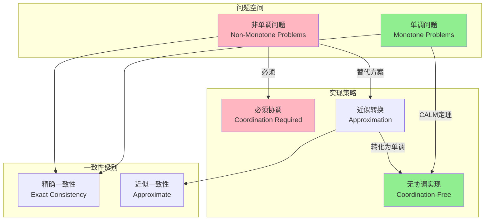
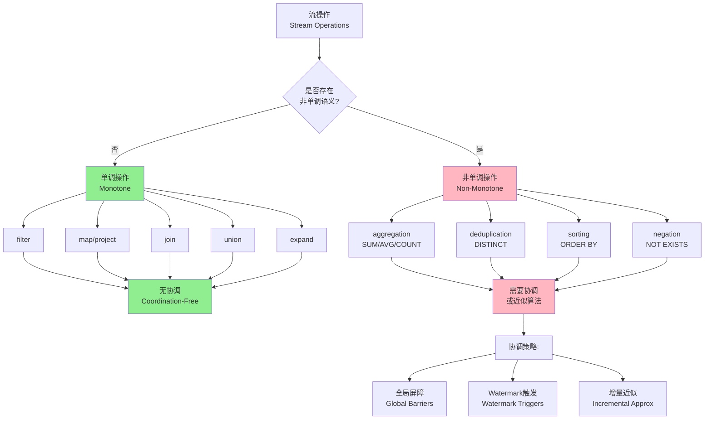
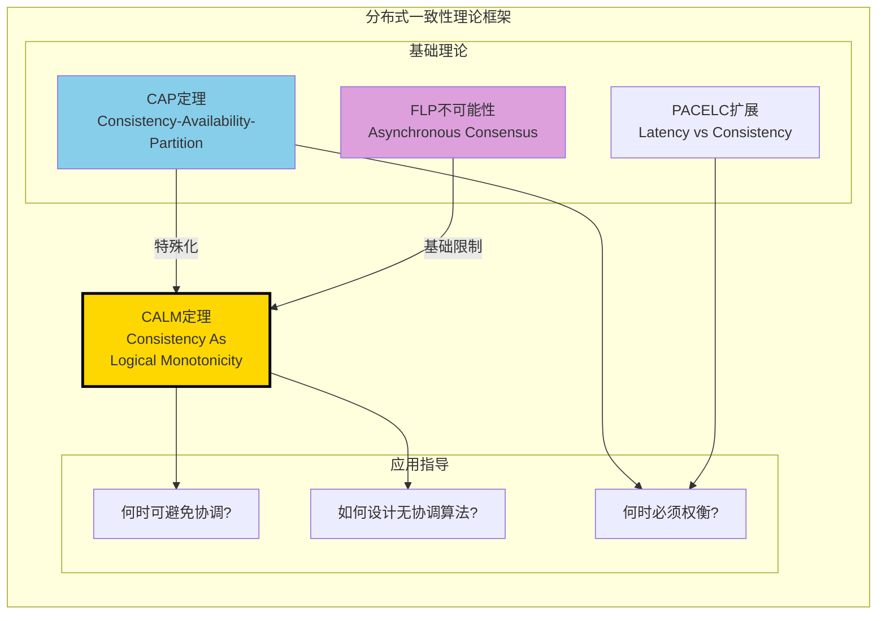

# CALM定理：一致性即逻辑单调性

> 所属阶段: Struct/ | 前置依赖: [02.04-liveness-and-safety.md](./02.04-liveness-and-safety.md), [02.05-type-safety-derivation.md](./02.05-type-safety-derivation.md) | 形式化等级: L5

---

## 1. 概念定义 (Definitions)

### 1.1 问题与计算模型

在分布式系统中，我们考虑以下形式化模型：

**Def-S-02-13** (分布式问题): 一个分布式问题 $\mathcal{P}$ 是一个映射 $P: \mathcal{I} \to \mathcal{O}$，其中：

- $\mathcal{I}$ 是输入集合（可能分布在多个节点上）
- $\mathcal{O}$ 是输出集合
- 每个输入 $I \in \mathcal{I}$ 是键值对的集合 $I = \{(k_1, v_1), (k_2, v_2), \ldots\}$
- 输出 $O \in \mathcal{O}$ 同样定义为键值对集合

**Def-S-02-14** (逻辑单调性): 问题 $P$ 是**逻辑单调的**（Logically Monotone），当且仅当：

$$\forall I_1, I_2 \in \mathcal{I}: I_1 \subseteq I_2 \Rightarrow P(I_1) \subseteq P(I_2)$$

即输入集合的单调增长导致输出集合的单调增长。

**直观解释**: 单调性问题具有"只能增加不能减少"的特性。一旦我们获得某个输出元组，该元组不会因为收到更多输入而被撤销。这与SQL中的单调操作（如selection、projection、自然连接）概念一致。

**Def-S-02-15** (协调): 协调（Coordination）是指在分布式计算中，为了确保正确性而引入的**进程间同步机制**，包括：

- 全局屏障（Barriers）
- 分布式锁（Distributed Locks）
- 共识协议（Consensus Protocols）
- 两阶段提交（2PC/3PC）

形式化地，协调成本定义为：

$$\text{CoordCost}(\mathcal{A}) = \{(m, t) : m \text{ 是同步消息}, t \text{ 是等待时间}\}$$

**Def-S-02-16** (一致性作为程序结果确定性): 分布式实现 $\mathcal{A}$ 满足**一致性**，当且仅当对于所有可能的执行轨迹 $\sigma \in \text{Exec}(\mathcal{A})$：

$$\text{result}(\sigma) = P(I)$$

其中 $I$ 是总输入，$P$ 是目标问题的规范。即：**无论消息延迟、故障、并发如何，程序最终结果始终等于规范定义的函数值**。

这与传统CAP一致性不同——CAP关注副本状态的一致性，而CALM关注的是**计算结果相对于规范的确定性**。

---

## 2. 属性推导 (Properties)

### 2.1 单调问题的基本性质

**Lemma-S-02-12** (单调性的集合运算封闭性): 逻辑单调性对以下运算封闭：

1. **并集**: 若 $P_1, P_2$ 单调，则 $P_1 \cup P_2$ 单调
2. **连接**: 若 $P_1, P_2$ 单调，则 $P_1 \bowtie P_2$ 单调（自然连接）
3. **选择**: 若 $P$ 单调，则 $\sigma_\theta(P)$ 单调（谓词选择）
4. **投影**: 若 $P$ 单调，则 $\pi_A(P)$ 单调

*证明概要*: 直接由集合包含关系的传递性可得。∎

**Lemma-S-02-13** (非单调操作的不封闭性): 以下操作**不保持**逻辑单调性：

1. **聚合** (Aggregation): $\gamma_{A, \text{SUM}(B)}(R)$ —— 新输入可能改变聚合值
2. **否定** (Negation/Set Difference): $R - S$ —— 新输入到 $S$ 可能使结果减小
3. **全称量词** (Universal Quantification): $\forall x. \phi(x)$ —— 新反例可能使真值变为假

*反例*: 考虑计数聚合 $count(R)$，初始 $R = \{a, b\}$ 得 $count = 2$；添加 $c$ 得 $count = 3$，不满足单调性定义（输出集合从 $\{2\}$ 变为 $\{3\}$，不构成包含关系）。∎

**Lemma-S-02-14** (单调性的网络容忍性): 若问题 $P$ 是逻辑单调的，则对于任意消息延迟函数 $\delta: \mathbb{M} \to \mathbb{R}^+$，存在异步实现 $\mathcal{A}_\delta$ 使得：

$$\forall \sigma \in \text{Exec}(\mathcal{A}_\delta, \delta): \text{result}(\sigma) = P(I)$$

即：单调问题对消息延迟具有天然的容错能力。

---

## 3. 关系建立 (Relations)

### 3.1 CALM与CAP的关系

**CAP定理** (Brewer, 2000): 在网络分区发生时，系统无法同时保证：

- 一致性 (Consistency)
- 可用性 (Availability)
- 分区容错性 (Partition Tolerance)

**CALM与CAP的对比**:

| 维度 | CAP定理 | CALM定理 |
|------|---------|----------|
| **问题类型** | 通用分布式系统 | 特定问题类别 |
| **核心结论** | 必须权衡三者 | 单调问题无需协调 |
| **建设性** | 消极（不可能性） | 积极（可行性） |
| **应用价值** | 架构选型指导 | 算法设计指导 |
| **一致性定义** | 线性一致性等 | 结果相对于规范确定性 |

**关键洞察**: CAP告诉我们"在网络分区时必须在一致性和可用性之间选择"；CALM告诉我们"对于单调问题，我们可以同时获得两者"。

### 3.2 CALM与流计算的关系

流计算系统的操作可以按CALM框架分类：

**单调操作（无需协调）**:

| 操作 | 描述 | 示例 |
|------|------|------|
| `filter` | 谓词过滤 | `WHERE temperature > 100` |
| `map` | 逐元素变换 | `SELECT id, value * 2` |
| `join` | 自然连接 | `STREAM A JOIN B ON A.key = B.key` |
| `union` | 流合并 | `A UNION ALL B` |

**非单调操作（需要协调）**:

| 操作 | 描述 | 协调需求 | 示例 |
|------|------|----------|------|
| `aggregate` | 全局聚合 | 需要边界判定 | `SUM`, `COUNT`, `AVG` |
| `top-n` | 排序取前N | 需要全局视图 | `ORDER BY score DESC LIMIT 10` |
| `negation` | 存在性检查 | 需要补集确认 | `NOT EXISTS` |
| `deduplication` | 去重 | 需要历史状态 | `DISTINCT` |

**与Watermark的关系**: Watermark是流计算中处理非单调性的机制——它提供一个逻辑时间边界，允许系统在该边界处安全地触发聚合计算。

### 3.3 与关系代数的关系

CALM定理揭示了关系代数中一个深刻性质：

$$\text{Safe}(Datalog^-) = \text{Monotone Queries}$$

即：带否定的Datalog程序是"安全"的（可转换为无协调实现）当且仅当它是单调的。

---

## 4. 论证过程 (Argumentation)

### 4.1 协调的必要性分析

为什么非单调问题必须协调？考虑以下论证：

**场景**: 计算集合 $R$ 的基数（cardinality），即 $|R|$。

**论证步骤**:

1. 设有两个节点 $n_1, n_2$ 分别持有 $R$ 的子集 $R_1, R_2$
2. 节点需要计算 $|R_1 \cup R_2| = |R_1| + |R_2| - |R_1 \cap R_2|$
3. 在不知道 $R_2$ 的内容前，$n_1$ 无法确定最终输出
4. 若 $n_1$ 提前输出猜测值，而 $R_2$ 后来包含与 $R_1$ 重叠的元素
5. 则 $n_1$ 必须**撤销**先前输出并发布修正值
6. 这种撤销需要协调机制来保证最终一致性

### 4.2 Bloom语言的设计哲学

**Bloom** 是基于CALM定理设计的Datalog方言：

```
# 单调操作:直接声明 table :items, [:id, :name]
items <= [[1, "apple"], [2, "banana"]]  # 累积语义

# 非单调操作:显式标记为"不确定性" table :total_count, [:cnt]
total_count <= items.group(nil, count(:id))  # 需要协调
```

**关键设计原则**:

1. **默认累积** (`<=`): 单调操作，无需协调
2. **瞬时更新** (`:=`): 非单调操作，触发协调
3. **不确定性标记**: 编译器自动识别需要协调的位置

### 4.3 边界讨论

**边界情况1**: 近似一致性

- 某些场景下，可以接受近似结果而非精确结果
- 此时非单调问题也可以采用"弱一致性"实现
- 例：近似计数（HyperLogLog）可以无协调地估计基数

**边界情况2**: 时间窗口

- 引入时间边界可以将无限流问题转化为有限问题
- 在窗口边界处触发协调，窗口内保持异步
- 这是Flink等系统的核心设计模式

---

## 5. 形式证明 (Proof)

### 5.1 CALM定理的完整表述

**Thm-S-02-08** (CALM定理 — Consistency As Logical Monotonicity):

一个分布式问题 $P$ 存在**协调无关**的一致分布式实现，当且仅当 $P$ 是逻辑单调的。

形式化表述：

$$\exists \mathcal{A}: \text{CoordFree}(\mathcal{A}) \land \text{Consistent}(\mathcal{A}, P) \iff \text{Monotone}(P)$$

其中：

- $\text{CoordFree}(\mathcal{A})$: 实现 $\mathcal{A}$ 不包含显式协调原语
- $\text{Consistent}(\mathcal{A}, P)$: 实现 $\mathcal{A}$ 对问题 $P$ 满足结果一致性

### 5.2 证明：单调性 $\Rightarrow$ 无协调一致性

**方向1**: 若 $P$ 是逻辑单调的，则存在无协调的一致实现。

*构造*:
设 $P$ 是单调问题。构造实现 $\mathcal{A}_{mono}$ 如下：

1. 每个节点 $n_i$ 维护本地输入集 $I_i$
2. 节点通过不可靠广播交换输入
3. 节点应用 $P$ 到当前可见输入集 $I_i^{visible} = \bigcup_{j} I_{ij}^{received}$
4. 输出 $O_i = P(I_i^{visible})$

*证明正确性*:

**引理**: 对于任意节点 $n_i$ 和任意时刻 $t$，有 $O_i(t) \subseteq P(I)$。

*证明*: 由于 $I_i^{visible}(t) \subseteq I$（可见输入是总输入的子集），且 $P$ 单调：

$$O_i(t) = P(I_i^{visible}(t)) \subseteq P(I)$$

∎

**引理**: 随着 $t \to \infty$，$O_i(t) \to P(I)$（假设最终传递性）。

*证明*: 在最终传递假设下，$\lim_{t \to \infty} I_i^{visible}(t) = I$。由 $P$ 的连续性（作为集合映射），$\lim_{t \to \infty} P(I_i^{visible}(t)) = P(I)$。∎

**结论**: $\mathcal{A}_{mono}$ 满足一致性（结果收敛到 $P(I)$）且无需协调。∎

### 5.3 证明：非单调性 $\Rightarrow$ 必须协调

**方向2**: 若 $P$ 不是逻辑单调的，则任何一致实现都必须协调。

*反证法*:

假设 $P$ 非单调，但存在无协调的一致实现 $\mathcal{A}$。

由于 $P$ 非单调，存在输入 $I_1 \subset I_2$ 使得：

$$P(I_1) \not\subseteq P(I_2)$$

即存在输出元组 $o \in P(I_1)$ 但 $o \notin P(I_2)$。

**场景构造**:

1. 考虑两个节点 $n_1, n_2$
2. 总输入 $I_2 = I_1 \cup \Delta$，其中 $\Delta$ 是新增输入
3. 网络分区导致 $n_1$ 先接收到 $I_1$，而 $n_2$ 最终接收到 $I_2$

**推导**:

- 由于 $\mathcal{A}$ 无协调，$n_1$ 无法知道 $n_2$ 是否持有额外输入
- 若 $n_1$ 输出 $o$（因为基于 $I_1$ 的计算表明 $o$ 应该输出）
- 但 $I_2$ 的存在意味着 $o \notin P(I_2)$
- 因此 $n_1$ 的输出违反了全局一致性

**避免不一致的唯一方式**:

- $n_1$ 必须等待确认没有更多输入（或与 $n_2$ 同步）
- 这种等待/同步正是**协调**的定义

**结论**: 非单调问题的一致实现必须包含协调机制。∎

### 5.4 推论

**Cor-S-02-04**: 流计算中，无界聚合操作（如全局SUM、COUNT）必然引入协调开销。

**Cor-S-02-05**: 基于事件时间的窗口聚合可以通过Watermark机制**延迟**协调到窗口边界，而非每条记录都协调。

**Cor-S-02-06**: 存在近似算法（如Count-Min Sketch、HyperLogLog）可以将非单调问题转化为单调的近似版本，从而避免协调。

---

## 6. 实例验证 (Examples)

### 6.1 实例1: Shopping Cart — 单调实现

**问题**: 实现分布式购物车，支持添加商品。

**单调实现** (ADD-ONLY语义):

```python
# 每个条目: (cart_id, item_id, quantity, timestamp)
class MonotoneShoppingCart:
    def __init__(self):
        self.items = set()  # 只增集合

    def add_item(self, cart_id, item_id, quantity):
        # 单调操作: 只能添加,不能删除或修改
        entry = (cart_id, item_id, quantity, time.time())
        self.items.add(entry)

    def get_cart(self, cart_id):
        # 聚合所有条目(按最新timestamp去重)
        result = {}
        for c, i, q, t in self.items:
            if c == cart_id:
                if i not in result or result[i][1] < t:
                    result[i] = (q, t)
        return {i: q for i, (q, _) in result.items()}
```

**CALM分析**:

- 操作是单调的：添加条目只会增加输出信息
- 无需协调：各节点独立累积条目，最终一致性自动达成
- 缺点：无法实现"删除商品"功能

### 6.2 实例2: Shopping Cart — 非单调实现

**问题**: 支持添加、删除、修改数量的完整购物车。

**非单调实现**:

```python
class FullShoppingCart:
    def __init__(self):
        self.items = {}  # (cart_id, item_id) -> (quantity, timestamp)

    def update_item(self, cart_id, item_id, quantity):
        # 非单调: quantity 可以为0(删除)或减少
        key = (cart_id, item_id)
        self.items[key] = (quantity, time.time())

    def get_cart(self, cart_id):
        result = {}
        for (c, i), (q, t) in self.items.items():
            if c == cart_id and q > 0:
                result[i] = q
        return result
```

**协调需求**:

- 删除操作引入了非单调性
- 需要协调机制（如CRDT的LWW-Register或向量时钟）
- 或者使用2PC保证跨节点一致性

### 6.3 实例3: Bloom语言中的社交网络分析

```
# 定义表模式 table :follows, [:follower, :followee]
table :reachable, [:follower, :followee]

# 单调的传递闭包计算(无需协调)
reachable <= follows
reachable <= (follows * reachable).pairs(:followee => :follower) do |f, r|
  [f.follower, r.followee]
end

# 非单调的计数(需要协调)
table :follower_count, [:user, :count]
follower_count <= reachable.group(:followee, count(:follower))
```

---

## 7. 可视化 (Visualizations)

### 7.1 CALM定理的核心逻辑

**CALM定理的逻辑结构：问题类别与实现策略的映射**



### 7.2 流计算操作分类

**流操作按CALM框架的分类**



### 7.3 CALM与CAP的关系

**分布式一致性理论的层次关系**



### 7.4 Shopping Cart实现对比

**两种实现策略的对比**

```mermaid
stateDiagram-v2
    [*] --> 单调实现: 选择策略
    [*] --> 非单调实现: 选择策略

    state 单调实现 {
        [*] --> 接收添加
        接收添加 --> 累积条目
        累积条目 --> 本地输出
        本地输出 --> [*]
        note right of 累积条目
            无协调需求
            最终一致性自动达成
        end note
    }

    state 非单调实现 {
        [*] --> 接收更新
        接收更新 --> 需要协调

        state 协调机制 {
            两阶段提交
            向量时钟
            CRDT合并
        }

        需要协调 --> 两阶段提交: 强一致
        需要协调 --> 向量时钟: 因果一致
        需要协调 --> CRDT合并: 最终一致

        两阶段提交 --> 全局输出
        向量时钟 --> 全局输出
        CRDT合并 --> 全局输出

        全局输出 --> [*]
    }

    单调实现 --> 功能限制: 无法删除
    非单调实现 --> 功能完整: 完整CRUD
```

---

## 8. 引用参考 (References)


---

## 附录: CALM定理的数学符号速查

| 符号 | 含义 |
|------|------|
| $\mathcal{P}: \mathcal{I} \to \mathcal{O}$ | 分布式问题 |
| $I_1 \subseteq I_2 \Rightarrow P(I_1) \subseteq P(I_2)$ | 逻辑单调性定义 |
| $\text{CoordFree}(\mathcal{A})$ | 实现无协调 |
| $\text{Consistent}(\mathcal{A}, P)$ | 实现满足一致性 |
| $\bowtie$ | 自然连接 |
| $\sigma_\theta$ | 选择操作 |
| $\pi_A$ | 投影操作 |
| $\gamma$ | 聚合操作 |

---

*文档版本: 1.0 | 创建日期: 2026-04-02 | 形式化等级: L5*
