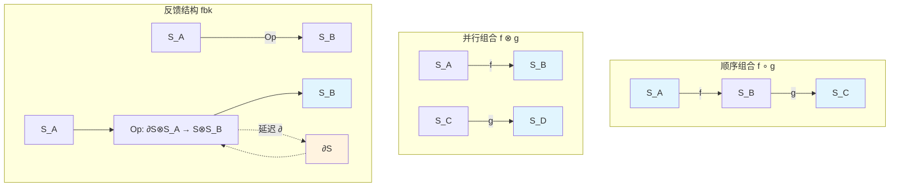
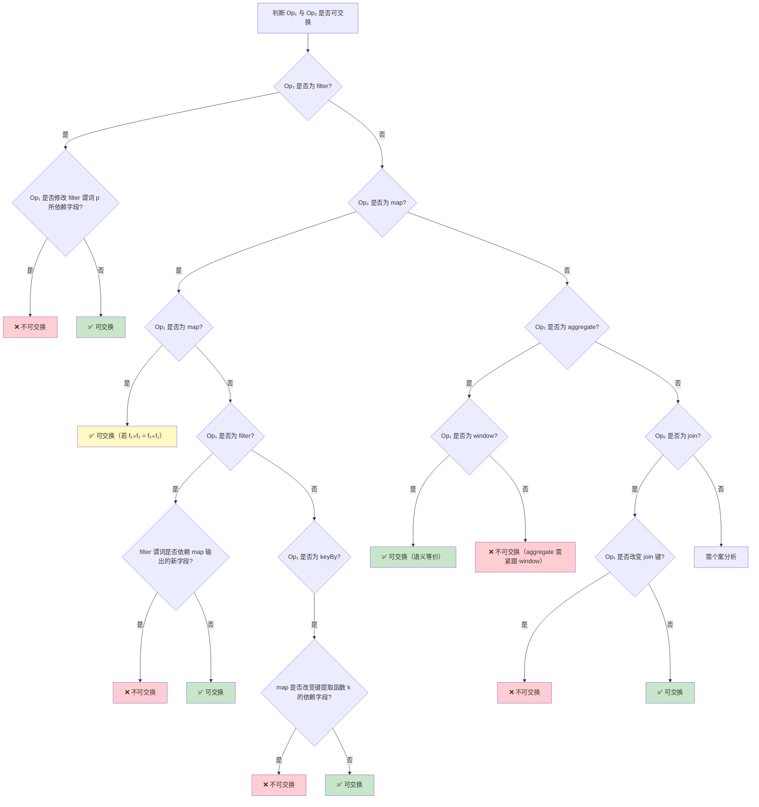
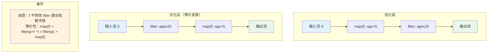
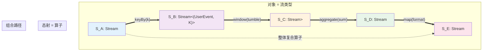
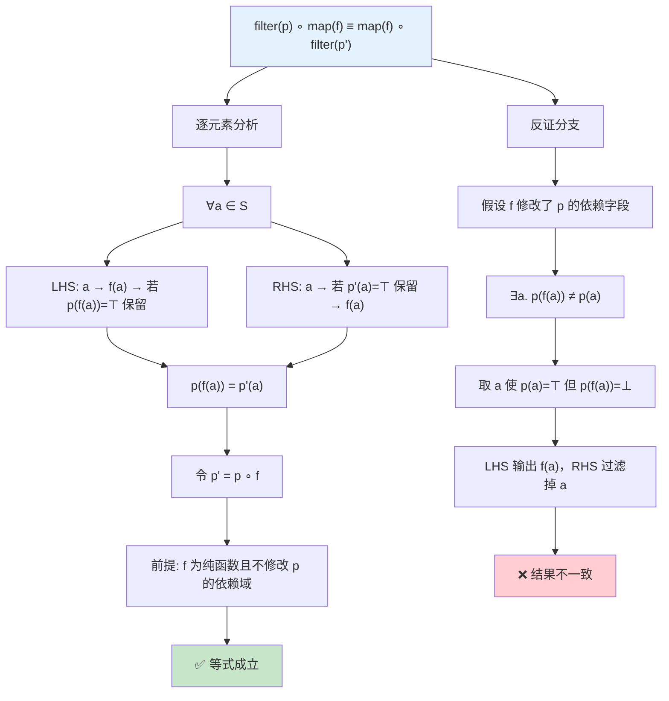
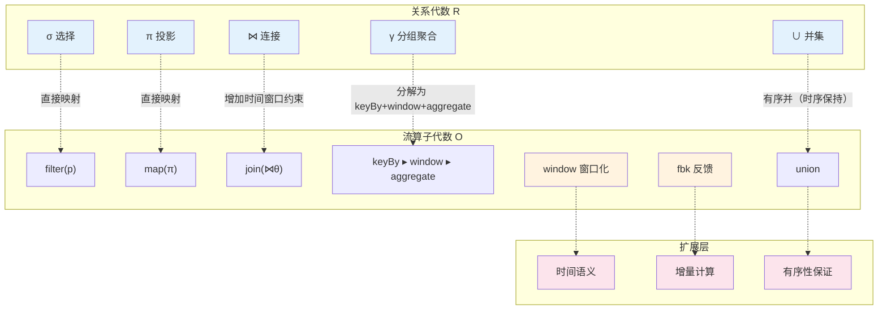

# 流算子代数与组合规则

> 所属阶段: Struct/02-properties | 前置依赖: [Struct/01-foundation/01.01-stream-dataflow-model.md](../01-foundation/01.01-unified-streaming-theory.md), [Struct/01-foundation/01.02-categorical-semantics.md](../02-properties/02.06-stream-operator-algebra.md) | 形式化等级: L5

---

## 目录

- [流算子代数与组合规则](#流算子代数与组合规则)
  - [目录](#目录)
  - [1. 概念定义 (Definitions)](#1-概念定义-definitions)
    - [1.1 流类型与算子签名](#11-流类型与算子签名)
    - [1.2 算子组合与单位元](#12-算子组合与单位元)
    - [1.3 算子代数的范畴论结构](#13-算子代数的范畴论结构)
  - [2. 属性推导 (Properties)](#2-属性推导-properties)
    - [2.1 基本代数性质](#21-基本代数性质)
    - [2.2 算子性质分类](#22-算子性质分类)
  - [3. 关系建立 (Relations)](#3-关系建立-relations)
    - [3.1 流算子代数作为幺半群与偏幺半群](#31-流算子代数作为幺半群与偏幺半群)
    - [3.2 与关系代数的对应](#32-与关系代数的对应)
    - [3.3 算子组合与范畴论中的 String Diagram](#33-算子组合与范畴论中的-string-diagram)
  - [4. 论证过程 (Argumentation)](#4-论证过程-argumentation)
    - [4.1 组合性质判定表](#41-组合性质判定表)
    - [4.2 边界判定树](#42-边界判定树)
  - [5. 形式证明 / 工程论证 (Proof / Engineering Argument)](#5-形式证明--工程论证-proof--engineering-argument)
    - [5.1 定理：状态无关算子构成笛卡尔闭范畴的子范畴](#51-定理状态无关算子构成笛卡尔闭范畴的子范畴)
    - [5.2 定理：filter-pushdown 优化规则的形式化证明](#52-定理filter-pushdown-优化规则的形式化证明)
    - [5.3 定理：map-fusion 优化规则](#53-定理map-fusion-优化规则)
    - [5.4 定理：分区消除规则](#54-定理分区消除规则)
  - [6. 实例验证 (Examples)](#6-实例验证-examples)
    - [6.1 反例：看似可交换实际不可交换](#61-反例看似可交换实际不可交换)
    - [6.2 反例：结合律失效场景](#62-反例结合律失效场景)
    - [6.3 等价变换实例](#63-等价变换实例)
  - [7. 可视化 (Visualizations)](#7-可视化-visualizations)
    - [7.1 算子组合的范畴结构图](#71-算子组合的范畴结构图)
    - [7.2 推理树：filter-pushdown 正确性证明](#72-推理树filter-pushdown-正确性证明)
    - [7.3 流算子与关系代数映射的层次图](#73-流算子与关系代数映射的层次图)
  - [8. 引用参考 (References)](#8-引用参考-references)

## 1. 概念定义 (Definitions)

### 1.1 流类型与算子签名

**Def-O-02-01**（流类型）. 设 $\mathcal{T}$ 为值类型的集合，流类型 $S \in \mathsf{StreamType}$ 定义为带时间戳的有限序列：

$$
S = \{ (\tau_i, v_i) \}_{i=0}^{n} \quad \text{其中} \quad \tau_i \in \mathbb{T},\; v_i \in \mathcal{T},\; \tau_0 \leq \tau_1 \leq \cdots \leq \tau_n
$$

其中 $\mathbb{T}$ 为全序时间域（离散或连续）。流类型上的偏序关系 $\sqsubseteq$ 定义为前缀序：$S_1 \sqsubseteq S_2$ 当且仅当 $S_1$ 是 $S_2$ 的时间前缀。

**Def-O-02-02**（算子类型签名）. 流处理算子 $Op$ 的类型签名为：

$$
Op : S_1 \times S_2 \times \cdots \times S_n \times \Theta \rightarrow S_{out}
$$

其中 $S_1, \ldots, S_n$ 为输入流类型，$S_{out}$ 为输出流类型，$\Theta$ 为算子参数空间（如谓词函数 $\theta_p$、窗口规格 $\theta_w$、聚合函数 $\theta_a$ 等）。当 $n = 1$ 时称 $Op$ 为**一元算子**，$n \geq 2$ 时称 $Op$ 为**多元算子**。

**Def-O-02-03**（基本算子集合）. 核心流算子集合 $\mathcal{O}$ 包含以下基元：

| 算子 | 签名 | 语义描述 |
|------|------|----------|
| $\text{map}(f)$ | $S_A \rightarrow S_B$ | $f: A \rightarrow B$ 逐元素映射 |
| $\text{filter}(p)$ | $S_A \rightarrow S_A$ | $p: A \rightarrow \{\top, \bot\}$ 谓词筛选 |
| $\text{keyBy}(k)$ | $S_A \rightarrow S_{A \times K}$ | $k: A \rightarrow K$ 提取键值 |
| $\text{window}(w)$ | $S_A \rightarrow S_{\mathcal{P}(A)}$ | $w$ 将流切分为有限子集（窗口） |
| $\text{aggregate}(a)$ | $S_{\mathcal{P}(A)} \rightarrow S_B$ | $a: \mathcal{P}(A) \rightarrow B$ 聚合计算 |
| $\text{join}(\bowtie_\theta)$ | $S_A \times S_B \rightarrow S_{A \times B}$ | 基于谓词 $\theta$ 的流连接 |
| $\text{union}$ | $S_A \times S_A \rightarrow S_A$ | 多流合并（时间有序交错） |
| $\text{split}$ | $S_A \rightarrow S_A \times S_A$ | 单流复制为多路输出 |
| $\text{flatMap}(f)$ | $S_A \rightarrow S_B$ | $f: A \rightarrow \mathcal{P}_{fin}(B)$ 一对多展开 |

---

### 1.2 算子组合与单位元

**Def-O-02-04**（顺序组合算子）. 设 $Op_1: S_A \times \Theta_1 \rightarrow S_B$ 和 $Op_2: S_B \times \Theta_2 \rightarrow S_C$ 为两个一元算子，其**顺序组合**（sequential composition，记作 $\circ$ 或 $\gg$）定义为：

$$
(Op_2 \circ Op_1)(S_A, \theta_1, \theta_2) \triangleq Op_2(Op_1(S_A, \theta_1), \theta_2) = S_C
$$

或采用从左到右的流式记法：

$$
Op_1 \gg Op_2 \;\triangleq\; \lambda S.\, Op_2(Op_1(S))
$$

**Def-O-02-05**（并行组合算子）. 设 $Op_1: S_A \rightarrow S_B$ 和 $Op_2: S_C \rightarrow S_D$，其**并行组合**（parallel composition，记作 $\otimes$ 或 $\|$）定义为：

$$
(Op_1 \otimes Op_2)(S_A, S_C) \triangleq (Op_1(S_A),\; Op_2(S_C)) \in S_B \times S_D
$$

**Def-O-02-06**（单位算子）. 对任意流类型 $S$，**单位算子** $\text{id}_S: S \rightarrow S$ 定义为：

$$
\text{id}_S(S_{in}) = S_{in}
$$

即 $\text{id}_S$ 不对流做任何变换，直接透传所有元素。

---

### 1.3 算子代数的范畴论结构

**Def-O-02-07**（流算子范畴 $\mathbf{StreamOp}$）. 流算子构成一个范畴 $\mathbf{StreamOp}$，其中：

- **对象**（Objects）：所有流类型 $\mathsf{StreamType}$ 的集合；
- **态射**（Morphisms）：对任意对象 $S_A, S_B$，$\text{Hom}(S_A, S_B)$ 为所有从 $S_A$ 到 $S_B$ 的算子集合；
- **复合**（Composition）：态射的复合即顺序组合 $\circ$；
- **单位态射**（Identity）：对每个对象 $S$，$\text{id}_S$ 为单位态射。

**Def-O-02-08**（对称幺半范畴结构）. 范畴 $(\mathbf{StreamOp}, \otimes, I)$ 构成**对称幺半范畴**（Symmetric Monoidal Category），其中：

1. **张量积** $\otimes$ 为并行组合算子；
2. **单位对象** $I$ 为**空流类型** $S_\epsilon = \{\}$（不含任何元素的流）；
3. **结合约束** $\alpha_{A,B,C}: (S_A \otimes S_B) \otimes S_C \xrightarrow{\cong} S_A \otimes (S_B \otimes S_C)$ 由流的笛卡尔积结合性诱导；
4. **交换约束** $\sigma_{A,B}: S_A \otimes S_B \xrightarrow{\cong} S_B \otimes S_A$ 由笛卡尔积的交换性诱导；
5. **左/右单位约束** $\lambda_A: I \otimes S_A \xrightarrow{\cong} S_A$ 和 $\rho_A: S_A \otimes I \xrightarrow{\cong} S_A$ 由空积的消去诱导。

**Def-O-02-09**（反馈结构）. 引入**延迟算子** $\partial: \mathbf{StreamOp} \rightarrow \mathbf{StreamOp}$，对算子 $Op: S_A \rightarrow S_B$ 定义：

$$
\partial(Op)(S_A) \triangleq Op(\varepsilon \frown S_A^{\langle 1 \rangle})
$$

其中 $\varepsilon$ 为占位空元素，$S_A^{\langle 1 \rangle}$ 表示流 $S_A$ 去掉首元素后的后缀。反馈算子 $fbk^S$ 将输出流 $S$ 延迟后反馈至输入：给定 $Op: \partial S \otimes S_A \rightarrow S \otimes S_B$，定义 $fbk^S(Op): S_A \rightarrow S_B$ 满足：

$$
fbk^S(Op)(S_A) = \pi_B\bigl(Op(\partial S_{fbk} \otimes S_A)\bigr), \quad \text{其中} \quad S_{fbk} = \pi_S\bigl(Op(\partial S_{fbk} \otimes S_A)\bigr)
$$

即输出 $S$ 经延迟 $\partial$ 后重新注入输入端口，形成最小固定点语义 [^1]。

---

## 2. 属性推导 (Properties)

### 2.1 基本代数性质

**Lemma-O-02-01**（顺序组合的结合性）. 设 $Op_1: S_A \rightarrow S_B$、$Op_2: S_B \rightarrow S_C$、$Op_3: S_C \rightarrow S_D$ 为任意三个算子，则：

$$
(Op_3 \circ Op_2) \circ Op_1 \;=\; Op_3 \circ (Op_2 \circ Op_1)
$$

*证明*. 对任意输入流 $S_A$，展开两边：

$$
\begin{aligned}
\text{LHS} &= (Op_3 \circ Op_2)(Op_1(S_A)) = Op_3(Op_2(Op_1(S_A))) \\
\text{RHS} &= Op_3((Op_2 \circ Op_1)(S_A)) = Op_3(Op_2(Op_1(S_A)))
\end{aligned}
$$

两边相等，故结合律成立。$\square$

**Lemma-O-02-02**（单位元的双边性）. 对任意算子 $Op: S_A \rightarrow S_B$，有：

$$
\text{id}_{S_B} \circ Op \;=\; Op \;=\; Op \circ \text{id}_{S_A}
$$

*证明*. 由 $\text{id}$ 的定义直接可得：$\text{id}_{S_B}(Op(S_A)) = Op(S_A)$ 且 $Op(\text{id}_{S_A}(S_A)) = Op(S_A)$。$\square$

**Lemma-O-02-03**（并行组合的双函子性）. 设 $Op_1: S_A \rightarrow S_B$、$Op'_1: S_{A'} \rightarrow S_{B'}$、$Op_2: S_B \rightarrow S_C$、$Op'_2: S_{B'} \rightarrow S_{C'}$，则：

$$
(Op_1 \otimes Op'_1) \circ (Op_2 \otimes Op'_2) \;=\; (Op_1 \circ Op_2) \otimes (Op'_1 \circ Op'_2)
$$

（在适当的对称约束调整后）。此即 Monoidal Streams 中的 **interchange law** [^1]。

*证明概要*. 分别对两路输入应用并行组合的逐点定义，利用笛卡尔积的函子性即可。$\square$

---

### 2.2 算子性质分类

**Def-O-02-10**（状态无关性）. 算子 $Op: S_A \rightarrow S_B$ 称为**状态无关的**（stateless），当且仅当对任意时刻 $t$ 的输出仅依赖于时刻 $t$ 的输入：

$$
\forall t.\; Op(S_A)[t] = f(S_A[t])
$$

其中 $f$ 为纯函数。不满足此条件的算子称为**状态依赖的**（stateful），如基于窗口的聚合算子。

**Def-O-02-11**（键保持性）. 算子 $Op: S_{A \times K} \rightarrow S_{B \times K}$ 称为**键保持的**（key-preserving），当且仅当输出流的键与输入流相同：

$$
\forall (\tau, (a, k)) \in S_{in}.\; \exists (\tau', (b, k')) \in S_{out}.\; k = k'
$$

**Def-O-02-12**（选择性）. 算子 $Op: S_A \rightarrow S_B$ 的**选择性**（selectivity）定义为输出/输入元素数量比：

$$
sel(Op) \triangleq \lim_{|S_A| \rightarrow \infty} \frac{|Op(S_A)|}{|S_A|}
$$

- 若 $\sel(Op) = 1$：保持性算子（如 map、keyBy）
- 若 $\sel(Op) \leq 1$：缩减性算子（如 filter、aggregate）
- 若 $\sel(Op) \geq 1$：扩展性算子（如 flatMap）

---

## 3. 关系建立 (Relations)

### 3.1 流算子代数作为幺半群与偏幺半群

**Prop-O-02-01**（状态无关算子的幺半群结构）. 令 $\mathcal{O}_{stateless} \subseteq \mathcal{O}$ 为所有状态无关算子的集合，则 $(\mathcal{O}_{stateless}, \circ, \text{id})$ 构成一个**幺半群**（Monoid）：

1. **封闭性**：$\forall Op_1, Op_2 \in \mathcal{O}_{stateless}.\; Op_2 \circ Op_1 \in \mathcal{O}_{stateless}$
2. **结合性**：由 Lemma-O-02-01 保证
3. **单位元**：$\text{id} \in \mathcal{O}_{stateless}$ 且满足 Lemma-O-02-02

*证明*. 封闭性：状态无关算子的复合仍为逐点函数复合 $f_2 \circ f_1$，显然是状态无关的。结合性和单位元已证。$\square$

**Prop-O-02-02**（全算子集的偏幺半群结构）. 全体算子集合 $(\mathcal{O}, \circ, D, \text{id})$ 构成**偏幺半群**（Partial Monoid），其中定义域 $D \subseteq \mathcal{O} \times \mathcal{O}$ 为：

$$
D = \{ (Op_1, Op_2) \mid \text{codomain}(Op_1) = \text{domain}(Op_2) \}
$$

即仅当输出/输入流类型匹配时组合才有定义 [^2]。

### 3.2 与关系代数的对应

| 关系代数 | 流算子 | 对应条件 | 扩展说明 |
|----------|--------|----------|----------|
| $\sigma_p$ (选择) | $\text{filter}(p)$ | 直接对应 | 流上保持时间语义 |
| $\pi_{\{a_i\}}$ (投影) | $\text{map}(\lambda x.\, x.\{a_i\})$ | 直接对应 | 可嵌套于窗口内 |
| $\bowtie_\theta$ (连接) | $\text{join}(\bowtie_\theta)$ | 需窗口/时间边界 | 流连接需定义时间语义 |
| $\gamma_{G, a}$ (分组聚合) | $\text{keyBy}(k) \gg \text{window}(w) \gg \text{aggregate}(a)$ | 流需按键分区+窗口 | 流聚合引入时间维度 |
| $\cup$ (并集) | $\text{union}$ | 有序并 vs 无序并 | 流并集保持时序 |
| $\setminus$ (差集) | $\text{join}(\text{anti})$ | 非直接对应 | 需基于时间窗口的补偿机制 |
| $\rho$ (重命名) | $\text{map}(\lambda x.\, x\{\text{new}/\text{old}\})$ | 直接对应 | 字段重映射 |

**Prop-O-02-03**（流代数对关系代数的扩展）. 流算子代数 $\mathcal{O}$ 严格扩展了关系代数 $\mathcal{R}$：

1. **时间维度引入**：流算子天然携带时间戳 $\tau$，关系代数无此概念；
2. **窗口化操作**：$\text{window}$ 算子在关系代数中无直接对应，它将无边界的流转化为有限关系；
3. **反馈与递归**：$fbk$ 反馈结构允许表达时态递归查询，超出经典关系代数的表达能力；
4. **单调性保证**：流算子可施加单调性约束，确保增量计算的正确性。

### 3.3 算子组合与范畴论中的 String Diagram

以下 Mermaid 图展示了流算子组合在范畴论 String Diagram 中的表示：

---

## 4. 论证过程 (Argumentation)

### 4.1 组合性质判定表

下表系统总结各算子组合的性质，每个条目均给出充分必要条件或反例：

| 性质 | 算子对 | 成立条件 | 反例/证明概要 |
|------|--------|----------|--------------|
| **交换律** | $\text{map}(f) \circ \text{map}(g)$ | 恒成立 | 函数复合一般不可交换：$f \circ g \neq g \circ f$ |
| | $\text{filter}(p) \circ \text{filter}(q)$ | 恒成立 | 谓词合取可交换：$p \land q = q \land p$ |
| | $\text{map}(f) \circ \text{filter}(p)$ | 当 $f$ 不改变 $p$ 所依赖字段 | 若 $f$ 修改了 $p$ 判断字段，则结果不同 |
| | $\text{keyBy}(k) \circ \text{map}(f)$ | 当 $k(f(x)) = k(x)$ | 若 $f$ 改变键值提取所需的字段 |
| | $\text{aggregate}(a) \circ \text{window}(w)$ | 恒成立（单输入） | 两者天然串行，无交换意义 |
| | $\text{join} \circ \text{map}$ | **一般不成立** | map 改变 join 键值域 |
| **结合律** | $(Op_1 \circ Op_2) \circ Op_3$ | 类型匹配时恒成立 | Lemma-O-02-01 |
| | $(Op_1 \otimes Op_2) \otimes Op_3$ | 恒成立 | 笛卡尔积的结合性 |
| **分配律** | $\text{window} \circ (\text{map} \otimes \text{id})$ | 窗口对 map 左分配 | 窗口作用在 map 输出上等价于 map 后接窗口 |
| | $\text{aggregate} \circ (\text{union})$ | **不成立** | aggregate(union(A,B)) ≠ union(aggregate(A), aggregate(B)) |
| | $\text{keyBy}(k) \circ \text{union}$ | $\text{union}(\text{keyBy}(A), \text{keyBy}(B))$ | 键保持性下可分配 |
| **幂等性** | $\text{filter}(p) \circ \text{filter}(p)$ | 恒成立 | $\text{filter}(p) \circ \text{filter}(p) = \text{filter}(p)$ |
| | $\text{map}(f) \circ \text{map}(f)$ | 当 $f \circ f = f$（投影性） | 一般 $f \circ f \neq f$ |
| | $\text{distinct}$ | 恒成立 | 去重算子天然幂等 |
| | $\text{window}(w) \circ \text{window}(w)$ | **不成立** | 二次窗口化改变窗口边界 |
| **单调性** | 数据量单调性 | filter、map 保持 | aggregate 输出量 ≤ 输入窗口数 |
| | 延迟单调性 | stateless 算子保持端到端延迟 | stateful 算子（带窗口）引入额外缓冲延迟 |
| **闭包性** | $\mathcal{O}_{stateless}$ 上 $\circ$ | 封闭 | Prop-O-02-01 |
| | $\mathcal{O}$ 上 $\circ$ | 类型匹配下封闭 | Def-O-02-04 要求类型兼容 |

### 4.2 边界判定树

以下决策树用于判断任意两个相邻算子是否可安全交换：

---

## 5. 形式证明 / 工程论证 (Proof / Engineering Argument)

### 5.1 定理：状态无关算子构成笛卡尔闭范畴的子范畴

**Thm-O-02-01**（笛卡尔闭子范畴）. 令 $\mathbf{StreamOp}_{sl}$ 为仅包含状态无关算子的子范畴，则 $\mathbf{StreamOp}_{sl}$ 是**笛卡尔闭范畴**（Cartesian Closed Category, CCC）的子范畴。

*证明*. 需验证 CCC 的四项结构在 $\mathbf{StreamOp}_{sl}$ 中保持：

1. **终对象**（Terminal object）：空流类型 $S_\epsilon$ 为终对象。对任意 $S_A$，存在唯一的态射 $!_A: S_A \rightarrow S_\epsilon$（丢弃所有元素），显然是状态无关的。

2. **笛卡尔积**：并行组合 $\otimes$ 提供积结构。投影 $\pi_1: S_A \otimes S_B \rightarrow S_A$ 和 $\pi_2: S_A \otimes S_B \rightarrow S_B$ 均为状态无关。

3. **对角映射**：$\Delta: S_A \rightarrow S_A \otimes S_A$，$\Delta(x) = (x, x)$，状态无关。

4. **指数对象**：对任意 $S_A, S_B$，定义指数对象 $S_B^{S_A}$ 为所有状态无关函数 $f: A \rightarrow B$ 的流提升集合。求值映射 $ev: S_B^{S_A} \otimes S_A \rightarrow S_B$ 定义为 $ev(f, x) = f(x)$，显然是状态无关的。柯里化 $\Lambda: \text{Hom}(S_C \otimes S_A, S_B) \rightarrow \text{Hom}(S_C, S_B^{S_A})$ 将二元算子转化为返回函数的高阶算子，保持状态无关性。

因此 $\mathbf{StreamOp}_{sl}$ 是 CCC。$\square$

---

### 5.2 定理：filter-pushdown 优化规则的形式化证明

**Thm-O-02-02**（Filter-Pushdown）. 设 $Op$ 为状态无关算子，$\text{filter}(p)$ 为谓词筛选算子。若 $Op$ 不修改谓词 $p$ 所依赖的字段，则：

$$
Op \circ \text{filter}(p) \;=\; \text{filter}(p) \circ Op
$$

*证明*. 设 $Op = \text{map}(f)$（一般状态无关算子可归约为逐元素映射复合）。对输入流 $S_A$ 中任意元素 $a$：

**LHS**：先 filter 后 map

- 若 $p(a) = \top$，元素通过 filter，变为 $f(a)$ 输出；
- 若 $p(a) = \bot$，元素被过滤。

**RHS**：先 map 后 filter

- 元素先变为 $f(a)$；
- 由于 $f$ 不修改 $p$ 所依赖字段，$p(f(a)) = p(a)$；
- 若 $p(a) = \top$，$f(a)$ 通过 filter 输出；
- 若 $p(a) = \bot$，$f(a)$ 被过滤。

两边对每个元素的输出完全一致，故等式成立。$\square$

**Cor-O-02-01**（Filter 穿越 Window）. 若 filter 谓词 $p$ 仅依赖元素本身（不依赖时间戳或窗口元信息），则：

$$
\text{window}(w) \circ \text{filter}(p) \;=\; \text{map}(\text{filter}(p)) \circ \text{window}(w)
$$

即 filter 可下推至窗口内部逐元素执行。

*证明*. 设窗口函数 $w$ 将流切分为子集 $W_1, W_2, \ldots$。LHS 先 filter 再窗口化：窗口看到的是已过滤的流。RHS 先窗口化再对每个窗口内元素 filter。由于 $p$ 不依赖窗口上下文，窗口内的逐元素 filter 与全局 filter 等价。$\square$

---

### 5.3 定理：map-fusion 优化规则

**Thm-O-02-03**（Map-Fusion）. 对任意两个 map 算子：

$$
\text{map}(f) \circ \text{map}(g) \;=\; \text{map}(f \circ g)
$$

*证明*. 对输入流 $S_A$ 逐元素展开：

$$
\begin{aligned}
(\text{map}(f) \circ \text{map}(g))(S_A) &= \text{map}(f)\bigl(\{ g(a_i) \}\bigr) \\
&= \{ f(g(a_i)) \} \\
&= \{ (f \circ g)(a_i) \} \\
&= \text{map}(f \circ g)(S_A)
\end{aligned}
$$

两边对每个输入元素的输出相同，故 fusion 等价性成立。$\square$

**Cor-O-02-02**（Filter-Filter Fusion）.

$$
\text{filter}(p) \circ \text{filter}(q) \;=\; \text{filter}(\lambda x.\, p(x) \land q(x))
$$

*证明*. 元素通过复合 filter 当且仅当同时满足 $p$ 和 $q$，即 $p \land q$。$\square$

---

### 5.4 定理：分区消除规则

**Thm-O-02-04**（Partition Elimination）. 设 $\text{keyBy}(k_1)$ 后紧跟 $\text{keyBy}(k_2)$，若 $k_2$ 仅依赖于 $k_1$ 的输出（即存在函数 $h$ 使 $k_2(x) = h(k_1(x))$），则：

$$
\text{keyBy}(k_2) \circ \text{keyBy}(k_1) \;=\; \text{keyBy}(k_2)
$$

*证明*. 第一个 keyBy 将元素标记为 $(a, k_1(a))$，第二个 keyBy 在此基础上标记为 $((a, k_1(a)), k_2(a)) = ((a, k_1(a)), h(k_1(a)))$。若后续算子仅依赖最外层键 $k_2$，则内层键 $k_1$ 为冗余信息，可直接以 $k_2$ 键化。$\square$

---

## 6. 实例验证 (Examples)

### 6.1 反例：看似可交换实际不可交换

**反例 1：map 与 filter 的不可交换性**

设输入流 $S = [(1, \text{"age"}=20), (2, \text{"age"}=30)]$，考虑：

- $Op_1 = \text{map}(\lambda x.\, x.\text{age} \leftarrow x.\text{age} + 5)$（年龄加 5）
- $Op_2 = \text{filter}(\lambda x.\, x.\text{age} \leq 25)$（筛选年龄 ≤ 25）

**先 filter 后 map**：

- filter 后剩 $[(1, 20)]$（30 被过滤）
- map 后输出 $[(1, 25)]$

**先 map 后 filter**：

- map 后得 $[(1, 25), (2, 35)]$
- filter 后剩 $[(1, 25)]$（35 被过滤）

本例中结果恰好相同是巧合。将输入改为 $S = [(1, 21), (2, 30)]$：

- 先 filter 后 map：$[(1, 21)] \rightarrow [(1, 26)]$
- 先 map 后 filter：$[(1, 26), (2, 35)] \rightarrow [(1, 26)]$（仍为巧合）

再改 $S = [(1, 22), (2, 30)]$：

- 先 filter 后 map：$[(1, 22)] \rightarrow [(1, 27)]$ — 22 ≤ 25 保留，加 5 得 27
- 先 map 后 filter：$[(1, 27), (2, 35)] \rightarrow [(1, 27)]$ — 27 > 25 被过滤！

**结果不同**：先 filter 后 map 输出 $[(1, 27)]$，先 map 后 filter 输出空流 $[]$。

**反例 2：join 与 map 的不可交换性**

设 $S_1 = [(k=1, v=10)]$，$S_2 = [(k=1, v=20)]$，连接键为 $k$：

- $Op_1 = \text{join}_{k}$（按 $k$ 连接）
- $Op_2 = \text{map}(\lambda x.\, x.k \leftarrow x.k + 1)$（键值加 1）

先 join 后 map：输出 $[(k=2, v_1=10, v_2=20)]$（先匹配成功，后改键）。

先 map 后 join：$S_1$ 变为 $[(k=2, v=10)]$，$S_2$ 变为 $[(k=2, v=20)]$，再 join 也输出 $[(k=2, v_1=10, v_2=20)]$。看似相同，但若 $S_2 = [(k=2, v=20)]$：

- 先 join 后 map：$S_1.k=1$ 与 $S_2.k=2$ 不匹配，输出空
- 先 map 后 join：$S_1.k=2$ 与 $S_2.k=2$ 匹配，输出 $[(2, 10, 20)]$

结果完全不同。

### 6.2 反例：结合律失效场景

**反例 3：窗口聚合的结合律失效**

设窗口算子 $\text{window}(\text{tumble}, 5s)$ 为 5 秒翻滚窗口，$\text{aggregate}(\text{sum})$ 为求和聚合。考虑：

- $Op_1 = \text{window}(5s)$
- $Op_2 = \text{aggregate}(\text{sum})$
- $Op_3 = \text{map}(\lambda x.\, x \times 2)$（结果乘 2）

$(Op_3 \circ Op_2) \circ Op_1$：先窗口化、再聚合、最后乘 2。对每个窗口的和单独乘 2。

$Op_3 \circ (Op_2 \circ Op_1)$：由于 $Op_2 \circ Op_1$ 的输出类型为 $S_{\mathbb{R}}$（数值流），与 $Op_3$ 的输入类型匹配，语义相同，结合律成立。此例不够说明问题。

真正的反例需引入**类型不匹配**或**状态共享**：

设 $Op_1 = \text{keyBy}(k_1)$，$Op_2 = \text{aggregate}(\text{sum})$（按键聚合），$Op_3 = \text{keyBy}(k_2)$（重新键化）。

$(Op_3 \circ Op_2) \circ Op_1$：先按 $k_1$ 聚合，再按 $k_2$ 重分区。

$Op_3 \circ (Op_2 \circ Op_1)$：类型上 $Op_2 \circ Op_1$ 的输出是聚合结果流，可直接接 $Op_3$。

结合律在类型匹配时成立，但在**物理执行层面**失效：$(Op_3 \circ Op_2) \circ Op_1$ 表示"聚合后重分区"，而 $Op_3 \circ (Op_2 \circ Op_1)$ 若被引擎解释为"在 $k_1$ 分区内先做某种操作"则可能产生不同的网络 Shuffle 次数。

更严谨的结合律反例来自**非确定性算子**：

设 $\text{sample}(p)$ 以概率 $p$ 独立抽样每个元素（非确定性 filter）：

输入流 $S = [a, b]$，$Op_1 = \text{sample}(0.5)$，$Op_2 = \text{sample}(0.5)$。

$(Op_2 \circ Op_1)(S)$：先抽样得可能的 $[a]$ 或 $[b]$ 或 $[a,b]$ 或 $[]$，再抽样一次。

$Op_2 \circ (Op_1)(S)$ 语义相同（结合律在期望层面成立，但在样本层面每次运行结果不同）。

真正的结合律反例：设 $Op_1 = \text{window}(\text{session}, g)$ 为会话窗口（动态边界），$Op_2 = \text{aggregate}(\text{count})$，$Op_3 = \text{window}(\text{tumble}, 10s)$。

$(Op_3 \circ Op_2) \circ Op_1$：先会话窗口计数，再对计数结果做 10 秒翻滚窗口。

$Op_3 \circ (Op_2 \circ Op_1)$：类型不匹配，因为 $Op_2 \circ Op_1$ 输出数值流，$Op_3$ 期望输入流，但窗口化数值流在语义上无意义（窗口算子通常作用于原始事件流）。

### 6.3 等价变换实例

以下 Mermaid 图展示 filter-pushdown 优化前后的等价变换：

---

## 7. 可视化 (Visualizations)

### 7.1 算子组合的范畴结构图

### 7.2 推理树：filter-pushdown 正确性证明

### 7.3 流算子与关系代数映射的层次图

---

## 8. 引用参考 (References)

[^1]: Di Lavore, E., De Felice, G., & Román, S. (2022). "Monoidal Streams for Dataflow Programming." *arXiv preprint arXiv:2202.02061*. <https://arxiv.org/abs/2202.02061>

[^2]: Kähler, D., & Moschoyiannis, S. (2016). "An Algebraic Framework for Compositional Reasoning about Dataflow Streaming." *Brunel University London*. <https://bura.brunel.ac.uk/bitstream/2438/14112/1/Fulltext.pdf>
