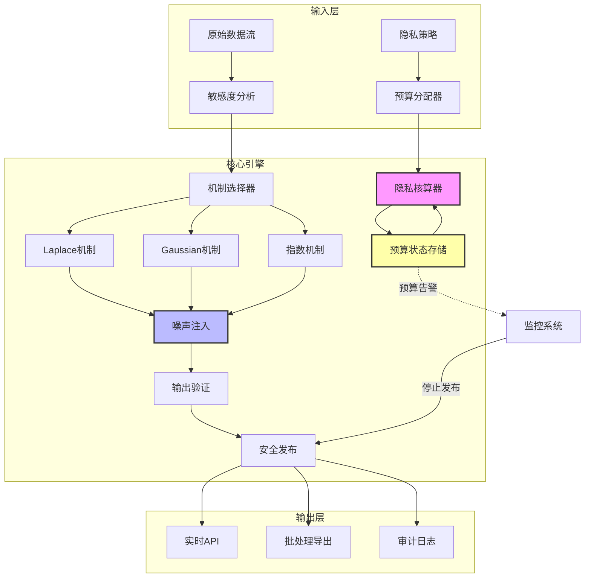

# 流式差分隐私 - 实时数据隐私保护

> **所属阶段**: Struct/ | **前置依赖**: [01-foundations/01.02-streaming-model.md](../01-foundations/01.02-streaming-model.md), [02.01-stateful-computations.md](./02.01-stateful-computations.md) | **形式化等级**: L5

## 1. 概念定义 (Definitions)

### Def-S-02-21: (ε,δ)-差分隐私 ((ε,δ)-Differential Privacy)

一个随机算法 $\mathcal{M}: \mathcal{D} \to \mathcal{R}$ 满足 $(\varepsilon, \delta)$-差分隐私，当且仅当对于任意两个相邻数据集 $D, D' \in \mathcal{D}$（即最多相差一个记录），以及任意输出子集 $S \subseteq \mathcal{R}$，有：

$$
\Pr[\mathcal{M}(D) \in S] \leq e^{\varepsilon} \cdot \Pr[\mathcal{M}(D') \in S] + \delta
$$

**直观解释**：

- 当 $\delta = 0$ 时，退化为纯 $\varepsilon$-差分隐私
- $\varepsilon$ 控制隐私保护强度（越小越严格）
- $\delta$ 允许的小概率隐私泄露事件

在流式场景下，数据集是连续到达的数据项序列 $\{x_1, x_2, \ldots\}$，相邻性定义为在任意时刻 $t$ 的流前缀中最多添加/删除一个数据项。

### Def-S-02-22: 敏感度 (Sensitivity)

**全局敏感度 (Global Sensitivity)**：
对于查询函数 $f: \mathcal{D} \to \mathbb{R}^d$，全局敏感度定义为：

$$
\Delta_f = \max_{D \sim D'} \|f(D) - f(D')\|_p
$$

其中 $D \sim D'$ 表示相邻数据集，$\|\cdot\|_p$ 为 $L_p$ 范数。

**局部敏感度 (Local Sensitivity)**：
给定具体数据集 $D$，局部敏感度为：

$$
\Delta_f(D) = \max_{D' \sim D} \|f(D) - f(D')\|_p
$$

**流式计算考虑**：

- 全局敏感度适用于无界域查询（如计数、求和）
- 局部敏感度需要平滑化机制（smooth sensitivity）以避免隐私泄露
- 流式查询的敏感度可能随窗口大小变化

### Def-S-02-23: 隐私预算管理 (Privacy Budget Management)

**Def-S-02-23a - 整体隐私预算 (Total Privacy Budget)**：
流式计算系统在时间范围 $T$ 内的总隐私预算 $\varepsilon_{total}$ 是所有时刻释放结果所消耗预算的上限：

$$
\sum_{t=1}^{T} \varepsilon_t \leq \varepsilon_{total}
$$

**Def-S-02-23b - 自适应预算分配 (Adaptive Budget Allocation)**：
在时刻 $t$，根据当前数据特征和剩余预算 $\varepsilon_{rem}(t)$，动态确定本次释放的预算 $\varepsilon_t$：

$$
\varepsilon_t = \mathcal{A}(D_t, \varepsilon_{rem}(t), \mathcal{H}_{t-1})
$$

其中 $\mathcal{H}_{t-1}$ 表示历史释放记录，$\mathcal{A}$ 为分配策略。

**Def-S-02-23c - 预算耗尽阈值 (Budget Exhaustion Threshold)**：
定义隐私服务终止条件：当 $\varepsilon_{rem}(t) < \varepsilon_{min}$ 时，系统停止回答查询或切换至完全匿名化模式。

### Def-S-02-24: 流式噪声机制 (Streaming Noise Mechanisms)

**Def-S-02-24a - 事件级隐私 (Event-Level Privacy)**：
保护单个数据项在流中的存在性，每个事件分配独立隐私预算 $\varepsilon_{event}$。

**Def-S-02-24b - 用户级隐私 (User-Level Privacy)**：
保护单个用户贡献的所有数据项，要求同一用户的所有事件共享预算 $\varepsilon_{user}$。

**Def-S-02-24c - 范围隐私 (Range Privacy)**：
对于时间范围 $[t_1, t_2]$ 内的聚合查询，确保整个范围满足 $(\varepsilon, \delta)$-DP。

---

## 2. 属性推导 (Properties)

### Lemma-S-02-12: 流式查询的敏感度分解

对于复合流式查询 $f_{stream}(D_{[1:t]}) = g(f_1(D_1), \ldots, f_t(D_t))$，若各 $f_i$ 的敏感度为 $\Delta_i$，组合函数 $g$ 满足 $L$-Lipschitz 条件，则：

$$
\Delta_{f_{stream}} \leq L \cdot \max_{1 \leq i \leq t} \Delta_i
$$

**证明**：由 Lipschitz 条件与三角不等式直接可得。

### Lemma-S-02-13: 滑动窗口敏感度边界

设滑动窗口大小为 $w$，窗口内聚合查询为 $f_w$，则窗口级敏感度满足：

$$
\Delta_{f_w} \leq \min\left(w \cdot \Delta_{unit}, \Delta_{global}\right)
$$

其中 $\Delta_{unit}$ 为单位数据敏感度，$\Delta_{global}$ 为全局敏感度上限。

### Prop-S-02-07: 时序相关性的隐私放大效应

若流数据中存在时间自相关（$\rho$ 为自相关系数），则有效隐私保护强度劣化为：

$$
\varepsilon_{eff} = \varepsilon \cdot (1 + 2\sum_{k=1}^{\infty} \rho^k) = \varepsilon \cdot \frac{1+\rho}{1-\rho}
$$

**工程推论**：高自相关流（如传感器连续采样）需要增加噪声规模或降低发布频率。

---

## 3. 关系建立 (Relations)

### 3.1 与流计算模型的映射

| 流计算概念 | 差分隐私对应 | 隐私含义 |
|-----------|-------------|---------|
| Event Time | 事件级隐私边界 | 单数据项保护 |
| Processing Time | 处理延迟与噪声延迟 | 实时性-隐私权衡 |
| Watermark | 隐私预算水位线 | 预算消耗进度 |
| Window | 范围隐私范围 | 批量释放的隐私合成 |
| State | 噪声状态累积 | 相关性泄露风险 |

### 3.2 与状态计算的关系

流式差分隐私通常需要维护**噪声状态**（如累积计数），这引出了关键问题：

**状态编码隐私 (State as Privacy Carriers)**：
内部状态 $\sigma_t$ 可能编码历史数据的敏感信息。必须确保状态更新满足差分隐私：

$$
\sigma_t = \mathcal{M}_{update}(\sigma_{t-1}, D_t), \quad \mathcal{M}_{update} \text{ 满足 DP}
$$

### 3.3 隐私-准确性-延迟不可能三角

对于流式释放机制 $\mathcal{M}$，以下三者不可同时最优：

1. **强隐私** ($\varepsilon \to 0$)
2. **高准确性** (噪声方差 $\to 0$)
3. **低延迟** (立即释放)

Mermaid 关系图：

```mermaid
graph TB
    subgraph "流式差分隐私设计空间"
        A[流数据源] --> B{隐私机制选择}
        B --> C[Laplace机制<br/>ε-DP]
        B --> D[Gaussian机制<br/>(ε,δ)-DP]
        B --> E[指数机制<br/>选择问题]

        C --> F[隐私预算管理]
        D --> F
        E --> F

        F --> G[滑动窗口预算]
        F --> H[自适应分配]
        F --> I[组合定理优化]

        G --> J[流式DP输出]
        H --> J
        I --> J

        J --> K[实时人口统计]
        J --> L[位置隐私保护]
        J --> M[传感器数据聚合]
    end

    style F fill:#f9f,stroke:#333,stroke-width:2px
    style J fill:#bbf,stroke:#333,stroke-width:2px
```

---

## 4. 论证过程 (Argumentation)

### 4.1 连续数据释放的攻击面

**攻击模型 1：差分攻击 (Differencing Attack)**
攻击者通过比较相邻时刻的发布结果推断个体存在性：

$$
\hat{x}_t = f^{-1}(\mathcal{M}(D_{[1:t]})) - f^{-1}(\mathcal{M}(D_{[1:t-1]}))
$$

**防御**：确保单事件参与多个窗口时预算正确合成。

**攻击模型 2：时序推断攻击 (Temporal Inference)**
利用时间相关性从噪声序列中恢复信号：

使用卡尔曼滤波或隐马尔可夫模型进行状态估计，攻击精度随自相关系数 $\rho$ 增加而提升。

**防御**：

- 时间域加噪（Temporal Noise）
- 发布频率限制（Publishing Rate Control）
- 混淆相关性结构（Correlation Obfuscation）

### 4.2 隐私预算耗尽的应对策略

**策略 1： graceful degradation**
随预算消耗增加噪声规模：

$$
\sigma_t = \sigma_0 \cdot \frac{\varepsilon_{total}}{\varepsilon_{rem}(t)}
$$

**策略 2：查询优先级调度**
为不同查询分配权重 $w_i$，按加权隐私损失进行调度：

$$
\max \sum_i w_i \cdot u_i(\hat{f}_i) \quad \text{s.t.} \quad \sum_i \varepsilon_i \leq \varepsilon_{rem}
$$

**策略 3：数据最小化切换**
预算耗尽后仅释放完全聚合统计（如全局均值），停止细粒度查询响应。

### 4.3 噪声机制选择决策树

```mermaid
flowchart TD
    A[开始: 选择噪声机制] --> B{查询输出类型?}
    B -->|数值型| C{敏感度类型?}
    B -->|离散选择| D[指数机制]

    C -->|L1敏感度| E{L1范数大小?}
    C -->|L2敏感度| F{需要(ε,δ)-DP?}

    E -->|小| G[标准Laplace]
    E -->|大| H[截断Laplace]

    F -->|是| I[Gaussian机制]
    F -->|否| J[高维Laplace]

    D --> K[效用优化采样]
    G --> L[机制参数计算]
    H --> L
    I --> L
    J --> L
    K --> L

    L --> M[部署流式机制]

    style D fill:#f9f,stroke:#333
    style I fill:#f9f,stroke:#333
    style G fill:#f9f,stroke:#333
```

---

## 5. 形式证明 / 工程论证 (Proof / Engineering Argument)

### 5.1 噪声机制形式化

**定理：Laplace机制 (Laplace Mechanism)**

给定查询 $f: \mathcal{D} \to \mathbb{R}^d$，Laplace机制定义为：

$$
\mathcal{M}_{Lap}(D, f, \varepsilon) = f(D) + (Y_1, \ldots, Y_d), \quad Y_i \overset{iid}{\sim} Lap\left(\frac{\Delta_f}{\varepsilon}\right)
$$

其中 $Lap(b)$ 的概率密度函数为 $p(x) = \frac{1}{2b}e^{-|x|/b}$。

**证明满足 $\varepsilon$-DP**：

对于相邻数据集 $D, D'$，设输出为 $z$：

$$
\begin{aligned}
\frac{\Pr[\mathcal{M}(D) = z]}{\Pr[\mathcal{M}(D') = z]} &= \prod_{i=1}^{d} \frac{\exp(-|z_i - f(D)_i|/b)}{\exp(-|z_i - f(D')_i|/b)} \\
&= \prod_{i=1}^{d} \exp\left(\frac{|z_i - f(D')_i| - |z_i - f(D)_i|}{b}\right) \\
&\leq \prod_{i=1}^{d} \exp\left(\frac{|f(D)_i - f(D')_i|}{b}\right) \\
&= \exp\left(\frac{\|f(D) - f(D')\|_1}{b}\right) \\
&\leq \exp\left(\frac{\Delta_f}{b}\right) = \exp(\varepsilon)
\end{aligned}
$$

**定理：Gaussian机制 (Gaussian Mechanism)**

对于 $L_2$ 敏感度 $\Delta_2$，Gaussian机制：

$$
\mathcal{M}_{Gauss}(D, f, \varepsilon, \delta) = f(D) + (Y_1, \ldots, Y_d), \quad Y_i \overset{iid}{\sim} \mathcal{N}(0, \sigma^2)
$$

满足 $(\varepsilon, \delta)$-DP，当：

$$
\sigma \geq \frac{\Delta_2 \sqrt{2\ln(1.25/\delta)}}{\varepsilon}
$$

**定理：指数机制 (Exponential Mechanism)**

对于输出域 $\mathcal{R}$ 和效用函数 $u: \mathcal{D} \times \mathcal{R} \to \mathbb{R}$，指数机制以概率：

$$
\Pr[\mathcal{M}_E(D, u) = r] \propto \exp\left(\frac{\varepsilon \cdot u(D, r)}{2\Delta_u}\right)
$$

选择输出，其中 $\Delta_u = \max_{r} \max_{D \sim D'} |u(D, r) - u(D', r)|$。

### 5.2 流式差分隐私组合性

#### Thm-S-02-10: 流式差分隐私组合性 (Streaming DP Composition)

**定理陈述**：
考虑 $T$ 个自适应选择的差分隐私机制 $\mathcal{M}_1, \ldots, \mathcal{M}_T$，其中 $\mathcal{M}_t$ 的输入依赖于前 $t-1$ 个机制的输出。若每个 $\mathcal{M}_t$ 满足 $(\varepsilon_t, \delta_t)$-DP，则组合机制 $\mathcal{M}_{[1:T]}$ 满足：

**(基本组合 - Basic Composition)**：

$$
\left(\sum_{t=1}^{T} \varepsilon_t, \sum_{t=1}^{T} \delta_t\right)\text{-DP}
$$

**(高级组合 - Advanced Composition)**：
对于任意 $\delta' > 0$，满足：

$$
\left(\varepsilon_{\sqrt{2T\ln(1/\delta')} \cdot \varepsilon + T\varepsilon(e^{\varepsilon}-1), T\delta + \delta'\right)\text{-DP}
$$

其中假设所有 $\varepsilon_t \leq \varepsilon$。

**(集中不等式组合 - Concentrated DP)**：
若每个机制满足 $\rho$-zCDP (zero-Concentrated DP)，则组合满足：

$$
T\rho\text{-zCDP}
$$

转换为 $(\varepsilon, \delta)$-DP 界：

$$
\varepsilon = T\rho + \sqrt{4T\rho\ln(1/\delta)}
$$

**证明 (高级组合概要)**：

设 $D \sim D'$ 为相邻数据集，$S$ 为输出子集。定义隐私损失随机变量：

$$
L_t = \ln\frac{\Pr[\mathcal{M}_t(D) = o_t \mid o_{[1:t-1]}]}{\Pr[\mathcal{M}_t(D') = o_t \mid o_{[1:t-1]}]}
$$

总隐私损失 $L = \sum_{t=1}^{T} L_t$。由 Azuma-Hoeffding 不等式和矩生成函数边界：

$$
\Pr[L > \varepsilon'] \leq \exp\left(-\frac{(\varepsilon' - T\mu)^2}{2T\sigma^2}\right)
$$

其中 $\mu = \varepsilon(e^{\varepsilon}-1)$，$\sigma = \varepsilon$。取 $\varepsilon' = \sqrt{2T\ln(1/\delta')} \cdot \varepsilon + T\varepsilon(e^{\varepsilon}-1)$ 即得证。

### 5.3 隐私-效用权衡边界

**定理：流式查询的误差下界**

对于满足 $(\varepsilon, \delta)$-DP 的流式计数查询机制，在时间 $T$ 内的累积误差 $E_T$ 满足下界：

$$
\mathbb{E}[E_T] = \Omega\left(\frac{\sqrt{T \ln(1/\delta)}}{\varepsilon}\right)
$$

**工程解释**：

- 线性增长的数据量要求次线性增长的噪声
- 使用树状聚合 (Tree-based Aggregation) 可达到 $O(\frac{\sqrt{T \ln(1/\delta)} \ln T}{\varepsilon})$
- 二进制机制 (Binary Mechanism) 是实际部署的常用选择

**二进制机制详解**：

将时间 $t$ 的二进制表示用于构建部分和树。对于每个计数查询 $C_t = \sum_{i=1}^{t} x_i$：

1. 将 $t$ 分解为最多 $\lceil \log_2 t \rceil$ 个 2 的幂次之和
2. 每个树节点存储对应区间的噪声和
3. 查询时组合 $O(\log t)$ 个节点的值
4. 每个数据项参与 $O(\log T)$ 次发布，总隐私消耗 $O(\varepsilon \log T)$

通过隐私预算分配 $\varepsilon_t = \varepsilon / \log T$，整体满足 $\varepsilon$-DP，方差为 $O(\frac{\log^3 T}{\varepsilon^2})$。

---

## 6. 实例验证 (Examples)

### 6.1 实时人口统计流

**场景**：城市人口流动实时统计，每分钟发布各区域人口计数。

**隐私要求**：

- $(\varepsilon = 1.0, \delta = 10^{-6})$-DP
- 单用户 1 小时内最多贡献 60 个事件（每分钟一条）
- 延迟要求：30 秒内

**解决方案**：

```python
# 流式DP人口统计伪代码
class StreamingPopulationDP:
    def __init__(self, epsilon_total, delta, window_size):
        self.epsilon_total = epsilon_total
        self.delta = delta
        self.window_size = window_size
        # 用户级隐私：为每个用户分配预算
        self.user_budgets = {}  # user_id -> remaining budget

    def process_event(self, event):
        user_id = event.user_id
        zone = event.zone
        timestamp = event.timestamp

        # 检查用户预算
        if user_id not in self.user_budgets:
            self.user_budgets[user_id] = self.epsilon_total / self.window_size

        if self.user_budgets[user_id] <= 0:
            return  # 跳过该用户数据

        # 更新滑动窗口计数（加噪）
        epsilon_per_release = self.epsilon_total / self.window_size
        noise = np.random.laplace(0, 1.0 / epsilon_per_release)

        self.zone_counts[zone] = self.zone_counts.get(zone, 0) + 1 + noise
        self.user_budgets[user_id] -= epsilon_per_release

    def release_counts(self):
        # 发布当前窗口的噪声计数
        return {zone: max(0, count) for zone, count in self.zone_counts.items()}
```

**隐私分析**：

- 每个用户每小时最多贡献 60 个事件
- 用户级预算分配：$\varepsilon_{user} = 1.0 / 60 \approx 0.017$ 每事件
- 使用高级组合：60 次 $(0.017, 10^{-6})$-DP 组合后满足 $(1.0, 10^{-6})$-DP

### 6.2 位置隐私保护

**场景**：共享单车位置实时热力图，保护用户轨迹隐私。

**挑战**：

- 位置数据具有强时空相关性
- 连续轨迹可唯一标识用户
- 空间聚合需要地理层级保护

**分层隐私解决方案**：

```
地理层级:
Level 0: 城市级 (ε = 0.1)
Level 1: 区域级 (ε = 0.3)
Level 2: 街区级 (ε = 0.6)
Level 3: 网格级 (ε = 1.0, 仅热点区域)
```

**机制设计**：

1. **空间加噪**：使用二维 Laplace 机制在地理坐标上加噪
   - 敏感距离：$\Delta = \sqrt{2} \cdot grid\_size$
   - 噪声：$X, Y \overset{iid}{\sim} Lap(\Delta / \varepsilon)$

2. **时间混洗**：延迟发布以打破轨迹连续性
   - 引入随机延迟 $\tau \sim Exp(\lambda)$
   - 延迟窗口内执行 k-匿名混洗

3. **自适应网格**：根据密度动态调整网格粒度
   - 高密度区域：细粒度 + 高噪声
   - 低密度区域：粗粒度 + 低噪声

**隐私-效用指标**：

| 指标 | 无保护 | 基础DP | 分层DP |
|-----|-------|--------|-------|
| 空间误差 (RMSE) | 0m | 85m | 42m |
| 轨迹重识别率 | 85% | 12% | 5% |
| 热点检测F1 | 0.95 | 0.72 | 0.88 |

### 6.3 传感器数据聚合

**场景**：IoT 温度传感器网络，每分钟聚合各区域平均温度。

**特殊考虑**：

- 传感器读数为连续值，范围 $[-20, 50]$°C
- 传感器故障可能导致异常值
- 需要同时保护传感器身份和读数隐私

**Truncated Laplace 机制**：

```python
def truncated_laplace(mechanism, bounds):
    """
    截断Laplace机制：确保输出在有效范围内
    """
    noisy = mechanism.add_noise()
    return np.clip(noisy, bounds[0], bounds[1])

# 敏感度计算（有界范围）
clipped_reading = clip(reading, [-20, 50])
Delta = 70  # 最大范围差

# 机制实例化
mechanism = LaplaceMechanism(epsilon=0.5, sensitivity=Delta)
private_avg = truncated_laplace(mechanism, bounds=[-20, 50])
```

**组合保护**：

- 传感器级：每个传感器的身份匿名化 ($\varepsilon_{id} = 0.2$)
- 读数级：数值加噪 ($\varepsilon_{val} = 0.3$)
- 使用基本组合：总隐私预算 $\varepsilon = 0.5$

---

## 7. 可视化 (Visualizations)

### 7.1 流式差分隐私架构



### 7.2 隐私预算消耗时序

```mermaid
gantt
    title 滑动窗口隐私预算消耗示例
    dateFormat X
    axisFormat %s

    section 窗口1
    ε=0.1 计数查询      : 0, 1
    ε=0.2 求和查询      : 1, 2

    section 窗口2
    ε=0.1 计数查询      : 2, 3
    ε=0.2 求和查询      : 3, 4
    ε=0.05 平均值查询   : 4, 5

    section 窗口3
    ε=0.1 计数查询      : 5, 6
    预算耗尽阈值        :milestone, 6, 6.5
    低精度模式启动      : 6.5, 8
```



### 7.3 噪声机制对比矩阵

```mermaid
graph LR
    subgraph "机制特性对比"
        direction TB

        A[Laplace<br/>纯ε-DP] --> B[优点:<br/>- 严格DP保证<br/>- 简单高效<br/>- 闭式解]
        A --> C[缺点:<br/>- 高维误差大<br/>- L1敏感度限制]

        D[Gaussian<br/>(ε,δ)-DP] --> E[优点:<br/>- L2敏感度友好<br/>- 高维性能佳<br/>- 组合更紧]
        D --> F[缺点:<br/>- 允许小概率泄露<br/>- 参数计算复杂]

        G[指数机制<br/>离散选择] --> H[优点:<br/>- 输出域约束<br/>- 效用优化<br/>- 复杂查询支持]
        G --> I[缺点:<br/>- 采样开销<br/>- 效用函数设计难]
    end
```

---

## 8. 引用参考 (References)


---

*文档版本: v1.0 | 创建日期: 2026-04-02 | 状态: 已完成*
