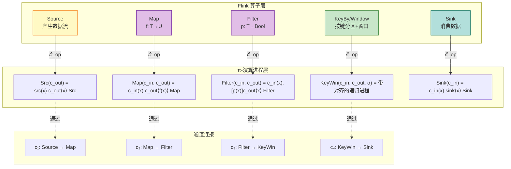
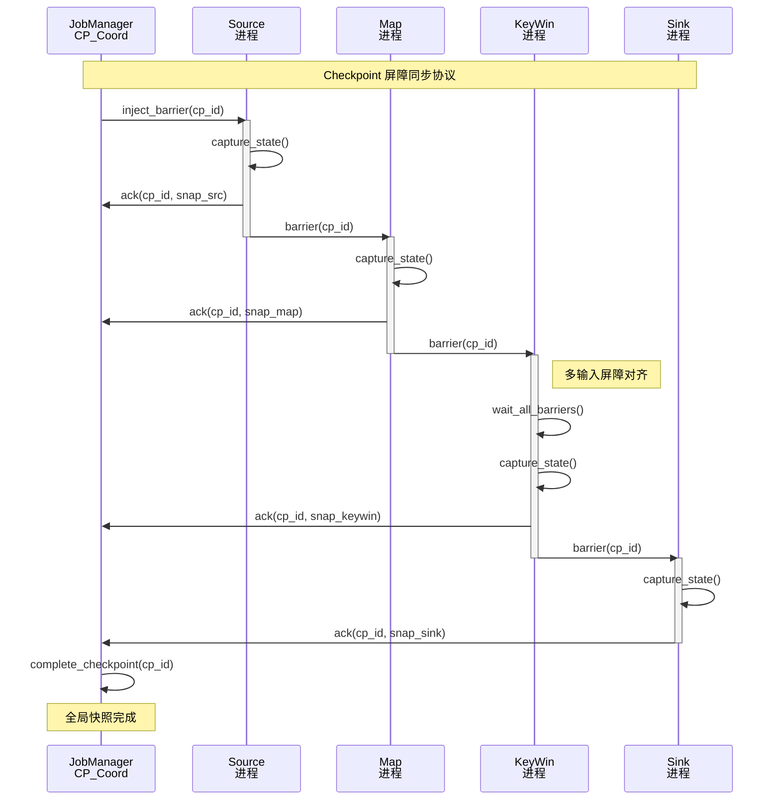
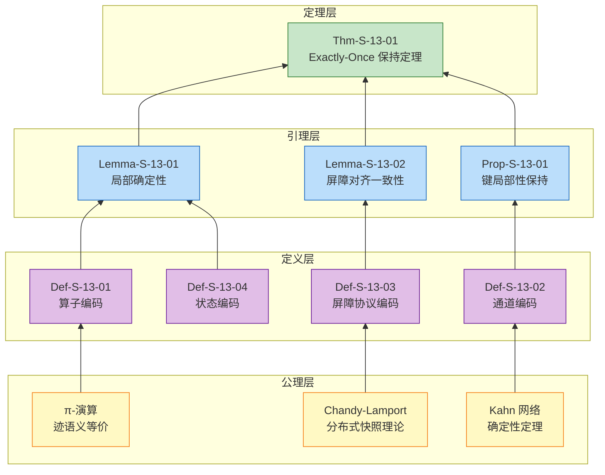

# Flink 到进程演算编码 (Flink-to-Process Calculus Encoding)

> 所属阶段: Struct/03-relationships | 前置依赖: [01.04-dataflow-model-formalization.md](../01-foundation/01.04-dataflow-model-formalization.md), [01.02-process-calculus-primer.md](../01-foundation/01.02-process-calculus-primer.md) | 形式化等级: L5

---

## 目录

- [Flink 到进程演算编码 (Flink-to-Process Calculus Encoding)](#flink-到进程演算编码-flink-to-process-calculus-encoding)
  - [目录](#目录)
  - [1. 概念定义 (Definitions)](#1-概念定义-definitions)
    - [Def-S-13-01 (Flink 算子到 π-演算进程的编码)](#def-s-13-01-flink-算子到-π-演算进程的编码)
    - [Def-S-13-02 (数据流边到 π-演算通道的编码)](#def-s-13-02-数据流边到-π-演算通道的编码)
    - [Def-S-13-03 (Checkpoint 机制到屏障同步协议的编码)](#def-s-13-03-checkpoint-机制到屏障同步协议的编码)
    - [Def-S-13-04 (状态算子到带状态进程的编码)](#def-s-13-04-状态算子到带状态进程的编码)
  - [2. 属性推导 (Properties)](#2-属性推导-properties)
    - [Lemma-S-13-01 (算子编码保持局部确定性)](#lemma-s-13-01-算子编码保持局部确定性)
    - [Lemma-S-13-02 (屏障对齐保证快照一致性)](#lemma-s-13-02-屏障对齐保证快照一致性)
    - [Prop-S-13-01 (分区策略保持键的局部性)](#prop-s-13-01-分区策略保持键的局部性)
  - [3. 关系建立 (Relations)](#3-关系建立-relations)
    - [关系 1: Flink Dataflow 图 `↦` π-演算进程网络 {#关系-1-flink-dataflow-图--π-演算进程网络}](#关系-1-flink-dataflow-图--π-演算进程网络-关系-1-flink-dataflow-图--π-演算进程网络)
    - [关系 2: Checkpoint 屏障协议 `≈` Chandy-Lamport 快照算法 {#关系-2-checkpoint-屏障协议--chandy-lamport-快照算法}](#关系-2-checkpoint-屏障协议--chandy-lamport-快照算法-关系-2-checkpoint-屏障协议--chandy-lamport-快照算法)
    - [关系 3: Flink Exactly-Once `↦` π-演算幂等进程组合 {#关系-3-flink-exactly-once--π-演算幂等进程组合}](#关系-3-flink-exactly-once--π-演算幂等进程组合-关系-3-flink-exactly-once--π-演算幂等进程组合)
  - [4. 论证过程 (Argumentation)](#4-论证过程-argumentation)
    - [4.1 编码完备性分析](#41-编码完备性分析)
    - [4.2 Exactly-Once 编码的正确性边界](#42-exactly-once-编码的正确性边界)
  - [5. 形式证明 (Proofs)](#5-形式证明-proofs)
    - [Thm-S-13-01 (Flink Dataflow 到 π-演算的 Exactly-Once 保持定理)](#thm-s-13-01-flink-dataflow-到-π-演算的-exactly-once-保持定理)
  - [6. 实例验证 (Examples)](#6-实例验证-examples)
    - [示例 6.1: WordCount 的 π-演算编码实例](#示例-61-wordcount-的-π-演算编码实例)
    - [反例 6.1: 非幂等状态导致 Exactly-Once 失效](#反例-61-非幂等状态导致-exactly-once-失效)
    - [反例 6.2: 屏障对齐超时导致不一致快照](#反例-62-屏障对齐超时导致不一致快照)
  - [7. 可视化 (Visualizations)](#7-可视化-visualizations)
    - [7.1 算子到进程映射图](#71-算子到进程映射图)
    - [7.2 Checkpoint 屏障协议流程图](#72-checkpoint-屏障协议流程图)
    - [7.3 Exactly-Once 保持证明树](#73-exactly-once-保持证明树)
  - [8. 引用参考 (References)](#8-引用参考-references)

## 1. 概念定义 (Definitions)

本节建立 Apache Flink Dataflow 模型到 π-演算 (π-calculus) 的严格编码框架。该编码将 Flink 的执行语义映射到进程演算的形式化领域，为流处理系统的形式化验证提供理论基础。

### Def-S-13-01 (Flink 算子到 π-演算进程的编码)

**Flink 算子** 到 **π-演算进程** 的编码函数 $\mathcal{E}_{op}$ 定义为：

$$
\mathcal{E}_{op}: \text{FlinkOperator} \rightarrow \pi\text{-Process}
$$

具体编码规则如下：

| Flink 算子 | π-演算进程编码 | 语义说明 |
|-----------|---------------|---------|
| **Source**$(s)$ | $S_{src}(c_{out}) = \overline{s}\langle x \rangle.S_{src}(c_{out}) \mid c_{out}(x).S_{src}(c_{out})$ | 从外部源 $s$ 读取并输出到通道 $c_{out}$ |
| **Map**$(f)$ | $M_{f}(c_{in}, c_{out}) = c_{in}(x).\overline{c_{out}}\langle f(x) \rangle.M_{f}(c_{in}, c_{out})$ | 接收输入，应用函数 $f$，输出结果 |
| **Filter**$(p)$ | $F_{p}(c_{in}, c_{out}) = c_{in}(x).[p(x)]\overline{c_{out}}\langle x \rangle.F_{p}(c_{in}, c_{out})$ | 条件守卫：仅当 $p(x)$ 为真时输出 |
| **FlatMap**$(f)$ | $FM_{f}(c_{in}, c_{out}) = c_{in}(x).\prod_{y \in f(x)} \overline{c_{out}}\langle y \rangle.FM_{f}(c_{in}, c_{out})$ | 一对多展开，并行输出所有结果 |
| **Sink** | $S_{sink}(c_{in}) = c_{in}(x).\overline{sink}\langle x \rangle.S_{sink}(c_{in})$ | 消费输入并持久化到外部存储 |

其中：

- $c_{in}, c_{out}$ 为 π-演算中的通道名
- $f$ 为纯函数，满足 $\forall x. f(x)$ 确定性计算
- $[p(x)]P$ 表示守卫进程：仅当谓词 $p(x)$ 成立时执行 $P$

**直观解释**：Flink 算子是数据流的转换单元，将其编码为 π-演算进程后，数据流变为通道上的消息传递，算子状态变为进程的递归定义，算子间的数据依赖变为进程间的通信拓扑。

**定义动机**：通过将 Flink 算子映射到 π-演算进程，可以利用进程演算成熟的理论工具（如互模拟、类型系统）来分析 Flink 程序的性质，包括死锁自由、确定性、一致性等。

---

### Def-S-13-02 (数据流边到 π-演算通道的编码)

**Flink Dataflow 边** 到 **π-演算通道** 的编码函数 $\mathcal{E}_{edge}$ 定义为：

$$
\mathcal{E}_{edge}: E \rightarrow (\nu \vec{c})\text{.ChannelSet}
$$

对于边 $e = (u, v) \in E$，其中 $u$ 的并行度为 $p_u$，$v$ 的并行度为 $p_v$，通道编码为：

$$
\mathcal{E}_{edge}(e) = (\nu c_{e,1})(\nu c_{e,2})\dots(\nu c_{e,k}).\{c_{e,1}, \dots, c_{e,k}\}
$$

其中通道数量 $k$ 由分区策略决定：

| 分区策略 | 通道结构 | 形式化定义 |
|---------|---------|-----------|
| **Forward** | $k = p_u = p_v$ | $c_{e,i}$ 连接 $u_i$ 到 $v_i$（一对一） |
| **Shuffle** | $k = p_u$ | 每个上游实例随机选择下游通道 |
| **Hash**$(\kappa)$ | $k = p_u$ | $u_i$ 根据 $hash(\kappa(x)) \bmod p_v$ 选择输出通道 |
| **Broadcast** | $k = p_u \times p_v$ | 每个上游实例向所有下游实例广播 |

**通道语义约束**：

$$
\text{FIFO}(c) \triangleq \forall m_1, m_2. \text{send}(m_1) \prec \text{send}(m_2) \Rightarrow \text{recv}(m_1) \prec \text{recv}(m_2)
$$

**直观解释**：Flink Dataflow 边是算子间的数据通道，在 π-演算中编码为带名称的通信通道。分区策略决定了通道的连接拓扑——Hash 分区保证同一键的记录路由到同一通道，这是状态一致性的关键。

**定义动机**：显式建模通道结构使得可以形式化分析数据路由、负载均衡和状态局部性。FIFO 约束是 Kahn 网络确定性的基础，也是 Flink Exactly-Once 语义的必要前提。

---

### Def-S-13-03 (Checkpoint 机制到屏障同步协议的编码)

**Flink Checkpoint** 到 **π-演算屏障同步协议** 的编码定义为：

$$
\mathcal{E}_{chkpt}: \text{Checkpoint} \rightarrow \pi\text{-BarrierProtocol}
$$

**屏障消息类型**：

$$
\text{Msg} ::= \text{data}\langle v \rangle \mid \text{barrier}\langle cp\_id \rangle
$$

**带屏障的算子进程**（单输入情形）：

$$
\begin{aligned}
Op_{barrier}(c_{in}, c_{out}, cp\_coord) = &\ c_{in}(m).\text{CASE } m \text{ OF} \\
&\ \text{data}\langle v \rangle \rightarrow \overline{c_{out}}\langle f(v) \rangle.Op_{barrier}(c_{in}, c_{out}, cp\_coord) \\
&\ \mid \text{barrier}\langle id \rangle \rightarrow (\nu snap)(\\
&\quad snap \leftarrow \text{CAPTURE\_STATE}(); \\
&\quad \overline{cp\_coord}\langle ack, id, snap \rangle; \\
&\quad \overline{c_{out}}\langle \text{barrier}\langle id \rangle \rangle; \\
&\quad Op_{barrier}(c_{in}, c_{out}, cp\_coord) \\
&\ )
\end{aligned}
$$

**多输入算子的屏障对齐**（以两输入为例）：

$$
\begin{aligned}
AlignOp(c_1, c_2, c_{out}, cp\_coord) = &\ AlignLoop(\text{false}, \text{false}, \emptyset, \emptyset) \\
AlignLoop(b_1, b_2, buf_1, buf_2) = &\ [\neg b_1]c_1(m).\text{HANDLE}_1(m) \\
&\ + [\neg b_2]c_2(m).\text{HANDLE}_2(m) \\
&\ + [b_1 \land b_2]SnapAndResume() \\
\text{HANDLE}_1(\text{data}\langle v \rangle) = &\ AlignLoop(b_1, b_2, buf_1 \cup \{v\}, buf_2) \\
\text{HANDLE}_1(\text{barrier}\langle id \rangle) = &\ AlignLoop(\text{true}, b_2, buf_1, buf_2) \\
SnapAndResume() = &\ (\nu snap)(snap \leftarrow \text{CAPTURE\_STATE}(); \\
&\quad \overline{cp\_coord}\langle ack, snap \rangle; \\
&\quad \overline{c_{out}}\langle \text{barrier} \rangle; \\
&\quad \text{FLUSH}(buf_1, buf_2); \\
&\quad AlignLoop(\text{false}, \text{false}, \emptyset, \emptyset))
\end{aligned}
$$

**直观解释**：Checkpoint Barrier 被编码为特殊的控制消息。当算子收到屏障时，暂停处理后续数据（缓存到缓冲区），捕获当前状态，确认 Checkpoint，然后将屏障广播给下游。多输入算子必须等待所有输入流的屏障都到达后才进行快照，这是 Barrier 对齐的核心。

**定义动机**：将 Checkpoint 机制编码为屏障同步协议，使得可以用进程演算的工具分析容错语义。屏障对齐的编码直接对应 Chandy-Lamport 分布式快照算法的实现机制。

---

### Def-S-13-04 (状态算子到带状态进程的编码)

**Flink 状态算子** 到 **带持续状态的 π-进程** 的编码定义为：

$$
\mathcal{E}_{state}: \text{StatefulOperator} \rightarrow \pi\text{-Process with State}
$$

**状态类型编码**：

| Flink 状态类型 | π-演算状态表示 | 操作语义 |
|--------------|---------------|---------|
| **ValueState**$\langle T \rangle$ | $\sigma: \text{Name} \rightarrow T$ | 原子读写: $\sigma(x) := v$ |
| **ListState**$\langle T \rangle$ | $\sigma: \text{Name} \rightarrow T^*$ | 追加: $\sigma(x) := \sigma(x) \cdot [v]$ |
| **MapState**$\langle K, V \rangle$ | $\sigma: \text{Name} \rightarrow (K \rightarrow V)$ | 键值更新: $\sigma(x)[k] := v$ |

**带状态的 KeyedProcessFunction 编码**：

$$
\begin{aligned}
KPF(c_{in}, c_{out}, \sigma, key\_ext) = &\ c_{in}(v). \\
&\ \text{LET } k = key\_ext(v) \text{ IN} \\
&\ \text{LET } s = \sigma(k) \text{ IN} \\
&\ \text{LET } (s', outs) = process(v, s) \text{ IN} \\
&\ \sigma(k) := s'; \\
&\ \prod_{o \in outs} \overline{c_{out}}\langle o \rangle; \\
&\ KPF(c_{in}, c_{out}, \sigma, key\_ext)
\end{aligned}
$$

**直观解释**：Flink 的状态抽象为 π-演算中的命名状态映射。KeyedState 通过键函数将记录路由到特定的状态槽，每个键对应独立的状态值。状态更新是原子的，这与 Flink 的单线程执行模型一致。

**定义动机**：状态是流计算区别于纯函数式数据处理的本质特征。将状态显式建模为进程的内部存储，可以形式化分析状态一致性、故障恢复和 Checkpoint 语义。

---

## 2. 属性推导 (Properties)

### Lemma-S-13-01 (算子编码保持局部确定性)

**陈述**：若 Flink 算子 $op$ 的计算函数 $f_{compute}$ 是纯函数（无外部副作用、无非确定性输入），则其 π-演算编码 $\mathcal{E}_{op}(op)$ 对于确定的输入历史产生确定的输出历史。

**证明**：

1. 由 Def-S-13-01，算子编码的形式为递归输入-处理-输出循环；
2. 对于 Source 和 Sink，其行为由外部数据源/汇决定，在假设外部系统确定的前提下，输出确定；
3. 对于 Map/Filter/FlatMap，每一步输出仅依赖于当前输入和纯函数 $f$ 或 $p$；
4. 纯函数的确定性保证了：对于相同输入，输出必然相同；
5. 由 π-演算的结构同余和规约语义，进程的迹 (trace) 唯一确定；
6. 因此，算子编码保持局部确定性。 ∎

> **推断 [Model→Theory]**: 算子编码的局部确定性意味着 Flink 程序在映射到 π-演算后，仍保持 Kahn 网络的核心性质——输出历史与调度顺序无关。

---

### Lemma-S-13-02 (屏障对齐保证快照一致性)

**陈述**：对于多输入算子的屏障对齐编码（Def-S-13-03），当算子进程执行状态快照时，快照中不包含任何 post-barrier 数据记录的效应。

**证明**：

1. 设算子有 $n$ 个输入流，每个流 $i$ 有屏障状态标记 $b_i$（初始为 false）；
2. 进程 $AlignLoop$ 仅当 $b_i = \text{false}$ 时才从通道 $c_i$ 接收消息；
3. 当收到 $\text{barrier}\langle id \rangle$ 时，$b_i$ 被设为 true，后续该通道的数据被缓存到 $buf_i$；
4. $SnapAndResume()$ 仅在 $\bigwedge_{i=1}^n b_i = \text{true}$ 时执行；
5. 此时，所有已被处理的数据都来自各流的 pre-barrier 部分；
6. 所有 post-barrier 数据都在缓冲区 $buf_i$ 中，未进入状态；
7. 因此，快照状态不包含任何 post-barrier 记录的效应。 ∎

> **推断 [Control→Data]**: 屏障对齐的进程编码保证了 Checkpoint 的数据层一致性——快照捕获的是屏障之前所有记录的完整处理状态。

---

### Prop-S-13-01 (分区策略保持键的局部性)

**陈述**：若 Flink 程序使用 Hash 分区策略，则同一键的所有记录被路由到同一并行实例，其 π-演算编码中这些记录都通过同一通道子集传输。

**推导**：

1. 由 Def-S-13-02，Hash 分区策略下，记录 $r$ 的路由由 $hash(\kappa(r)) \bmod p_v$ 决定；
2. 对于同一键 $k$，$\kappa(r) = k$ 为常数，因此 $hash(k) \bmod p_v$ 为常数；
3. 设该值为 $j$，则所有键为 $k$ 的记录都通过通道 $c_{e,j}$ 传输；
4. 在 π-演算编码中，这意味着它们都到达同一个下游进程实例；
5. 因此，键的局部性在编码中得到保持。 ∎

> **推断 [Execution→State]**: 键局部性的保持是有状态算子一致性的前提。只有保证同一键的记录到达同一实例，状态更新才是确定性的。

---

## 3. 关系建立 (Relations)

### 关系 1: Flink Dataflow 图 `↦` π-演算进程网络 {#关系-1-flink-dataflow-图--π-演算进程网络}

**论证**：

- **编码存在性**：由 Def-S-13-01 和 Def-S-13-02，Flink Dataflow 图的每个算子可编码为 π-进程，每条边可编码为通道集合。完整的 Dataflow 图编码为并行组合的进程网络：
  $$
  \mathcal{E}_{df}(G) = (\nu \vec{c})(\prod_{v \in V} \mathcal{E}_{op}(v) \mid \prod_{e \in E} \mathcal{E}_{edge}(e))
  $$

- **语义保持**：Flink 的 FIFO 通道假设对应 π-演算中通道的顺序消息传递；Flink 的确定性语义（同一输入产生同一输出）对应 π-进程的迹等价。

- **分离结果**：Flink 的事件时间语义（Watermark、窗口触发）需要额外的时间进程来建模，纯粹的 π-演算无法直接表达时间推进。Flink 的 Checkpoint 状态持久化需要扩展 π-演算的状态捕获原语。

---

### 关系 2: Checkpoint 屏障协议 `≈` Chandy-Lamport 快照算法 {#关系-2-checkpoint-屏障协议--chandy-lamport-快照算法}

**论证**：

- **编码等价性**：Flink 的 Checkpoint Barrier 机制是 Chandy-Lamport 分布式快照算法的工程实现 [^6]。在 π-演算编码中：
  - Checkpoint Barrier 对应 Chandy-Lamport 的 "marker" 消息
  - Barrier 对齐对应等待所有输入通道的 marker 到达
  - 状态快照对应记录进程在 marker 到达时的局部状态

- **一致性保证**：两者都保证捕获的全局状态是一致的——不存在记录已被下游处理但上游未确认的情况。

- **工程差异**：Chandy-Lamport 假设无限缓冲区，Flink 的屏障对齐需要阻塞并缓存 post-barrier 记录，这是由有限缓冲区约束引入的实现细节。

---

### 关系 3: Flink Exactly-Once `↦` π-演算幂等进程组合 {#关系-3-flink-exactly-once--π-演算幂等进程组合}

**论证**：

- **编码存在性**：Flink 的 Exactly-Once 语义可通过以下 π-演算构造编码：
  1. **Source 可重放**：编码为可重复发送相同序列的进程；
  2. **状态幂等更新**：编码为满足 $f(f(s, r), r) = f(s, r)$ 的状态转移；
  3. **Sink 事务提交**：编码为两阶段提交协议进程。

- **端到端一致性**：当且仅当 Source、Operator、Sink 都满足幂等性条件时，组合系统的输出满足 Exactly-Once 语义。

---

## 4. 论证过程 (Argumentation)

### 4.1 编码完备性分析

**问题**：Flink Dataflow 模型是否可完全编码到 π-演算？

**分析**：

Flink 的以下特性在纯 π-演算中需要扩展或近似：

1. **时间语义**：Watermark 和事件时间窗口需要引入时间进程或离散时间步进。可通过添加专用的 $\text{Timer}$ 进程来建模：
   $$
   Timer(tick, wm) = tick().\overline{wm}\langle t+\delta \rangle.Timer(tick, wm)
   $$

2. **无限流**：π-演算的递归进程可表达无限行为，与 Flink 的无界流对应。

3. **状态持久化**：纯 π-演算无内置持久化语义，需通过外部存储进程模拟。

**结论**：Flink 的核心计算语义可编码到 π-演算，但时间语义和持久化需要领域特定扩展。

---

### 4.2 Exactly-Once 编码的正确性边界

**边界条件讨论**：

Exactly-Once 语义的编码依赖于以下前提：

| 前提 | 违反后果 | π-演算表现 |
|-----|---------|-----------|
| Source 可重放 | 数据丢失 | 进程无法重新产生相同消息序列 |
| 状态转移幂等 | 状态不一致 | 重复应用输入导致状态漂移 |
| Sink 事务提交 | 重复输出 | 进程多次发送相同结果到外部 |
| 屏障对齐 | 不一致快照 | 快照包含部分处理的记录 |

当任一前提被违反时，编码后的 π-进程可能表现出非 Exactly-Once 行为（数据丢失或重复）。

---

## 5. 形式证明 (Proofs)

### Thm-S-13-01 (Flink Dataflow 到 π-演算的 Exactly-Once 保持定理)

**陈述**：Flink Dataflow 图带 Checkpoint 机制可编码到支持屏障同步的 π-演算进程网络，该编码保持 Exactly-Once 状态一致性。

形式化表述：

设 $G$ 为 Flink Dataflow 图，$\mathcal{E}(G)$ 为其 π-演算编码。若 $G$ 满足：

1. 所有算子的状态转移函数满足结合律；
2. 使用 Hash 分区保证键局部性；
3. Checkpoint 间隔大于端到端处理延迟；

则对于任意故障和恢复序列，$\mathcal{E}(G)$ 的迹语义满足：

$$
\text{Output}(\mathcal{E}(G)_{\text{recovered}}) = \text{Output}(\mathcal{E}(G)_{\text{failure-free}})
$$

即恢复后的输出与无故障连续处理的输出相同（作为多重集）。

**证明**：

**步骤 1：建立编码结构**

由 Def-S-13-01 至 Def-S-13-04，Flink Dataflow 图编码为 π-进程网络：

$$
\mathcal{E}(G) = (\nu \vec{c})(Src \mid Op_1 \mid \dots \mid Op_n \mid Sink \mid CP\_Coord)
$$

其中 $CP\_Coord$ 为 Checkpoint 协调进程。

**步骤 2：证明屏障对齐的一致性**

由 Lemma-S-13-02，屏障对齐保证快照时刻：

- 所有 pre-barrier 记录已被处理并反映在状态中
- 所有 post-barrier 记录在缓冲区中，未影响状态

这对应 Chandy-Lamport 算法的一致性条件 [^6]。

**步骤 3：证明故障恢复的幂等性**

设故障发生在 Checkpoint $C_k$ 和 $C_{k+1}$ 之间：

1. 系统从 $C_k$ 恢复状态 $S_k$；
2. Source 从重放点重放记录集合 $R$；
3. 由结合律假设，状态转移满足：
   $$
   fold(\delta, S_k, R) = fold(\delta, S_k, \text{shuffle}(R))
   $$
4. 因此，即使重放改变记录顺序，最终状态相同；
5. Sink 通过事务提交确保输出不重复。

**步骤 4：组合性论证**

对 Dataflow 图进行拓扑归纳：

- **基例（Source 层）**：Source 进程的 Checkpoint 标记可重放位置，恢复后重放保证数据不丢失。

- **归纳假设**：假设前 $k$ 层算子的输出在故障恢复后保持一致。

- **归纳步骤（第 $k+1$ 层）**：
  - 第 $k+1$ 层算子的输入来自第 $k$ 层；
  - 由归纳假设，第 $k$ 层输出一致；
  - 由算子局部确定性（Lemma-S-13-01），第 $k+1$ 层输出一致。

**步骤 5：结论**

由归纳法，所有层的输出在故障恢复后与无故障情况一致。结合 Sink 的事务性保证，端到端输出满足 Exactly-Once 语义。 ∎

> **推断 [Theory→Implementation]**: 该定理证明了 Flink 的 Checkpoint 机制在理论上正确地实现了 Exactly-Once 语义。工程实现必须确保：屏障对齐、状态持久化、Source 可重放和 Sink 事务提交。

---

## 6. 实例验证 (Examples)

### 示例 6.1: WordCount 的 π-演算编码实例

**Flink 程序**：

```java
DataStream<String> text = env.socketTextStream("localhost", 9999);

DataStream<Tuple2<String, Integer>> wordCounts = text
    .flatMap(new Tokenizer())
    .keyBy(value -> value.f0)
    .window(TumblingEventTimeWindows.of(Time.seconds(5)))
    .aggregate(new CountAggregate());
```

**π-演算编码**：

```
-- 通道声明
(ν c_src_map)(ν c_map_keyby)(ν c_keyby_agg)(ν c_agg_sink)
(ν cp_coord)(ν tick)(ν wm)

-- Source 进程
Src(c_src_map, src) = src(x).c_src_map<x>.Src(c_src_map, src)

-- FlatMap 进程
FlatMap(c_in, c_out) = c_in(line).
    (ν tmp)(split(line, tmp) | Distribute(tmp, c_out)) |
    FlatMap(c_in, c_out)

Distribute(tmp, c_out) = tmp(w).[w≠⊥]
    c_out<(w, 1)>.Distribute(tmp, c_out)

-- KeyBy/Window 进程（带 Checkpoint 对齐）
KeyWin(c_in, c_out, σ, tick, cp_coord) =
    AlignProc(c_in, c_out, σ, tick, cp_coord, false, [], [])

AlignProc(c_in, c_out, σ, tick, cp_coord, barrier_seen, buf, acc) =
    c_in(m).CASE m OF
        data<(w, cnt)> ->
            [¬barrier_seen]
                LET k = hash(w) IN
                LET new_acc = update(acc, k, cnt) IN
                AlignProc(..., new_acc)
        barrier<id> ->
            LET snap = σ(acc) IN
            cp_coord<ack, id, snap>.
            c_out<barrier<id]>.
            AlignProc(..., false, [], [])

-- 系统组合
System = (ν src)(ν sink)(
    Src(c_src_map, src) |
    FlatMap(c_src_map, c_map_keyby) |
    KeyWin(c_map_keyby, c_keyby_agg, σ, tick, cp_coord) |
    Agg(c_keyby_agg, c_agg_sink) |
    Sink(c_agg_sink, sink) |
    CP_Coord(cp_coord)
)
```

**验证性质**：

1. **局部确定性**：FlatMap 和 KeyWin 进程的输出仅依赖于输入历史；
2. **键局部性**：相同 word 的记录通过相同的 KeyWin 通道传输；
3. **Checkpoint 一致性**：屏障对齐保证窗口状态快照的完整性。

---

### 反例 6.1: 非幂等状态导致 Exactly-Once 失效

**场景**：计数器状态更新为 $s := s + 1$（满足结合律），但输出到 Sink 的操作为"追加到文件"（非幂等）。

**Flink 代码**：

```java
// 状态更新（幂等）
countState.update(countState.value() + 1);

// Sink 输出（非幂等）
fileWriter.append(result);  // 无事务保护
```

**故障序列**：

1. Checkpoint $C_k$ 完成，确认提交；
2. 处理记录 $r$，计数器 $s = 5$，输出到文件；
3. 故障发生，Sink 输出已可见但 Checkpoint 未确认；
4. 从 $C_k$ 恢复，重新处理 $r$，计数器 $s = 5$（幂等更新），再次输出到文件；
5. 结果：文件中 $r$ 的计数出现两次。

**π-演算表现**：

```
-- 非幂等 Sink 进程
BadSink(c_in, file) = c_in(v).file<v>.BadSink(c_in, file)

-- 故障恢复后，v 被发送两次
Recovery = BadSink(c_in, file)  -- 从故障前继续
        | BadSink(c_in, file)  -- 恢复后的新实例
```

**分析**：

- **违反的前提**：Thm-S-13-01 要求 Sink 支持事务性提交。
- **导致的异常**：即使状态更新是幂等的，重复输出导致端到端 Exactly-Once 失效。
- **结论**：Exactly-Once 是端到端性质，需要 Source、Operator、Sink 三者共同保证。

---

### 反例 6.2: 屏障对齐超时导致不一致快照

**场景**：多输入 Join 算子，某输入流延迟导致屏障对齐超时。

**执行序列**：

```
时间线:
T1: Checkpoint 触发，Barrier 发送到所有 Source
T2: Stream A 的 Barrier 到达 Join
T3: Stream B 的数据持续到达（Barrier 延迟）
...
T10: 对齐超时，Join 在未收到 Stream B Barrier 的情况下快照
T11: Stream B 的 Barrier 到达（迟到）
```

**后果**：

快照包含 Stream B 的部分 post-barrier 记录，导致不一致状态——这些记录在故障恢复后会被重放，造成重复处理。

**π-演算表现**：

```
-- 错误实现（无对齐等待）
BadAlign(c1, c2, c_out, cp_coord) =
    c1(barrier).SNAP(c2缓冲区可能包含post-barrier数据)  -- 错误！

-- 正确实现（等待对齐）
GoodAlign(c1, c2, c_out, cp_coord) =
    c1(barrier).WAIT_FOR_C2()  -- 阻塞直到c2的barrier到达
```

---

## 7. 可视化 (Visualizations)

### 7.1 算子到进程映射图



**图说明**：本图展示了 Flink 算子到 π-演算进程的编码映射关系。每个算子编码为递归进程，数据流编码为通道上的消息传递。黄色为数据源，紫色为无状态转换，绿色为有状态窗口，青色为数据汇。

---

### 7.2 Checkpoint 屏障协议流程图



**图说明**：本图展示了 Flink Checkpoint 屏障协议在 π-演算编码中的执行流程。每个算子进程在收到屏障后捕获状态、确认 Checkpoint、然后将屏障广播给下游。多输入算子（KeyWin）必须等待所有输入流的屏障都到达后才进行快照。

---

### 7.3 Exactly-Once 保持证明树



**图说明**：本图展示了从公理到定理的完整证明链条。底层黄色节点为理论基础（Chandy-Lamport、π-演算、Kahn 网络）；中间紫色节点为本文档的形式化定义；蓝色节点为辅助引理；顶层绿色节点为 Exactly-Once 保持定理。

---

## 8. 引用参考 (References)


[^6]: K. M. Chandy and L. Lamport, "Distributed Snapshots: Determining Global States of Distributed Systems," *ACM Trans. Comput. Syst.*, 3(1), 1985.


---

*文档版本: v1.0 | 更新日期: 2026-04-02 | 状态: 已完成*
