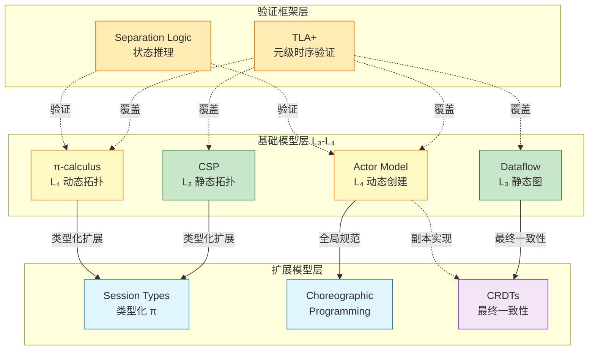
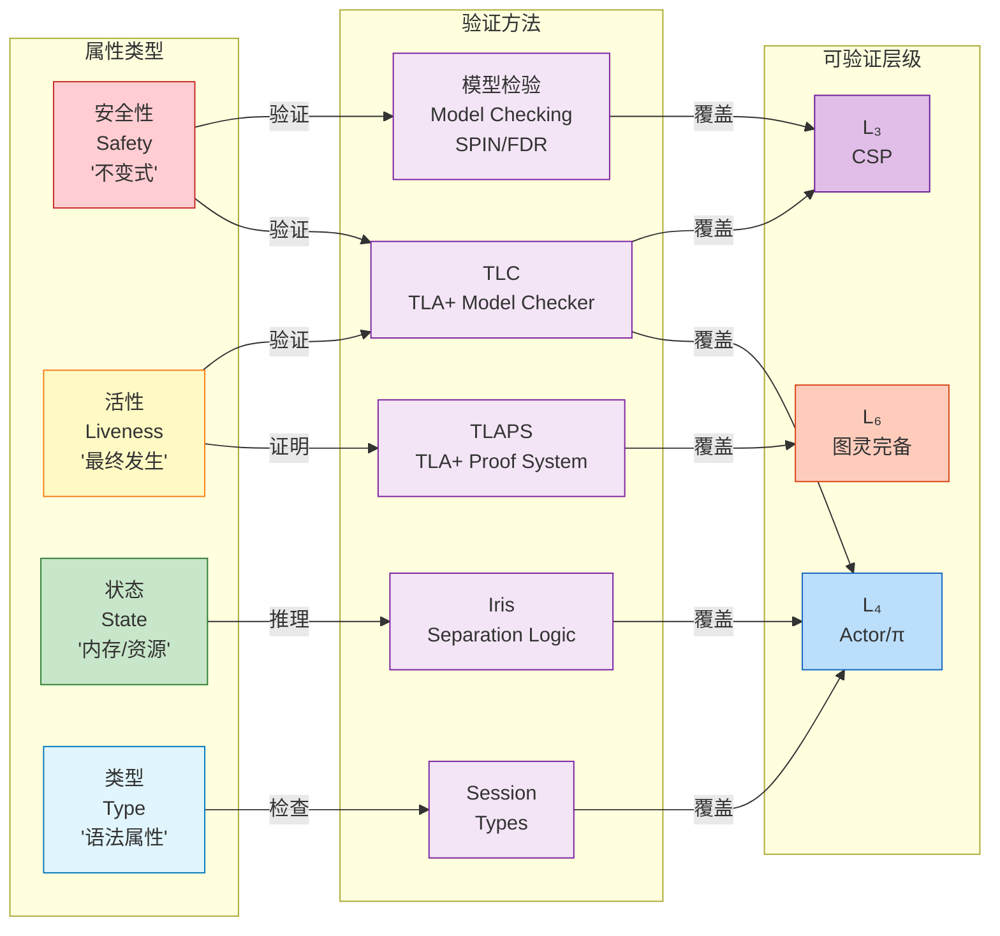

# 表达能力层级补充：扩展模型与验证框架 {#表达能力层级补充扩展模型与验证框架}

> **所属阶段**: Struct | **前置依赖**: [03.03-expressiveness-hierarchy.md](./03.03-expressiveness-hierarchy.md) | **形式化等级**: L3-L5
> **版本**: 2026.04 | **状态**: 补充文档

---

## 目录 {#目录}

- [表达能力层级补充：扩展模型与验证框架 {#表达能力层级补充扩展模型与验证框架}](#表达能力层级补充扩展模型与验证框架-表达能力层级补充扩展模型与验证框架)
  - [目录 {#目录}](#目录-目录)
  - [1. 新增模型定义 (Definitions) {#1-新增模型定义-definitions}](#1-新增模型定义-definitions-1-新增模型定义-definitions)
    - [Def-S-15-01. Session Types {#def-s-15-01-session-types}](#def-s-15-01-session-types-def-s-15-01-session-types)
    - [Def-S-15-02. Choreographic Programming {#def-s-15-02-choreographic-programming}](#def-s-15-02-choreographic-programming-def-s-15-02-choreographic-programming)
    - [Def-S-15-03. CRDTs (Conflict-free Replicated Data Types) {#def-s-15-03-crdts-conflict-free-replicated-data-types}](#def-s-15-03-crdts-conflict-free-replicated-data-types-def-s-15-03-crdts-conflict-free-replicated-data-types)
    - [Def-S-15-04. TLA+ (Temporal Logic of Actions) {#def-s-15-04-tla-temporal-logic-of-actions}](#def-s-15-04-tla-temporal-logic-of-actions-def-s-15-04-tla-temporal-logic-of-actions)
    - [Def-S-15-05. Separation Logic {#def-s-15-05-separation-logic}](#def-s-15-05-separation-logic-def-s-15-05-separation-logic)
  - [2. 属性推导 (Properties) {#2-属性推导-properties}](#2-属性推导-properties-2-属性推导-properties)
    - [Lemma-S-15-01. Session Types 类型安全保证 {#lemma-s-15-01-session-types-类型安全保证}](#lemma-s-15-01-session-types-类型安全保证-lemma-s-15-01-session-types-类型安全保证)
    - [Lemma-S-15-02. CRDT 收敛单调性 {#lemma-s-15-02-crdt-收敛单调性}](#lemma-s-15-02-crdt-收敛单调性-lemma-s-15-02-crdt-收敛单调性)
    - [Prop-S-15-01. 验证方法覆盖层级关系 {#prop-s-15-01-验证方法覆盖层级关系}](#prop-s-15-01-验证方法覆盖层级关系-prop-s-15-01-验证方法覆盖层级关系)
  - [3. 关系建立 (Relations) {#3-关系建立-relations}](#3-关系建立-relations-3-关系建立-relations)
    - [关系 1: Session Types → Process Calculus 扩展 {#关系-1-session-types--process-calculus-扩展}](#关系-1-session-types--process-calculus-扩展-关系-1-session-types--process-calculus-扩展)
    - [关系 2: Choreographic Programming → Actor 分支 {#关系-2-choreographic-programming--actor-分支}](#关系-2-choreographic-programming--actor-分支-关系-2-choreographic-programming--actor-分支)
    - [关系 3: CRDTs → Dataflow 扩展（最终一致性） {#关系-3-crdts--dataflow-扩展最终一致性}](#关系-3-crdts--dataflow-扩展最终一致性-关系-3-crdts--dataflow-扩展最终一致性)
    - [关系 4: TLA+ → 元级验证框架 {#关系-4-tla--元级验证框架}](#关系-4-tla--元级验证框架-关系-4-tla--元级验证框架)
    - [关系 5: Separation Logic → Process Calculus 并发验证 {#关系-5-separation-logic--process-calculus-并发验证}](#关系-5-separation-logic--process-calculus-并发验证-关系-5-separation-logic--process-calculus-并发验证)
  - [4. 论证过程 (Argumentation) {#4-论证过程-argumentation}](#4-论证过程-argumentation-4-论证过程-argumentation)
    - [论证 1: 扩展模型的工程必要性 {#论证-1-扩展模型的工程必要性}](#论证-1-扩展模型的工程必要性-论证-1-扩展模型的工程必要性)
    - [论证 2: 验证方法与计算模型的正交性 {#论证-2-验证方法与计算模型的正交性}](#论证-2-验证方法与计算模型的正交性-论证-2-验证方法与计算模型的正交性)
    - [论证 3: 一致性光谱与模型选择 {#论证-3-一致性光谱与模型选择}](#论证-3-一致性光谱与模型选择-论证-3-一致性光谱与模型选择)
  - [5. 形式证明 / 工程论证 {#5-形式证明--工程论证}](#5-形式证明--工程论证-5-形式证明--工程论证)
    - [Thm-S-15-01. Session Types 死锁自由定理 {#thm-s-15-01-session-types-死锁自由定理}](#thm-s-15-01-session-types-死锁自由定理-thm-s-15-01-session-types-死锁自由定理)
    - [Thm-S-15-02. CRDT 强最终一致性定理 {#thm-s-15-02-crdt-强最终一致性定理}](#thm-s-15-02-crdt-强最终一致性定理-thm-s-15-02-crdt-强最终一致性定理)
  - [6. 实例验证 (Examples) {#6-实例验证-examples}](#6-实例验证-examples-6-实例验证-examples)
    - [示例 1: 类型安全通信协议（Session Types） {#示例-1-类型安全通信协议session-types}](#示例-1-类型安全通信协议session-types-示例-1-类型安全通信协议session-types)
    - [示例 2: 分布式计数器（CRDT） {#示例-2-分布式计数器crdt}](#示例-2-分布式计数器crdt-示例-2-分布式计数器crdt)
    - [示例 3: 两阶段提交验证（TLA+） {#示例-3-两阶段提交验证tla}](#示例-3-两阶段提交验证tla-示例-3-两阶段提交验证tla)
  - [7. 可视化 (Visualizations) {#7-可视化-visualizations}](#7-可视化-visualizations-7-可视化-visualizations)
    - [图 7.1: 扩展模型关系图 {#图-71-扩展模型关系图}](#图-71-扩展模型关系图-图-71-扩展模型关系图)
    - [图 7.2: 验证方法覆盖范围图 {#图-72-验证方法覆盖范围图}](#图-72-验证方法覆盖范围图-图-72-验证方法覆盖范围图)
    - [图 7.3: 一致性光谱与模型映射 {#图-73-一致性光谱与模型映射}](#图-73-一致性光谱与模型映射-图-73-一致性光谱与模型映射)
  - [8. 引用参考 (References) {#8-引用参考-references}](#8-引用参考-references-8-引用参考-references)
  - [关联文档 {#关联文档}](#关联文档-关联文档)

---

## 1. 新增模型定义 (Definitions) {#1-新增模型定义-definitions}

### Def-S-15-01. Session Types {#def-s-15-01-session-types}

**Session Types** 是进程演算的**类型化扩展**，将通信协议本身作为类型，在编译期验证进程间的交互模式是否兼容。

**形式化定义**：

给定类型环境 $\Gamma$ 和通道 $c$，Session Type $S$ 的语法为：

$$
S ::= \ !T.S \ \mid \ ?T.S \ \mid \ \oplus\{l_i: S_i\}_{i \in I} \ \mid \ \&\{l_i: S_i\}_{i \in I} \ \mid \ \mu t.S \ \mid \ t \ \mid \ \text{end}
$$

| 构造 | 名称 | 语义 |
|------|------|------|
| $!T.S$ | 输出 | 发送类型 $T$ 的值，继续会话 $S$ |
| $?T.S$ | 输入 | 接收类型 $T$ 的值，继续会话 $S$ |
| $\oplus\{l_i: S_i\}$ | 内部选择 | 选择标签 $l_i$ 并继续 $S_i$ |
| $\&\{l_i: S_i\}$ | 外部选择 | 接收标签 $l_i$ 并继续 $S_i$ |
| $\mu t.S$ | 递归 | 递归定义会话类型 |
| $\text{end}$ | 终止 | 会话结束 |

**二元性（Duality）**：若进程 $P$ 在通道 $c$ 上实现会话 $S$，则其通信伙伴必须在 $\bar{c}$ 上实现对偶类型 $\bar{S}$：

$$
\overline{!T.S} = ?T.\bar{S}, \quad \overline{?T.S} = !T.\bar{S}, \quad \overline{\oplus\{l_i: S_i\}} = \&\{l_i: \bar{S_i}\}
$$

**表达力定位**：Session Types 是 **$L_4$ 的可判定子集**，通过类型约束将原本部分不可判定的 $L_4$ 问题转化为可判定的类型检查问题。

---

### Def-S-15-02. Choreographic Programming {#def-s-15-02-choreographic-programming}

**Choreographic Programming** 是一种**全局视角**的分布式编程范式，从系统整体通信模式（Choreography）出发，通过**端点投影（EndPoint Projection, EPP）**自动生成各个参与者的本地行为。

**形式化定义**：

Choreography $\mathcal{C}$ 的语法：

$$
\mathcal{C} ::= \eta \ \mid \ \mathcal{C}_1; \mathcal{C}_2 \ \mid \ \mathcal{C}_1 + \mathcal{C}_2 \ \mid \ \text{if} \ p \ \text{then} \ \mathcal{C}_1 \ \text{else} \ \mathcal{C}_2 \ \mid \ 0
$$

其中交互动作 $\eta$ 定义为：

$$
\eta ::= p \to q: \langle U \rangle \ \mid \ p \to q[l] \ \mid \ p \ \text{starts} \ r
$$

| 构造 | 语义 |
|------|------|
| $p \to q: \langle U \rangle$ | 参与者 $p$ 向 $q$ 发送类型 $U$ 的值 |
| $p \to q[l]$ | $p$ 通知 $q$ 选择标签 $l$ |
| $p \ \text{starts} \ r$ | $p$ 启动新参与者 $r$ |

**端点投影（EPP）**：投影算子 $[\mathcal{C}]_p$ 提取参与者 $p$ 的本地视角：

$$
[p \to q: \langle U \rangle; \mathcal{C}]_p = \text{send} \ q \ U; [\mathcal{C}]_p \\
[p \to q: \langle U \rangle; \mathcal{C}]_q = \text{recv} \ p \ U; [\mathcal{C}]_q
$$

**表达力定位**：Choreographic Programming 位于 **Actor 模型之上**，作为**全局规范层**，保证投影后的本地 Actor 实现满足死锁自由和协议一致性。

---

### Def-S-15-03. CRDTs (Conflict-free Replicated Data Types) {#def-s-15-03-crdts-conflict-free-replicated-data-types}

**CRDTs** 是支持**最终一致性**的分布式数据类型，通过数学设计保证所有副本在无协调的情况下最终收敛到相同状态。

**形式化定义**：

CRDT 是一个五元组 $\mathcal{D} = (S, \leq, \vee, s_0, O)$：

| 组件 | 含义 |
|------|------|
| $S$ | 状态集合 |
| $\leq$ | 偏序关系，构成 join-semilattice |
| $\vee$ | 合并操作（join/least upper bound） |
| $s_0$ | 初始状态 |
| $O$ | 操作集合（更新操作必须是单调的） |

**收敛定理的前提**：

1. **交换律（Commutativity）**：$s_1 \vee s_2 = s_2 \vee s_1$
2. **结合律（Associativity）**：$(s_1 \vee s_2) \vee s_3 = s_1 \vee (s_2 \vee s_3)$
3. **幂等律（Idempotence）**：$s \vee s = s$

**两种 CRDT 设计模式**：

| 类型 | 更新策略 | 读取代价 | 适用场景 |
|------|----------|----------|----------|
| **State-based** | 传播全状态 | 低 | 小状态，高收敛速度需求 |
| **Operation-based** | 传播操作 | 高 | 大状态，低带宽需求 |

**表达力定位**：CRDTs 属于 **$L_3$ 扩展**，在静态拓扑（$L_3$）上增加了**单调收敛语义**，是 Dataflow 模型在最终一致性场景下的具体实现。

---

### Def-S-15-04. TLA+ (Temporal Logic of Actions) {#def-s-15-04-tla-temporal-logic-of-actions}

**TLA+** 是由 Leslie Lamport 设计的**时序逻辑规范语言**，用于形式化描述和验证分布式算法与并发系统的时序属性。

**形式化定义**：

TLA+ 规范的形式为 $\text{Spec} ::= \text{Init} \ \land \ \square[\text{Next}]_{vars} \ \land \ \text{Temporal}$：

| 组件 | 含义 |
|------|------|
| $\text{Init}$ | 初始状态谓词 |
| $\text{Next}$ | 下一步关系（状态转移） |
| $[\text{Next}]_{vars}$ | 动作或状态无变化（stuttering） |
| $\square$ | "始终"时序算子 |
| $\text{Temporal}$ | 活性（liveness）约束 |

**核心时序算子**：

| 算子 | 名称 | 语义 |
|------|------|------|
| $\square F$ | Always | 在所有未来状态 $F$ 成立 |
| $\Diamond F$ | Eventually | 在某未来状态 $F$ 成立 |
| $F \leadsto G$ | Leads-to | $F$ 蕴含最终 $G$ 成立 |
| $\forall x: F$ | Universal | 对所有 $x$，$F$ 成立 |

**验证能力定位**：TLA+ 是**元级验证框架**，可应用于 $L_1$ 到 $L_6$ 的所有模型，通过抽象将高阶模型规约到可模型检验的子集。

---

### Def-S-15-05. Separation Logic {#def-s-15-05-separation-logic}

**Separation Logic** 是 Hoare 逻辑的扩展，专门用于**并发程序**的局部推理，通过分离合取（$*$）表达内存/资源的独占所有权。

**形式化定义**：

断言语法 $P, Q ::= \text{emp} \ \mid \ E \mapsto F \ \mid \ P * Q \ \mid \ P \ \&*\!\rightarrow \ Q \ \mid \ \dots$

| 构造 | 名称 | 语义 |
|------|------|------|
| $\text{emp}$ | 空堆 | 堆为空 |
| $E \mapsto F$ | 单点堆 | 位置 $E$ 存储值 $F$ |
| $P * Q$ | 分离合取 | $P$ 和 $Q$ 对应不相交堆，同时成立 |
| $P \ \&*\!\rightarrow \ Q$ | 魔术棒（wand） | 若与满足 $P$ 的堆合并，则得满足 $Q$ 的堆 |

**并发推理规则**：

$$
\frac{\{P_1\} C_1 \{Q_1\} \quad \{P_2\} C_2 \{Q_2\}}{\{P_1 * P_2\} C_1 \parallel C_2 \{Q_1 * Q_2\}} \text{ (Parallel)}
$$

**表达力定位**：Separation Logic 专注于 **$L_3$-$L_4$ 的状态推理**，与进程演算的行为语义形成互补，是并发程序验证的核心工具。

---

## 2. 属性推导 (Properties) {#2-属性推导-properties}

### Lemma-S-15-01. Session Types 类型安全保证 {#lemma-s-15-01-session-types-类型安全保证}

**陈述**：若进程 $P$ 在 Session Type 系统中通过类型检查，则 $P$ 满足：

1. **通信安全（Communication Safety）**：不会发送/接收类型不匹配的值
2. **信道线性（Channel Linearity）**：每个会话端点恰好使用一次
3. **死锁自由（Deadlock Freedom）**：良类型进程不会在未完成会话前阻塞

**推导**：

1. 由 Def-S-15-01，Session Type 的双性要求保证通信双方类型互补；
2. 线性类型系统通过类型环境追踪会话端点使用；
3. 全局类型（Global Types）投影保证协议结构无循环依赖。 ∎

---

### Lemma-S-15-02. CRDT 收敛单调性 {#lemma-s-15-02-crdt-收敛单调性}

**陈述**：设 $\mathcal{D}$ 为基于状态的 CRDT，$s_t$ 为时刻 $t$ 的本地状态，则状态序列满足：

$$
s_0 \leq s_1 \leq s_2 \leq \dots
$$

且对于任意两个副本 $s_A$ 和 $s_B$，存在最小上界 $s_A \vee s_B$。

**推导**：

1. 由 Def-S-15-03，CRDT 更新操作在 join-semilattice 上是单调的；
2. 单调函数的不动点定理保证状态序列收敛；
3. 合并操作 $\vee$ 的交换律、结合律、幂等律保证收敛值与合并顺序无关。 ∎

---

### Prop-S-15-01. 验证方法覆盖层级关系 {#prop-s-15-01-验证方法覆盖层级关系}

**陈述**：不同验证方法对表达能力层级的覆盖如下：

| 验证方法 | 最高可验证层级 | 核心能力 | 局限性 |
|----------|---------------|----------|--------|
| 模型检验 | $L_3$ | 全自动化 | 状态空间爆炸 |
| TLA+ | $L_6$ | 时序属性 | 需要人工规约 |
| Separation Logic | $L_4$ | 资源推理 | 非自动推理 |
| Session Types | $L_4$ | 协议类型 | 限于结构化通信 |
| 类型系统 | $L_5$ | 语法属性 | 无法验证语义属性 |

**推导**：验证方法的适用性取决于目标系统的**状态空间可抽象性**。高阶模型（$L_5$-$L_6$）由于动态性过强，无法完全自动化验证，需依赖抽象和交互式证明。 ∎

---

## 3. 关系建立 (Relations) {#3-关系建立-relations}

### 关系 1: Session Types → Process Calculus 扩展 {#关系-1-session-types--process-calculus-扩展}

**定位**：Session Types 是 **π-演算的静态类型化扩展**。

**形式化关系**：

$$
\text{Session } \pi \subset \pi\text{-calculus} \subset L_4
$$

| 维度 | π-演算 | Session Types |
|------|--------|---------------|
| 通信原语 | 无类型通道传递 | 类型化会话通信 |
| 表达力 | 部分不可判定 | 可判定（类型检查） |
| 安全保证 | 无静态保证 | 通信安全 + 死锁自由 |
| 工程映射 | Go channels (无类型) | Rust session-types, Scribble |

**编码关系**：良类型的 Session π 进程可编码为无类型 π 进程（类型擦除），但逆向编码不保持类型安全。

---

### 关系 2: Choreographic Programming → Actor 分支 {#关系-2-choreographic-programming--actor-分支}

**定位**：Choreographic Programming 是 **Actor 系统的全局规范层**。

**形式化关系**：

$$
\text{Choreography} \xrightarrow{\text{EPP}} \text{Actor Model}
$$

| 维度 | Choreography | Actor Model |
|------|--------------|-------------|
| 视角 | 全局（上帝视角） | 局部（参与者视角） |
| 通信模式 | 显式 $p \to q$ | 隐式 mailbox 消息 |
| 死锁检测 | 编译期静态 | 运行时动态 |
| 工程映射 | Multiparty Session Types | Akka, Orleans |

**投影正确性**：若全局 Choreography $\mathcal{C}$ 是良类型的，则其 EPP 生成的 Actor 实现是**死锁自由**的 [^3]。

---

### 关系 3: CRDTs → Dataflow 扩展（最终一致性） {#关系-3-crdts--dataflow-扩展最终一致性}

**定位**：CRDTs 是 **Dataflow 模型在最终一致性场景下的具体实现**。

**形式化关系**：

$$
\text{CRDTs} \subseteq \text{Dataflow} + \text{Eventual Consistency}
$$

| 维度 | Dataflow (严格一致性) | CRDTs (最终一致性) |
|------|----------------------|-------------------|
| 状态更新 | 全局顺序保证 | 本地立即，异步传播 |
| 一致性级别 | 强一致性 | 最终一致性 |
| 冲突处理 | 无冲突（串行化） | 数学上无冲突（合并） |
| 工程映射 | Flink State | Redis CRDT, Riak |

**与 Actor 的关系**：CRDT 副本通常以 Actor 形式实现，每个 Actor 管理一个本地副本。

---

### 关系 4: TLA+ → 元级验证框架 {#关系-4-tla--元级验证框架}

**定位**：TLA+ 是**跨层级的元级验证框架**，可规约和验证所有表达能力层级。

**覆盖矩阵**：

| 目标模型 | TLA+ 抽象策略 | 验证能力 |
|----------|--------------|----------|
| $L_1$ FSM | 直接建模 | 完全自动化（TLC） |
| $L_2$ PDA | 栈作为序列 | 模型检验 |
| $L_3$ CSP | 进程作为动作 | PlusCal 转换 |
| $L_4$ Actor | 引用作为 ID | 归纳不变式 |
| $L_5$ HOπ | 高阶抽象 | 手动证明 |
| $L_6$ λ | 规约到规约语义 | 部分验证 |

**关键洞察**：TLA+ 的**状态机语义**使其可以统一描述从有限状态机到图灵完备系统的行为，通过抽象层次控制验证复杂度。

---

### 关系 5: Separation Logic → Process Calculus 并发验证 {#关系-5-separation-logic--process-calculus-并发验证}

**定位**：Separation Logic 是 **进程演算的状态层验证工具**。

**形式化关系**：

$$
\text{Separation Logic} \perp_{\text{互补}} \text{Process Calculus}
$$

| 维度 | Process Calculus | Separation Logic |
|------|-----------------|------------------|
| 关注焦点 | 行为（Actions） | 状态（State/Heap） |
| 并发模型 | 进程间通信 | 资源所有权 |
| 验证目标 | 互模拟、迹等价 | Hoare 三元组 |
| 组合方式 | 并行组合 $\parallel$ | 分离合取 $*$ |

**组合应用**：在验证并发程序时，Process Calculus 描述**控制流**（通信协议），Separation Logic 验证**数据流**（内存安全）。

---

## 4. 论证过程 (Argumentation) {#4-论证过程-argumentation}

### 论证 1: 扩展模型的工程必要性 {#论证-1-扩展模型的工程必要性}

**问题**：为什么需要在基础模型（Actor/CSP/π/Dataflow）之上引入这些扩展？

**论证**：

1. **类型安全需求**：纯 π-演算允许任意通道传递，但工程实践中需要编译期保证通信协议正确性 → Session Types
2. **全局设计需求**：设计分布式系统时，从全局视角描述协议比组合局部 Actor 更直观 → Choreographic Programming
3. **可用性需求**：强一致性在网络分区时不可用，需要接受最终一致性以换取可用性 → CRDTs
4. **验证需求**：高阶模型不可判定，需要抽象和规约工具 → TLA+
5. **局部推理需求**：并发程序验证需要模块化方法，避免全局状态爆炸 → Separation Logic

---

### 论证 2: 验证方法与计算模型的正交性 {#论证-2-验证方法与计算模型的正交性}

**论点**：验证方法（TLA+, Separation Logic）与计算模型（Actor, CSP）是**正交**的维度。

**正交性证据**：

| 计算模型 \ 验证方法 | TLA+ | Separation Logic | Model Checking |
|---------------------|------|------------------|----------------|
| Actor | ✓ [^6] | ✓ (Iris) | ✓ (有限抽象) |
| CSP | ✓ (CSP/FDR) | ✓ | ✓ (FDR) |
| π-calculus | ✓ | ✓ | 有限 |
| Dataflow | ✓ | ✓ | ✓ |

**结论**：验证方法的选择取决于需要验证的**属性类型**（时序/状态/行为），而非底层计算模型。

---

### 论证 3: 一致性光谱与模型选择 {#论证-3-一致性光谱与模型选择}

**分布式系统一致性光谱**：

```
强一致性 ←————————————————————————→ 最终一致性
   │              │              │
 2PC/Paxos    Causal/Vector    CRDTs/Gossip
   │              │              │
  Actor+       Dataflow+       Dataflow
 Consensus    Watermarks      (windowed)
```

**模型选择原则**：

| 一致性需求 | 推荐模型 | 理由 |
|------------|----------|------|
| 强一致性 | Actor + 2PC | 事务原子性保证 |
| 因果一致性 | Dataflow + Vector Clocks | 事件时间追踪 |
| 最终一致性 | CRDTs | 无协调冲突解决 |

---

## 5. 形式证明 / 工程论证 {#5-形式证明--工程论证}

### Thm-S-15-01. Session Types 死锁自由定理 {#thm-s-15-01-session-types-死锁自由定理}

**陈述**：若进程 $P$ 在全局 Session Type $\mathcal{G}$ 下良类型，且 $\mathcal{G}$ 是**投影可实现的（projectable）**，则 $P$ 不会陷入死锁。

**证明**：

**定义**：

- 全局类型 $\mathcal{G}$ 描述所有参与者间的通信协议
- 投影 $[\mathcal{G}]_p$ 提取参与者 $p$ 的本地 Session Type
- 死锁：进程集合等待彼此释放资源，无法继续

**证明步骤**：

1. **类型保持**：由 Session Type 的类型规则，每次通信后剩余进程仍良类型；

2. **线性保证**：Session Type 的线性要求保证每个会话端点恰好使用一次，不存在资源泄漏；

3. **投影一致性**：对于 projectable 的 $\mathcal{G}$，各参与者的本地投影在语法层面保证通信匹配；

4. **进展（Progress）**：对 $\mathcal{G}$ 的结构归纳：
   - 若 $\mathcal{G} = p \to q: \langle U \rangle; \mathcal{G}'$，则 $p$ 和 $q$ 分别执行发送/接收，继续 $\mathcal{G}'$；
   - 若 $\mathcal{G} = \text{end}$，所有参与者正常终止；

5. **结论**：良类型 Session 进程的任何执行序列要么终止，要么可以继续规约，不存在死锁状态。 ∎

---

### Thm-S-15-02. CRDT 强最终一致性定理 {#thm-s-15-02-crdt-强最终一致性定理}

**陈述**：设 $\mathcal{D}$ 为基于状态的 CRDT，满足 Def-S-15-03 的半格条件。若：

1. 所有副本最终接收所有更新（ eventual delivery）
2. 副本两两之间无限频繁地交换状态

则所有副本最终收敛到相同状态 $s_{\infty} = \bigvee_{i} s_i$。

**证明**：

**定义**：

- $s_i^{(t)}$：副本 $i$ 在时刻 $t$ 的状态
- $\vee$：join 操作（least upper bound）
- 收敛：$\lim_{t \to \infty} s_i^{(t)} = s_{\infty}$ 对所有 $i$ 成立

**证明步骤**：

1. **单调性**：由 Lemma-S-15-02，每个副本的状态序列单调递增：
   $$
   s_i^{(0)} \leq s_i^{(1)} \leq s_i^{(2)} \leq \dots
   $$

2. **上界存在性**：在有限半格中，任何递增链有上界，由 Zorn 引理，存在最小上界；

3. **合并收敛**：考虑任意两个副本 $A$ 和 $B$，设它们在时刻 $t$ 合并：
   $$
   s_A^{(t+1)} = s_A^{(t)} \vee s_B^{(t)} = s_B^{(t+1)}
   $$
   合并后两副本状态相等；

4. **传递闭包**：由假设 2，所有副本形成连通图，合并操作的传递闭包最终传播到所有节点；

5. **收敛值**：最终所有副本达到全局最小上界：
   $$
   s_{\infty} = \bigvee_{\text{所有更新}} s_{\text{update}}
   $$

6. **与顺序无关**：由 $\vee$ 的交换律、结合律，收敛值与合并顺序无关。 ∎

---

## 6. 实例验证 (Examples) {#6-实例验证-examples}

### 示例 1: 类型安全通信协议（Session Types） {#示例-1-类型安全通信协议session-types}

**场景**：客户端-服务器请求-响应协议

**全局 Session Type**：

```
Client → Server: ⟨Request⟩
Server → Client: ⟨Response⟩
end
```

**本地类型投影**：

```scala
// Client 本地类型: !Request.?Response.end
type ClientSession = Send[Request, Recv[Response, End]]

// Server 本地类型: ?Request.!Response.end
type ServerSession = Recv[Request, Send[Response, End]]
```

**实现（Rust with session-types）**：

```rust
fn client(channel: Chan<(), Send<Request, Recv<Response, End>>>) {
    let channel = channel.send(Request::new());
    let (response, channel) = channel.recv();
    channel.close();
}

fn server(channel: Chan<(), Recv<Request, Send<Response, End>>>) {
    let (request, channel) = channel.recv();
    let channel = channel.send(Response::process(request));
    channel.close();
}
```

**验证结果**：若客户端和服务器实现匹配上述类型，则在编译期保证：

- 不会发送/接收错误类型的消息
- 不会忘记关闭通道
- 不会出现协议顺序错误（如客户端连续发送两次请求）

---

### 示例 2: 分布式计数器（CRDT） {#示例-2-分布式计数器crdt}

**场景**：多节点计数器，支持增量操作，需要最终一致

**G-Counter（Grow-only Counter）CRDT**：

```
State: vector of integers [n_1, n_2, ..., n_N]
  where n_i = increments from node i

Increment (at node i):
  state[i] += 1

Merge (state A, state B):
  for each i: result[i] = max(A[i], B[i])

Query:
  sum(state)
```

**数学验证**：

1. **单调性**：$increment$ 单调增加 $state[i]$，$merge$ 取 component-wise max 保持偏序；
2. **交换律**：$max(max(a,b), c) = max(a, max(b,c))$；
3. **幂等律**：$max(a, a) = a$；
4. **收敛性**：无论以何种顺序合并，最终向量为各节点的最大值向量。

**工程映射**：Redis CRDT、Riak、AntidoteDB 均采用类似实现。

---

### 示例 3: 两阶段提交验证（TLA+） {#示例-3-两阶段提交验证tla}

**场景**：验证分布式事务的两阶段提交协议

**TLA+ 规范（简化）**：

```tla
VARIABLES rmState, tmState, msgs

Init ==
  /\ rmState = [r \in RM |-> "working"]
  /\ tmState = "init"
  /\ msgs = {}

TMRcvPrepared(r) ==
  /\ tmState = "init"
  /\ [type |-> "Prepared", rm |-> r] \in msgs
  /\ tmState' = "init"  (* 简化，实际需要追踪所有 prepared *)
  /\ UNCHANGED <<rmState, msgs>>

TMCommit ==
  /\ tmState \in {"init", "prepared"}
  /\ \A r \in RM : rmState[r] = "prepared"  (* 所有 RM 就绪 *)
  /\ tmState' = "committed"
  /\ msgs' = msgs \cup {[type |-> "Commit"]}
  /\ UNCHANGED rmState

RMCommit(r) ==
  /\ [type |-> "Commit"] \in msgs
  /\ rmState' = [rmState EXCEPT ![r] = "committed"]
  /\ UNCHANGED <<tmState, msgs>>

Next == TMCommit \/ \E r \in RM : TMRcvPrepared(r) \/ RMCommit(r)

Spec == Init /\ [][Next]_vars

(* 安全属性：所有提交的事务，所有参与者都提交 *)
Safety ==
  tmState = "committed" => \A r \in RM : rmState[r] = "committed"
```

**验证结果**：TLC 模型检验器可验证该规范满足 Safety 属性，发现可能的不一致场景（如协调者崩溃）。

---

## 7. 可视化 (Visualizations) {#7-可视化-visualizations}

### 图 7.1: 扩展模型关系图 {#图-71-扩展模型关系图}



**图说明**：

- 实线箭头表示模型扩展关系
- 虚线箭头表示验证方法的覆盖范围
- Session Types 同时扩展 CSP 和 π，提供类型安全保证
- TLA+ 作为元级框架可覆盖所有基础模型

---

### 图 7.2: 验证方法覆盖范围图 {#图-72-验证方法覆盖范围图}



**图说明**：

- 验证方法的选择取决于需要验证的属性类型
- 时序属性（Safety/Liveness）使用 TLA+ 及其工具链
- 状态属性使用 Separation Logic（Iris 框架）
- 类型属性使用 Session Types 进行编译期检查

---

### 图 7.3: 一致性光谱与模型映射 {#图-73-一致性光谱与模型映射}

```mermaid
graph LR
    subgraph "一致性光谱"
        direction LR

        STRONG["强一致性<br/>Strong<br/>Linearizability
        "]:::strong
        SEQUENTIAL["顺序一致性<br/>Sequential
        "]::seq
        CAUSAL["因果一致性<br/>Causal
        "]:::causal
        EVENTUAL["最终一致性<br/>Eventual
        "]:::eventual
    end

    subgraph "对应模型"
        MODEL1["Actor + Paxos/Raft"]:::model
        MODEL2["Actor + 2PC"]:::model
        MODEL3["Dataflow + Vector Clocks"]:::model
        MODEL4["Dataflow + Watermarks"]:::model
        MODEL5["CRDTs"]:::model
    end

    subgraph "应用场景"
        APP1["金融交易"]:::app
        APP2["库存管理"]:::app
        APP3["社交网络"]:::app
        APP4["实时分析"]:::app
        APP5["计数器/购物车"]:::app
    end

    STRONG --> MODEL1
    STRONG --> MODEL2
    SEQUENTIAL --> MODEL2
    CAUSAL --> MODEL3
    CAUSAL --> MODEL4
    EVENTUAL --> MODEL5

    MODEL1 --> APP1
    MODEL2 --> APP2
    MODEL3 --> APP3
    MODEL4 --> APP4
    MODEL5 --> APP5

    style STRONG fill:#ffcdd2,stroke:#c62828
    style SEQUENTIAL fill:#ffccbc,stroke:#d84315
    style CAUSAL fill:#fff9c4,stroke:#f57f17
    style EVENTUAL fill:#c8e6c9,stroke:#2e7d32
    style MODEL1 fill:#e1f5fe,stroke:#0277bd
    style MODEL2 fill:#e1f5fe,stroke:#0277bd
    style MODEL3 fill:#e1f5fe,stroke:#0277bd
    style MODEL4 fill:#e1f5fe,stroke:#0277bd
    style MODEL5 fill:#e1f5fe,stroke:#0277bd
    style APP1 fill:#f3e5f5,stroke:#7b1fa2
    style APP2 fill:#f3e5f5,stroke:#7b1fa2
    style APP3 fill:#f3e5f5,stroke:#7b1fa2
    style APP4 fill:#f3e5f5,stroke:#7b1fa2
    style APP5 fill:#f3e5f5,stroke:#7b1fa2

    classDef strong fill:#ffcdd2,stroke:#c62828
    classDef seq fill:#ffccbc,stroke:#d84315
    classDef causal fill:#fff9c4,stroke:#f57f17
    classDef eventual fill:#c8e6c9,stroke:#2e7d32
    classDef model fill:#e1f5fe,stroke:#0277bd
    classDef app fill:#f3e5f5,stroke:#7b1fa2
```

**图说明**：

- 从左到右，一致性强度递减，可用性递增
- 强一致性适合金融等关键场景，但牺牲可用性
- 最终一致性适合可容忍延迟的场景，提供高可用
- Dataflow 模型可根据配置支持不同一致性级别

---

## 8. 引用参考 (References) {#8-引用参考-references}


[^3]: M. Carbone, K. Honda, and N. Yoshida, "Structured Communication-Centred Programming for Web Services," *ESOP*, 2007. —— Choreography 与 Session Types 的关系


[^6]: C. A. R. Hoare, "An Axiomatic Basis for Computer Programming," *CACM*, 12(10), 576-580, 1969. —— Hoare 逻辑基础


---

## 关联文档 {#关联文档}

- [03.03-expressiveness-hierarchy.md](./03.03-expressiveness-hierarchy.md) —— 基础表达能力层级
- [../01-foundation/01.02-process-calculus-primer.md](../01-foundation/01.02-process-calculus-primer.md) —— 进程演算基础
- [../01-foundation/01.03-actor-model-formalization.md](../01-foundation/01.03-actor-model-formalization.md) —— Actor 模型形式化
- [../Model-Selection-Decision-Tree.md](../Model-Selection-Decision-Tree.md) —— 模型选择决策树

---

*文档版本: 2026.04 | 形式化等级: L3-L5 | 状态: 补充完整*
