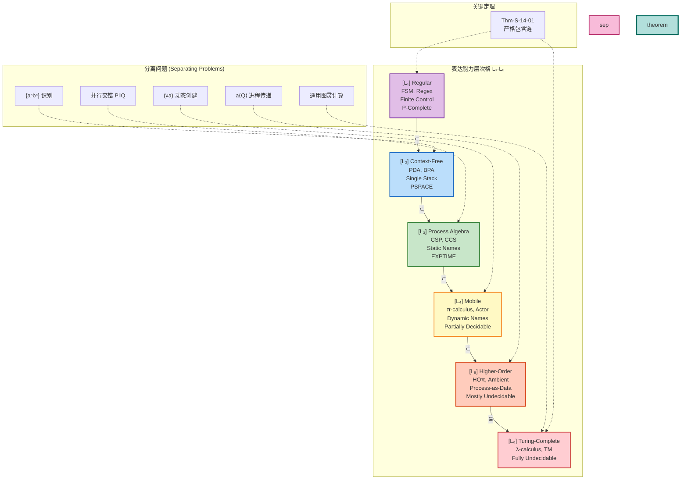
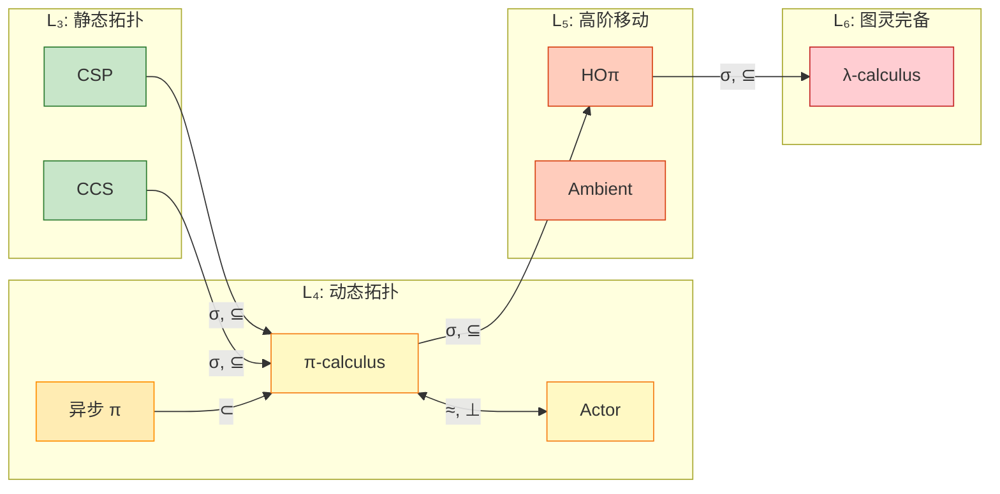

# 表达能力层次定理 (Expressiveness Hierarchy Theorem)

> **所属阶段**: Struct | **前置依赖**: [../01-foundation/01.01-unified-streaming-theory.md](../01-foundation/01.01-unified-streaming-theory.md), [../01-foundation/01.02-process-calculus-primer.md](../01-foundation/01.02-process-calculus-primer.md) | **形式化等级**: L3-L6
> **版本**: 2026.04

---

## 目录

- [表达能力层次定理 (Expressiveness Hierarchy Theorem)](#表达能力层次定理-expressiveness-hierarchy-theorem)
  - [目录](#目录)
  - [1. 概念定义 (Definitions)](#1-概念定义-definitions)
    - [Def-S-14-01. 表达能力预序 (Expressiveness Preorder)](#def-s-14-01-表达能力预序-expressiveness-preorder)
    - [Def-S-14-02. 互模拟等价 (Bisimulation Equivalence)](#def-s-14-02-互模拟等价-bisimulation-equivalence)
    - [Def-S-14-03. 六层表达能力层次 (Six-Layer Expressiveness Hierarchy)](#def-s-14-03-六层表达能力层次-six-layer-expressiveness-hierarchy)
  - [2. 属性推导 (Properties)](#2-属性推导-properties)
    - [Lemma-S-14-01. 组合性编码的状态空间上界](#lemma-s-14-01-组合性编码的状态空间上界)
    - [Lemma-S-14-02. 动态拓扑的不可回归性](#lemma-s-14-02-动态拓扑的不可回归性)
    - [Prop-S-14-01. 可判定性单调递减律](#prop-s-14-01-可判定性单调递减律)
    - [Prop-S-14-02. 编码存在性保持不可判定性](#prop-s-14-02-编码存在性保持不可判定性)
  - [3. 关系建立 (Relations)](#3-关系建立-relations)
    - [关系 1: 层次间的严格包含链](#关系-1-层次间的严格包含链)
    - [关系 2: CSP $\\subset$ π-calculus](#关系-2-csp-subset-π-calculus)
    - [关系 3: Actor $\\perp$ π-calculus（不可比较）](#关系-3-actor-perp-π-calculus不可比较)
    - [关系 4: 同步 π $\\supset$ 异步 π](#关系-4-同步-π-supset-异步-π)
  - [4. 论证过程 (Argumentation)](#4-论证过程-argumentation)
    - [论证 1: 为什么每一层分离都是严格的](#论证-1-为什么每一层分离都是严格的)
    - [论证 2: Gorla 的编码判据体系](#论证-2-gorla-的编码判据体系)
    - [论证 3: 表达能力与可验证性的权衡](#论证-3-表达能力与可验证性的权衡)
  - [5. 形式证明 (Proofs)](#5-形式证明-proofs)
    - [Thm-S-14-01. 表达能力严格层次定理](#thm-s-14-01-表达能力严格层次定理)
    - [Cor-S-14-01. 可判定性递减推论](#cor-s-14-01-可判定性递减推论)
  - [6. 实例验证 (Examples)](#6-实例验证-examples)
    - [示例 1: $L\_3 \\to L\_4$ 分离——移动通道](#示例-1-l3-to-l4-分离移动通道)
    - [示例 2: $L\_4 \\to L\_5$ 分离——进程传递](#示例-2-l4-to-l5-分离进程传递)
    - [示例 3: 良类型 Session 进程（$L\_4$ 子集）](#示例-3-良类型-session-进程l4-子集)
    - [反例: 违反层次边界的尝试](#反例-违反层次边界的尝试)
  - [7. 可视化 (Visualizations)](#7-可视化-visualizations)
    - [图 7.1: 表达能力层次格 (Expressiveness Hierarchy Lattice)](#图-71-表达能力层次格-expressiveness-hierarchy-lattice)
    - [图 7.2: 模型间编码关系图](#图-72-模型间编码关系图)
    - [图 7.3: 可判定性与表达能力权衡图](#图-73-可判定性与表达能力权衡图)
  - [8. 引用参考 (References)](#8-引用参考-references)
  - [关联文档](#关联文档)

## 1. 概念定义 (Definitions)

### Def-S-14-01. 表达能力预序 (Expressiveness Preorder)

设 $\mathcal{M}$ 为并发计算模型的集合。定义**表达能力预序** $\subseteq$ 为 $\mathcal{M} \times \mathcal{M}$ 上的二元关系，满足以下公理：

$$
M_1 \subseteq M_2 \iff \exists \sigma: M_1 \to M_2 \text{ 为合法编码}
$$

其中合法编码 $\sigma$ 必须满足以下**编码判据**（Encoding Criteria）：

| 判据 | 形式化定义 | 直观解释 |
|------|-----------|----------|
| **语法保持** (Syntax Preservation) | $\forall P \in M_1. \sigma(P) \in M_2$ 是良构的 | 源语言的每个程序都有目标语言中的对应表示 |
| **语义保持** (Semantic Preservation) | $P \approx_{M_1} Q \iff \sigma(P) \approx_{M_2} \sigma(Q)$ | 等价程序编码后仍等价，不等价程序编码后仍不等价 |
| **组合性** (Compositionality) | $\sigma(P \parallel Q) = C_{\parallel}[\sigma(P), \sigma(Q)]$ | 复合程序的编码由组件编码通过固定上下文组合而成 |
| **满抽象** (Full Abstraction) | $\sigma$ 同时保持观察等价和上下文等价 | 编码不引入也不消除可观察的行为差异 |

**表达能力等价**：$M_1 \approx M_2 \iff M_1 \subseteq M_2 \land M_2 \subseteq M_1$

**表达能力严格包含**：$M_1 \subset M_2 \iff M_1 \subseteq M_2 \land M_2 \not\subseteq M_1$

**定义动机**：没有严格编码判据的"表达能力比较"是主观的。通过要求语义保持和组合性，我们可以区分"理论上可模拟"（任何图灵完备语言都可以模拟任何其他）与"结构上可编译"（保持并发交互模式）。这一框架源于 Weijland (1990) 关于进程代数表达能力的开创性工作 [^1]。

---

### Def-S-14-02. 互模拟等价 (Bisimulation Equivalence)

设 $\mathcal{S} = (S, A, \{\xrightarrow{a}\}_{a \in A})$ 为标记迁移系统（Labeled Transition System）。二元关系 $\mathcal{R} \subseteq S \times S$ 是一个**强互模拟**（Strong Bisimulation），当且仅当：

$$
\forall (s, t) \in \mathcal{R}. \forall a \in A:
\begin{cases}
s \xrightarrow{a} s' \Rightarrow \exists t'. t \xrightarrow{a} t' \land (s', t') \in \mathcal{R} \\
t \xrightarrow{a} t' \Rightarrow \exists s'. s \xrightarrow{a} s' \land (s', t') \in \mathcal{R}
\end{cases}
$$

**强互模拟等价** $\sim$ 定义为所有强互模拟的并集：

$$
s \sim t \iff \exists \mathcal{R} \text{ 为强互模拟}. (s, t) \in \mathcal{R}
$$

**弱互模拟等价** $\approx$ 忽略内部动作 $\tau$：

$$
s \approx t \iff \exists \mathcal{R}. \forall a \neq \tau: s \xrightarrow{a} s' \Rightarrow \exists t'. t \xrightarrow{a} t' \land (s', t') \in \mathcal{R}
$$

其中 $\xrightarrow{a}$ 表示忽略 $\tau$ 的弱迁移：$\xrightarrow{a} = \xrightarrow{\tau}^* \circ \xrightarrow{a} \circ \xrightarrow{\tau}^*$（当 $a \neq \tau$）。

**关键性质**：

- $\sim$ 是同余关系（在并行组合等上下文下保持）
- $\approx$ 在大多数进程代数中也是同余（但在某些带优先级的演算中不是）
- $\sim \subseteq \approx$（强互模拟严格细于弱互模拟）

**定义动机**：互模拟是进程代数中最精细的行为等价关系，捕捉了"逐步模拟"而非仅"迹等价"的直觉。Sangiorgi (2009) 指出，互模拟的共归纳定义使其成为比较并发模型表达能力的自然工具 [^2]。

---

### Def-S-14-03. 六层表达能力层次 (Six-Layer Expressiveness Hierarchy)

定义表达能力层次 $\mathcal{L} = \{L_1, L_2, L_3, L_4, L_5, L_6\}$，每层由**核心计算资源**刻画：

| 层次 | 名称 | 核心资源 | 代表模型 | 可判定性 |
|------|------|----------|----------|----------|
| $L_1$ | Regular | 有限控制 + 有限数据 | FSM, 正则表达式 | P-完全 |
| $L_2$ | Context-Free | 有限控制 + 单栈 | PDA, BPA | PSPACE-完全 |
| $L_3$ | Process Algebra | 静态命名 + 同步通信 | CSP, CCS | EXPTIME |
| $L_4$ | Mobile | 动态创建 + 名字传递 | π-演算, Actor | 部分不可判定 |
| $L_5$ | Higher-Order | 进程作为数据传递 | HOπ, Ambient | 大部分不可判定 |
| $L_6$ | Turing-Complete | 无限制递归 + 数据 | λ-演算, TM | 完全不可判定 |

**层次语义**：

$$
L_i \subset L_{i+1} \quad (\text{对于 } 1 \leq i \leq 4), \quad L_5 \subseteq L_6
$$

**分离问题**（Separating Problems）：

- $L_2 \setminus L_1$：$\{a^n b^n \mid n \geq 0\}$ 语言识别
- $L_3 \setminus L_2$：并行组合 $P \parallel Q$ 的交错语义
- $L_4 \setminus L_3$：动态通道创建 $(\nu a)$ 与名字传递 $\bar{b}\langle a \rangle$
- $L_5 \setminus L_4$：高阶进程传递（将进程作为消息值）
- $L_6 \setminus L_5$：通用图灵计算（无限制递归）

**定义动机**：Chomsky 层次将形式语言按生成能力分层，但对并发计算的表达能力分类是不够的。六层层次扩展了这一思想，捕捉从"有限状态协议"到"移动代码"的计算资源递增链。每一层增加的资源都对应特定的工程能力边界。

---

## 2. 属性推导 (Properties)

### Lemma-S-14-01. 组合性编码的状态空间上界

**陈述**：若 $\sigma: \mathcal{P} \to \mathcal{Q}$ 是组合性编码，则对任意有限进程 $P$，其编码后的状态空间大小满足：

$$
|S(\sigma(P))| \leq f(|S(P)|)
$$

其中 $f$ 为仅依赖于语法构造符的函数（通常为多项式或单指数）。

**推导**：

1. 由 Def-S-14-01 的组合性，$\sigma(P)$ 的构造仅通过上下文 $C_{op}$ 组合子进程的编码；
2. 因此 $\sigma(P)$ 的全局状态由子进程编码状态的笛卡尔积构成；
3. 每个 $C_{op}$ 至多引入常数或线性因子的新状态；
4. 故总状态空间上界为子进程状态空间的有限次幂，即 $f(|S(P)|)$。 ∎

**推论**：任何破坏此上界的编码必然违反组合性，需要全局信息或产生指数爆炸。

---

### Lemma-S-14-02. 动态拓扑的不可回归性

**陈述**：设 $M_{static}$ 为静态拓扑模型（如 CSP），$M_{mobile}$ 为支持动态名称创建的模型（如 π-演算）。则不存在从 $M_{mobile}$ 到 $M_{static}$ 的满抽象编码。

**推导**：

1. **前提分析**：$M_{mobile}$ 支持操作 $(\nu a)P$，可在运行时创建新名字 $a$ 并将其传递给其他进程。$M_{static}$ 的通道集合在系统运行前已固定。

2. **构造反例**：考虑 π-演算进程 $P = (\nu a)(\bar{a}\langle b \rangle \mid a(x).x\langle c \rangle)$。该进程：
   - 创建新通道 $a$
   - 沿 $a$ 发送通道名 $b$
   - 从 $a$ 接收名称 $x$（绑定为 $b$）
   - 沿 $x$（即 $b$）发送 $c$

3. **编码困境**：任何将 $P$ 编码到 CSP 的尝试都必须将动态创建的 $a$ 映射到 CSP 的某个预定义通道。但由于 $a$ 的创建次数在运行时可能是无限的（通过递归复制），预定义通道集合必然不足。

4. **结论**：若使用全局通道池模拟，则破坏组合性（所有进程共享同一池），且无法保持互模拟语义。因此，$M_{static}$ 无法满抽象地编码 $M_{mobile}$ 的动态拓扑能力。 ∎

---

### Prop-S-14-01. 可判定性单调递减律

**陈述**：若 $M \in L_i$ 且 $N \in L_j$ 且 $i < j$，则 $M$ 的可判定问题集合是 $N$ 的超集：

$$
\text{Decidable}(L_j) \subseteq \text{Decidable}(L_i)
$$

**推导**：

1. 由 Def-S-14-03，$L_i$ 的计算资源严格少于 $L_j$；
2. 增加资源（动态拓扑、高阶性、无限制递归）会引入新的不可判定来源；
3. 例如，$L_3$ 的静态拓扑限制了状态空间的结构，使得互模拟在有限状态时可判定；$L_4$ 的动态拓扑消除了这一限制，导致一般互模拟不可判定；
4. 因此，表达能力提升 $\Rightarrow$ 可判定性下降（负相关）。

---

### Prop-S-14-02. 编码存在性保持不可判定性

**陈述**：若 $M_1 \subseteq M_2$（忠实编码），且问题 $\Pi$ 在 $M_2$ 中不可判定，则 $\Pi$ 在 $M_1$ 中亦不可判定。

**推导**：

1. 假设 $\Pi$ 在 $M_1$ 中可判定，则可通过编码 $\sigma$ 将 $M_2$ 中的实例转化为 $M_1$ 中的实例；
2. 再利用 $M_1$ 的判定算法求解，从而推出 $\Pi$ 在 $M_2$ 中可判定；
3. 这与前提矛盾；
4. 因此，编码存在性将不可判定性从低层"传递"到高层（或从目标模型传递到源模型）。

---

## 3. 关系建立 (Relations)

### 关系 1: 层次间的严格包含链

**严格包含定理**：

$$
L_1 \subset L_2 \subset L_3 \subset L_4 \subset L_5 \subseteq L_6
$$

**论证**：

| 包含对 | 正向编码 | 反向不可能 | 分离证据 |
|--------|----------|------------|----------|
| $L_1 \subset L_2$ | FSM → PDA（退化） | PDA 可识别 $a^n b^n$，FSM 不可 | 上下文无关语言类严格大于正则类 |
| $L_2 \subset L_3$ | BPA → CSP | CSP 并行组合产生交错语义，超越 CFL | 并行交错不是上下文无关的 |
| $L_3 \subset L_4$ | CSP → π | π 的动态拓扑无法被静态模型编码 | $(\nu a)$ 创建新名字并传递 |
| $L_4 \subset L_5$ | π → HOπ | HOπ 的进程传递无法被 π 编码 | 高阶进程作为数据值传递 |
| $L_5 \subseteq L_6$ | HOπ → λ | HOπ 已是图灵完备 | 无超图灵模型已知 |

---

### 关系 2: CSP $\subset$ π-calculus

**论证**：

- **编码存在性**：存在组合性编码 $\sigma: \text{CSP} \to \pi$ 保持迹语义。CSP 的同步通信可以通过 π-演算的通道握手模拟；CSP 的隐藏 $P \setminus A$ 对应 π 的限制 $(\nu \vec{a} \in A)P$。

- **分离结果**：由 Lemma-S-14-02，CSP 的静态事件字母表无法表达 π 的动态名字创建与传递。考虑 π 进程 $P = (\nu a)(\bar{b}\langle a \rangle \mid a(x).x\langle c \rangle)$，CSP 无法组合性地编码此行为。

> **推断 [Theory→Implementation]**: CSP 属于 $L_3$（静态拓扑），因此 Go 等实现可以依赖编译期通道类型检查，但无法原生表达移动通道，必须借助外部服务发现机制（如 Consul/Etcd）补偿动态拓扑需求。

---

### 关系 3: Actor $\perp$ π-calculus（不可比较）

**论证**：

- **Actor $\not\subseteq$ π**：Actor 的无界 spawn 产生无限多个独立 mailbox，而有限 π 进程无法为无界增长的独立接收点预分配名字。每个新 Actor 需要一个独立的、可被外部引用的接收点，有限 π 进程的静态名字集无法提供无限多个这样的名字。

- **π $\not\subseteq$ Actor**：π 支持将通道名作为一等值传递（$\bar{a}\langle b \rangle$），接收方可以将收到的通道名立即用作通信通道。纯 Actor 模型中，mailbox 地址不能作为消息内容传递并二次用作直接通信通道。

---

### 关系 4: 同步 π $\supset$ 异步 π

**论证**（Palamidessi, 2003）[^3]：

- **异步 π $\subseteq$ 同步 π**：异步 π 是同步 π 的语法子集（禁止输出前缀）。

- **同步 π $\not\subseteq$ 异步 π**：同步 π 支持**混合选择**（mixed choice）：

$$
P = a(x).Q + \bar{b}\langle v \rangle.R
$$

该进程可以选择从 $a$ 接收，或向 $b$ 发送。异步 π 不支持输出前缀，因此无法直接表达这种"发送或接收"的选择。Palamidessi 证明了在保持调度独立性和无全局计数器的前提下，混合选择无法被异步 π 编码。

---

## 4. 论证过程 (Argumentation)

### 论证 1: 为什么每一层分离都是严格的

**$L_1 \to L_2$：从有限状态到上下文无关**

下推自动机（PDA）可以识别 $\{a^n b^n \mid n \geq 0\}$，这是上下文无关语言的经典例子。有限状态机（FSM）由于无栈结构，无法对 $a$ 的数量进行计数并与 $b$ 的数量比较。因此 $L_1 \subset L_2$ 是严格的。

**$L_2 \to L_3$：从顺序栈到并行组合**

上下文无关文法只能表达顺序和选择，而 CSP/CCS 的并行组合 $P \parallel Q$ 引入了**交错语义**——两个进程的任意交错执行产生迹集合，这不是上下文无关语言可以描述的。因此 $L_2 \subset L_3$ 是严格的。

**$L_3 \to L_4$：从静态拓扑到动态拓扑**

这是并发理论中最重要的严格分离。CSP 的通道名在语法层面即固定，程序运行时的通信拓扑完全由源代码决定。π-演算通过 $(\nu a)$ 操作允许运行时创建新通道名，并通过 $\bar{b}\langle a \rangle$ 将其传递给其他进程。这支持了"移动性"——分布式系统动态重组连接的能力。

**$L_4 \to L_5$：从名字传递到进程传递**

π-演算只能传递名字（通道引用），而高阶 π-演算（HOπ）可以将**整个进程代码**作为值传递：

$$
P = a\langle Q \rangle.R
$$

这里 $Q$ 是任意复杂的进程。这种能力直接支持了代码迁移、移动代理和主动网络等场景。

**$L_5 \to L_6$：图灵完备性**

$L_5$ 已经图灵完备，但 $L_6$ 包含所有图灵完备模型（包括非并行的 λ-演算和图灵机）。$L_5 \subseteq L_6$ 反映了高阶移动性是图灵完备计算的一个子集特征。

---

### 论证 2: Gorla 的编码判据体系

Gorla (2010) 提出了评估进程演算编码的系统化判据框架 [^4]，这些判据成为本文 Def-S-14-01 编码判据的基础：

| Gorla 判据 | 本文对应 | 核心要求 |
|------------|----------|----------|
| **结构保持** | 语法保持 | 编码是结构归纳的 |
| **语义保持** | 语义保持 | 保持观察等价 |
| **组合性** | 组合性 | 编码通过上下文组合 |
| **名称不变性** | 满抽象的一部分 | 编码不依赖具体名字选择 |
| **操作性** | 隐含在编码定义中 | 编码是可计算的 |

这些判据的严格应用排除了"作弊"编码——例如，将整个程序编码为单个整数（通过哥德尔编码），然后在解码后模拟执行。这种编码违反了组合性（需要全局解码）。

---

### 论证 3: 表达能力与可验证性的权衡

| 层次 | 表达能力 | 可验证性 | 工程权衡 |
|------|----------|----------|----------|
| $L_1$-$L_2$ | 有限 | 完全自动 | 适用于安全关键协议验证 |
| $L_3$ | 静态并发 | FDR 等工具支持 | 工业级形式化验证基础 |
| $L_4$ | 动态拓扑 | 部分可判定 | 需要运行时监控补偿 |
| $L_5$-$L_6$ | 通用计算 | 不可判定 | 依赖测试和监控 |

Boudol (1992) 首次系统研究了并发模型中表达能力与可判定性的负相关关系 [^5]。这一关系意味着：表达能力越强的模型，静态验证工具能提供完备保证的能力越弱。

---

## 5. 形式证明 (Proofs)

### Thm-S-14-01. 表达能力严格层次定理

**陈述**：

$$
L_1 \subset L_2 \subset L_3 \subset L_4 \subset L_5 \subseteq L_6
$$

即，六层表达能力层次构成严格包含链（$L_5 \subseteq L_6$ 为子集关系）。

**证明**：

**第一部分：$L_1 \subset L_2$**

- **编码存在**：FSM 可以编码为 PDA 的空栈转移（退化编码）。
- **分离证据**：语言 $\{a^n b^n \mid n \geq 0\}$ 可被 PDA 识别，但不被任何 FSM 识别。这是上下文无关语言严格包含正则语言的经典结果。
- **结论**：$L_1 \subset L_2$。

**第二部分：$L_2 \subset L_3$**

- **编码存在**：BPA 文法产生式 $X \to \alpha$ 可以编码为 CSP 递归进程定义 $X = \sigma(\alpha)$。
- **分离证据**：考虑 CSP 进程 $P = a \to \text{STOP} \parallel b \to \text{STOP}$。其迹集合为 $\{a, b\}$ 的所有交错序列。这种并行交错语义产生了非上下文无关的语言结构（两个独立计数器的交错）。
- **结论**：$L_2 \subset L_3$。

**第三部分：$L_3 \subset L_4$**

- **编码存在**：由 Thm-S-02-01（见 [../01-foundation/01.02-process-calculus-primer.md](../01-foundation/01.02-process-calculus-primer.md)），存在从 CSP 到 π-演算的迹语义保持编码。

- **分离证据（核心）**：

  考虑 π-演算进程：
  $$
  P_{mob} = (\nu a)(\bar{b}\langle a \rangle \mid a(x).\bar{c}\langle x \rangle)
  $$

  $P_{mob}$ 的执行行为：
  1. 创建新通道 $a$
  2. 沿公共通道 $b$ 发送 $a$ 的名字
  3. 在 $a$ 上接收 $x$
  4. 沿 $c$ 转发 $x$

  **反证法**：假设存在满抽象编码 $\sigma: \pi \to \text{CSP}$。

  CSP 的事件名集合 $Events$ 在解析时即固定（由 Lemma-S-02-01，见 [../01-foundation/01.02-process-calculus-primer.md](../01-foundation/01.02-process-calculus-primer.md)）。要编码 $P_{mob}$，$\sigma$ 需要：

  - 为运行时创建的每个 $a$ 分配 CSP 事件名
  - 由于递归复制可能产生无限多个 $a$，需要无限多个事件名

  **矛盾 A**：若预分配无限事件名，违反编码判据的有限状态前提。

  **矛盾 B**：若使用有限事件名池，无法保证通道的"新性"（freshness），多个独立创建的通道可能冲突。

  因此假设不成立，不存在从 π 到 CSP 的忠实编码。

- **结论**：$L_3 \subset L_4$。

**第四部分：$L_4 \subset L_5$**

- **编码存在**：π-演算可以编码为高阶 π-演算（HOπ）的退化形式：将名字 $a$ 编码为传递空进程的代理 $[a] = \bar{a}\langle 0 \rangle$。

- **分离证据**：

  考虑 HOπ 进程：
  $$
  P_{ho} = a\langle Q \rangle.R
  $$
  其中 $Q$ 是包含自由名字的任意复杂进程。

  在 π-演算中，只能传递**名字**，不能传递**进程代码**。尝试将 $Q$ 编码为名字（如指向全局代码表的指针）：
  - 需要全局共享的代码解释器，破坏组合性
  - 无法保持弱互模拟（环境上下文无法区分"传递代码本身"与"传递指针"）

  Sangiorgi (1992) 证明了不存在从 HOπ 到 π 的保持同余性的编码 [^6]。

- **结论**：$L_4 \subset L_5$。

**第五部分：$L_5 \subseteq L_6$**

- $L_5$ 中的模型（HOπ、Mobile Ambients）已被证明是图灵完备的（可编码 λ-演算）。
- $L_6$ 定义为所有图灵完备模型的集合。
- 因此 $L_5 \subseteq L_6$。

**综上**：$L_1 \subset L_2 \subset L_3 \subset L_4 \subset L_5 \subseteq L_6$。 ∎

---

### Cor-S-14-01. 可判定性递减推论

**陈述**：

$$
\text{若 } L_i \subset L_j \text{，则 } \text{Decidable}(L_j) \subset \text{Decidable}(L_i)
$$

**证明**：由 Prop-S-14-01 和 Thm-S-14-01 直接可得。 ∎

---

## 6. 实例验证 (Examples)

### 示例 1: $L_3 \to L_4$ 分离——移动通道

**π-演算进程**（$L_4$ 可表达）：

```pseudocode
// 动态创建通道并传递
SERVER = (ν reply_ch)(
    request_channel!("process", reply_ch).
    reply_ch?(result).CONTINUE
)
```

**尝试的 CSP 编码**（$L_3$ 失败）：

```csp
-- CSP 无法表达：reply_ch 是运行时创建的
-- 必须在语法层面预定义所有可能的 reply_ch
SERVER_CSP =
    -- 只能选择预定义的事件名
    -- 无法根据运行时请求动态创建新的 reply_ch
```

**分析**：CSP 的事件名在编译期固定，无法在运行时像 π 那样通过 $(\nu reply\_ch)$ 创建新通道。

---

### 示例 2: $L_4 \to L_5$ 分离——进程传递

**HOπ 进程**（$L_5$ 可表达）：

```pseudocode
// 将进程作为数据传递
AGENT =
    let code = λx.(x!data.0) in  // 进程代码
    migrate_channel!<code>.      // 发送进程到远程节点
    CONTINUE
```

**尝试的 π-演算编码**（$L_4$ 失败）：

```pseudocode
// π 只能传递名字，不能直接传递进程代码
-- 尝试 1: 将 code 编码为名字（指向全局表）
-- 问题：破坏组合性，需要全局状态

-- 尝试 2: 将 code 展开为所有可能行为
-- 问题：code 可能包含无限递归，展开无限
```

**分析**：π-演算的一阶名字传递无法直接表达"进程作为值传递"的高阶语义。

---

### 示例 3: 良类型 Session 进程（$L_4$ 子集）

**协议定义**：

$$
S_{client} = !\text{Int}.?\text{Bool}.\text{end} \quad (L_4 \text{ 会话类型})
$$

**进程实现**：

$$
\begin{aligned}
P_{client} &= c!\langle 42 \rangle.c?(x).0 \\
P_{server} &= c?(y).c!\langle y > 0 \rangle.0
\end{aligned}
$$

**组合**：$(\nu c:S_{client})(P_{client} \mid P_{server})$ 是良类型的。

**验证**：由 Cor-S-02-01（见 [../01-foundation/01.02-process-calculus-primer.md](../01-foundation/01.02-process-calculus-primer.md)），该组合不会死锁。

---

### 反例: 违反层次边界的尝试

**场景**：试图用 $L_3$ 模型（CSP）验证 $L_4$ 系统（微服务动态发现）的所有性质。

**问题**：

- CSP 的静态拓扑假设无法捕获微服务的动态注册/发现行为
- 使用 CSP 验证工具（如 FDR）分析微服务协议会产生假阴性或假阳性
- 某些在真实系统中可达的状态在 CSP 抽象中被消除

**结论**：模型层次选择错误会导致验证结果不可靠。$L_4$ 系统需要 $L_4$ 模型（π-演算或 Actor）或专门的抽象技术。

---

## 7. 可视化 (Visualizations)

### 图 7.1: 表达能力层次格 (Expressiveness Hierarchy Lattice)



**图说明**：

- 六层结构形成严格包含链，每层增加新的计算资源
- 分离问题展示了证明严格性的具体语言/行为
- 颜色从紫色（可判定）渐变到红色（不可判定），反映可判定性递减

---

### 图 7.2: 模型间编码关系图



**图说明**：

- `σ` 表示存在编码映射，`⊆` 表示严格包含
- `≈` 表示表达能力等价，`⊥` 表示不可比较
- π-演算位于中心，向上可编码到 HOπ，向下可编码 CSP/CCS
- 异步 π 严格弱于同步 π（Palamidessi 定理）

---

### 图 7.3: 可判定性与表达能力权衡图

```mermaid
quadrantChart
    title 表达能力 vs 可判定性权衡
    x-axis 高可判定性 --> 低可判定性
    y-axis 低表达能力 --> 高表达能力

    "L₁ FSM": [0.9, 0.1]
    "L₂ PDA": [0.7, 0.25]
    "L₃ CSP": [0.5, 0.4]
    "L₄ π": [0.2, 0.6]
    "L₅ HOπ": [0.05, 0.8]
    "L₆ λ": [0.0, 1.0]
```

**图说明**：

- 随着表达能力提升，可判定性单调下降
- 工程选型的"甜蜜点"通常在 L₃-L₄ 之间
- 安全关键系统倾向于左侧（可验证），通用系统倾向于右侧（表达力）

---

## 8. 引用参考 (References)

[^1]: W. P. Weijland, "Semantics for Logic Programming: A Unifying Approach," Ph.D. Thesis, University of Amsterdam, 1990. —— 提出进程代数编码的系统化判据框架

[^2]: D. Sangiorgi, "Origins of Bisimulation and Coinduction," Cambridge University Press, 2009. —— 互模拟理论的历史与系统性阐述

[^3]: C. Palamidessi, "Comparing the Expressive Power of the Synchronous and Asynchronous π-calculi," *Mathematical Structures in Computer Science*, 13(5), 685-719, 2003. —— 同步与异步 π 演算的严格分离证明

[^4]: D. Gorla, "Towards a Unified Approach to Encodability and Separation Results for Process Calculi," *Information and Computation*, 208(9), 1031-1053, 2010. —— 表达能力比较的判据体系

[^5]: G. Boudol, "Asynchrony and the π-calculus," INRIA Research Report, 1992. —— 异步通信与表达能力的基础研究

[^6]: D. Sangiorgi, "Expressing Mobility in Process Algebras: First-Order and Higher-Order Paradigms," Ph.D. Thesis, University of Edinburgh, 1992. —— 一阶与高阶移动性的开创性比较


---

## 关联文档

- [../01-foundation/01.01-unified-streaming-theory.md](../01-foundation/01.01-unified-streaming-theory.md) —— 统一流计算理论与六层层次定义
- [../01-foundation/01.02-process-calculus-primer.md](../01-foundation/01.02-process-calculus-primer.md) —— 进程演算基础（CCS, CSP, π, Session Types）
- [../01-foundation/01.03-actor-model-formalization.md](../01-foundation/01.03-actor-model-formalization.md) —— Actor 模型形式化
- [03.01-actor-to-csp-encoding.md](./03.01-actor-to-csp-encoding.md) —— Actor 到 CSP 的编码关系
- [03.02-flink-to-process-calculus.md](./03.02-flink-to-process-calculus.md) —— Flink 到进程演算的映射

---

*文档版本: 2026.04 | 形式化等级: L3-L6 | 状态: 完整*
