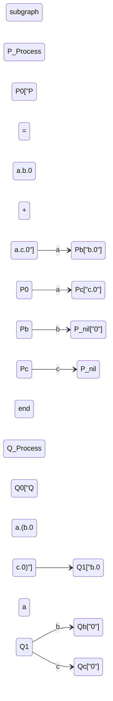
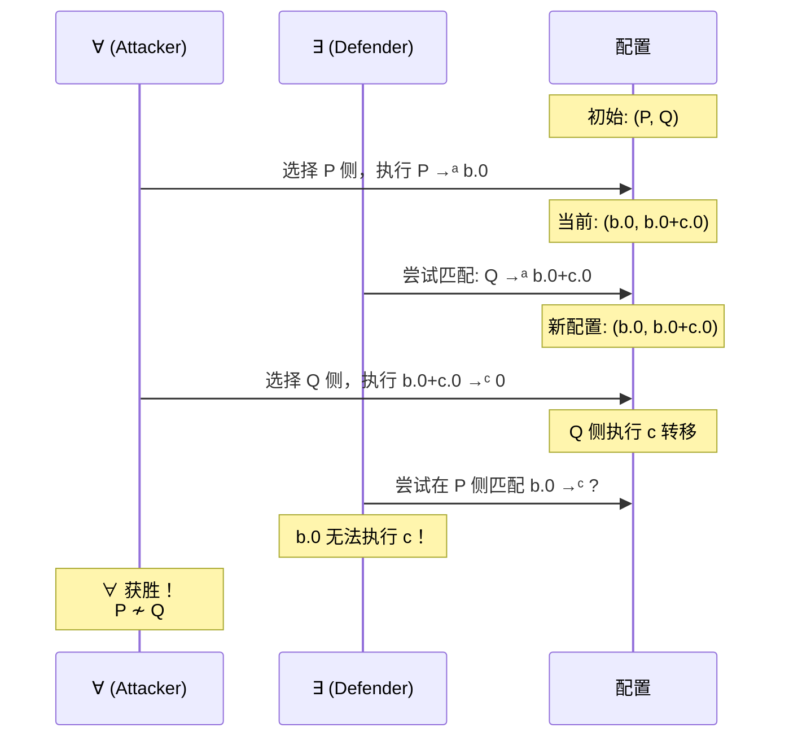
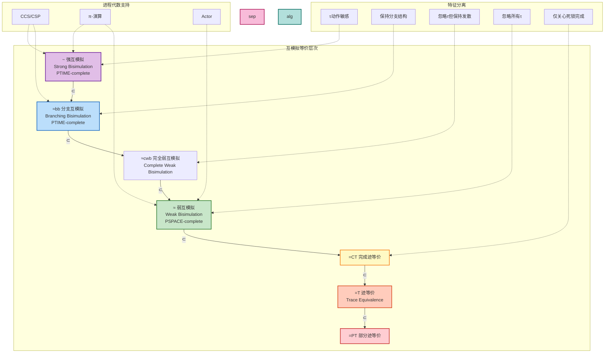
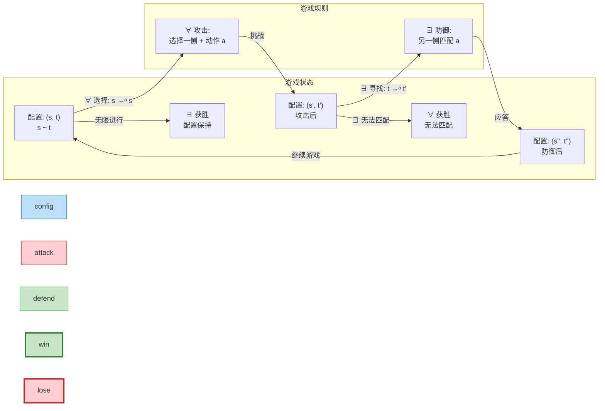
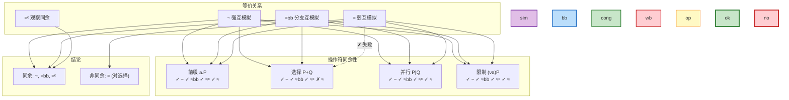

# 互模拟等价关系 (Bisimulation Equivalences)

> **所属阶段**: Struct | **前置依赖**: [../01-foundation/01.02-process-calculus-primer.md](../01-foundation/01.02-process-calculus-primer.md) | **形式化等级**: L3-L4
> **版本**: 2026.04

---

## 目录

- [互模拟等价关系 (Bisimulation Equivalences)](#互模拟等价关系-bisimulation-equivalences)
  - [目录](#目录)
  - [1. 概念定义 (Definitions)](#1-概念定义-definitions)
    - [Def-S-15-01. 强互模拟 (Strong Bisimulation)](#def-s-15-01-强互模拟-strong-bisimulation)
    - [Def-S-15-02. 弱互模拟与分支互模拟 (Weak \& Branching Bisimulation)](#def-s-15-02-弱互模拟与分支互模拟-weak--branching-bisimulation)
    - [Def-S-15-03. 互模拟游戏 (Bisimulation Game)](#def-s-15-03-互模拟游戏-bisimulation-game)
    - [Def-S-15-04. 同余关系 (Congruence)](#def-s-15-04-同余关系-congruence)
  - [2. 属性推导 (Properties)](#2-属性推导-properties)
    - [Lemma-S-15-01. 强互模拟是等价关系](#lemma-s-15-01-强互模拟是等价关系)
    - [Lemma-S-15-02. 互模拟蕴含迹等价，反之不成立](#lemma-s-15-02-互模拟蕴含迹等价反之不成立)
    - [Prop-S-15-01. 弱互模拟的同余缺陷](#prop-s-15-01-弱互模拟的同余缺陷)
    - [Prop-S-15-02. 分支互模拟保持发散行为](#prop-s-15-02-分支互模拟保持发散行为)
  - [3. 关系建立 (Relations)](#3-关系建立-relations)
    - [关系 1: 互模拟谱系的严格包含链](#关系-1-互模拟谱系的严格包含链)
    - [关系 2: 强互模拟与 Hennessy-Milner 逻辑的对应](#关系-2-强互模拟与-hennessy-milner-逻辑的对应)
    - [关系 3: 分支互模拟与 BHML 的对应](#关系-3-分支互模拟与-bhml-的对应)
  - [4. 论证过程 (Argumentation)](#4-论证过程-argumentation)
    - [论证 1: 互模拟优于迹等价的理论基础](#论证-1-互模拟优于迹等价的理论基础)
    - [论证 2: 同余性的必要性与弱互模拟的修正](#论证-2-同余性的必要性与弱互模拟的修正)
    - [论证 3: 复杂度与验证可行性](#论证-3-复杂度与验证可行性)
  - [5. 形式证明 (Proofs)](#5-形式证明-proofs)
    - [Thm-S-15-01. 互模拟同余定理](#thm-s-15-01-互模拟同余定理)
    - [Cor-S-15-01. 互模拟等价类构成商 LTS](#cor-s-15-01-互模拟等价类构成商-lts)
  - [6. 实例验证 (Examples)](#6-实例验证-examples)
    - [示例 1: 迹等价但不互模拟的经典反例](#示例-1-迹等价但不互模拟的经典反例)
    - [示例 2: 弱互模拟但不分支互模拟](#示例-2-弱互模拟但不分支互模拟)
    - [示例 3: 互模拟游戏演示](#示例-3-互模拟游戏演示)
    - [反例: 弱互模拟在同余性上的失败](#反例-弱互模拟在同余性上的失败)
  - [7. 可视化 (Visualizations)](#7-可视化-visualizations)
    - [图 7.1: 互模拟层次谱系图](#图-71-互模拟层次谱系图)
    - [图 7.2: 互模拟游戏示意图](#图-72-互模拟游戏示意图)
    - [图 7.3: 同余性与操作符关系图](#图-73-同余性与操作符关系图)
  - [8. 引用参考 (References)](#8-引用参考-references)
  - [关联文档](#关联文档)

## 1. 概念定义 (Definitions)

### Def-S-15-01. 强互模拟 (Strong Bisimulation)

设 $\mathcal{T} = (S, A, \{\xrightarrow{a}\}_{a \in A})$ 为标记转移系统（LTS），其中 $S$ 为状态集，$A$ 为动作集（含内部动作 $\tau$）。二元关系 $\mathcal{R} \subseteq S \times S$ 称为**强互模拟**（Strong Bisimulation），当且仅当满足以下**zig-zag 条件**[^1][^2]：

$$
\forall (s, t) \in \mathcal{R}. \forall a \in A:
\begin{cases}
s \xrightarrow{a} s' \Rightarrow \exists t'. t \xrightarrow{a} t' \land (s', t') \in \mathcal{R} \\
t \xrightarrow{a} t' \Rightarrow \exists s'. s \xrightarrow{a} s' \land (s', t') \in \mathcal{R}
\end{cases}
$$

**强互模拟等价**（记作 $s \sim t$）定义为所有强互模拟的并集：

$$
s \sim t \iff \exists \mathcal{R} \text{ 为强互模拟}. (s, t) \in \mathcal{R}
$$

**最大强互模拟** $\sim$ 是所有强互模拟关系的并集，其本身也是强互模拟。

**直观解释**：强互模拟要求两个进程在每一步动作上都精确镜像对方，包括内部 $\tau$ 动作。它是进程代数中最精细的行为等价关系，捕捉了"逐步模拟"的直觉——两个进程不仅产生相同的可见动作序列，而且在每个分支点提供相同的选择集合。

**定义动机**：如果不将内部动作 $\tau$ 纳入等价判定，就无法区分"立即执行 $a$"与"先执行内部计算再执行 $a$"的进程，从而丢失重要的行为区分能力。强互模拟为更粗糙的等价关系（如弱互模拟、迹等价）提供了理论基础。

---

### Def-S-15-02. 弱互模拟与分支互模拟 (Weak & Branching Bisimulation)

**弱迁移**（Weak Transition）$\xRightarrow{a}$ 定义为忽略 $\tau$ 动作的转移闭包：

$$
\xRightarrow{a} =
\begin{cases}
\xrightarrow{\tau}^* & \text{若 } a = \tau \\
\xrightarrow{\tau}^* \circ \xrightarrow{a} \circ \xrightarrow{\tau}^* & \text{若 } a \neq \tau
\end{cases}
$$

二元关系 $\mathcal{R} \subseteq S \times S$ 称为**弱互模拟**（Weak Bisimulation），当且仅当[^1]：

$$
\forall (s, t) \in \mathcal{R}. \forall a \in A:
\begin{cases}
s \xrightarrow{a} s' \Rightarrow \exists t'. t \xRightarrow{a} t' \land (s', t') \in \mathcal{R} \\
t \xrightarrow{a} t' \Rightarrow \exists s'. s \xRightarrow{a} s' \land (s', t') \in \mathcal{R}
\end{cases}
$$

**弱互模拟等价**记作 $s \approx t$。

**分支互模拟**（Branching Bisimulation）$\approx_{bb}$ 是弱互模拟的精细化，增加**stuttering 条件**[^7]：若 $s \xrightarrow{\tau} s'$，则要么 $(s', t) \in \mathcal{R}$（静默步），要么存在 $t \xrightarrow{\tau}^* t_1 \xrightarrow{a} t'$ 使得 $(s, t_1) \in \mathcal{R}$ 且 $(s', t') \in \mathcal{R}$。这要求匹配可见动作前的 $\tau$ 序列时，中间状态必须与原始状态保持关系。

**直观解释**：弱互模拟忽略不可见的内部计算，只要求可见动作能够相互匹配。它适合验证实现与规范之间的等价性——实现可能包含额外的内部步骤（如调度、垃圾回收），但外部观察者应无法区分。分支互模拟进一步保留"在何时做选择"的分支信息，比弱互模拟更严格。

**定义动机**：工程实现中，内部动作（如协议缓冲、线程调度）通常不可观察。强互模拟过于严格，会将本质上行为相同的实现判定为不等价。弱互模拟通过抽象掉 $\tau$ 动作，建立了更适合实现验证的等价标准。

---

### Def-S-15-03. 互模拟游戏 (Bisimulation Game)

给定 LTS 中的两个状态 $s, t \in S$，**互模拟游戏**是参与者 $\forall$（攻击者/Attacker）与 $\exists$（防御者/Defender）之间的双人博弈[^2][^4]：

**游戏配置**：当前配置为状态对 $(s_i, t_i)$，初始配置为 $(s, t)$。

**游戏规则**：

1. **攻击步**：$\forall$ 选择一侧（如 $s_i$）和动作 $a \in A$，执行 $s_i \xrightarrow{a} s_{i+1}$；
2. **防御步**：$\exists$ 必须在另一侧找到匹配转移 $t_i \xrightarrow{a} t_{i+1}$（强互模拟）或 $t_i \xRightarrow{a} t_{i+1}$（弱互模拟），使得新配置为 $(s_{i+1}, t_{i+1})$；
3. 若 $\exists$ 无法匹配，则 $\forall$ 获胜；游戏无限进行则 $\exists$ 获胜。

**策略与获胜**：

- **$\exists$ 的获胜策略**：从配置 $(s, t)$ 出发，无论 $\forall$ 如何选择，$\exists$ 总能找到匹配转移的完整策略树；
- **$\exists$ 的位置策略**（positional strategy）：策略仅依赖于当前配置，不依赖历史。

**博弈语义**：$s \sim t$ 当且仅当 $\exists$ 在互模拟游戏中有获胜策略；$s \approx t$ 当且仅当 $\exists$ 在弱互模拟游戏中有获胜策略。

**直观解释**：互模拟游戏将抽象的等价关系转化为具体的博弈过程。攻击者试图找到两个进程的行为差异，防御者则试图证明它们行为等价。这种"挑战-应答"范式为验证算法（如模型检测）提供了操作化基础。

**定义动机**：互模拟的原始定义是存在性量词（"存在关系 $\mathcal{R}$..."），难以直接用于算法判定。游戏语义将其转化为可达性问题——$\exists$ 是否有获胜策略——这为分区精化算法（如 Paige-Tarjan）提供了理论支撑。

---

### Def-S-15-04. 同余关系 (Congruence)

设 $\mathcal{C}$ 为进程演算的**上下文**（context）——包含一个或多个"孔"（hole）$[\cdot]$ 的进程表达式。上下文 $C[\cdot]$ 对进程 $P$ 的应用记为 $C[P]$，表示将孔替换为 $P$。

等价关系 $\sim$ 对进程演算的操作符族 $\mathcal{O}$ 是**同余**（congruence），当且仅当[^1][^6]：

$$
\forall P, Q. P \sim Q \Rightarrow \forall C[\cdot] \in \mathcal{C}. C[P] \sim C[Q]
$$

即等价进程在任何上下文中的替换保持等价。

**CCS/CSP/π-演算的标准操作符**：

| 操作符 | 语法 | 分类 |
|--------|------|------|
| 前缀 | $a.P$ | 一元 |
| 选择 | $P + Q$（CCS/π）或 $P \square Q$（CSP） | 二元 |
| 并行 | $P \mid Q$ 或 $P \parallel Q$ | 二元 |
| 限制/隐藏 | $(\nu a)P$ 或 $P \setminus L$ | 绑定 |
| 重命名 | $P[f]$ | 一元 |
| 复制 | $!P$ | 一元 |

**直观解释**：同余性保证等价关系在模块化构造下的可组合性。若 $P$ 与 $Q$ 行为等价，则将它们嵌入任何更大系统时，这种等价性应保持。没有同余性，等价判定将失去工程价值——无法将组件级验证结果组合为系统级保证。

**定义动机**：弱互模拟 $\approx$ 对 CCS 的选择操作符 $+$ **不是**同余（经典反例：$\tau.a \approx a$，但 $\tau.a + b \not\approx a + b$）。这催生了分支互模拟 $\approx_{bb}$ 和观察同余 $\approx^c$ 的研究，它们在忽略内部动作的同时保持同余性。

---

## 2. 属性推导 (Properties)

### Lemma-S-15-01. 强互模拟是等价关系

**陈述**：强互模拟等价 $\sim$ 是状态集 $S$ 上的等价关系，即满足自反性、对称性和传递性。

**证明**：

1. **自反性**：恒等关系 $\mathcal{I} = \{(s, s) \mid s \in S\}$ 显然是强互模拟。对任意 $s \xrightarrow{a} s'$，存在 $s \xrightarrow{a} s'$ 且 $(s', s') \in \mathcal{I}$。因此 $s \sim s$。

2. **对称性**：由 Def-S-15-01 的 zig-zag 条件对称性直接可得。若 $\mathcal{R}$ 是强互模拟，则 $\mathcal{R}^{-1} = \{(t, s) \mid (s, t) \in \mathcal{R}\}$ 也是强互模拟。因此 $s \sim t \Rightarrow t \sim s$。

3. **传递性**：设 $s \sim t$ 通过 $\mathcal{R}_1$，$t \sim u$ 通过 $\mathcal{R}_2$。考虑复合关系：
   $$
   \mathcal{R}_1 \circ \mathcal{R}_2 = \{(s, u) \mid \exists t. (s, t) \in \mathcal{R}_1 \land (t, u) \in \mathcal{R}_2\}
   $$

   对任意 $(s, u) \in \mathcal{R}_1 \circ \mathcal{R}_2$，若 $s \xrightarrow{a} s'$：
   - 由 $s \sim t$，存在 $t \xrightarrow{a} t'$ 且 $(s', t') \in \mathcal{R}_1$；
   - 由 $t \sim u$，存在 $u \xrightarrow{a} u'$ 且 $(t', u') \in \mathcal{R}_2$；
   - 因此 $(s', u') \in \mathcal{R}_1 \circ \mathcal{R}_2$。

   对称条件同理。故 $\mathcal{R}_1 \circ \mathcal{R}_2$ 是强互模拟，$s \sim u$。 ∎

---

### Lemma-S-15-02. 互模拟蕴含迹等价，反之不成立

**陈述**：对任意状态 $s, t \in S$，$s \sim t$ 蕴含 $s$ 与 $t$ 具有相同的有限迹集合（$\text{Traces}(s) = \text{Traces}(t)$），但迹等价不蕴含互模拟等价。

**证明**：

**第一部分：$\sim \Rightarrow =_T$（互模拟蕴含迹等价）**

设 $s \sim t$，$\mathcal{R}$ 为见证互模拟。对任意迹 $\sigma = a_1 a_2 \dots a_n \in \text{Traces}(s)$：

1. 由迹定义，存在状态序列 $s = s_0 \xrightarrow{a_1} s_1 \xrightarrow{a_2} \dots \xrightarrow{a_n} s_n$；
2. 由互模拟定义，$s_0 \sim t_0$ 蕴含存在 $t_0 \xrightarrow{a_1} t_1$ 且 $s_1 \sim t_1$；
3. 归纳地，对每个 $i$，存在 $t_i \xrightarrow{a_{i+1}} t_{i+1}$ 且 $s_{i+1} \sim t_{i+1}$；
4. 因此存在 $t = t_0 \xrightarrow{a_1} t_1 \xrightarrow{a_2} \dots \xrightarrow{a_n} t_n$，即 $\sigma \in \text{Traces}(t)$。

对称方向同理。故 $\text{Traces}(s) = \text{Traces}(t)$。

**第二部分：$=_T \not\Rightarrow \sim$（迹等价不蕴含互模拟）**

构造反例：考虑 CCS 进程：
$$
P = a.b.0 + a.c.0, \quad Q = a.(b.0 + c.0)
$$

**迹等价验证**：

- $\text{Traces}(P) = \{\varepsilon, a, ab, ac\}$
- $\text{Traces}(Q) = \{\varepsilon, a, ab, ac\}$

两者迹集合完全相同，故 $P =_T Q$。

**非互模拟验证**：

假设 $P \sim Q$。考虑 $P$ 的第一步转移：

- $P \xrightarrow{a} b.0$（来自第一个求和项）
- $P \xrightarrow{a} c.0$（来自第二个求和项）

$Q$ 只有唯一的 $a$-转移：$Q \xrightarrow{a} b.0 + c.0$。

由互模拟定义，$Q$ 的 $a$-转移必须同时匹配 $P$ 的两个 $a$-转移。即需要：

- $b.0 \sim b.0 + c.0$（匹配第一个）
- $c.0 \sim b.0 + c.0$（匹配第二个）

但 $b.0 + c.0$ 可以执行 $b$ 或 $c$，而 $b.0$ 只能执行 $b$，$c.0$ 只能执行 $c$。因此 $b.0 \not\sim b.0 + c.0$，矛盾。

**结论**：$P =_T Q$ 但 $P \not\sim Q$。 ∎

---

### Prop-S-15-01. 弱互模拟的同余缺陷

**陈述**：弱互模拟等价 $\approx$ 对 CCS 的选择操作符 $+$ **不是**同余关系。

**推导**：

1. 取 $P = \tau.a.0$，$Q = a.0$。显然 $P \approx Q$：
   - $P \xrightarrow{\tau} a.0$，$Q$ 可通过零步 $\tau$ 到达自身，然后执行 $a$；
   - $P \xrightarrow{a} 0$（经 $\tau$ 后），$Q \xrightarrow{a} 0$ 直接匹配。

2. 考虑上下文 $C[\cdot] = [\cdot] + b.0$：
   - $C[P] = \tau.a.0 + b.0$
   - $C[Q] = a.0 + b.0$

3. **关键差异**：在 $C[P]$ 中，环境可能先选择 $\tau$ 进入 $a.0$ 状态，此时若环境禁止 $a$ 但允许 $b$，进程死锁（无法回退选择 $b$）；在 $C[Q]$ 中，环境始终可以直接选择 $b$。

4. 因此 $C[P] \not\approx C[Q]$，尽管 $P \approx Q$。

**结论**：弱互模拟对 $+$ 不是同余，这是选择操作符的"承诺"效应导致的——一旦执行了 $\tau$，就不可逆地进入了某个分支。 ∎

---

### Prop-S-15-02. 分支互模拟保持发散行为

**陈述**：若 $s \approx_{bb} t$（分支互模拟等价），则 $s$ 能执行无限 $\tau$ 序列（发散）当且仅当 $t$ 能执行无限 $\tau$ 序列。

**推导**：

1. 设 $s$ 发散，即存在无限序列 $s = s_0 \xrightarrow{\tau} s_1 \xrightarrow{\tau} s_2 \xrightarrow{\tau} \dots$。

2. 由分支互模拟的 stuttering 条件，对 $s_0 \xrightarrow{\tau} s_1$：
   - 要么 $s_1 \approx_{bb} t$；
   - 要么存在 $t \xrightarrow{\tau} t_1$ 使得 $s \approx_{bb} t_1$ 且 $s_1 \approx_{bb} t_1$。

3. 若第一种情况无限发生，则 $t$ 本身与所有 $s_i$ 分支互模拟，但 $t$ 可能稳定（不能执行 $\tau$）。然而，分支互模拟要求：若 $s$ 执行无限 $\tau$ 而始终与 $t$ 相关，则 $t$ 必须也能执行 $\tau$ 到达与 $s$ 后续状态相关的状态。

4. 更严格地，若 $s$ 发散而 $t$ 稳定（不能执行 $\tau$），则对 $s \xrightarrow{\tau} s_1$，必须有 $s_1 \approx_{bb} t$。递归地，所有 $s_i \approx_{bb} t$。但 $t$ 稳定意味着它不能通过 $\tau$ 匹配 $s$ 的任何后续转移，矛盾。

5. 因此 $s$ 发散当且仅当 $t$ 发散。 ∎

---

## 3. 关系建立 (Relations)

### 关系 1: 互模拟谱系的严格包含链

**van Glabbeek 线性时间-分支时间谱系**[^7]：

$$
\sim \; \subset \; \approx_{2n} \; \subset \; \approx_{bb} \; \subset \; \approx_{cwb} \; \subset \; \approx_{wb} \; \subset \; =_{CT} \; \subset \; =_T \; \subset \; =_{PT}
$$

其中：

- $\sim$：强互模拟
- $\approx_{2n}$：2-Nested Simulation
- $\approx_{bb}$：分支互模拟
- $\approx_{cwb}$：Complete Weak Bisimulation（带散度敏感）
- $\approx_{wb}$：弱互模拟（即 $\approx$）
- $=_{CT}$：Completed Trace Equivalence（完成迹等价）
- $=_T$：Trace Equivalence（迹等价）
- $=_{PT}$：Partial Trace Equivalence（部分迹等价）

**论证**：

| 包含对 | 正向推导 | 分离反例 |
|--------|----------|----------|
| $\sim \subset \approx_{bb}$ | 强互模拟要求精确匹配 $\tau$，分支互模拟允许 stuttering | $\tau.a.0 \approx_{bb} a.0$ 但 $\tau.a.0 \not\sim a.0$ |
| $\approx_{bb} \subset \approx_{wb}$ | 分支互模拟要求匹配可见动作前保持关系，弱互模拟无此要求 | $a.0 + \tau.b.0 \approx_{wb} a.0 + \tau.b.0 + b.0$ 但不分支互模拟 |
| $\approx_{wb} \subset =_{CT}$ | 弱互模拟不仅关心迹，还关心分支结构 | 经典反例 $a.b + a.c$ 与 $a.(b+c)$ |

---

### 关系 2: 强互模拟与 Hennessy-Milner 逻辑的对应

**陈述**：在 image-finite LTS 上，$s \sim t$ 当且仅当 $s$ 与 $t$ 满足完全相同的 HML 公式[^1][^2]。

**论证**：

**Hennessy-Milner Logic (HML)** 语法：
$$
\phi ::= \top \mid \neg\phi \mid \phi_1 \land \phi_2 \mid \langle a \rangle\phi
$$

- $s \models \langle a \rangle\phi$：存在 $s \xrightarrow{a} s'$ 且 $s' \models \phi$。

**Hennessy-Milner 定理**：
$$
s \sim t \iff \forall \phi \in \text{HML}. s \models \phi \iff t \models \phi
$$

**编码存在性**：HML 的模态算子 $\langle a \rangle$ 精确捕捉了互模拟的"存在 $a$-转移"条件。互模拟保持 HML 可满足性，HML 等价蕴含互模拟。

**分离结果**：若 LTS 不是 image-finite（某状态有无限 $a$-后继），则存在逻辑等价但不互模拟的反例。

---

### 关系 3: 分支互模拟与 BHML 的对应

**陈述**：分支互模拟等价 $\approx_{bb}$ 对应 Branching HML (BHML) 逻辑等价[^7]。

**论证**：

**Branching HML** 语法：
$$
\phi ::= \top \mid \neg\phi \mid \phi_1 \land \phi_2 \mid \langle \varepsilon \rangle\langle a \rangle\phi
$$

其中 $\langle \varepsilon \rangle$ 表示"经零步或多步 $\tau$ 到达"。

BHML 的语义精确刻画了分支互模拟的 stuttering 条件：

- 它允许在观察可见动作前进行有限次内部转移；
- 但要求转移过程中始终满足相同的前置条件；
- 这区别于弱 HML 的完全忽略 $\tau$ 中间状态。

---

## 4. 论证过程 (Argumentation)

### 论证 1: 互模拟优于迹等价的理论基础

**核心论点**：互模拟是"分支时间"（branching-time）语义，迹等价是"线性时间"（linear-time）语义。互模拟不仅关心"能做什么"，还关心"在什么时候做选择"。

**具体场景**：考虑进程 $P = a.b.0 + a.c.0$ 与 $Q = a.(b.0 + c.0)$。

- **迹视角**：两者都能执行迹 $\varepsilon$、$a$、$ab$、$ac$，完全等价。
- **分支视角**：$P$ 在执行 $a$ **之前**就已确定了走 $b$ 还是 $c$；$Q$ 在执行 $a$ **之后**才做此选择。

**环境交互差异**：

- 设环境在初始状态禁止 $b$ 但允许 $a$ 和 $c$；
- $P$ 若选择了 $a.b.0$ 分支，执行 $a$ 后死锁；
- $Q$ 执行 $a$ 后仍然可以选择 $c$，继续执行。

**工程意义**：在协议验证中，这种分支差异可能导致死锁。互模拟能检测此类问题，迹等价不能。

---

### 论证 2: 同余性的必要性与弱互模拟的修正

**问题陈述**：Prop-S-15-01 证明弱互模拟对选择操作符不是同余。这破坏了模块化验证的基础——若 $P \approx Q$，我们不能在不检查上下文的情况下将 $P$ 替换为 $Q$。

**解决方案一：观察同余 (Observational Congruence)** $\approx^c$：
$$
P \approx^c Q \iff \forall a. a.P \approx a.Q
$$

即要求在任何前缀上下文后弱互模拟。$\approx^c$ 是同余关系，但比 $\approx$ 更严格。

**解决方案二：分支互模拟** $\approx_{bb}$：

分支互模拟通过在匹配 $\tau$ 序列时保持与原始状态的关系，避免了弱互模拟的"承诺"问题。它对 CCS 的所有操作符（包括 $+$）都是同余。

**工程权衡**：

| 等价关系 | 同余性 | 粒度 | 适用场景 |
|----------|--------|------|----------|
| $\sim$ | ✅ 是 | 最细 | 理论分析，精细验证 |
| $\approx_{bb}$ | ✅ 是 | 中等 | 实现验证，保留分支结构 |
| $\approx^c$ | ✅ 是 | 较粗 | 协议兼容性 |
| $\approx$ | ❌ 否（对 $+$） | 较粗 | 纯观察行为（需额外约束） |

---

### 论证 3: 复杂度与验证可行性

**互模拟判定复杂度**[^2][^8]：

| 等价关系 | 复杂度 | 判定算法 |
|----------|--------|----------|
| 强互模拟 $\sim$ | PTIME-complete | Paige-Tarjan 划分精化 $O(m \log n)$ |
| 分支互模拟 $\approx_{bb}$ | PTIME-complete | 归约到强互模拟或直接使用变体 |
| 弱互模拟 $\approx$ | PSPACE-complete | 饱和算法 / BDD 符号方法 |

**可判定性边界**：

- **有限状态系统**：强互模拟和分支互模拟可在多项式时间内判定，支持自动化验证工具（如 FDR、CADP）；
- **无限状态系统**（含动态拓扑）：一般互模拟判定不可判定，需采用抽象解释或近似技术。

**推断 [Theory→Implementation]**：弱互模拟的 PSPACE-complete 复杂度意味着在工程实践中（如验证分布式协议、Actor 系统），直接判定弱互模拟可能遭遇状态空间爆炸。因此实际系统（如 Erlang/OTP 的监督树验证）通常采用分支互模拟或抽象解释作为补偿。

---

## 5. 形式证明 (Proofs)

### Thm-S-15-01. 互模拟同余定理

**陈述**：强互模拟 $\sim$ 对 CCS、CSP 和 π-演算的所有标准进程构造符是同余关系。即若 $P \sim Q$，则：

1. $a.P \sim a.Q$（前缀）
2. $P + R \sim Q + R$（选择）
3. $P \mid R \sim Q \mid R$（并行）
4. $(\nu a)P \sim (\nu a)Q$（限制/隐藏）
5. $P[f] \sim Q[f]$（重命名）

**证明**：

我们对 CCS 操作符进行结构归纳证明。CSP 和 π-演算的证明类似。

**案例 1 — 前缀**：设 $P \sim Q$ 通过互模拟 $\mathcal{R}$。

构造 $\mathcal{R}' = \{(a.P, a.Q)\} \cup \mathcal{R}$。

验证 $\mathcal{R}'$ 是强互模拟：

- $a.P$ 的唯一转移是 $a.P \xrightarrow{a} P$；
- $a.Q$ 的唯一转移是 $a.Q \xrightarrow{a} Q$；
- 且 $(P, Q) \in \mathcal{R} \subseteq \mathcal{R}'$。

对称条件同理。故 $\mathcal{R}'$ 是强互模拟，$a.P \sim a.Q$。

**案例 2 — 选择**：设 $P \sim Q$ 通过 $\mathcal{R}$。

构造 $\mathcal{R}' = \{(P + R, Q + R) \mid (P, Q) \in \mathcal{R}\} \cup \mathcal{R}$。

考虑 $P + R$ 的转移：

- 若来自 $P \xrightarrow{a} P'$：由 $P \sim Q$，存在 $Q \xrightarrow{a} Q'$ 且 $(P', Q') \in \mathcal{R}$；因此 $Q + R \xrightarrow{a} Q'$ 且 $(P', Q') \in \mathcal{R}'$。
- 若来自 $R \xrightarrow{a} R'$：则 $Q + R \xrightarrow{a} R'$，且 $(R', R') \in \mathcal{R}'$（自反性）。

对称条件同理。故 $\mathcal{R}'$ 是强互模拟，$P + R \sim Q + R$。

**案例 3 — 并行组合**：设 $P \sim Q$ 通过 $\mathcal{R}_1$。

构造 $\mathcal{R}' = \{(P \mid R, Q \mid R) \mid (P, Q) \in \mathcal{R}_1\} \cup \mathcal{R}_1$。

考虑 $P \mid R$ 的转移：

- **左独立**：$P \mid R \xrightarrow{a} P' \mid R$ 来自 $P \xrightarrow{a} P'$。由 $\mathcal{R}_1$，存在 $Q \xrightarrow{a} Q'$ 且 $(P', Q') \in \mathcal{R}_1$；因此 $Q \mid R \xrightarrow{a} Q' \mid R$ 且 $(P' \mid R, Q' \mid R) \in \mathcal{R}'$。
- **右独立**：$P \mid R \xrightarrow{a} P \mid R'$ 来自 $R \xrightarrow{a} R'$。则 $Q \mid R \xrightarrow{a} Q \mid R'$，且由 $(P, Q) \in \mathcal{R}_1$ 有 $(P \mid R', Q \mid R') \in \mathcal{R}'$。
- **同步**：$P \mid R \xrightarrow{\tau} P' \mid R'$ 来自 $P \xrightarrow{b} P'$ 和 $R \xrightarrow{\bar{b}} R'$。由 $\mathcal{R}_1$，存在 $Q \xrightarrow{b} Q'$ 且 $(P', Q') \in \mathcal{R}_1$；因此 $Q \mid R \xrightarrow{\tau} Q' \mid R'$ 且 $(P' \mid R', Q' \mid R') \in \mathcal{R}'$。

对称条件同理。故 $\mathcal{R}'$ 是强互模拟，$P \mid R \sim Q \mid R$。

**案例 4 — 限制**：设 $P \sim Q$ 通过 $\mathcal{R}$。

构造 $\mathcal{R}' = \{((\nu a)P, (\nu a)Q) \mid (P, Q) \in \mathcal{R}\}$。

若 $(\nu a)P \xrightarrow{\alpha} (\nu a)P'$，则 $\alpha \neq a, \bar{a}$ 且 $P \xrightarrow{\alpha} P'$。
由 $P \sim Q$，存在 $Q \xrightarrow{\alpha} Q'$ 且 $(P', Q') \in \mathcal{R}$；
因此 $(\nu a)Q \xrightarrow{\alpha} (\nu a)Q'$ 且 $((\nu a)P', (\nu a)Q') \in \mathcal{R}'$。

故限制保持强互模拟。

**案例 5 — 重命名**：类似可证，重命名是一致的动作映射。

**结论**：由结构归纳法，强互模拟对 CCS 的所有标准操作符都是同余关系。CSP 和 π-演算的证明遵循相同模式，只需适应各自的 SOS 规则。 ∎

---

### Cor-S-15-01. 互模拟等价类构成商 LTS

**陈述**：设 $\mathcal{T} = (S, A, \{\xrightarrow{a}\})$ 是 LTS，$\sim$ 是强互模拟等价。则商结构 $\mathcal{T}/\sim = (S/\sim, A, \{\xrightarrow{a}\})$ 是良定义的 LTS，其中 $[s] \xrightarrow{a} [t]$ 当且仅当 $\exists s' \in [s], t' \in [t]. s' \xrightarrow{a} t'$。

**证明**：由 Thm-S-15-01 的同余性，转移关系在等价类上是良定义的——等价状态的转移目标仍在同一等价类中。 ∎

---

## 6. 实例验证 (Examples)

### 示例 1: 迹等价但不互模拟的经典反例

**进程定义**：
$$
P = a.b.0 + a.c.0, \quad Q = a.(b.0 + c.0)
$$

**LTS 状态图**：

**验证**：

1. **迹等价**：$\text{Traces}(P) = \text{Traces}(Q) = \{\varepsilon, a, ab, ac\}$
2. **非互模拟**：$P$ 的两个 $a$-转移分别指向不同状态；$Q$ 只有一个 $a$-转移。

**环境测试**：若环境在 $a$ 后禁止 $b$：

- $P$ 若选了 $a.b.0$ 分支，执行 $a$ 后死锁；
- $Q$ 执行 $a$ 后仍可选择 $c$。

---

### 示例 2: 弱互模拟但不分支互模拟

**进程定义**：
$$
P = a.0 + \tau.b.0, \quad Q = a.0 + \tau.b.0 + b.0
$$

**分析**：

1. **弱互模拟**：$Q$ 比 $P$ 多了一条直接从初始状态到 $b.0$ 的 $b$-转移。在弱互模拟中，这条额外的 $b$-转移可以被 $P$ 的 $\tau \xrightarrow{} b$ 序列匹配，因此 $P \approx Q$。

2. **非分支互模拟**：考虑 $Q \xrightarrow{b} 0$（直接转移）。根据分支互模拟定义，$P$ 必须要么直接匹配 $b$（不能），要么执行一系列 $\tau$ 到达某个与 $Q$ 相关的状态后再执行 $b$。$P$ 只能执行 $\tau$ 到达 $b.0$，此时需要 $P \approx_{bb} b.0$。但 $P$ 可以执行 $a$，而 $b.0$ 不能，因此 $P \not\approx_{bb} b.0$，进而 $P \not\approx_{bb} Q$。

---

### 示例 3: 互模拟游戏演示

**游戏配置**：验证 $P = a.b.0 + a.c.0$ 与 $Q = a.(b.0 + c.0)$ 是否强互模拟。

**游戏过程**：

**结论**：攻击者通过选择 $Q$ 的 $c$-转移暴露了 $P$ 与 $Q$ 的行为差异，证明两者不强互模拟。

---

### 反例: 弱互模拟在同余性上的失败

**场景**：验证弱互模拟对选择操作符不是同余。

**进程**：

- $P = \tau.a.0$
- $Q = a.0$
- 上下文 $C[\cdot] = [\cdot] + b.0$

**分析**：

1. $P \approx Q$（$\tau$ 可被忽略）；
2. $C[P] = \tau.a.0 + b.0$，$C[Q] = a.0 + b.0$；
3. $C[P]$ 可执行 $\tau$ 进入 $a.0$，此后若环境禁止 $a$ 但允许 $b$，死锁；
4. $C[Q]$ 始终可以直接选择 $b$。

因此 $C[P] \not\approx C[Q]$，证明弱互模拟不是同余。

---

## 7. 可视化 (Visualizations)

### 图 7.1: 互模拟层次谱系图

**图说明**：

- 从强互模拟到迹等价，等价关系逐渐变粗（区分能力递减）
- 复杂度从 PTIME-complete 上升到 PSPACE-complete
- 颜色从紫色（精细）渐变到红色（粗糙）

---

### 图 7.2: 互模拟游戏示意图

**图说明**：

- 攻击者（∀）试图找到两个进程的行为差异
- 防御者（∃）试图证明它们行为等价
- 若防御者有获胜策略，则两状态互模拟

---

### 图 7.3: 同余性与操作符关系图

**图说明**：

- 强互模拟和分支互模拟对所有操作符都是同余
- 弱互模拟对选择操作符失败（红色虚线）
- 观察同余通过额外约束恢复了同余性

---

## 8. 引用参考 (References)

[^1]: R. Milner, *A Calculus of Communicating Systems*, Springer, 1980. —— CCS 的奠基性著作，定义了强互模拟和弱互模拟

[^2]: D. Sangiorgi, *An Introduction to Bisimulation and Coinduction*, Cambridge University Press, 2012. —— 互模拟理论的系统性教材，涵盖共归纳证明方法

[^4]: R. Milner, "The Polyadic π-Calculus: A Tutorial," *Logic and Algebra of Specification*, Springer, 1993. —— π-演算中互模拟理论的发展

[^6]: D. Sangiorgi and D. Walker, *The π-calculus: A Theory of Mobile Processes*, Cambridge University Press, 2001. —— π-演算互模拟理论的权威参考

[^7]: R. J. van Glabbeek, "The Linear Time-Branching Time Spectrum," *CONCUR 1990*, LNCS 458, Springer, 1990; 扩展版本 *The Linear Time-Branching Time Spectrum II*, 1993, 2024. —— 互模拟谱系的系统性分类

[^8]: R. Paige and R. E. Tarjan, "Three Partition Refinement Algorithms," *SIAM Journal on Computing*, 16(6), 973-989, 1987. —— 强互模拟判定的 $O(m \log n)$ 算法

---

## 关联文档

- [../01-foundation/01.02-process-calculus-primer.md](../01-foundation/01.02-process-calculus-primer.md) —— 进程演算基础（CCS, CSP, π, Session Types）
- [03.03-expressiveness-hierarchy.md](./03.03-expressiveness-hierarchy.md) —— 表达能力层次与互模拟位置
- [AcotorCSPWorkflow/deep/01-core-theory/Bisimulation-Tree.md](../../../AcotorCSPWorkflow/deep/01-core-theory/Bisimulation-Tree.md) —— 互模拟等价层次树详细分析
- [AcotorCSPWorkflow/deep/01-core-theory/Coalgebra-Bisimulation.md](../../../AcotorCSPWorkflow/deep/01-core-theory/Coalgebra-Bisimulation.md) —— 共代数视角下的互模拟统一理论

---

*文档版本: 2026.04 | 形式化等级: L3-L4 | 状态: 完整*
