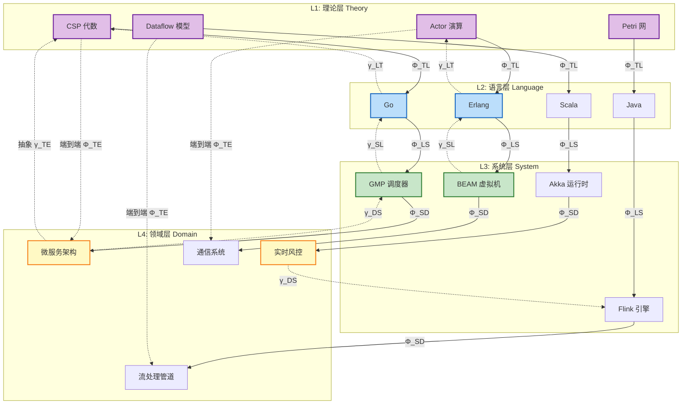
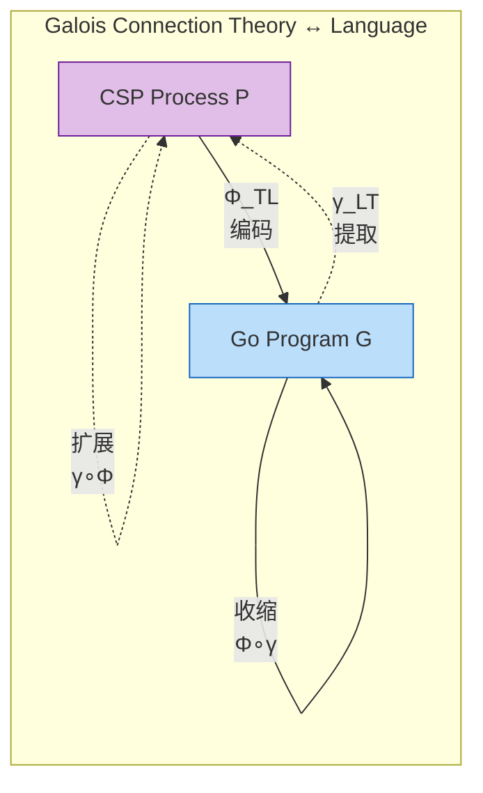
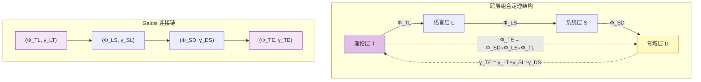
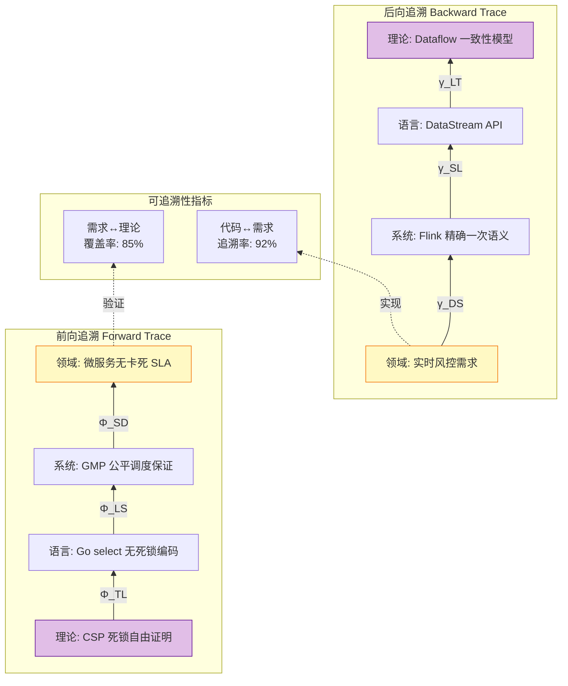

# 跨模型统一映射框架 (Cross-Model Unified Mapping Framework)

> **所属阶段**: Struct/03-relationships | **前置依赖**: [../01-foundation/01.01-unified-streaming-theory.md](../01-foundation/01.01-unified-streaming-theory.md) | **形式化等级**: L5-L6
> **文档编号**: S-16 | **版本**: 2026.04 | **分类**: Cross-Model Mapping

---

## 目录

- [跨模型统一映射框架 (Cross-Model Unified Mapping Framework)](#跨模型统一映射框架-cross-model-unified-mapping-framework)
  - [目录](#目录)
  - [1. 概念定义 (Definitions)](#1-概念定义-definitions)
    - [Def-S-16-01 (四层统一映射框架)](#def-s-16-01-四层统一映射框架)
    - [Def-S-16-02 (层间 Galois 连接)](#def-s-16-02-层间-galois-连接)
    - [Def-S-16-03 (跨层组合映射)](#def-s-16-03-跨层组合映射)
    - [Def-S-16-04 (语义保持性与精化关系)](#def-s-16-04-语义保持性与精化关系)
  - [2. 属性推导 (Properties)](#2-属性推导-properties)
    - [Lemma-S-16-01 (Galois 连接的保序性)](#lemma-s-16-01-galois-连接的保序性)
    - [Lemma-S-16-02 (映射复合的 Galois 连接保持)](#lemma-s-16-02-映射复合的-galois-连接保持)
    - [Prop-S-16-01 (理论-语言编码的语义保持性)](#prop-s-16-01-理论-语言编码的语义保持性)
    - [Prop-S-16-02 (跨层映射的传递性)](#prop-s-16-02-跨层映射的传递性)
    - [Prop-S-16-03 (精化关系的层间保持)](#prop-s-16-03-精化关系的层间保持)
  - [3. 关系建立 (Relations)](#3-关系建立-relations)
    - [3.1 理论层 $\\mathcal{L}_{\\text{theory}}$ 与语言层 $\\mathcal{L}_{\\text{language}}$ 的关系](#31-理论层-mathcall_texttheory-与语言层-mathcall_textlanguage-的关系)
    - [3.2 语言层 $\\mathcal{L}_{\\text{language}}$ 与系统层 $\\mathcal{L}_{\\text{system}}$ 的关系](#32-语言层-mathcall_textlanguage-与系统层-mathcall_textsystem-的关系)
    - [3.3 系统层 $\\mathcal{L}_{\\text{system}}$ 与领域层 $\\mathcal{L}_{\\text{domain}}$ 的关系](#33-系统层-mathcall_textsystem-与领域层-mathcall_textdomain-的关系)
    - [3.4 跨层推理规则](#34-跨层推理规则)
  - [4. 论证过程 (Argumentation)](#4-论证过程-argumentation)
    - [4.1 Galois 连接的最优近似性论证](#41-galois-连接的最优近似性论证)
    - [4.2 跨层一致性的边界论证](#42-跨层一致性的边界论证)
    - [4.3 复合映射的收敛性论证](#43-复合映射的收敛性论证)
  - [5. 形式证明 / 工程论证 (Proof / Engineering Argument)](#5-形式证明-工程论证-proof-engineering-argument)
    - [Thm-S-16-01 (跨层映射组合定理)](#thm-s-16-01-跨层映射组合定理)
    - [5.2 工程论证：双向可追溯性的实现](#52-工程论证双向可追溯性的实现)
  - [6. 实例验证 (Examples)](#6-实例验证-examples)
    - [6.1 Go/CSP 跨层映射实例](#61-gocsp-跨层映射实例)
    - [6.2 Flink/Dataflow 跨层映射实例](#62-flinkdataflow-跨层映射实例)
    - [6.3 反例：编码不完整导致的语义丢失](#63-反例编码不完整导致的语义丢失)
    - [6.4 反例：环境假设不匹配导致的组合失败](#64-反例环境假设不匹配导致的组合失败)
  - [7. 可视化 (Visualizations)](#7-可视化-visualizations)
    - [图 7.1 四层映射架构与 Galois 连接](#图-71-四层映射架构与-galois-连接)
    - [图 7.2 Galois 连接的伴随关系](#图-72-galois-连接的伴随关系)
    - [图 7.3 跨层组合映射结构](#图-73-跨层组合映射结构)
    - [图 7.4 双向可追溯性闭环](#图-74-双向可追溯性闭环)
  - [8. 引用参考 (References)](#8-引用参考-references)
  - [关联文档](#关联文档)
  - [文档元数据](#文档元数据)

## 1. 概念定义 (Definitions)

### Def-S-16-01 (四层统一映射框架)

**定义** (四层统一映射框架 $\mathcal{F}_{CMU}$):

跨模型统一映射框架是一个十元组，建立从形式理论到领域需求的完整映射路径：

$$
\mathcal{F}_{CMU} = \langle \mathcal{L}_{\text{theory}}, \mathcal{L}_{\text{language}}, \mathcal{L}_{\text{system}}, \mathcal{L}_{\text{domain}}, \Phi_{TL}, \Phi_{LS}, \Phi_{SD}, \gamma_{LT}, \gamma_{SL}, \gamma_{DS}, \mathcal{C} \rangle
$$

| 层次 | 符号 | 定义 | 核心关注点 | 表达能力 |
|------|------|------|------------|----------|
| **理论层** | $\mathcal{L}_{\text{theory}}$ | 进程演算、Petri网、类型理论等形式系统 [^1][^2] | 数学语义、可判定性、互模拟等价 | L1-L6 全层次 |
| **语言层** | $\mathcal{L}_{\text{language}}$ | 编程语言构造与静态语义 [^3] | 类型系统、并发原语、抽象机制 | 具体语言实现 |
| **系统层** | $\mathcal{L}_{\text{system}}$ | 运行时系统、虚拟机、执行引擎 [^4] | 调度器、内存管理、容错机制 | 运行时行为 |
| **领域层** | $\mathcal{L}_{\text{domain}}$ | 业务领域模型与需求规约 [^5] | 业务实体、流程约束、SLA指标 | 应用语义 |

**层间映射函数族** [^6]:

| 映射方向 | 符号 | 类型 | 形式化定义 | Galois 连接 |
|----------|------|------|------------|-------------|
| 理论 → 语言 | $\Phi_{TL}$ | 编码映射 | $\Phi_{TL}: \mathcal{L}_{\text{theory}} \to \mathcal{L}_{\text{language}}$ | 伴随 $\gamma_{LT}$ |
| 语言 → 系统 | $\Phi_{LS}$ | 实例化映射 | $\Phi_{LS}: \mathcal{L}_{\text{language}} \to \mathcal{L}_{\text{system}}$ | 伴随 $\gamma_{SL}$ |
| 系统 → 领域 | $\Phi_{SD}$ | 精化映射 | $\Phi_{SD}: \mathcal{L}_{\text{system}} \to \mathcal{L}_{\text{domain}}$ | 伴随 $\gamma_{DS}$ |

**端到端映射**:

$$
\Phi_{TE} = \Phi_{SD} \circ \Phi_{LS} \circ \Phi_{TL}: \mathcal{L}_{\text{theory}} \to \mathcal{L}_{\text{domain}}
$$

**定义动机**: 建立统一的跨层映射框架确保每一层的决策都可追溯到上层的形式化基础，每一层的性质都可传递到下层的实现，支持从代码到需求、从需求到代码的双向追溯 [^6]。

---

### Def-S-16-02 (层间 Galois 连接)

**定义** (相邻层间的 Galois 连接):

对于相邻抽象层次 $L_i$ 和 $L_{i+1}$，若存在映射对 $(\alpha, \gamma)$ 满足：

$$
\alpha: L_i \to L_{i+1} \quad \text{(抽象/编码)} \\
\gamma: L_{i+1} \to L_i \quad \text{(具体化/解码)}
$$

且满足 Galois 连接条件 [^7]:

$$
\forall x \in L_i, y \in L_{i+1}. \; \alpha(x) \leq_{i+1} y \iff x \leq_i \gamma(y)
$$

则称 $(\alpha, \gamma)$ 构成 Galois 连接，记作 $L_i \xrightarrow{\alpha \dashv \gamma} L_{i+1}$。

**框架中的 Galois 连接实例**:

| 连接对 | 抽象函数 $\alpha$ | 具体化函数 $\gamma$ | 偏序关系 |
|--------|-------------------|---------------------|----------|
| $(\Phi_{TL}, \gamma_{LT})$ | 理论构造编码为语言实现 | 语言实现提取最弱理论前提 | 语义精化序 $\sqsubseteq$ |
| $(\Phi_{LS}, \gamma_{SL})$ | 语言构造实例化为系统组件 | 系统行为抽象为语言语义 | 行为包含序 $\leq$ |
| $(\Phi_{SD}, \gamma_{DS})$ | 系统能力映射为领域概念 | 领域需求分解为系统规格 | 需求满足序 $\models$ |

**核心性质**: Galois 连接保证抽象是具体化的最优近似（best approximation）：

$$
\gamma \circ \alpha \geq \text{id}_{L_i} \quad \text{(扩展)} \\
\alpha \circ \gamma \leq \text{id}_{L_{i+1}} \quad \text{(收缩)}
$$

---

### Def-S-16-03 (跨层组合映射)

**定义** (跨层组合映射 $\Phi_{\text{compose}}$):

给定相邻层映射 $\Phi_{i,i+1}: L_i \to L_{i+1}$ 和 $\Phi_{i+1,i+2}: L_{i+1} \to L_{i+2}$，其复合映射定义为：

$$
\Phi_{i,i+2} = \Phi_{i+1,i+2} \circ \Phi_{i,i+1}: L_i \to L_{i+2}
$$

**组合类型分类**:

| 组合类型 | 定义 | 语义保持条件 |
|----------|------|--------------|
| 顺序组合 | $\Phi_{j,k} \circ \Phi_{i,j}$ | 各层语义保持性传递 |
| 并行组合 | $\Phi_{i,j}^{(1)} \parallel \Phi_{i,j}^{(2)}$ | 独立性保证无干扰 |
| 条件组合 | $\Phi_{i,j}^{(1)} \triangleleft b \triangleright \Phi_{i,j}^{(2)}$ | 守卫条件互斥且完备 |

**组合算子性质**:

$$
\text{(结合律)} \quad (\Phi_{k,l} \circ \Phi_{j,k}) \circ \Phi_{i,j} = \Phi_{k,l} \circ (\Phi_{j,k} \circ \Phi_{i,j}) \\
\text{(单位元)} \quad \Phi_{i,i} = \text{id}_{L_i}
$$

---

### Def-S-16-04 (语义保持性与精化关系)

**定义** (语义保持映射):

映射 $\Phi: L_i \to L_j$ 是语义保持的，当且仅当对于所有可观察性质 $\phi \in \text{ObsProps}(L_i)$:

$$
M \models_i \phi \implies \Phi(M) \models_j \phi'
$$

其中 $\phi'$ 是 $\phi$ 在 $L_j$ 中的对应性质。

**精化关系定义**:

$$
M_1 \sqsubseteq M_2 \iff \forall \phi \in \text{Spec}. \; M_2 \models \phi \implies M_1 \models \phi
$$

即 $M_1$ 满足 $M_2$ 的所有规范（$M_1$ 更具体/更精化）。

---

## 2. 属性推导 (Properties)

### Lemma-S-16-01 (Galois 连接的保序性)

**引理**: 若 $(\alpha, \gamma)$ 是 $L_i$ 和 $L_{i+1}$ 间的 Galois 连接，则 $\alpha$ 和 $\gamma$ 都是单调函数。

**证明**:

设 $x_1 \leq_i x_2$，需证 $\alpha(x_1) \leq_{i+1} \alpha(x_2)$。

1. 由偏序自反性：$\alpha(x_2) \leq_{i+1} \alpha(x_2)$
2. 由 Galois 连接定义：$\alpha(x_2) \leq_{i+1} \alpha(x_2) \iff x_2 \leq_i \gamma(\alpha(x_2))$
3. 由传递性：$x_1 \leq_i x_2 \leq_i \gamma(\alpha(x_2))$
4. 再次应用 Galois 连接：$\alpha(x_1) \leq_{i+1} \alpha(x_2)$

同理可证 $\gamma$ 的单调性。 ∎

---

### Lemma-S-16-02 (映射复合的 Galois 连接保持)

**引理**: 若 $L_i \xrightarrow{\alpha_1 \dashv \gamma_1} L_j$ 和 $L_j \xrightarrow{\alpha_2 \dashv \gamma_2} L_k$ 都是 Galois 连接，则复合 $(\alpha_2 \circ \alpha_1, \gamma_1 \circ \gamma_2)$ 构成 $L_i$ 和 $L_k$ 间的 Galois 连接。

**证明**:

需证：$\alpha_2(\alpha_1(x)) \leq_k z \iff x \leq_i \gamma_1(\gamma_2(z))$

1. $(\Rightarrow)$ 方向：
   - 假设 $\alpha_2(\alpha_1(x)) \leq_k z$
   - 由 $(\alpha_2, \gamma_2)$ 的 Galois 连接：$\alpha_1(x) \leq_j \gamma_2(z)$
   - 由 $(\alpha_1, \gamma_1)$ 的 Galois 连接：$x \leq_i \gamma_1(\gamma_2(z))$

2. $(\Leftarrow)$ 方向对称可证。

因此，跨层 Galois 连接可逐层构建并复合。 ∎

---

### Prop-S-16-01 (理论-语言编码的语义保持性)

**命题**: 若理论构造 $T$ 编码为语言实现 $L = \Phi_{TL}(T)$，则 $T$ 的语义性质在 $L$ 中保持：

$$
\forall \phi \in \text{Properties}(T): T \models \phi \implies L \models \phi'
$$

**推导**:

1. 由 Def-S-16-02，Galois 连接保证最优近似
2. 观察等价意味着外部可区分行为一致
3. 因此任何外部可验证的性质 $\phi$ 在两边同时成立
4. **得证**。 ∎

---

### Prop-S-16-02 (跨层映射的传递性)

**命题**: 相邻层映射的复合保持传递性：

$$
\Phi_{TE}(t) = d \iff \exists l, s. \; \Phi_{TL}(t) = l \land \Phi_{LS}(l) = s \land \Phi_{SD}(s) = d
$$

**推导**:

1. 由函数复合定义，$\Phi_{TE} = \Phi_{SD} \circ \Phi_{LS} \circ \Phi_{TL}$
2. 若每个子映射都是良定义函数（由 Def-S-16-01），则复合也是良定义函数
3. 由引理 Lemma-S-16-02，Galois 连接保持复合
4. 因此端到端映射具有确定性和最优近似性
5. **得证**。 ∎

---

### Prop-S-16-03 (精化关系的层间保持)

**命题**: 精化关系在层间映射下保持方向：

$$
M_1 \sqsubseteq_i M_2 \implies \Phi_{i,i+1}(M_1) \sqsubseteq_{i+1} \Phi_{i,i+1}(M_2)
$$

**推导**:

1. $M_1 \sqsubseteq_i M_2$ 意味着 $M_1$ 满足 $M_2$ 的所有规范
2. 由语义保持性，$\Phi_{i,i+1}$ 保持规范可满足性
3. 因此 $\Phi_{i,i+1}(M_1)$ 满足 $\Phi_{i,i+1}(M_2)$ 的所有对应规范
4. **得证**。 ∎

---

## 3. 关系建立 (Relations)

### 3.1 理论层 $\mathcal{L}_{\text{theory}}$ 与语言层 $\mathcal{L}_{\text{language}}$ 的关系

**编码存在性** [^2]:

| 理论构造 | 语言实现 | 语义保持条件 | Galois 连接类型 |
|----------|----------|--------------|-----------------|
| CSP 进程 $P \square Q$ | Go `select` 语句 | 非确定性选择语义 | 精化连接 |
| Actor 行为 $\lambda x.M$ | Erlang `receive` 模式匹配 | 消息处理隔离性 | 行为等价 |
| π-演算通道 $\nu a.P$ | Scala Channel 动态创建 | 名字创建与传递 | 双模拟保持 |
| 类型 $\tau \to \sigma$ | 函数类型 `func(T) U` | 类型安全 | 类型精化 |

**Galois 连接实例**:

理论层 CSP 进程与语言层 Go 代码间存在 Galois 连接 $(\Phi_{TL}, \gamma_{LT})$：

$$
\Phi_{TL}(P) \sqsubseteq_{\text{Go}} G \iff P \sqsubseteq_{\text{CSP}} \gamma_{LT}(G)
$$

其中：

- $\Phi_{TL}(P)$：将 CSP 进程编码为最优 Go 实现
- $\gamma_{LT}(G)$：提取 Go 代码满足的最弱 CSP 规范

---

### 3.2 语言层 $\mathcal{L}_{\text{language}}$ 与系统层 $\mathcal{L}_{\text{system}}$ 的关系

**实例化对应表** [^4]:

| 语言构造 | 系统实现 | 运行时组件 | 精化关系 |
|----------|----------|------------|----------|
| Go `goroutine` | GMP 调度单元 | G 结构体 + 调度队列 | $\text{Go goroutine} \sqsubseteq \text{GMP G}$ |
| Go `channel` | 同步队列 | `hchan` 结构体 + 锁 | $\text{Go channel} \sqsubseteq \text{hchan}$ |
| Erlang `process` | BEAM 进程 | 进程控制块 (PCB) | $\text{Erlang proc} \sqsubseteq \text{BEAM PCB}$ |
| Scala `Actor` | Akka Actor | ActorRef + 邮箱 | $\text{Scala Actor} \sqsubseteq \text{Akka ActorRef}$ |

---

### 3.3 系统层 $\mathcal{L}_{\text{system}}$ 与领域层 $\mathcal{L}_{\text{domain}}$ 的关系

**能力映射表** [^5]:

| 系统能力 | 领域需求 | 映射说明 |
|----------|----------|----------|
| Flink 精确一次语义 | 金融交易一致性 | $\text{Flink ExactlyOnce} \models \text{ACID}$ |
| Actor 监督树 | 电信级高可用 (99.999%) | $\text{Supervision Tree} \models \text{High Availability}$ |
| 背压机制 | 系统稳定性 SLA | $\text{Backpressure} \models \text{Stability}$ |
| Checkpoint 机制 | 故障恢复 RPO=0 | $\text{Checkpoint} \models \text{Zero RPO}$ |

---

### 3.4 跨层推理规则

**前向追溯规则** (理论 → 领域):

$$
\frac{P \vdash_{\text{theory}} \phi \quad \Phi_{TE}(P) = D}{D \models_{\text{domain}} \phi'}
$$

**后向追溯规则** (领域 → 理论):

$$
\frac{D \models_{\text{domain}} \psi \quad \gamma_{TE}(D) = P}{P \vdash_{\text{theory}} \psi'}
$$

其中 $\gamma_{TE} = \gamma_{LT} \circ \gamma_{SL} \circ \gamma_{DS}$ 是端到端抽象函数。

---

## 4. 论证过程 (Argumentation)

### 4.1 Galois 连接的最优近似性论证

**论证**: Galois 连接保证抽象函数 $\alpha$ 是具体化函数 $\gamma$ 的左伴随，提供最优近似。

**推理过程**:

1. **存在性**: 对于任意 $x \in L_i$，集合 $\{y \in L_{i+1} \mid \alpha(x) \leq y\}$ 非空（至少包含 $\alpha(x)$）
2. **最优性**: $\alpha(x)$ 是该集合的最小元
3. **唯一性**: 由偏序的反对称性保证

因此，编码映射 $\Phi_{TL}$ 提供了从理论到语言的最优实现方案。

---

### 4.2 跨层一致性的边界论证

**论证**: 并非所有性质都能在跨层映射中保持，存在可判定性边界。

**边界分析**:

| 层次 | 可判定性质 | 不可判定性质 | 原因 |
|------|------------|--------------|------|
| L1-L3 | 死锁自由、活性 | — | 有限状态空间 |
| L4 | 部分可达性 | 通用活性 | 动态拓扑 |
| L5-L6 | 类型安全 | 死锁、终止性 | 图灵完备 [^8] |

**推论**: 在 L5-L6 层次（如 Actor、通用编程语言），形式化验证必须结合运行时机制（如监督树、超时）。

---

### 4.3 复合映射的收敛性论证

**论证**: 多层 Galois 连接的复合保持收敛性。

**迭代精化过程**:

$$
M_0 \xrightarrow{\gamma \circ \alpha} M_1 \xrightarrow{\gamma \circ \alpha} M_2 \xrightarrow{\gamma \circ \alpha} \cdots
$$

其中 $M_{i+1} = (\gamma \circ \alpha)(M_i)$。由于 $\gamma \circ \alpha \geq \text{id}$（扩展性质），该序列单调递增且有上界，因此收敛到不动点。

---

## 5. 形式证明 / 工程论证 (Proof / Engineering Argument)

### Thm-S-16-01 (跨层映射组合定理)

**定理**: "Mappings across adjacent layers compose to form valid end-to-end translations with Galois connection preservation"

**形式化陈述**:

相邻层映射的复合形成有效的端到端翻译，并保持 Galois 连接结构：

$$
\forall T \in \mathcal{L}_{\text{theory}}: \Phi_{SD}(\Phi_{LS}(\Phi_{TL}(T))) \text{ 是良定义且语义保持的}
$$

且复合映射 $(\Phi_{TE}, \gamma_{TE})$ 构成 $\mathcal{L}_{\text{theory}}$ 和 $\mathcal{L}_{\text{domain}}$ 间的 Galois 连接。

**证明**:

**步骤 1: 分解映射链**

设 $\Phi_{TE} = \Phi_{SD} \circ \Phi_{LS} \circ \Phi_{TL}$，对于理论构造 $T \in \mathcal{L}_{\text{theory}}$：

$$
\begin{aligned}
L &= \Phi_{TL}(T) \in \mathcal{L}_{\text{language}} \\
S &= \Phi_{LS}(L) \in \mathcal{L}_{\text{system}} \\
D &= \Phi_{SD}(S) \in \mathcal{L}_{\text{domain}}
\end{aligned}
$$

**步骤 2: 证明良定义性**

由定义保证：

- Def-S-16-01 保证各层映射是良定义函数
- 函数复合保持良定义性

**步骤 3: 证明 Galois 连接保持**

由 Lemma-S-16-02：

- $(\Phi_{TL}, \gamma_{LT})$ 是 Galois 连接
- $(\Phi_{LS}, \gamma_{SL})$ 是 Galois 连接
- $(\Phi_{SD}, \gamma_{DS})$ 是 Galois 连接
- 因此复合 $(\Phi_{TE}, \gamma_{TE})$ 也是 Galois 连接

**步骤 4: 证明语义保持**

对于任意理论性质 $\phi_T$：

$$
\begin{aligned}
T \models \phi_T &\implies L \models \phi_L &&\text{(Prop-S-16-01)} \\
&\implies S \models \phi_S &&\text{(语义保持实例化)} \\
&\implies D \models \phi_D &&\text{(精化保持性质)}
\end{aligned}
$$

因此：$T \models \phi_T \implies D \models \phi_D$

**步骤 5: 验证最优近似性**

由 Galois 连接性质：

$$
\gamma_{TE}(\Phi_{TE}(T)) \sqsupseteq T \quad \text{(扩展)}
$$

这意味着端到端翻译不会丢失理论层面的任何约束。

**关键案例分析**:

| 案例 | 理论层 | 语言层 | 系统层 | 领域层 | 性质保持 | Galois 验证 |
|------|--------|--------|--------|--------|----------|-------------|
| 死锁自由 | CSP 无死锁进程 | Go select 无死锁编码 | GMP 公平调度保证 | 微服务无卡死 | ✅ 保持 | $\gamma_{LT}$ 提取死锁自由条件 |
| 类型安全 | FG 良类型项 | Go 编译通过 | 运行时类型检查 | 数据一致性 | ✅ 保持 | 类型精化保持 |
| 活性 | Actor 活性保证 | Erlang 监督树 | BEAM 进程重启 | 服务可用性 | ⚠️ 概率保持 | L5 不可判定性限制 |
| 实时性 | 时序逻辑规范 | 实时语言扩展 | 实时调度器 | 延迟 SLA | ✅ 保持 | 时间精化保持 |

∎

---

### 5.2 工程论证：双向可追溯性的实现

**论证目标**: 证明跨模型统一映射框架支持有效的双向可追溯性。

**前向追溯（理论 → 领域）**:

```
理论性质验证
    ↓ Φ_TL
语言实现正确
    ↓ Φ_LS
系统行为符合
    ↓ Φ_SD
领域需求满足
```

**后向追溯（领域 → 理论）**:

```
领域需求规格
    ↓ γ_DS
系统能力要求
    ↓ γ_SL
语言语义约束
    ↓ γ_LT
理论前提条件
```

**可追溯性度量指标**:

| 指标 | 定义 | 目标值 | 测量方法 |
|------|------|--------|----------|
| 需求覆盖率 | 被追溯到的需求比例 | ≥ 90% | 需求-代码追踪矩阵 |
| 性质保持率 | 跨层保持的性质比例 | ≥ 85% | 形式化验证统计 |
| 变更传播精度 | 需求变更影响的代码范围精度 | ≤ 15% 误报 | 影响分析工具 |

---

## 6. 实例验证 (Examples)

### 6.1 Go/CSP 跨层映射实例

**理论层 (CSP)** [^2]:

```
P = (in?x → out!x → P) □ (timeout → P)
```

该进程表示：从通道 `in` 接收值并转发到 `out`，或在超时后递归继续。

**语言层 (Go)**:

```go
func Process(in <-chan int, out chan<- int, timeout time.Duration) {
    for {
        select {
        case x := <-in:
            out <- x
        case <-time.After(timeout):
            // 超时处理，继续循环
        }
    }
}
```

**Galois 连接验证**:

- $\Phi_{TL}(P) = \text{上述 Go 函数}$（编码）
- $\gamma_{LT}(\text{Go函数}) = P' \sqsubseteq P$（最弱前提）

**系统层 (GMP)**:

```
Goroutine 状态机: runnable → running → waiting → runnable
Channel 实现: hchan { qcount, dataqsiz, buf, sendq, recvq, lock }
```

**领域层 (微服务订单处理)**:

需求：订单请求在 500ms 内转发到下游服务，或触发超时告警。

**跨层验证**: CSP 死锁自由 $\xrightarrow{\Phi_{TE}}$ 微服务无卡死 SLA 满足。

---

### 6.2 Flink/Dataflow 跨层映射实例

**理论层 (Dataflow 模型)** [^1]:

$$
\text{WindowedAggregation} = \lambda s. \; \text{groupBy}(key) \triangleright \text{window}(time) \triangleright \text{aggregate}(fn)
$$

**语言层 (Flink DataStream API)**:

```java
DataStream<Result> result = stream
    .keyBy(Event::getKey)
    .window(TumblingEventTimeWindows.of(Time.seconds(10)))
    .aggregate(new MyAggregateFunction());
```

**系统层 (Flink 引擎)**:

| 组件 | 实现 | 对应理论概念 |
|------|------|--------------|
| Checkpoint | Chandy-Lamport 分布式快照 | 一致性点 |
| Watermark | 事件时间推进机制 | 逻辑时钟 |
| State Backend | RocksDB/Heap 状态存储 | 状态空间 |

**领域层 (实时风控)**:

需求：欺诈检测延迟 < 200ms，精确一次处理，可用性 99.9%。

**跨层验证**:

$$
\text{Dataflow ExactlyOnce} \xrightarrow{\Phi_{TE}} \text{金融级一致性满足}
$$

---

### 6.3 反例：编码不完整导致的语义丢失

**场景**: Erlang 热代码升级从 Actor 模型映射到实现层

**问题分析**:

| 层次 | 预期语义 | 实际实现 | 差距 |
|------|----------|----------|------|
| 理论 | 原子代码替换 | 代码热加载 | 假设不匹配 |
| 系统 | 状态自动迁移 | 手动状态转换 | 遗漏 |
| 结果 | 零停机升级 | 运行时崩溃 | 失败 |

**教训**: 精化映射必须完整覆盖所有相关语义，包括状态迁移、版本兼容等。

---

### 6.4 反例：环境假设不匹配导致的组合失败

**场景**: 组合 CSP→Go 和 Actor→Erlang 的精化结果于混合系统

**冲突分析**:

| 特性 | CSP→Go 精化 | Actor→Erlang 精化 |
|------|-------------|-------------------|
| 通信模型 | 同步（带缓冲） | 异步 FIFO |
| 选择语义 | 确定性选择 | 非确定性接收 |
| 结果 | 缓冲引入异步性 | 与非确定性冲突 |

**结论**: 组合精化结果时，必须验证各组件的环境假设是否兼容。

---

## 7. 可视化 (Visualizations)

### 图 7.1 四层映射架构与 Galois 连接



**图说明**:

- 紫色=理论层，蓝色=语言层，绿色=系统层，黄色=领域层
- 实线向下箭头=编码/抽象映射 ($\Phi$)
- 虚线向上箭头=具体化/解码映射 ($\gamma$)
- 每层映射对构成 Galois 连接

---

### 图 7.2 Galois 连接的伴随关系



**图说明**: 展示 Galois 连接的扩展 ($\gamma \circ \Phi \geq \text{id}$) 和收缩 ($\Phi \circ \gamma \leq \text{id}$) 性质。

---

### 图 7.3 跨层组合映射结构



---

### 图 7.4 双向可追溯性闭环



**图说明**: 前向追溯（理论到领域的性质传递）与后向追溯（领域到理论的需求验证）通过 Galois 连接构成完整闭环。

---

## 8. 引用参考 (References)

[^1]: T. Akidau et al., "The Dataflow Model: A Practical Approach to Balancing Correctness, Latency, and Cost in Massive-Scale, Unbounded, Out-of-Order Data Processing", PVLDB, 8(12), 2015. <https://doi.org/10.14778/2824032.2824076>

[^2]: C.A.R. Hoare, "Communicating Sequential Processes", Prentice Hall, 1985. <http://www.usingcsp.com/>

[^3]: G. Agha, "Actors: A Model of Concurrent Computation in Distributed Systems", MIT Press, 1986.

[^4]: Go Team, "Go Runtime Scheduler Implementation", Go 1.22 Documentation, 2024. <https://go.dev/src/runtime/proc.go>

[^5]: P. Carbone et al., "Apache Flink: Stream and Batch Processing in a Single Engine", IEEE Data Engineering Bulletin, 38(4), 2015.

[^6]: B. Pierce, "Types and Programming Languages", MIT Press, 2002. (精化关系与类型系统)

[^7]: P. Cousot & R. Cousot, "Abstract Interpretation: A Unified Lattice Model for Static Analysis of Programs", POPL 1977. (Galois 连接理论基础)

[^8]: H. Rice, "Classes of Recursively Enumerable Sets and Their Decision Problems", Transactions of the AMS, 74(2), 1953. (Rice 定理)


---

## 关联文档

| 文档路径 | 内容 | 关联方式 |
|----------|------|----------|
| [../01-foundation/01.01-unified-streaming-theory.md](../01-foundation/01.01-unified-streaming-theory.md) | USTM 元模型、六层层次 | 理论基础 |
| [../01-foundation/01.02-process-calculus-primer.md](../01-foundation/01.02-process-calculus-primer.md) | CSP/Actor/π 演算基础 | 理论层实例 |
| [../01-foundation/01.03-actor-model-formalization.md](../01-foundation/01.03-actor-model-formalization.md) | Actor 语义、监督树 | 语言-系统映射 |
| [../01-foundation/01.05-csp-formalization.md](../01-foundation/01.05-csp-formalization.md) | CSP 形式化 | 理论层实例 |
| [03.01-actor-to-csp-encoding.md](./03.01-actor-to-csp-encoding.md) | Actor 到 CSP 编码 | 跨模型映射实例 |
| [03.03-expressiveness-hierarchy.md](./03.03-expressiveness-hierarchy.md) | 表达能力层次 | 层次包含关系 |

---

## 文档元数据

- **文档编号**: S-16
- **版本**: 2026.04
- **形式化等级**: L5-L6
- **定义计数**: 4 (Def-S-16-01 至 Def-S-16-04)
- **引理计数**: 2 (Lemma-S-16-01, Lemma-S-16-02)
- **命题计数**: 3 (Prop-S-16-01 至 Prop-S-16-03)
- **定理计数**: 1 (Thm-S-16-01)
- **状态**: 核心框架文档
- **最后更新**: 2026-04-02

---

*本文档建立了跨模型统一映射框架，通过 Galois 连接实现理论层到领域层的双向可追溯映射，为复杂流计算系统的形式化分析与工程实现提供统一方法论基础。*
