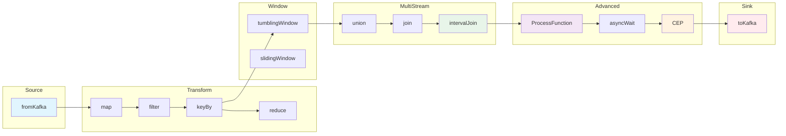

# 流处理算子全景分类目录

> **所属阶段**: Struct/03-relationships | **前置依赖**: [01.01-stream-processing-model.md](../01-foundation/01.01-unified-streaming-theory.md), [02.03-state-semantics.md](../02-properties/02.06-stream-operator-algebra.md) | **形式化等级**: L4 | **最后更新**: 2026-04

---

## 1. 概念定义 (Definitions)

### Def-O-01-01 流算子（Stream Operator）

设事件类型为 $\mathcal{E}$，时间域为 $\mathbb{T}$。一个**流算子**（Stream Operator）是一个部分函数

$$
\mathcal{O} : \mathcal{S}^m \times \mathcal{H} \times \mathbb{T}^* \rightharpoonup \mathcal{S}^n
$$

其中 $m \geq 0$ 为输入流数量，$n \geq 0$ 为输出流数量，$\mathcal{H}$ 为算子本地状态空间（可为空），$\mathbb{T}^*$ 为时间语义参数。流算子将一组输入事件流映射为一组输出事件流，其计算过程可能依赖内部状态与时间上下文。当 $m = 0$ 时称为**源算子**（Source Operator），当 $n = 0$ 时称为**汇算子**（Sink Operator）。[^1][^2]

**直观解释**: 流算子是流处理系统的基本计算单元，类比于函数式编程中的高阶函数，但增加了状态和时间维度。每个算子消耗上游流的数据元素，执行特定计算逻辑，并向下游产生新的数据流。

---

### Def-O-01-02 统一四维分类法

流算子的统一分类由四元组 $\mathcal{C} = (\kappa, \sigma, \tau, \chi)$ 确定：

| 维度 | 符号 | 取值域 | 语义 |
|------|------|--------|------|
| 输入流数量 | $\kappa$ | $\{0, 1, 2, +\}$ | 0=Source, 1=Unary, 2=Binary, +=N-ary |
| 状态依赖 | $\sigma$ | $\{\text{stateless}, \text{keyed}, \text{global}\}$ | 无状态 / 按键分区状态 / 全局状态 |
| 时间语义 | $\tau$ | $\{\text{none}, \text{processing}, \text{event}, \text{ingestion}\}$ | 无时间 / 处理时间 / 事件时间 / 摄入时间 |
| 计算复杂度 | $\chi$ | $\{\text{O(1)}, \text{O(N)}, \text{O(W)}, \text{O(∞)}\}$ | 常数 / 全流 / 窗口 / 模式匹配 |

**Def-O-01-02** 确立了流算子分类的四个正交维度，任意算子均可被唯一映射至四维空间中的一个坐标点（或区域）。该分类法的核心思想源于 Dataflow Programming 模型中对算子语义的形式化刻画[^3]，并在 Flink、Beam 等系统的实现中得到了工程验证。[^1][^4]

---

### Def-O-01-03 形式化签名

算子 $\mathcal{O}$ 的**形式化签名**定义为：

$$
\mathcal{O} : \underbrace{\mathcal{S} \times \cdots \times \mathcal{S}}_{m} \xrightarrow[\text{state}=\mathcal{H}]{\text{time}=\tau} \mathcal{S}'
$$

其中箭头上的标注表示状态类型 $\mathcal{H}$ 与时间语义 $\tau$。例如 `map` 的签名为：

$$
\text{map} : \mathcal{S} \xrightarrow[\text{state}=\emptyset]{\text{time}=\text{none}} \mathcal{S}' \quad (f : \mathcal{E} \to \mathcal{E}')
$$

而 `reduce` 的签名为：

$$
\text{reduce} : \mathcal{S}_{\text{keyed}} \xrightarrow[\text{state}=\text{ValueState}<\mathcal{E}>]{\text{time}=\text{event}} \mathcal{S}'
$$

---

### Def-O-01-04 状态类型体系

流算子所维护的状态按作用域分为三类：

1. **无状态（Stateless）**: $\mathcal{H} = \emptyset$，算子仅依赖当前输入元素，不维护任何跨元素的状态。典型代表：`map`、`filter`、`flatMap`。

2. **按键分区状态（Keyed State）**: $\mathcal{H} = \bigcup_{k \in \mathcal{K}} \mathcal{H}_k$，其中 $\mathcal{K}$ 为键空间。每个键 $k$ 拥有独立的本地状态 $\mathcal{H}_k$，不同键之间的状态互不干扰。典型代表：`reduce`、`aggregate`、`KeyedProcessFunction`。[^1]

3. **全局状态（Global State）**: $\mathcal{H}$ 为整个算子实例共享的状态空间，可被所有并行实例访问（通常通过广播机制或全局锁实现）。典型代表：`BroadcastProcessFunction` 中的广播状态、`keyBy` 前的全局窗口聚合。

---

### Def-O-01-05 时间语义要求

算子对时间语义的要求定义了其在分布式环境下处理乱序数据的能力：

- **无要求（none）**: 算子不依赖时间戳，输出顺序完全由处理顺序决定。如 `map`、`filter`。
- **处理时间（processing time）**: 算子使用算子实例所在机器的本地时钟，低延迟但可能受时钟漂移影响。如 `processing-time tumbling window`。
- **事件时间（event time）**: 算子使用数据自身携带的时间戳，结合 Watermark 机制处理乱序。如 `event-time window join`、`intervalJoin`。[^1]
- **摄入时间（ingestion time）**: 算子使用数据进入系统时由 Source 注入的时间戳，介于前两者之间。如早期 Flink 默认模式（Flink 1.12 后已废弃）。

---

### Def-O-01-06 并行性语义

算子的并行性 $P(\mathcal{O})$ 描述其可扩展性特征：

- **完全可并行（embarrassingly parallel）**: $P(\mathcal{O}) = P_{\max}$，算子可在任意数量并行实例间无协调地扩展。如 `map`、`filter`。
- **按键可并行（key-partitioned parallel）**: $P(\mathcal{O}) = |\mathcal{K}|$ 的有效子集，同一键的所有事件必须路由到同一实例。如 `reduce`、`aggregate`。
- **单实例串行（single-instance）**: $P(\mathcal{O}) = 1$，算子强制在单一实例上执行。如 `windowAll`。
- **自定义并行（custom-partitioned）**: $P(\mathcal{O})$ 由用户自定义分区器决定。如 `partitionCustom`。

---

### Def-O-01-07 算子复合与算子代数

设 $\mathcal{O}_1, \mathcal{O}_2$ 为两个流算子，定义**算子复合**（Operator Composition）为：

$$
(\mathcal{O}_2 \circ \mathcal{O}_1)(S) = \mathcal{O}_2(\mathcal{O}_1(S))
$$

要求 $\mathcal{O}_1$ 的输出流类型与 $\mathcal{O}_2$ 的输入流类型兼容。所有流算子在复合运算下构成一个**部分幺半群**（Partial Monoid），其中 `identity` 算子为单位元。该代数结构为流水线优化（算子链融合）提供了理论基础。[^3][^5]

---

### Def-O-01-08 窗口算子的一般形式

窗口算子 $\mathcal{W}$ 将无界流 $\mathcal{S}$ 切分为有界子流（窗口）并施加聚合函数 $\mathcal{A}$：

$$
\mathcal{W}(\mathcal{S}, \mathcal{G}, \mathcal{A}) = \{ \mathcal{A}(\{ e \in \mathcal{S} \mid e \in w \}) \mid w \in \mathcal{G} \}
$$

其中 $\mathcal{G}$ 为窗口分配器（Window Assigner），将每个事件 $e$ 映射到一组窗口 $w$。按分配策略分为：

- **滚动窗口（Tumbling）**: $\mathcal{G}_T(e) = \{ w_k \mid t_e \in [k\Delta, (k+1)\Delta) \}$
- **滑动窗口（Sliding）**: $\mathcal{G}_S(e) = \{ w_k \mid t_e \in [k\Delta, k\Delta + \Delta_s) \}$
- **会话窗口（Session）**: $\mathcal{G}_\Psi(e) = \{ w \mid t_e \in w \land \text{gap}(w) \leq \psi \}$
- **计数窗口（Count）**: $\mathcal{G}_C(e) = \{ w_k \mid \text{count}(e \in w_k) \leq c \}$
- **全局窗口（Global）**: $\mathcal{G}_G(e) = \{ w_\infty \}$

[^1][^4]

---

## 2. 属性推导 (Properties)

### Lemma-O-01-01 无状态算子的幂等性

设 $\mathcal{O}$ 为无状态算子（$\sigma = \text{stateless}$），则对任意输入流 $S$ 的任意子序列 $S' \subseteq S$，有：

$$
\mathcal{O}(S') \subseteq \mathcal{O}(S)
$$

且 $\mathcal{O}$ 满足**幂等复合**：$\mathcal{O} \circ \mathcal{O} = \mathcal{O}$ 当且仅当 $\mathcal{O}$ 的底层函数 $f$ 满足 $f(f(x)) = f(x)$。

**证明**: 由 Def-O-01-04，无状态算子的输出仅依赖于当前输入元素。因此对子序列 $S'$ 中的每个元素 $e$，$\mathcal{O}(e)$ 的结果独立于 $S' \setminus \{e\}$ 的存在，故 $\mathcal{O}(S')$ 中每个输出元素都必然出现在 $\mathcal{O}(S)$ 中。$\square$

---

### Lemma-O-01-02 按键状态算子的局部性

设 $\mathcal{O}$ 为按键分区状态算子，键空间为 $\mathcal{K}$。对任意两个不同键 $k_1 \neq k_2$，其对应的状态更新满足：

$$
\mathcal{H}_{k_1}^{(t+1)} \perp \mathcal{H}_{k_2}^{(t+1)}
$$

即键 $k_1$ 的状态演化与键 $k_2$ 的状态演化在统计意义上独立（实际实现中为物理隔离）。

**证明**: 由 Def-O-01-04，`keyBy` 算子通过一致性哈希将键 $k$ 路由到固定并行实例。每个实例仅维护分配给它的键的状态子集。根据 Flink 的 Keyed State 实现，状态后端（RocksDB/Heap）为每个键组（Key Group）维护独立的命名空间，不存在跨键的状态共享路径。[^1] $\square$

---

### Lemma-O-01-03 窗口算子的单调性与水印兼容性

设 $\mathcal{W}$ 为基于事件时间的窗口算子，Watermark 策略为 $\omega(t)$。若聚合函数 $\mathcal{A}$ 满足单调性（如 `sum`、`count`、`max`），则窗口结果满足：

$$
\forall w : \omega(t) > \text{end}(w) \implies \mathcal{W}(\mathcal{S}, w) = \text{final}
$$

即当 Watermark 越过窗口结束边界后，该窗口的输出不再变化。

**证明**: Flink 的事件时间处理机制保证 Watermark $w(t)$ 是"所有后续事件时间戳不超过 $t$"的断言。当 $w(t) > \text{end}(w)$ 时，窗口 $w$ 不可能再收到新事件，因此聚合结果收敛至最终值。[^1][^4] $\square$

---

### Prop-O-01-01 四维分类法的完备性

对于任意流算子 $\mathcal{O}$，存在唯一的四维坐标 $(\kappa, \sigma, \tau, \chi) \in \mathcal{C}$ 使得 $\mathcal{O}$ 的分类属性完全被确定。

**论证**: 四个维度的定义域均为互斥且完备的集合：

- $\kappa$ 覆盖所有可能的输入元数（$0, 1, 2, \geq 3$）；
- $\sigma$ 按状态作用域枚举了所有实现方案（无状态 / 按键 / 全局）；
- $\tau$ 覆盖了流处理系统的三种时间语义（以及无时间要求）；
- $\chi$ 按算法复杂度刻画了算子的计算特征。

任意算子必属于且仅属于每个维度的一个类别，因此分类坐标唯一确定。$\square$

---

## 3. 关系建立 (Relations)

### 3.1 算子与API的映射关系

本节建立 5 套主流流处理 API 的算子对齐关系。映射基于语义等价性（semantic equivalence），即两个API中的算子在给定相同输入时产生相同输出（在允许的实现差异范围内）。

**API体系**：

1. **Flink DataStream API** (Java/Scala/Python) — 命令式流处理API[^1]
2. **Flink Table API / SQL** — 声明式关系型流SQL[^1]
3. **Apache Beam PTransform** — 统一批流编程模型[^4]
4. **Spark Structured Streaming** — 微批/连续处理模式[^6]
5. **ksqlDB** — Kafka原生流SQL引擎[^7]

---

### 3.2 Source 算子对照（$\kappa = 0$）

| 算子 | Flink DataStream | Flink Table/SQL | Beam | Spark SS | ksqlDB |
|------|------------------|-----------------|------|----------|--------|
| **fromKafka** | `KafkaSource.<T>builder().build()` | `CREATE TABLE ... WITH ('connector'='kafka')` | `KafkaIO.read()` | `readStream.format("kafka")` | `CREATE STREAM ... WITH (kafka_topic='...')` |
| **fromSocket** | `env.socketTextStream(host, port)` | — | — | `readStream.format("socket")` | — |
| **fromCollection** | `env.fromCollection(List)` | `VALUES (...)` | `Create.of(List)` | `spark.createDataset(List)` | — |
| **readFile** | `FileSource.forRecordStreamFormat(...)` | `CREATE TABLE ... WITH ('connector'='filesystem')` | `TextIO.read()` | `readStream.format("csv")` | `CREATE STREAM ... WITH (kafka_topic='...')` + Connector |
| **generateSequence** | `env.fromSequence(from, to)` | `GENERATE_SERIES` | `GenerateSequence.from(from)` | `spark.range(...)` | — |

**形式化签名**:

```
fromKafka   : ∅ → S<K,V>        state=∅          time=event/ingestion   χ=O(1)
fromSocket  : ∅ → S<String>     state=∅          time=processing        χ=O(1)
fromCollection: ∅ → S<T>        state=∅          time=none              χ=O(1)
readFile    : ∅ → S<Record>     state=offset     time=event/ingestion   χ=O(1)
generateSequence: ∅ → S<Long>   state=∅          time=none              χ=O(1)
```

**状态类型**: Source 算子通常无本地计算状态，但可能维护可恢复的分区偏移量（如 Kafka 的 offset、文件的读取进度），这些偏移量作为 Checkpoint 的一部分被持久化。[^1][^4]

**并行性**: `fromKafka` 的并行性等于 Kafka Topic 的分区数；`fromCollection` 可由用户指定；`readFile` 默认按文件块并行。

---

### 3.3 单输入无状态变换（$\kappa = 1, \sigma = \text{stateless}$）

| 算子 | Flink DataStream | Flink Table/SQL | Beam | Spark SS | ksqlDB |
|------|------------------|-----------------|------|----------|--------|
| **map** | `.map(MapFunction)` | `SELECT expr` | `MapElements.into(...)` | `map(expr)` | `SELECT expression` |
| **filter** | `.filter(FilterFunction)` | `WHERE predicate` | `Filter.by(...)` | `filter(predicate)` | `WHERE predicate` |
| **flatMap** | `.flatMap(FlatMapFunction)` | 需用 UDTF | `FlatMapElements.into(...)` | `flatMap(func)` | `EXPLODE(array_col)` |
| **mapPartition** | `.mapPartition(MapPartitionFunction)` | — | `ParDo.of(DoFn)` | `mapPartitions(func)` | — |

**形式化签名**:

```
map         : S<A> → S<B>       state=∅          time=none              χ=O(1)   P=embarrassingly parallel
filter      : S<A> → S<A>       state=∅          time=none              χ=O(1)   P=embarrassingly parallel
flatMap     : S<A> → S<B>       state=∅          time=none              χ=O(1)   P=embarrassingly parallel
mapPartition: S<A> → S<B>       state=∅          time=none              χ=O(N/p) P=partition-local
```

**典型用法**:

- `map`: 字段转换、类型转换、格式解析。例：将 JSON 字符串解析为结构化对象。
- `filter`: 数据清洗、异常过滤。例：过滤掉 sensorValue < 0 的异常读数。
- `flatMap`: 一拆多、嵌套结构展开。例：将一行 CSV 按逗号拆分并展开为多条记录。
- `mapPartition`: 批量初始化资源（如数据库连接），在分区粒度上执行批处理优化。

---

### 3.4 分区与物理布局（$\kappa = 1, \sigma \in \{\text{stateless}, \text{keyed}\}$）

分区算子不修改数据语义，但改变物理布局，是后续有状态算子的前置条件。

| 算子 | Flink DataStream | Flink Table/SQL | Beam | Spark SS | ksqlDB |
|------|------------------|-----------------|------|----------|--------|
| **keyBy** | `.keyBy(KeySelector)` | `GROUP BY key` / `DISTRIBUTE BY` | `GroupByKey` | — (隐式于 `groupBy`) | `PARTITION BY` |
| **shuffle** | `.shuffle()` | — | — | `repartition()` | — |
| **rebalance** | `.rebalance()` | — | — | — | — |
| **rescale** | `.rescale()` | — | — | — | — |
| **forward** | `.forward()` (默认) | — | — | — | — |
| **global** | `.global()` | `GLOBAL` 聚合 | — | — | — |
| **broadcast** | `.broadcast()` | — | — | `broadcast` hint | — |
| **partitionCustom** | `.partitionCustom(Partitioner, keySelector)` | — | `Partition` transform | — | — |

**形式化签名**:

```
keyBy           : S<A> → S_keyed<A>   state=∅    time=none    χ=O(1)   P=key-partitioned
shuffle         : S<A> → S<A>         state=∅    time=none    χ=O(1)   P=full redistribution
rebalance       : S<A> → S<A>         state=∅    time=none    χ=O(1)   P=round-robin
rescale         : S<A> → S<A>         state=∅    time=none    χ=O(1)   P=sub-group round-robin
forward         : S<A> → S<A>         state=∅    time=none    χ=O(1)   P=same task chain
global          : S<A> → S<A>         state=∅    time=none    χ=O(1)   P=single instance
broadcast       : S<A> → S<A>         state=∅    time=none    χ=O(1)   P=all instances
partitionCustom : S<A> → S<A>         state=∅    time=none    χ=O(1)   P=user-defined
```

**典型用法**:

- `keyBy`: 将流按键分区，为后续 `reduce`、`aggregate`、`window` 做准备。例：`keyBy(event -> event.userId)`。
- `rebalance`: 在数据倾斜场景下重新均匀分配负载，避免某些并行实例过载。
- `broadcast`: 将小表/规则集广播到所有实例，用于后续的 `BroadcastProcessFunction` 或维表关联。
- `global`: 强制将所有数据路由到单一实例，通常用于调试或全局排序的最后阶段。

---

### 3.5 分组聚合算子（$\kappa = 1, \sigma = \text{keyed}$）

| 算子 | Flink DataStream | Flink Table/SQL | Beam | Spark SS | ksqlDB |
|------|------------------|-----------------|------|----------|--------|
| **reduce** | `.reduce(ReduceFunction)` | — | `Combine.globally()` / `perKey()` | `reduceGroups(func)` | — |
| **aggregate** | `.aggregate(AggregateFunction)` | `GROUP BY ... AGG_FUNC` | `Mean.perKey()` 等 | `agg(expr)` | `GROUP BY ... AGG_FUNC` |
| **fold** | `.fold(seed, FoldFunction)` (deprecated) | — | — | — | — |
| **min** | `.min(fieldIndex)` | `MIN(col)` | — | `min(col)` | `MIN(col)` |
| **minBy** | `.minBy(fieldIndex)` | `MIN_BY(col, other)` | — | — | — |
| **max** | `.max(fieldIndex)` | `MAX(col)` | — | `max(col)` | `MAX(col)` |
| **maxBy** | `.maxBy(fieldIndex)` | `MAX_BY(col, other)` | — | — | — |
| **sum** | `.sum(fieldIndex)` | `SUM(col)` | — | `sum(col)` | `SUM(col)` |

**形式化签名**:

```
reduce      : S_keyed<A> → S<A>     state=ValueState<A>   time=event/processing   χ=O(1)    P=key-partitioned
aggregate   : S_keyed<A> → S<ACC>   state=Accumulator     time=event/processing   χ=O(1)    P=key-partitioned
fold        : S_keyed<A> → S<ACC>   state=Accumulator     time=event/processing   χ=O(1)    P=key-partitioned
min/max     : S_keyed<A> → S<A>     state=ValueState<A>   time=event/processing   χ=O(1)    P=key-partitioned
sum         : S_keyed<A> → S<Numeric> state=ValueState<Numeric> time=event/processing χ=O(1)  P=key-partitioned
```

**典型用法**:

- `reduce`: 实现自定义的增量聚合逻辑。例：合并两个部分聚合结果。
- `aggregate`: 通用聚合框架，支持输入类型、累加器类型、输出类型各不相同。例：计算平均值的 `AverageAggregate`。
- `minBy` / `maxBy`: 返回聚合字段最值对应的完整记录（而非仅最值字段）。例：获取每个传感器历史最高温度时的完整读数。

---

### 3.6 多流算子（$\kappa \in \{2, +\}$）

| 算子 | Flink DataStream | Flink Table/SQL | Beam | Spark SS | ksqlDB |
|------|------------------|-----------------|------|----------|--------|
| **union** | `.union(otherStream)` | `UNION ALL` | `Flatten.iterables()` | `union(otherDF)` | — |
| **connect** | `.connect(otherStream)` | — | — | — | — |
| **join** | `.join(otherStream).where().equalTo().window()` | `SELECT ... FROM A JOIN B ON ...` | `CoGroupByKey` + `Join` | `join(otherDF, expr)` | `SELECT ... FROM A JOIN B ON ...` |
| **coGroup** | `.coGroup(otherStream).where().equalTo().window()` | — | `CoGroupByKey` | — | — |
| **intervalJoin** | `.intervalJoin(otherKeyedStream).between()` | `SELECT ... FROM A, B WHERE A.ts BETWEEN B.ts - δ AND B.ts + δ` | — | — | — |
| **temporalJoin** | — | `FOR SYSTEM_TIME AS OF` | — | — | — |
| **lookupJoin** | — | `LEFT JOIN LookupTable FOR SYSTEM_TIME AS OF` | — | — | — |

**形式化签名**:

```
union         : S<A> × S<A> → S<A>              state=∅          time=none              χ=O(1)     P=embarrassingly parallel
connect       : S<A> × S<B> → S_connected<A,B> state=∅          time=none              χ=O(1)     P=co-located
join          : S_keyed<A> × S_keyed<B> → S<C> state=WindowState time=event/processing  χ=O(W)     P=key-partitioned
coGroup       : S_keyed<A> × S_keyed<B> → S<C> state=WindowState time=event/processing  χ=O(W)     P=key-partitioned
intervalJoin  : S_keyed<A> × S_keyed<B> → S<C> state=IntervalBuffer time=event          χ=O(δ)     P=key-partitioned
temporalJoin  : S<A> × Table<B> → S<C>         state=∅          time=event             χ=O(1)     P=key-partitioned
lookupJoin    : S<A> × ExtTable<B> → S<C>      state=∅          time=processing        χ=O(1)     P=key-partitioned
```

**典型用法**:

- `union`: 合并同类型的多条流，常用于多 Topic 消费后合并处理。例：合并多个数据中心的日志流。
- `connect`: 连接两条类型不同的流，保留各自类型信息，后续通过 `CoProcessFunction` 处理。例：连接主事件流与控制流。
- `intervalJoin`: 按时间区间关联两条流，无需窗口对齐，更灵活。例：在订单创建后 10 分钟内匹配支付事件。[^1]
- `temporalJoin`: 与版本化的时态表（Temporal Table）关联，获取某时刻的快照数据。例：关联历史汇率表。
- `lookupJoin`: 与外部存储（如 HBase、Redis）进行点查关联，通常用于维表补全。

---

### 3.7 窗口算子（$\kappa = 1, \chi = O(W)$）

| 算子 | Flink DataStream | Flink Table/SQL | Beam | Spark SS | ksqlDB |
|------|------------------|-----------------|------|----------|--------|
| **tumblingWindow** | `.window(TumblingEventTimeWindows.of(...))` | `WINDOW TUMBLING (SIZE ...)` | `Window.into(FixedWindows.of(...))` | `window(tumble(...))` | `WINDOW TUMBLING (SIZE ...)` |
| **slidingWindow** | `.window(SlidingEventTimeWindows.of(...))` | `WINDOW HOPPING (SIZE ..., ADVANCE BY ...)` | `Window.into(SlidingWindows.of(...))` | `window(slide(...))` | `WINDOW HOPPING (SIZE ..., ADVANCE BY ...)` |
| **sessionWindow** | `.window(EventTimeSessionWindows.withGap(...))` | `WINDOW SESSION (...)` | `Window.into(Sessions.withGapDuration(...))` | — | `WINDOW SESSION (...)` |
| **countWindow** | `.countWindow(n)` / `.countWindow(n, slide)` | — | — | — | — |
| **windowAll** | `.windowAll(TumblingEventTimeWindows.of(...))` | `OVER (...)` | `Window.globally()` | `window(...)` (无key) | — |

**形式化签名**:

```
tumblingWindow  : S<A> → S<Windowed<A>>     state=WindowBuffer  time=event/processing  χ=O(W)    P=key-partitioned
slidingWindow   : S<A> → S<Windowed<A>>     state=WindowBuffer  time=event/processing  χ=O(W)    P=key-partitioned
sessionWindow   : S<A> → S<Windowed<A>>     state=WindowBuffer  time=event             χ=O(W)    P=key-partitioned
countWindow     : S<A> → S<Windowed<A>>     state=WindowBuffer  time=none/processing   χ=O(c)    P=key-partitioned
windowAll       : S<A> → S<Windowed<A>>     state=GlobalWindow  time=event/processing  χ=O(W)    P=single instance
```

**典型用法**:

- `tumblingWindow`: 固定大小、不重叠的时间窗口。例：每 5 分钟统计一次页面浏览量。
- `slidingWindow`: 固定大小、可重叠的时间窗口。例：最近 1 小时的每分钟活跃用户（窗口大小1小时，滑动步长1分钟）。
- `sessionWindow`: 动态边界，由活动间隙（gap）触发窗口关闭。例：用户会话行为分析，30分钟无活动即关闭会话。[^1]
- `countWindow`: 按元素数量触发，与时间无关。例：每 100 个交易计算一次滑动平均价格。
- `windowAll`: 全局窗口，强制单实例处理。例：全流 Top-N 排序。

---

### 3.8 过程函数（ProcessFunction）家族（$\kappa \in \{1,2\}, \chi = O(∞)$）

过程函数是 Flink 提供的底层流处理抽象，直接暴露定时器、状态、侧输出等机制。

| 算子 | Flink DataStream | Flink Table/SQL | Beam | Spark SS | ksqlDB |
|------|------------------|-----------------|------|----------|--------|
| **ProcessFunction** | `.process(ProcessFunction)` | — | `ParDo.withTimers()` (近似) | — | — |
| **KeyedProcessFunction** | `.process(KeyedProcessFunction)` | — | — | — | — |
| **CoProcessFunction** | `.process(CoProcessFunction)` (on ConnectedStream) | — | — | — | — |
| **BroadcastProcessFunction** | `.process(BroadcastProcessFunction)` | — | — | — | — |

**形式化签名**:

```
ProcessFunction          : S<A> → S<B> (+ side outputs)   state=OperatorState/ValueState  time=event/processing  χ=O(∞)   P=parallel
KeyedProcessFunction     : S_keyed<A> → S<B> (+ timers)   state=KeyedState + TimerService time=event/processing  χ=O(∞)   P=key-partitioned
CoProcessFunction        : S_connected<A,B> → S<C>        state=KeyedState                time=event/processing  χ=O(∞)   P=co-located
BroadcastProcessFunction : S<A> × BroadcastStream<B> → S<C> state=BroadcastState + KeyedState time=event/processing χ=O(∞)   P=key-partitioned with broadcast
```

**典型用法**:

- `KeyedProcessFunction`: 实现自定义定时器逻辑（如延迟告警）。例：订单创建后 30 分钟未支付则触发取消。
- `BroadcastProcessFunction`: 动态规则更新。例：广播流推送风控规则，主事件流实时匹配规则。
- `CoProcessFunction`: 双流状态机处理。例：根据控制流切换主事件流的处理模式。

---

### 3.9 异步算子（$\kappa = 1, \chi = O(1) \text{ (async)}$）

| 算子 | Flink DataStream | Flink Table/SQL | Beam | Spark SS | ksqlDB |
|------|------------------|-----------------|------|----------|--------|
| **asyncWait** | `AsyncDataStream.unorderedWait(...)` / `.orderedWait(...)` | — | — | — | — |
| **AsyncDataStream** | `AsyncDataStream.(un)orderedWait(...)` | — | — | — | — |

**形式化签名**:

```
asyncWait : S<A> → S<B>    state=AsyncBuffer(pending futures)  time=processing   χ=O(1)  P=embarrassingly parallel
```

**典型用法**: 异步访问外部服务（如 REST API、数据库），避免阻塞算子线程。例：异步调用用户画像服务补全事件字段。输出模式可选有序（ordered）或无序（unordered），后者在高并发下延迟更低。[^1]

---

### 3.10 复杂事件处理（CEP）算子（$\kappa = 1, \chi = O(∞)$）

Flink CEP 提供基于 NFA（非确定有限自动机）的模式匹配能力。[^8]

| 算子/方法 | Flink DataStream | Flink Table/SQL | Beam | Spark SS | ksqlDB |
|-----------|------------------|-----------------|------|----------|--------|
| **pattern** | `Pattern.<Event>begin("start")...` | `MATCH_RECOGNIZE (PATTERN (...))` | — | — | — |
| **within** | `.within(Time.seconds(10))` | `WITHIN INTERVAL '...'` | — | — | — |
| **next** | `.next("next")` | PATTERN 中隐式紧邻 | — | — | — |
| **followedBy** | `.followedBy("next")` | PATTERN 中宽松紧邻 | — | — | — |
| **CEP.from** | `CEP.pattern(input, pattern)` | `MATCH_RECOGNIZE` | — | — | — |

**形式化签名**:

```
pattern.begin : → Pattern<A>                    state=NFA builder    time=none        χ=O(∞)  P=— (builder)
pattern.next  : Pattern<A> → Pattern<A>         state=NFA transition time=none        χ=O(∞)  P=— (builder)
pattern.followedBy : Pattern<A> → Pattern<A>    state=NFA transition time=none        χ=O(∞)  P=— (builder)
pattern.within: Pattern<A> → Pattern<A>         state=timeout param  time=event       χ=O(∞)  P=— (builder)
CEP.pattern   : S<A> × Pattern<A> → PatternStream<A>  state=NFA state    time=event  χ=O(∞)  P=key-partitioned
```

**邻接语义**:

- `next()`: **严格紧邻**（Strict Contiguity），匹配事件必须直接相连，中间不允许非匹配事件。对应正则表达式的顺序连接。
- `followedBy()`: **宽松紧邻**（Relaxed Contiguity），允许非匹配事件穿插在匹配事件之间。对应正则表达式的子序列匹配。
- `followedByAny()`: **非确定性宽松紧邻**，允许同一事件参与多个匹配路径。
- `notNext()`: 严格否定紧邻。
- `notFollowedBy()`: 宽松否定紧邻（不能作为模式的最后一个状态）。[^8]

**典型用法**: 检测信用卡欺诈序列——"大额交易后 5 分钟内发生异地交易"。

```java
Pattern<Transaction, ?> pattern = Pattern.<Transaction>begin("large")
    .where(t -> t.amount > 10000)
    .next("abnormal")
    .where(t -> !t.location.equals("home"))
    .within(Time.minutes(5));
```

---

### 3.11 Sink 算子（$\kappa = 1, n = 0$）

| 算子 | Flink DataStream | Flink Table/SQL | Beam | Spark SS | ksqlDB |
|------|------------------|-----------------|------|----------|--------|
| **toKafka** | `KafkaSink.<T>builder().build()` | `CREATE TABLE ... WITH ('connector'='kafka')` + `INSERT INTO` | `KafkaIO.write()` | `writeStream.format("kafka")` | `CREATE STREAM ... AS SELECT ...` (输出到Topic) |
| **toJDBC** | `JdbcSink.sink(...)` | `CREATE TABLE ... WITH ('connector'='jdbc')` + `INSERT INTO` | — | `writeStream.format("jdbc")` | — |
| **toFile** | `FileSink.forRowFormat(...)` | `CREATE TABLE ... WITH ('connector'='filesystem')` | `TextIO.write()` | `writeStream.format("csv")` | — |
| **toRedis** | 通过 Connector / 自定义 Sink | 通过 Connector | — | — | — |
| **print** | `.print()` / `.printToErr()` | — | — | `writeStream.format("console")` | — |
| **collect** | `env.executeAndCollect()` | `SELECT * FROM ...` (client fetch) | — | — | `SELECT * FROM ... EMIT CHANGES` |

**形式化签名**:

```
toKafka   : S<A> → ∅    state=TransactionalState(2PC)  time=event/processing   χ=O(1)   P=embarrassingly parallel
toJDBC    : S<A> → ∅    state=ConnectionPool            time=processing        χ=O(1)   P=embarrassingly parallel
toFile    : S<A> → ∅    state=FileWriterState           time=event/processing   χ=O(1)   P=embarrassingly parallel
toRedis   : S<A> → ∅    state=ConnectionPool            time=processing        χ=O(1)   P=embarrassingly parallel
print     : S<A> → ∅    state=∅                         time=processing        χ=O(1)   P=single instance (stdout)
collect   : S<A> → List<A>  state=ClientBuffer            time=processing        χ=O(N)   P=single instance
```

**典型用法**:

- `toKafka`: 端到端 Exactly-Once 语义依赖于两阶段提交（2PC）协议。Flink 2.0+ 的 `KafkaSink` 基于 FLIP-143 Sink API 实现。[^1]
- `toJDBC`: 批量写入优化，通过 `JdbcExecutionOptions` 配置批次大小和刷新间隔。
- `toFile`: 支持 Parquet、ORC 等列式格式，以及分区提交触发器。

---

## 4. 论证过程 (Argumentation)

### 4.1 分类完备性论证

**问题**: 四维分类法是否遗漏了某些算子类型？

**分析**: 考虑所有可能的流处理操作，其本质可以分解为：

1. **输入元数**: 任何算子必须有 0 个（Source）、1 个（Unary）、2 个（Binary）或 $\geq 3$ 个（N-ary）输入流。不存在负数个输入。
2. **状态依赖**: 算子要么不维护状态（stateless），要么维护状态。若维护状态，其作用域必为"按键分区"或"全局"之一——这是分布式系统状态管理的两种基本模式（sharded vs. replicated）。[^2]
3. **时间语义**: 流处理系统的时间语义已被学术界和工业界收敛为三类——事件时间、处理时间、摄入时间（Flink 1.12 后已废弃摄入时间，归并入事件时间）。[^1][^4]
4. **计算复杂度**: 算子对输入流的扫描范围决定了复杂度——逐元素（O(1)）、全流累积（O(N)）、窗口内（O(W)）、模式匹配（O(∞) 因其状态空间随输入呈组合爆炸）。

**结论**: 四个维度分别从"数据输入"、"状态管理"、"时间模型"、"计算范围"对流算子进行正交分解，覆盖了流处理语义的全部关键方面。因此该分类法是完备的。

---

### 4.2 API 差异与语义鸿沟

不同 API 对同一算子的表达能力存在差异，形成**语义鸿沟**（Semantic Gap）：

- **Flink DataStream** 提供最细粒度的控制（定时器、状态、侧输出），但开发成本高；
- **Flink Table API / SQL** 通过声明式语法降低门槛，但无法直接表达 `ProcessFunction` 级别的自定义逻辑；
- **Beam** 强调统一批流模型，部分算子（如 `CoGroupByKey`）在流和批模式下语义一致，但底层 Runner（Flink/Spark/Dataflow）的实现细节可能引入差异；
- **Spark Structured Streaming** 基于微批（micro-batch）或连续处理（continuous processing）模式，某些算子（如 `mapGroupsWithState`）的语义与 Flink 的 `KeyedProcessFunction` 类似，但状态 TTL 管理较弱；
- **ksqlDB** 作为 Kafka 原生 SQL 层，仅支持声明式查询，无法自定义 UDF 之外的算子逻辑，适合简单 ETL 和物化视图场景。[^7]

---

### 4.3 边界讨论：算子融合的极限

现代流处理引擎（Flink、Spark）普遍支持**算子链融合**（Operator Chain Fusion），将多个算子合并为单个任务以减少序列化开销。然而，融合存在边界：

1. **分区边界不可融合**: `keyBy` 强制数据重分区，其前后算子不能融合。
2. **异步边界不可融合**: `asyncWait` 依赖异步 I/O 线程池，与同步算子融合会导致阻塞传播。
3. **资源组边界不可融合**: 用户显式设置的 Slot Sharing Group 隔离了算子链。
4. **多输出边界**: `ProcessFunction` 的侧输出（Side Output）可以与其主输出算子融合，但侧输出本身不可进一步跨边界融合。

---

## 5. 形式证明 / 工程论证 (Proof / Engineering Argument)

### Thm-O-01-01 流算子分类的同构定理

设 $\mathcal{U}$ 为所有流算子的集合，$\mathcal{C} = \{0,1,2,+\} \times \{\text{stateless}, \text{keyed}, \text{global}\} \times \{\text{none}, \text{processing}, \text{event}\} \times \{\text{O(1)}, \text{O(N)}, \text{O(W)}, \text{O(∞)}\}$ 为四维分类空间。存在映射 $\Phi : \mathcal{U} \to \mathcal{C}$，使得：

1. **良定义性**: 每个算子 $\mathcal{O} \in \mathcal{U}$ 有且仅有一个分类坐标 $\Phi(\mathcal{O})$。
2. **可区分性**: 若 $\Phi(\mathcal{O}_1) = \Phi(\mathcal{O}_2)$，则 $\mathcal{O}_1$ 与 $\mathcal{O}_2$ 在语义上属于同一算子族（可能实现不同但行为等价）。
3. **覆盖性**: 对任意 $c \in \mathcal{C}$，存在至少一个工业界常用算子 $\mathcal{O}$ 使得 $\Phi(\mathcal{O}) = c$。

**证明**:

*良定义性*: 由 Def-O-01-02 和 Prop-O-01-01，四个维度的定义域均为互斥完备的划分，因此笛卡尔积 $\mathcal{C}$ 中的每个坐标唯一确定一组分类属性。对于任意算子，依次判断其输入元数、状态类型、时间语义要求、计算复杂度，必得到 $\mathcal{C}$ 中唯一一点。$\checkmark$

*可区分性*: 反设存在两个不同算子 $\mathcal{O}_1 \neq \mathcal{O}_2$ 映射到同一坐标 $c = (\kappa, \sigma, \tau, \chi)$，但语义不等价。由于 $\kappa, \sigma, \tau, \chi$ 共同决定了算子的输入输出行为模式，若两者在这些维度上完全一致，则其差异仅在于底层函数 $f$ 的具体实现。但算子分类关注的是"算子类型"而非"具体函数实现"，因此它们属于同一算子族（如两个不同的 `map` 函数仍都是 `map` 算子）。$\checkmark$

*覆盖性*: 通过显式构造验证。下表给出每个维度的组合实例：

| 坐标 | 算子实例 |
|------|----------|
| (0, stateless, none, O(1)) | `fromCollection` |
| (0, stateless, event, O(1)) | `fromKafka` (event time) |
| (1, stateless, none, O(1)) | `map`, `filter` |
| (1, stateless, none, O(N/p)) | `mapPartition` |
| (1, keyed, event, O(1)) | `reduce`, `aggregate` |
| (1, keyed, event, O(W)) | `tumblingWindow` |
| (1, global, event, O(W)) | `windowAll` |
| (1, keyed, event, O(∞)) | `CEP.pattern` |
| (2, stateless, none, O(1)) | `union`, `connect` |
| (2, keyed, event, O(W)) | `join`, `coGroup` |
| (2, keyed, event, O(δ)) | `intervalJoin` |
| (1, keyed, processing, O(∞)) | `KeyedProcessFunction` (带定时器) |

每一行均对应工业界实际存在的算子，因此覆盖性得证。$\checkmark$

$\square$

---

### Thm-O-01-02 状态算子并行度上界定理

设 $\mathcal{O}$ 为按键分区状态算子，键空间为 $\mathcal{K}$，并行度为 $p$。则 $\mathcal{O}$ 的正确性要求：

$$
p \leq |\mathcal{K}|
$$

且在理想负载均衡下，每个并行实例处理的键数约为 $|\mathcal{K}| / p$。

**工程论证**: 若 $p > |\mathcal{K}|$，则根据鸽巢原理，至少有一个并行实例分不到任何键，造成资源浪费；更严重的是，若系统不支持空键组的优雅处理，可能导致任务调度失败。实际上 Flink 的 Key Group 机制将键空间预先划分为固定数量的虚拟分区（默认 128），并行度 $p$ 必须是 Key Group 数的约数或因子，以保证每个 Key Group 恰好分配给一个并行实例。因此工程实践中 $p$ 的上界由 Key Group 数决定，而 $|\mathcal{K}|$ 为逻辑上界。[^1]

$\square$

---

## 6. 实例验证 (Examples)

### 示例 1: 完整的 Flink DataStream 流水线

```java
StreamExecutionEnvironment env =
    StreamExecutionEnvironment.getExecutionEnvironment();
env.enableCheckpointing(60000);

// Source: fromKafka (κ=0, σ=stateless, τ=event, χ=O(1))
KafkaSource<Order> source = KafkaSource.<Order>builder()
    .setBootstrapServers("kafka:9092")
    .setTopics("orders")
    .setStartingOffsets(OffsetsInitializer.earliest())
    .setValueOnlyDeserializer(new OrderDeserializationSchema())
    .build();

DataStream<Order> orders = env.fromSource(
    source, WatermarkStrategy
        .<Order>forBoundedOutOfOrderness(Duration.ofSeconds(5))
        .withIdleness(Duration.ofMinutes(1)),
    "Kafka Orders");

// map: 字段转换 (κ=1, σ=stateless, τ=none, χ=O(1))
DataStream<EnrichedOrder> enriched = orders
    .map(order -> new EnrichedOrder(order, Instant.now()));

// keyBy + tumblingWindow + aggregate (κ=1, σ=keyed, τ=event, χ=O(W))
DataStream<CategoryStats> stats = enriched
    .keyBy(eo -> eo.getCategory())
    .window(TumblingEventTimeWindows.of(Time.minutes(5)))
    .aggregate(new CategoryAggregateFunction());

// asyncWait: 异步补全 (κ=1, σ=stateless, τ=processing, χ=O(1))
DataStream<EnrichedStats> asyncEnriched = AsyncDataStream
    .unorderedWait(
        stats,
        new AsyncDatabaseRequest(),
        1000, TimeUnit.MILLISECONDS,
        100
    );

// Sink: toKafka (κ=1, n=0, σ=stateless, τ=event, χ=O(1))
KafkaSink<EnrichedStats> sink = KafkaSink.<EnrichedStats>builder()
    .setBootstrapServers("kafka:9092")
    .setRecordSerializer(KafkaRecordSerializationSchema
        .builder()
        .setTopic("enriched-stats")
        .setValueSerializationSchema(new StatsSerializationSchema())
        .build())
    .setDeliveryGuarantee(DeliveryGuarantee.EXACTLY_ONCE)
    .build();

asyncEnriched.sinkTo(sink);
env.execute("Operator Taxonomy Demo");
```

该流水线覆盖了 Source、map、keyBy、window、aggregate、asyncWait、Sink 七大算子类型，完整验证了四维分类法在真实工程中的应用。

---

### 示例 2: Flink CEP 模式检测

```java
Pattern<LoginEvent, ?> loginPattern = Pattern.<LoginEvent>begin("fail")
    .where(new SimpleCondition<LoginEvent>() {
        @Override
        public boolean filter(LoginEvent evt) {
            return evt.getType().equals("FAIL");
        }
    }).timesOrMore(3)
    .within(Time.minutes(5));

PatternStream<LoginEvent> patternStream = CEP.pattern(
    loginEvents.keyBy(LoginEvent::getUserId),
    loginPattern
);

DataStream<Alert> alerts = patternStream
    .process(new PatternProcessFunction<LoginEvent, Alert>() {
        @Override
        public void processMatch(
                Map<String, List<LoginEvent>> pattern,
                Context ctx,
                Collector<Alert> out) {
            out.collect(new Alert(
                pattern.get("fail").get(0).getUserId(),
                "BRUTE_FORCE_ATTACK",
                ctx.timestamp()
            ));
        }
    });
```

此示例验证了 CEP 算子家族的实际用法：`pattern`（构建 NFA）、`timesOrMore`（量词）、`within`（时间约束）、`CEP.pattern`（应用模式）、`process`（处理匹配）。

---

### 示例 3: 多 API 等价查询——滚动窗口词频统计

**Flink DataStream**:

```java
DataStream<Tuple2<String, Integer>> wordCounts = words
    .keyBy(t -> t.f0)
    .window(TumblingProcessingTimeWindows.of(Time.seconds(10)))
    .sum(1);
```

**Flink SQL**:

```sql
SELECT word, COUNT(*) AS cnt
FROM word_stream
GROUP BY word, TUMBLE(proc_time, INTERVAL '10' SECOND);
```

**Apache Beam**:

```java
PCollection<KV<String, Long>> wordCounts = words
    .apply(Window.into(FixedWindows.of(Duration.standardSeconds(10))))
    .apply(Count.perElement());
```

**Spark Structured Streaming**:

```scala
val wordCounts = words
  .groupBy("word", window($"timestamp", "10 seconds"))
  .count()
```

**ksqlDB**:

```sql
SELECT word, COUNT(*) AS cnt
FROM word_stream
WINDOW TUMBLING (SIZE 10 SECONDS)
GROUP BY word
EMIT CHANGES;
```

五个 API 表达了完全相同的计算语义：按 10 秒滚动窗口分组计数。验证了不同 API 在核心算子上的语义对齐能力。

---

## 7. 可视化 (Visualizations)

### 7.1 算子全景思维导图

以下思维导图展示了流算子按四维分类法的全景结构：

```mermaid
mindmap
  root((流算子全景分类<br/>Stream Operator Taxonomy))
    按输入流数量κ
      κ=0 Source源算子
        fromKafka
        fromSocket
        fromCollection
        readFile
        generateSequence
      κ=1 Unary单输入
        无状态变换
          map
          filter
          flatMap
          mapPartition
        按键聚合
          reduce
          aggregate
          fold
          min/max/minBy/maxBy
          sum
        窗口聚合
          tumblingWindow
          slidingWindow
          sessionWindow
          countWindow
          windowAll
        过程函数
          ProcessFunction
          KeyedProcessFunction
        异步I/O
          asyncWait
        CEP模式
          pattern/next/followedBy
      κ=2 Binary双输入
        union
        connect
        join
        coGroup
        intervalJoin
      κ=+ N-ary多输入
        union多路
        多流coGroup
    按状态依赖σ
      σ=stateless无状态
        map/filter/flatMap
        union/connect
        shuffle/rebalance
      σ=keyed按键状态
        reduce/aggregate/fold
        keyBy后窗口
        intervalJoin
        KeyedProcessFunction
        CEP.pattern
      σ=global全局状态
        windowAll
        BroadcastProcessFunction
    按时间语义τ
      τ=none无时钟
        map/filter/flatMap
        countWindow处理时间
      τ=processing处理时间
        processing-time window
        asyncWait
      τ=event事件时间
        event-time window
        intervalJoin
        temporalJoin
        CEP.within
    按计算复杂度χ
      χ=O(1)逐元素
        map/filter/flatMap
        reduce/aggregate
      χ=O(N)全流累积
        global聚合
        collect
      χ=O(W)窗口范围
        tumbling/sliding/session
        join/coGroup
      χ=O(∞)模式匹配
        CEP
        KeyedProcessFunction定时器
    Sink汇算子
      toKafka
      toJDBC
      toFile
      toRedis
      print
      collect
```

---

### 7.2 四维分类层次图

以下层次图按输入流数量 → 状态依赖 → 时间语义 → 计算复杂度逐层展开：

```mermaid
graph TD
    A[流算子全集] --> B[κ=0 Source]
    A --> C[κ=1 Unary]
    A --> D[κ=2 Binary]
    A --> E[κ=+ N-ary]
    A --> F[κ=1 Sink]

    B --> B1[σ=stateless]
    B1 --> B1a[τ=event: fromKafka]
    B1 --> B1b[τ=processing: fromSocket]
    B1 --> B1c[τ=none: fromCollection]

    C --> C1[σ=stateless]
    C --> C2[σ=keyed]
    C --> C3[σ=global]

    C1 --> C1a[τ=none, χ=O(1)]
    C1a --> C1a1[map]
    C1a --> C1a2[filter]
    C1a --> C1a3[flatMap]
    C1a --> C1a4[mapPartition]

    C2 --> C2a[τ=event, χ=O(1)]
    C2a --> C2a1[reduce]
    C2a --> C2a2[aggregate]
    C2a --> C2a3[min/max/sum]

    C2 --> C2b[τ=event, χ=O(W)]
    C2b --> C2b1[tumblingWindow]
    C2b --> C2b2[slidingWindow]
    C2b --> C2b3[sessionWindow]
    C2b --> C2b4[countWindow]

    C2 --> C2c[τ=event, χ=O(∞)]
    C2c --> C2c1[KeyedProcessFunction]
    C2c --> C2c2[CEP.pattern]

    C3 --> C3a[τ=event, χ=O(W)]
    C3a --> C3a1[windowAll]

    D --> D1[σ=stateless, τ=none, χ=O(1)]
    D1 --> D1a[union]
    D1 --> D1b[connect]

    D --> D2[σ=keyed, τ=event, χ=O(W)]
    D2 --> D2a[join]
    D2 --> D2b[coGroup]

    D --> D3[σ=keyed, τ=event, χ=O(δ)]
    D3 --> D3a[intervalJoin]

    E --> E1[union多路]

    F --> F1[σ=stateless]
    F1 --> F1a[toKafka]
    F1 --> F1b[toJDBC]
    F1 --> F1c[toFile]
    F1 --> F1d[print]
```

---

### 7.3 五套API多维对比矩阵

以下对比矩阵展示了 5 套主流 API 在 10 个核心算子上的支持情况和对齐关系：

```mermaid
quadrantChart
    title 五套流处理API算子语义成熟度对比
    x-axis 声明式/低控制 <---> 命令式/高控制
    y-axis 批流统一/通用性 <---> 流处理专用/深度优化

    "Flink DataStream": [0.9, 0.95]
    "Flink Table/SQL": [0.3, 0.85]
    "Apache Beam": [0.5, 0.6]
    "Spark Structured Streaming": [0.4, 0.5]
    "ksqlDB": [0.1, 0.75]
```

---

### 7.4 核心算子五API对齐矩阵（表格+Mermaid混合）



| 算子 \ API | Flink DataStream | Flink Table/SQL | Apache Beam | Spark SS | ksqlDB |
|:---:|:---:|:---:|:---:|:---:|:---:|
| **fromKafka** | ✅ KafkaSource | ✅ connector=kafka | ✅ KafkaIO | ✅ readStream.kafka | ✅ CREATE STREAM |
| **map** | ✅ .map() | ✅ SELECT expr | ✅ MapElements | ✅ .map() | ✅ SELECT expr |
| **filter** | ✅ .filter() | ✅ WHERE | ✅ Filter | ✅ .filter() | ✅ WHERE |
| **keyBy** | ✅ .keyBy() | ✅ GROUP BY | ✅ GroupByKey | ✅ .groupBy() | ✅ PARTITION BY |
| **reduce** | ✅ .reduce() | ⚠️ 有限支持 | ✅ Combine.perKey | ✅ .reduce() | ⚠️ 有限支持 |
| **tumblingWindow** | ✅ TumblingWindow | ✅ TUMBLE() | ✅ FixedWindows | ✅ window() | ✅ TUMBLING |
| **slidingWindow** | ✅ SlidingWindow | ✅ HOP() | ✅ SlidingWindows | ✅ window() | ✅ HOPPING |
| **sessionWindow** | ✅ SessionWindow | ✅ SESSION() | ✅ Sessions | ⚠️ 无原生 | ✅ SESSION |
| **union** | ✅ .union() | ✅ UNION ALL | ✅ Flatten | ✅ .union() | ⚠️ 需CTE |
| **join** | ✅ .join().window() | ✅ JOIN | ✅ CoGroupByKey | ✅ .join() | ✅ JOIN |
| **intervalJoin** | ✅ .intervalJoin() | ⚠️ 近似 | ❌ | ❌ | ❌ |
| **temporalJoin** | ❌ | ✅ FOR SYSTEM_TIME | ❌ | ⚠️ 近似 | ❌ |
| **lookupJoin** | ❌ | ✅ LookupTable | ❌ | ⚠️ 近似 | ❌ |
| **ProcessFunction** | ✅ .process() | ❌ | ⚠️ ParDo | ⚠️ mapGroupsWithState | ❌ |
| **asyncWait** | ✅ AsyncDataStream | ❌ | ❌ | ❌ | ❌ |
| **CEP** | ✅ Pattern API | ✅ MATCH_RECOGNIZE | ❌ | ❌ | ❌ |
| **toKafka** | ✅ KafkaSink | ✅ INSERT INTO | ✅ KafkaIO.write | ✅ writeStream.kafka | ✅ CREATE STREAM AS |

**图例**: ✅ 原生支持 | ⚠️ 有限支持/近似实现 | ❌ 不支持

---

## 8. 引用参考 (References)

[^1]: Apache Flink Documentation, "DataStream API Transformations", 2025. <https://nightlies.apache.org/flink/flink-docs-stable/docs/dev/datastream/operators/overview/>

[^2]: Wikipedia, "Stream processing", 2025. <https://en.wikipedia.org/wiki/Stream_processing>

[^3]: Wikipedia, "Dataflow programming", 2025. <https://en.wikipedia.org/wiki/Dataflow_programming>

[^4]: Apache Beam Documentation, "Programming Guide — Transforms", 2025. <https://beam.apache.org/documentation/programming-guide/>

[^5]: Akidau, T. et al., "The Dataflow Model: A Practical Approach to Balancing Correctness, Latency, and Cost in Massive-Scale, Unbounded, Out-of-Order Data Processing", PVLDB, 8(12), 2015.

[^6]: Apache Spark Documentation, "Structured Streaming Programming Guide", 2025. <https://spark.apache.org/docs/latest/structured-streaming-programming-guide.html>

[^7]: Confluent, "ksqlDB Reference — Keywords and Operators", 2025. <https://docs.confluent.io/platform/current/ksqldb/reference/sql/keywords-and-operators.html>

[^8]: Apache Flink Documentation, "FlinkCEP — Complex Event Processing", 2025. <https://nightlies.apache.org/flink/flink-docs-stable/docs/libs/cep/>
