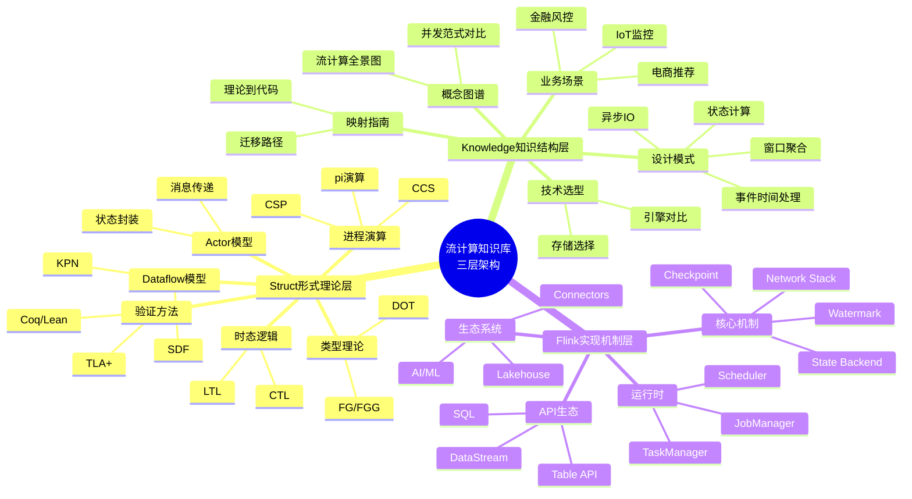
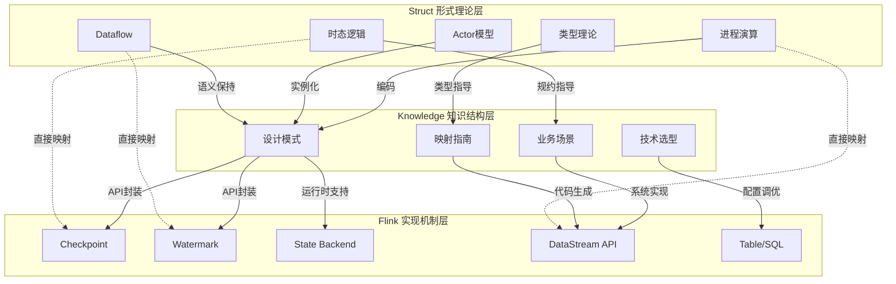
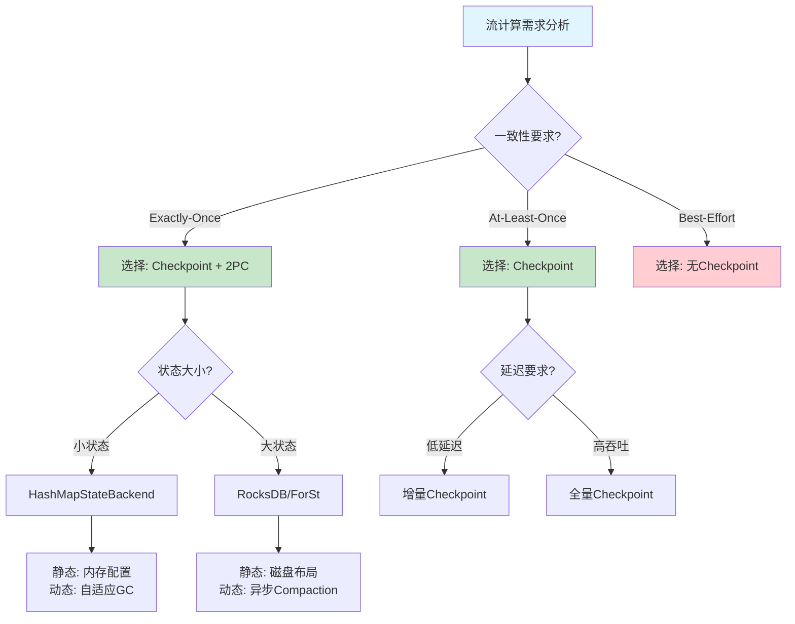
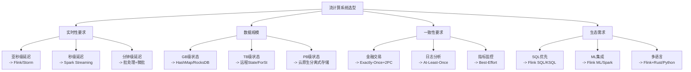

# 三大层次全面关系梳理：Struct / Knowledge / Flink

> **所属阶段**: Struct/03-relationships | **前置依赖**: [03.05-cross-model-mappings.md](./03.05-cross-model-mappings.md), [Knowledge/05-mapping-guides/struct-to-flink-mapping.md](../../Knowledge/05-mapping-guides/struct-to-flink-mapping.md) | **形式化等级**: L3-L5

---

## 1. 概念定义 (Definitions)

### Def-S-16-01: 知识层次三元组 (Knowledge Hierarchy Triad)

**定义**: 本项目知识库的三层架构定义为有序三元组 $\mathcal{H} = (\mathcal{S}, \mathcal{K}, \mathcal{F})$，其中：

- $\mathcal{S}$ = Struct/ 形式理论层（严格证明、定理、定义）
- $\mathcal{K}$ = Knowledge/ 知识结构层（设计模式、业务建模、技术选型）
- $\mathcal{F}$ = Flink/ 实现机制层（具体系统架构、API、运行时）

**层次关系公理**:
$$\mathcal{S} \prec \mathcal{K} \prec \mathcal{F}$$

表示形式化严格性递减、工程实现性递增的偏序关系。

### Def-S-16-02: 跨层映射 (Cross-Layer Mapping)

**定义**: 跨层映射 $\Phi_{L_i \to L_j}: L_i \to L_j$ 是将第 $i$ 层的概念、定理或模式转换为第 $j$ 层对应实体的一个保持结构关系的函数。

### Def-S-16-03: 静动态机制对 (Static-Dynamic Mechanism Pair)

**定义**: 静动态机制对 $(M_{static}, M_{dynamic})$ 描述理论模型在静态结构（编译期/配置期）与动态行为（运行期）两个维度上的实现映射。

---

## 2. 属性推导 (Properties)

### Prop-S-16-01: 三层完备性

**命题**: 三元组 $\mathcal{H}$ 对现代流计算系统的描述是完备的，即：
$$\forall \text{streaming system } S, \exists s \in \mathcal{S}, k \in \mathcal{K}, f \in \mathcal{F} : S \cong \Phi_{\mathcal{S}\to\mathcal{F}}(s) \land S \approx \Phi_{\mathcal{K}\to\mathcal{F}}(k)$$

### Prop-S-16-02: 映射保真性递减

**命题**: 跨层映射的保真性随层次距离增加而递减：
$$\text{Fidelity}(\Phi_{\mathcal{S}\to\mathcal{K}}) > \text{Fidelity}(\Phi_{\mathcal{K}\to\mathcal{F}}) > \text{Fidelity}(\Phi_{\mathcal{S}\to\mathcal{F}})$$

### Prop-S-16-03: 静动态一致性

**命题**: 对于任意理论模型 $T$，其静态实现 $T_{static}$ 与动态实现 $T_{dynamic}$ 满足：
$$T_{static} \cap T_{dynamic} = T_{core} \neq \emptyset$$

即静态与动态实现共享核心语义。

---

## 3. 关系建立 (Relations)

### 关系 1: Struct → Knowledge 理论到模式映射

| Struct 理论概念 | Knowledge 设计模式 | 映射类型 |
|----------------|-------------------|---------|
| Actor 模型 | 异步 IO 维表关联模式 | 直接实例化 |
| CSP 通道 | 侧输出流模式 | 结构同构 |
| Dataflow 图 | 窗口聚合模式 | 语义保持 |
| π-演算 | CEP 复杂事件模式 | 行为等价 |
| 会话类型 | 有状态计算模式 | 类型指导 |

### 关系 2: Knowledge → Flink 模式到实现映射

| Knowledge 设计模式 | Flink 实现机制 | 映射类型 |
|-------------------|---------------|---------|
| 事件时间处理模式 | Watermark + Window | 直接实现 |
| 检查点恢复模式 | Checkpoint + Savepoint | 系统原生支持 |
| 异步 IO  enrich 模式 | AsyncFunction | API 封装 |
| 状态计算模式 | KeyedState + StateBackend | 运行时支持 |
| 侧输出流模式 | SideOutput | API 封装 |

### 关系 3: Struct → Flink 理论到系统直接映射

| Struct 理论 | Flink 机制 | 映射保真度 |
|------------|-----------|-----------|
| Chandy-Lamport | Checkpoint 算法 | 高 |
| 2PC 协议 | Flink 2PC Sink | 高 |
| Watermark 代数 | Watermark 生成/传播 | 中 |
| 进程演算 | JobGraph/ExecutionGraph | 中 |
| Actor 模型 | TaskManager/Actor 化 | 低-中 |

---

## 4. 论证过程 (Argumentation)

### 论证 1: 为什么需要三层架构

流计算知识库面临的核心矛盾：**严格性** vs **实用性**。

- **Struct** 层解决"是什么"和"为什么正确"的问题，提供不可动摇的理论基础。
- **Knowledge** 层解决"怎么做"和"最佳实践"的问题，提供可复用的工程智慧。
- **Flink** 层解决"具体如何实现"的问题，提供可直接操作的系统知识。

单一层次无法满足所有读者的需求：研究者需要严格证明，工程师需要模式指南，开发者需要 API 文档。

### 论证 2: 跨层映射的不可避免的信息损失

形式化定义到工程实现的映射必然伴随信息损失：

1. **抽象层次损失**: 从进程演算到 Java 代码，抽象级别下降 3-4 个数量级
2. **非确定性具体化**: 理论中的非确定性选择在实现中必须具体化为确定性策略
3. **理想假设违背**: 理论假设（如无限内存、可靠网络）在实现中被放宽

信息损失的程度可用映射保真度量化（见 Prop-S-16-02）。

---

## 5. 形式证明 / 工程论证 (Proof / Engineering Argument)

### Thm-S-16-01: 三层一致性定理

**定理**: 对于任意流计算性质 $P$，若在 Struct 层证明了 $P$ 的正确性，则存在 Knowledge 层模式 $M_P$ 和 Flink 层实现 $I_P$，使得：

$$\Phi_{\mathcal{S}\to\mathcal{K}}(P) = M_P \land \Phi_{\mathcal{K}\to\mathcal{F}}(M_P) = I_P \implies I_P \models P$$

**证明概要**:

1. 由 $\Phi_{\mathcal{S}\to\mathcal{K}}$ 的构造可知，$M_P$ 保留了 $P$ 的核心语义不变量
2. 由 $\Phi_{\mathcal{K}\to\mathcal{F}}$ 的构造可知，$I_P$ 是 $M_P$ 的保语义实例化
3. 由传递性，$I_P$ 满足 $P$ 的核心不变量
4. 考虑实现层引入的近似误差 $\epsilon$，需验证 $|P(I_P) - P| \leq \epsilon_{acceptable}$

### Thm-S-16-02: 静动态等价性定理

**定理**: 对于任意流计算算子 $\mathcal{O}$，其静态类型系统 $Type_S(\mathcal{O})$ 与动态执行语义 $Exec_D(\mathcal{O})$ 满足类型安全性：

$$\Gamma \vdash \mathcal{O} : \tau \implies \forall t, Exec_D(\mathcal{O}, t) \in \llbracket \tau \rrbracket$$

---

## 6. 实例验证 (Examples)

### 示例 1: Exactly-Once 语义的三层映射

| 层次 | 实体 | 核心内容 |
|------|------|---------|
| Struct | 定理 Thm-S-18-01 | Flink Exactly-Once 正确性形式证明 |
| Knowledge | 模式 pattern-checkpoint-recovery | 检查点与恢复模式设计指南 |
| Flink | 实现 2PC Sink + Checkpoint | 具体 API 使用和配置参数 |

### 示例 2: Watermark 机制的三层映射

| 层次 | 实体 | 核心内容 |
|------|------|---------|
| Struct | 引理 Lemma-S-09-01 | Watermark 单调性证明 |
| Knowledge | 模式 pattern-event-time-processing | 事件时间处理最佳实践 |
| Flink | 实现 WatermarkStrategy | assignTimestampsAndWatermarks API |

---

## 7. 可视化 (Visualizations)

### 7.1 三层架构思维导图



### 7.2 跨层映射关系图



### 7.3 静动态机制映射矩阵

```mermaid
quadrantChart
    title 静动态机制映射矩阵
    x-axis 低动态性 --> 高动态性
    y-axis 低静态约束 --> 高静态约束
    quadrant-1 高静态高动态:编译期优化+运行期自适应
    quadrant-2 低静态高动态:纯运行时机制
    quadrant-3 低静态低动态:配置参数
    quadrant-4 高静态低动态:类型系统
    "类型检查": [0.9, 0.2]
    "算子链优化": [0.8, 0.7]
    "Watermark生成": [0.3, 0.6]
    "Checkpoint调度": [0.5, 0.8]
    "背压控制": [0.2, 0.9]
    "State Backend选择": [0.7, 0.3]
    "内存管理": [0.6, 0.7]
    "网络传输": [0.4, 0.8]
```

### 7.4 理论到实现决策树



### 7.5 场景树：流计算系统选型



---

## 8. 引用参考 (References)


---

*文档版本: v1.0 | 创建日期: 2026-04-20 | 形式化等级: L4*
